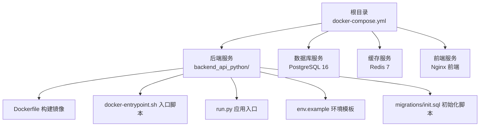
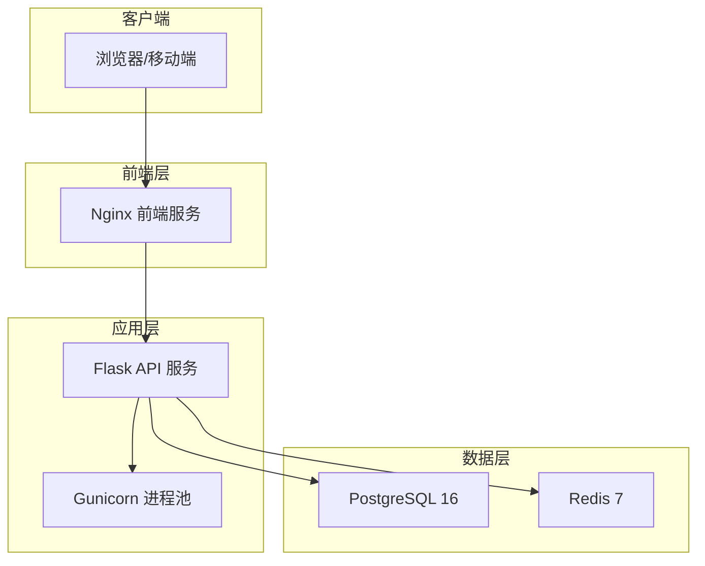
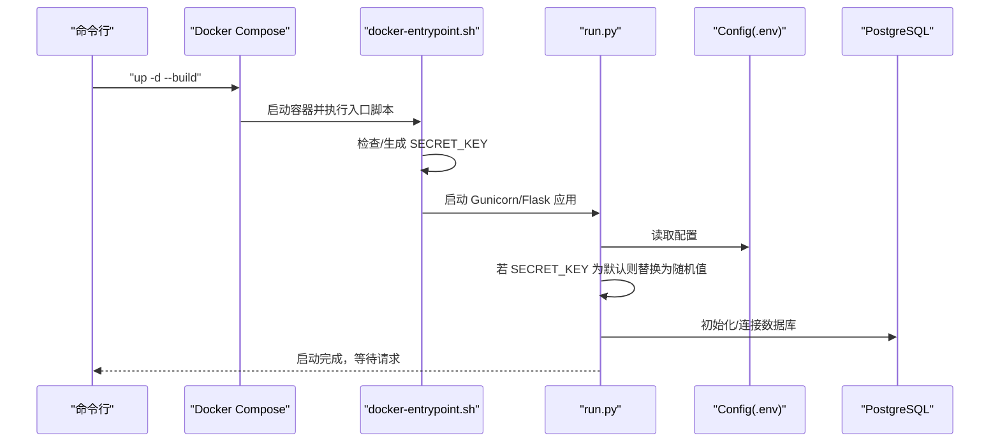
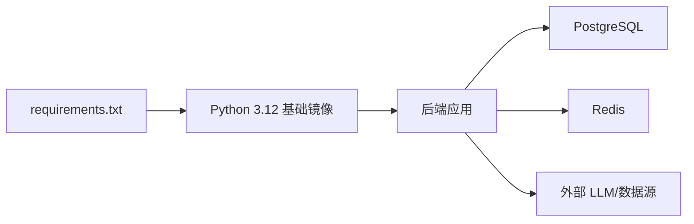

# 快速开始

<cite>
**本文引用的文件**
- [README.md](file://README.md)
- [backend_api_python/README.md](file://backend_api_python/README.md)
- [docker-compose.yml](file://docker-compose.yml)
- [backend_api_python/env.example](file://backend_api_python/env.example)
- [backend_api_python/Dockerfile](file://backend_api_python/Dockerfile)
- [backend_api_python/docker-entrypoint.sh](file://backend_api_python/docker-entrypoint.sh)
- [scripts/generate-secret-key.sh](file://scripts/generate-secret-key.sh)
- [scripts/generate-secret-key.ps1](file://scripts/generate-secret-key.ps1)
- [backend_api_python/run.py](file://backend_api_python/run.py)
- [backend_api_python/start.sh](file://backend_api_python/start.sh)
- [backend_api_python/requirements.txt](file://backend_api_python/requirements.txt)
- [backend_api_python/migrations/init.sql](file://backend_api_python/migrations/init.sql)
- [backend_api_python/app/routes/health.py](file://backend_api_python/app/routes/health.py)
</cite>

## 目录
1. [简介](#简介)
2. [项目结构](#项目结构)
3. [核心组件](#核心组件)
4. [架构总览](#架构总览)
5. [详细组件分析](#详细组件分析)
6. [依赖关系分析](#依赖关系分析)
7. [性能注意事项](#性能注意事项)
8. [故障排除指南](#故障排除指南)
9. [结论](#结论)
10. [附录](#附录)

## 简介
QuantDinger 是一个“自托管、本地优先”的量化交易与算法交易平台，支持 AI 市场研究、Python 指标与策略开发、回测、实盘执行、组合监控与告警、多用户运营与商业化能力。本“快速开始”指南面向首次使用者，目标是在 2 分钟内完成安装与启动，并成功访问前端页面。

- 平台特性概览：AI 分析、图表、策略逻辑、回测、快捷交易、实盘运行、多用户与计费、商业能力等。
- 运行方式：推荐使用 Docker Compose 一键部署；也可进行本地开发模式。
- 默认访问：前端 http://localhost:8888；默认登录凭据为 quantdinger / 123456。
- 健康检查：后端健康检查端点 http://localhost:5000/api/health。

**章节来源**
- [README.md:32–50:32-50](file://README.md#L32-L50)
- [README.md:323–359:323-359](file://README.md#L323-L359)

## 项目结构
仓库采用“前后端分离 + 容器化”的组织方式：
- backend_api_python：Flask 后端源码、路由、服务、数据迁移脚本、Docker 构建与入口脚本。
- frontend：预构建的 Vue 前端包与 Nginx 配置。
- docs：产品与部署相关文档。
- scripts：辅助脚本，如生成密钥。
- 根目录 docker-compose.yml：定义数据库、缓存、后端、前端四服务及健康检查。

**图示来源**
- [docker-compose.yml:25–167:25-167](file://docker-compose.yml#L25-L167)
- [backend_api_python/Dockerfile:1–62:1-62](file://backend_api_python/Dockerfile#L1-L62)
- [backend_api_python/docker-entrypoint.sh:1–49:1-49](file://backend_api_python/docker-entrypoint.sh#L1-L49)
- [backend_api_python/run.py:1–134:1-134](file://backend_api_python/run.py#L1-L134)
- [backend_api_python/env.example:1–288:1-288](file://backend_api_python/env.example#L1-L288)
- [backend_api_python/migrations/init.sql:1–200:1-200](file://backend_api_python/migrations/init.sql#L1-L200)

**章节来源**
- [README.md:466–484:466-484](file://README.md#L466-L484)
- [backend_api_python/README.md:15–33:15-33](file://backend_api_python/README.md#L15-L33)

## 核心组件
- 后端 API（Flask + Gunicorn）：提供认证、用户管理、AI 分析、回测、策略运行、执行适配器等接口。
- 数据库（PostgreSQL 16）：存储用户、策略、历史、积分、会员、OAuth 状态等。
- 缓存（Redis 7）：可选的缓存层与工作队列支持。
- 前端（Nginx 预构建 Vue 包）：静态资源服务，端口 80 映射至宿主机端口。
- Docker Compose：统一编排四服务，内置健康检查与依赖顺序。

**章节来源**
- [README.md:246–258:246-258](file://README.md#L246-L258)
- [docker-compose.yml:25–167:25-167](file://docker-compose.yml#L25-L167)

## 架构总览
下图展示容器化部署的端到端交互：前端通过 Nginx 提供静态页面，后端提供 API，数据库与缓存支撑状态与并发。

**图示来源**
- [docker-compose.yml:25–167:25-167](file://docker-compose.yml#L25-L167)
- [backend_api_python/Dockerfile:1–62:1-62](file://backend_api_python/Dockerfile#L1-L62)

## 详细组件分析

### 环境要求与前置条件
- 必需软件
  - Docker 与 Docker Compose（容器化部署）
  - Python 3.10+（本地开发可选）
- 系统建议
  - CPU：至少 2 核
  - 内存：至少 2 GB
  - 存储：至少 10 GB 可用空间（含日志与数据卷）
- 网络
  - 需要访问外网以拉取镜像与调用外部 LLM/市场数据接口（可配置代理）

**章节来源**
- [README.md:25–28:25-28](file://README.md#L25-L28)
- [backend_api_python/README.md:76–80:76-80](file://backend_api_python/README.md#L76-L80)

### Linux/macOS 快速安装步骤
- 步骤 1：克隆仓库并进入目录
  - git clone https://github.com/brokermr810/QuantDinger.git && cd QuantDinger
- 步骤 2：复制并生成密钥
  - cp backend_api_python/env.example backend_api_python/.env
  - ./scripts/generate-secret-key.sh
- 步骤 3：启动服务
  - docker-compose up -d --build
- 步骤 4：访问与验证
  - 前端：http://localhost:8888
  - 登录：quantdinger / 123456
  - 健康检查：http://localhost:5000/api/health

**章节来源**
- [README.md:327–359:327-359](file://README.md#L327-L359)
- [scripts/generate-secret-key.sh:1–34:1-34](file://scripts/generate-secret-key.sh#L1-L34)

### Windows PowerShell 快速安装步骤
- 步骤 1：克隆仓库并进入目录
  - git clone https://github.com/brokermr810/QuantDinger.git
  - cd QuantDinger
- 步骤 2：复制并生成密钥
  - Copy-Item backend_api_python\env.example -Destination backend_api_python\.env
  - $key = py -c "import secrets; print(secrets.token_hex(32))"
  - (Get-Content backend_api_python\.env) -replace '^SECRET_KEY=.*$', "SECRET_KEY=$key" | Set-Content backend_api_python\.env -Encoding UTF8
- 步骤 3：启动服务
  - docker-compose up -d --build
- 步骤 4：访问与验证
  - 前端：http://localhost:8888
  - 登录：quantdinger / 123456
  - 健康检查：http://localhost:5000/api/health

**章节来源**
- [README.md:337–359:337-359](file://README.md#L337-L359)
- [scripts/generate-secret-key.ps1:1–32:1-32](file://scripts/generate-secret-key.ps1#L1-L32)

### 环境变量与配置要点
- 主要配置位置
  - 后端主配置：backend_api_python/.env（由 run.py 加载）
  - 根目录可选：.env（用于自定义端口与镜像前缀）
- 关键项
  - SECRET_KEY：必须设置为强随机值，否则容器不会启动
  - ADMIN_USER / ADMIN_PASSWORD：首次启动创建管理员账户
  - DATABASE_URL：PostgreSQL 连接串
  - FRONTEND_URL：前端地址，用于 OAuth 回调
  - LLM_PROVIDER / OPENROUTER_API_KEY：AI 分析能力
  - WORKERS 与连接池：DB_POOL_MIN/MAX、GUNICORN_WORKERS/THREADS、EXECUTOR_WORKERS
- 可选项
  - PROXY_URL：出站代理
  - ALLOW_LOCAL_DESKTOP_BROKERS：是否允许本地桌面经纪商（IBKR/MT5）
  - TURNSTILE_*：验证码
  - BILLING_* / USDT_*：计费与 USDT 支付

**章节来源**
- [backend_api_python/env.example:1–288:1-288](file://backend_api_python/env.example#L1-L288)
- [docker-compose.yml:80–132:80-132](file://docker-compose.yml#L80-L132)

### Docker Compose 服务与端口映射
- 服务与端口
  - postgres：5432（可映射到宿主机 127.0.0.1:5432）
  - redis：6379（可映射到宿主机 127.0.0.1:6379）
  - backend：5000（可映射到宿主机 127.0.0.1:5000）
  - frontend：80（映射到宿主机 8888）
- 健康检查
  - backend：curl -f http://localhost:5000/api/health
  - postgres：pg_isready
  - redis：redis-cli ping
  - frontend：curl -f http://localhost/health

**章节来源**
- [docker-compose.yml:29–154:29-154](file://docker-compose.yml#L29-L154)

### 后端启动流程与密钥校验
后端启动时会读取 .env，若未设置或使用默认 SECRET_KEY，则自动注入随机密钥并提示持久化配置。

**图示来源**
- [backend_api_python/docker-entrypoint.sh:1–49:1-49](file://backend_api_python/docker-entrypoint.sh#L1-L49)
- [backend_api_python/run.py:104–134:104-134](file://backend_api_python/run.py#L104-L134)
- [docker-compose.yml:80–132:80-132](file://docker-compose.yml#L80-L132)

### 健康检查端点
- 后端健康检查：GET /api/health
- 返回字段：status、timestamp、name/version（视具体路由而定）
- 建议在反向代理或编排工具中定期探测该端点以确认可用性

**章节来源**
- [backend_api_python/app/routes/health.py:1–34:1-34](file://backend_api_python/app/routes/health.py#L1-L34)
- [docker-compose.yml:127–131:127-131](file://docker-compose.yml#L127-L131)

### 默认登录凭据
- 用户名：quantdinger
- 密码：123456
- 首次启动会根据 ADMIN_USER/ADMIN_PASSWORD 创建管理员账户

**章节来源**
- [backend_api_python/env.example:14–15:14-15](file://backend_api_python/env.example#L14-L15)
- [backend_api_python/migrations/init.sql:35–37:35-37](file://backend_api_python/migrations/init.sql#L35-L37)

## 依赖关系分析
- 后端依赖（摘录）
  - Web 框架与安全：Flask、Werkzeug、PyJWT、cryptography、bcrypt
  - 数据库：psycopg2-binary
  - 缓存：redis
  - 市场数据：ccxt、yfinance、finnhub-python、akshare
  - 生产服务器：gunicorn
  - 交互式经纪商：ib_insync（可选）
- Docker 构建链路
  - 基础镜像：python:3.12-slim-bookworm（可被镜像前缀覆盖）
  - 依赖安装：优先使用阿里云镜像源，失败回退官方源
  - 入口：docker-entrypoint.sh 负责密钥校验与启动

**图示来源**
- [backend_api_python/requirements.txt:1–37:1-37](file://backend_api_python/requirements.txt#L1-L37)
- [backend_api_python/Dockerfile:1–62:1-62](file://backend_api_python/Dockerfile#L1-L62)

**章节来源**
- [backend_api_python/requirements.txt:1–37:1-37](file://backend_api_python/requirements.txt#L1-L37)
- [backend_api_python/Dockerfile:1–62:1-62](file://backend_api_python/Dockerfile#L1-L62)

## 性能注意事项
- 数据库连接池
  - DB_POOL_MIN/MAX：根据并发用户与机器人数量调整，默认适合约 50 并发
  - PG 的 max_connections 需大于 DB_POOL_MAX
- 执行器与线程
  - MARKET_EXECUTOR_WORKERS + PORTFOLIO_EXECUTOR_WORKERS 之和应小于 DB_POOL_MAX
  - GUNICORN_WORKERS × GUNICORN_THREADS 控制并发处理能力
- 缓存与内存
  - Redis 可启用以降低数据库压力，注意 maxmemory 策略
- 端口与网络
  - 将服务绑定到 127.0.0.1:PORT 仅暴露本机，生产建议反向代理 + HTTPS

[本节为通用指导，无需特定文件引用]

## 故障排除指南
- 后端无法启动（容器退出）
  - 症状：backend 容器健康检查失败或立即退出
  - 排查：确认 backend/.env 中 SECRET_KEY 已修改为随机值
  - 参考：入口脚本会在缺少或默认密钥时自动注入随机值
- 健康检查失败
  - 使用 docker-compose logs -f backend 查看日志
  - 确认数据库与缓存服务已就绪（postgres/redis 健康）
- 数据库连接失败
  - 检查 DATABASE_URL 格式与可达性
  - 确认初始化 SQL 已执行（首次启动自动执行）
- 端口冲突
  - 修改根目录 .env 中 FRONTEND_PORT、BACKEND_PORT、DB_PORT、REDIS_PORT
- 出站受限
  - 设置 PROXY_URL；必要时配置 LIVE_TRADING_CA_BUNDLE 或关闭 SSL 校验（不推荐）
- 本地桌面经纪商不可用
  - 在公有云 SaaS 场景下，将 ALLOW_LOCAL_DESKTOP_BROKERS 设为 false
- 常用命令
  - docker-compose ps / logs -f backend / restart backend / up -d --build / down

**章节来源**
- [backend_api_python/docker-entrypoint.sh:25–44:25-44](file://backend_api_python/docker-entrypoint.sh#L25-L44)
- [backend_api_python/run.py:109–120:109-120](file://backend_api_python/run.py#L109-L120)
- [docker-compose.yml:54–58:54-58](file://docker-compose.yml#L54-L58)
- [docker-compose.yml:72–76:72-76](file://docker-compose.yml#L72-L76)
- [docker-compose.yml:127–131:127-131](file://docker-compose.yml#L127-L131)
- [backend_api_python/README.md:231–237:231-237](file://backend_api_python/README.md#L231-L237)

## 结论
按照本指南，您可以在 2 分钟内完成 QuantDinger 的安装与启动，并通过浏览器访问前端、使用默认凭据登录、并通过健康检查端点确认服务可用。建议在生产环境中进一步完善密钥、数据库、代理与安全配置，并按需启用 AI、计费与通知等功能模块。

[本节为总结性内容，无需特定文件引用]

## 附录

### 常用命令清单
- 启动：docker-compose up -d --build
- 查看状态：docker-compose ps
- 实时日志：docker-compose logs -f backend
- 重启后端：docker-compose restart backend
- 停止：docker-compose down

**章节来源**
- [README.md:361–369:361-369](file://README.md#L361-L369)

### 端口与服务映射表
- 前端：容器 80 → 宿主机 8888
- 后端：容器 5000 → 宿主机 5000（可绑定 127.0.0.1）
- 数据库：容器 5432 → 宿主机 5432（可绑定 127.0.0.1）
- 缓存：容器 6379 → 宿主机 6379（可绑定 127.0.0.1）

**章节来源**
- [docker-compose.yml:50–145:50-145](file://docker-compose.yml#L50-L145)

### 默认凭据与健康检查
- 默认登录：用户名 quantdinger / 密码 123456
- 健康检查：http://localhost:5000/api/health

**章节来源**
- [backend_api_python/env.example:14–15:14-15](file://backend_api_python/env.example#L14-L15)
- [README.md:348–352:348-352](file://README.md#L348-L352)