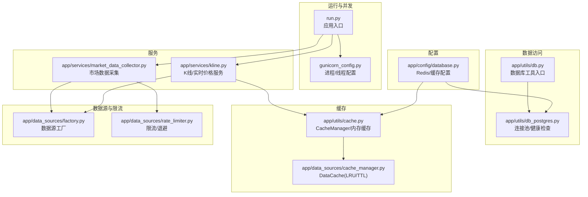
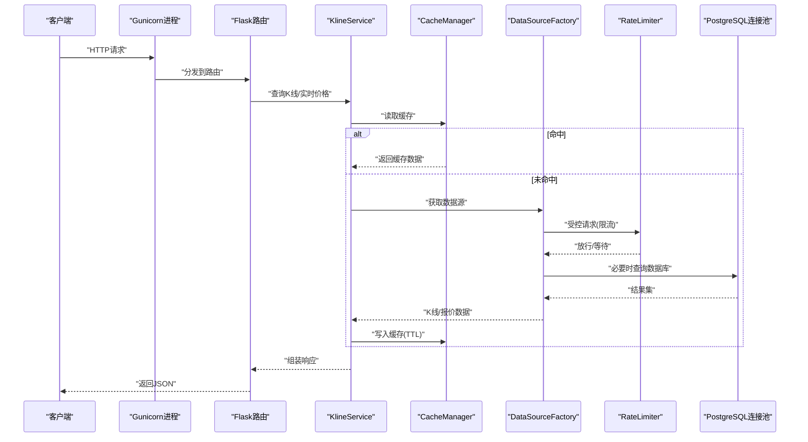
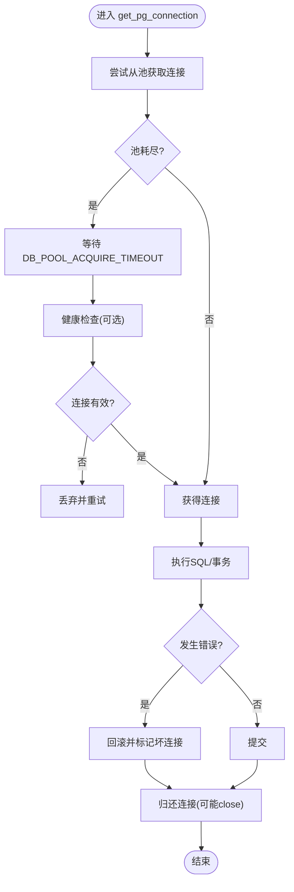
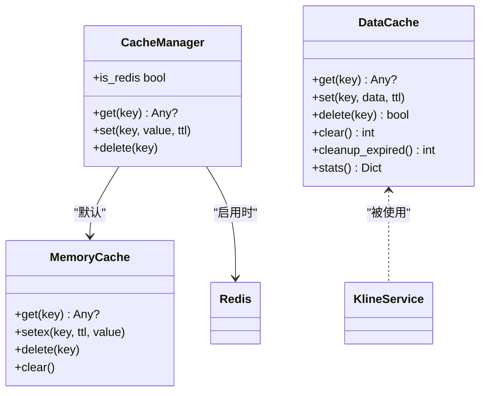
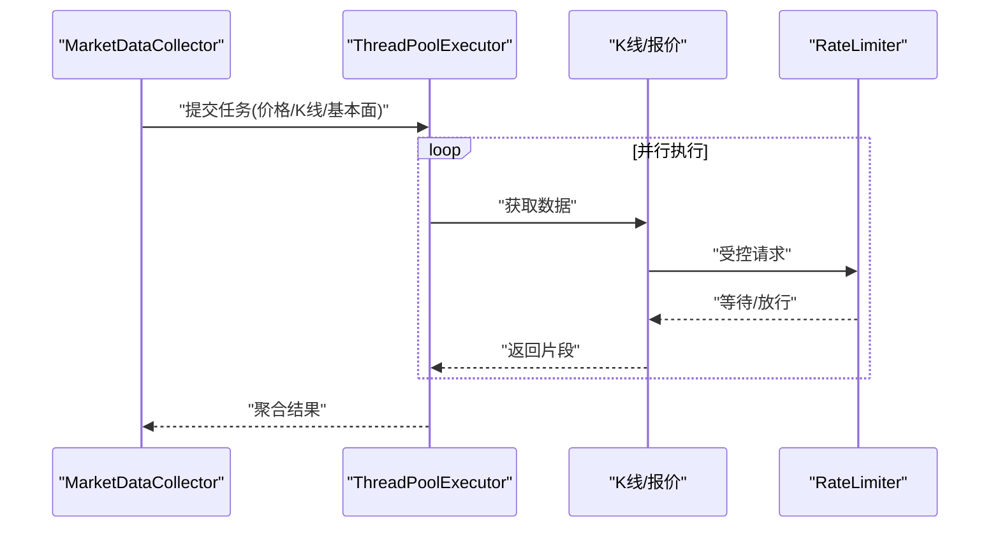
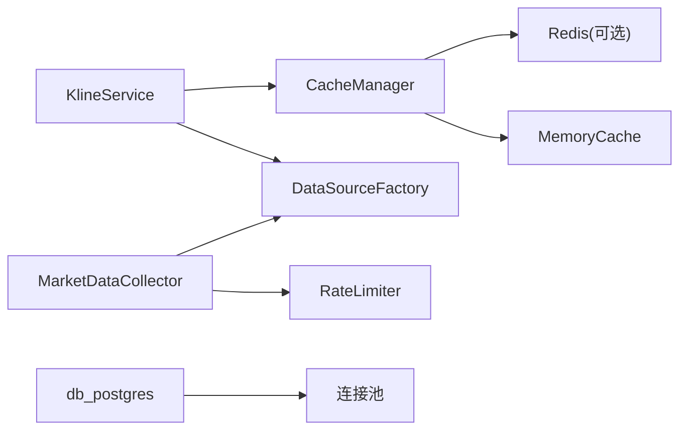

# 性能优化

<cite>
**本文引用的文件**
- [backend_api_python/app/config/database.py](file://backend_api_python/app/config/database.py)
- [backend_api_python/app/utils/db_postgres.py](file://backend_api_python/app/utils/db_postgres.py)
- [backend_api_python/app/utils/db.py](file://backend_api_python/app/utils/db.py)
- [backend_api_python/app/utils/cache.py](file://backend_api_python/app/utils/cache.py)
- [backend_api_python/app/data_sources/cache_manager.py](file://backend_api_python/app/data_sources/cache_manager.py)
- [backend_api_python/app/data_sources/rate_limiter.py](file://backend_api_python/app/data_sources/rate_limiter.py)
- [backend_api_python/app/services/kline.py](file://backend_api_python/app/services/kline.py)
- [backend_api_python/app/services/market_data_collector.py](file://backend_api_python/app/services/market_data_collector.py)
- [backend_api_python/app/data_sources/factory.py](file://backend_api_python/app/data_sources/factory.py)
- [backend_api_python/gunicorn_config.py](file://backend_api_python/gunicorn_config.py)
- [backend_api_python/run.py](file://backend_api_python/run.py)
- [backend_api_python/app/utils/logger.py](file://backend_api_python/app/utils/logger.py)
- [backend_api_python/app/routes/health.py](file://backend_api_python/app/routes/health.py)
</cite>

## 目录
1. [简介](#简介)
2. [项目结构](#项目结构)
3. [核心组件](#核心组件)
4. [架构总览](#架构总览)
5. [详细组件分析](#详细组件分析)
6. [依赖分析](#依赖分析)
7. [性能考量](#性能考量)
8. [故障排查指南](#故障排查指南)
9. [结论](#结论)
10. [附录](#附录)

## 简介
本指南面向QuantDinger后端性能优化，聚焦数据库优化、缓存策略、并发控制与资源管理，结合现有代码实现，给出可落地的调优策略、监控指标、瓶颈识别与优化实施方法，并覆盖负载/压力/基准测试与扩展性、集群与高可用最佳实践。

## 项目结构
后端采用Python + Flask + Gunicorn部署模型，核心性能相关模块分布如下：
- 配置层：数据库与缓存配置
- 数据访问层：PostgreSQL连接池封装与工具
- 缓存层：本地内存缓存与Redis备选
- 数据源层：数据源工厂与限流策略
- 服务层：K线服务、市场数据采集服务
- 运行与并发：Gunicorn配置与入口脚本
- 日志与健康检查：统一日志与健康检查路由

**图示来源**
- [backend_api_python/run.py:1-134](file://backend_api_python/run.py#L1-L134)
- [backend_api_python/gunicorn_config.py:1-36](file://backend_api_python/gunicorn_config.py#L1-L36)
- [backend_api_python/app/config/database.py:1-90](file://backend_api_python/app/config/database.py#L1-L90)
- [backend_api_python/app/utils/db.py:1-66](file://backend_api_python/app/utils/db.py#L1-L66)
- [backend_api_python/app/utils/db_postgres.py:1-495](file://backend_api_python/app/utils/db_postgres.py#L1-L495)
- [backend_api_python/app/utils/cache.py:1-129](file://backend_api_python/app/utils/cache.py#L1-L129)
- [backend_api_python/app/data_sources/cache_manager.py:1-233](file://backend_api_python/app/data_sources/cache_manager.py#L1-L233)
- [backend_api_python/app/data_sources/factory.py:1-169](file://backend_api_python/app/data_sources/factory.py#L1-L169)
- [backend_api_python/app/data_sources/rate_limiter.py:1-273](file://backend_api_python/app/data_sources/rate_limiter.py#L1-L273)
- [backend_api_python/app/services/kline.py:1-191](file://backend_api_python/app/services/kline.py#L1-L191)
- [backend_api_python/app/services/market_data_collector.py:1-800](file://backend_api_python/app/services/market_data_collector.py#L1-L800)

**章节来源**
- [backend_api_python/run.py:1-134](file://backend_api_python/run.py#L1-L134)
- [backend_api_python/gunicorn_config.py:1-36](file://backend_api_python/gunicorn_config.py#L1-L36)
- [backend_api_python/app/config/database.py:1-90](file://backend_api_python/app/config/database.py#L1-L90)
- [backend_api_python/app/utils/db.py:1-66](file://backend_api_python/app/utils/db.py#L1-L66)
- [backend_api_python/app/utils/db_postgres.py:1-495](file://backend_api_python/app/utils/db_postgres.py#L1-L495)
- [backend_api_python/app/utils/cache.py:1-129](file://backend_api_python/app/utils/cache.py#L1-L129)
- [backend_api_python/app/data_sources/cache_manager.py:1-233](file://backend_api_python/app/data_sources/cache_manager.py#L1-L233)
- [backend_api_python/app/data_sources/factory.py:1-169](file://backend_api_python/app/data_sources/factory.py#L1-L169)
- [backend_api_python/app/data_sources/rate_limiter.py:1-273](file://backend_api_python/app/data_sources/rate_limiter.py#L1-L273)
- [backend_api_python/app/services/kline.py:1-191](file://backend_api_python/app/services/kline.py#L1-L191)
- [backend_api_python/app/services/market_data_collector.py:1-800](file://backend_api_python/app/services/market_data_collector.py#L1-L800)

## 核心组件
- 数据库连接池与健康检查：通过环境变量控制池大小、获取超时与健康检查开关，支持连接回收与健康探测，避免“长事务”与死连接污染池。
- 缓存体系：本地内存缓存作为默认方案，Redis可选启用；同时提供进程内DataCache（LRU/TTL）与业务级缓存（K线/实时价格/股票信息）。
- 并发与限流：Gunicorn gthread模式提升I/O并发；数据采集阶段使用线程池并行拉取；外部数据源引入指数退避与随机抖动限流。
- 数据源抽象：工厂模式屏蔽不同市场与交易所差异，统一K线与报价接口，便于扩展与替换。

**章节来源**
- [backend_api_python/app/utils/db_postgres.py:53-56](file://backend_api_python/app/utils/db_postgres.py#L53-L56)
- [backend_api_python/app/utils/db_postgres.py:107-161](file://backend_api_python/app/utils/db_postgres.py#L107-L161)
- [backend_api_python/app/utils/db_postgres.py:184-234](file://backend_api_python/app/utils/db_postgres.py#L184-L234)
- [backend_api_python/app/utils/cache.py:49-129](file://backend_api_python/app/utils/cache.py#L49-L129)
- [backend_api_python/app/data_sources/cache_manager.py:44-174](file://backend_api_python/app/data_sources/cache_manager.py#L44-L174)
- [backend_api_python/gunicorn_config.py:10-36](file://backend_api_python/gunicorn_config.py#L10-L36)
- [backend_api_python/app/data_sources/rate_limiter.py:109-164](file://backend_api_python/app/data_sources/rate_limiter.py#L109-L164)
- [backend_api_python/app/data_sources/factory.py:27-102](file://backend_api_python/app/data_sources/factory.py#L27-L102)

## 架构总览
下图展示从请求到数据获取的关键路径，以及性能相关组件的交互：

**图示来源**
- [backend_api_python/app/services/kline.py:21-65](file://backend_api_python/app/services/kline.py#L21-L65)
- [backend_api_python/app/utils/cache.py:100-124](file://backend_api_python/app/utils/cache.py#L100-L124)
- [backend_api_python/app/data_sources/factory.py:105-139](file://backend_api_python/app/data_sources/factory.py#L105-L139)
- [backend_api_python/app/data_sources/rate_limiter.py:170-231](file://backend_api_python/app/data_sources/rate_limiter.py#L170-L231)
- [backend_api_python/app/utils/db_postgres.py:402-438](file://backend_api_python/app/utils/db_postgres.py#L402-L438)

## 详细组件分析

### 数据库连接池与健康检查
- 关键参数
  - 最小/最大连接数：DB_POOL_MIN、DB_POOL_MAX
  - 获取超时：DB_POOL_ACQUIRE_TIMEOUT
  - 健康检查：DB_POOL_HEALTH_CHECK
- 连接池创建与选项
  - 线程化连接池、连接超时、时区设置、keepalives配置
- 获取连接策略
  - 超时时等待而非立即失败，支持健康检查与丢弃坏连接
- 关闭与清理
  - 应用退出时关闭连接池，避免资源泄漏

**图示来源**
- [backend_api_python/app/utils/db_postgres.py:184-234](file://backend_api_python/app/utils/db_postgres.py#L184-L234)
- [backend_api_python/app/utils/db_postgres.py:402-438](file://backend_api_python/app/utils/db_postgres.py#L402-L438)

**章节来源**
- [backend_api_python/app/utils/db_postgres.py:53-56](file://backend_api_python/app/utils/db_postgres.py#L53-L56)
- [backend_api_python/app/utils/db_postgres.py:107-161](file://backend_api_python/app/utils/db_postgres.py#L107-L161)
- [backend_api_python/app/utils/db_postgres.py:164-182](file://backend_api_python/app/utils/db_postgres.py#L164-L182)
- [backend_api_python/app/utils/db_postgres.py:485-495](file://backend_api_python/app/utils/db_postgres.py#L485-L495)

### 缓存策略与实现
- 本地缓存（默认）
  - CacheManager：内存缓存，支持TTL与JSON序列化
  - DataCache：进程内LRU+TTL，支持清理过期与命中统计
- 业务缓存
  - K线缓存、实时价格缓存、股票信息缓存，分别设定TTL与容量
- Redis缓存（可选）
  - 通过环境变量启用，自动降级为内存缓存

**图示来源**
- [backend_api_python/app/utils/cache.py:49-129](file://backend_api_python/app/utils/cache.py#L49-L129)
- [backend_api_python/app/data_sources/cache_manager.py:44-174](file://backend_api_python/app/data_sources/cache_manager.py#L44-L174)
- [backend_api_python/app/services/kline.py:14-65](file://backend_api_python/app/services/kline.py#L14-L65)

**章节来源**
- [backend_api_python/app/utils/cache.py:17-47](file://backend_api_python/app/utils/cache.py#L17-L47)
- [backend_api_python/app/utils/cache.py:100-124](file://backend_api_python/app/utils/cache.py#L100-L124)
- [backend_api_python/app/data_sources/cache_manager.py:27-174](file://backend_api_python/app/data_sources/cache_manager.py#L27-L174)
- [backend_api_python/app/config/database.py:49-89](file://backend_api_python/app/config/database.py#L49-L89)
- [backend_api_python/app/services/kline.py:14-65](file://backend_api_python/app/services/kline.py#L14-L65)

### 并发控制与限流
- Gunicorn
  - gthread工作模式，线程数可配置，适合I/O密集型
  - 避免preload，确保后台任务在worker进程中启动
- 数据采集
  - 使用ThreadPoolExecutor并行获取核心数据
  - 本地指标计算不依赖外部服务
- 外部请求限流
  - RateLimiter：最小间隔+随机抖动
  - 指数退避重试：可配置最大重试次数与延迟上限

**图示来源**
- [backend_api_python/app/services/market_data_collector.py:127-157](file://backend_api_python/app/services/market_data_collector.py#L127-L157)
- [backend_api_python/app/data_sources/rate_limiter.py:109-164](file://backend_api_python/app/data_sources/rate_limiter.py#L109-L164)
- [backend_api_python/gunicorn_config.py:10-36](file://backend_api_python/gunicorn_config.py#L10-L36)

**章节来源**
- [backend_api_python/app/services/market_data_collector.py:127-224](file://backend_api_python/app/services/market_data_collector.py#L127-L224)
- [backend_api_python/app/data_sources/rate_limiter.py:170-231](file://backend_api_python/app/data_sources/rate_limiter.py#L170-L231)
- [backend_api_python/gunicorn_config.py:10-36](file://backend_api_python/gunicorn_config.py#L10-L36)

### 数据源抽象与工厂
- 市场标准化与别名映射
- 工厂按市场类型创建具体数据源
- 统一K线与报价接口，保证排序一致性

**章节来源**
- [backend_api_python/app/data_sources/factory.py:12-44](file://backend_api_python/app/data_sources/factory.py#L12-L44)
- [backend_api_python/app/data_sources/factory.py:80-102](file://backend_api_python/app/data_sources/factory.py#L80-L102)
- [backend_api_python/app/data_sources/factory.py:105-139](file://backend_api_python/app/data_sources/factory.py#L105-L139)

## 依赖分析
- 组件耦合
  - KlineService依赖CacheManager与DataSourceFactory
  - MarketDataCollector依赖DataSourceFactory与RateLimiter
  - 数据访问层通过db_postgres统一连接池
- 外部依赖
  - Redis（可选）、psycopg2、第三方行情/数据源SDK
- 循环依赖
  - 当前模块间无明显循环导入

**图示来源**
- [backend_api_python/app/services/kline.py:14-65](file://backend_api_python/app/services/kline.py#L14-L65)
- [backend_api_python/app/utils/cache.py:49-129](file://backend_api_python/app/utils/cache.py#L49-L129)
- [backend_api_python/app/data_sources/factory.py:27-102](file://backend_api_python/app/data_sources/factory.py#L27-L102)
- [backend_api_python/app/data_sources/rate_limiter.py:109-164](file://backend_api_python/app/data_sources/rate_limiter.py#L109-L164)
- [backend_api_python/app/utils/db_postgres.py:107-161](file://backend_api_python/app/utils/db_postgres.py#L107-L161)

**章节来源**
- [backend_api_python/app/services/kline.py:14-65](file://backend_api_python/app/services/kline.py#L14-L65)
- [backend_api_python/app/utils/cache.py:49-129](file://backend_api_python/app/utils/cache.py#L49-L129)
- [backend_api_python/app/data_sources/factory.py:27-102](file://backend_api_python/app/data_sources/factory.py#L27-L102)
- [backend_api_python/app/data_sources/rate_limiter.py:109-164](file://backend_api_python/app/data_sources/rate_limiter.py#L109-L164)
- [backend_api_python/app/utils/db_postgres.py:107-161](file://backend_api_python/app/utils/db_postgres.py#L107-L161)

## 性能考量

### 数据库优化
- 连接池参数
  - DB_POOL_MIN/DB_POOL_MAX：根据并发与CPU核数调整，避免过大导致上下文切换开销，过小导致排队等待
  - DB_POOL_ACQUIRE_TIMEOUT：与GUNICORN_WORKERS/THREADS匹配，避免瞬时拥塞
  - DB_POOL_HEALTH_CHECK：生产环境建议开启，降低“假活”连接影响
- 连接生命周期
  - 保持UTC时区，避免每次checkout SET TIME ZONE
  - keepalives配置减少NAT/网络中断导致的僵尸连接
- 错误处理
  - 池耗尽时等待而非直接失败，配合超时与日志告警
  - 发生OperationalError/InterfaceError时丢弃坏连接

**章节来源**
- [backend_api_python/app/utils/db_postgres.py:53-56](file://backend_api_python/app/utils/db_postgres.py#L53-L56)
- [backend_api_python/app/utils/db_postgres.py:107-161](file://backend_api_python/app/utils/db_postgres.py#L107-L161)
- [backend_api_python/app/utils/db_postgres.py:184-234](file://backend_api_python/app/utils/db_postgres.py#L184-L234)
- [backend_api_python/app/utils/db_postgres.py:402-438](file://backend_api_python/app/utils/db_postgres.py#L402-L438)

### 缓存策略
- 本地优先
  - CacheManager默认使用内存缓存，减少网络RTT
  - Redis仅在明确启用时使用，自动降级
- 进程内缓存
  - DataCache提供LRU与TTL，适合热点数据快速命中
  - 统计命中率与清理过期，便于容量规划
- 业务缓存
  - K线/实时价格/股票信息分别设定TTL，避免过期与内存膨胀
- 命中路径
  - KlineService先查缓存，未命中再走数据源与数据库，最后写回缓存

**章节来源**
- [backend_api_python/app/utils/cache.py:63-99](file://backend_api_python/app/utils/cache.py#L63-L99)
- [backend_api_python/app/data_sources/cache_manager.py:44-174](file://backend_api_python/app/data_sources/cache_manager.py#L44-L174)
- [backend_api_python/app/services/kline.py:21-65](file://backend_api_python/app/services/kline.py#L21-L65)

### 并发控制与资源管理
- Gunicorn
  - gthread + THREADS：提升I/O并发，适合Flask风格单进程模型
  - WORKERS：多核吞吐，注意与池/缓存协调
  - 避免preload，确保后台任务在worker中运行
- 线程池
  - MarketDataCollector使用固定大小线程池并行抓取，避免过多线程竞争
- 线程安全
  - 缓存组件使用锁保护，避免竞态
- 资源释放
  - 应用退出时关闭数据库连接池

**章节来源**
- [backend_api_python/gunicorn_config.py:10-36](file://backend_api_python/gunicorn_config.py#L10-L36)
- [backend_api_python/app/services/market_data_collector.py:127-157](file://backend_api_python/app/services/market_data_collector.py#L127-L157)
- [backend_api_python/app/data_sources/cache_manager.py:64-66](file://backend_api_python/app/data_sources/cache_manager.py#L64-L66)
- [backend_api_python/app/utils/db_postgres.py:485-495](file://backend_api_python/app/utils/db_postgres.py#L485-L495)

### 性能监控指标与瓶颈识别
- 指标建议
  - 数据库：活跃连接数、等待时间、超时次数、错误率
  - 缓存：命中率、过期清理数量、缓存条目数/容量
  - 服务：请求延迟分位、并发请求数、线程池队列长度
  - 外部：限流触发次数、重试次数、失败率
- 日志与告警
  - 使用统一日志配置，过滤噪声，保留关键错误
  - 健康检查路由用于容器探针与反向代理存活检测

**章节来源**
- [backend_api_python/app/utils/logger.py:9-48](file://backend_api_python/app/utils/logger.py#L9-L48)
- [backend_api_python/app/routes/health.py:10-33](file://backend_api_python/app/routes/health.py#L10-L33)

### 优化实施方法
- 策略执行性能优化
  - 本地指标计算，避免外部依赖；合理拆分阶段，失败不影响其他阶段
- 数据获取加速
  - 并行抓取核心数据；缓存热点；按周期设置TTL
- 用户界面响应性
  - 控制单次请求超时；对长任务采用异步/轮询
- 限流与退避
  - 为外部接口设置合理的最小间隔与抖动；指数退避避免雪崩

**章节来源**
- [backend_api_python/app/services/market_data_collector.py:127-224](file://backend_api_python/app/services/market_data_collector.py#L127-L224)
- [backend_api_python/app/data_sources/rate_limiter.py:170-231](file://backend_api_python/app/data_sources/rate_limiter.py#L170-L231)

### 测试与基准
- 负载测试
  - 使用GUNICORN_WORKERS/THREADS组合压测，观察延迟与错误率
- 压力测试
  - 断续压测数据库池耗尽场景，验证等待与告警
- 基准测试
  - 针对K线/实时价格缓存命中率与延迟进行对比
- 扩展性与高可用
  - 多副本部署，共享Redis缓存；数据库主从/只读副本分流

[本节为通用指导，不直接分析特定文件]

## 故障排查指南
- 数据库连接问题
  - 检查DATABASE_URL格式与可达性；关注池耗尽与健康检查失败
- 缓存异常
  - 查看缓存命中率与清理统计；确认TTL与容量设置
- 外部接口失败
  - 观察限流与重试日志；必要时提高最小间隔或增加重试上限
- 日志与健康检查
  - 使用统一日志级别与文件轮转；健康检查路由用于探针

**章节来源**
- [backend_api_python/app/utils/db_postgres.py:184-234](file://backend_api_python/app/utils/db_postgres.py#L184-L234)
- [backend_api_python/app/utils/cache.py:100-124](file://backend_api_python/app/utils/cache.py#L100-L124)
- [backend_api_python/app/data_sources/rate_limiter.py:170-231](file://backend_api_python/app/data_sources/rate_limiter.py#L170-L231)
- [backend_api_python/app/utils/logger.py:9-48](file://backend_api_python/app/utils/logger.py#L9-L48)
- [backend_api_python/app/routes/health.py:10-33](file://backend_api_python/app/routes/health.py#L10-L33)

## 结论
通过连接池健康检查、本地优先缓存、线程化并发与外部限流策略，QuantDinger在I/O密集场景具备良好性能弹性。建议以环境变量驱动的参数化配置为核心，结合日志与健康检查完善监控，按业务特征迭代缓存TTL与线程池规模，逐步引入共享缓存与只读副本，实现水平扩展与高可用。

## 附录
- 关键环境变量
  - 数据库：DATABASE_URL、DB_POOL_MIN、DB_POOL_MAX、DB_POOL_ACQUIRE_TIMEOUT、DB_POOL_HEALTH_CHECK
  - 缓存：CACHE_ENABLED、CACHE_EXPIRE、REDIS_*、DB_*（Redis连接参数）
  - Web：GUNICORN_WORKERS、GUNICORN_THREADS、PYTHON_API_HOST、PYTHON_API_PORT、GUNICORN_LOG_LEVEL
- 入口与运行
  - run.py负责加载.env与代理配置，创建Flask应用并启动开发服务器或由Gunicorn托管

**章节来源**
- [backend_api_python/app/config/database.py:6-36](file://backend_api_python/app/config/database.py#L6-L36)
- [backend_api_python/app/config/database.py:52-84](file://backend_api_python/app/config/database.py#L52-L84)
- [backend_api_python/gunicorn_config.py:10-36](file://backend_api_python/gunicorn_config.py#L10-L36)
- [backend_api_python/run.py:17-91](file://backend_api_python/run.py#L17-L91)