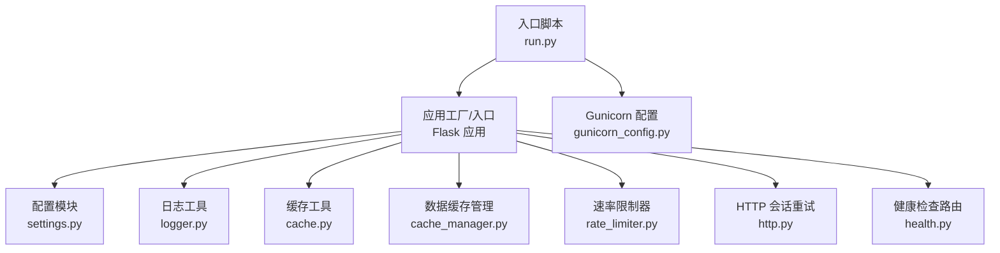
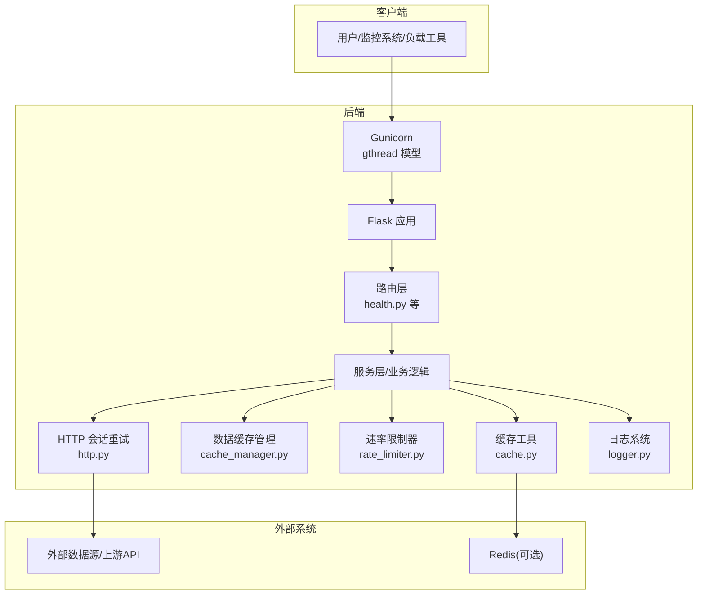
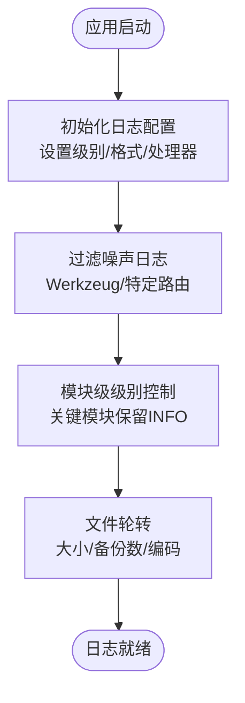
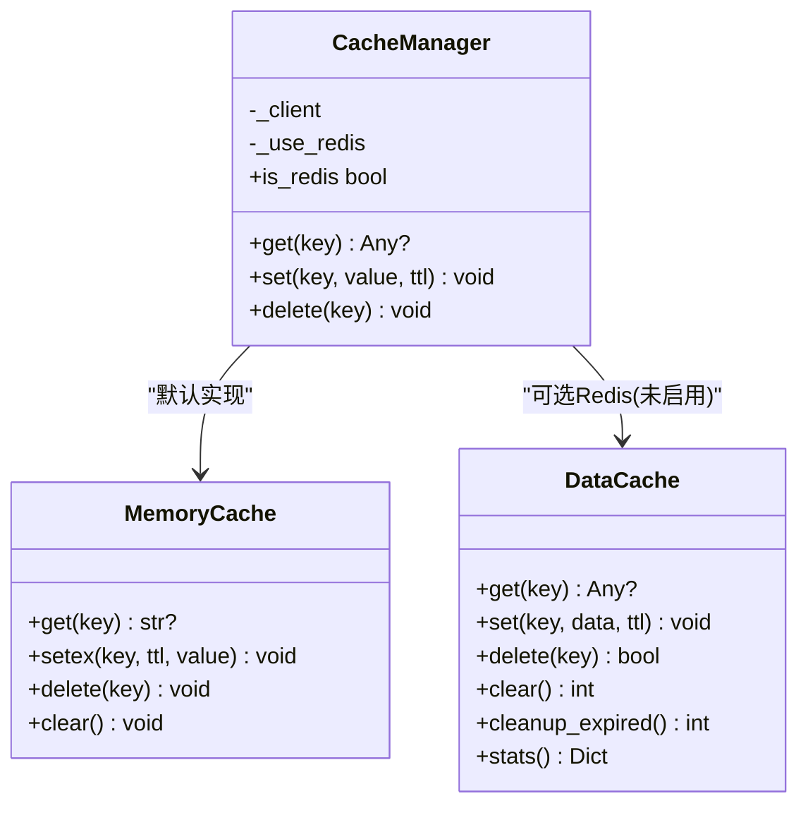
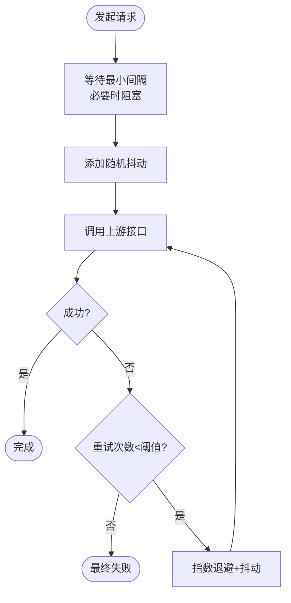
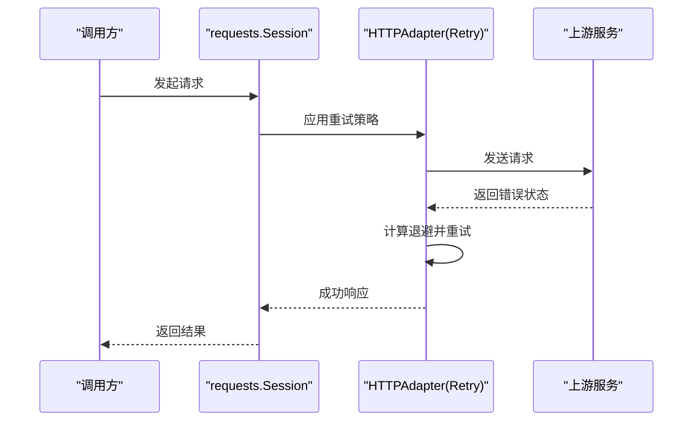
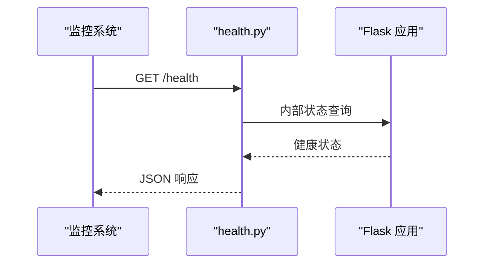
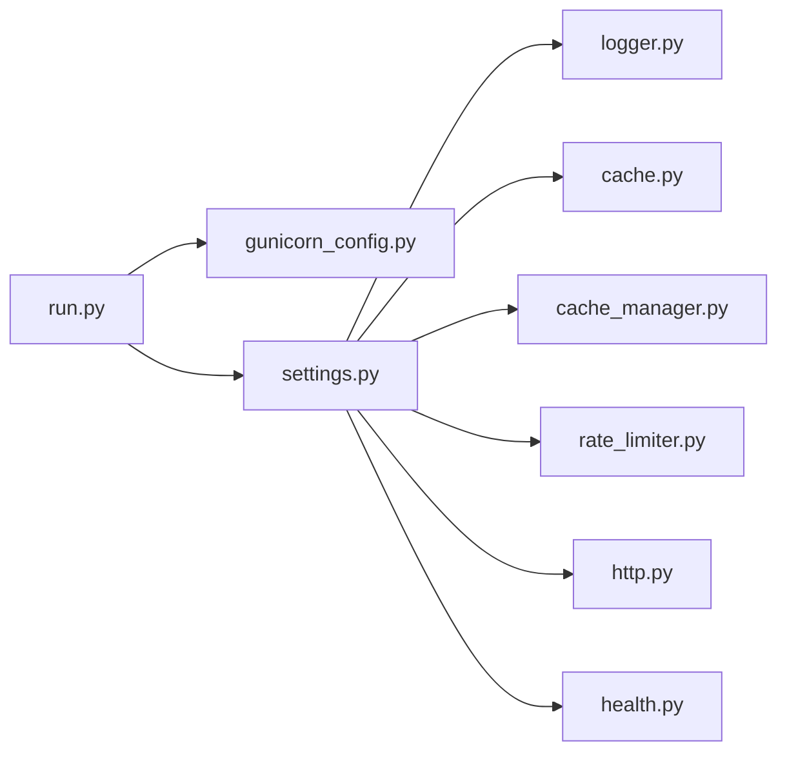

# 性能监控

<cite>
**本文引用的文件**
- [run.py](file://backend_api_python/run.py)
- [gunicorn_config.py](file://backend_api_python/gunicorn_config.py)
- [settings.py](file://backend_api_python/app/config/settings.py)
- [logger.py](file://backend_api_python/app/utils/logger.py)
- [cache.py](file://backend_api_python/app/utils/cache.py)
- [cache_manager.py](file://backend_api_python/app/data_sources/cache_manager.py)
- [rate_limiter.py](file://backend_api_python/app/data_sources/rate_limiter.py)
- [http.py](file://backend_api_python/app/utils/http.py)
- [health.py](file://backend_api_python/app/routes/health.py)
</cite>

## 目录
1. [简介](#简介)
2. [项目结构](#项目结构)
3. [核心组件](#核心组件)
4. [架构总览](#架构总览)
5. [详细组件分析](#详细组件分析)
6. [依赖分析](#依赖分析)
7. [性能考虑](#性能考虑)
8. [故障排除指南](#故障排除指南)
9. [结论](#结论)
10. [附录](#附录)

## 简介
本指南面向SharkQuantDinger后端Python API的性能监控与优化，聚焦以下目标：
- 明确关键性能指标（KPI）的定义与计算方法（响应时间、吞吐量、错误率）。
- 解释指标采集、日志记录与监控告警机制的现状与可扩展点。
- 提供性能分析工具、APM集成与监控仪表板配置思路。
- 给出性能基准测试、负载测试与压力测试的实施方法。
- 提供性能问题诊断、瓶颈定位与优化效果评估的实践步骤。

本项目基于Flask应用，使用Gunicorn作为WSGI服务器，并内置本地日志、缓存与速率限制等性能相关能力。当前未发现内置APM或监控仪表板配置，但具备良好的扩展点以接入外部系统。

## 项目结构
后端Python API位于backend_api_python目录，入口脚本负责加载环境变量、代理配置与应用实例；Gunicorn配置控制并发模型；配置模块集中管理运行参数；日志、缓存、速率限制与HTTP会话等工具模块为性能保障提供基础能力；健康检查路由用于服务状态观测。

图表来源
- [run.py:1-134](file://backend_api_python/run.py#L1-L134)
- [gunicorn_config.py:1-36](file://backend_api_python/gunicorn_config.py#L1-L36)
- [settings.py:1-99](file://backend_api_python/app/config/settings.py#L1-L99)
- [logger.py:1-63](file://backend_api_python/app/utils/logger.py#L1-L63)
- [cache.py:1-129](file://backend_api_python/app/utils/cache.py#L1-L129)
- [cache_manager.py:1-233](file://backend_api_python/app/data_sources/cache_manager.py#L1-L233)
- [rate_limiter.py:1-273](file://backend_api_python/app/data_sources/rate_limiter.py#L1-L273)
- [http.py:1-42](file://backend_api_python/app/utils/http.py#L1-L42)
- [health.py:1-34](file://backend_api_python/app/routes/health.py#L1-L34)

章节来源
- [run.py:1-134](file://backend_api_python/run.py#L1-L134)
- [gunicorn_config.py:1-36](file://backend_api_python/gunicorn_config.py#L1-L36)
- [settings.py:1-99](file://backend_api_python/app/config/settings.py#L1-L99)

## 核心组件
- 应用入口与启动：负责加载.env、设置代理、初始化应用实例与开发服务器启动。
- 并发与工作进程：通过Gunicorn配置控制workers与threads，采用gthread模型提升I/O并发。
- 配置中心：集中管理主机、端口、调试模式、日志级别、缓存开关、请求日志开关、速率限制等。
- 日志系统：统一格式化输出、文件轮转、过滤噪声日志、按模块精细控制级别。
- 缓存体系：内存缓存与Redis缓存双栈，支持TTL与LRU淘汰；数据缓存管理器提供命中率统计。
- 速率限制与退避：针对不同上游数据源的限流器与指数退避重试，降低封禁风险并提高稳定性。
- HTTP会话重试：基于urllib3 Retry策略的全局会话，增强对外部服务调用的鲁棒性。
- 健康检查：提供服务状态与API健康检查端点，便于监控系统探测。

章节来源
- [run.py:104-134](file://backend_api_python/run.py#L104-L134)
- [gunicorn_config.py:10-36](file://backend_api_python/gunicorn_config.py#L10-L36)
- [settings.py:43-91](file://backend_api_python/app/config/settings.py#L43-L91)
- [logger.py:9-63](file://backend_api_python/app/utils/logger.py#L9-L63)
- [cache.py:49-129](file://backend_api_python/app/utils/cache.py#L49-L129)
- [cache_manager.py:44-175](file://backend_api_python/app/data_sources/cache_manager.py#L44-L175)
- [rate_limiter.py:109-164](file://backend_api_python/app/data_sources/rate_limiter.py#L109-L164)
- [http.py:9-42](file://backend_api_python/app/utils/http.py#L9-L42)
- [health.py:10-34](file://backend_api_python/app/routes/health.py#L10-L34)

## 架构总览
下图展示性能相关组件在请求处理链路中的交互关系，以及与外部系统的连接点。

图表来源
- [gunicorn_config.py:10-36](file://backend_api_python/gunicorn_config.py#L10-L36)
- [health.py:10-34](file://backend_api_python/app/routes/health.py#L10-L34)
- [cache.py:49-129](file://backend_api_python/app/utils/cache.py#L49-L129)
- [cache_manager.py:44-175](file://backend_api_python/app/data_sources/cache_manager.py#L44-L175)
- [rate_limiter.py:109-164](file://backend_api_python/app/data_sources/rate_limiter.py#L109-L164)
- [http.py:9-42](file://backend_api_python/app/utils/http.py#L9-L42)
- [logger.py:9-63](file://backend_api_python/app/utils/logger.py#L9-L63)

## 详细组件分析

### 日志与可观测性
- 全局日志配置：统一格式、级别控制、文件轮转与目录创建。
- 噪声过滤：对特定子系统（如Werkzeug、特定路由）进行级别提升，降低噪声。
- 模块级精细控制：对关键业务模块（如支付、计费）保留INFO级别以便排障。
- 输出位置：标准输出与文件输出结合，便于容器与本地部署。

图表来源
- [logger.py:9-63](file://backend_api_python/app/utils/logger.py#L9-L63)

章节来源
- [logger.py:9-63](file://backend_api_python/app/utils/logger.py#L9-L63)

### 缓存与数据缓存管理
- 缓存工具：内存缓存作为默认实现，Redis可选启用；提供统一的get/set/delete接口与JSON序列化。
- 数据缓存管理：TTL过期、LRU淘汰、命中统计、线程安全；按数据类型分区（实时行情、K线、股票信息）。
- 性能收益：显著降低重复请求与上游依赖压力，提升响应速度与吞吐量。

图表来源
- [cache.py:17-129](file://backend_api_python/app/utils/cache.py#L17-L129)
- [cache_manager.py:27-175](file://backend_api_python/app/data_sources/cache_manager.py#L27-L175)

章节来源
- [cache.py:49-129](file://backend_api_python/app/utils/cache.py#L49-L129)
- [cache_manager.py:44-175](file://backend_api_python/app/data_sources/cache_manager.py#L44-L175)

### 速率限制与指数退避
- 速率限制器：最小请求间隔+随机抖动，避免触发上游限流。
- 上游限流器：针对不同数据源（如东方财富、腾讯、AkShare）预设不同策略。
- 指数退避重试：对网络异常与临时错误进行带抖动的指数增长重试，降低雪崩效应。

图表来源
- [rate_limiter.py:109-164](file://backend_api_python/app/data_sources/rate_limiter.py#L109-L164)
- [rate_limiter.py:170-231](file://backend_api_python/app/data_sources/rate_limiter.py#L170-L231)

章节来源
- [rate_limiter.py:109-164](file://backend_api_python/app/data_sources/rate_limiter.py#L109-L164)
- [rate_limiter.py:170-231](file://backend_api_python/app/data_sources/rate_limiter.py#L170-L231)

### HTTP会话重试与超时
- 基于urllib3 Retry策略的会话重试，覆盖连接、读取与总重试次数。
- 全局共享Session，减少连接开销并统一重试策略。

图表来源
- [http.py:9-42](file://backend_api_python/app/utils/http.py#L9-L42)

章节来源
- [http.py:9-42](file://backend_api_python/app/utils/http.py#L9-L42)

### 健康检查与服务状态
- 提供服务首页、健康检查与API健康检查端点，便于容器编排与反向代理探针使用。

图表来源
- [health.py:10-34](file://backend_api_python/app/routes/health.py#L10-L34)

章节来源
- [health.py:10-34](file://backend_api_python/app/routes/health.py#L10-L34)

## 依赖分析
- 启动与并发：入口脚本负责环境准备与应用实例创建；Gunicorn配置决定并发模型与超时参数。
- 配置耦合：配置模块被日志、缓存、速率限制等组件间接依赖，集中管理确保一致性。
- 组件内聚：缓存与数据缓存管理器职责清晰，前者偏向通用KV存储，后者专注数据域缓存与统计。
- 外部依赖：HTTP会话依赖requests与urllib3；缓存可选依赖Redis；速率限制依赖标准库time与random。

图表来源
- [run.py:96-101](file://backend_api_python/run.py#L96-L101)
- [gunicorn_config.py:10-36](file://backend_api_python/gunicorn_config.py#L10-L36)
- [settings.py:43-91](file://backend_api_python/app/config/settings.py#L43-L91)
- [logger.py:9-63](file://backend_api_python/app/utils/logger.py#L9-L63)
- [cache.py:49-129](file://backend_api_python/app/utils/cache.py#L49-L129)
- [cache_manager.py:44-175](file://backend_api_python/app/data_sources/cache_manager.py#L44-L175)
- [rate_limiter.py:109-164](file://backend_api_python/app/data_sources/rate_limiter.py#L109-L164)
- [http.py:9-42](file://backend_api_python/app/utils/http.py#L9-L42)
- [health.py:10-34](file://backend_api_python/app/routes/health.py#L10-L34)

章节来源
- [run.py:96-101](file://backend_api_python/run.py#L96-L101)
- [gunicorn_config.py:10-36](file://backend_api_python/gunicorn_config.py#L10-L36)
- [settings.py:43-91](file://backend_api_python/app/config/settings.py#L43-L91)

## 性能考虑
- 响应时间
  - I/O密集场景：使用gthread模型与共享HTTP会话，减少连接开销。
  - 缓存命中：通过数据缓存管理器统计命中率，持续优化TTL与容量。
  - 速率限制：合理设置最小间隔与抖动，平衡吞吐与封禁风险。
- 吞吐量
  - 增加GUNICORN_WORKERS与GUNICORN_THREADS以提升并发；注意后台任务幂等与数据库锁协调。
  - 启用Redis缓存（若可用）以提升跨进程共享与持久化能力。
- 错误率
  - 指数退避重试与HTTP会话重试降低瞬时错误影响。
  - 健康检查端点便于快速发现服务异常。
- 资源占用
  - 文件日志轮转避免磁盘膨胀；日志级别按模块精细化控制。
  - 缓存清理与过期回收降低内存压力。

[本节为通用指导，无需列出章节来源]

## 故障排除指南
- 启动阶段
  - 确认环境变量（主机、端口、日志级别、速率限制、缓存开关）正确设置。
  - 若使用Gunicorn，请检查绑定地址与端口、日志级别与超时参数。
- 运行阶段
  - 查看日志文件与标准输出，关注ERROR/WARNING级别信息与模块级过滤后的噪声。
  - 使用健康检查端点确认服务可用性。
  - 若缓存不可用，确认Redis连接参数与可达性；回退至内存缓存。
  - 若上游调用频繁失败，检查速率限制器配置与指数退避策略。
- 性能问题
  - 通过缓存统计（命中率、过期清理数量）判断缓存策略有效性。
  - 分析HTTP会话重试次数与失败原因，调整重试参数或上游策略。
  - 结合Gunicorn并发参数与业务峰值，逐步扩容workers与threads。

章节来源
- [run.py:104-134](file://backend_api_python/run.py#L104-L134)
- [gunicorn_config.py:10-36](file://backend_api_python/gunicorn_config.py#L10-L36)
- [logger.py:9-63](file://backend_api_python/app/utils/logger.py#L9-L63)
- [health.py:10-34](file://backend_api_python/app/routes/health.py#L10-L34)
- [cache.py:77-98](file://backend_api_python/app/utils/cache.py#L77-L98)
- [rate_limiter.py:170-231](file://backend_api_python/app/data_sources/rate_limiter.py#L170-L231)
- [http.py:9-42](file://backend_api_python/app/utils/http.py#L9-L42)

## 结论
本项目在性能监控方面具备良好的基础设施：统一日志、可扩展缓存、速率限制与HTTP重试、健康检查端点。建议在现有基础上：
- 引入APM（如OpenTelemetry、Sentry、DataDog）以采集分布式追踪与指标。
- 配置监控仪表板（如Grafana）展示KPI与告警。
- 制定性能基线与SLA，定期进行基准、负载与压力测试。
- 将缓存统计、速率限制与HTTP重试纳入告警阈值。

[本节为总结，无需列出章节来源]

## 附录

### 关键性能指标（KPI）定义与计算
- 响应时间
  - 定义：从请求进入应用到返回响应的总耗时。
  - 计算：对每个请求记录开始与结束时间，取平均值与P95/P99分位。
  - 采集：可在路由层或中间件埋点，结合日志或APM上报。
- 吞吐量
  - 定义：单位时间内处理的请求数（QPS）。
  - 计算：统计窗口内的请求数除以时间窗口长度。
  - 采集：结合健康检查端点与业务路由，按路径/端点聚合。
- 错误率
  - 定义：非2xx响应占总请求数的比例。
  - 计算：错误请求数/总请求数。
  - 采集：结合日志与APM错误采样。

[本节为概念说明，无需列出章节来源]

### 监控告警机制建议
- 指标阈值
  - 响应时间P95超过阈值（如5s）持续一段时间触发告警。
  - QPS下降幅度超过阈值（如30%）触发告警。
  - 错误率超过阈值（如1%）触发告警。
- 告警渠道
  - 邮件、即时通讯群组、电话通知分级。
- 告警收敛
  - 同一指标在短时间内重复告警合并，避免噪声。

[本节为概念说明，无需列出章节来源]

### APM集成与监控仪表板配置
- APM选择
  - OpenTelemetry：自托管或云厂商托管，支持多语言与导出器。
  - Sentry：错误与异常监控，适合错误率与错误堆栈分析。
  - DataDog/AppDynamics：企业级APM，提供丰富的UI与告警。
- 仪表板
  - 展示：响应时间、吞吐量、错误率、缓存命中率、Redis/上游调用延迟。
  - 维度：按端点、数据源、时间窗口聚合。
- 导出与存储
  - 将指标导出到Prometheus/Grafana或云监控平台。

[本节为概念说明，无需列出章节来源]

### 性能测试实施方法
- 基准测试
  - 方法：固定并发与请求分布，测量稳定态下的响应时间与吞吐量。
  - 工具：wrk、ab、JMeter或Locust。
  - 输出：基线数据与回归对比。
- 负载测试
  - 方法：逐步增加并发，观察性能拐点与资源瓶颈。
  - 关注：CPU、内存、磁盘IO、网络、Redis连接池。
- 压力测试
  - 方法：超过系统承载上限，验证错误处理与恢复能力。
  - 关注：降级策略、熔断与超时保护。

[本节为概念说明，无需列出章节来源]