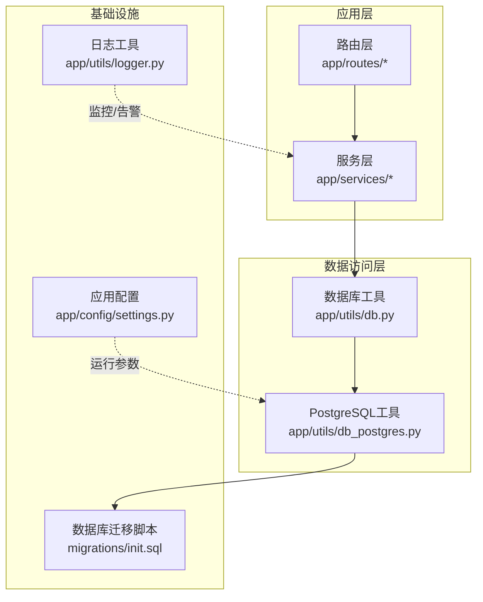
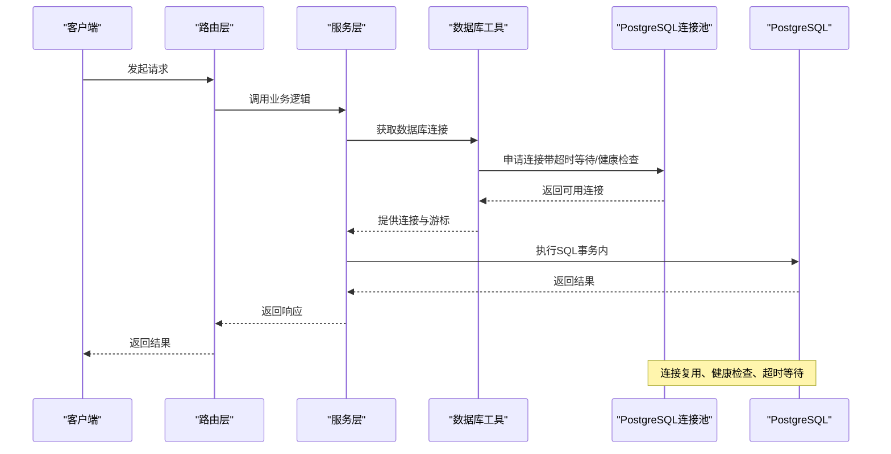
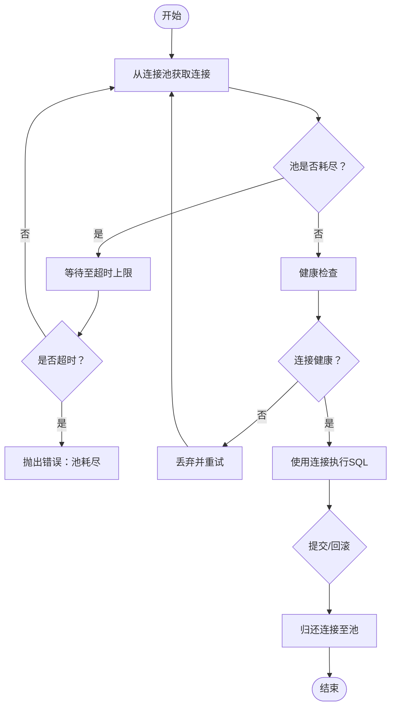
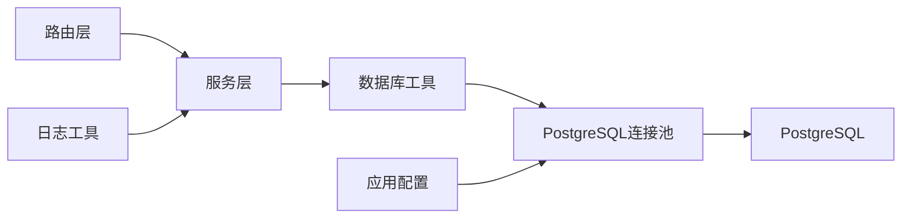

# 数据库优化

<cite>
**本文引用的文件**
- [backend_api_python/app/utils/db_postgres.py](file://backend_api_python/app/utils/db_postgres.py)
- [backend_api_python/app/utils/db.py](file://backend_api_python/app/utils/db.py)
- [backend_api_python/migrations/init.sql](file://backend_api_python/migrations/init.sql)
- [backend_api_python/app/utils/logger.py](file://backend_api_python/app/utils/logger.py)
- [backend_api_python/app/config/settings.py](file://backend_api_python/app/config/settings.py)
- [backend_api_python/app/services/strategy.py](file://backend_api_python/app/services/strategy.py)
- [backend_api_python/app/routes/kline.py](file://backend_api_python/app/routes/kline.py)
</cite>

## 目录
1. [简介](#简介)
2. [项目结构](#项目结构)
3. [核心组件](#核心组件)
4. [架构总览](#架构总览)
5. [详细组件分析](#详细组件分析)
6. [依赖分析](#依赖分析)
7. [性能考量](#性能考量)
8. [故障排查指南](#故障排查指南)
9. [结论](#结论)
10. [附录](#附录)

## 简介
本指南面向 PostgreSQL 数据库在本项目中的优化与运维实践，围绕连接池配置、事务管理、锁机制、索引与查询优化、表结构设计、监控与慢查询分析、备份与归档、分区表设计以及配置参数调优展开。文档以仓库现有实现为基础，结合最佳实践给出可操作的实施方案，并辅以可视化图示帮助理解。

## 项目结构
后端数据库相关能力主要集中在以下模块：
- 数据库连接与连接池：PostgreSQL 工具模块
- 数据库初始化与表结构：迁移脚本
- 日志与监控：日志工具
- 应用配置：运行参数与功能开关
- 业务服务与路由：策略服务、K线路由等对数据库的使用示例



**图表来源**
- [backend_api_python/app/utils/db.py:1-66](file://backend_api_python/app/utils/db.py#L1-L66)
- [backend_api_python/app/utils/db_postgres.py:1-495](file://backend_api_python/app/utils/db_postgres.py#L1-L495)
- [backend_api_python/migrations/init.sql:1-1026](file://backend_api_python/migrations/init.sql#L1-L1026)
- [backend_api_python/app/utils/logger.py:1-63](file://backend_api_python/app/utils/logger.py#L1-L63)
- [backend_api_python/app/config/settings.py:1-99](file://backend_api_python/app/config/settings.py#L1-L99)

**章节来源**
- [backend_api_python/app/utils/db.py:1-66](file://backend_api_python/app/utils/db.py#L1-L66)
- [backend_api_python/app/utils/db_postgres.py:1-495](file://backend_api_python/app/utils/db_postgres.py#L1-L495)
- [backend_api_python/migrations/init.sql:1-1026](file://backend_api_python/migrations/init.sql#L1-L1026)
- [backend_api_python/app/utils/logger.py:1-63](file://backend_api_python/app/utils/logger.py#L1-L63)
- [backend_api_python/app/config/settings.py:1-99](file://backend_api_python/app/config/settings.py#L1-L99)

## 核心组件
- PostgreSQL 连接池与上下文管理：提供线程安全的连接池、健康检查、超时等待与回滚保护。
- 统一数据库接口：对外暴露统一的数据库连接获取方式，屏蔽底层差异。
- 表结构与索引：通过迁移脚本定义核心业务表及常用查询维度的索引。
- 日志与监控：集中化日志输出，便于定位慢查询与异常。
- 应用配置：通过环境变量控制连接池大小、健康检查、日志级别等。

**章节来源**
- [backend_api_python/app/utils/db_postgres.py:1-495](file://backend_api_python/app/utils/db_postgres.py#L1-L495)
- [backend_api_python/app/utils/db.py:1-66](file://backend_api_python/app/utils/db.py#L1-L66)
- [backend_api_python/migrations/init.sql:1-1026](file://backend_api_python/migrations/init.sql#L1-L1026)
- [backend_api_python/app/utils/logger.py:1-63](file://backend_api_python/app/utils/logger.py#L1-L63)
- [backend_api_python/app/config/settings.py:1-99](file://backend_api_python/app/config/settings.py#L1-L99)

## 架构总览
下图展示数据库访问链路与关键优化点：



**图表来源**
- [backend_api_python/app/utils/db_postgres.py:402-438](file://backend_api_python/app/utils/db_postgres.py#L402-L438)
- [backend_api_python/app/utils/db.py:19-31](file://backend_api_python/app/utils/db.py#L19-L31)

## 详细组件分析

### PostgreSQL 连接池与事务管理
- 连接池参数
  - 最小/最大连接数、获取超时、健康检查开关均通过环境变量配置，支持动态调优。
  - 连接建立时设置时区、启用 keepalives 并配置间隔与次数，降低长连接中断带来的抖动。
- 获取连接流程
  - 当池耗尽时，采用指数退避等待策略，避免瞬时高并发导致的级联失败。
  - 健康检查在启用时对连接执行轻量查询，确保连接可用性。
- 事务与回滚
  - 上下文管理器在异常时自动回滚；连接归还池时根据状态决定是否丢弃损坏连接。
- 兼容性与占位符转换
  - 将通用占位符转换为 PostgreSQL 风格，兼容历史 SQL 写法；INSERT 自动返回自增主键（若存在）。



**图表来源**
- [backend_api_python/app/utils/db_postgres.py:184-234](file://backend_api_python/app/utils/db_postgres.py#L184-L234)
- [backend_api_python/app/utils/db_postgres.py:402-438](file://backend_api_python/app/utils/db_postgres.py#L402-L438)

**章节来源**
- [backend_api_python/app/utils/db_postgres.py:53-56](file://backend_api_python/app/utils/db_postgres.py#L53-L56)
- [backend_api_python/app/utils/db_postgres.py:107-161](file://backend_api_python/app/utils/db_postgres.py#L107-L161)
- [backend_api_python/app/utils/db_postgres.py:164-182](file://backend_api_python/app/utils/db_postgres.py#L164-L182)
- [backend_api_python/app/utils/db_postgres.py:402-438](file://backend_api_python/app/utils/db_postgres.py#L402-L438)

### 统一数据库接口
- 对外提供统一的数据库连接获取入口，隐藏底层实现细节。
- 初始化时进行可用性检测，确保数据库连通性。

**章节来源**
- [backend_api_python/app/utils/db.py:19-31](file://backend_api_python/app/utils/db.py#L19-L31)
- [backend_api_python/app/utils/db.py:38-48](file://backend_api_python/app/utils/db.py#L38-L48)

### 表结构与索引设计
- 用户与认证相关表：用户、登录尝试、验证码、OAuth 状态、安全审计等，覆盖高频查询维度并建立相应索引。
- 策略与交易相关表：策略、持仓、交易、待执行队列、通知、运行日志等，按用户、状态、时间等维度建立索引。
- 分析与回测：分析任务、回测运行与明细、资金曲线点等，按用户与时间维度建立索引。
- 市场符号：种子数据与唯一约束，保证跨市场符号唯一性。
- JSON/JSONB 字段：用于灵活存储配置与结果，配合索引提升查询效率。

```mermaid
erDiagram
QD_USERS {
serial id PK
varchar username UK
varchar email UK
varchar role
timestamp created_at
timestamp updated_at
}
QD_CREDITS_LOG {
serial id PK
integer user_id FK
varchar action
decimal amount
decimal balance_after
varchar feature
varchar reference_id
timestamp created_at
}
QD_MEMBERSHIP_ORDERS {
serial id PK
integer user_id FK
varchar plan
decimal price_usd
varchar status
timestamp created_at
timestamp paid_at
}
QD_USDT_ORDERS {
serial id PK
integer user_id FK
varchar chain
decimal amount_usdt
varchar address
varchar status
varchar tx_hash
timestamp paid_at
timestamp confirmed_at
timestamp expires_at
timestamp created_at
timestamp updated_at
}
QD_OAUTH_STATES {
varchar state PK
varchar provider
text redirect
timestamp created_at
timestamp expires_at
}
QD_VERIFICATION_CODES {
serial id PK
varchar email
varchar code
varchar type
timestamp expires_at
timestamp used_at
varchar ip_address
integer attempts
timestamp last_attempt_at
timestamp created_at
}
QD_LOGIN_ATTEMPTS {
serial id PK
varchar identifier
varchar identifier_type
timestamp attempt_time
boolean success
varchar ip_address
text user_agent
}
QD_OAUTH_LINKS {
serial id PK
integer user_id
varchar provider
varchar provider_user_id
varchar provider_email
varchar provider_name
varchar provider_avatar
text access_token
text refresh_token
timestamp created_at
timestamp updated_at
}
QD_SECURITY_LOGS {
serial id PK
integer user_id
varchar action
varchar ip_address
text user_agent
text details
timestamp created_at
}
QD_STRATEGIES_TRADING {
serial id PK
integer user_id FK
varchar strategy_name
varchar strategy_type
varchar market_category
varchar execution_mode
varchar status
varchar symbol
varchar timeframe
varchar strategy_group_id
varchar strategy_mode
text strategy_code
timestamp created_at
timestamp updated_at
}
QD_STRATEGY_POSITIONS {
serial id PK
integer user_id FK
integer strategy_id FK
varchar symbol
varchar side
decimal size
decimal entry_price
decimal current_price
decimal unrealized_pnl
decimal pnl_percent
decimal equity
timestamp updated_at
unique(strategy_id, symbol, side)
}
QD_STRATEGY_TRADES {
serial id PK
integer user_id FK
integer strategy_id FK
varchar symbol
varchar type
decimal price
decimal amount
decimal value
decimal commission
varchar commission_ccy
decimal profit
timestamp created_at
}
PENDING_ORDERS {
serial id PK
integer user_id FK
integer strategy_id FK
varchar symbol
varchar signal_type
bigint signal_ts
varchar market_type
varchar order_type
decimal amount
decimal price
varchar execution_mode
varchar status
integer priority
integer attempts
integer max_attempts
text last_error
text payload_json
text dispatch_note
varchar exchange_id
varchar exchange_order_id
text exchange_response_json
decimal filled
decimal avg_price
timestamp executed_at
timestamp created_at
timestamp updated_at
timestamp processed_at
timestamp sent_at
}
QD_STRATEGY_NOTIFICATIONS {
serial id PK
integer user_id FK
integer strategy_id FK
varchar symbol
varchar signal_type
varchar channels
varchar title
text message
text payload_json
integer is_read
timestamp created_at
}
QD_STRATEGY_LOGS {
serial id PK
integer strategy_id FK
varchar level
text message
timestamp timestamp
}
QD_INDICATOR_CODES {
serial id PK
integer user_id FK
integer is_buy
bigint end_time
varchar name
text code
text description
varchar pricing_type
decimal price
integer is_encrypted
varchar preview_image
boolean vip_free
integer purchase_count
numeric avg_rating
integer rating_count
integer view_count
varchar review_status
text review_note
timestamp reviewed_at
integer reviewed_by
integer source_indicator_id
}
QD_WATCHLIST {
serial id PK
integer user_id FK
varchar market
varchar symbol
varchar name
timestamp created_at
timestamp updated_at
unique(user_id, market, symbol)
}
QD_ANALYSIS_TASKS {
serial id PK
integer user_id FK
varchar market
varchar symbol
varchar model
varchar language
varchar status
text result_json
text error_message
timestamp created_at
timestamp completed_at
}
QD_BACKTEST_RUNS {
serial id PK
integer user_id FK
integer indicator_id
integer strategy_id
varchar strategy_name
varchar run_type
varchar market
varchar symbol
varchar timeframe
varchar start_date
varchar end_date
decimal initial_capital
decimal commission
decimal slippage
integer leverage
varchar trade_direction
text strategy_config
text config_snapshot
varchar engine_version
varchar code_hash
varchar status
text error_message
text result_json
timestamp created_at
}
QD_BACKTEST_TRADES {
serial id PK
integer run_id FK
integer user_id FK
integer strategy_id
integer trade_index
varchar trade_time
varchar trade_type
varchar side
double price
double amount
double profit
double balance
varchar reason
text payload_json
timestamp created_at
}
QD_BACKTEST_EQUITY_POINTS {
serial id PK
integer run_id FK
integer point_index
varchar point_time
double point_value
timestamp created_at
}
QD_EXCHANGE_CREDENTIALS {
serial id PK
integer user_id FK
varchar name
varchar exchange_id
varchar api_key_hint
text encrypted_config
timestamp created_at
timestamp updated_at
}
QD_MANUAL_POSITIONS {
serial id PK
integer user_id FK
varchar market
varchar symbol
varchar name
varchar side
decimal quantity
decimal entry_price
bigint entry_time
text notes
text tags
varchar group_name
timestamp created_at
timestamp updated_at
unique(user_id, market, symbol, side, group_name)
}
QD_POSITION_ALERTS {
serial id PK
integer user_id FK
integer position_id
varchar market
varchar symbol
varchar alert_type
decimal threshold
text notification_config
integer is_active
integer is_triggered
timestamp last_triggered_at
integer trigger_count
integer repeat_interval
text notes
timestamp created_at
timestamp updated_at
}
QD_POSITION_MONITORS {
serial id PK
integer user_id FK
varchar name
text position_ids
varchar monitor_type
text config
text notification_config
integer is_active
timestamp last_run_at
timestamp next_run_at
text last_result
integer run_count
timestamp created_at
timestamp updated_at
}
QD_MARKET_SYMBOLS {
serial id PK
varchar market
varchar symbol
varchar name
varchar exchange
varchar currency
integer is_active
integer is_hot
integer sort_order
timestamp created_at
unique(market, symbol)
}
QD_ANALYSIS_MEMORY {
serial id PK
integer user_id
varchar market
varchar symbol
varchar decision
integer confidence
decimal price_at_analysis
text summary
jsonb reasons
jsonb scores
jsonb indicators_snapshot
jsonb raw_result
decimal consensus_score
decimal consensus_abs
decimal agreement_ratio
decimal quality_multiplier
timestamp created_at
timestamp validated_at
varchar actual_outcome
decimal actual_return_pct
boolean was_correct
}
QD_USERS ||--o{ QD_CREDITS_LOG : "拥有"
QD_USERS ||--o{ QD_MEMBERSHIP_ORDERS : "拥有"
QD_USERS ||--o{ QD_USDT_ORDERS : "拥有"
QD_USERS ||--o{ QD_OAUTH_LINKS : "拥有"
QD_USERS ||--o{ QD_STRATEGIES_TRADING : "拥有"
QD_USERS ||--o{ QD_STRATEGY_POSITIONS : "拥有"
QD_USERS ||--o{ QD_STRATEGY_TRADES : "拥有"
QD_USERS ||--o{ PENDING_ORDERS : "拥有"
QD_USERS ||--o{ QD_STRATEGY_NOTIFICATIONS : "拥有"
QD_USERS ||--o{ QD_ANALYSIS_TASKS : "拥有"
QD_USERS ||--o{ QD_EXCHANGE_CREDENTIALS : "拥有"
QD_USERS ||--o{ QD_MANUAL_POSITIONS : "拥有"
QD_USERS ||--o{ QD_POSITION_ALERTS : "拥有"
QD_USERS ||--o{ QD_POSITION_MONITORS : "拥有"
QD_STRATEGIES_TRADING ||--o{ QD_STRATEGY_POSITIONS : "包含"
QD_STRATEGIES_TRADING ||--o{ QD_STRATEGY_TRADES : "产生"
QD_STRATEGIES_TRADING ||--o{ PENDING_ORDERS : "驱动"
QD_STRATEGIES_TRADING ||--o{ QD_STRATEGY_NOTIFICATIONS : "触发"
QD_STRATEGIES_TRADING ||--o{ QD_STRATEGY_LOGS : "记录"
QD_STRATEGIES_TRADING ||--o{ QD_BACKTEST_RUNS : "运行"
QD_BACKTEST_RUNS ||--o{ QD_BACKTEST_TRADES : "生成"
QD_BACKTEST_RUNS ||--o{ QD_BACKTEST_EQUITY_POINTS : "生成"
```

**图表来源**
- [backend_api_python/migrations/init.sql:8-1026](file://backend_api_python/migrations/init.sql#L8-L1026)

**章节来源**
- [backend_api_python/migrations/init.sql:8-1026](file://backend_api_python/migrations/init.sql#L8-L1026)

### 查询优化与索引策略
- 常见查询维度
  - 用户相关：按用户 ID、角色、状态等过滤。
  - 交易与回测：按用户、策略、时间范围、状态等过滤。
  - 通知与日志：按用户、时间、状态等过滤。
- 建议索引
  - 复合索引：在“用户+状态”、“用户+时间”等高频过滤组合上建立复合索引。
  - 单列索引：在“状态”、“创建时间”、“到期时间”等列上建立单列索引。
  - 唯一索引：在“用户+市场+符号”的唯一约束上避免重复。
- JSON/JSONB 查询
  - 对 JSON/JSONB 字段的查询可通过 GIN/BTree 索引加速，结合查询模式选择合适索引类型。

**章节来源**
- [backend_api_python/migrations/init.sql:33-132](file://backend_api_python/migrations/init.sql#L33-L132)
- [backend_api_python/migrations/init.sql:222-303](file://backend_api_python/migrations/init.sql#L222-L303)
- [backend_api_python/migrations/init.sql:340-364](file://backend_api_python/migrations/init.sql#L340-L364)
- [backend_api_python/migrations/init.sql:378-379](file://backend_api_python/migrations/init.sql#L378-L379)
- [backend_api_python/migrations/init.sql:491-525](file://backend_api_python/migrations/init.sql#L491-L525)

### 事务管理与锁机制
- 事务边界
  - 在上下文管理器中包裹业务逻辑，确保异常时自动回滚。
  - 对于批量写入，尽量合并为单事务，减少锁持有时间。
- 锁与并发
  - 使用合适的隔离级别，避免不必要的行级锁升级。
  - 对热点表采用写时分片或异步写入，降低锁竞争。
- 死锁预防
  - 固定顺序更新多表，避免循环依赖。
  - 为长事务设置超时，及时释放锁。

**章节来源**
- [backend_api_python/app/utils/db_postgres.py:420-437](file://backend_api_python/app/utils/db_postgres.py#L420-L437)

### 监控指标与慢查询分析
- 日志级别与输出
  - 通过环境变量统一设置日志级别与文件轮转，便于问题定位。
  - 对关键模块（如路由、服务）设置细粒度日志级别。
- 慢查询识别
  - 结合应用日志与数据库慢查询日志，定位耗时 SQL。
  - 对高频查询建立索引，减少全表扫描。
- 性能基线
  - 建立关键接口的响应时间与吞吐量基线，持续监控波动。

**章节来源**
- [backend_api_python/app/utils/logger.py:9-48](file://backend_api_python/app/utils/logger.py#L9-L48)
- [backend_api_python/app/config/settings.py:46-90](file://backend_api_python/app/config/settings.py#L46-L90)

### 备份策略、数据归档与分区表设计
- 备份策略
  - 使用逻辑备份与物理备份相结合的方式，定期校验恢复流程。
  - 对热数据与冷数据分离备份，缩短恢复时间。
- 归档与清理
  - 对历史交易、日志、回测结果等建立归档策略，按时间分桶清理。
  - 利用数据库压缩与只读副本降低存储成本。
- 分区表设计
  - 按时间维度（如日、月）对大表进行分区，提升查询与维护效率。
  - 对分区键进行合理选择，避免热点分区。

**章节来源**
- [backend_api_python/migrations/init.sql:491-525](file://backend_api_python/migrations/init.sql#L491-L525)

### 配置参数调优与并发控制
- 连接池参数
  - DB_POOL_MIN/DB_POOL_MAX：根据峰值并发与资源限制设定，避免过小导致排队、过大导致资源争用。
  - DB_POOL_ACQUIRE_TIMEOUT：结合业务超时策略，避免长时间阻塞。
  - DB_POOL_HEALTH_CHECK：生产环境建议开启，保障连接可用性。
- PostgreSQL 参数
  - shared_buffers、work_mem、effective_cache_size 等参数需结合硬件与负载模型调优。
  - 合理设置 max_connections，避免超过系统限制。
- 并发控制
  - 通过连接池与限流策略控制并发，避免数据库过载。
  - 对写密集型场景采用批量写入与幂等设计。

**章节来源**
- [backend_api_python/app/utils/db_postgres.py:53-56](file://backend_api_python/app/utils/db_postgres.py#L53-L56)
- [backend_api_python/app/utils/db_postgres.py:130-149](file://backend_api_python/app/utils/db_postgres.py#L130-L149)

## 依赖分析
- 组件耦合
  - 路由层依赖服务层；服务层依赖数据库工具；数据库工具依赖 PostgreSQL 连接池。
- 外部依赖
  - 通过环境变量注入数据库连接信息与运行参数，降低硬编码耦合。
- 循环依赖
  - 未发现循环导入；模块职责清晰，接口稳定。



**图表来源**
- [backend_api_python/app/utils/db.py:19-31](file://backend_api_python/app/utils/db.py#L19-L31)
- [backend_api_python/app/utils/db_postgres.py:107-161](file://backend_api_python/app/utils/db_postgres.py#L107-L161)
- [backend_api_python/app/config/settings.py:1-99](file://backend_api_python/app/config/settings.py#L1-99)
- [backend_api_python/app/utils/logger.py:1-63](file://backend_api_python/app/utils/logger.py#L1-L63)

**章节来源**
- [backend_api_python/app/utils/db.py:19-31](file://backend_api_python/app/utils/db.py#L19-L31)
- [backend_api_python/app/utils/db_postgres.py:107-161](file://backend_api_python/app/utils/db_postgres.py#L107-L161)
- [backend_api_python/app/config/settings.py:1-99](file://backend_api_python/app/config/settings.py#L1-99)
- [backend_api_python/app/utils/logger.py:1-63](file://backend_api_python/app/utils/logger.py#L1-L63)

## 性能考量
- 连接池与健康检查：在高并发场景下显著降低连接获取延迟与失败率。
- 索引与查询：针对高频过滤维度建立索引，避免全表扫描。
- 事务与锁：合理划分事务边界，减少锁持有时间，降低死锁概率。
- 监控与基线：通过日志与指标建立性能基线，持续优化热点路径。
- 存储与归档：对历史数据进行分区与归档，平衡查询性能与存储成本。

## 故障排查指南
- 连接池耗尽
  - 现象：获取连接超时，日志提示池耗尽。
  - 排查：检查 DB_POOL_MAX 与 DB_POOL_ACQUIRE_TIMEOUT 设置；观察是否存在长事务未提交。
  - 处置：适当增大池容量或缩短事务时间；优化慢查询。
- 连接不可用
  - 现象：健康检查失败或连接被断开。
  - 排查：检查网络、防火墙与 NAT；查看 keepalives 配置。
  - 处置：启用健康检查；调整 keepalives 参数；重启容器验证网络。
- 慢查询
  - 现象：接口响应时间升高。
  - 排查：结合应用日志与数据库慢查询日志定位；分析执行计划。
  - 处置：为过滤列建立索引；拆分复杂查询；使用分区表。
- 死锁与锁等待
  - 现象：事务长时间无法提交。
  - 排查：检查事务边界与锁顺序；确认是否存在热点行。
  - 处置：固定更新顺序；减少事务持有锁的时间；引入重试与幂等。

**章节来源**
- [backend_api_python/app/utils/db_postgres.py:205-210](file://backend_api_python/app/utils/db_postgres.py#L205-L210)
- [backend_api_python/app/utils/db_postgres.py:164-182](file://backend_api_python/app/utils/db_postgres.py#L164-L182)
- [backend_api_python/app/utils/logger.py:9-48](file://backend_api_python/app/utils/logger.py#L9-L48)

## 结论
本项目在数据库层面提供了完善的连接池与事务管理能力，并通过迁移脚本建立了清晰的表结构与索引体系。结合本文提出的索引优化、查询优化、事务与锁管理、监控与慢查询分析、备份归档与分区设计、参数调优与并发控制等策略，可在生产环境中获得稳定、高效、可扩展的数据库表现。

## 附录
- 关键实现位置参考
  - 连接池与上下文管理：[backend_api_python/app/utils/db_postgres.py:107-161](file://backend_api_python/app/utils/db_postgres.py#L107-L161)
  - 获取连接与健康检查：[backend_api_python/app/utils/db_postgres.py:184-234](file://backend_api_python/app/utils/db_postgres.py#L184-L234)
  - 事务回滚与连接归还：[backend_api_python/app/utils/db_postgres.py:420-437](file://backend_api_python/app/utils/db_postgres.py#L420-L437)
  - 统一数据库接口：[backend_api_python/app/utils/db.py:19-31](file://backend_api_python/app/utils/db.py#L19-L31)
  - 表结构与索引：[backend_api_python/migrations/init.sql:8-1026](file://backend_api_python/migrations/init.sql#L8-L1026)
  - 日志配置：[backend_api_python/app/utils/logger.py:9-48](file://backend_api_python/app/utils/logger.py#L9-L48)
  - 应用配置：[backend_api_python/app/config/settings.py:46-90](file://backend_api_python/app/config/settings.py#L46-L90)