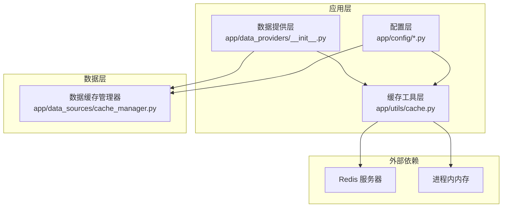
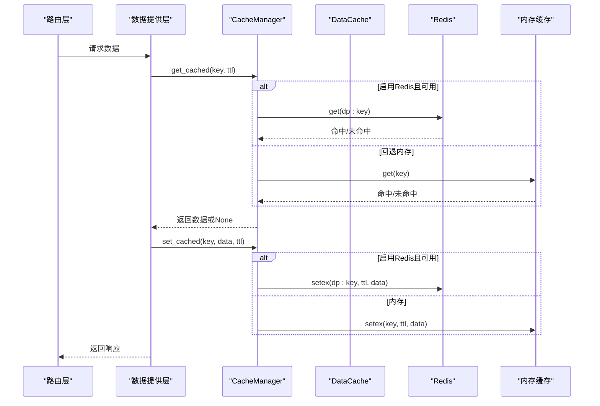
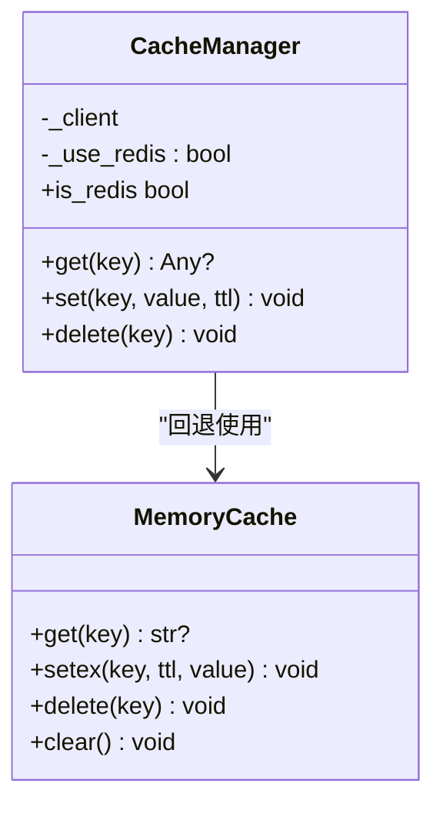
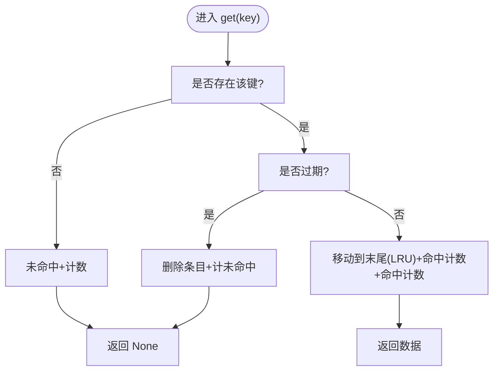
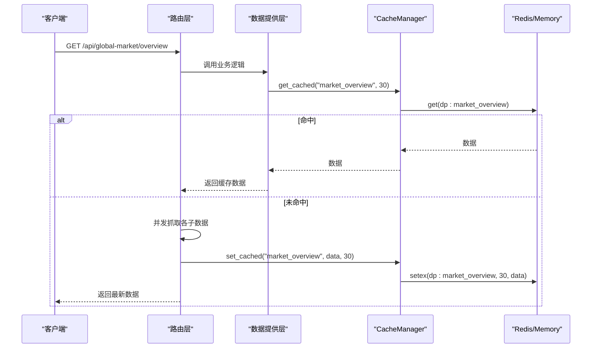
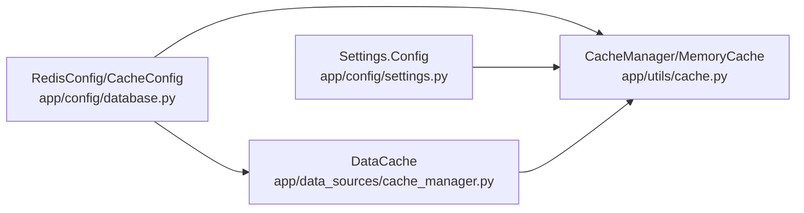

# 缓存策略

<cite>
**本文引用的文件**
- [backend_api_python/app/utils/cache.py](file://backend_api_python/app/utils/cache.py)
- [backend_api_python/app/data_sources/cache_manager.py](file://backend_api_python/app/data_sources/cache_manager.py)
- [backend_api_python/app/data_providers/__init__.py](file://backend_api_python/app/data_providers/__init__.py)
- [backend_api_python/app/config/database.py](file://backend_api_python/app/config/database.py)
- [backend_api_python/app/config/settings.py](file://backend_api_python/app/config/settings.py)
- [backend_api_python/app/data_providers/heatmap.py](file://backend_api_python/app/data_providers/heatmap.py)
- [backend_api_python/app/routes/global_market.py](file://backend_api_python/app/routes/global_market.py)
- [backend_api_python/app/data_providers/opportunities.py](file://backend_api_python/app/data_providers/opportunities.py)
</cite>

## 目录
1. [引言](#引言)
2. [项目结构](#项目结构)
3. [核心组件](#核心组件)
4. [架构总览](#架构总览)
5. [详细组件分析](#详细组件分析)
6. [依赖分析](#依赖分析)
7. [性能考虑](#性能考虑)
8. [故障排查指南](#故障排查指南)
9. [结论](#结论)
10. [附录](#附录)

## 引言
本指南系统阐述本项目的缓存策略与实现，覆盖本地内存缓存与 Redis 分布式缓存两种模式，解释缓存配置项、TTL 设定与失效策略，并给出缓存穿透、击穿、雪崩的防护思路。同时提供性能监控、命中率统计与一致性保障方法，以及分布式缓存设计、缓存预热与更新策略的实施方案。

## 项目结构
本项目在后端 Python API 中提供了两层缓存能力：
- 应用级统一缓存：通过工具层封装 MemoryCache 与 Redis 的透明切换，支持 TTL 与序列化。
- 数据级缓存：针对市场数据的专用缓存管理器，提供 TTL、LRU、容量控制与命中率统计。

图表来源
- [backend_api_python/app/utils/cache.py:17-129](file://backend_api_python/app/utils/cache.py#L17-L129)
- [backend_api_python/app/data_sources/cache_manager.py:44-175](file://backend_api_python/app/data_sources/cache_manager.py#L44-L175)
- [backend_api_python/app/data_providers/__init__.py:1-86](file://backend_api_python/app/data_providers/__init__.py#L1-L86)
- [backend_api_python/app/config/database.py:1-90](file://backend_api_python/app/config/database.py#L1-L90)
- [backend_api_python/app/config/settings.py:76-82](file://backend_api_python/app/config/settings.py#L76-L82)

章节来源
- [backend_api_python/app/utils/cache.py:1-129](file://backend_api_python/app/utils/cache.py#L1-L129)
- [backend_api_python/app/data_sources/cache_manager.py:1-233](file://backend_api_python/app/data_sources/cache_manager.py#L1-L233)
- [backend_api_python/app/data_providers/__init__.py:1-86](file://backend_api_python/app/data_providers/__init__.py#L1-L86)
- [backend_api_python/app/config/database.py:1-90](file://backend_api_python/app/config/database.py#L1-L90)
- [backend_api_python/app/config/settings.py:1-99](file://backend_api_python/app/config/settings.py#L1-L99)

## 核心组件
- 应用级缓存工具
  - MemoryCache：线程安全的本地字典缓存，内置 TTL 过期检查与删除。
  - CacheManager：统一入口，优先使用 MemoryCache；当启用 Redis 且可用时切换为 Redis 客户端，不可用时回退到 MemoryCache。
- 数据级缓存
  - DataCache：带 TTL、最大容量、LRU 淘汰、线程安全、命中/未命中计数与命中率统计。
- 统一数据提供层
  - 提供 get_cached/set_cached/clear_cache 接口，自动选择 TTL 并前缀化 key，支持 Redis 扫描批量清理。

章节来源
- [backend_api_python/app/utils/cache.py:17-129](file://backend_api_python/app/utils/cache.py#L17-L129)
- [backend_api_python/app/data_sources/cache_manager.py:27-175](file://backend_api_python/app/data_sources/cache_manager.py#L27-L175)
- [backend_api_python/app/data_providers/__init__.py:23-78](file://backend_api_python/app/data_providers/__init__.py#L23-L78)

## 架构总览
应用级缓存与数据级缓存协同工作：
- 应用级缓存负责通用键值缓存（如全局市场概览、新闻、宏观情绪等），支持 TTL 与序列化。
- 数据级缓存负责高频、体量较大的市场数据（如实时行情、K线、股票基础信息），内置 TTL/LRU/容量控制与命中率统计。
- 两者均支持本地内存与 Redis 透明切换，Redis 可横向扩展以支撑多实例部署。

图表来源
- [backend_api_python/app/data_providers/__init__.py:45-58](file://backend_api_python/app/data_providers/__init__.py#L45-L58)
- [backend_api_python/app/utils/cache.py:100-127](file://backend_api_python/app/utils/cache.py#L100-L127)
- [backend_api_python/app/data_sources/cache_manager.py:71-128](file://backend_api_python/app/data_sources/cache_manager.py#L71-L128)

## 详细组件分析

### 应用级缓存：MemoryCache 与 CacheManager
- MemoryCache
  - 结构：字典存储 (value, expiry)，线程锁保护。
  - 行为：get 检查过期并清理；setex 计算过期时间；delete/clear 支持删除与清空。
- CacheManager
  - 初始化策略：默认使用 MemoryCache；当启用 Redis 且 ping 成功则切换为 Redis 客户端，否则回退 MemoryCache。
  - 读写：get/set/delete 对外统一接口，内部序列化/反序列化 JSON；异常记录错误日志但不抛出。
  - 属性：is_redis 判断当前使用后端类型。

图表来源
- [backend_api_python/app/utils/cache.py:17-47](file://backend_api_python/app/utils/cache.py#L17-L47)
- [backend_api_python/app/utils/cache.py:49-129](file://backend_api_python/app/utils/cache.py#L49-L129)

章节来源
- [backend_api_python/app/utils/cache.py:17-129](file://backend_api_python/app/utils/cache.py#L17-L129)

### 数据级缓存：DataCache（TTL/LRU/容量控制/命中率）
- 结构：有序字典维护访问顺序，配合线程锁实现并发安全。
- 行为：
  - get：命中返回数据并更新 LRU；过期删除并计未命中；统计命中/未命中。
  - set：容量超限时按 LRU 淘汰最旧条目；可指定 TTL 或使用默认 TTL。
  - cleanup_expired：主动清理过期条目。
  - stats：返回名称、大小、最大容量、命中/未命中次数、命中率、默认 TTL。
- 配置：
  - 实时行情缓存：默认 TTL 20 分钟，最大条目数 6000。
  - K线缓存：默认 TTL 5 分钟，最大条目数 500。
  - 股票信息缓存：默认 TTL 24 小时，最大条目数 6000。

图表来源
- [backend_api_python/app/data_sources/cache_manager.py:71-98](file://backend_api_python/app/data_sources/cache_manager.py#L71-L98)

章节来源
- [backend_api_python/app/data_sources/cache_manager.py:44-175](file://backend_api_python/app/data_sources/cache_manager.py#L44-L175)

### 统一数据提供层：缓存接口与 TTL 策略
- 接口：
  - get_cached(key, ttl=None)：自动加前缀 dp:，尊重传入 TTL 或按键名映射表选择默认 TTL。
  - set_cached(key, data, ttl=None)：写入缓存，使用有效 TTL。
  - clear_cache()：Redis 模式下扫描 dp:* 并删除；内存模式下清空整个字典。
- TTL 映射：
  - 常用键：如 crypto_heatmap、forex_pairs、stock_indices、market_overview、market_heatmap、commodities、market_news、economic_calendar、market_sentiment、trading_opportunities 等。
  - 默认 TTL：60 秒。
- 使用示例：
  - 路由层：全局市场概览、新闻、日历、情绪等接口均采用缓存。
  - 数据聚合层：热点数据（如 crypto_heatmap、forex_pairs、commodities、stock_indices）先查缓存，未命中再拉取并写入缓存。

图表来源
- [backend_api_python/app/routes/global_market.py:58-113](file://backend_api_python/app/routes/global_market.py#L58-L113)
- [backend_api_python/app/data_providers/__init__.py:45-58](file://backend_api_python/app/data_providers/__init__.py#L45-L58)

章节来源
- [backend_api_python/app/data_providers/__init__.py:23-78](file://backend_api_python/app/data_providers/__init__.py#L23-L78)
- [backend_api_python/app/routes/global_market.py:58-113](file://backend_api_python/app/routes/global_market.py#L58-L113)
- [backend_api_python/app/data_providers/heatmap.py:20-56](file://backend_api_python/app/data_providers/heatmap.py#L20-L56)
- [backend_api_python/app/data_providers/opportunities.py:131-184](file://backend_api_python/app/data_providers/opportunities.py#L131-L184)

## 依赖分析
- 配置层
  - RedisConfig：提供连接参数（主机、端口、密码、DB、连接/套接字超时、最大连接数）。
  - CacheConfig：提供业务相关 TTL（K线、分析、价格）与缓存开关、默认过期时间。
  - Settings.Config：提供功能开关 ENABLE_CACHE，受附加配置与环境变量影响。
- 外部依赖
  - Redis 客户端：ping 成功后启用 Redis；失败回退内存缓存。
  - 线程锁：确保内存与数据缓存的并发安全。

图表来源
- [backend_api_python/app/config/database.py:38-90](file://backend_api_python/app/config/database.py#L38-L90)
- [backend_api_python/app/config/settings.py:76-82](file://backend_api_python/app/config/settings.py#L76-L82)
- [backend_api_python/app/utils/cache.py:49-99](file://backend_api_python/app/utils/cache.py#L49-L99)
- [backend_api_python/app/data_sources/cache_manager.py:55-65](file://backend_api_python/app/data_sources/cache_manager.py#L55-L65)

章节来源
- [backend_api_python/app/config/database.py:1-90](file://backend_api_python/app/config/database.py#L1-L90)
- [backend_api_python/app/config/settings.py:76-82](file://backend_api_python/app/config/settings.py#L76-L82)
- [backend_api_python/app/utils/cache.py:49-99](file://backend_api_python/app/utils/cache.py#L49-L99)
- [backend_api_python/app/data_sources/cache_manager.py:55-65](file://backend_api_python/app/data_sources/cache_manager.py#L55-L65)

## 性能考虑
- 命中率统计
  - DataCache 提供命中/未命中计数与命中率，便于评估缓存效果。
  - 建议在生产环境定期采集 stats 并上报监控系统。
- TTL 设计
  - 高频数据（如实时行情、K线）采用较短 TTL，降低陈旧数据影响。
  - 低频数据（如宏观事件、经济日历）采用较长 TTL，减少外部调用。
- 并发与锁
  - MemoryCache 与 DataCache 均使用锁保护，避免并发写导致的数据竞争。
- Redis 与内存切换
  - 启用 Redis 时具备跨进程/跨实例共享能力，适合多实例部署；不可用时自动回退内存，保证可用性。

章节来源
- [backend_api_python/app/data_sources/cache_manager.py:160-174](file://backend_api_python/app/data_sources/cache_manager.py#L160-L174)
- [backend_api_python/app/utils/cache.py:78-98](file://backend_api_python/app/utils/cache.py#L78-L98)

## 故障排查指南
- Redis 不可用
  - 现象：启动日志提示 Redis 可用但不可达，随后使用内存缓存。
  - 处理：检查网络连通性、认证信息与端口；确认 Redis 服务状态。
- 缓存未命中
  - 现象：命中率偏低。
  - 处理：检查 TTL 是否过短、键前缀是否一致、是否被清理；优化热点数据预热。
- 缓存清理
  - Redis 模式：clear_cache 会扫描 dp:* 并删除；内存模式：清空整个字典。
- 错误日志
  - CacheManager 在读写异常时记录错误日志，便于定位问题。

章节来源
- [backend_api_python/app/utils/cache.py:94-98](file://backend_api_python/app/utils/cache.py#L94-L98)
- [backend_api_python/app/data_providers/__init__.py:61-78](file://backend_api_python/app/data_providers/__init__.py#L61-L78)

## 结论
本项目通过“应用级统一缓存 + 数据级专用缓存”的双层设计，在保证易用性的同时兼顾性能与可扩展性。默认本地优先、Redis 可选启用的策略提升了部署灵活性；TTL/LRU/容量控制与命中率统计为性能优化提供了量化依据。结合本文提供的防护与运维建议，可在高并发场景下稳定运行。

## 附录

### 缓存配置选项与默认值
- 缓存开关
  - ENABLE_CACHE：受附加配置与环境变量影响，默认关闭。
- Redis 连接参数
  - HOST、PORT、PASSWORD、DB、CONNECT_TIMEOUT、SOCKET_TIMEOUT、MAX_CONNECTIONS。
- 业务 TTL
  - KLINE_CACHE_TTL：按时间周期（1m~1D）设定不同 TTL。
  - ANALYSIS_CACHE_TTL：分析类缓存 TTL。
  - PRICE_CACHE_TTL：价格类缓存 TTL。
  - DEFAULT_EXPIRE：通用默认过期时间。

章节来源
- [backend_api_python/app/config/settings.py:76-82](file://backend_api_python/app/config/settings.py#L76-L82)
- [backend_api_python/app/config/database.py:38-90](file://backend_api_python/app/config/database.py#L38-L90)

### TTL 设置与缓存失效策略
- 应用级 TTL
  - 通过 get_cached/set_cached 的 ttl 参数或键映射表生效；Redis 模式下由底层客户端处理过期。
- 数据级 TTL
  - get 时检查过期并清理；set 时可指定 TTL 或使用默认 TTL；cleanup_expired 主动清理过期条目。
- 失效策略
  - 自然过期：基于时间戳与 TTL。
  - LRU 淘汰：容量超限时淘汰最久未使用的条目。
  - 手动清理：clear_cache 清空所有缓存键。

章节来源
- [backend_api_python/app/data_providers/__init__.py:23-58](file://backend_api_python/app/data_providers/__init__.py#L23-L58)
- [backend_api_python/app/data_sources/cache_manager.py:71-128](file://backend_api_python/app/data_sources/cache_manager.py#L71-L128)

### 缓存穿透、击穿、雪崩的防护
- 缓存穿透
  - 现象：查询不存在的键导致直接打到上游。
  - 防护：对空结果也进行短 TTL 缓存；对外部输入做校验与白名单过滤。
- 缓存击穿
  - 现象：热点键过期瞬间大量并发请求打到上游。
  - 防护：热点键设置互斥锁或延迟重载；为热点键单独设置更短 TTL 并提前刷新。
- 缓存雪崩
  - 现象：大量键同时过期，瞬时流量冲击上游。
  - 防护：为 TTL 添加抖动；分批过期；降级限流；Redis 集群部署提升可用性。

[本节为通用实践说明，无需特定文件引用]

### 缓存性能监控与命中率统计
- DataCache.stats：返回命中/未命中次数与命中率，可用于指标采集。
- 建议：将 stats 指标接入监控系统，设置阈值告警与趋势分析。

章节来源
- [backend_api_python/app/data_sources/cache_manager.py:160-174](file://backend_api_python/app/data_sources/cache_manager.py#L160-L174)

### 缓存一致性保证
- 读写一致性：CacheManager 对外统一接口，避免直接操作底层客户端导致的不一致。
- 主动清理：clear_cache 支持批量清理，便于在数据变更后强制刷新。
- TTL 控制：合理设置 TTL，平衡新鲜度与性能。

章节来源
- [backend_api_python/app/data_providers/__init__.py:61-78](file://backend_api_python/app/data_providers/__init__.py#L61-L78)

### 分布式缓存设计、缓存预热与更新策略
- 分布式缓存设计
  - 启用 Redis 后，多实例共享缓存；建议使用连接池与合理的超时配置。
- 缓存预热
  - 在系统启动或低峰时段主动写入热点键，缩短首次冷启动时间。
- 缓存更新策略
  - 增量更新：仅更新变化部分；全量更新：定时全量刷新。
  - 双写策略：写数据库成功后再写缓存，失败回滚或延迟重试。

章节来源
- [backend_api_python/app/utils/cache.py:78-98](file://backend_api_python/app/utils/cache.py#L78-L98)
- [backend_api_python/app/data_sources/cache_manager.py:180-200](file://backend_api_python/app/data_sources/cache_manager.py#L180-L200)