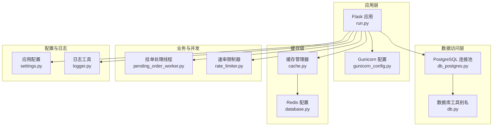
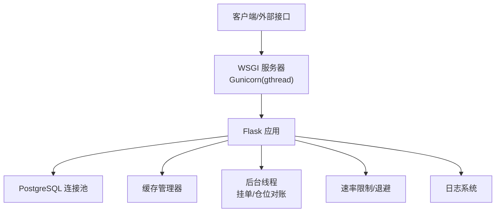
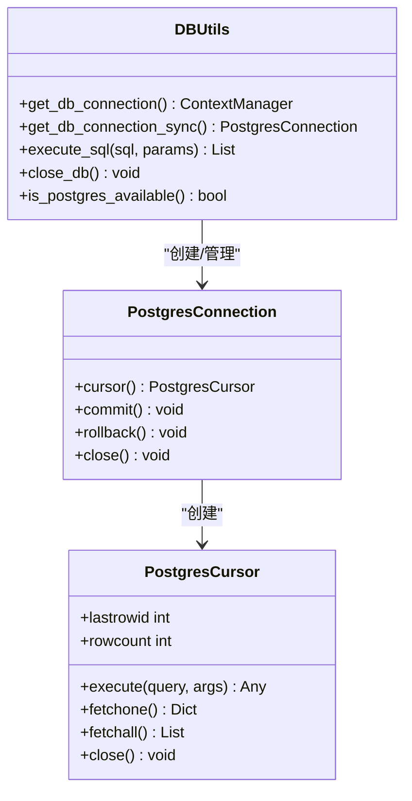
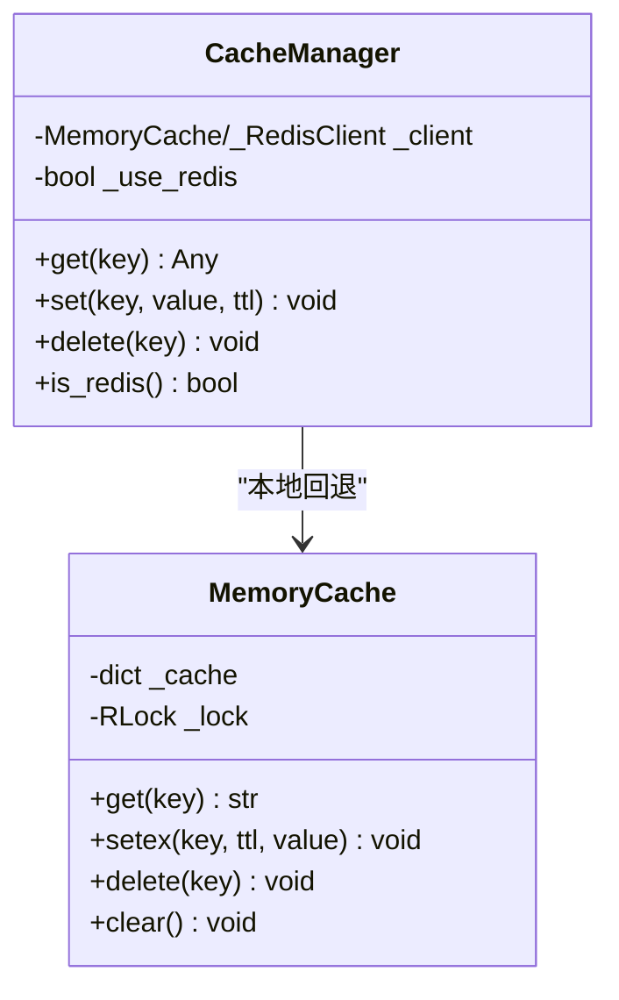
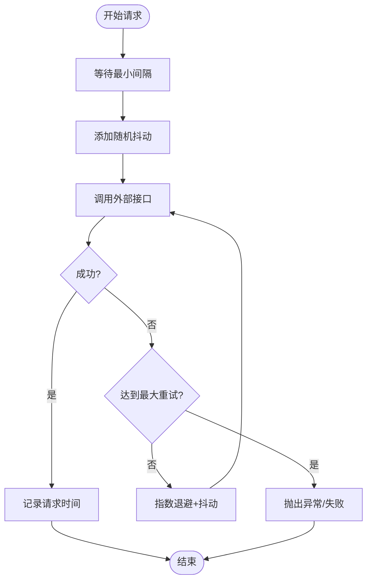
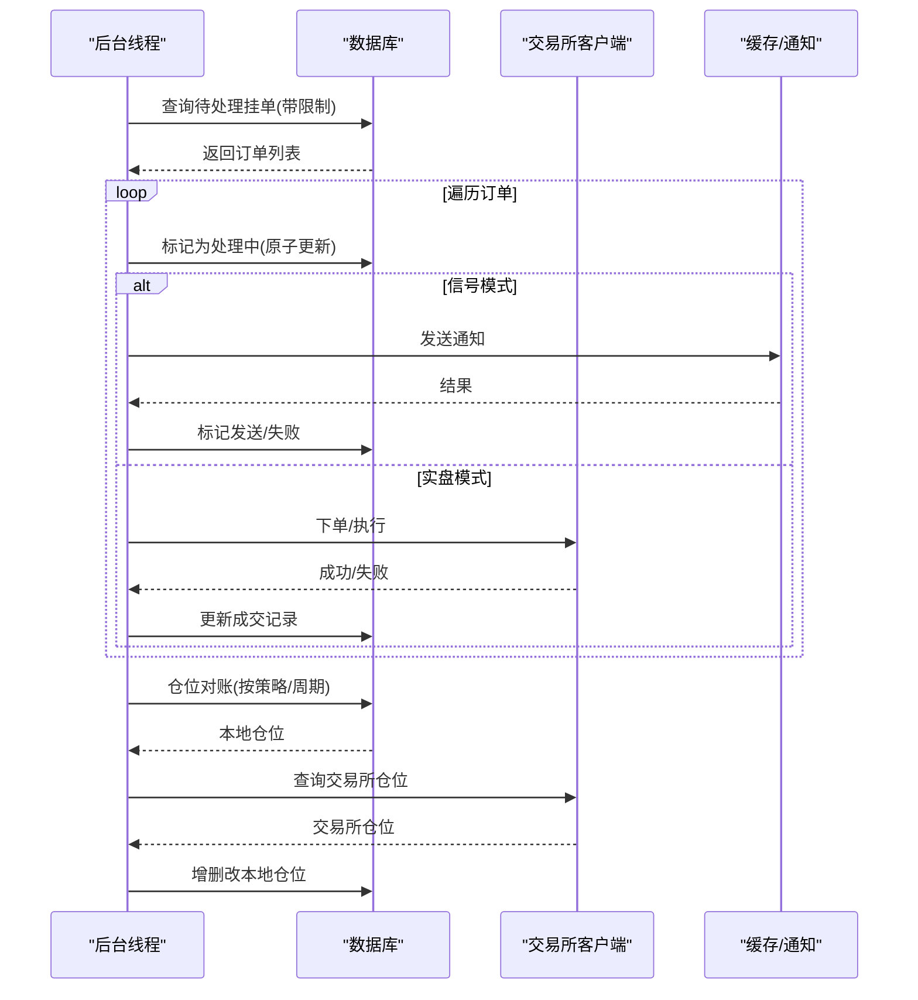
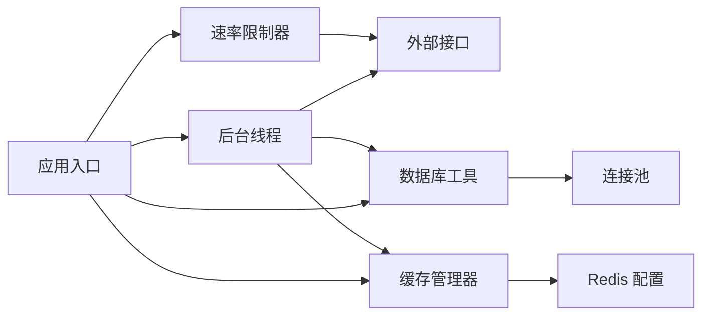

# 资源管理

<cite>
**本文引用的文件**
- [settings.py](file://backend_api_python/app/config/settings.py)
- [gunicorn_config.py](file://backend_api_python/gunicorn_config.py)
- [cache.py](file://backend_api_python/app/utils/cache.py)
- [rate_limiter.py](file://backend_api_python/app/data_sources/rate_limiter.py)
- [pending_order_worker.py](file://backend_api_python/app/services/pending_order_worker.py)
- [db.py](file://backend_api_python/app/utils/db.py)
- [db_postgres.py](file://backend_api_python/app/utils/db_postgres.py)
- [database.py](file://backend_api_python/app/config/database.py)
- [logger.py](file://backend_api_python/app/utils/logger.py)
- [run.py](file://backend_api_python/run.py)
- [start.sh](file://backend_api_python/start.sh)
- [docker-entrypoint.sh](file://backend_api_python/docker-entrypoint.sh)
</cite>

## 目录
1. [简介](#简介)
2. [项目结构](#项目结构)
3. [核心组件](#核心组件)
4. [架构总览](#架构总览)
5. [详细组件分析](#详细组件分析)
6. [依赖分析](#依赖分析)
7. [性能考量](#性能考量)
8. [故障排查指南](#故障排查指南)
9. [结论](#结论)
10. [附录](#附录)

## 简介
本指南聚焦于资源管理，涵盖内存管理策略、线程池与连接池配置、并发控制与线程安全、资源监控与性能瓶颈识别、资源限制与超时处理、优雅降级、进程与文件描述符管理以及系统资源优化最佳实践。文档以代码为依据，结合架构图与流程图，帮助读者在理解现有实现的基础上进行优化与运维。

## 项目结构
后端采用 Python + PostgreSQL + 可选 Redis 缓存，通过 Gunicorn 提供多线程工作模型；数据访问统一经由连接池；缓存支持本地内存与 Redis 双栈回退；速率限制与指数退避用于外部数据源访问；后台任务通过独立线程轮询执行。

**图表来源**
- [run.py:96-101](file://backend_api_python/run.py#L96-L101)
- [gunicorn_config.py:10-36](file://backend_api_python/gunicorn_config.py#L10-L36)
- [db_postgres.py:107-161](file://backend_api_python/app/utils/db_postgres.py#L107-L161)
- [db.py:19-25](file://backend_api_python/app/utils/db.py#L19-L25)
- [cache.py:49-129](file://backend_api_python/app/utils/cache.py#L49-L129)
- [database.py:6-47](file://backend_api_python/app/config/database.py#L6-L47)
- [pending_order_worker.py:52-98](file://backend_api_python/app/services/pending_order_worker.py#L52-L98)
- [rate_limiter.py:109-164](file://backend_api_python/app/data_sources/rate_limiter.py#L109-L164)
- [settings.py:92-99](file://backend_api_python/app/config/settings.py#L92-L99)
- [logger.py:9-48](file://backend_api_python/app/utils/logger.py#L9-L48)

**章节来源**
- [run.py:96-101](file://backend_api_python/run.py#L96-L101)
- [gunicorn_config.py:10-36](file://backend_api_python/gunicorn_config.py#L10-L36)
- [db_postgres.py:107-161](file://backend_api_python/app/utils/db_postgres.py#L107-L161)
- [cache.py:49-129](file://backend_api_python/app/utils/cache.py#L49-L129)
- [database.py:6-47](file://backend_api_python/app/config/database.py#L6-L47)
- [pending_order_worker.py:52-98](file://backend_api_python/app/services/pending_order_worker.py#L52-L98)
- [rate_limiter.py:109-164](file://backend_api_python/app/data_sources/rate_limiter.py#L109-L164)
- [settings.py:92-99](file://backend_api_python/app/config/settings.py#L92-L99)
- [logger.py:9-48](file://backend_api_python/app/utils/logger.py#L9-L48)

## 核心组件
- 应用配置与运行
  - 应用配置集中于配置元类，支持环境变量注入与附加配置加载。
  - 启动入口负责代理环境变量与本地开发体验优化。
- 线程池与并发模型
  - Gunicorn 使用 gthread 工作类，每工作进程内多线程，适合 I/O 密集型场景。
  - 后台线程用于挂单轮询与仓位对账，使用事件与锁保障线程安全。
- 连接池管理
  - PostgreSQL 连接池全局单例，支持健康检查与超时等待策略。
  - 数据库工具提供上下文管理器与同步获取两种方式。
- 缓存与内存
  - 缓存管理器优先使用内存缓存，可选启用 Redis；自动降级并记录日志。
  - 内存缓存使用锁保护，避免并发读写竞争。
- 速率限制与退避
  - 统一的速率限制器与指数退避装饰器，降低外部接口封禁风险。
- 日志与可观测性
  - 全局日志初始化与文件轮转，过滤噪声日志，便于问题定位。

**章节来源**
- [settings.py:6-99](file://backend_api_python/app/config/settings.py#L6-L99)
- [run.py:17-29](file://backend_api_python/run.py#L17-L29)
- [gunicorn_config.py:10-36](file://backend_api_python/gunicorn_config.py#L10-L36)
- [pending_order_worker.py:52-98](file://backend_api_python/app/services/pending_order_worker.py#L52-L98)
- [db_postgres.py:33-56](file://backend_api_python/app/utils/db_postgres.py#L33-L56)
- [db.py:19-25](file://backend_api_python/app/utils/db.py#L19-L25)
- [cache.py:49-129](file://backend_api_python/app/utils/cache.py#L49-L129)
- [rate_limiter.py:109-231](file://backend_api_python/app/data_sources/rate_limiter.py#L109-L231)
- [logger.py:9-48](file://backend_api_python/app/utils/logger.py#L9-L48)

## 架构总览
应用采用“单进程多线程”模型（Gunicorn gthread），I/O 并发通过线程实现；数据库访问统一走连接池；缓存层支持本地与 Redis 双栈；后台任务通过独立线程周期性执行；日志统一输出与轮转。

**图表来源**
- [gunicorn_config.py:10-36](file://backend_api_python/gunicorn_config.py#L10-L36)
- [run.py:96-101](file://backend_api_python/run.py#L96-L101)
- [db_postgres.py:107-161](file://backend_api_python/app/utils/db_postgres.py#L107-L161)
- [cache.py:49-129](file://backend_api_python/app/utils/cache.py#L49-L129)
- [pending_order_worker.py:52-98](file://backend_api_python/app/services/pending_order_worker.py#L52-L98)
- [rate_limiter.py:109-231](file://backend_api_python/app/data_sources/rate_limiter.py#L109-L231)
- [logger.py:9-48](file://backend_api_python/app/utils/logger.py#L9-L48)

## 详细组件分析

### 组件A：PostgreSQL 连接池与数据库工具
- 设计要点
  - 全局单例连接池，线程安全；支持最小/最大连接数、获取超时、健康检查。
  - 上下文管理器封装连接生命周期，异常时自动回滚并按状态丢弃连接。
  - 同步获取接口存在连接泄漏风险，建议优先使用上下文管理器。
- 资源分配与并发控制
  - 通过环境变量动态配置池大小与超时；健康检查在启用时对连接做快速有效性校验。
  - 获取连接时若池耗尽，按指数回退等待直至超时，避免瞬时压力导致请求失败。
- 线程安全保证
  - 池对象与获取/归还操作内部已考虑并发；应用层无需额外加锁。
- 性能与优化
  - 合理设置池大小与超时，避免频繁创建销毁连接；开启健康检查会增加少量往返查询开销。
  - 长事务会占用连接，应尽量缩短事务时长并及时提交/回滚。
- 关键路径与错误处理
  - 获取连接失败或连接断开时，记录错误并丢弃连接，防止污染池。
  - 关闭池时释放所有连接，确保优雅停机。

**图表来源**
- [db_postgres.py:371-400](file://backend_api_python/app/utils/db_postgres.py#L371-L400)
- [db_postgres.py:237-369](file://backend_api_python/app/utils/db_postgres.py#L237-L369)
- [db.py:19-25](file://backend_api_python/app/utils/db.py#L19-L25)

**章节来源**
- [db_postgres.py:33-56](file://backend_api_python/app/utils/db_postgres.py#L33-L56)
- [db_postgres.py:107-161](file://backend_api_python/app/utils/db_postgres.py#L107-L161)
- [db_postgres.py:184-235](file://backend_api_python/app/utils/db_postgres.py#L184-L235)
- [db_postgres.py:402-438](file://backend_api_python/app/utils/db_postgres.py#L402-L438)
- [db_postgres.py:485-495](file://backend_api_python/app/utils/db_postgres.py#L485-L495)
- [db.py:19-25](file://backend_api_python/app/utils/db.py#L19-L25)

### 组件B：缓存管理器与内存缓存
- 设计要点
  - 默认本地内存缓存，可选启用 Redis；不可用时自动降级并记录日志。
  - 单例懒加载，首次初始化时尝试连接 Redis，失败则回退内存缓存。
- 资源分配与并发控制
  - 内存缓存使用锁保护字典读写，避免并发冲突。
  - Redis 客户端在连接时设置超时参数，异常时静默降级。
- 线程安全保证
  - 缓存管理器自身为单例且线程安全；内存缓存内部加锁。
- 性能与优化
  - 本地缓存适合高并发低延迟场景；Redis 适合跨实例共享与持久化需求。
  - TTL 设置需结合业务热点与更新频率，避免缓存击穿与雪崩。
- 关键路径与错误处理
  - 读写异常均记录错误并返回空/失败，不影响主线程。

**图表来源**
- [cache.py:17-47](file://backend_api_python/app/utils/cache.py#L17-L47)
- [cache.py:49-129](file://backend_api_python/app/utils/cache.py#L49-L129)

**章节来源**
- [cache.py:17-47](file://backend_api_python/app/utils/cache.py#L17-L47)
- [cache.py:49-129](file://backend_api_python/app/utils/cache.py#L49-L129)
- [database.py:6-47](file://backend_api_python/app/config/database.py#L6-L47)

### 组件C：速率限制器与指数退避
- 设计要点
  - 统一的速率限制器：最小间隔 + 随机抖动，避免被识别为自动化。
  - 指数退避装饰器：支持自定义最大重试次数、基础延迟、最大延迟与异常类型。
- 资源分配与并发控制
  - 限流器内部维护上次请求时间，线程内使用局部变量，无需外部加锁。
  - 退避策略在异常时自动叠加延迟，降低对外部接口的压力。
- 线程安全保证
  - 限流器为无状态对象，线程内使用互斥保护时间戳字段。
- 性能与优化
  - 合理设置最小间隔与抖动范围，平衡吞吐与稳定性。
  - 退避上限避免长时间阻塞，必要时引入熔断或快速失败。

**图表来源**
- [rate_limiter.py:135-159](file://backend_api_python/app/data_sources/rate_limiter.py#L135-L159)
- [rate_limiter.py:194-231](file://backend_api_python/app/data_sources/rate_limiter.py#L194-L231)

**章节来源**
- [rate_limiter.py:109-164](file://backend_api_python/app/data_sources/rate_limiter.py#L109-L164)
- [rate_limiter.py:170-231](file://backend_api_python/app/data_sources/rate_limiter.py#L170-L231)

### 组件D：后台挂单处理线程
- 设计要点
  - 独立线程定时轮询挂单队列，批量处理并标记状态；支持回收“卡住”的订单。
  - 仓位对账为最佳努力同步，按策略分组查询交易所仓位并进行增删改。
- 资源分配与并发控制
  - 使用线程事件与锁控制启停与状态变更；数据库访问通过连接池。
  - 位置同步可配置开关与周期，避免频繁拉取造成压力。
- 线程安全保证
  - 启停与状态变更使用锁；数据库更新采用原子事务。
- 性能与优化
  - 批量大小与轮询间隔需根据负载调整；对账逻辑按策略聚合，减少重复查询。
  - 对账失败不影响主流程，记录日志并继续执行。

**图表来源**
- [pending_order_worker.py:91-122](file://backend_api_python/app/services/pending_order_worker.py#L91-L122)
- [pending_order_worker.py:637-683](file://backend_api_python/app/services/pending_order_worker.py#L637-L683)
- [pending_order_worker.py:138-636](file://backend_api_python/app/services/pending_order_worker.py#L138-L636)

**章节来源**
- [pending_order_worker.py:52-98](file://backend_api_python/app/services/pending_order_worker.py#L52-L98)
- [pending_order_worker.py:91-122](file://backend_api_python/app/services/pending_order_worker.py#L91-L122)
- [pending_order_worker.py:637-683](file://backend_api_python/app/services/pending_order_worker.py#L637-L683)
- [pending_order_worker.py:138-636](file://backend_api_python/app/services/pending_order_worker.py#L138-L636)

### 组件E：应用配置与日志
- 应用配置
  - 通过元类读取环境变量，支持主机、端口、调试、日志、限流、功能开关等。
- 日志系统
  - 全局初始化与文件轮转，过滤噪声日志，创建日志目录。
- 运行入口
  - 本地开发与生产环境入口，安全检查（如 SECRET_KEY）与代理设置。

**章节来源**
- [settings.py:6-99](file://backend_api_python/app/config/settings.py#L6-L99)
- [logger.py:9-48](file://backend_api_python/app/utils/logger.py#L9-L48)
- [run.py:17-29](file://backend_api_python/run.py#L17-L29)
- [run.py:104-134](file://backend_api_python/run.py#L104-L134)

## 依赖分析
- 组件耦合
  - 数据访问层与业务层解耦，通过上下文管理器与连接池抽象。
  - 缓存层与业务层松耦合，支持本地/Redis 双栈切换。
  - 后台线程与数据库/交易所交互，通过工厂与配置解析解耦具体实现。
- 外部依赖
  - PostgreSQL 驱动（psycopg2）、Redis 客户端、Gunicorn。
- 潜在循环依赖
  - 当前模块间无明显循环导入；注意在工厂/客户端创建处避免导入环。

**图表来源**
- [rate_limiter.py:109-231](file://backend_api_python/app/data_sources/rate_limiter.py#L109-L231)
- [cache.py:49-129](file://backend_api_python/app/utils/cache.py#L49-L129)
- [database.py:6-47](file://backend_api_python/app/config/database.py#L6-L47)
- [db_postgres.py:107-161](file://backend_api_python/app/utils/db_postgres.py#L107-L161)
- [pending_order_worker.py:52-98](file://backend_api_python/app/services/pending_order_worker.py#L52-L98)

**章节来源**
- [rate_limiter.py:109-231](file://backend_api_python/app/data_sources/rate_limiter.py#L109-L231)
- [cache.py:49-129](file://backend_api_python/app/utils/cache.py#L49-L129)
- [database.py:6-47](file://backend_api_python/app/config/database.py#L6-L47)
- [db_postgres.py:107-161](file://backend_api_python/app/utils/db_postgres.py#L107-L161)
- [pending_order_worker.py:52-98](file://backend_api_python/app/services/pending_order_worker.py#L52-L98)

## 性能考量
- 线程池与并发
  - Gunicorn gthread 适合 I/O 密集型；CPU 密集任务建议拆分或使用异步/子进程。
  - 后台线程数量与轮询间隔需与数据库/交易所能力匹配，避免过载。
- 连接池
  - 合理设置最小/最大连接数与获取超时；开启健康检查会带来微小开销。
  - 避免长事务与未提交事务，防止连接饥饿。
- 缓存
  - 本地缓存适合热点数据；Redis 适合跨实例共享；注意 TTL 与失效策略。
- 速率限制
  - 适当增大最小间隔与抖动范围，降低外部限流与封禁风险。
- 日志
  - 文件轮转与噪声过滤有助于减少磁盘与 I/O 压力。

[本节为通用指导，无需特定文件引用]

## 故障排查指南
- 连接池耗尽
  - 现象：获取连接超时并记录错误。
  - 排查：检查池大小、超时、健康检查、长事务与未提交事务。
  - 参考
    - [db_postgres.py:205-210](file://backend_api_python/app/utils/db_postgres.py#L205-L210)
    - [db_postgres.py:212-216](file://backend_api_python/app/utils/db_postgres.py#L212-L216)
- 连接断开或异常
  - 现象：操作异常并记录错误类型与消息。
  - 排查：确认网络、防火墙、PG 配置与 keepalives。
  - 参考
    - [db_postgres.py:420-423](file://backend_api_python/app/utils/db_postgres.py#L420-L423)
    - [db_postgres.py:394-399](file://backend_api_python/app/utils/db_postgres.py#L394-L399)
- 缓存不可用
  - 现象：启用 Redis 但不可用时自动降级为内存缓存。
  - 排查：检查 Redis 地址、密码、端口与网络连通性。
  - 参考
    - [cache.py:94-98](file://backend_api_python/app/utils/cache.py#L94-L98)
- 后台线程卡住或重复执行
  - 现象：订单状态长时间停留在 processing。
  - 排查：检查 stale 时间阈值、数据库锁与幂等性设计。
  - 参考
    - [pending_order_worker.py:640-663](file://backend_api_python/app/services/pending_order_worker.py#L640-L663)
- 速率限制导致延迟
  - 现象：请求响应变慢。
  - 排查：调整最小间隔与抖动范围，评估外部接口限流策略。
  - 参考
    - [rate_limiter.py:135-159](file://backend_api_python/app/data_sources/rate_limiter.py#L135-L159)
- 日志问题
  - 现象：日志缺失或过大。
  - 排查：确认日志目录权限、轮转参数与噪声过滤。
  - 参考
    - [logger.py:35-48](file://backend_api_python/app/utils/logger.py#L35-L48)

**章节来源**
- [db_postgres.py:205-210](file://backend_api_python/app/utils/db_postgres.py#L205-L210)
- [db_postgres.py:212-216](file://backend_api_python/app/utils/db_postgres.py#L212-L216)
- [db_postgres.py:420-423](file://backend_api_python/app/utils/db_postgres.py#L420-L423)
- [db_postgres.py:394-399](file://backend_api_python/app/utils/db_postgres.py#L394-L399)
- [cache.py:94-98](file://backend_api_python/app/utils/cache.py#L94-L98)
- [pending_order_worker.py:640-663](file://backend_api_python/app/services/pending_order_worker.py#L640-L663)
- [rate_limiter.py:135-159](file://backend_api_python/app/data_sources/rate_limiter.py#L135-L159)
- [logger.py:35-48](file://backend_api_python/app/utils/logger.py#L35-L48)

## 结论
本项目通过 Gunicorn gthread、PostgreSQL 连接池、本地/Redis 缓存与速率限制/退避机制，构建了稳定可扩展的资源管理体系。建议在生产环境中合理配置池大小与超时、启用健康检查、优化后台线程批处理与对账周期，并完善日志与告警体系以实现资源监控与故障快速定位。

[本节为总结，无需特定文件引用]

## 附录

### 资源监控与性能瓶颈识别
- 监控指标建议
  - 数据库：活跃连接数、等待时间、慢查询、事务回滚率。
  - 缓存：命中率、请求延迟、降级次数。
  - 后台线程：队列长度、处理耗时、失败率、对账覆盖率。
  - 外部接口：成功率、平均/95 分位延迟、重试次数。
- 内存泄漏检测
  - 使用内存分析工具定期采样；关注缓存容器增长与未释放对象。
  - 确认缓存键 TTL 与清理策略，避免无限增长。
- 性能瓶颈识别
  - 逐步隔离 I/O 与 CPU 瓶颈；对热点路径加缓存或异步化。
  - 对数据库与外部接口调用增加埋点与采样日志。

[本节为通用指导，无需特定文件引用]

### 资源限制、超时与优雅降级
- 资源限制
  - 连接池：设置最大连接数与获取超时，避免资源枯竭。
  - 缓存：限制条目数量与 TTL，启用 LRU 或淘汰策略。
  - 线程：控制后台线程数量与轮询间隔。
- 超时处理
  - 数据库：设置连接超时与查询超时；异常时回滚并丢弃连接。
  - 外部接口：统一的指数退避与最大重试次数。
- 优雅降级
  - Redis 不可用时自动降级为内存缓存。
  - 连接池耗尽时等待或快速失败，避免级联故障。

**章节来源**
- [db_postgres.py:184-235](file://backend_api_python/app/utils/db_postgres.py#L184-L235)
- [rate_limiter.py:170-231](file://backend_api_python/app/data_sources/rate_limiter.py#L170-L231)
- [cache.py:94-98](file://backend_api_python/app/utils/cache.py#L94-L98)

### 进程管理、文件描述符与系统资源优化
- 进程管理
  - 使用 Gunicorn 管理进程与线程；生产环境建议固定工作进程数与线程数。
- 文件描述符
  - 合理设置系统 ulimit，避免因文件句柄不足导致连接失败。
- 系统资源优化
  - 调整内核参数（如 TCP keepalives）提升连接稳定性。
  - 使用 systemd 或容器编排工具限制 CPU/内存，避免资源争用。

**章节来源**
- [gunicorn_config.py:10-36](file://backend_api_python/gunicorn_config.py#L10-L36)
- [start.sh:18-22](file://backend_api_python/start.sh#L18-L22)
- [docker-entrypoint.sh:25-42](file://backend_api_python/docker-entrypoint.sh#L25-L42)