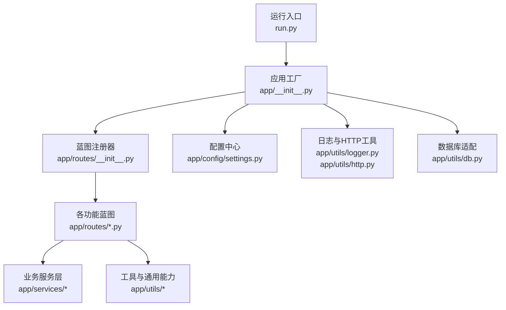
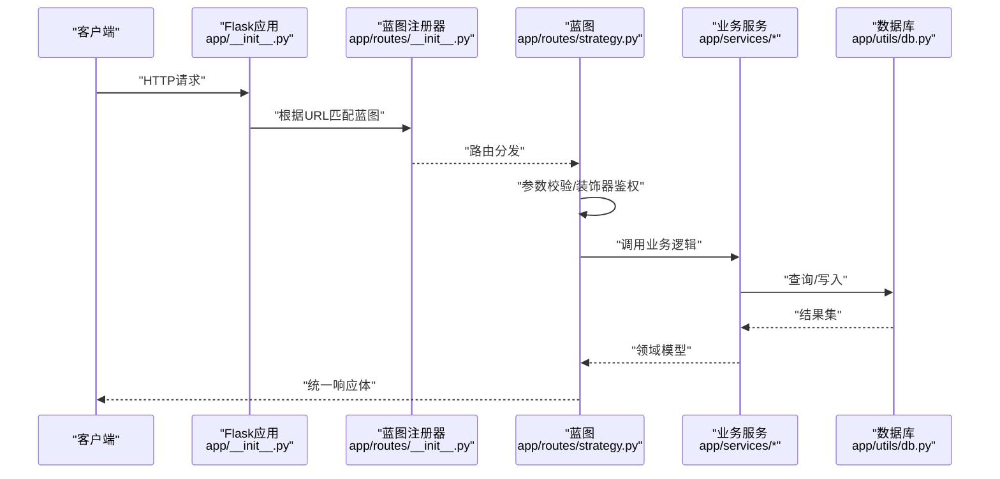
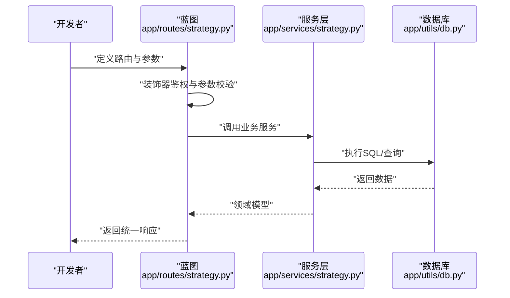
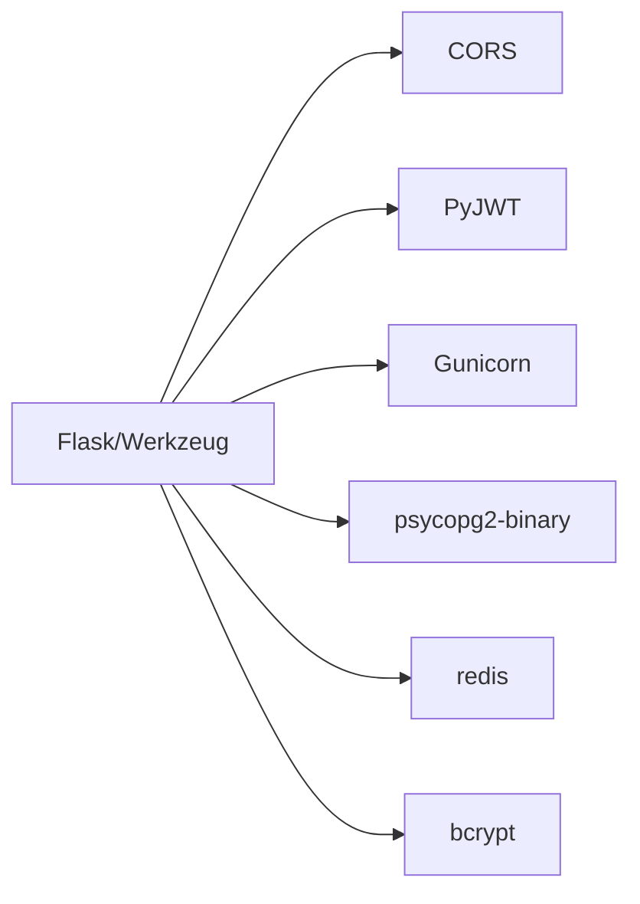

# API扩展

<cite>
**本文引用的文件**   
- [app/__init__.py](file://backend_api_python/app/__init__.py)
- [run.py](file://backend_api_python/run.py)
- [app/routes/__init__.py](file://backend_api_python/app/routes/__init__.py)
- [app/config/settings.py](file://backend_api_python/app/config/settings.py)
- [app/utils/auth.py](file://backend_api_python/app/utils/auth.py)
- [app/routes/health.py](file://backend_api_python/app/routes/health.py)
- [app/routes/auth.py](file://backend_api_python/app/routes/auth.py)
- [app/routes/user.py](file://backend_api_python/app/routes/user.py)
- [app/routes/strategy.py](file://backend_api_python/app/routes/strategy.py)
- [app/utils/http.py](file://backend_api_python/app/utils/http.py)
- [app/utils/logger.py](file://backend_api_python/app/utils/logger.py)
- [app/utils/db.py](file://backend_api_python/app/utils/db.py)
- [requirements.txt](file://backend_api_python/requirements.txt)
- [gunicorn_config.py](file://backend_api_python/gunicorn_config.py)
</cite>

## 目录
1. [简介](#简介)
2. [项目结构](#项目结构)
3. [核心组件](#核心组件)
4. [架构总览](#架构总览)
5. [详细组件分析](#详细组件分析)
6. [依赖分析](#依赖分析)
7. [性能考量](#性能考量)
8. [故障排查指南](#故障排查指南)
9. [结论](#结论)
10. [附录](#附录)

## 简介
本指南面向希望在QuantDinger后端API上进行扩展开发的工程师，系统讲解如何新增API端点，涵盖以下主题：
- 蓝图（Blueprint）组织与路由注册
- 请求处理与统一响应格式
- API版本控制、参数校验与错误处理
- 完整开发示例（从蓝图定义到业务逻辑）
- 文档生成、测试策略与性能优化
- 安全与访问控制（认证、授权、速率限制）

## 项目结构
后端采用Flask应用工厂模式，所有API路由通过蓝图集中注册，配合统一的JSON序列化与CORS支持。应用入口负责加载环境变量、初始化数据库与后台任务，并启动WSGI服务器。

图表来源
- [run.py:100-134](file://backend_api_python/run.py#L100-L134)
- [app/__init__.py:212-269](file://backend_api_python/app/__init__.py#L212-L269)
- [app/routes/__init__.py:7-53](file://backend_api_python/app/routes/__init__.py#L7-L53)

章节来源
- [run.py:100-134](file://backend_api_python/run.py#L100-L134)
- [app/__init__.py:212-269](file://backend_api_python/app/__init__.py#L212-L269)
- [app/routes/__init__.py:7-53](file://backend_api_python/app/routes/__init__.py#L7-L53)

## 核心组件
- 应用工厂与JSON提供者
  - 自定义安全JSON提供者，确保NaN/Infinity输出为null，避免前端解析异常。
  - 启动时初始化数据库、管理员账户、后台任务与全局单例（交易执行器、挂单处理等）。
- 蓝图注册器
  - 统一注册所有蓝图，并按前缀分组，如/api/auth、/api/users、/api/indicator、/api/market等。
- 配置中心
  - 通过环境变量驱动主机、端口、调试模式、密钥、日志级别、缓存开关、请求日志开关、限流阈值等。
- 认证与权限
  - JWT令牌签发与校验；基于角色的访问控制装饰器；支持多用户与单用户模式回退。
- 日志与HTTP工具
  - 结构化日志、轮转文件、过滤器；可重试HTTP会话封装。
- 数据库适配
  - PostgreSQL连接池与初始化检查。

章节来源
- [app/__init__.py:15-269](file://backend_api_python/app/__init__.py#L15-L269)
- [app/routes/__init__.py:7-53](file://backend_api_python/app/routes/__init__.py#L7-L53)
- [app/config/settings.py:1-99](file://backend_api_python/app/config/settings.py#L1-L99)
- [app/utils/auth.py:18-239](file://backend_api_python/app/utils/auth.py#L18-L239)
- [app/utils/logger.py:9-63](file://backend_api_python/app/utils/logger.py#L9-L63)
- [app/utils/http.py:9-42](file://backend_api_python/app/utils/http.py#L9-L42)
- [app/utils/db.py:19-66](file://backend_api_python/app/utils/db.py#L19-L66)

## 架构总览
下图展示从请求进入至响应返回的关键路径，以及蓝图与服务层的交互。

图表来源
- [app/__init__.py:244-245](file://backend_api_python/app/__init__.py#L244-L245)
- [app/routes/__init__.py:32-53](file://backend_api_python/app/routes/__init__.py#L32-L53)
- [app/routes/strategy.py:28-26](file://backend_api_python/app/routes/strategy.py#L28-L26)
- [app/utils/db.py:19-25](file://backend_api_python/app/utils/db.py#L19-L25)

## 详细组件分析

### 蓝图组织与路由注册
- 注册顺序与URL前缀
  - 所有蓝图在注册器中集中导入并注册，按功能域设置前缀，如/api/auth、/api/users、/api/indicator、/api/market等。
- 新增蓝图步骤
  - 在app/routes下创建新文件并定义蓝图对象；
  - 在注册器中导入该蓝图并在合适位置注册；
  - 如需特定前缀，传入url_prefix参数。

章节来源
- [app/routes/__init__.py:7-53](file://backend_api_python/app/routes/__init__.py#L7-L53)

### 请求处理与统一响应格式
- 统一响应结构
  - 成功：包含code=1、msg、data字段；
  - 失败：包含code非1、msg、data=None或具体错误信息。
- 错误处理
  - 明确的状态码（如400、401、403、429、500）与错误消息；
  - 异常捕获与日志记录，避免敏感信息泄露。
- 示例参考
  - 健康检查端点返回标准结构；
  - 用户管理端点对查询参数做范围限制与校验。

章节来源
- [app/routes/health.py:10-34](file://backend_api_python/app/routes/health.py#L10-L34)
- [app/routes/user.py:41-68](file://backend_api_python/app/routes/user.py#L41-L68)

### API版本控制
- 当前约定
  - 路由以/api前缀为主，未显式在路径中体现版本号；
  - 可通过在蓝图注册时增加版本前缀（如/api/v1/...）实现版本隔离。
- 建议实践
  - 为重大变更引入新版本前缀；
  - 旧版本端点保留过渡期并标注废弃。

（本节为概念性说明，无需源码引用）

### 参数验证与错误处理机制
- 路由级校验
  - 查询参数类型转换与边界约束（如page/page_size最小最大值）；
  - 请求体字段存在性与格式校验（邮箱、用户名、密码强度等）。
- 装饰器鉴权
  - @login_required：从Authorization头提取Bearer Token并注入g.user_id/g.user_role；
  - @admin_required/@manager_required：基于角色判断；
  - @permission_required：基于用户权限集合判断。
- 速率限制与安全
  - 登录接口集成安全服务进行Turnstile校验与登录尝试计数；
  - 配置中心提供全局限流阈值。

章节来源
- [app/utils/auth.py:126-218](file://backend_api_python/app/utils/auth.py#L126-L218)
- [app/routes/auth.py:140-279](file://backend_api_python/app/routes/auth.py#L140-L279)
- [app/config/settings.py:66-91](file://backend_api_python/app/config/settings.py#L66-L91)

### 完整API开发示例（从蓝图到业务逻辑）
以下流程以“策略管理”为例，展示典型端到端实现：

图表来源
- [app/routes/strategy.py:28-26](file://backend_api_python/app/routes/strategy.py#L28-L26)
- [app/utils/db.py:19-25](file://backend_api_python/app/utils/db.py#L19-L25)

章节来源
- [app/routes/strategy.py:31-122](file://backend_api_python/app/routes/strategy.py#L31-L122)

### 安全与访问控制
- 认证
  - JWT签发与校验，支持token版本（单点登录）；
  - 支持多用户与单用户模式回退。
- 授权
  - 角色枚举与权限映射；
  - 装饰器链路：@login_required必须在@permission_required之前使用。
- 安全增强
  - Turnstile人机验证；
  - 登录尝试计数与封禁；
  - 密码哈希（优先bcrypt，降级SHA256）。

章节来源
- [app/utils/auth.py:18-239](file://backend_api_python/app/utils/auth.py#L18-L239)
- [app/routes/auth.py:140-279](file://backend_api_python/app/routes/auth.py#L140-L279)
- [app/services/user_service.py:56-101](file://backend_api_python/app/services/user_service.py#L56-L101)

### API文档生成、测试策略与性能优化
- 文档生成
  - 使用蓝图注释与示例端点作为OpenAPI/Swagger的基础；
  - 建议结合自动化工具（如基于蓝图反射的文档生成器）维护接口契约。
- 测试策略
  - 单元测试：针对服务层函数与工具模块；
  - 集成测试：端到端覆盖关键流程（登录、策略编译、回测等）；
  - 性能测试：并发压测与慢查询定位。
- 性能优化
  - 使用线程型Gunicorn工作进程（gthread），提升I/O并发；
  - 合理设置workers与threads；
  - 启用数据库连接池与缓存（Redis可选）；
  - 重试HTTP请求，降低外部依赖抖动影响。

章节来源
- [gunicorn_config.py:10-36](file://backend_api_python/gunicorn_config.py#L10-L36)
- [app/utils/http.py:9-42](file://backend_api_python/app/utils/http.py#L9-L42)
- [requirements.txt:19-22](file://backend_api_python/requirements.txt#L19-L22)

## 依赖分析
- 外部依赖
  - Flask/Werkzeug、CORS、JWT、PostgreSQL驱动、Redis、Gunicorn、bcrypt等。
- 内部耦合
  - 蓝图依赖服务层与工具模块；
  - 服务层依赖数据库工具与配置中心；
  - 认证工具贯穿各蓝图，形成一致的安全基线。

图表来源
- [requirements.txt:1-37](file://backend_api_python/requirements.txt#L1-L37)

章节来源
- [requirements.txt:1-37](file://backend_api_python/requirements.txt#L1-L37)

## 性能考量
- 并发模型
  - 默认1个worker、4线程，适合单机I/O密集场景；高并发可提升GUNICORN_WORKERS与GUNICORN_THREADS。
- I/O优化
  - 使用可重试HTTP会话，降低第三方API波动；
  - 启用数据库连接池与索引优化。
- 日志与监控
  - 合理的日志级别与轮转，避免磁盘与I/O压力；
  - 关键路径埋点与指标采集（待补充）。

（本节为通用指导，无需源码引用）

## 故障排查指南
- 常见问题
  - 无法连接数据库：检查DATABASE_URL与网络连通；
  - JWT无效或过期：确认密钥一致与token未被篡改；
  - 登录失败：查看Turnstile校验、速率限制与账户状态。
- 排查步骤
  - 查看应用日志（控制台与文件）；
  - 核对环境变量（SECRET_KEY、HOST、PORT、DEBUG等）；
  - 使用健康检查端点确认服务可用性。

章节来源
- [app/utils/logger.py:9-63](file://backend_api_python/app/utils/logger.py#L9-L63)
- [app/routes/health.py:10-34](file://backend_api_python/app/routes/health.py#L10-L34)
- [app/config/settings.py:10-28](file://backend_api_python/app/config/settings.py#L10-L28)

## 结论
通过蓝图化组织与统一的认证授权体系，QuantDinger后端API具备良好的扩展性与安全性。遵循本文的开发流程与最佳实践，可在保证一致性的同时快速迭代新功能。

## 附录
- 快速开始
  - 在app/routes下新增蓝图文件，定义路由与装饰器；
  - 在app/routes/__init__.py中注册蓝图并设置前缀；
  - 在app/services中实现业务逻辑，使用app/utils/db.py进行数据库操作；
  - 使用app/utils/auth.py提供的装饰器保障安全；
  - 通过run.py启动应用，或使用gunicorn部署。

章节来源
- [app/routes/__init__.py:7-53](file://backend_api_python/app/routes/__init__.py#L7-L53)
- [run.py:100-134](file://backend_api_python/run.py#L100-L134)
- [gunicorn_config.py:10-36](file://backend_api_python/gunicorn_config.py#L10-L36)