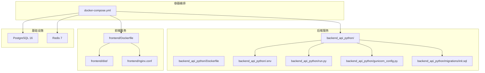
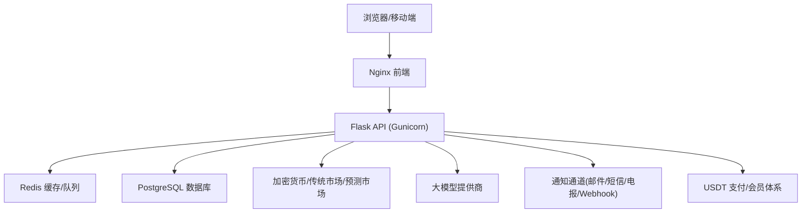
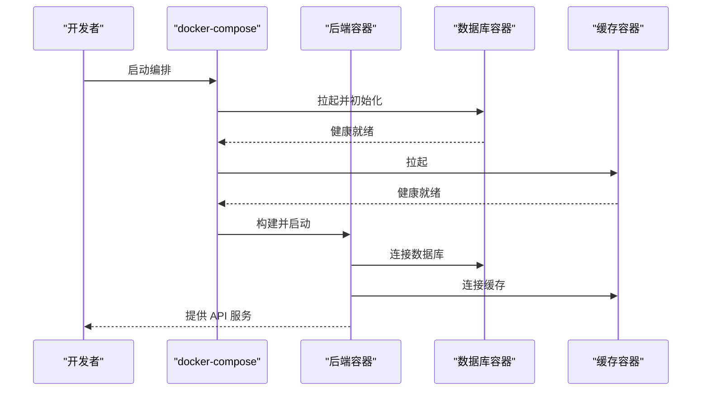
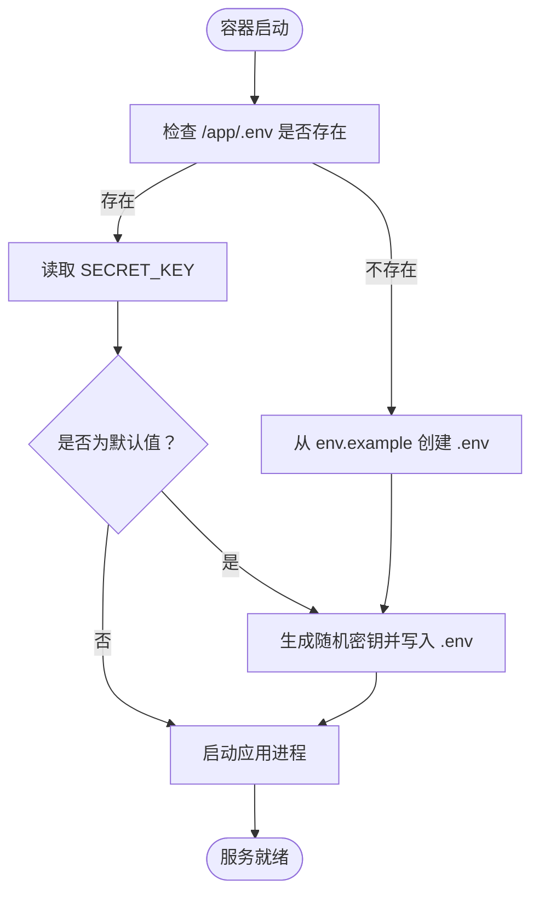
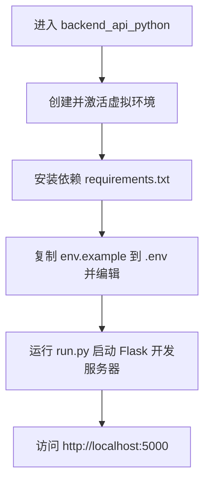
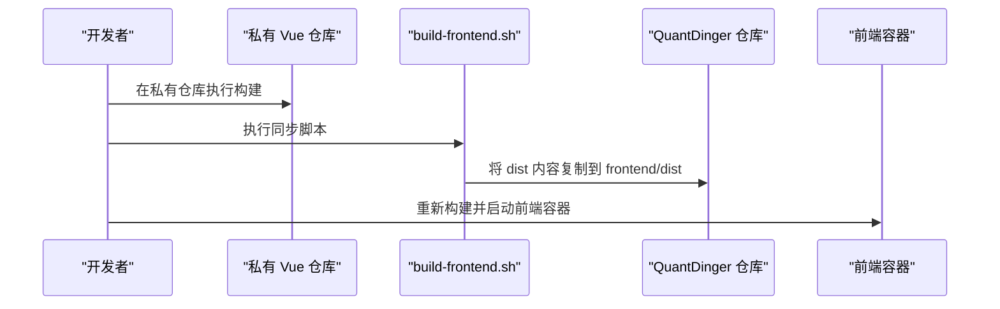
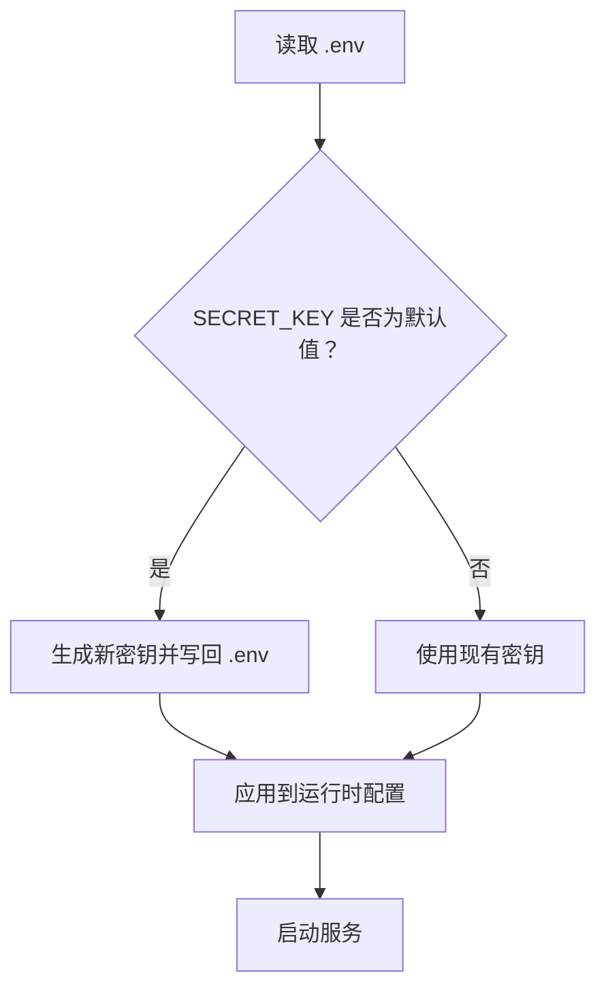
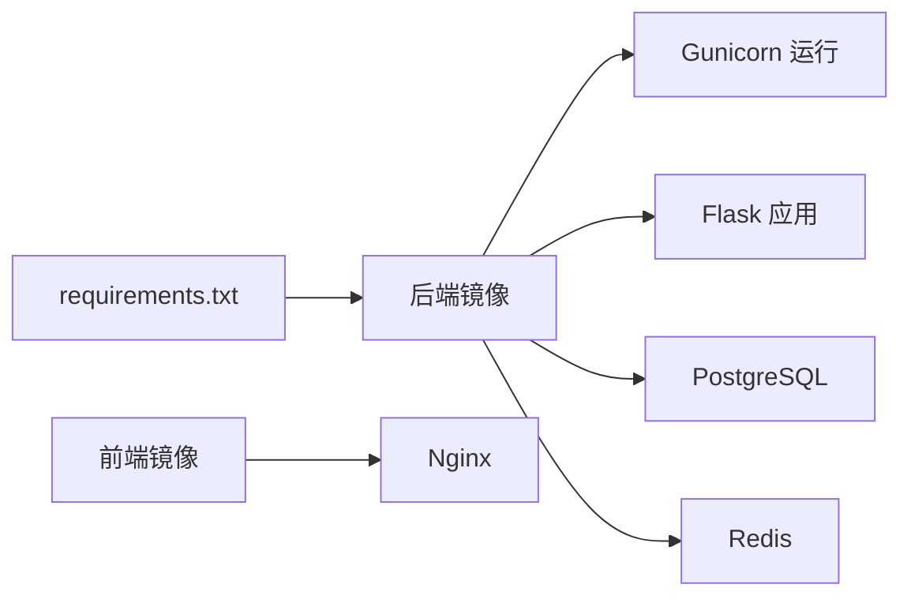

# 开发环境搭建

<cite>
**本文引用的文件**   
- [DEVELOPMENT.md](file://DEVELOPMENT.md)
- [README.md](file://README.md)
- [docker-compose.yml](file://docker-compose.yml)
- [backend_api_python/Dockerfile](file://backend_api_python/Dockerfile)
- [frontend/Dockerfile](file://frontend/Dockerfile)
- [backend_api_python/env.example](file://backend_api_python/env.example)
- [backend_api_python/run.py](file://backend_api_python/run.py)
- [backend_api_python/gunicorn_config.py](file://backend_api_python/gunicorn_config.py)
- [scripts/generate-secret-key.sh](file://scripts/generate-secret-key.sh)
- [scripts/build-frontend.sh](file://scripts/build-frontend.sh)
- [backend_api_python/start.sh](file://backend_api_python/start.sh)
- [backend_api_python/docker-entrypoint.sh](file://backend_api_python/docker-entrypoint.sh)
- [backend_api_python/requirements.txt](file://backend_api_python/requirements.txt)
- [backend_api_python/tests/conftest.py](file://backend_api_python/tests/conftest.py)
- [backend_api_python/migrations/init.sql](file://backend_api_python/migrations/init.sql)
- [backend_api_python/app/config/settings.py](file://backend_api_python/app/config/settings.py)
</cite>

## 目录
1. [简介](#简介)
2. [项目结构](#项目结构)
3. [核心组件](#核心组件)
4. [架构总览](#架构总览)
5. [详细组件分析](#详细组件分析)
6. [依赖关系分析](#依赖关系分析)
7. [性能与并发特性](#性能与并发特性)
8. [故障排查指南](#故障排查指南)
9. [结论](#结论)
10. [附录](#附录)

## 简介
本指南面向希望在本地快速搭建并运行 QuantDinger 的开发者，覆盖以下主题：
- 使用 Docker Compose 进行容器化一键部署
- 在宿主机上直接运行后端（无需 Docker）的本地开发流程
- 前端静态资源的构建与交付方式
- 环境变量与安全密钥管理
- 开发工具与调试配置建议
- 常见问题排查与解决方案
- 开发、测试与生产环境的差异与切换方法

## 项目结构
仓库采用“前后端分离 + 容器编排”的组织方式：
- backend_api_python：Flask 后端（Python），包含路由、服务、数据源适配、配置与迁移脚本
- frontend：预构建的前端静态资源（Vue 源码位于私有仓库，通过脚本同步）
- docs：产品文档与部署指南
- scripts：辅助脚本（生成密钥、同步前端等）
- docker-compose.yml：统一编排后端、前端、数据库与缓存服务

**图示来源**
- [docker-compose.yml:25-167](file://docker-compose.yml#L25-L167)
- [backend_api_python/Dockerfile:1-62](file://backend_api_python/Dockerfile#L1-L62)
- [frontend/Dockerfile:1-19](file://frontend/Dockerfile#L1-L19)
- [backend_api_python/run.py:1-134](file://backend_api_python/run.py#L1-L134)
- [backend_api_python/gunicorn_config.py:1-36](file://backend_api_python/gunicorn_config.py#L1-L36)
- [backend_api_python/migrations/init.sql:1-120](file://backend_api_python/migrations/init.sql#L1-L120)

**章节来源**
- [README.md: 466-484:466-484](file://README.md#L466-L484)
- [docker-compose.yml: 1-167:1-167](file://docker-compose.yml#L1-L167)

## 核心组件
- 后端 API（Flask + Gunicorn）：提供 REST 接口、策略引擎、交易执行、AI 分析等能力
- 前端（Nginx）：仅负责静态资源交付，Vue 源码在私有仓库维护
- 数据库（PostgreSQL 16）：存储用户、策略、回测、订单、分析记忆等数据
- 缓存（Redis 7）：用于队列、会话与运行时协调
- 配置与密钥：通过 .env 文件集中管理，支持根目录与后端目录双层加载

**章节来源**
- [backend_api_python/run.py: 17-29:17-29](file://backend_api_python/run.py#L17-L29)
- [backend_api_python/app/config/settings.py: 30-42:30-42](file://backend_api_python/app/config/settings.py#L30-L42)

## 架构总览
下图展示从浏览器到后端、再到数据库与外部服务的数据流与交互。

**图示来源**
- [README.md: 269-321:269-321](file://README.md#L269-L321)
- [docker-compose.yml: 29-154:29-154](file://docker-compose.yml#L29-L154)

## 详细组件分析

### Docker 环境配置与容器化部署
- 使用 docker-compose 一键启动：postgres、redis、backend、frontend 四个服务
- 端口映射与网络隔离：通过环境变量控制前端、后端、数据库、Redis 的端口；服务间通过自定义桥接网络通信
- 健康检查：各服务均配置健康检查，确保依赖可用后再启动上游服务
- 镜像来源：可通过根目录 .env 的 IMAGE_PREFIX 统一切换镜像源

**图示来源**
- [docker-compose.yml: 29-131:29-131](file://docker-compose.yml#L29-L131)

**章节来源**
- [docker-compose.yml: 1-167:1-167](file://docker-compose.yml#L1-L167)

### 后端容器镜像与启动流程
- 基础镜像与加速：Dockerfile 中优先使用阿里云镜像源，失败则回退官方源；pip 安装依赖时同样尝试国内镜像
- 入口脚本：docker-entrypoint.sh 负责检查 .env 并自动补齐默认密钥，再启动 gunicorn
- 运行入口：run.py 加载 .env，创建 Flask 应用，并在生产模式下对默认密钥进行安全替换

**图示来源**
- [backend_api_python/docker-entrypoint.sh: 11-48:11-48](file://backend_api_python/docker-entrypoint.sh#L11-L48)
- [backend_api_python/Dockerfile: 35-61:35-61](file://backend_api_python/Dockerfile#L35-L61)
- [backend_api_python/run.py: 109-120:109-120](file://backend_api_python/run.py#L109-L120)

**章节来源**
- [backend_api_python/Dockerfile: 1-62:1-62](file://backend_api_python/Dockerfile#L1-L62)
- [backend_api_python/docker-entrypoint.sh: 1-49:1-49](file://backend_api_python/docker-entrypoint.sh#L1-L49)
- [backend_api_python/run.py: 104-134:104-134](file://backend_api_python/run.py#L104-L134)

### 本地开发环境（非容器）
- Python 版本要求：3.10+
- 虚拟环境：推荐使用 venv 创建隔离环境
- 依赖安装：requirements.txt
- 启动方式：run.py 或 start.sh（开发模式使用 Flask 自带服务器，生产使用 Gunicorn）

**图示来源**
- [DEVELOPMENT.md: 65-75:65-75](file://DEVELOPMENT.md#L65-L75)
- [backend_api_python/start.sh: 8-22:8-22](file://backend_api_python/start.sh#L8-L22)
- [backend_api_python/requirements.txt: 1-37:1-37](file://backend_api_python/requirements.txt#L1-L37)

**章节来源**
- [DEVELOPMENT.md: 65-75:65-75](file://DEVELOPMENT.md#L65-L75)
- [backend_api_python/start.sh: 1-27:1-27](file://backend_api_python/start.sh#L1-L27)
- [backend_api_python/requirements.txt: 1-37:1-37](file://backend_api_python/requirements.txt#L1-L37)

### 前端构建与交付
- 前端源码位于私有仓库，通过脚本将 dist 同步到本仓库的 frontend/dist
- 前端镜像仅复制 dist 目录并通过 Nginx 提供静态服务
- 若需更新前端，先在私有仓库构建，再执行同步脚本

**图示来源**
- [scripts/build-frontend.sh: 10-52:10-52](file://scripts/build-frontend.sh#L10-L52)
- [frontend/Dockerfile: 13-18:13-18](file://frontend/Dockerfile#L13-L18)

**章节来源**
- [DEVELOPMENT.md: 77-108:77-108](file://DEVELOPMENT.md#L77-L108)
- [scripts/build-frontend.sh: 1-53:1-53](file://scripts/build-frontend.sh#L1-L53)
- [frontend/Dockerfile: 1-19:1-19](file://frontend/Dockerfile#L1-L19)

### 环境变量与安全密钥管理
- 主配置模板：backend_api_python/env.example
- 关键变量（节选）：
  - 认证与安全：SECRET_KEY、ADMIN_USER、ADMIN_PASSWORD
  - 数据库：DATABASE_URL
  - 缓存：REDIS_HOST、REDIS_PORT、CACHE_ENABLED
  - AI/LLM：LLM_PROVIDER、OPENAI_API_KEY、OPENROUTER_API_KEY 等
  - OAuth：GOOGLE_*、GITHUB_*、TURNSTILE_*
  - 支付与会员：USDT_PAY_ENABLED、MEMBERSHIP_*、BILLING_*
  - 工作线程与连接池：GUNICORN_WORKERS、GUNICORN_THREADS、DB_POOL_*、MARKET_EXECUTOR_WORKERS、PORTFOLIO_EXECUTOR_WORKERS
- 生成安全密钥：提供脚本自动生成并写入 .env
- 容器内密钥校验：docker-entrypoint.sh 会在启动前检查并自动补齐默认密钥

**图示来源**
- [backend_api_python/env.example: 13-15:13-15](file://backend_api_python/env.example#L13-L15)
- [scripts/generate-secret-key.sh: 16-26:16-26](file://scripts/generate-secret-key.sh#L16-L26)
- [backend_api_python/docker-entrypoint.sh: 25-42:25-42](file://backend_api_python/docker-entrypoint.sh#L25-L42)
- [backend_api_python/run.py: 109-120:109-120](file://backend_api_python/run.py#L109-L120)

**章节来源**
- [backend_api_python/env.example: 1-288:1-288](file://backend_api_python/env.example#L1-L288)
- [scripts/generate-secret-key.sh: 1-34:1-34](file://scripts/generate-secret-key.sh#L1-L34)
- [backend_api_python/docker-entrypoint.sh: 1-49:1-49](file://backend_api_python/docker-entrypoint.sh#L1-L49)
- [backend_api_python/run.py: 109-120:109-120](file://backend_api_python/run.py#L109-L120)

### 开发工具与调试配置
- 后端调试：run.py 使用 Flask 开发服务器（线程模式），便于断点与热重载
- 前端调试：由于前端为静态资源，可在浏览器开发者工具中调试
- 测试：pytest 配置在 tests/conftest.py，最小化环境变量以保证测试稳定
- 生产部署：使用 Gunicorn（gunicorn_config.py）承载多线程请求

**章节来源**
- [backend_api_python/run.py: 124-129:124-129](file://backend_api_python/run.py#L124-L129)
- [backend_api_python/gunicorn_config.py: 10-36:10-36](file://backend_api_python/gunicorn_config.py#L10-L36)
- [backend_api_python/tests/conftest.py: 19-31:19-31](file://backend_api_python/tests/conftest.py#L19-L31)

### 数据库初始化与表结构
- 初始化脚本：migrations/init.sql 在首次启动时自动执行，创建用户、策略、回测、订单、分析记忆等核心表
- 种子数据：包含热门标的清单，便于快速体验

**章节来源**
- [backend_api_python/migrations/init.sql: 1-L120:1-120](file://backend_api_python/migrations/init.sql#L1-L120)

## 依赖关系分析
- 后端依赖：Flask、Werkzeug、gunicorn、psycopg2、redis、PyJWT、bcrypt、ccxt、yfinance、finnhub、akshare 等
- 前端镜像：基于 nginx:alpine，仅复制 dist 目录
- 容器间依赖：后端依赖数据库与缓存健康就绪后才启动

**图示来源**
- [backend_api_python/requirements.txt: 1-37:1-37](file://backend_api_python/requirements.txt#L1-L37)
- [frontend/Dockerfile: 9-18:9-18](file://frontend/Dockerfile#L9-L18)
- [docker-compose.yml: 89-131:89-131](file://docker-compose.yml#L89-L131)

**章节来源**
- [backend_api_python/requirements.txt: 1-37:1-37](file://backend_api_python/requirements.txt#L1-L37)
- [frontend/Dockerfile: 1-19:1-19](file://frontend/Dockerfile#L1-L19)
- [docker-compose.yml: 25-167:25-167](file://docker-compose.yml#L25-L167)

## 性能与并发特性
- 连接池与工作线程：通过 DB_POOL_MIN/MAX、GUNICORN_WORKERS/THREADS、执行器并行度等参数调优
- 缓存：启用 Redis 可显著降低数据库压力与响应延迟
- 健康检查：compose 层级的健康检查确保服务可用性

**章节来源**
- [backend_api_python/env.example: 44-61:44-61](file://backend_api_python/env.example#L44-L61)
- [docker-compose.yml: 113-122:113-122](file://docker-compose.yml#L113-L122)
- [backend_api_python/gunicorn_config.py: 10-36:10-36](file://backend_api_python/gunicorn_config.py#L10-L36)

## 故障排查指南
- 十二数据接口报错“apikey 参数错误”：检查 .env 中 TWELVE_DATA_API_KEY，部分数据需付费计划
- 热力图显示“暂无数据”：通常由 yfinance 返回 NaN 导致，系统已对 NaN/Inf 做清洗处理
- Redis 连接被拒：确认 redis 服务已启动；若不可用，可设置 CACHE_ENABLED=false 降级为内存缓存
- 后端无法启动（默认密钥）：确保 .env 中 SECRET_KEY 已修改为随机值
- 常用命令：查看状态、查看日志、重启服务、重建与关闭

**章节来源**
- [DEVELOPMENT.md: 146-151:146-151](file://DEVELOPMENT.md#L146-L151)
- [README.md: 361-369:361-369](file://README.md#L361-L369)

## 结论
通过 Docker Compose，QuantDinger 实现了“一键部署、即开即用”的开发体验；同时保留了在宿主机直接运行后端的能力，便于本地调试与迭代。配合完善的环境变量体系与安全密钥管理机制，开发者可以快速完成从开发到生产的全流程。

## 附录

### 开发/测试/生产环境差异与切换
- 开发环境：Flask 自带服务器（run.py），便于断点与热重载
- 测试环境：pytest 使用最小化环境变量，确保测试稳定性
- 生产环境：Gunicorn（gunicorn_config.py）承载请求，容器内通过 docker-entrypoint.sh 完成密钥校验与启动

**章节来源**
- [backend_api_python/run.py: 124-129:124-129](file://backend_api_python/run.py#L124-L129)
- [backend_api_python/gunicorn_config.py: 10-36:10-36](file://backend_api_python/gunicorn_config.py#L10-L36)
- [backend_api_python/tests/conftest.py: 8-14:8-14](file://backend_api_python/tests/conftest.py#L8-L14)