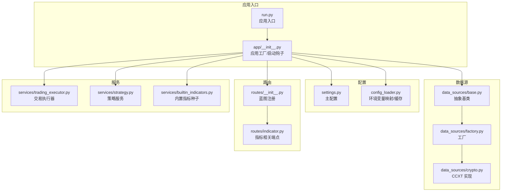
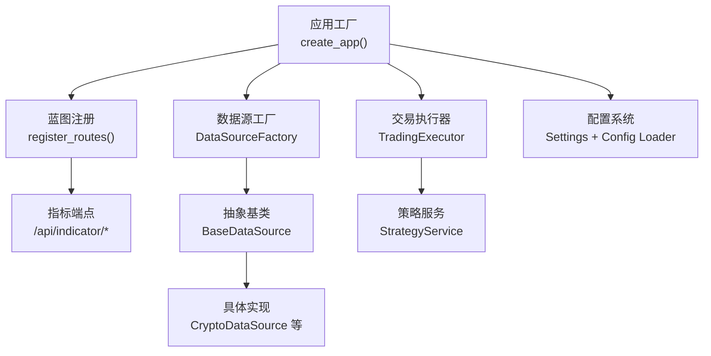
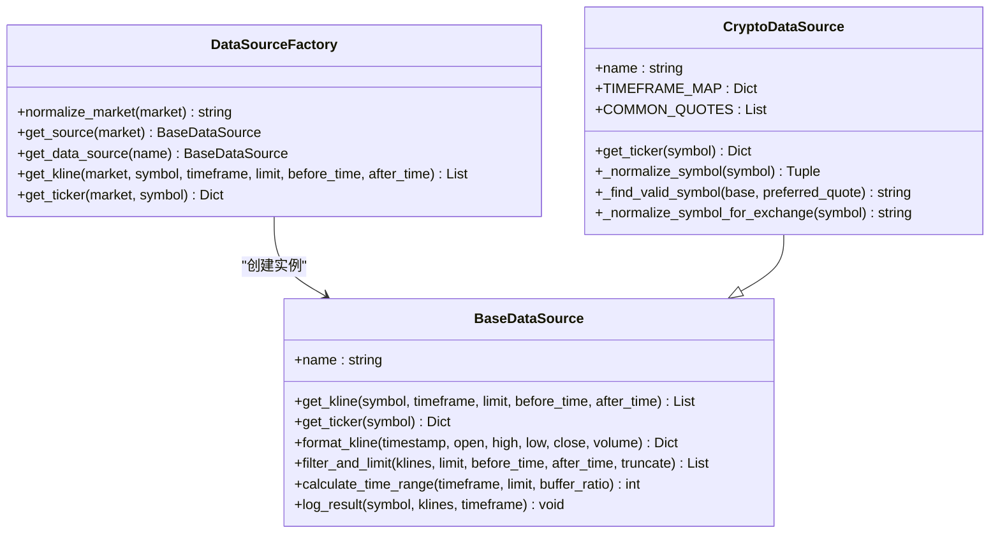
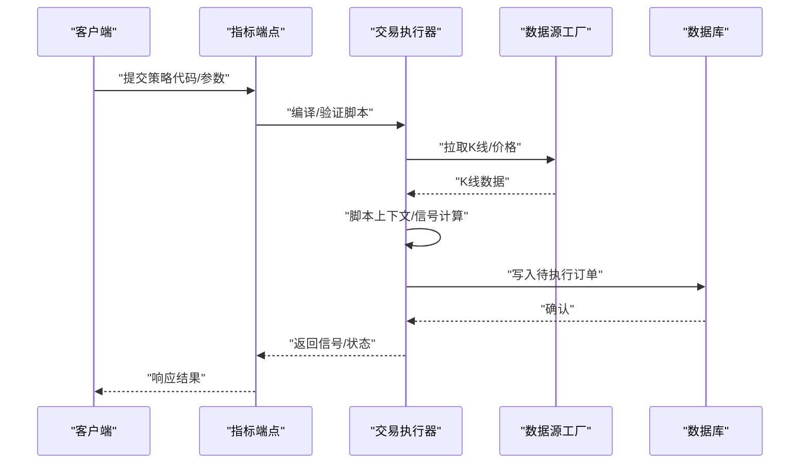
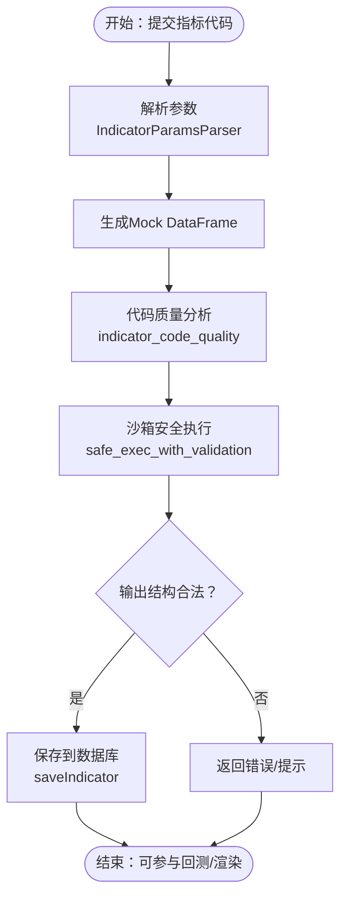
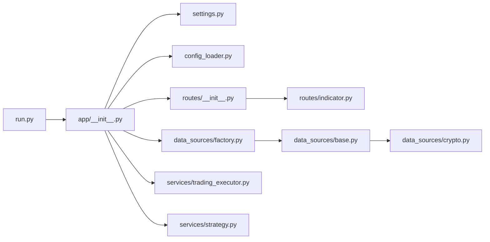

# 扩展开发

<cite>
**本文引用的文件**
- [backend_api_python/app/__init__.py](file://backend_api_python/app/__init__.py)
- [backend_api_python/run.py](file://backend_api_python/run.py)
- [backend_api_python/app/config/settings.py](file://backend_api_python/app/config/settings.py)
- [backend_api_python/app/utils/config_loader.py](file://backend_api_python/app/utils/config_loader.py)
- [backend_api_python/app/data_sources/base.py](file://backend_api_python/app/data_sources/base.py)
- [backend_api_python/app/data_sources/factory.py](file://backend_api_python/app/data_sources/factory.py)
- [backend_api_python/app/data_sources/crypto.py](file://backend_api_python/app/data_sources/crypto.py)
- [backend_api_python/app/routes/__init__.py](file://backend_api_python/app/routes/__init__.py)
- [backend_api_python/app/routes/indicator.py](file://backend_api_python/app/routes/indicator.py)
- [backend_api_python/app/services/builtin_indicators.py](file://backend_api_python/app/services/builtin_indicators.py)
- [backend_api_python/app/services/trading_executor.py](file://backend_api_python/app/services/trading_executor.py)
- [backend_api_python/app/services/strategy.py](file://backend_api_python/app/services/strategy.py)
- [DEVELOPMENT.md](file://DEVELOPMENT.md)
- [CONTRIBUTING.md](file://CONTRIBUTING.md)
</cite>

## 目录
1. [简介](#简介)
2. [项目结构](#项目结构)
3. [核心组件](#核心组件)
4. [架构总览](#架构总览)
5. [详细组件分析](#详细组件分析)
6. [依赖分析](#依赖分析)
7. [性能考虑](#性能考虑)
8. [故障排查指南](#故障排查指南)
9. [结论](#结论)
10. [附录](#附录)

## 简介
本指南面向希望为 QuantDinger 扩展功能的开发者，聚焦于三类扩展能力：数据源插件、执行器插件与指标插件。文档将从扩展点识别、接口设计、集成流程、新 API 端点开发、配置扩展、功能集成、开发与测试、代码规范与贡献流程、第三方集成与适配器、以及发布与版本管理等方面，提供系统化的开发指引。

## 项目结构
QuantDinger 后端采用 Flask 应用工厂模式，核心模块围绕“配置—数据源—路由—服务—工具”的层次组织。扩展开发主要涉及以下目录与文件：
- 配置层：settings.py、config_loader.py
- 数据源层：data_sources/base.py、factory.py、具体数据源实现（如 crypto.py）
- 路由层：routes/__init__.py、各蓝图（如 indicator.py）
- 服务层：trading_executor.py、strategy.py、builtin_indicators.py 等
- 应用入口：run.py、app/__init__.py

图表来源
- [backend_api_python/run.py:1-134](file://backend_api_python/run.py#L1-L134)
- [backend_api_python/app/__init__.py:212-269](file://backend_api_python/app/__init__.py#L212-L269)
- [backend_api_python/app/config/settings.py:1-99](file://backend_api_python/app/config/settings.py#L1-L99)
- [backend_api_python/app/utils/config_loader.py:24-161](file://backend_api_python/app/utils/config_loader.py#L24-L161)
- [backend_api_python/app/data_sources/base.py:27-179](file://backend_api_python/app/data_sources/base.py#L27-L179)
- [backend_api_python/app/data_sources/factory.py:27-169](file://backend_api_python/app/data_sources/factory.py#L27-L169)
- [backend_api_python/app/data_sources/crypto.py:16-200](file://backend_api_python/app/data_sources/crypto.py#L16-L200)
- [backend_api_python/app/routes/__init__.py:7-53](file://backend_api_python/app/routes/__init__.py#L7-L53)
- [backend_api_python/app/routes/indicator.py:411-451](file://backend_api_python/app/routes/indicator.py#L411-L451)
- [backend_api_python/app/services/trading_executor.py:37-800](file://backend_api_python/app/services/trading_executor.py#L37-L800)
- [backend_api_python/app/services/strategy.py:14-200](file://backend_api_python/app/services/strategy.py#L14-L200)
- [backend_api_python/app/services/builtin_indicators.py:17-250](file://backend_api_python/app/services/builtin_indicators.py#L17-L250)

章节来源
- [DEVELOPMENT.md:39-63](file://DEVELOPMENT.md#L39-L63)
- [backend_api_python/app/routes/__init__.py:7-53](file://backend_api_python/app/routes/__init__.py#L7-L53)

## 核心组件
- 应用工厂与启动钩子：负责初始化数据库、管理员账户、CORS、日志、以及各类后台工作线程（挂单处理、组合监控、USDT 支付、Polymarket 等）。
- 配置系统：集中于 settings.py 与 config_loader.py，支持环境变量与扁平键到嵌套配置的映射，提供安全的类型转换与缓存。
- 数据源体系：抽象基类定义统一接口，工厂按市场类型选择具体实现，支持 CCXT、yfinance 等多种来源。
- 路由与蓝图：统一注册各业务蓝图，指标相关端点位于 /api/indicator 前缀下。
- 交易执行器：策略线程驱动、K 线与价格缓存、信号去重、脚本上下文与订单转换。
- 策略服务：运行中策略查询、交易所符号获取、连接测试并发控制等。

章节来源
- [backend_api_python/app/__init__.py:212-269](file://backend_api_python/app/__init__.py#L212-L269)
- [backend_api_python/app/config/settings.py:92-99](file://backend_api_python/app/config/settings.py#L92-L99)
- [backend_api_python/app/utils/config_loader.py:24-161](file://backend_api_python/app/utils/config_loader.py#L24-L161)
- [backend_api_python/app/data_sources/base.py:27-179](file://backend_api_python/app/data_sources/base.py#L27-L179)
- [backend_api_python/app/data_sources/factory.py:27-169](file://backend_api_python/app/data_sources/factory.py#L27-L169)
- [backend_api_python/app/routes/__init__.py:7-53](file://backend_api_python/app/routes/__init__.py#L7-L53)
- [backend_api_python/app/services/trading_executor.py:37-800](file://backend_api_python/app/services/trading_executor.py#L37-L800)
- [backend_api_python/app/services/strategy.py:14-200](file://backend_api_python/app/services/strategy.py#L14-L200)

## 架构总览
下图展示扩展开发的关键交互：应用工厂创建 Flask 应用，注册路由蓝图；数据源工厂按市场类型选择具体实现；指标端点负责指标代码校验与存储；交易执行器驱动策略运行。

图表来源
- [backend_api_python/app/__init__.py:244-245](file://backend_api_python/app/__init__.py#L244-L245)
- [backend_api_python/app/routes/__init__.py:7-53](file://backend_api_python/app/routes/__init__.py#L7-L53)
- [backend_api_python/app/data_sources/factory.py:47-102](file://backend_api_python/app/data_sources/factory.py#L47-L102)
- [backend_api_python/app/data_sources/base.py:27-55](file://backend_api_python/app/data_sources/base.py#L27-L55)
- [backend_api_python/app/services/trading_executor.py:37-68](file://backend_api_python/app/services/trading_executor.py#L37-L68)
- [backend_api_python/app/services/strategy.py:14-22](file://backend_api_python/app/services/strategy.py#L14-L22)
- [backend_api_python/app/config/settings.py:92-99](file://backend_api_python/app/config/settings.py#L92-L99)
- [backend_api_python/app/utils/config_loader.py:24-161](file://backend_api_python/app/utils/config_loader.py#L24-L161)

## 详细组件分析

### 数据源插件开发指南
- 扩展点识别
  - 抽象接口：BaseDataSource 定义 get_kline、get_ticker、格式化与过滤等通用能力。
  - 工厂注册：DataSourceFactory.normalize_market 与 _create_source 提供市场枚举标准化与实例化。
  - 具体实现：以 CryptoDataSource 为例，展示 CCXT 适配、符号归一化、市场加载与错误处理。
- 接口设计
  - get_kline：统一返回包含 time、open、high、low、close、volume 的字典列表。
  - get_ticker：返回最新行情（可选），兼容 CCXT fetch_ticker 形状。
  - 工具方法：format_kline、filter_and_limit、calculate_time_range、log_result。
- 集成流程
  - 在 data_sources/factory.py 的 _MARKET_ALIASES 与 _create_source 中注册新市场类型。
  - 在 data_sources/ 下新增实现文件，继承 BaseDataSource 并实现必要方法。
  - 在 routes 层通过 market 参数路由到对应数据源，或在服务层直接调用 DataSourceFactory.get_source。
- 第三方集成
  - CCXT 适配：通过 CCXTConfig 读取超时、限流、代理与默认交易所。
  - 符号映射：针对不同交易所的符号差异进行归一化处理。
- 性能与健壮性
  - 缓存与限流：利用工厂与配置层的限流与超时参数。
  - 数据延迟检测：log_result 对不同周期的延迟阈值进行差异化判断。

图表来源
- [backend_api_python/app/data_sources/base.py:27-179](file://backend_api_python/app/data_sources/base.py#L27-L179)
- [backend_api_python/app/data_sources/factory.py:27-169](file://backend_api_python/app/data_sources/factory.py#L27-L169)
- [backend_api_python/app/data_sources/crypto.py:16-200](file://backend_api_python/app/data_sources/crypto.py#L16-L200)

章节来源
- [backend_api_python/app/data_sources/base.py:27-179](file://backend_api_python/app/data_sources/base.py#L27-L179)
- [backend_api_python/app/data_sources/factory.py:27-169](file://backend_api_python/app/data_sources/factory.py#L27-L169)
- [backend_api_python/app/data_sources/crypto.py:16-200](file://backend_api_python/app/data_sources/crypto.py#L16-L200)

### 执行器插件开发指南
- 扩展点识别
  - TradingExecutor：策略线程生命周期管理、K 线与价格缓存、信号去重、脚本上下文与订单转换。
  - StrategyService：运行中策略查询、交易所符号获取、连接测试并发控制。
- 接口设计
  - start_strategy/stop_strategy：线程安全地启停策略。
  - _script_evaluate_new_closed_bar/_script_orders_to_execution_signals：将脚本输出转换为执行信号。
  - 位置状态与状态机：_position_state/_is_signal_allowed 控制开平仓顺序。
- 集成流程
  - 在策略服务中注册策略类型（如 IndicatorStrategy/ScriptStrategy）。
  - 通过 TradingExecutor 的策略循环拉取 K 线、计算信号、写入待执行队列。
  - 结合 live_trading 适配器完成实盘下单（非 CCXT 直接下单）。
- 性能与健壮性
  - 线程上限与资源状态打印，避免 can't start new thread/OOM。
  - 信号去重缓存，防止同一蜡烛的重复订单。
  - 交换机费缓存与数据库字段保障。

图表来源
- [backend_api_python/app/routes/indicator.py:673-715](file://backend_api_python/app/routes/indicator.py#L673-L715)
- [backend_api_python/app/services/trading_executor.py:393-445](file://backend_api_python/app/services/trading_executor.py#L393-L445)
- [backend_api_python/app/data_sources/factory.py:105-140](file://backend_api_python/app/data_sources/factory.py#L105-L140)

章节来源
- [backend_api_python/app/services/trading_executor.py:37-800](file://backend_api_python/app/services/trading_executor.py#L37-L800)
- [backend_api_python/app/services/strategy.py:14-200](file://backend_api_python/app/services/strategy.py#L14-L200)

### 指标插件开发指南
- 扩展点识别
  - 指标端点：/api/indicator/* 提供指标列表、保存、删除、参数解析、代码校验与 AI 生成。
  - 代码质量：indicator_code_quality 分析、安全执行沙箱、mock DataFrame 验证。
  - 内置指标：seed_builtin_indicators_for_new_user 为新用户注入示例指标包。
- 接口设计
  - verifyCode：对指标代码进行语法、运行时与输出结构校验。
  - aiGenerate：SSE 流式生成指标代码（本地模式下提供合理模板）。
  - 参数解析：IndicatorParamsParser 解析与合并用户参数。
- 集成流程
  - 前端在指标 IDE 中编写代码，调用 verifyCode 进行本地验证。
  - 通过 saveIndicator 持久化到数据库，支持社区发布与审核流程。
  - 回测与图表渲染：遵循 output 字典结构（name/plots/signals）。
- 第三方集成
  - LLM Provider：OpenRouter/OpenAI/Google Gemini 等，通过 config_loader 映射环境变量。
  - 搜索与分析：Tavily、SerpAPI、Google CSE/Bing 等搜索提供商配置。

图表来源
- [backend_api_python/app/routes/indicator.py:126-278](file://backend_api_python/app/routes/indicator.py#L126-L278)
- [backend_api_python/app/services/builtin_indicators.py:192-250](file://backend_api_python/app/services/builtin_indicators.py#L192-L250)
- [backend_api_python/app/utils/config_loader.py:60-147](file://backend_api_python/app/utils/config_loader.py#L60-L147)

章节来源
- [backend_api_python/app/routes/indicator.py:411-451](file://backend_api_python/app/routes/indicator.py#L411-L451)
- [backend_api_python/app/routes/indicator.py:673-715](file://backend_api_python/app/routes/indicator.py#L673-L715)
- [backend_api_python/app/services/builtin_indicators.py:17-250](file://backend_api_python/app/services/builtin_indicators.py#L17-L250)

### 新 API 端点开发指南
- 蓝图注册：在 routes/__init__.py 中导入并注册新的蓝图，设置 url_prefix。
- 权限与认证：使用 @login_required 等装饰器保护端点。
- 数据访问：通过 get_db_connection 获取连接，注意事务与异常处理。
- 输出规范：统一返回 { code, msg, data } 结构，错误时返回 4xx/5xx。
- 示例：参考 indicator.py 中的 GET/POST 端点模式。

章节来源
- [backend_api_python/app/routes/__init__.py:7-53](file://backend_api_python/app/routes/__init__.py#L7-L53)
- [backend_api_python/app/routes/indicator.py:411-451](file://backend_api_python/app/routes/indicator.py#L411-L451)

### 配置扩展与功能集成
- 环境变量映射：config_loader 将扁平键映射为嵌套配置（如 openrouter.api_key → openrouter.api_key），并提供类型转换与缓存。
- 应用配置：settings.py 提供主机、端口、调试、日志、速率限制、功能开关等。
- 功能开关：通过 load_addon_config 读取 app.enable_cache、app.enable_request_log 等。
- 安全与密钥：run.py 在生产模式下自动替换默认 SECRET_KEY。

章节来源
- [backend_api_python/app/utils/config_loader.py:24-161](file://backend_api_python/app/utils/config_loader.py#L24-L161)
- [backend_api_python/app/config/settings.py:92-99](file://backend_api_python/app/config/settings.py#L92-L99)
- [backend_api_python/run.py:104-134](file://backend_api_python/run.py#L104-L134)

## 依赖分析
- 组件耦合
  - 应用工厂与配置层：应用启动时加载配置并初始化数据库与管理员账户。
  - 数据源工厂与具体实现：通过工厂解耦市场类型与实现细节。
  - 路由与服务：蓝图注册集中管理，服务层通过工具模块提供能力。
- 外部依赖
  - CCXT：用于加密货币数据与实时报价。
  - 请求库：requests 用于特定交易所 REST 接口。
  - 数据库：PostgreSQL，迁移脚本与种子数据。
- 循环依赖
  - 当前结构清晰，未发现明显循环依赖。

图表来源
- [backend_api_python/run.py:96-101](file://backend_api_python/run.py#L96-L101)
- [backend_api_python/app/__init__.py:244-245](file://backend_api_python/app/__init__.py#L244-L245)
- [backend_api_python/app/routes/__init__.py:7-53](file://backend_api_python/app/routes/__init__.py#L7-L53)
- [backend_api_python/app/data_sources/factory.py:47-102](file://backend_api_python/app/data_sources/factory.py#L47-L102)
- [backend_api_python/app/data_sources/base.py:27-55](file://backend_api_python/app/data_sources/base.py#L27-L55)
- [backend_api_python/app/data_sources/crypto.py:16-53](file://backend_api_python/app/data_sources/crypto.py#L16-L53)
- [backend_api_python/app/services/trading_executor.py:25-32](file://backend_api_python/app/services/trading_executor.py#L25-L32)
- [backend_api_python/app/services/strategy.py:14-22](file://backend_api_python/app/services/strategy.py#L14-L22)

章节来源
- [backend_api_python/app/__init__.py:212-269](file://backend_api_python/app/__init__.py#L212-L269)
- [backend_api_python/app/data_sources/factory.py:27-169](file://backend_api_python/app/data_sources/factory.py#L27-L169)

## 性能考虑
- 线程与资源
  - 交易执行器限制最大线程数，避免资源耗尽；提供资源状态打印辅助诊断。
- 缓存与去重
  - 价格缓存与 TTL、信号去重缓存，减少重复计算与订单风暴。
- I/O 与限流
  - 数据源层统一超时与限流配置，避免外部依赖拖垮系统。
- 数据一致性
  - K 线按时间排序与截断，确保回测窗口边界正确。

章节来源
- [backend_api_python/app/services/trading_executor.py:40-68](file://backend_api_python/app/services/trading_executor.py#L40-L68)
- [backend_api_python/app/data_sources/base.py:105-139](file://backend_api_python/app/data_sources/base.py#L105-L139)

## 故障排查指南
- 启动与配置
  - SECRET_KEY 默认值：run.py 在生产模式下会自动生成随机密钥并提示持久化。
  - 环境变量：确保 .env 中关键变量（如 SECRET_KEY、ADMIN_USER/PASSWORD、LLM Provider 等）正确设置。
- 数据源问题
  - CCXT 代理：run.py 会根据 PROXY_URL 设置 ALL_PROXY/HTTP_PROXY/HTTPS_PROXY，并对国内金融域名设置 NO_PROXY。
  - 符号与市场：CryptoDataSource 的符号归一化与市场加载失败时的降级处理。
- 指标端点
  - verifyCode：检查输出结构（必须包含 plots 或 signals），长度与类型校验。
  - AI 生成：本地模式下若未配置 OpenRouter Key，返回合理模板而非报错。
- 策略与执行
  - 线程限制：超过最大线程数会拒绝启动策略，查看资源状态日志。
  - 信号去重：若出现重复订单，检查去重 TTL 与信号时间戳。

章节来源
- [backend_api_python/run.py:104-134](file://backend_api_python/run.py#L104-L134)
- [backend_api_python/app/data_sources/crypto.py:54-69](file://backend_api_python/app/data_sources/crypto.py#L54-L69)
- [backend_api_python/app/routes/indicator.py:126-278](file://backend_api_python/app/routes/indicator.py#L126-L278)
- [backend_api_python/app/services/trading_executor.py:410-416](file://backend_api_python/app/services/trading_executor.py#L410-L416)

## 结论
QuantDinger 的扩展开发围绕“配置—数据源—路由—服务—工具”五层结构展开。通过抽象基类与工厂模式实现数据源插件化，通过蓝图与端点实现功能扩展，通过配置系统与环境变量实现灵活部署。指标插件与执行器插件分别面向“可视化与回测”和“实时交易”，两者协同工作形成完整的策略生命周期闭环。遵循本文档的接口设计、集成流程与最佳实践，可高效、安全地扩展系统能力。

## 附录
- 开发环境搭建
  - Docker 快速启动：docker compose up -d，前端默认端口 8888，后端 5000。
  - 本地运行：安装依赖、复制并编辑 .env、python run.py。
- 调试工具
  - 启动钩子：应用启动时自动初始化数据库、管理员账户、后台工作线程。
  - 日志：统一日志配置，支持级别与文件轮转。
- 测试策略
  - 后端：pytest tests/；前端：本地开发服务器验证页面与组件。
- 代码规范与贡献流程
  - 分支命名：fix/xxx、feat/xxx、docs/xxx、chore/xxx。
  - 提交说明：说明变更原因、测试方式、UI 截图（如有）、兼容性说明。
- 第三方集成与适配器
  - LLM Provider：OpenRouter、OpenAI、Google Gemini、DeepSeek、xAI Grok、MiniMax 等。
  - 搜索：Google CSE、Bing、Tavily、SerpAPI。
- 发布与版本管理
  - Docker 镜像：通过 docker-compose 构建与运行。
  - 版本：应用版本在 settings.py 中维护，发布时更新版本号并同步文档。

章节来源
- [DEVELOPMENT.md:11-28](file://DEVELOPMENT.md#L11-L28)
- [DEVELOPMENT.md:65-76](file://DEVELOPMENT.md#L65-L76)
- [DEVELOPMENT.md:110-124](file://DEVELOPMENT.md#L110-L124)
- [DEVELOPMENT.md:138-144](file://DEVELOPMENT.md#L138-L144)
- [CONTRIBUTING.md:120-140](file://CONTRIBUTING.md#L120-L140)
- [backend_api_python/app/config/settings.py:27-28](file://backend_api_python/app/config/settings.py#L27-L28)