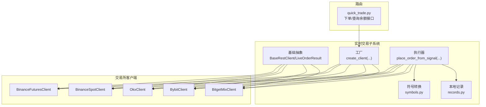
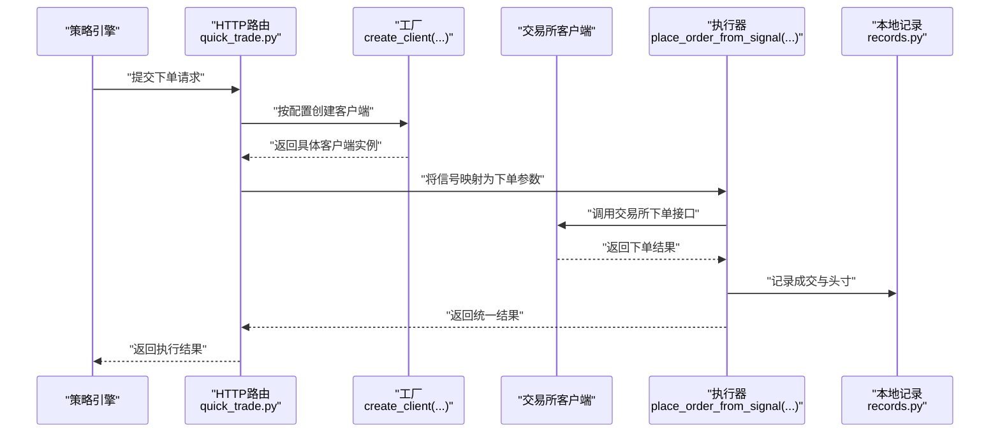
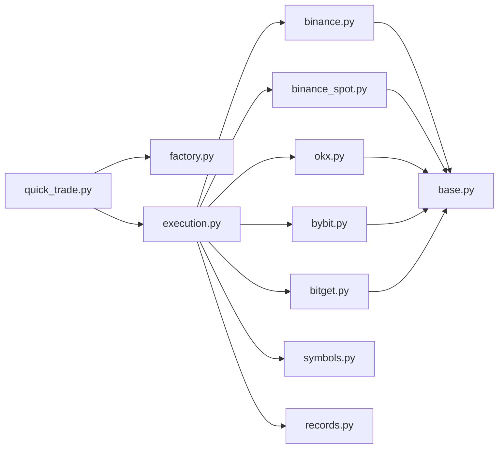

# 执行器插件开发

<cite>
**本文档引用的文件**
- [backend_api_python/app/services/live_trading/base.py](file://backend_api_python/app/services/live_trading/base.py)
- [backend_api_python/app/services/live_trading/factory.py](file://backend_api_python/app/services/live_trading/factory.py)
- [backend_api_python/app/services/live_trading/execution.py](file://backend_api_python/app/services/live_trading/execution.py)
- [backend_api_python/app/services/live_trading/binance.py](file://backend_api_python/app/services/live_trading/binance.py)
- [backend_api_python/app/services/live_trading/binance_spot.py](file://backend_api_python/app/services/live_trading/binance_spot.py)
- [backend_api_python/app/services/live_trading/okx.py](file://backend_api_python/app/services/live_trading/okx.py)
- [backend_api_python/app/services/live_trading/bybit.py](file://backend_api_python/app/services/live_trading/bybit.py)
- [backend_api_python/app/services/live_trading/bitget.py](file://backend_api_python/app/services/live_trading/bitget.py)
- [backend_api_python/app/services/live_trading/symbols.py](file://backend_api_python/app/services/live_trading/symbols.py)
- [backend_api_python/app/services/live_trading/records.py](file://backend_api_python/app/services/live_trading/records.py)
- [backend_api_python/app/routes/quick_trade.py](file://backend_api_python/app/routes/quick_trade.py)
</cite>

## 目录
1. [简介](#简介)
2. [项目结构](#项目结构)
3. [核心组件](#核心组件)
4. [架构总览](#架构总览)
5. [详细组件分析](#详细组件分析)
6. [依赖分析](#依赖分析)
7. [性能考虑](#性能考虑)
8. [故障排查指南](#故障排查指南)
9. [结论](#结论)
10. [附录](#附录)

## 简介
本指南面向希望在系统中开发“执行器插件”的开发者，目标是帮助你基于现有框架快速实现一个可被交易执行引擎使用的“执行器”。我们将详细说明如何继承基础类、实现必要的交易方法（如下单、撤单、查询余额等）、通过工厂模式进行注册与实例化、以及与交易执行引擎的集成流程。同时，文档提供安全、错误处理与风控的最佳实践，并给出从接口实现到注册配置的完整示例路径。

## 项目结构
执行器插件位于“实时交易”子系统中，核心模块包括：
- 基础抽象层：定义通用的交易客户端接口与结果封装
- 具体交易所实现：各交易所的REST客户端
- 工厂与执行器：负责根据配置创建具体客户端并把策略信号转化为下单调用
- 路由与记录：对外提供下单/查询余额等HTTP接口，并记录本地成交与头寸快照

图表来源
- [backend_api_python/app/services/live_trading/base.py:82-157](file://backend_api_python/app/services/live_trading/base.py#L82-L157)
- [backend_api_python/app/services/live_trading/factory.py:59-218](file://backend_api_python/app/services/live_trading/factory.py#L59-L218)
- [backend_api_python/app/services/live_trading/execution.py:123-310](file://backend_api_python/app/services/live_trading/execution.py#L123-L310)
- [backend_api_python/app/services/live_trading/binance.py:24-80](file://backend_api_python/app/services/live_trading/binance.py#L24-L80)
- [backend_api_python/app/services/live_trading/binance_spot.py:21-31](file://backend_api_python/app/services/live_trading/binance_spot.py#L21-L31)
- [backend_api_python/app/services/live_trading/okx.py:25-47](file://backend_api_python/app/services/live_trading/okx.py#L25-L47)
- [backend_api_python/app/services/live_trading/bybit.py:27-60](file://backend_api_python/app/services/live_trading/bybit.py#L27-L60)
- [backend_api_python/app/services/live_trading/bitget.py:26-56](file://backend_api_python/app/services/live_trading/bitget.py#L26-L56)
- [backend_api_python/app/routes/quick_trade.py:500-576](file://backend_api_python/app/routes/quick_trade.py#L500-L576)

章节来源
- [backend_api_python/app/services/live_trading/base.py:1-158](file://backend_api_python/app/services/live_trading/base.py#L1-L158)
- [backend_api_python/app/services/live_trading/factory.py:1-355](file://backend_api_python/app/services/live_trading/factory.py#L1-L355)
- [backend_api_python/app/services/live_trading/execution.py:1-426](file://backend_api_python/app/services/live_trading/execution.py#L1-L426)
- [backend_api_python/app/routes/quick_trade.py:500-730](file://backend_api_python/app/routes/quick_trade.py#L500-L730)

## 核心组件
- 基础抽象层
  - 定义通用的REST客户端基类与下单结果封装，提供统一的请求方法、时间同步、签名与错误处理能力
  - 关键类与数据结构：BaseRestClient、LiveOrderResult、LiveTradingError
- 交易所客户端
  - 每个交易所实现一个具体的客户端类，覆盖下单、撤单、查询账户/成交、手续费计算、等待成交等方法
  - 示例：BinanceFuturesClient、BinanceSpotClient、OkxClient、BybitClient、BitgetMixClient
- 工厂与执行器
  - 工厂根据配置动态创建对应交易所客户端
  - 执行器把策略信号映射为具体交易所的下单参数并发起下单
- 符号与记录
  - 提供符号标准化工具，保证不同输入格式统一转换
  - 提供本地成交与头寸记录，便于UI展示与策略状态维护

章节来源
- [backend_api_python/app/services/live_trading/base.py:82-157](file://backend_api_python/app/services/live_trading/base.py#L82-L157)
- [backend_api_python/app/services/live_trading/binance.py:24-80](file://backend_api_python/app/services/live_trading/binance.py#L24-L80)
- [backend_api_python/app/services/live_trading/binance_spot.py:21-31](file://backend_api_python/app/services/live_trading/binance_spot.py#L21-L31)
- [backend_api_python/app/services/live_trading/okx.py:25-47](file://backend_api_python/app/services/live_trading/okx.py#L25-L47)
- [backend_api_python/app/services/live_trading/bybit.py:27-60](file://backend_api_python/app/services/live_trading/bybit.py#L27-L60)
- [backend_api_python/app/services/live_trading/bitget.py:26-56](file://backend_api_python/app/services/live_trading/bitget.py#L26-L56)
- [backend_api_python/app/services/live_trading/factory.py:59-218](file://backend_api_python/app/services/live_trading/factory.py#L59-L218)
- [backend_api_python/app/services/live_trading/execution.py:123-310](file://backend_api_python/app/services/live_trading/execution.py#L123-L310)
- [backend_api_python/app/services/live_trading/symbols.py:16-235](file://backend_api_python/app/services/live_trading/symbols.py#L16-L235)
- [backend_api_python/app/services/live_trading/records.py:85-280](file://backend_api_python/app/services/live_trading/records.py#L85-L280)

## 架构总览
执行器插件的运行时交互如下：

图表来源
- [backend_api_python/app/routes/quick_trade.py:500-576](file://backend_api_python/app/routes/quick_trade.py#L500-L576)
- [backend_api_python/app/services/live_trading/factory.py:59-218](file://backend_api_python/app/services/live_trading/factory.py#L59-L218)
- [backend_api_python/app/services/live_trading/execution.py:123-310](file://backend_api_python/app/services/live_trading/execution.py#L123-L310)
- [backend_api_python/app/services/live_trading/records.py:85-280](file://backend_api_python/app/services/live_trading/records.py#L85-L280)

## 详细组件分析

### 基础抽象层：BaseRestClient 与 LiveOrderResult
- BaseRestClient
  - 统一的HTTP请求封装，支持超时、SSL校验、签名与重试逻辑
  - 提供时间同步、请求签名、错误解析等能力
- LiveOrderResult
  - 统一的下单结果封装，包含交易所订单ID、已成交数量、平均成交价与原始响应
- LiveTradingError
  - 交易异常的统一类型

章节来源
- [backend_api_python/app/services/live_trading/base.py:82-157](file://backend_api_python/app/services/live_trading/base.py#L82-L157)

### 工厂模式：create_client(...)
- 功能
  - 根据exchange_config与market_type选择并创建对应的交易所客户端
  - 支持多交易所（Binance、OKX、Bitget、Bybit、Coinbase、Kraken、KuCoin、Gate、Deepcoin、HTX）与传统券商/外汇平台
- 注册机制
  - 在工厂中显式导入并映射各交易所客户端类，新增执行器只需在此处注册映射即可被系统发现
- 配置要点
  - exchange_id、api_key、secret_key、passphrase、base_url、recv_window_ms、broker_referer、hedge_mode 等

章节来源
- [backend_api_python/app/services/live_trading/factory.py:59-218](file://backend_api_python/app/services/live_trading/factory.py#L59-L218)

### 执行器：place_order_from_signal(...)
- 功能
  - 把策略信号（如开多、平多等）映射为具体交易所的下单参数并调用对应客户端下单
  - 支持多市场类型（现货/永续），并针对不同交易所做参数适配
- 参数与行为
  - 输入：signal_type、symbol、amount、market_type、exchange_config、client_order_id
  - 输出：LiveOrderResult
- 适配细节
  - 不同交易所的下单字段差异（如Binance使用quantity，OKX使用size与pos_side，Bybit使用qty等）
  - 现货不支持做空信号的限制
  - 符号规范化（统一为交易所期望格式）

章节来源
- [backend_api_python/app/services/live_trading/execution.py:123-310](file://backend_api_python/app/services/live_trading/execution.py#L123-L310)
- [backend_api_python/app/services/live_trading/symbols.py:16-235](file://backend_api_python/app/services/live_trading/symbols.py#L16-L235)

### 交易所客户端示例：BinanceFuturesClient
- 必要实现的方法（示例）
  - 下单：place_market_order(...)
  - 撤单：cancel_order(...)
  - 查询：get_account()、get_user_trades()、get_order()
  - 等待成交：wait_for_fill(...)
  - 计算手续费：get_fee_for_order(...)
  - 获取费率：get_fee_rate(...)
- 关键特性
  - 严格的精度与步进控制，避免因精度不符导致下单失败
  - 时间同步与签名，规避时钟偏差导致的错误
  - 最小成交额（MIN_NOTIONAL）校验与回退策略

章节来源
- [backend_api_python/app/services/live_trading/binance.py:735-800](file://backend_api_python/app/services/live_trading/binance.py#L735-L800)
- [backend_api_python/app/services/live_trading/binance.py:590-684](file://backend_api_python/app/services/live_trading/binance.py#L590-L684)
- [backend_api_python/app/services/live_trading/binance.py:462-506](file://backend_api_python/app/services/live_trading/binance.py#L462-L506)

### 交易所客户端示例：BinanceSpotClient
- 必要实现的方法（示例）
  - 下单：place_market_order(...)
  - 撤单：cancel_order(...)
  - 查询：get_account()、get_my_trades()、get_order()
  - 等待成交：wait_for_fill(...)
  - 计算手续费：get_fee_for_order(...)
  - 获取费率：get_fee_rate(...)
- 关键特性
  - 精度与步进控制
  - -2015等典型错误的提示增强

章节来源
- [backend_api_python/app/services/live_trading/binance_spot.py:483-522](file://backend_api_python/app/services/live_trading/binance_spot.py#L483-L522)
- [backend_api_python/app/services/live_trading/binance_spot.py:600-620](file://backend_api_python/app/services/live_trading/binance_spot.py#L600-L620)
- [backend_api_python/app/services/live_trading/binance_spot.py:622-714](file://backend_api_python/app/services/live_trading/binance_spot.py#L622-L714)

### 交易所客户端示例：OkxClient
- 必要实现的方法（示例）
  - 下单：place_market_order(...)
  - 撤单：cancel_order(...)
  - 查询：get_account()、get_orders()、get_fills()
  - 等待成交：wait_for_fill(...)
  - 计算手续费：get_fee_for_order(...)
  - 获取费率：get_fee_rate(...)
- 关键特性
  - 仪器信息缓存、账户配置缓存、杠杆缓存
  - 严格的价格/数量精度控制

章节来源
- [backend_api_python/app/services/live_trading/okx.py:25-47](file://backend_api_python/app/services/live_trading/okx.py#L25-L47)

### 交易所客户端示例：BybitClient
- 必要实现的方法（示例）
  - 下单：place_market_order(...)
  - 撤单：cancel_order(...)
  - 查询：get_account()、get_orders()
  - 等待成交：wait_for_fill(...)
  - 计算手续费：get_fee_for_order(...)
  - 获取费率：get_fee_rate(...)
- 关键特性
  - v5签名算法、服务器时间同步
  - 仪器元数据缓存与精度控制

章节来源
- [backend_api_python/app/services/live_trading/bybit.py:27-60](file://backend_api_python/app/services/live_trading/bybit.py#L27-L60)

### 交易所客户端示例：BitgetMixClient
- 必要实现的方法（示例）
  - 下单：place_market_order(...)
  - 撤单：cancel_order(...)
  - 查询：get_account()、get_orders()
  - 等待成交：wait_for_fill(...)
  - 计算手续费：get_fee_for_order(...)
  - 获取费率：get_fee_rate(...)
- 关键特性
  - 合约元数据缓存、仓位模式缓存、杠杆缓存
  - 复杂的手续费明细解析

章节来源
- [backend_api_python/app/services/live_trading/bitget.py:26-56](file://backend_api_python/app/services/live_trading/bitget.py#L26-L56)

### 本地记录与头寸管理：records.py
- 功能
  - 录入成交记录、更新/插入头寸快照
  - 对符号进行规范化，支持模糊匹配定位已有头寸
- 价值
  - 作为UI展示与策略状态的本地参考（以交易所为准）

章节来源
- [backend_api_python/app/services/live_trading/records.py:85-280](file://backend_api_python/app/services/live_trading/records.py#L85-L280)

### 路由集成：quick_trade.py
- 功能
  - 提供下单与查询余额的HTTP接口
  - 自动检测客户端是否实现get_balance/get_account等方法并进行兼容解析
- 集成点
  - 使用工厂创建客户端
  - 使用执行器把信号转换为下单调用
  - 记录本地成交与头寸

章节来源
- [backend_api_python/app/routes/quick_trade.py:500-576](file://backend_api_python/app/routes/quick_trade.py#L500-L576)
- [backend_api_python/app/routes/quick_trade.py:668-730](file://backend_api_python/app/routes/quick_trade.py#L668-L730)

## 依赖分析
- 组件耦合
  - 路由依赖工厂与执行器；执行器依赖各交易所客户端；客户端依赖基础抽象层
  - 工厂集中注册所有可用的交易所客户端，新增执行器只需扩展工厂映射
- 外部依赖
  - 交易所REST API、网络请求库、数据库（用于本地记录）
- 循环依赖
  - 通过延迟导入与字符串类型检查避免循环依赖

图表来源
- [backend_api_python/app/routes/quick_trade.py:500-576](file://backend_api_python/app/routes/quick_trade.py#L500-L576)
- [backend_api_python/app/services/live_trading/factory.py:59-218](file://backend_api_python/app/services/live_trading/factory.py#L59-L218)
- [backend_api_python/app/services/live_trading/execution.py:123-310](file://backend_api_python/app/services/live_trading/execution.py#L123-L310)
- [backend_api_python/app/services/live_trading/binance.py:24-80](file://backend_api_python/app/services/live_trading/binance.py#L24-L80)
- [backend_api_python/app/services/live_trading/binance_spot.py:21-31](file://backend_api_python/app/services/live_trading/binance_spot.py#L21-L31)
- [backend_api_python/app/services/live_trading/okx.py:25-47](file://backend_api_python/app/services/live_trading/okx.py#L25-L47)
- [backend_api_python/app/services/live_trading/bybit.py:27-60](file://backend_api_python/app/services/live_trading/bybit.py#L27-L60)
- [backend_api_python/app/services/live_trading/bitget.py:26-56](file://backend_api_python/app/services/live_trading/bitget.py#L26-L56)
- [backend_api_python/app/services/live_trading/base.py:82-157](file://backend_api_python/app/services/live_trading/base.py#L82-L157)

## 性能考虑
- 缓存策略
  - 交易所元数据（如过滤器、仪器信息、账户配置、杠杆设置）采用带TTL的缓存，减少重复请求
- 请求批量化
  - 在可行场景下合并请求或复用连接，降低网络开销
- 精度与步进控制
  - 严格遵循交易所的精度与步进要求，避免多次失败重试
- 超时与重试
  - 合理设置超时与重试次数，避免阻塞主线程

## 故障排查指南
- 常见错误与定位
  - 签名/时间戳问题：检查服务器时间同步与签名参数
  - 精度/步进问题：核对数量/价格精度与步进，必要时启用严格精度
  - 最小成交额：当出现“notional below min”时，调整下单量或价格
  - 权限/白名单：确认API权限与IP白名单配置
- 日志与调试
  - 利用统一的错误类型与日志输出，结合原始响应定位问题
- 回退策略
  - 当交易所接口不可用时，优先使用备用字段或降级方案

章节来源
- [backend_api_python/app/services/live_trading/binance.py:735-800](file://backend_api_python/app/services/live_trading/binance.py#L735-L800)
- [backend_api_python/app/services/live_trading/binance_spot.py:483-522](file://backend_api_python/app/services/live_trading/binance_spot.py#L483-L522)
- [backend_api_python/app/services/live_trading/okx.py:171-200](file://backend_api_python/app/services/live_trading/okx.py#L171-L200)
- [backend_api_python/app/services/live_trading/bybit.py:172-200](file://backend_api_python/app/services/live_trading/bybit.py#L172-L200)
- [backend_api_python/app/services/live_trading/bitget.py:117-190](file://backend_api_python/app/services/live_trading/bitget.py#L117-L190)

## 结论
通过工厂模式与统一的抽象层，系统实现了对多交易所执行器的无缝接入。开发者只需在工厂中注册新执行器，并在执行器中实现必要的交易方法，即可被路由与执行器统一调度。配合符号标准化、本地记录与完善的错误处理，可以构建稳定、可维护的交易执行体系。

## 附录

### 开发步骤清单
- 实现步骤
  - 新建客户端类，继承BaseRestClient
  - 实现下单、撤单、查询账户/成交、等待成交、手续费计算、费率查询等方法
  - 在工厂中注册该客户端（导入并在工厂映射中添加映射）
  - 在路由中验证是否可通过工厂创建并调用
  - 使用执行器进行信号到下单的转换测试
  - 集成本地记录，验证成交与头寸更新
- 安全与风控最佳实践
  - 严格管理API密钥，避免日志泄露
  - 启用SSL校验或仅在受控环境下关闭
  - 控制下单精度与步进，避免无效请求
  - 设置合理的超时与重试上限
  - 对最小成交额与保证金进行前置校验
  - 通过缓存降低请求频率，避免触发风控

章节来源
- [backend_api_python/app/services/live_trading/factory.py:59-218](file://backend_api_python/app/services/live_trading/factory.py#L59-L218)
- [backend_api_python/app/services/live_trading/execution.py:123-310](file://backend_api_python/app/services/live_trading/execution.py#L123-L310)
- [backend_api_python/app/routes/quick_trade.py:500-576](file://backend_api_python/app/routes/quick_trade.py#L500-L576)
- [backend_api_python/app/services/live_trading/records.py:85-280](file://backend_api_python/app/services/live_trading/records.py#L85-L280)