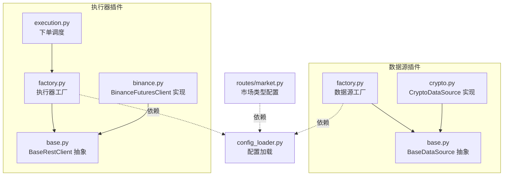
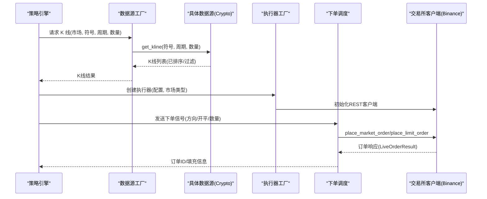
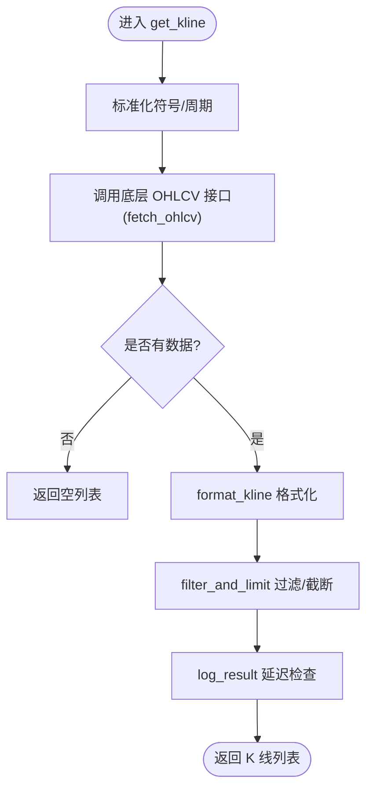
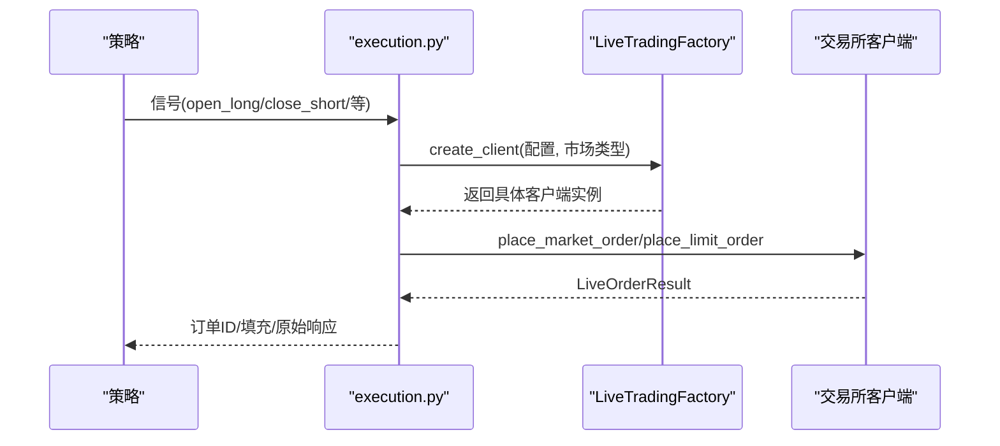
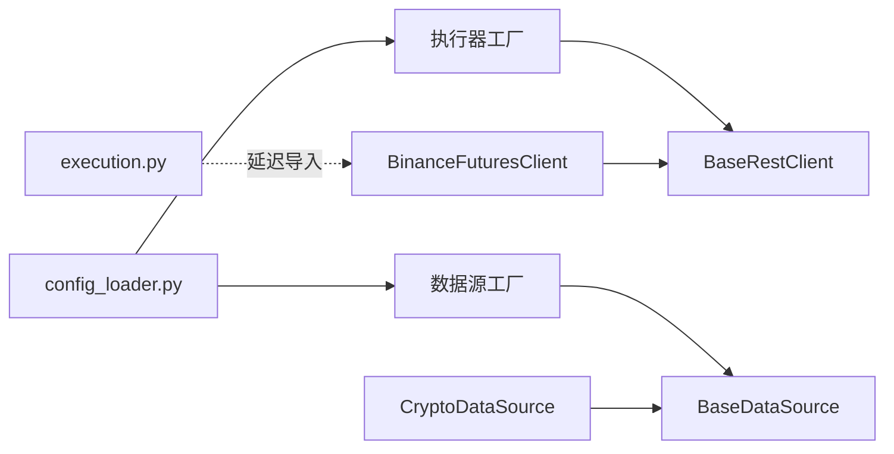

# 插件开发

<cite>
**本文引用的文件**
- [backend_api_python/app/data_sources/base.py](file://backend_api_python/app/data_sources/base.py)
- [backend_api_python/app/data_sources/factory.py](file://backend_api_python/app/data_sources/factory.py)
- [backend_api_python/app/data_sources/crypto.py](file://backend_api_python/app/data_sources/crypto.py)
- [backend_api_python/app/data_sources/__init__.py](file://backend_api_python/app/data_sources/__init__.py)
- [backend_api_python/app/services/live_trading/base.py](file://backend_api_python/app/services/live_trading/base.py)
- [backend_api_python/app/services/live_trading/factory.py](file://backend_api_python/app/services/live_trading/factory.py)
- [backend_api_python/app/services/live_trading/execution.py](file://backend_api_python/app/services/live_trading/execution.py)
- [backend_api_python/app/services/live_trading/binance.py](file://backend_api_python/app/services/live_trading/binance.py)
- [backend_api_python/app/utils/config_loader.py](file://backend_api_python/app/utils/config_loader.py)
- [backend_api_python/app/routes/market.py](file://backend_api_python/app/routes/market.py)
</cite>

## 目录
1. [引言](#引言)
2. [项目结构](#项目结构)
3. [核心组件](#核心组件)
4. [架构总览](#架构总览)
5. [详细组件分析](#详细组件分析)
6. [依赖分析](#依赖分析)
7. [性能考虑](#性能考虑)
8. [故障排查指南](#故障排查指南)
9. [结论](#结论)
10. [附录](#附录)

## 引言
本指南面向希望在 QuantDinger 后端生态中开发“插件”的工程师，重点覆盖两类插件：
- 数据源插件：实现统一的 K 线与实时报价接口，便于策略回测与实盘执行。
- 执行器插件：基于统一的直接交易所 REST 客户端抽象，对接多家交易所与传统经纪商。

文档将系统讲解接口契约、工厂模式、注册与配置、测试与部署最佳实践，以及插件间依赖与集成注意事项，帮助你从零完成一个可复用、可维护的插件。

## 项目结构
QuantDinger 后端以“数据源”和“实盘执行”两大插件域为核心，分别位于以下路径：
- 数据源插件：backend_api_python/app/data_sources
- 实盘执行插件：backend_api_python/app/services/live_trading

**图表来源**
- [backend_api_python/app/data_sources/factory.py:1-169](file://backend_api_python/app/data_sources/factory.py#L1-L169)
- [backend_api_python/app/data_sources/base.py:1-179](file://backend_api_python/app/data_sources/base.py#L1-L179)
- [backend_api_python/app/data_sources/crypto.py:1-428](file://backend_api_python/app/data_sources/crypto.py#L1-L428)
- [backend_api_python/app/services/live_trading/factory.py:1-355](file://backend_api_python/app/services/live_trading/factory.py#L1-L355)
- [backend_api_python/app/services/live_trading/execution.py:85-281](file://backend_api_python/app/services/live_trading/execution.py#L85-L281)
- [backend_api_python/app/services/live_trading/base.py:1-158](file://backend_api_python/app/services/live_trading/base.py#L1-L158)
- [backend_api_python/app/services/live_trading/binance.py:1-200](file://backend_api_python/app/services/live_trading/binance.py#L1-L200)
- [backend_api_python/app/utils/config_loader.py:1-251](file://backend_api_python/app/utils/config_loader.py#L1-L251)
- [backend_api_python/app/routes/market.py:127-161](file://backend_api_python/app/routes/market.py#L127-L161)

**章节来源**
- [backend_api_python/app/data_sources/__init__.py:1-45](file://backend_api_python/app/data_sources/__init__.py#L1-L45)
- [backend_api_python/app/services/live_trading/__init__.py:1-8](file://backend_api_python/app/services/live_trading/__init__.py#L1-L8)

## 核心组件
- 数据源抽象与工厂
  - BaseDataSource：定义 get_kline 与可选的 get_ticker 接口，提供 K 线格式化、时间范围计算、过滤截断与延迟日志等通用能力。
  - DataSourceFactory：根据市场类型（Crypto、USStock、Forex、Futures、CNStock、HKStock）选择具体数据源实现；提供便捷的 get_kline/get_ticker 方法。
- 执行器抽象与工厂
  - BaseRestClient：统一 REST 请求封装、证书校验策略、请求超时与 JSON 解析。
  - LiveTradingFactory：根据 exchange_id 与 market_type 创建具体交易所客户端（如 Binance、OKX、Bybit、Kraken、Gate、HTX、KuCoin、Coinbase、Deepcoin 等），并支持 IBKR（美股）与 MT5（外汇）。
  - execution.py：策略信号到下单的调度层，按客户端类型分派下单逻辑。
- 配置与注册
  - config_loader.py：从环境变量构建嵌套配置树，支持数据源、CCXT、限流、搜索等键空间。
  - routes/market.py：提供市场类型配置项，用于前端与后端一致的市场枚举。

**章节来源**
- [backend_api_python/app/data_sources/base.py:27-179](file://backend_api_python/app/data_sources/base.py#L27-L179)
- [backend_api_python/app/data_sources/factory.py:27-169](file://backend_api_python/app/data_sources/factory.py#L27-L169)
- [backend_api_python/app/services/live_trading/base.py:95-158](file://backend_api_python/app/services/live_trading/base.py#L95-L158)
- [backend_api_python/app/services/live_trading/factory.py:59-218](file://backend_api_python/app/services/live_trading/factory.py#L59-L218)
- [backend_api_python/app/services/live_trading/execution.py:85-281](file://backend_api_python/app/services/live_trading/execution.py#L85-L281)
- [backend_api_python/app/utils/config_loader.py:24-161](file://backend_api_python/app/utils/config_loader.py#L24-L161)
- [backend_api_python/app/routes/market.py:127-161](file://backend_api_python/app/routes/market.py#L127-L161)

## 架构总览
下图展示数据源与执行器插件的协作关系及关键交互：

**图表来源**
- [backend_api_python/app/data_sources/factory.py:105-139](file://backend_api_python/app/data_sources/factory.py#L105-L139)
- [backend_api_python/app/data_sources/crypto.py:232-306](file://backend_api_python/app/data_sources/crypto.py#L232-L306)
- [backend_api_python/app/services/live_trading/factory.py:59-218](file://backend_api_python/app/services/live_trading/factory.py#L59-L218)
- [backend_api_python/app/services/live_trading/execution.py:85-281](file://backend_api_python/app/services/live_trading/execution.py#L85-L281)
- [backend_api_python/app/services/live_trading/binance.py:545-673](file://backend_api_python/app/services/live_trading/binance.py#L545-L673)

## 详细组件分析

### 数据源插件开发：实现 get_kline 与 get_ticker
- 设计要点
  - 继承 BaseDataSource，实现 get_kline(symbol, timeframe, limit, before_time?, after_time?) 与可选 get_ticker。
  - 使用 format_kline 对齐字段与精度；利用 filter_and_limit 控制时间窗与数量；通过 log_result 输出延迟告警。
  - 通过 DataSourceFactory.normalize_market 与 get_source 获取实例，避免硬编码市场类型。
- 关键流程图（get_kline）

**图表来源**
- [backend_api_python/app/data_sources/base.py:66-139](file://backend_api_python/app/data_sources/base.py#L66-L139)
- [backend_api_python/app/data_sources/crypto.py:232-306](file://backend_api_python/app/data_sources/crypto.py#L232-L306)

- 示例实现步骤（以 CryptoDataSource 为例）
  1) 符号规范化与交易所映射：参考 _normalize_symbol/_normalize_symbol_for_exchange。
  2) OHLCV 获取：优先 fetch_ohlcv，失败时回退 _fetch_ohlcv_fallback。
  3) 数据清洗与截断：使用 filter_and_limit，注意 after_time 场景下的整段保留。
  4) 结果日志：通过 log_result 输出最新 K 线时间与阈值比较。
  5) 工厂接入：通过 DataSourceFactory.get_kline 直接调用，无需手动实例化。

**章节来源**
- [backend_api_python/app/data_sources/base.py:27-179](file://backend_api_python/app/data_sources/base.py#L27-L179)
- [backend_api_python/app/data_sources/crypto.py:16-428](file://backend_api_python/app/data_sources/crypto.py#L16-L428)
- [backend_api_python/app/data_sources/factory.py:105-139](file://backend_api_python/app/data_sources/factory.py#L105-L139)

### 执行器插件开发：继承 BaseRestClient 并实现交易相关方法
- 设计要点
  - 继承 BaseRestClient，实现签名、鉴权、请求头与错误处理。
  - 支持市场类型（spot/swap/perp/future）与模拟交易开关。
  - 通过 LiveTradingFactory.create_client 根据 exchange_id 与 market_type 创建实例。
- 关键流程图（下单调度）

**图表来源**
- [backend_api_python/app/services/live_trading/execution.py:85-281](file://backend_api_python/app/services/live_trading/execution.py#L85-L281)
- [backend_api_python/app/services/live_trading/factory.py:59-218](file://backend_api_python/app/services/live_trading/factory.py#L59-L218)
- [backend_api_python/app/services/live_trading/binance.py:545-673](file://backend_api_python/app/services/live_trading/binance.py#L545-L673)

- 示例实现步骤（以 BinanceFuturesClient 为例）
  1) 初始化：设置 base_url、api_key、secret_key、broker_id、时间偏移同步。
  2) 签名与请求头：实现 _sign/_signed_headers/_ensure_server_time。
  3) 数量与价格格式化：使用 _to_dec/_dec_str/_floor_to_step 控制精度与步进。
  4) 下单：place_market_order/place_limit_order，区分市价/限价与开仓/平仓。
  5) 工厂接入：通过 create_client(exchange_config, market_type) 创建实例。

**章节来源**
- [backend_api_python/app/services/live_trading/base.py:95-158](file://backend_api_python/app/services/live_trading/base.py#L95-L158)
- [backend_api_python/app/services/live_trading/factory.py:59-218](file://backend_api_python/app/services/live_trading/factory.py#L59-L218)
- [backend_api_python/app/services/live_trading/binance.py:24-200](file://backend_api_python/app/services/live_trading/binance.py#L24-L200)

### 插件注册机制与工厂模式
- 数据源注册
  - DataSourceFactory._create_source 根据 market 枚举动态导入并实例化具体数据源类。
  - 支持别名映射（如 crypto → Crypto），并通过 normalize_market 统一大小写与拼写。
- 执行器注册
  - LiveTradingFactory.create_client 根据 exchange_id（如 binance、okx、bybit、kraken、gate、htx、kucoin、coinbase、deepcoin）创建对应客户端。
  - 支持 IBKR（USStock）与 MT5（Forex）的延迟导入与连接校验。
- 配置加载
  - config_loader.load_addon_config 将环境变量映射为嵌套配置树，供工厂与插件读取（如 CCXT 默认交易所、超时、限流等）。
- 市场类型配置
  - routes/market.py 提供市场类型列表与排序，确保前后端一致。

**章节来源**
- [backend_api_python/app/data_sources/factory.py:36-102](file://backend_api_python/app/data_sources/factory.py#L36-L102)
- [backend_api_python/app/services/live_trading/factory.py:59-218](file://backend_api_python/app/services/live_trading/factory.py#L59-L218)
- [backend_api_python/app/utils/config_loader.py:24-161](file://backend_api_python/app/utils/config_loader.py#L24-L161)
- [backend_api_python/app/routes/market.py:127-161](file://backend_api_python/app/routes/market.py#L127-L161)

### 完整开发示例：从接口实现到注册配置
- 数据源插件示例（新增一个市场类型）
  1) 新建文件 backend_api_python/app/data_sources/my_market.py，继承 BaseDataSource，实现 get_kline 与可选 get_ticker。
  2) 在 backend_api_python/app/data_sources/factory.py 的 _create_source 中添加分支，返回你的实现类。
  3) 在 __init__.py 中导出你的类，以便外部引用。
  4) 通过 DataSourceFactory.get_kline("MyMarket", symbol, timeframe, limit) 调用。
- 执行器插件示例（新增一个交易所）
  1) 新建文件 backend_api_python/app/services/live_trading/myex.py，继承 BaseRestClient，实现下单与公共接口。
  2) 在 backend_api_python/app/services/live_trading/factory.py 的 create_client 中添加分支，根据 exchange_id 返回你的客户端。
  3) 在 execution.py 中补充下单分派逻辑，或在策略侧直接调用你的客户端。
  4) 通过 create_client(exchange_config, market_type) 创建实例并下单。
- 配置与测试
  - 在 .env 或环境变量中设置相关键（如 CCXT_*、DATA_SOURCE_*、LIVE_TRADING_*），通过 config_loader.load_addon_config 加载。
  - 单元测试建议：mock 外部接口，验证 get_kline 返回格式、filter_and_limit 行为、下单参数构造与错误分支。

**章节来源**
- [backend_api_python/app/data_sources/factory.py:81-102](file://backend_api_python/app/data_sources/factory.py#L81-L102)
- [backend_api_python/app/services/live_trading/factory.py:59-218](file://backend_api_python/app/services/live_trading/factory.py#L59-L218)
- [backend_api_python/app/utils/config_loader.py:24-161](file://backend_api_python/app/utils/config_loader.py#L24-L161)

## 依赖分析
- 组件耦合
  - 数据源工厂与具体实现解耦：通过字符串 market 枚举与动态导入实现低耦合扩展。
  - 执行器工厂与具体客户端解耦：通过 exchange_id 与 market_type 参数化创建，避免硬编码。
- 外部依赖
  - 数据源：CCXT（Crypto）、交易所公开 API。
  - 执行器：HTTP REST、签名算法、证书校验（requests + 可选系统 CA bundle）。
- 潜在循环依赖
  - execution.py 对各交易所客户端采用延迟导入，避免循环依赖。
- 配置依赖
  - 通过 config_loader 统一读取环境变量，减少硬编码与全局状态。

**图表来源**
- [backend_api_python/app/data_sources/factory.py:81-102](file://backend_api_python/app/data_sources/factory.py#L81-L102)
- [backend_api_python/app/data_sources/crypto.py:16-428](file://backend_api_python/app/data_sources/crypto.py#L16-L428)
- [backend_api_python/app/services/live_trading/factory.py:59-218](file://backend_api_python/app/services/live_trading/factory.py#L59-L218)
- [backend_api_python/app/services/live_trading/execution.py:237-281](file://backend_api_python/app/services/live_trading/execution.py#L237-L281)
- [backend_api_python/app/utils/config_loader.py:24-161](file://backend_api_python/app/utils/config_loader.py#L24-L161)

**章节来源**
- [backend_api_python/app/services/live_trading/execution.py:237-281](file://backend_api_python/app/services/live_trading/execution.py#L237-L281)

## 性能考虑
- 数据源
  - 分页拉取与去重：在 CryptoDataSource 中对 OHLCV 分页合并并按时间戳去重，避免重复与越界。
  - 缓存与限流：通过 data_sources 包中的缓存与限流工具（DataCache、RateLimiter）降低外部 API 压力。
- 执行器
  - 证书校验与超时：BaseRestClient 统一处理 verify 与 timeout，避免重复配置。
  - 数量/价格格式化：严格遵循交易所过滤器（LOT_SIZE/PRICE_FILTER），减少下单失败与重试。
- 配置优化
  - 通过 config_loader 设置合理的超时与重试次数，平衡吞吐与稳定性。

**章节来源**
- [backend_api_python/app/data_sources/crypto.py:317-391](file://backend_api_python/app/data_sources/crypto.py#L317-L391)
- [backend_api_python/app/data_sources/__init__.py:11-26](file://backend_api_python/app/data_sources/__init__.py#L11-L26)
- [backend_api_python/app/services/live_trading/base.py:34-79](file://backend_api_python/app/services/live_trading/base.py#L34-L79)

## 故障排查指南
- 数据源
  - get_kline 返回为空：检查符号规范化、交易所是否支持该交易对、before_time/after_time 是否合理。
  - 延迟告警：log_result 会输出最新 K 线时间与阈值比较，根据周期调整阈值策略。
- 执行器
  - SSL/TLS 证书问题：查看 _get_requests_verify 的日志提示，设置 LIVE_TRADING_CA_BUNDLE 或启用系统 CA bundle。
  - 下单失败：检查下单参数（side、ordertype、volume/size、price）、账户权限与交易所过滤器。
- 工厂
  - 未知市场类型/交易所：确认 normalize_market 与 create_client 的分支是否覆盖。
- 配置
  - 环境变量未生效：确认 config_loader 的映射键是否正确，或调用 clear_config_cache 后重启服务。

**章节来源**
- [backend_api_python/app/data_sources/base.py:141-179](file://backend_api_python/app/data_sources/base.py#L141-L179)
- [backend_api_python/app/services/live_trading/base.py:34-79](file://backend_api_python/app/services/live_trading/base.py#L34-L79)
- [backend_api_python/app/services/live_trading/factory.py:221-335](file://backend_api_python/app/services/live_trading/factory.py#L221-L335)
- [backend_api_python/app/utils/config_loader.py:243-251](file://backend_api_python/app/utils/config_loader.py#L243-L251)

## 结论
通过统一的抽象与工厂模式，QuantDinger 将数据源与执行器插件开发标准化、模块化。开发者只需关注接口契约与业务细节，即可快速扩展新的市场与交易所支持。配合完善的配置加载、缓存与限流机制，可在保证性能与稳定性的同时，提升研发效率与可维护性。

## 附录
- 快速清单
  - 数据源：实现 get_kline/get_ticker → 在工厂注册 → 通过 DataSourceFactory.get_kline 调用。
  - 执行器：继承 BaseRestClient → 实现下单方法 → 在工厂注册 → 通过 create_client 获取实例。
  - 配置：在 .env 中设置相关键 → 通过 config_loader.load_addon_config 读取。
  - 测试：Mock 外部接口，覆盖正常/异常路径与边界条件。
  - 部署：容器镜像内预装 CA 证书，生产环境避免关闭 SSL 校验。