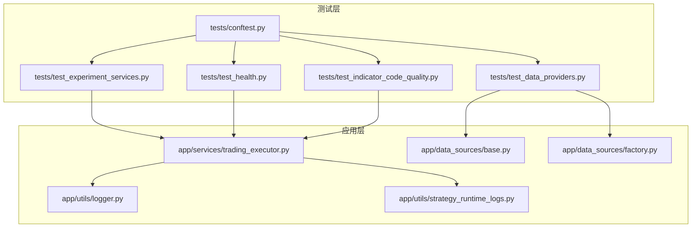
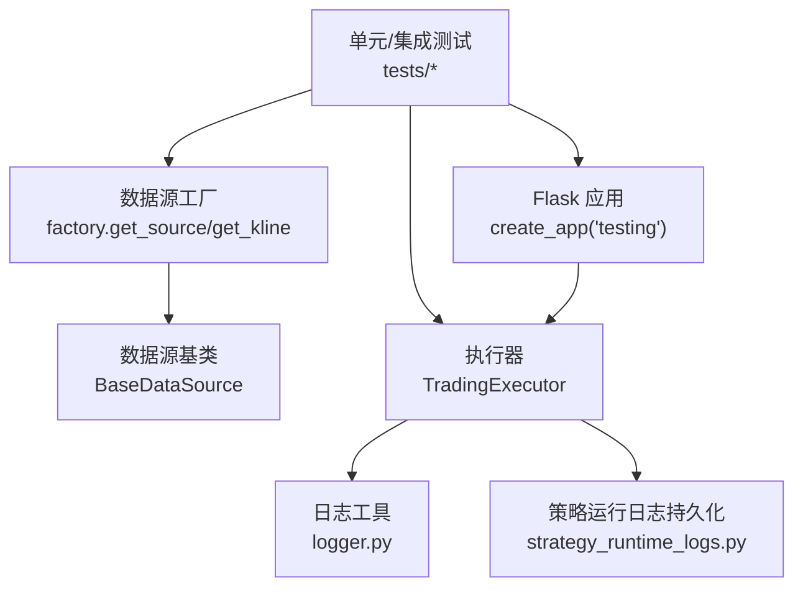
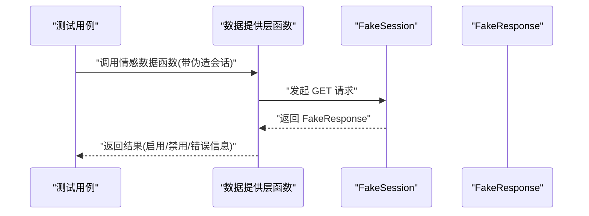
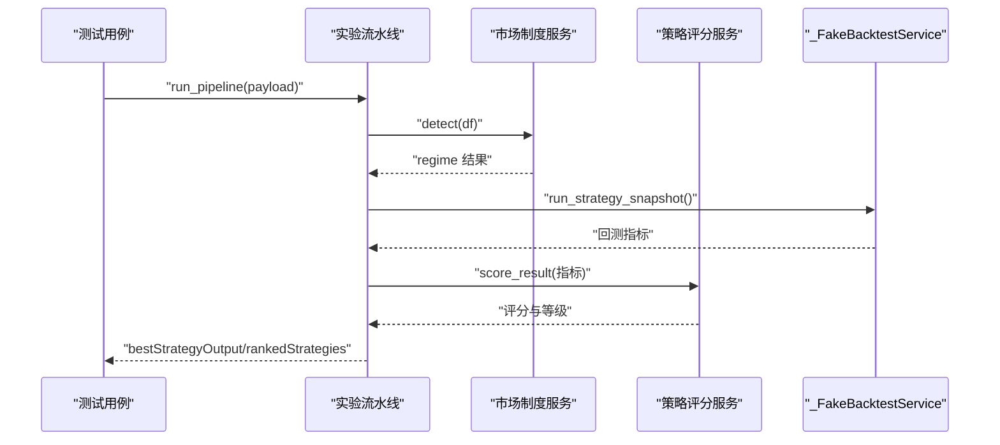
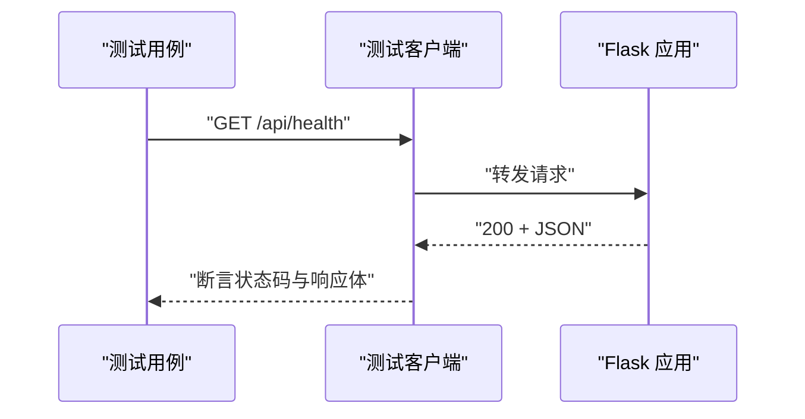
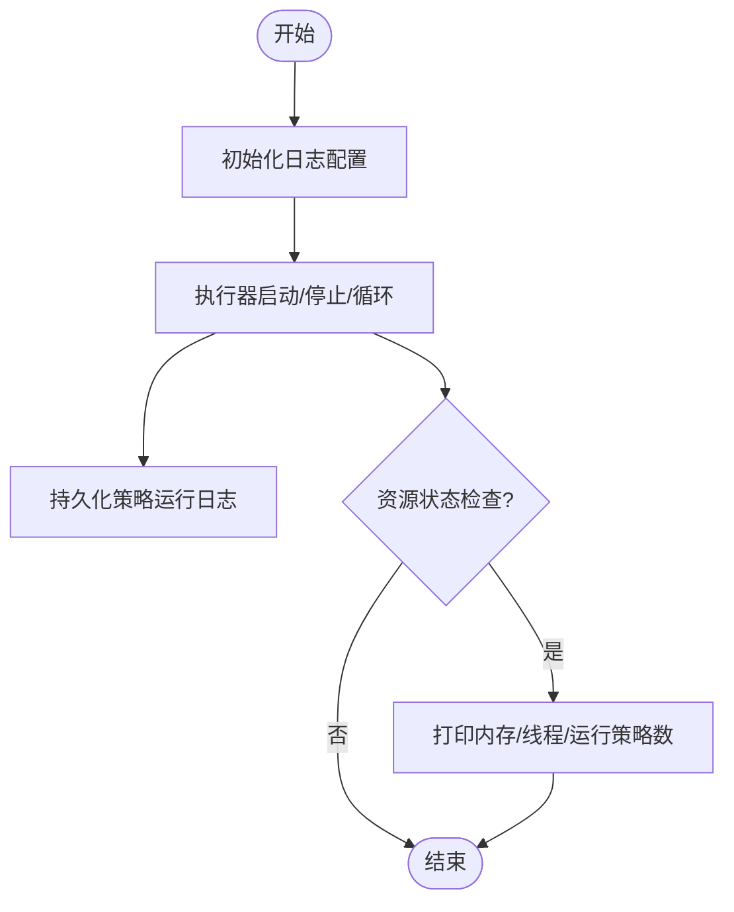
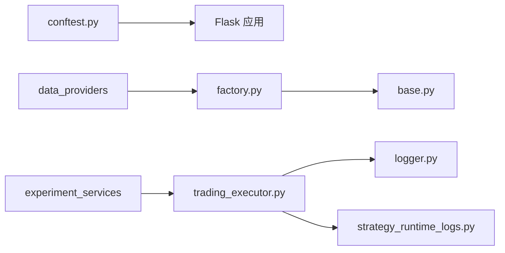

# 插件测试与调试

<cite>
**本文引用的文件**   
- [backend_api_python/tests/conftest.py](file://backend_api_python/tests/conftest.py)
- [backend_api_python/tests/test_data_providers.py](file://backend_api_python/tests/test_data_providers.py)
- [backend_api_python/tests/test_experiment_services.py](file://backend_api_python/tests/test_experiment_services.py)
- [backend_api_python/tests/test_health.py](file://backend_api_python/tests/test_health.py)
- [backend_api_python/tests/test_indicator_code_quality.py](file://backend_api_python/tests/test_indicator_code_quality.py)
- [backend_api_python/app/utils/logger.py](file://backend_api_python/app/utils/logger.py)
- [backend_api_python/app/utils/strategy_runtime_logs.py](file://backend_api_python/app/utils/strategy_runtime_logs.py)
- [backend_api_python/app/services/trading_executor.py](file://backend_api_python/app/services/trading_executor.py)
- [backend_api_python/app/data_sources/base.py](file://backend_api_python/app/data_sources/base.py)
- [backend_api_python/app/data_sources/factory.py](file://backend_api_python/app/data_sources/factory.py)
</cite>

## 目录
1. [引言](#引言)
2. [项目结构](#项目结构)
3. [核心组件](#核心组件)
4. [架构总览](#架构总览)
5. [详细组件分析](#详细组件分析)
6. [依赖分析](#依赖分析)
7. [性能考虑](#性能考虑)
8. [故障排除指南](#故障排除指南)
9. [结论](#结论)
10. [附录](#附录)

## 引言
本指南面向插件开发者与测试工程师，系统阐述如何在本项目中进行插件的单元测试与集成测试，如何设计测试用例，如何通过日志、错误追踪与性能分析进行调试，并给出常见问题的诊断与解决方法。内容涵盖测试环境搭建、测试数据准备、模拟数据源与执行器的测试策略，以及实验服务与健康检查等关键路径的测试要点。

## 项目结构
后端采用 Python Flask 应用，测试位于 backend_api_python/tests，核心业务逻辑分布在 app/services、app/data_sources、app/data_providers 等子包。测试通过 pytest 执行，共享夹具位于 tests/conftest.py，提供最小化的应用与客户端。

**图表来源**
- [backend_api_python/tests/conftest.py:1-31](file://backend_api_python/tests/conftest.py#L1-L31)
- [backend_api_python/tests/test_health.py:1-10](file://backend_api_python/tests/test_health.py#L1-L10)
- [backend_api_python/tests/test_data_providers.py:1-193](file://backend_api_python/tests/test_data_providers.py#L1-L193)
- [backend_api_python/tests/test_experiment_services.py:1-132](file://backend_api_python/tests/test_experiment_services.py#L1-L132)
- [backend_api_python/tests/test_indicator_code_quality.py:1-135](file://backend_api_python/tests/test_indicator_code_quality.py#L1-L135)
- [backend_api_python/app/utils/logger.py:1-63](file://backend_api_python/app/utils/logger.py#L1-L63)
- [backend_api_python/app/utils/strategy_runtime_logs.py:1-30](file://backend_api_python/app/utils/strategy_runtime_logs.py#L1-L30)
- [backend_api_python/app/services/trading_executor.py:1-800](file://backend_api_python/app/services/trading_executor.py#L1-L800)
- [backend_api_python/app/data_sources/base.py:1-179](file://backend_api_python/app/data_sources/base.py#L1-L179)
- [backend_api_python/app/data_sources/factory.py:1-169](file://backend_api_python/app/data_sources/factory.py#L1-L169)

**章节来源**
- [backend_api_python/tests/conftest.py:1-31](file://backend_api_python/tests/conftest.py#L1-L31)
- [backend_api_python/tests/test_health.py:1-10](file://backend_api_python/tests/test_health.py#L1-L10)
- [backend_api_python/tests/test_data_providers.py:1-193](file://backend_api_python/tests/test_data_providers.py#L1-L193)
- [backend_api_python/tests/test_experiment_services.py:1-132](file://backend_api_python/tests/test_experiment_services.py#L1-L132)
- [backend_api_python/tests/test_indicator_code_quality.py:1-135](file://backend_api_python/tests/test_indicator_code_quality.py#L1-L135)
- [backend_api_python/app/utils/logger.py:1-63](file://backend_api_python/app/utils/logger.py#L1-L63)
- [backend_api_python/app/utils/strategy_runtime_logs.py:1-30](file://backend_api_python/app/utils/strategy_runtime_logs.py#L1-L30)
- [backend_api_python/app/services/trading_executor.py:1-800](file://backend_api_python/app/services/trading_executor.py#L1-L800)
- [backend_api_python/app/data_sources/base.py:1-179](file://backend_api_python/app/data_sources/base.py#L1-L179)
- [backend_api_python/app/data_sources/factory.py:1-169](file://backend_api_python/app/data_sources/factory.py#L1-L169)

## 核心组件
- 测试夹具与客户端
  - tests/conftest.py 提供 app 与 test_client 夹具，确保测试前注入可导入路径与最小化环境变量，便于快速启动测试。
- 数据提供层与数据源层
  - app/data_sources/base.py 定义统一数据源接口与通用工具（如 K 线过滤、时间范围计算、延迟检测日志）。
  - app/data_sources/factory.py 提供市场到具体数据源的映射与便捷方法，屏蔽调用方对具体交易所/市场的细节。
- 执行器与日志
  - app/services/trading_executor.py 是实时交易执行的核心，负责策略线程管理、信号去重、脚本上下文构建、订单转换与持久化等。
  - app/utils/logger.py 提供全局日志配置与文件落盘，降低噪声并保留关键模块日志。
  - app/utils/strategy_runtime_logs.py 提供策略运行日志持久化，便于 UI 展示与排障。
- 测试用例覆盖
  - tests/test_health.py 验证健康检查端点。
  - tests/test_data_providers.py 覆盖数据提供层的缓存、经济日历、第三方情感数据等。
  - tests/test_experiment_services.py 覆盖实验服务（回归检测、评分、参数空间变体生成、实验流水线）。
  - tests/test_indicator_code_quality.py 覆盖策略代码质量分析规则。

**章节来源**
- [backend_api_python/tests/conftest.py:19-31](file://backend_api_python/tests/conftest.py#L19-L31)
- [backend_api_python/app/data_sources/base.py:27-179](file://backend_api_python/app/data_sources/base.py#L27-L179)
- [backend_api_python/app/data_sources/factory.py:27-169](file://backend_api_python/app/data_sources/factory.py#L27-L169)
- [backend_api_python/app/services/trading_executor.py:37-800](file://backend_api_python/app/services/trading_executor.py#L37-L800)
- [backend_api_python/app/utils/logger.py:9-63](file://backend_api_python/app/utils/logger.py#L9-L63)
- [backend_api_python/app/utils/strategy_runtime_logs.py:11-30](file://backend_api_python/app/utils/strategy_runtime_logs.py#L11-L30)
- [backend_api_python/tests/test_health.py:4-10](file://backend_api_python/tests/test_health.py#L4-L10)
- [backend_api_python/tests/test_data_providers.py:1-193](file://backend_api_python/tests/test_data_providers.py#L1-L193)
- [backend_api_python/tests/test_experiment_services.py:1-132](file://backend_api_python/tests/test_experiment_services.py#L1-L132)
- [backend_api_python/tests/test_indicator_code_quality.py:1-135](file://backend_api_python/tests/test_indicator_code_quality.py#L1-L135)

## 架构总览
下图展示测试与被测组件之间的交互关系，突出数据源工厂、数据源基类、执行器与日志模块的协作。

**图表来源**
- [backend_api_python/tests/conftest.py:19-31](file://backend_api_python/tests/conftest.py#L19-L31)
- [backend_api_python/app/data_sources/factory.py:47-169](file://backend_api_python/app/data_sources/factory.py#L47-L169)
- [backend_api_python/app/data_sources/base.py:27-179](file://backend_api_python/app/data_sources/base.py#L27-L179)
- [backend_api_python/app/services/trading_executor.py:37-800](file://backend_api_python/app/services/trading_executor.py#L37-L800)
- [backend_api_python/app/utils/logger.py:9-63](file://backend_api_python/app/utils/logger.py#L9-L63)
- [backend_api_python/app/utils/strategy_runtime_logs.py:11-30](file://backend_api_python/app/utils/strategy_runtime_logs.py#L11-L30)

## 详细组件分析

### 组件一：数据提供层与数据源层测试策略
- 目标
  - 验证缓存读写一致性、经济日历非空、第三方情感数据接口的错误降级与参数规范化。
  - 验证数据源工厂对市场类型的归一化与别名映射，以及便捷方法的健壮性。
- 关键测试点
  - 缓存：set_cached/get_cached/清除后为空。
  - 经济日历：返回列表且包含必要字段。
  - 情感数据：无密钥时禁用、HTTP 错误时“失败开”降级、输入异常值时安全处理、来源校验。
  - 数据源工厂：市场别名与标准化、get_kline 排序、get_ticker 未实现时的降级。
- 测试数据准备
  - 使用 monkeypatch 注入环境变量与伪造会话对象，构造稳定的 HTTP 响应。
  - 使用固定种子或预置 JSON 文件模拟第三方接口响应。
- 模拟策略
  - 使用 FakeSession/FakeResponse 模拟网络请求，控制返回码与负载。
  - 使用固定时间戳与 K 线模板，保证断言稳定。

**图表来源**
- [backend_api_python/tests/test_data_providers.py:45-132](file://backend_api_python/tests/test_data_providers.py#L45-L132)

**章节来源**
- [backend_api_python/tests/test_data_providers.py:1-193](file://backend_api_python/tests/test_data_providers.py#L1-L193)
- [backend_api_python/app/data_sources/factory.py:47-169](file://backend_api_python/app/data_sources/factory.py#L47-L169)
- [backend_api_python/app/data_sources/base.py:27-179](file://backend_api_python/app/data_sources/base.py#L27-L179)

### 组件二：实验服务与流水线测试
- 目标
  - 验证市场制度检测、策略评分、参数空间变体生成与实验流水线的端到端输出。
- 关键测试点
  - 市场制度：上升趋势识别与策略家族匹配。
  - 策略评分：综合指标可排名、等级分布合理。
  - 参数空间：网格法生成变体数量与字段覆盖。
  - 实验流水线：最佳策略输出、排名首项、制度标签。
- 测试数据准备
  - 使用 pandas DataFrame 构造连续上涨/震荡/下跌序列，确保统计指标稳定。
  - 使用 _FakeBacktestService 返回确定性收益曲线，便于断言。
- 模拟策略
  - 通过注入假的回测服务，控制收益与回撤，验证评分与选择逻辑。

**图表来源**
- [backend_api_python/tests/test_experiment_services.py:13-132](file://backend_api_python/tests/test_experiment_services.py#L13-L132)

**章节来源**
- [backend_api_python/tests/test_experiment_services.py:1-132](file://backend_api_python/tests/test_experiment_services.py#L1-L132)

### 组件三：健康检查与基础路径测试
- 目标
  - 验证 /api/health 返回 200 且响应体非空。
- 测试数据准备
  - 直接使用测试客户端访问端点，无需额外数据。

**图表来源**
- [backend_api_python/tests/test_health.py:4-10](file://backend_api_python/tests/test_health.py#L4-L10)
- [backend_api_python/tests/conftest.py:27-31](file://backend_api_python/tests/conftest.py#L27-L31)

**章节来源**
- [backend_api_python/tests/test_health.py:1-10](file://backend_api_python/tests/test_health.py#L1-L10)
- [backend_api_python/tests/conftest.py:27-31](file://backend_api_python/tests/conftest.py#L27-L31)

### 组件四：策略代码质量分析测试
- 目标
  - 验证策略代码质量规则：空代码、缺失输出、缺少止损止盈、未知策略键、参数读取方式等。
- 测试数据准备
  - 使用字符串形式的策略代码片段作为输入，逐条断言提示集合。

**章节来源**
- [backend_api_python/tests/test_indicator_code_quality.py:1-135](file://backend_api_python/tests/test_indicator_code_quality.py#L1-L135)

### 组件五：执行器与日志链路
- 目标
  - 通过日志与运行时日志持久化定位执行器问题，结合资源状态打印辅助排查线程/内存瓶颈。
- 关键点
  - 日志级别过滤：减少噪声，保留关键模块 INFO。
  - 运行时日志：持久化策略执行日志，便于 UI 展示。
  - 资源状态：尝试 psutil 或容器内 VmRSS，打印线程数与运行策略数。

**图表来源**
- [backend_api_python/app/utils/logger.py:9-63](file://backend_api_python/app/utils/logger.py#L9-L63)
- [backend_api_python/app/utils/strategy_runtime_logs.py:11-30](file://backend_api_python/app/utils/strategy_runtime_logs.py#L11-L30)
- [backend_api_python/app/services/trading_executor.py:147-174](file://backend_api_python/app/services/trading_executor.py#L147-L174)

**章节来源**
- [backend_api_python/app/utils/logger.py:1-63](file://backend_api_python/app/utils/logger.py#L1-L63)
- [backend_api_python/app/utils/strategy_runtime_logs.py:1-30](file://backend_api_python/app/utils/strategy_runtime_logs.py#L1-L30)
- [backend_api_python/app/services/trading_executor.py:147-174](file://backend_api_python/app/services/trading_executor.py#L147-L174)

## 依赖分析
- 测试对应用的依赖
  - tests/conftest.py 通过 create_app("testing") 构建最小应用，注入环境变量，提供 test_client。
- 数据流依赖
  - 数据提供层依赖数据源工厂与具体数据源实现，后者继承 BaseDataSource 并实现统一接口。
- 执行器依赖
  - TradingExecutor 依赖日志工具、数据库连接、K 线服务、指标解析器、脚本运行时等。
- 日志与持久化
  - 执行器通过日志工具输出运行信息，通过策略运行日志持久化模块写入数据库表。

**图表来源**
- [backend_api_python/tests/conftest.py:19-31](file://backend_api_python/tests/conftest.py#L19-L31)
- [backend_api_python/app/data_sources/factory.py:47-169](file://backend_api_python/app/data_sources/factory.py#L47-L169)
- [backend_api_python/app/data_sources/base.py:27-179](file://backend_api_python/app/data_sources/base.py#L27-L179)
- [backend_api_python/app/services/trading_executor.py:37-800](file://backend_api_python/app/services/trading_executor.py#L37-L800)
- [backend_api_python/app/utils/logger.py:9-63](file://backend_api_python/app/utils/logger.py#L9-L63)
- [backend_api_python/app/utils/strategy_runtime_logs.py:11-30](file://backend_api_python/app/utils/strategy_runtime_logs.py#L11-L30)

**章节来源**
- [backend_api_python/tests/conftest.py:19-31](file://backend_api_python/tests/conftest.py#L19-L31)
- [backend_api_python/app/data_sources/factory.py:47-169](file://backend_api_python/app/data_sources/factory.py#L47-L169)
- [backend_api_python/app/data_sources/base.py:27-179](file://backend_api_python/app/data_sources/base.py#L27-L179)
- [backend_api_python/app/services/trading_executor.py:37-800](file://backend_api_python/app/services/trading_executor.py#L37-L800)
- [backend_api_python/app/utils/logger.py:9-63](file://backend_api_python/app/utils/logger.py#L9-L63)
- [backend_api_python/app/utils/strategy_runtime_logs.py:11-30](file://backend_api_python/app/utils/strategy_runtime_logs.py#L11-L30)

## 性能考虑
- 日志噪声控制
  - 通过日志工具对特定模块（如 kline 路由、werkzeug）降噪，避免大量 INFO 输出干扰。
- 资源监控
  - 执行器内置资源状态打印，优先使用 psutil，其次读取容器内 VmRSS，帮助定位线程耗尽与内存压力。
- 数据获取与缓存
  - 数据源基类提供 K 线过滤与截断策略，避免回测窗口误裁剪；缓存层在数据提供层测试中验证往返一致性。

**章节来源**
- [backend_api_python/app/utils/logger.py:19-33](file://backend_api_python/app/utils/logger.py#L19-L33)
- [backend_api_python/app/services/trading_executor.py:147-174](file://backend_api_python/app/services/trading_executor.py#L147-L174)
- [backend_api_python/app/data_sources/base.py:105-139](file://backend_api_python/app/data_sources/base.py#L105-L139)
- [backend_api_python/tests/test_data_providers.py:16-23](file://backend_api_python/tests/test_data_providers.py#L16-L23)

## 故障排除指南
- 常见问题与诊断
  - 健康检查失败：确认 /api/health 路由与应用启动状态，使用测试客户端快速验证。
  - 数据情感接口异常：检查密钥是否注入、HTTP 状态码是否触发“失败开”降级、输入值是否包含 NaN/Inf。
  - 数据源工厂异常：核对市场别名与标准化结果，确认 get_kline 返回值已按时间排序。
  - 执行器无法启动线程：查看资源状态打印与错误日志，检查线程上限与系统资源配额。
  - 策略运行日志缺失：确认持久化函数调用与数据库连接状态。
- 调试建议
  - 启用更细粒度日志：临时提升 LOG_LEVEL，观察执行器内部流程。
  - 使用最小化数据集：在测试中构造短序列与简单信号，快速定位逻辑分支。
  - 断点与堆栈：在执行器脚本回调处捕获异常并记录堆栈，便于定位用户脚本问题。

**章节来源**
- [backend_api_python/tests/test_health.py:4-10](file://backend_api_python/tests/test_health.py#L4-L10)
- [backend_api_python/tests/test_data_providers.py:34-132](file://backend_api_python/tests/test_data_providers.py#L34-L132)
- [backend_api_python/app/data_sources/factory.py:128-139](file://backend_api_python/app/data_sources/factory.py#L128-L139)
- [backend_api_python/app/services/trading_executor.py:410-444](file://backend_api_python/app/services/trading_executor.py#L410-L444)
- [backend_api_python/app/utils/strategy_runtime_logs.py:11-30](file://backend_api_python/app/utils/strategy_runtime_logs.py#L11-L30)

## 结论
本指南提供了从测试环境搭建、单元测试与集成测试设计、模拟数据源与执行器策略，到日志与性能调试的完整方法论。通过规范的夹具、稳定的模拟对象与清晰的断言策略，可以高效验证插件在数据获取、实验流水线与实时执行中的正确性与鲁棒性。

## 附录
- 测试环境搭建步骤
  - 安装依赖：进入 backend_api_python 目录，安装 requirements.txt。
  - 设置环境变量：参考 tests/conftest.py 中的默认值，确保测试可运行。
  - 运行测试：使用 pytest 执行 tests/ 下的测试文件。
- 测试数据准备清单
  - 固定时间序列：用于实验服务与数据源过滤测试。
  - 第三方接口响应：使用 FakeSession/FakeResponse 模拟。
  - 健康检查：直接使用 test_client 访问 /api/health。
- 插件开发建议
  - 明确数据源接口契约，遵循 BaseDataSource 规范。
  - 在执行器中关注信号去重、资源状态与错误日志。
  - 使用策略运行日志持久化，便于 UI 展示与问题复现。