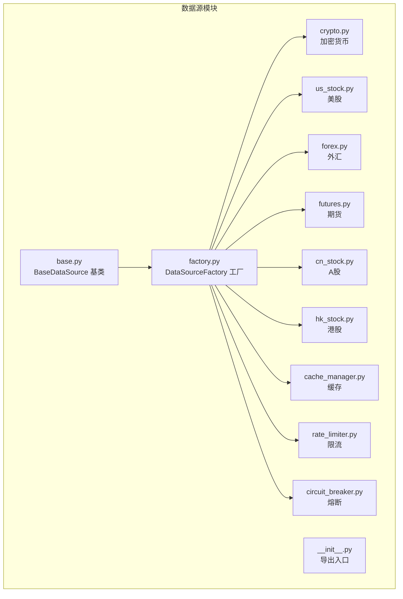
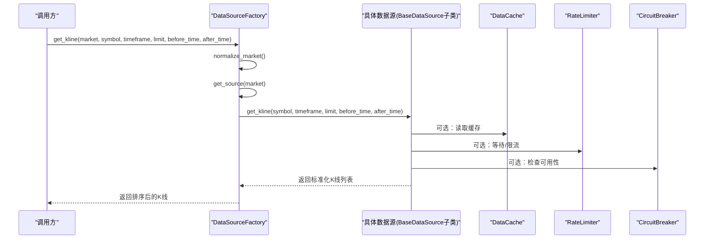
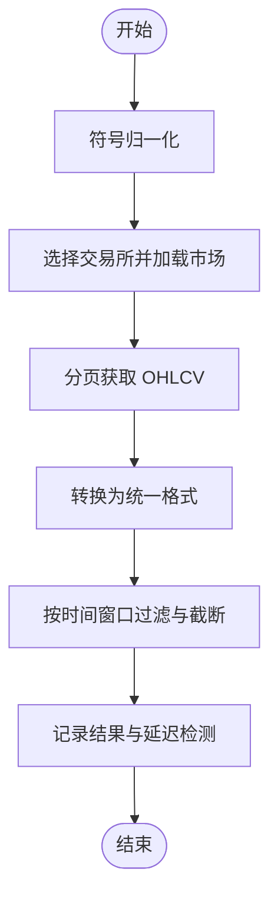
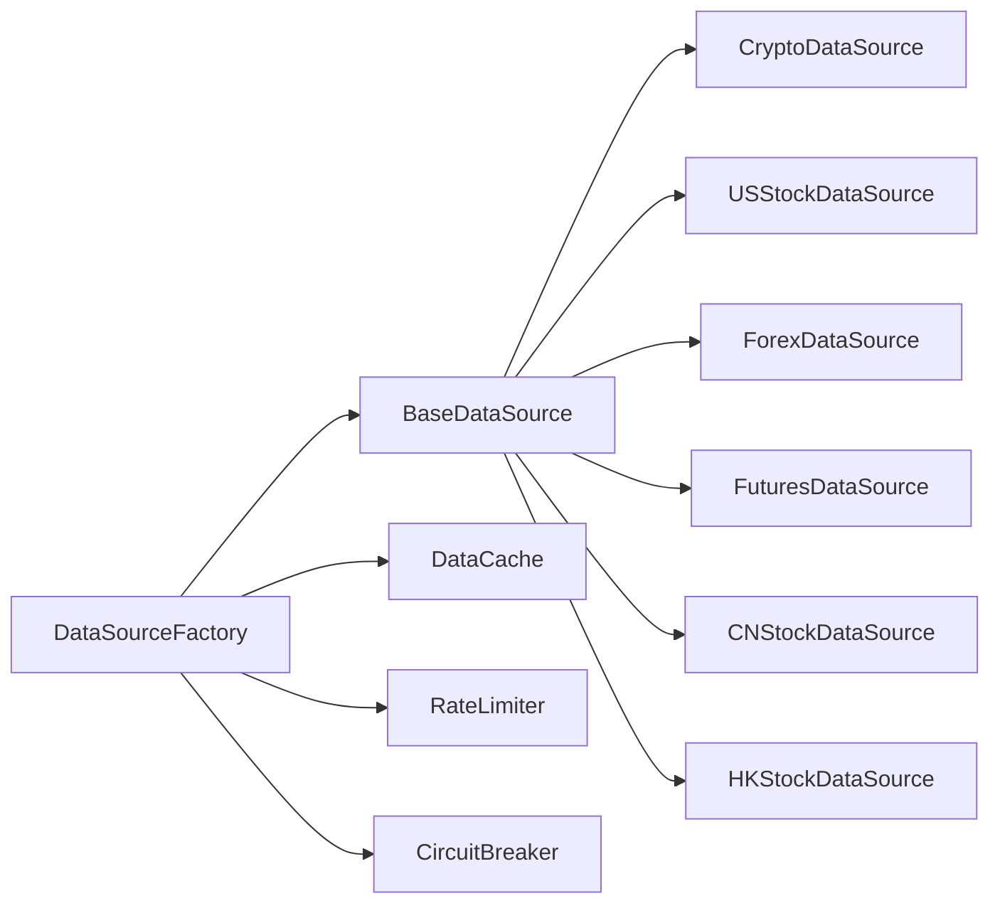

# 数据源插件开发

<cite>
**本文引用的文件**
- [backend_api_python/app/data_sources/base.py](file://backend_api_python/app/data_sources/base.py)
- [backend_api_python/app/data_sources/factory.py](file://backend_api_python/app/data_sources/factory.py)
- [backend_api_python/app/data_sources/__init__.py](file://backend_api_python/app/data_sources/__init__.py)
- [backend_api_python/app/data_sources/cache_manager.py](file://backend_api_python/app/data_sources/cache_manager.py)
- [backend_api_python/app/data_sources/rate_limiter.py](file://backend_api_python/app/data_sources/rate_limiter.py)
- [backend_api_python/app/data_sources/circuit_breaker.py](file://backend_api_python/app/data_sources/circuit_breaker.py)
- [backend_api_python/app/data_sources/crypto.py](file://backend_api_python/app/data_sources/crypto.py)
- [backend_api_python/app/data_sources/us_stock.py](file://backend_api_python/app/data_sources/us_stock.py)
- [backend_api_python/app/data_sources/forex.py](file://backend_api_python/app/data_sources/forex.py)
- [backend_api_python/app/data_sources/futures.py](file://backend_api_python/app/data_sources/futures.py)
- [backend_api_python/app/data_sources/cn_stock.py](file://backend_api_python/app/data_sources/cn_stock.py)
- [backend_api_python/app/data_sources/hk_stock.py](file://backend_api_python/app/data_sources/hk_stock.py)
- [backend_api_python/app/config/data_sources.py](file://backend_api_python/app/config/data_sources.py)
</cite>

## 目录
1. [简介](#简介)
2. [项目结构](#项目结构)
3. [核心组件](#核心组件)
4. [架构总览](#架构总览)
5. [详细组件分析](#详细组件分析)
6. [依赖分析](#依赖分析)
7. [性能考虑](#性能考虑)
8. [故障排查指南](#故障排查指南)
9. [结论](#结论)
10. [附录](#附录)

## 简介
本指南面向希望开发“数据源插件”的开发者，系统讲解如何基于 BaseDataSource 基类实现新的数据源，如何通过工厂模式注册插件，以及如何在策略引擎中消费这些数据。内容涵盖：
- 必须实现的方法与参数规范（get_ticker、get_kline）
- 插件注册机制与工厂入口
- 数据格式标准化与错误处理最佳实践
- 性能优化与稳定性保障（缓存、限流、熔断）
- 与策略引擎的数据流转过程

## 项目结构
数据源相关代码集中在 backend_api_python/app/data_sources 目录，采用“按市场类型分文件”的组织方式，辅以工厂、缓存、限流、熔断等基础设施模块。

图表来源
- [backend_api_python/app/data_sources/base.py:27-179](file://backend_api_python/app/data_sources/base.py#L27-L179)
- [backend_api_python/app/data_sources/factory.py:27-169](file://backend_api_python/app/data_sources/factory.py#L27-L169)
- [backend_api_python/app/data_sources/__init__.py:10-44](file://backend_api_python/app/data_sources/__init__.py#L10-L44)

章节来源
- [backend_api_python/app/data_sources/__init__.py:10-44](file://backend_api_python/app/data_sources/__init__.py#L10-L44)

## 核心组件
- BaseDataSource：定义统一接口与通用能力（格式化、过滤、时间范围估算、日志延迟检测）
- DataSourceFactory：按市场类型创建并复用数据源实例，提供便捷的 get_kline/get_ticker 调用入口
- 缓存、限流、熔断：为数据源访问提供稳定性和性能保障

章节来源
- [backend_api_python/app/data_sources/base.py:27-179](file://backend_api_python/app/data_sources/base.py#L27-L179)
- [backend_api_python/app/data_sources/factory.py:27-169](file://backend_api_python/app/data_sources/factory.py#L27-L169)
- [backend_api_python/app/data_sources/cache_manager.py:44-233](file://backend_api_python/app/data_sources/cache_manager.py#L44-L233)
- [backend_api_python/app/data_sources/rate_limiter.py:109-273](file://backend_api_python/app/data_sources/rate_limiter.py#L109-L273)
- [backend_api_python/app/data_sources/circuit_breaker.py:31-175](file://backend_api_python/app/data_sources/circuit_breaker.py#L31-L175)

## 架构总览
数据源插件的调用路径如下：调用方通过工厂选择市场类型，工厂返回具体数据源实例，数据源实现 get_kline/get_ticker，最终返回标准化的 K 线/报价数据。

图表来源
- [backend_api_python/app/data_sources/factory.py:104-169](file://backend_api_python/app/data_sources/factory.py#L104-L169)
- [backend_api_python/app/data_sources/cache_manager.py:71-128](file://backend_api_python/app/data_sources/cache_manager.py#L71-L128)
- [backend_api_python/app/data_sources/rate_limiter.py:135-159](file://backend_api_python/app/data_sources/rate_limiter.py#L135-L159)
- [backend_api_python/app/data_sources/circuit_breaker.py:67-100](file://backend_api_python/app/data_sources/circuit_breaker.py#L67-L100)

## 详细组件分析

### BaseDataSource 基类
- 必须实现的方法
  - get_kline(symbol, timeframe, limit, before_time=None, after_time=None)：返回标准化 K 线列表
  - get_ticker(symbol)：可选，返回报价字典（默认抛出 NotImplementedError）
- 通用能力
  - format_kline：统一格式化单条 K 线（time/open/high/low/close/volume）
  - calculate_time_range：按周期与数量估算时间跨度（秒）
  - filter_and_limit：按时间边界过滤并截断至 limit 条
  - log_result：记录最新 K 线时间并检测延迟（区分分钟/小时/日/周）

章节来源
- [backend_api_python/app/data_sources/base.py:27-179](file://backend_api_python/app/data_sources/base.py#L27-L179)

### 工厂注册与调用
- 市场别名与规范化：支持多种别名映射到标准市场枚举（Crypto、Forex、Futures、USStock、CNStock、HKStock）
- 实例缓存：同一市场类型首次创建后缓存，后续直接复用
- 便捷方法：
  - get_kline：封装调用并保证返回按时间升序
  - get_ticker：封装调用，对未实现的 get_ticker 提供降级返回

章节来源
- [backend_api_python/app/data_sources/factory.py:27-169](file://backend_api_python/app/data_sources/factory.py#L27-L169)

### 缓存、限流与熔断
- 缓存 DataCache：TTL + LRU，线程安全，支持命中/未命中统计
- 限流 RateLimiter：最小间隔 + 随机抖动，支持指数退避重试装饰器
- 熔断 CircuitBreaker：Closed/Open/HalfOpen 状态机，失败阈值触发熔断，冷却后半开试探

章节来源
- [backend_api_python/app/data_sources/cache_manager.py:44-233](file://backend_api_python/app/data_sources/cache_manager.py#L44-L233)
- [backend_api_python/app/data_sources/rate_limiter.py:109-273](file://backend_api_python/app/data_sources/rate_limiter.py#L109-L273)
- [backend_api_python/app/data_sources/circuit_breaker.py:31-175](file://backend_api_python/app/data_sources/circuit_breaker.py#L31-L175)

### 数据源插件实现要点
- get_kline 返回格式
  - 字段：time、open、high、low、close、volume（均为数值）
  - 时间戳：秒级 Unix 时间
  - 数值精度：遵循基类 format_kline 的四舍五入规则
- 符号规范化
  - 对外提供统一的符号格式，内部根据交易所/数据源特性做映射
- 时间窗口
  - 支持 before_time 与 after_time，回测场景下 after_time 用于保留完整窗口
- 错误处理
  - 包装异常并返回空列表或默认值，避免中断调用链
  - 记录详细日志便于定位问题

章节来源
- [backend_api_python/app/data_sources/base.py:40-55](file://backend_api_python/app/data_sources/base.py#L40-L55)
- [backend_api_python/app/data_sources/base.py:105-139](file://backend_api_python/app/data_sources/base.py#L105-L139)
- [backend_api_python/app/data_sources/crypto.py:232-306](file://backend_api_python/app/data_sources/crypto.py#L232-L306)
- [backend_api_python/app/data_sources/us_stock.py:170-234](file://backend_api_python/app/data_sources/us_stock.py#L170-L234)
- [backend_api_python/app/data_sources/forex.py:314-344](file://backend_api_python/app/data_sources/forex.py#L314-L344)
- [backend_api_python/app/data_sources/futures.py:217-261](file://backend_api_python/app/data_sources/futures.py#L217-L261)

### 具体数据源示例

#### 加密货币数据源（Crypto）
- 特点：基于 CCXT，支持多交易所，符号规范化与市场发现
- 关键流程：符号归一 → 交易所 OHLCV 获取 → 分页/去重/排序 → 过滤与限制 → 结果日志

图表来源
- [backend_api_python/app/data_sources/crypto.py:141-306](file://backend_api_python/app/data_sources/crypto.py#L141-L306)

章节来源
- [backend_api_python/app/data_sources/crypto.py:16-428](file://backend_api_python/app/data_sources/crypto.py#L16-L428)

#### 美股数据源（USStock）
- 特点：优先 Finnhub，降级 yfinance，按周期映射与天数估算
- 关键流程：优先级获取 → DataFrame 转换 → 过滤与限制 → 结果日志

章节来源
- [backend_api_python/app/data_sources/us_stock.py:17-334](file://backend_api_python/app/data_sources/us_stock.py#L17-L334)

#### 外汇数据源（Forex）
- 特点：三级降级（Twelve Data → Tiingo → yfinance），支持周/月聚合
- 关键流程：优先级获取 → Tiingo 周/月聚合 → 过滤与限制

章节来源
- [backend_api_python/app/data_sources/forex.py:104-709](file://backend_api_python/app/data_sources/forex.py#L104-L709)

#### 期货数据源（Futures）
- 特点：传统期货（Twelve Data → yfinance → Tiingo）与加密货币期货（CCXT）
- 关键流程：类型判断 → 传统期货三级降级或 CCXT 获取 → 统一格式

章节来源
- [backend_api_python/app/data_sources/futures.py:60-468](file://backend_api_python/app/data_sources/futures.py#L60-L468)

#### A股/H股数据源（CNStock/HKStock）
- 特点：多层降级（Twelve Data → 腾讯 → yfinance → AkShare），日/周线优先腾讯
- 关键流程：代码归一 → 多源尝试 → 过滤与限制

章节来源
- [backend_api_python/app/data_sources/cn_stock.py:30-125](file://backend_api_python/app/data_sources/cn_stock.py#L30-L125)
- [backend_api_python/app/data_sources/hk_stock.py:30-125](file://backend_api_python/app/data_sources/hk_stock.py#L30-L125)

## 依赖分析
- 工厂依赖：工厂根据市场类型动态导入具体数据源类，避免硬编码耦合
- 基类依赖：所有数据源共享统一接口与通用工具（格式化、过滤、日志）
- 基础设施依赖：数据源可按需组合使用缓存、限流、熔断

图表来源
- [backend_api_python/app/data_sources/factory.py:81-102](file://backend_api_python/app/data_sources/factory.py#L81-L102)
- [backend_api_python/app/data_sources/base.py:27-179](file://backend_api_python/app/data_sources/base.py#L27-L179)
- [backend_api_python/app/data_sources/cache_manager.py:44-233](file://backend_api_python/app/data_sources/cache_manager.py#L44-L233)
- [backend_api_python/app/data_sources/rate_limiter.py:109-273](file://backend_api_python/app/data_sources/rate_limiter.py#L109-L273)
- [backend_api_python/app/data_sources/circuit_breaker.py:31-175](file://backend_api_python/app/data_sources/circuit_breaker.py#L31-L175)

章节来源
- [backend_api_python/app/data_sources/factory.py:27-169](file://backend_api_python/app/data_sources/factory.py#L27-L169)

## 性能考虑
- 缓存策略
  - 实时行情缓存 TTL 20 分钟，K 线缓存 TTL 5 分钟，股票信息缓存 TTL 24 小时
  - LRU 淘汰，线程安全，支持命中率统计
- 限流与抖动
  - 最小请求间隔 + 随机抖动，降低被封禁风险
  - 指数退避重试，避免雪崩效应
- 熔断机制
  - 连续失败达到阈值进入熔断，冷却后半开试探，恢复半开成功即完全恢复
- 数据获取优化
  - 分页拉取 + 去重 + 排序，避免重复与错位
  - before_time 与 after_time 窗口控制，减少无效数据传输

章节来源
- [backend_api_python/app/data_sources/cache_manager.py:54-174](file://backend_api_python/app/data_sources/cache_manager.py#L54-L174)
- [backend_api_python/app/data_sources/rate_limiter.py:135-231](file://backend_api_python/app/data_sources/rate_limiter.py#L135-L231)
- [backend_api_python/app/data_sources/circuit_breaker.py:67-137](file://backend_api_python/app/data_sources/circuit_breaker.py#L67-L137)

## 故障排查指南
- get_ticker 未实现
  - 工厂对未实现的 get_ticker 返回默认值并记录警告
- 空数据与延迟
  - 基类日志会检测最新 K 线时间与阈值，超阈值发出延迟警告
- 异常处理
  - 工厂在获取 K 线/报价时捕获异常并返回空结果或默认值，避免传播
- 限流与熔断
  - 检查限流器配置与熔断器状态，确认是否因冷却导致请求被抑制

章节来源
- [backend_api_python/app/data_sources/factory.py:142-167](file://backend_api_python/app/data_sources/factory.py#L142-L167)
- [backend_api_python/app/data_sources/base.py:141-177](file://backend_api_python/app/data_sources/base.py#L141-L177)
- [backend_api_python/app/data_sources/circuit_breaker.py:138-157](file://backend_api_python/app/data_sources/circuit_breaker.py#L138-L157)

## 结论
通过 BaseDataSource 统一接口与 DataSourceFactory 工厂模式，项目实现了高扩展性的数据源插件体系。结合缓存、限流与熔断机制，既能满足策略引擎对实时性与稳定性的双重需求，又便于新增数据源与维护升级。建议在实现新数据源时严格遵循接口规范、数据格式与错误处理约定，并充分利用基础设施模块提升性能与可靠性。

## 附录

### 如何实现一个新的数据源插件
- 继承 BaseDataSource，实现以下方法：
  - get_kline(symbol, timeframe, limit, before_time=None, after_time=None)：返回标准化 K 线列表
  - get_ticker(symbol)：可选，返回报价字典
- 在工厂中注册
  - 在工厂的 _create_source 方法中添加新市场的分支，返回你的数据源实例
  - 在 normalize_market 中添加别名映射（如需）
- 配置与环境
  - 使用配置元类读取环境变量或附加配置，确保超时、重试、代理等参数可配置
- 测试与验证
  - 使用单元测试覆盖 get_kline/get_ticker 的典型场景
  - 验证 before_time/after_time 窗口、空数据、异常情况下的行为

章节来源
- [backend_api_python/app/data_sources/base.py:27-64](file://backend_api_python/app/data_sources/base.py#L27-L64)
- [backend_api_python/app/data_sources/factory.py:81-102](file://backend_api_python/app/data_sources/factory.py#L81-L102)
- [backend_api_python/app/config/data_sources.py:26-171](file://backend_api_python/app/config/data_sources.py#L26-L171)

### 数据格式标准化清单
- 字段
  - time：秒级 Unix 时间
  - open/high/low/close：数值
  - volume：数值
- 精度
  - 价格字段保留 4 位小数，成交量保留 2 位小数
- 时间窗口
  - before_time：仅保留 time < before_time 的 K 线
  - after_time：仅保留 time >= after_time 的 K 线
  - truncate：当 after_time 存在时，filter_and_limit 默认不截断末尾，避免回测窗口丢失左边界

章节来源
- [backend_api_python/app/data_sources/base.py:66-83](file://backend_api_python/app/data_sources/base.py#L66-L83)
- [backend_api_python/app/data_sources/base.py:105-139](file://backend_api_python/app/data_sources/base.py#L105-L139)

### 与策略引擎的集成与数据流转
- 调用入口
  - 通过工厂 get_kline 或 get_ticker 获取数据
- 数据处理
  - 工厂对返回数据进行时间升序排序
  - 数据源内部可结合缓存、限流、熔断提升稳定性
- 回测窗口
  - 使用 after_time/ before_time 精确控制回测区间，确保数据完整性

章节来源
- [backend_api_python/app/data_sources/factory.py:104-169](file://backend_api_python/app/data_sources/factory.py#L104-L169)