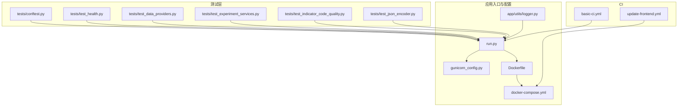
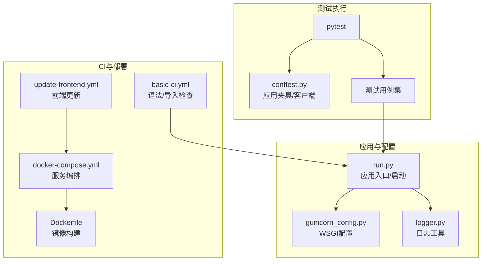
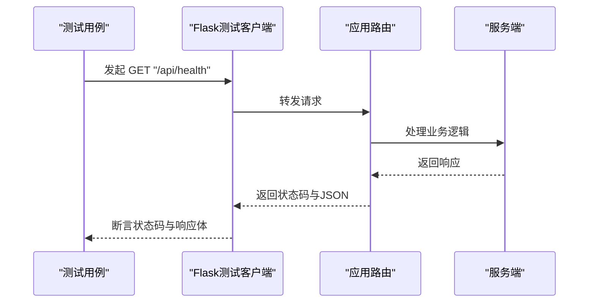
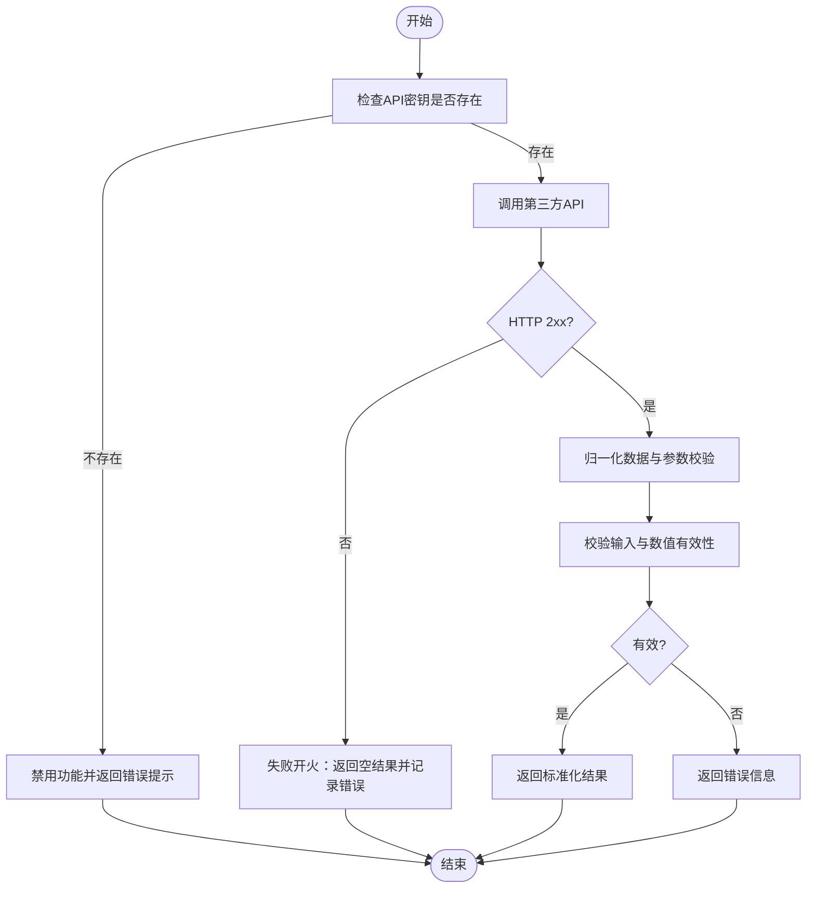
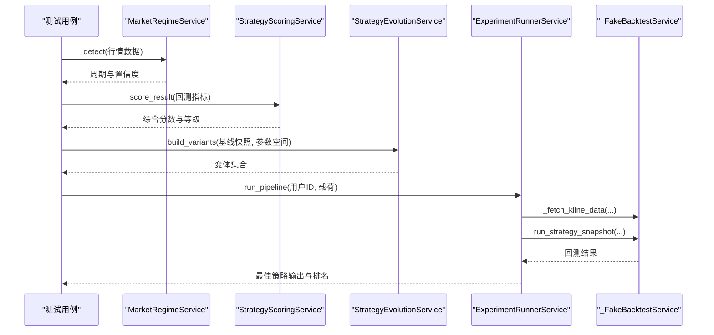
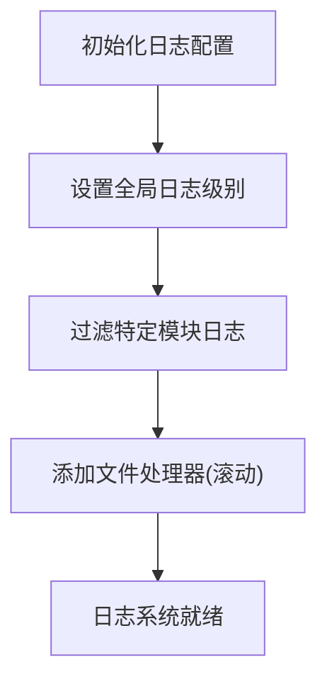
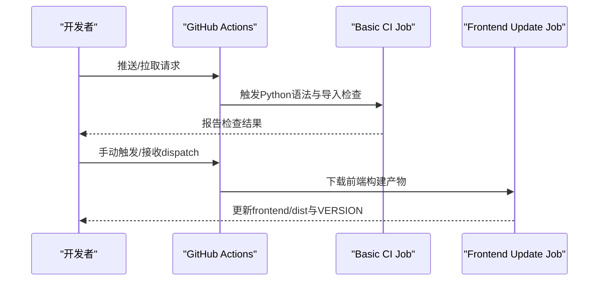
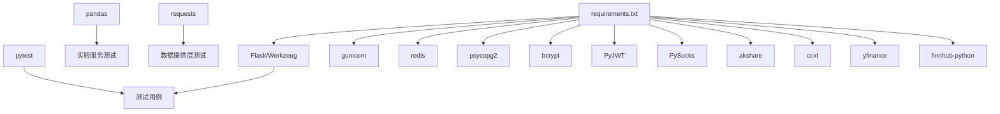

# 测试与调试

<cite>
**本文引用的文件**
- [backend_api_python/tests/conftest.py](file://backend_api_python/tests/conftest.py)
- [backend_api_python/tests/test_health.py](file://backend_api_python/tests/test_health.py)
- [backend_api_python/tests/test_data_providers.py](file://backend_api_python/tests/test_data_providers.py)
- [backend_api_python/tests/test_experiment_services.py](file://backend_api_python/tests/test_experiment_services.py)
- [backend_api_python/tests/test_indicator_code_quality.py](file://backend_api_python/tests/test_indicator_code_quality.py)
- [backend_api_python/tests/test_json_encoder.py](file://backend_api_python/tests/test_json_encoder.py)
- [backend_api_python/run.py](file://backend_api_python/run.py)
- [backend_api_python/requirements.txt](file://backend_api_python/requirements.txt)
- [.github/workflows/basic-ci.yml](file://.github/workflows/basic-ci.yml)
- [.github/workflows/update-frontend.yml](file://.github/workflows/update-frontend.yml)
- [docker-compose.yml](file://docker-compose.yml)
- [backend_api_python/Dockerfile](file://backend_api_python/Dockerfile)
- [backend_api_python/gunicorn_config.py](file://backend_api_python/gunicorn_config.py)
- [backend_api_python/app/utils/logger.py](file://backend_api_python/app/utils/logger.py)
</cite>

## 目录
1. [简介](#简介)
2. [项目结构](#项目结构)
3. [核心组件](#核心组件)
4. [架构总览](#架构总览)
5. [详细组件分析](#详细组件分析)
6. [依赖分析](#依赖分析)
7. [性能考虑](#性能考虑)
8. [故障排除指南](#故障排除指南)
9. [结论](#结论)
10. [附录](#附录)

## 简介
本指南面向QuantDinger后端测试与调试实践，覆盖单元测试框架使用、测试用例编写规范、集成测试策略、测试数据管理、调试工具与技巧（日志、性能分析、问题定位）、测试自动化与持续集成配置、测试覆盖率与质量保证流程，以及常见问题的排障策略。内容基于仓库中现有的测试文件、CI工作流、容器化部署与日志工具进行整理与提炼。

## 项目结构
后端测试集中在 backend_api_python/tests 目录，采用pytest作为测试框架；CI工作流位于 .github/workflows；容器化部署通过 docker-compose 和 Dockerfile 完成；日志工具位于 backend_api_python/app/utils/logger.py。

**图表来源**
- [backend_api_python/tests/conftest.py:1-31](file://backend_api_python/tests/conftest.py#L1-L31)
- [backend_api_python/tests/test_health.py:1-10](file://backend_api_python/tests/test_health.py#L1-L10)
- [backend_api_python/tests/test_data_providers.py:1-193](file://backend_api_python/tests/test_data_providers.py#L1-L193)
- [backend_api_python/tests/test_experiment_services.py:1-132](file://backend_api_python/tests/test_experiment_services.py#L1-L132)
- [backend_api_python/tests/test_indicator_code_quality.py:1-135](file://backend_api_python/tests/test_indicator_code_quality.py#L1-L135)
- [backend_api_python/tests/test_json_encoder.py:1-36](file://backend_api_python/tests/test_json_encoder.py#L1-L36)
- [backend_api_python/run.py:1-134](file://backend_api_python/run.py#L1-L134)
- [backend_api_python/gunicorn_config.py:1-36](file://backend_api_python/gunicorn_config.py#L1-L36)
- [backend_api_python/Dockerfile:1-62](file://backend_api_python/Dockerfile#L1-L62)
- [docker-compose.yml:1-167](file://docker-compose.yml#L1-L167)
- [backend_api_python/app/utils/logger.py:1-63](file://backend_api_python/app/utils/logger.py#L1-L63)
- [.github/workflows/basic-ci.yml:1-118](file://.github/workflows/basic-ci.yml#L1-L118)
- [.github/workflows/update-frontend.yml:1-85](file://.github/workflows/update-frontend.yml#L1-L85)

**章节来源**
- [backend_api_python/tests/conftest.py:1-31](file://backend_api_python/tests/conftest.py#L1-L31)
- [backend_api_python/tests/test_health.py:1-10](file://backend_api_python/tests/test_health.py#L1-L10)
- [backend_api_python/tests/test_data_providers.py:1-193](file://backend_api_python/tests/test_data_providers.py#L1-L193)
- [backend_api_python/tests/test_experiment_services.py:1-132](file://backend_api_python/tests/test_experiment_services.py#L1-L132)
- [backend_api_python/tests/test_indicator_code_quality.py:1-135](file://backend_api_python/tests/test_indicator_code_quality.py#L1-L135)
- [backend_api_python/tests/test_json_encoder.py:1-36](file://backend_api_python/tests/test_json_encoder.py#L1-L36)
- [backend_api_python/run.py:1-134](file://backend_api_python/run.py#L1-L134)
- [backend_api_python/Dockerfile:1-62](file://backend_api_python/Dockerfile#L1-L62)
- [docker-compose.yml:1-167](file://docker-compose.yml#L1-L167)
- [backend_api_python/app/utils/logger.py:1-63](file://backend_api_python/app/utils/logger.py#L1-L63)
- [.github/workflows/basic-ci.yml:1-118](file://.github/workflows/basic-ci.yml#L1-L118)
- [.github/workflows/update-frontend.yml:1-85](file://.github/workflows/update-frontend.yml#L1-L85)

## 核心组件
- 测试夹具与客户端
  - 在 conftest.py 中定义了会话级应用夹具与请求客户端夹具，确保测试环境具备最小可运行配置（如测试专用密钥、禁用进度条、关闭缓存等），并提供 Flask 测试客户端。
- 健康检查端点测试
  - test_health.py 验证 /api/health 返回状态码与响应体非空。
- 数据提供层与缓存测试
  - test_data_providers.py 包含安全数值转换、缓存读写、经济日历返回、第三方情感数据接口的错误处理与参数校验等测试。
- 实验服务测试
  - test_experiment_services.py 涵盖市场周期检测、策略评分、参数空间变体生成与实验流水线运行的断言。
- 指标代码质量测试
  - test_indicator_code_quality.py 针对策略注解、参数读取、信号标记等质量规则进行断言。
- JSON序列化测试
  - test_json_encoder.py 验证浮点数特殊值在JSON序列化时被替换为null的合规性。
- 应用入口与WSGI配置
  - run.py 负责加载环境变量、代理设置、安全检查与启动开发服务器；gunicorn_config.py 提供生产级并发模型配置。
- 容器化与编排
  - Dockerfile 构建后端镜像；docker-compose.yml 定义数据库、缓存与前后端服务编排及健康检查。
- 日志工具
  - app/utils/logger.py 提供统一日志初始化、过滤与滚动文件输出。

**章节来源**
- [backend_api_python/tests/conftest.py:1-31](file://backend_api_python/tests/conftest.py#L1-L31)
- [backend_api_python/tests/test_health.py:1-10](file://backend_api_python/tests/test_health.py#L1-L10)
- [backend_api_python/tests/test_data_providers.py:1-193](file://backend_api_python/tests/test_data_providers.py#L1-L193)
- [backend_api_python/tests/test_experiment_services.py:1-132](file://backend_api_python/tests/test_experiment_services.py#L1-L132)
- [backend_api_python/tests/test_indicator_code_quality.py:1-135](file://backend_api_python/tests/test_indicator_code_quality.py#L1-L135)
- [backend_api_python/tests/test_json_encoder.py:1-36](file://backend_api_python/tests/test_json_encoder.py#L1-L36)
- [backend_api_python/run.py:1-134](file://backend_api_python/run.py#L1-L134)
- [backend_api_python/gunicorn_config.py:1-36](file://backend_api_python/gunicorn_config.py#L1-L36)
- [backend_api_python/Dockerfile:1-62](file://backend_api_python/Dockerfile#L1-L62)
- [docker-compose.yml:1-167](file://docker-compose.yml#L1-L167)
- [backend_api_python/app/utils/logger.py:1-63](file://backend_api_python/app/utils/logger.py#L1-L63)

## 架构总览
下图展示测试与调试在系统中的位置与交互：测试通过pytest驱动，利用应用入口与配置完成端到端验证；CI工作流负责语法检查与导入检查；容器化用于本地/生产环境的一致性部署；日志工具贯穿开发与运维阶段的问题定位。

**图表来源**
- [backend_api_python/tests/conftest.py:1-31](file://backend_api_python/tests/conftest.py#L1-L31)
- [backend_api_python/tests/test_health.py:1-10](file://backend_api_python/tests/test_health.py#L1-L10)
- [backend_api_python/tests/test_data_providers.py:1-193](file://backend_api_python/tests/test_data_providers.py#L1-L193)
- [backend_api_python/tests/test_experiment_services.py:1-132](file://backend_api_python/tests/test_experiment_services.py#L1-L132)
- [backend_api_python/tests/test_indicator_code_quality.py:1-135](file://backend_api_python/tests/test_indicator_code_quality.py#L1-L135)
- [backend_api_python/tests/test_json_encoder.py:1-36](file://backend_api_python/tests/test_json_encoder.py#L1-L36)
- [backend_api_python/run.py:1-134](file://backend_api_python/run.py#L1-L134)
- [backend_api_python/gunicorn_config.py:1-36](file://backend_api_python/gunicorn_config.py#L1-L36)
- [backend_api_python/app/utils/logger.py:1-63](file://backend_api_python/app/utils/logger.py#L1-L63)
- [.github/workflows/basic-ci.yml:1-118](file://.github/workflows/basic-ci.yml#L1-L118)
- [.github/workflows/update-frontend.yml:1-85](file://.github/workflows/update-frontend.yml#L1-L85)
- [docker-compose.yml:1-167](file://docker-compose.yml#L1-L167)
- [backend_api_python/Dockerfile:1-62](file://backend_api_python/Dockerfile#L1-L62)

## 详细组件分析

### 单元测试框架与夹具
- 夹具作用域与环境准备
  - 会话级应用夹具创建测试专用Flask应用实例，并启用 TESTING 标志；客户端夹具提供测试请求入口。
  - 环境变量默认值确保缓存禁用、进度条关闭、管理员账户存在，避免外部依赖影响测试稳定性。
- 断言风格
  - 使用pytest标准断言，结合Flask测试客户端发起HTTP请求并断言状态码与响应体。

**章节来源**
- [backend_api_python/tests/conftest.py:1-31](file://backend_api_python/tests/conftest.py#L1-L31)
- [backend_api_python/tests/test_health.py:1-10](file://backend_api_python/tests/test_health.py#L1-L10)

### 健康检查端点测试
- 测试目标：验证 /api/health 返回200且响应体非空。
- 执行流程：通过测试客户端GET该路径，断言状态码与解析后的JSON对象。

**图表来源**
- [backend_api_python/tests/test_health.py:1-10](file://backend_api_python/tests/test_health.py#L1-L10)
- [backend_api_python/tests/conftest.py:19-31](file://backend_api_python/tests/conftest.py#L19-L31)

**章节来源**
- [backend_api_python/tests/test_health.py:1-10](file://backend_api_python/tests/test_health.py#L1-L10)
- [backend_api_python/tests/conftest.py:1-31](file://backend_api_python/tests/conftest.py#L1-L31)

### 数据提供层与缓存测试
- 安全数值转换
  - 验证字符串与数字输入的安全转换行为，以及无效输入的默认回退。
- 缓存读写与清理
  - 写入后读取一致性校验，清理后读取为空。
- 经济日历
  - 返回列表非空，字段包含必要键。
- 第三方情感数据接口
  - 未配置密钥时禁用功能并提示错误；
  - 正常请求时进行数据归一化与参数校验；
  - HTTP错误时“失败开火”策略（返回空结果但不抛异常）；
  - 输入包含非有限数或非法载荷时的健壮性处理；
  - 支持来源参数校验与规范化。

**图表来源**
- [backend_api_python/tests/test_data_providers.py:34-132](file://backend_api_python/tests/test_data_providers.py#L34-L132)

**章节来源**
- [backend_api_python/tests/test_data_providers.py:1-193](file://backend_api_python/tests/test_data_providers.py#L1-L193)

### 实验服务测试
- 市场周期检测
  - 使用构造的时间序列数据，断言检测到牛市趋势并给出置信度与策略家族。
- 策略评分
  - 输入回测指标，断言输出可排序的综合分数与等级，并包含分项得分。
- 参数空间变体生成
  - 基于网格法生成变体集合，断言数量与参数分布。
- 实验流水线
  - 使用伪造回测服务模拟行情与交易结果，断言最佳策略输出、排名首项与市场周期。

**图表来源**
- [backend_api_python/tests/test_experiment_services.py:13-132](file://backend_api_python/tests/test_experiment_services.py#L13-L132)

**章节来源**
- [backend_api_python/tests/test_experiment_services.py:1-132](file://backend_api_python/tests/test_experiment_services.py#L1-L132)

### 指标代码质量测试
- 规则覆盖
  - 空代码提示、最小合法风格、缺失止盈止损标注、未知策略键、参数声明未通过params.get读取、信号标记使用where(None)等。
- 断言策略
  - 通过分析函数返回的提示列表，断言特定提示代码的存在或不存在。

**章节来源**
- [backend_api_python/tests/test_indicator_code_quality.py:1-135](file://backend_api_python/tests/test_indicator_code_quality.py#L1-L135)

### JSON序列化测试
- 目标
  - 验证NaN/正负无穷在JSON序列化时被替换为null，以满足RFC 8259。
- 方法
  - 在应用上下文中序列化包含特殊值的数据结构，反序列化后断言对应键为null或原值保持不变。

**章节来源**
- [backend_api_python/tests/test_json_encoder.py:1-36](file://backend_api_python/tests/test_json_encoder.py#L1-L36)

### 测试用例编写规范
- 结构化命名
  - 使用 test_xxx 形式的函数名，描述明确的断言目标。
- 明确断言
  - 对状态码、响应体、数据结构字段、数值范围等进行断言。
- 外部依赖隔离
  - 使用monkeypatch设置环境变量或替换网络会话类，避免真实网络调用。
- 数据构造
  - 在测试内构造最小可用数据集（如DataFrame），避免对真实数据源的依赖。
- 失败开火策略
  - 对第三方接口错误采用“失败开火”，保证系统可用性与测试稳定性。

**章节来源**
- [backend_api_python/tests/test_data_providers.py:115-132](file://backend_api_python/tests/test_data_providers.py#L115-L132)
- [backend_api_python/tests/test_experiment_services.py:72-101](file://backend_api_python/tests/test_experiment_services.py#L72-L101)

### 集成测试策略与测试数据管理
- 端到端验证
  - 通过Flask测试客户端访问路由，验证健康检查与业务流程。
- 外部服务模拟
  - 使用假会话类与环境变量控制第三方服务行为，实现可控的集成场景。
- 数据隔离
  - 使用测试专用配置与缓存禁用，避免污染真实数据。
- 健康检查
  - 在CI与容器编排中加入健康检查，确保服务可用性。

**章节来源**
- [backend_api_python/tests/test_health.py:1-10](file://backend_api_python/tests/test_health.py#L1-L10)
- [docker-compose.yml:127-131](file://docker-compose.yml#L127-L131)

### 调试工具与技巧
- 日志配置
  - 初始化全局日志级别与格式，过滤特定子系统的噪声日志，按需降低INFO级别以减少干扰。
- 文件滚动
  - 使用RotatingFileHandler按大小轮转日志文件，便于长期追踪。
- 关键模块保留
  - 对USDT对账与计费模块保留INFO级别日志，提升问题定位效率。
- 启动日志
  - 应用入口打印服务启动信息与安全提示，便于快速确认运行状态。

**图表来源**
- [backend_api_python/app/utils/logger.py:9-48](file://backend_api_python/app/utils/logger.py#L9-L48)

**章节来源**
- [backend_api_python/app/utils/logger.py:1-63](file://backend_api_python/app/utils/logger.py#L1-L63)
- [backend_api_python/run.py:104-129](file://backend_api_python/run.py#L104-L129)

### 性能分析与问题定位
- 并发模型
  - 生产使用gthread线程模型，单进程多线程，适合I/O密集型任务；可通过调整workers与threads提升吞吐。
- 超时与优雅退出
  - 设置合理的超时与优雅退出时间，避免长时间阻塞导致资源浪费。
- 请求限制
  - 限制请求行长度与字段数量，防止恶意或异常请求造成内存压力。
- 代理与网络
  - 应用入口支持代理环境变量与国内金融数据源直连策略，减少不必要的网络往返。

**章节来源**
- [backend_api_python/gunicorn_config.py:1-36](file://backend_api_python/gunicorn_config.py#L1-L36)
- [backend_api_python/run.py:60-91](file://backend_api_python/run.py#L60-L91)

### 测试自动化与持续集成
- 基础CI
  - basic-ci.yml：在Linux环境中安装依赖（排除Windows专属包）、执行Python语法检查与核心模块导入检查，不启动服务或外部依赖。
- 前端构建检查
  - 校验预构建前端资产与Nginx配置存在性，确保发布产物完整。
- 前端更新工作流
  - update-frontend.yml：支持手动触发或来自私有前端仓库的repository_dispatch，下载并合并dist构建产物，提交版本号文件。

**图表来源**
- [.github/workflows/basic-ci.yml:10-76](file://.github/workflows/basic-ci.yml#L10-L76)
- [.github/workflows/update-frontend.yml:19-85](file://.github/workflows/update-frontend.yml#L19-L85)

**章节来源**
- [.github/workflows/basic-ci.yml:1-118](file://.github/workflows/basic-ci.yml#L1-L118)
- [.github/workflows/update-frontend.yml:1-85](file://.github/workflows/update-frontend.yml#L1-L85)

### 测试覆盖率与质量保证流程
- 当前状态
  - 仓库未包含覆盖率收集配置与报告生成步骤。
- 建议流程
  - 在CI中引入覆盖率工具（如pytest-cov），在基础CI之后增加覆盖率统计与阈值检查步骤，确保关键模块得到充分覆盖。
  - 将覆盖率报告与PR检查结合，形成质量门禁。

**章节来源**
- [.github/workflows/basic-ci.yml:1-118](file://.github/workflows/basic-ci.yml#L1-L118)

## 依赖分析
- 测试依赖
  - pytest：测试框架；Flask测试客户端：HTTP请求模拟；pandas：实验服务数据结构；requests：数据提供层网络请求。
- 运行时依赖
  - Flask/Werkzeug、gunicorn、redis、psycopg2、bcrypt、PyJWT、PySocks、akshare、ccxt、yfinance、finnhub-python等。
- CI依赖
  - Python 3.12、pip、gh CLI（用于前端更新工作流下载制品）。

**图表来源**
- [backend_api_python/requirements.txt:1-37](file://backend_api_python/requirements.txt#L1-L37)
- [backend_api_python/tests/test_experiment_services.py:1-11](file://backend_api_python/tests/test_experiment_services.py#L1-L11)
- [backend_api_python/tests/test_data_providers.py:1-3](file://backend_api_python/tests/test_data_providers.py#L1-L3)

**章节来源**
- [backend_api_python/requirements.txt:1-37](file://backend_api_python/requirements.txt#L1-L37)

## 性能考虑
- I/O密集型优化
  - 使用gthread模型与合理线程数，避免过多线程导致上下文切换开销。
- 数据库连接池
  - 在容器编排中通过环境变量配置池大小与健康检查，避免连接耗尽。
- 缓存与代理
  - 在测试中禁用缓存；在生产中合理使用Redis缓存；应用入口自动设置代理并绕过国内金融数据源，减少延迟。
- 日志级别
  - 默认INFO级别，针对热点路由与敏感模块调整日志级别，平衡可观测性与性能。

**章节来源**
- [backend_api_python/gunicorn_config.py:1-36](file://backend_api_python/gunicorn_config.py#L1-L36)
- [docker-compose.yml:110-122](file://docker-compose.yml#L110-L122)
- [backend_api_python/run.py:60-91](file://backend_api_python/run.py#L60-L91)
- [backend_api_python/app/utils/logger.py:9-34](file://backend_api_python/app/utils/logger.py#L9-L34)

## 故障排除指南
- 健康检查失败
  - 检查容器健康检查配置与后端日志；确认数据库与缓存服务已就绪。
- 第三方接口错误
  - 使用“失败开火”策略时，关注返回的错误信息与HTTP状态码；在测试中通过假会话类复现并断言。
- JSON序列化异常
  - 确保NaN/Inf被替换为null；在应用上下文中序列化后再反序列化验证。
- 密钥安全警告
  - 应用启动时若检测到默认密钥，会自动生成随机密钥并提示持久化设置。
- 日志噪声
  - 调整日志级别与过滤规则，减少Werkzeug与特定路由的INFO日志输出。

**章节来源**
- [docker-compose.yml:127-131](file://docker-compose.yml#L127-L131)
- [backend_api_python/tests/test_data_providers.py:115-132](file://backend_api_python/tests/test_data_providers.py#L115-L132)
- [backend_api_python/tests/test_json_encoder.py:6-36](file://backend_api_python/tests/test_json_encoder.py#L6-L36)
- [backend_api_python/run.py:109-120](file://backend_api_python/run.py#L109-L120)
- [backend_api_python/app/utils/logger.py:19-34](file://backend_api_python/app/utils/logger.py#L19-L34)

## 结论
本指南总结了QuantDinger后端的测试与调试实践：以pytest为核心，结合应用入口与配置完成端到端验证；通过CI工作流保障语法与导入质量；借助容器化与日志工具实现稳定部署与高效排障。建议后续补充覆盖率统计与质量门禁，进一步完善测试体系。

## 附录
- 快速参考
  - 启动测试：在后端目录执行pytest命令，加载conftest夹具并运行tests目录下的测试用例。
  - 查看日志：应用启动后输出服务地址与安全提示；日志文件位于logs目录并按大小轮转。
  - CI检查：推送或拉取请求将触发基础CI，检查Python语法与核心模块导入。
  - 前端更新：通过手动触发或repository_dispatch更新前端构建产物与版本号。

**章节来源**
- [backend_api_python/tests/conftest.py:1-31](file://backend_api_python/tests/conftest.py#L1-L31)
- [backend_api_python/run.py:104-129](file://backend_api_python/run.py#L104-L129)
- [.github/workflows/basic-ci.yml:10-76](file://.github/workflows/basic-ci.yml#L10-L76)
- [.github/workflows/update-frontend.yml:19-85](file://.github/workflows/update-frontend.yml#L19-L85)