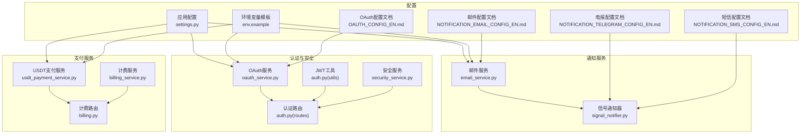
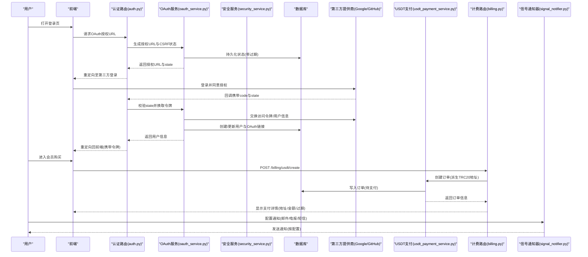
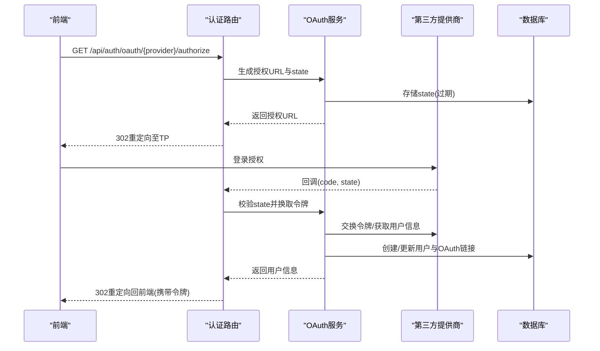
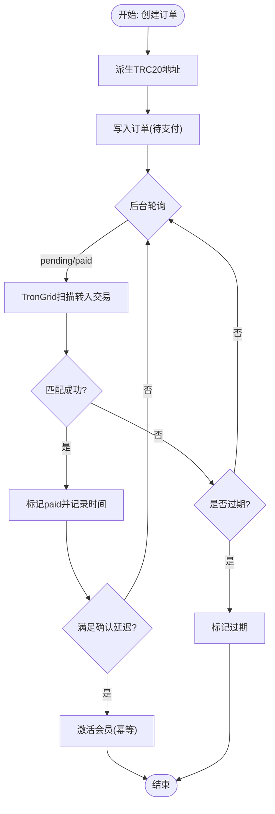
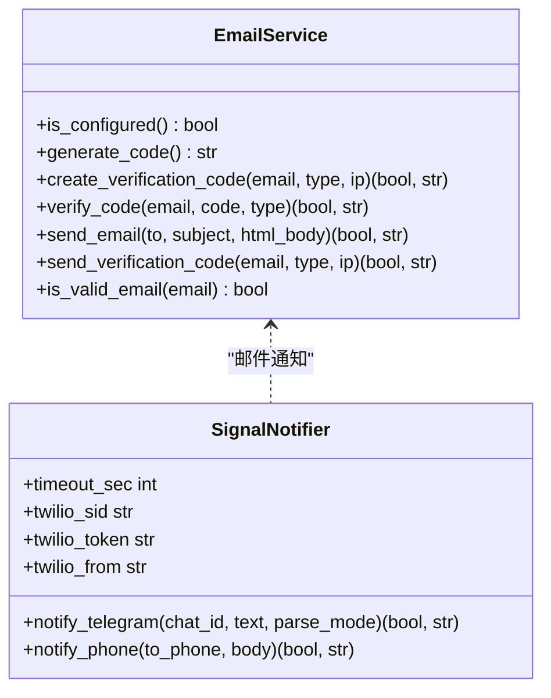
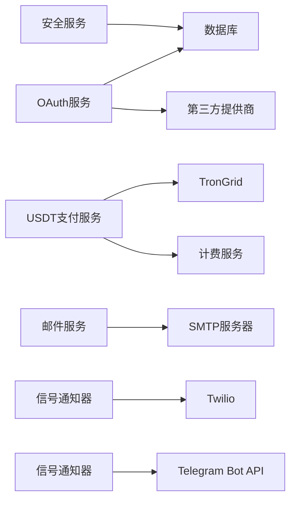

# 第三方集成

<cite>
**本文引用的文件**
- [oauth_service.py](file://backend_api_python/app/services/oauth_service.py)
- [auth.py](file://backend_api_python/app/utils/auth.py)
- [auth.py](file://backend_api_python/app/routes/auth.py)
- [settings.py](file://backend_api_python/app/config/settings.py)
- [email_service.py](file://backend_api_python/app/services/email_service.py)
- [signal_notifier.py](file://backend_api_python/app/services/signal_notifier.py)
- [NOTIFICATION_EMAIL_CONFIG_EN.md](file://docs/NOTIFICATION_EMAIL_CONFIG_EN.md)
- [NOTIFICATION_TELEGRAM_CONFIG_EN.md](file://docs/NOTIFICATION_TELEGRAM_CONFIG_EN.md)
- [NOTIFICATION_SMS_CONFIG_EN.md](file://docs/NOTIFICATION_SMS_CONFIG_EN.md)
- [OAUTH_CONFIG_EN.md](file://docs/OAUTH_CONFIG_EN.md)
- [env.example](file://backend_api_python/env.example)
- [billing.py](file://backend_api_python/app/routes/billing.py)
- [usdt_payment_service.py](file://backend_api_python/app/services/usdt_payment_service.py)
- [security_service.py](file://backend_api_python/app/services/security_service.py)
</cite>

## 目录
1. [简介](#简介)
2. [项目结构](#项目结构)
3. [核心组件](#核心组件)
4. [架构总览](#架构总览)
5. [详细组件分析](#详细组件分析)
6. [依赖分析](#依赖分析)
7. [性能考量](#性能考量)
8. [故障排查指南](#故障排查指南)
9. [结论](#结论)
10. [附录](#附录)

## 简介
本指南面向QuantDinger的第三方集成开发，聚焦以下能力：
- OAuth第三方登录：Google、GitHub等，含授权流程、回调处理、用户账户映射与安全校验
- 支付网关集成：USDT TRC20链上支付，订单创建、链上扫描、自动对账与会员激活
- 通知服务集成：Telegram、Email、SMS（Twilio）等渠道的适配器与配置
- API适配器设计模式与集成最佳实践：统一的配置加载、错误处理与幂等更新
- 认证机制、回调处理与错误恢复：CSRF状态校验、重定向白名单、超时与重试策略
- 第三方服务的配置管理、密钥管理与安全考虑：环境变量、密文存储、速率限制与审计日志

## 项目结构
QuantDinger后端采用Flask微服务架构，第三方集成主要分布在以下模块：
- 认证与安全：OAuth服务、JWT工具、安全服务、路由层认证装饰器
- 通知服务：邮件服务、信号通知器（Telegram、Twilio）
- 支付服务：USDT支付服务（TRC20）、计费服务、计费路由
- 配置与示例：应用配置、环境变量模板、各渠道配置文档

图示来源
- [oauth_service.py:27-715](file://backend_api_python/app/services/oauth_service.py#L27-L715)
- [auth.py:18-239](file://backend_api_python/app/utils/auth.py#L18-L239)
- [auth.py:1-1161](file://backend_api_python/app/routes/auth.py#L1-L1161)
- [security_service.py:26-399](file://backend_api_python/app/services/security_service.py#L26-L399)
- [email_service.py:29-362](file://backend_api_python/app/services/email_service.py#L29-L362)
- [signal_notifier.py:706-802](file://backend_api_python/app/services/signal_notifier.py#L706-L802)
- [usdt_payment_service.py:23-830](file://backend_api_python/app/services/usdt_payment_service.py#L23-L830)
- [billing.py:1-77](file://backend_api_python/app/routes/billing.py#L1-L77)
- [settings.py:1-99](file://backend_api_python/app/config/settings.py#L1-L99)
- [env.example:1-288](file://backend_api_python/env.example#L1-L288)
- [OAUTH_CONFIG_EN.md:1-228](file://docs/OAUTH_CONFIG_EN.md#L1-L228)
- [NOTIFICATION_EMAIL_CONFIG_EN.md:1-253](file://docs/NOTIFICATION_EMAIL_CONFIG_EN.md#L1-L253)
- [NOTIFICATION_TELEGRAM_CONFIG_EN.md:1-127](file://docs/NOTIFICATION_TELEGRAM_CONFIG_EN.md#L1-L127)
- [NOTIFICATION_SMS_CONFIG_EN.md:1-212](file://docs/NOTIFICATION_SMS_CONFIG_EN.md#L1-L212)

章节来源
- [oauth_service.py:27-715](file://backend_api_python/app/services/oauth_service.py#L27-L715)
- [auth.py:18-239](file://backend_api_python/app/utils/auth.py#L18-L239)
- [auth.py:1-1161](file://backend_api_python/app/routes/auth.py#L1-L1161)
- [security_service.py:26-399](file://backend_api_python/app/services/security_service.py#L26-L399)
- [email_service.py:29-362](file://backend_api_python/app/services/email_service.py#L29-L362)
- [signal_notifier.py:706-802](file://backend_api_python/app/services/signal_notifier.py#L706-L802)
- [usdt_payment_service.py:23-830](file://backend_api_python/app/services/usdt_payment_service.py#L23-L830)
- [billing.py:1-77](file://backend_api_python/app/routes/billing.py#L1-L77)
- [settings.py:1-99](file://backend_api_python/app/config/settings.py#L1-L99)
- [env.example:1-288](file://backend_api_python/env.example#L1-L288)
- [OAUTH_CONFIG_EN.md:1-228](file://docs/OAUTH_CONFIG_EN.md#L1-L228)
- [NOTIFICATION_EMAIL_CONFIG_EN.md:1-253](file://docs/NOTIFICATION_EMAIL_CONFIG_EN.md#L1-L253)
- [NOTIFICATION_TELEGRAM_CONFIG_EN.md:1-127](file://docs/NOTIFICATION_TELEGRAM_CONFIG_EN.md#L1-L127)
- [NOTIFICATION_SMS_CONFIG_EN.md:1-212](file://docs/NOTIFICATION_SMS_CONFIG_EN.md#L1-L212)

## 核心组件
- OAuth服务：负责Google/GitHub授权URL生成、回调处理、CSRF状态持久化与校验、用户账户创建/链接、重定向白名单与清理
- 安全服务：Turnstile人机验证、登录尝试记录与限流、验证码发送频率限制、安全事件审计
- JWT工具：令牌生成、验证、装饰器（登录/权限/角色）
- 邮件服务：SMTP配置、验证码生成与校验、邮件发送（HTML+纯文本）
- 信号通知器：Telegram消息发送、Twilio短信发送（REST）
- USDT支付服务：TRC20地址派生、订单创建、链上扫描与对账、确认与会员激活
- 计费服务与路由：会员计划配置、用户计费快照、USDT下单接口

章节来源
- [oauth_service.py:27-715](file://backend_api_python/app/services/oauth_service.py#L27-L715)
- [security_service.py:26-399](file://backend_api_python/app/services/security_service.py#L26-L399)
- [auth.py:18-239](file://backend_api_python/app/utils/auth.py#L18-L239)
- [email_service.py:29-362](file://backend_api_python/app/services/email_service.py#L29-L362)
- [signal_notifier.py:706-802](file://backend_api_python/app/services/signal_notifier.py#L706-L802)
- [usdt_payment_service.py:23-830](file://backend_api_python/app/services/usdt_payment_service.py#L23-L830)
- [billing.py:1-77](file://backend_api_python/app/routes/billing.py#L1-L77)

## 架构总览
下图展示第三方登录、支付与通知的整体交互流程。

图示来源
- [auth.py:1-1161](file://backend_api_python/app/routes/auth.py#L1-L1161)
- [oauth_service.py:27-715](file://backend_api_python/app/services/oauth_service.py#L27-L715)
- [security_service.py:26-399](file://backend_api_python/app/services/security_service.py#L26-L399)
- [usdt_payment_service.py:23-830](file://backend_api_python/app/services/usdt_payment_service.py#L23-L830)
- [billing.py:1-77](file://backend_api_python/app/routes/billing.py#L1-L77)
- [signal_notifier.py:706-802](file://backend_api_python/app/services/signal_notifier.py#L706-L802)

## 详细组件分析

### OAuth第三方登录（Google/GitHub）
- 授权流程
  - 生成授权URL：包含client_id、redirect_uri、scope、state、prompt等参数
  - CSRF状态持久化：将state写入数据库并设置过期时间，确保多Worker一致性
  - 回调处理：校验state、交换访问令牌、拉取用户信息、创建/更新用户与OAuth链接
- 重定向白名单：允许的后端重定向域名列表，避免开放重定向风险
- 用户账户映射：优先匹配OAuth provider_user_id；若不存在则按邮箱查找；否则创建新用户并发放注册积分
- 安全要点：Turnstile验证、登录尝试限流、失败记录与锁定、审计日志

图示来源
- [oauth_service.py:200-426](file://backend_api_python/app/services/oauth_service.py#L200-L426)
- [auth.py:1-1161](file://backend_api_python/app/routes/auth.py#L1-L1161)

章节来源
- [oauth_service.py:27-715](file://backend_api_python/app/services/oauth_service.py#L27-L715)
- [auth.py:1-1161](file://backend_api_python/app/routes/auth.py#L1-L1161)
- [security_service.py:26-399](file://backend_api_python/app/services/security_service.py#L26-L399)
- [OAUTH_CONFIG_EN.md:1-228](file://docs/OAUTH_CONFIG_EN.md#L1-L228)
- [env.example:144-150](file://backend_api_python/env.example#L144-L150)

### 支付网关集成（USDT TRC20）
- 订单创建：根据会员计划价格派生TRC20地址，写入订单表（待支付）
- 链上扫描：TronGrid API查询目标地址的TRC20转入交易，匹配金额与时间窗口
- 状态流转：pending → paid → confirmed；paid阶段检查确认延迟阈值，满足后激活会员
- 幂等更新：通过短事务读取当前状态，避免竞态与重复激活
- 后台任务：周期性扫描活跃订单，减少用户侧等待

图示来源
- [usdt_payment_service.py:132-750](file://backend_api_python/app/services/usdt_payment_service.py#L132-L750)
- [billing.py:55-77](file://backend_api_python/app/routes/billing.py#L55-L77)

章节来源
- [usdt_payment_service.py:23-830](file://backend_api_python/app/services/usdt_payment_service.py#L23-L830)
- [billing.py:1-77](file://backend_api_python/app/routes/billing.py#L1-L77)
- [env.example:172-182](file://backend_api_python/env.example#L172-L182)

### 通知服务集成（Telegram/Email/SMS）
- 邮件通知：SMTP配置、验证码生成与校验、HTML+纯文本邮件发送
- 电报通知：Bot Token与Chat ID配置，发送消息（支持parse_mode）
- 短信通知：Twilio REST API发送短信（To/From/Body）

图示来源
- [email_service.py:29-362](file://backend_api_python/app/services/email_service.py#L29-L362)
- [signal_notifier.py:706-802](file://backend_api_python/app/services/signal_notifier.py#L706-L802)
- [NOTIFICATION_EMAIL_CONFIG_EN.md:1-253](file://docs/NOTIFICATION_EMAIL_CONFIG_EN.md#L1-L253)
- [NOTIFICATION_TELEGRAM_CONFIG_EN.md:1-127](file://docs/NOTIFICATION_TELEGRAM_CONFIG_EN.md#L1-L127)
- [NOTIFICATION_SMS_CONFIG_EN.md:1-212](file://docs/NOTIFICATION_SMS_CONFIG_EN.md#L1-L212)

章节来源
- [email_service.py:29-362](file://backend_api_python/app/services/email_service.py#L29-L362)
- [signal_notifier.py:706-802](file://backend_api_python/app/services/signal_notifier.py#L706-L802)
- [NOTIFICATION_EMAIL_CONFIG_EN.md:1-253](file://docs/NOTIFICATION_EMAIL_CONFIG_EN.md#L1-L253)
- [NOTIFICATION_TELEGRAM_CONFIG_EN.md:1-127](file://docs/NOTIFICATION_TELEGRAM_CONFIG_EN.md#L1-L127)
- [NOTIFICATION_SMS_CONFIG_EN.md:1-212](file://docs/NOTIFICATION_SMS_CONFIG_EN.md#L1-L212)

### API适配器设计模式与集成最佳实践
- 统一配置加载：通过环境变量与配置类集中管理第三方密钥与参数
- 适配器职责分离：OAuth、邮件、短信、支付各自封装为独立服务，路由层只做编排
- 错误处理与幂等：链上对账与会员激活均采用“读取当前状态→条件更新”的幂等策略
- 超时与重试：对外部HTTP调用设置合理超时，避免阻塞数据库连接池
- 审计与日志：登录尝试、安全事件、支付扫描均记录日志，便于追踪与恢复

章节来源
- [settings.py:1-99](file://backend_api_python/app/config/settings.py#L1-L99)
- [env.example:1-288](file://backend_api_python/env.example#L1-L288)
- [usdt_payment_service.py:280-750](file://backend_api_python/app/services/usdt_payment_service.py#L280-L750)
- [security_service.py:26-399](file://backend_api_python/app/services/security_service.py#L26-L399)

### 认证机制、回调处理与错误恢复
- JWT令牌：包含用户标识、角色与token_version，支持单一客户端强制登出
- 回调处理：CSRF状态校验、第三方令牌交换、用户信息拉取、账户创建/链接
- 错误恢复：状态过期清理、登录尝试清理、支付扫描失败重试、后台Worker兜底

章节来源
- [auth.py:18-239](file://backend_api_python/app/utils/auth.py#L18-L239)
- [oauth_service.py:125-144](file://backend_api_python/app/services/oauth_service.py#L125-L144)
- [usdt_payment_service.py:701-715](file://backend_api_python/app/services/usdt_payment_service.py#L701-L715)
- [security_service.py:362-399](file://backend_api_python/app/services/security_service.py#L362-L399)

### 第三方服务的配置管理、密钥管理与安全考虑
- 配置管理：环境变量模板集中定义所有密钥与参数，支持运行时热更新
- 密钥管理：Secret Key、OAuth Client Secret、SMTP密码、Twilio凭据等均来自环境变量
- 安全考虑：Turnstile人机验证、登录限流与锁定、验证码防刷、审计日志、重定向白名单

章节来源
- [env.example:1-288](file://backend_api_python/env.example#L1-L288)
- [security_service.py:26-399](file://backend_api_python/app/services/security_service.py#L26-L399)
- [oauth_service.py:145-191](file://backend_api_python/app/services/oauth_service.py#L145-L191)

## 依赖分析
- 组件耦合
  - OAuth服务依赖数据库状态表与第三方HTTP接口
  - USDT支付服务依赖TronGrid API与计费服务
  - 通知服务依赖外部SMTP/Twilio/Telegram API
  - 安全服务贯穿登录、验证码与审计
- 外部依赖
  - Google/GitHub OAuth、TronGrid、Twilio、Telegram Bot API
- 循环依赖
  - 通过服务单例与延迟导入避免循环导入

图示来源
- [oauth_service.py:27-715](file://backend_api_python/app/services/oauth_service.py#L27-L715)
- [usdt_payment_service.py:23-830](file://backend_api_python/app/services/usdt_payment_service.py#L23-L830)
- [email_service.py:29-362](file://backend_api_python/app/services/email_service.py#L29-L362)
- [signal_notifier.py:706-802](file://backend_api_python/app/services/signal_notifier.py#L706-L802)
- [security_service.py:26-399](file://backend_api_python/app/services/security_service.py#L26-L399)

章节来源
- [oauth_service.py:27-715](file://backend_api_python/app/services/oauth_service.py#L27-L715)
- [usdt_payment_service.py:23-830](file://backend_api_python/app/services/usdt_payment_service.py#L23-L830)
- [email_service.py:29-362](file://backend_api_python/app/services/email_service.py#L29-L362)
- [signal_notifier.py:706-802](file://backend_api_python/app/services/signal_notifier.py#L706-L802)
- [security_service.py:26-399](file://backend_api_python/app/services/security_service.py#L26-L399)

## 性能考量
- 数据库连接池与事务：避免长时间持有连接，链上扫描在短事务外进行
- 并发与锁：支付服务DDL仅进程内一次，减少Schema锁竞争
- 超时与重试：对外部HTTP调用设置超时，防止阻塞
- 缓存与配置：计费配置缓存、Turnstile开关动态检测

## 故障排查指南
- OAuth
  - 重定向URI不匹配：核对GOOGLE_REDIRECT_URI/GITHUB_REDIRECT_URI与提供商配置一致
  - CSRF状态无效：检查state是否过期或跨Worker不一致
  - Turnstile失败：确认站点密钥与域名已添加
- 邮件
  - SMTP认证失败：确认用户名、密码、端口与加密方式
  - 验证码发送受限：检查IP/邮箱频率限制
- 短信
  - Twilio凭据缺失：确认Account SID/Auth Token/From Number
  - 国际短信受限：检查运营商规则与目的地支持
- 支付
  - TronGrid请求失败：检查API Key与Base URL
  - 订单未确认：确认确认延迟阈值与区块时间差

章节来源
- [OAUTH_CONFIG_EN.md:183-228](file://docs/OAUTH_CONFIG_EN.md#L183-L228)
- [NOTIFICATION_EMAIL_CONFIG_EN.md:202-253](file://docs/NOTIFICATION_EMAIL_CONFIG_EN.md#L202-L253)
- [NOTIFICATION_SMS_CONFIG_EN.md:158-212](file://docs/NOTIFICATION_SMS_CONFIG_EN.md#L158-L212)
- [usdt_payment_service.py:425-540](file://backend_api_python/app/services/usdt_payment_service.py#L425-L540)
- [security_service.py:72-110](file://backend_api_python/app/services/security_service.py#L72-L110)

## 结论
QuantDinger提供了完善的第三方集成能力：OAuth登录、USDT TRC20支付与多渠道通知。通过统一的配置管理、安全服务与幂等更新策略，系统在保证安全性的同时具备良好的扩展性与可靠性。建议在生产部署中严格管理密钥、启用Turnstile、配置重定向白名单，并结合监控与日志进行持续优化。

## 附录
- 环境变量参考：参见env.example中的各节配置项
- OAuth配置指南：参见OAUTH_CONFIG_EN.md
- 通知配置指南：参见NOTIFICATION_EMAIL_CONFIG_EN.md、NOTIFICATION_TELEGRAM_CONFIG_EN.md、NOTIFICATION_SMS_CONFIG_EN.md

章节来源
- [env.example:1-288](file://backend_api_python/env.example#L1-L288)
- [OAUTH_CONFIG_EN.md:1-228](file://docs/OAUTH_CONFIG_EN.md#L1-L228)
- [NOTIFICATION_EMAIL_CONFIG_EN.md:1-253](file://docs/NOTIFICATION_EMAIL_CONFIG_EN.md#L1-L253)
- [NOTIFICATION_TELEGRAM_CONFIG_EN.md:1-127](file://docs/NOTIFICATION_TELEGRAM_CONFIG_EN.md#L1-L127)
- [NOTIFICATION_SMS_CONFIG_EN.md:1-212](file://docs/NOTIFICATION_SMS_CONFIG_EN.md#L1-L212)