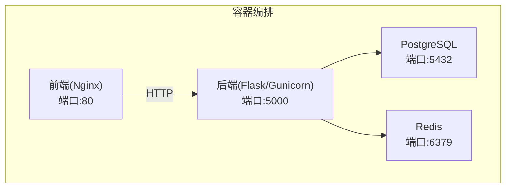
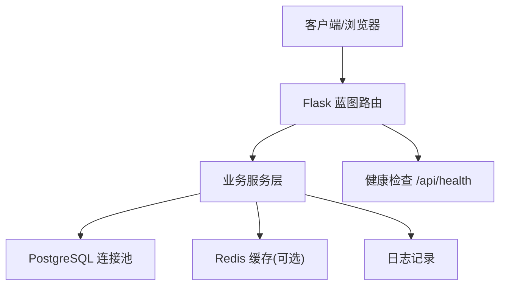
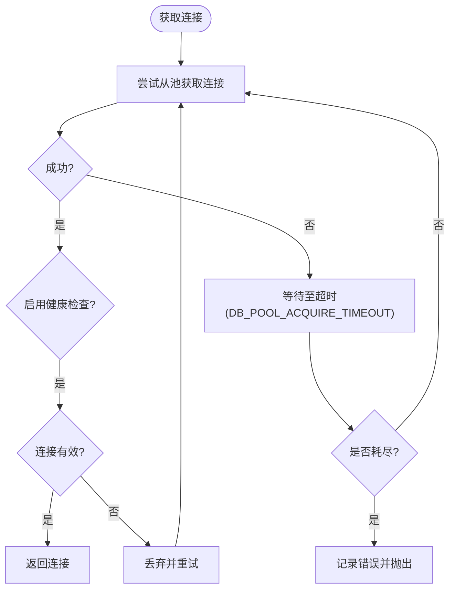
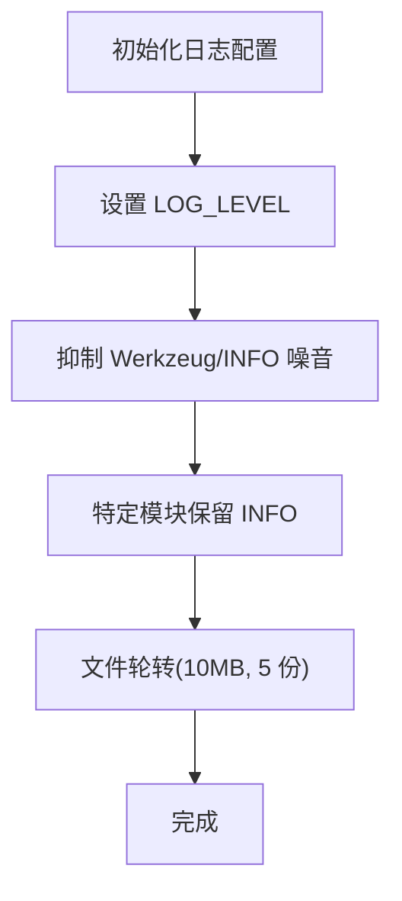
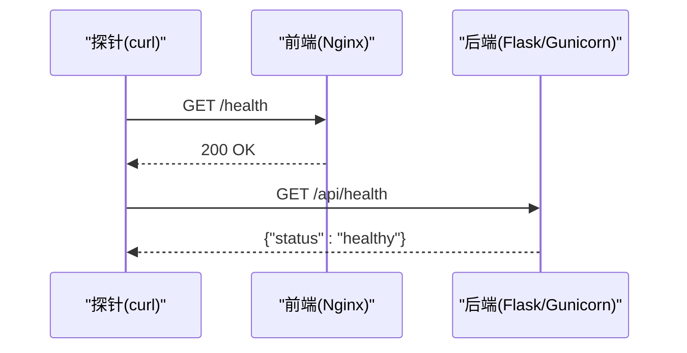
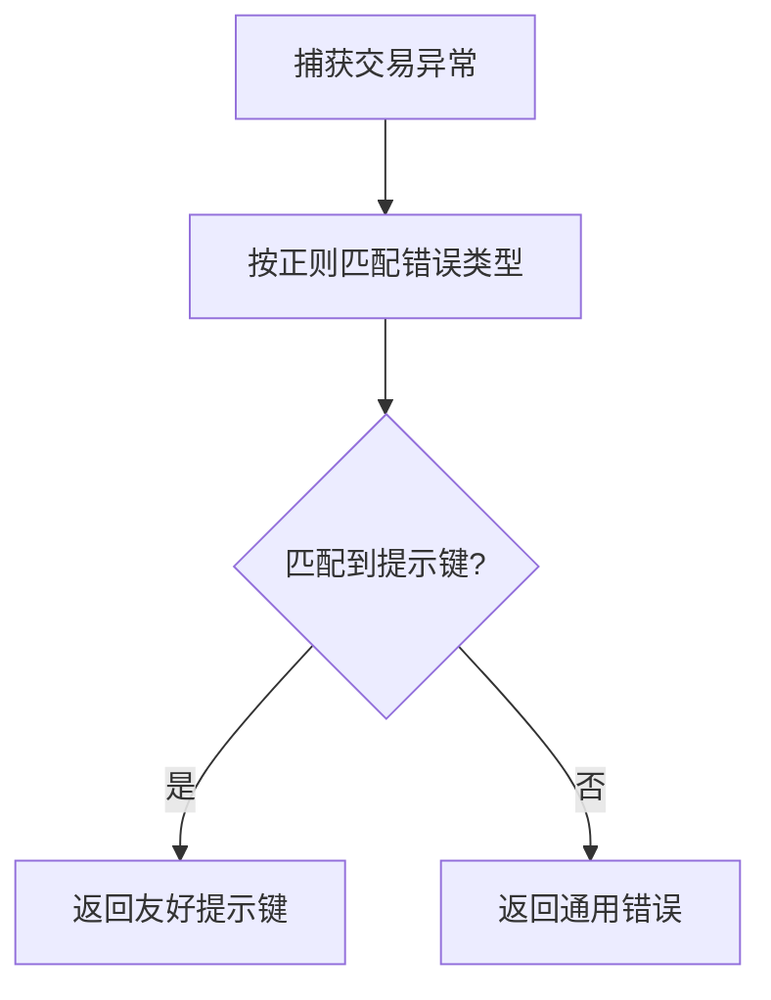
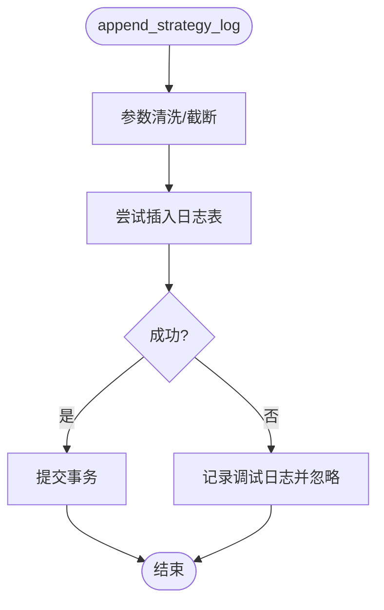
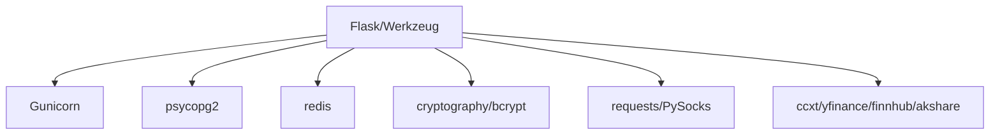

# 故障排除指南

<cite>
**本文引用的文件**
- [backend_api_python/README.md](file://backend_api_python/README.md)
- [backend_api_python/run.py](file://backend_api_python/run.py)
- [backend_api_python/gunicorn_config.py](file://backend_api_python/gunicorn_config.py)
- [backend_api_python/env.example](file://backend_api_python/env.example)
- [docker-compose.yml](file://docker-compose.yml)
- [backend_api_python/app/utils/logger.py](file://backend_api_python/app/utils/logger.py)
- [backend_api_python/app/utils/db.py](file://backend_api_python/app/utils/db.py)
- [backend_api_python/app/utils/db_postgres.py](file://backend_api_python/app/utils/db_postgres.py)
- [backend_api_python/app/config/settings.py](file://backend_api_python/app/config/settings.py)
- [backend_api_python/app/routes/health.py](file://backend_api_python/app/routes/health.py)
- [backend_api_python/app/utils/strategy_runtime_logs.py](file://backend_api_python/app/utils/strategy_runtime_logs.py)
- [backend_api_python/app/utils/safe_exec.py](file://backend_api_python/app/utils/safe_exec.py)
- [backend_api_python/app/routes/quick_trade.py](file://backend_api_python/app/routes/quick_trade.py)
- [docs/CLOUD_DEPLOYMENT_CN.md](file://docs/CLOUD_DEPLOYMENT_CN.md)
- [docs/OAUTH_CONFIG_EN.md](file://docs/OAUTH_CONFIG_EN.md)
- [backend_api_python/requirements.txt](file://backend_api_python/requirements.txt)
</cite>

## 目录
1. [简介](#简介)
2. [项目结构](#项目结构)
3. [核心组件](#核心组件)
4. [架构总览](#架构总览)
5. [详细组件分析](#详细组件分析)
6. [依赖分析](#依赖分析)
7. [性能考虑](#性能考虑)
8. [故障排除指南](#故障排除指南)
9. [结论](#结论)
10. [附录](#附录)

## 简介
本指南面向运维与开发人员，系统化梳理 QuantDinger 在部署、运行时与性能方面的常见问题与排障方法。内容覆盖：
- 部署问题：容器健康检查失败、端口冲突、只读文件系统、代理不生效、前端构建缺失等
- 运行时错误：数据库连接失败、请求超时、LLM/搜索服务异常、快速交易错误提示、策略运行日志持久化
- 性能问题：连接池耗尽、并发过高、慢查询、缓存未命中
- 监控告警与自动恢复：健康检查端点、容器健康检查、日志轮转与级别过滤
- 配置与依赖：环境变量、代理、数据库连接池、第三方服务密钥、证书校验

## 项目结构
后端采用 Flask 应用，通过 Gunicorn 生产运行；数据库为 PostgreSQL，Redis 可选；前端通过 Nginx 提供静态资源。Docker Compose 统一编排数据库、缓存、后端与前端。

图表来源
- [docker-compose.yml:25-167](file://docker-compose.yml#L25-L167)

章节来源
- [backend_api_python/README.md:15-33](file://backend_api_python/README.md#L15-L33)
- [docker-compose.yml:25-167](file://docker-compose.yml#L25-L167)

## 核心组件
- 应用入口与启动：加载 .env、设置代理、生成随机密钥（生产）、启动 Flask 或 Gunicorn
- 配置中心：环境变量驱动，支持日志级别、功能开关、限流、缓存、数据库连接池、LLM/搜索等
- 数据层：PostgreSQL 连接池封装，带健康检查与超时等待；Redis 可选缓存
- 日志：本地日志轮转、Werkzeug/INFO 噪音抑制、特定模块保留 INFO
- 健康检查：/api/health 与 /api/health 兼容路径
- 快速交易：错误模式匹配与用户友好提示
- 策略运行日志：持久化到 qd_strategy_logs 表，不影响业务

章节来源
- [backend_api_python/run.py:104-134](file://backend_api_python/run.py#L104-L134)
- [backend_api_python/app/config/settings.py:1-99](file://backend_api_python/app/config/settings.py#L1-L99)
- [backend_api_python/app/utils/db_postgres.py:107-162](file://backend_api_python/app/utils/db_postgres.py#L107-L162)
- [backend_api_python/app/utils/logger.py:9-63](file://backend_api_python/app/utils/logger.py#L9-L63)
- [backend_api_python/app/routes/health.py:10-34](file://backend_api_python/app/routes/health.py#L10-L34)
- [backend_api_python/app/utils/strategy_runtime_logs.py:11-30](file://backend_api_python/app/utils/strategy_runtime_logs.py#L11-L30)

## 架构总览
后端以 Flask Blueprints 提供 REST API，Gunicorn 多线程模型承载并发；数据库连接池按环境变量动态配置；Redis 作为可选缓存；容器健康检查保障可用性。

图表来源
- [backend_api_python/app/routes/health.py:10-34](file://backend_api_python/app/routes/health.py#L10-L34)
- [backend_api_python/app/utils/db_postgres.py:107-162](file://backend_api_python/app/utils/db_postgres.py#L107-L162)
- [backend_api_python/app/utils/logger.py:9-63](file://backend_api_python/app/utils/logger.py#L9-L63)

## 详细组件分析

### 数据库连接池与健康检查
- 连接池参数：最小/最大连接数、获取超时、健康检查开关
- 池耗尽时的等待与回退策略：超时前指数回退重试，必要时记录错误并抛出
- 健康检查：可选轻量查询验证连接有效性
- 错误类型：OperationalError/InterfaceError 视为连接失效，自动丢弃并释放

图表来源
- [backend_api_python/app/utils/db_postgres.py:184-235](file://backend_api_python/app/utils/db_postgres.py#L184-L235)

章节来源
- [backend_api_python/app/utils/db_postgres.py:53-56](file://backend_api_python/app/utils/db_postgres.py#L53-L56)
- [backend_api_python/app/utils/db_postgres.py:200-211](file://backend_api_python/app/utils/db_postgres.py#L200-L211)
- [backend_api_python/app/utils/db_postgres.py:164-182](file://backend_api_python/app/utils/db_postgres.py#L164-L182)

### 日志系统与级别过滤
- 全局日志格式与级别
- Werkzeug/INFO 噪音抑制（仅 WARNING 及以上）
- kline 路由 INFO 噪音抑制
- 特定模块保留 INFO（如 USDT 对账、计费）
- 文件轮转：10MB 大小上限，保留 5 份备份

图表来源
- [backend_api_python/app/utils/logger.py:9-63](file://backend_api_python/app/utils/logger.py#L9-L63)

章节来源
- [backend_api_python/app/utils/logger.py:9-63](file://backend_api_python/app/utils/logger.py#L9-L63)

### 健康检查与容器编排
- 应用级健康检查：/api/health 返回健康状态
- 容器健康检查：compose 中对后端/前端进行 curl 健康探测
- 建议：结合日志与容器状态定位问题

图表来源
- [docker-compose.yml:127-154](file://docker-compose.yml#L127-L154)
- [backend_api_python/app/routes/health.py:21-34](file://backend_api_python/app/routes/health.py#L21-L34)

章节来源
- [docker-compose.yml:127-154](file://docker-compose.yml#L127-L154)
- [backend_api_python/app/routes/health.py:10-34](file://backend_api_python/app/routes/health.py#L10-L34)

### 快速交易错误提示与模式匹配
- 将底层错误信息映射为用户可理解的提示键值
- 支持余额不足、价格/数量无效、频率限制、鉴权失败、网络错误、交易所维护等场景
- 建议：结合交易日志与交易所返回码定位具体原因

图表来源
- [backend_api_python/app/routes/quick_trade.py:34-59](file://backend_api_python/app/routes/quick_trade.py#L34-L59)

章节来源
- [backend_api_python/app/routes/quick_trade.py:34-59](file://backend_api_python/app/routes/quick_trade.py#L34-L59)

### 策略运行日志持久化
- 最佳努力插入 qd_strategy_logs，避免影响业务调用
- 字段截断与清洗，保证数据完整性

图表来源
- [backend_api_python/app/utils/strategy_runtime_logs.py:11-30](file://backend_api_python/app/utils/strategy_runtime_logs.py#L11-L30)

章节来源
- [backend_api_python/app/utils/strategy_runtime_logs.py:11-30](file://backend_api_python/app/utils/strategy_runtime_logs.py#L11-L30)

## 依赖分析
- 运行时依赖：Flask、Werkzeug、gunicorn、psycopg2、redis、bcrypt、PyJWT、dotenv、certifi、PySocks、ccxt、yfinance、finnhub-python、akshare 等
- 生产建议：升级至已修复 CVE 的版本；启用 TLS 校验；合理配置 CA Bundle

图表来源
- [backend_api_python/requirements.txt:1-37](file://backend_api_python/requirements.txt#L1-L37)

章节来源
- [backend_api_python/requirements.txt:1-37](file://backend_api_python/requirements.txt#L1-L37)

## 性能考虑
- 连接池：DB_POOL_MIN/MAX、ACQUIRE_TIMEOUT、HEALTH_CHECK 影响吞吐与稳定性
- 并发：GUNICORN_WORKERS × GUNICORN_THREADS 控制 I/O 并发；注意与 DB_POOL 的配比
- 执行器：市场与组合执行器工作线程数需低于 DB_POOL_MAX
- 缓存：开启 Redis 可降低数据库压力；注意内存策略与容量
- 日志：INFO 噪音抑制与文件轮转避免磁盘与 IO 压力

章节来源
- [backend_api_python/env.example:44-57](file://backend_api_python/env.example#L44-L57)
- [backend_api_python/gunicorn_config.py:10-28](file://backend_api_python/gunicorn_config.py#L10-L28)
- [backend_api_python/app/utils/db_postgres.py:53-56](file://backend_api_python/app/utils/db_postgres.py#L53-L56)

## 故障排除指南

### 一、部署问题

1) 容器健康检查失败
- 现象：docker-compose ps 显示后端/前端未健康
- 排查步骤：
  - 检查后端健康端点：curl http://127.0.0.1:5000/api/health
  - 检查前端健康端点：curl http://127.0.0.1:8888/health
  - 查看容器日志：docker compose logs backend/frontend
- 参考
  - [docker-compose.yml:127-154](file://docker-compose.yml#L127-L154)
  - [backend_api_python/app/routes/health.py:21-34](file://backend_api_python/app/routes/health.py#L21-L34)

2) 端口冲突或不可访问
- 现象：服务无法绑定端口或外部无法访问
- 排查步骤：
  - 检查端口映射：DB_PORT、BACKEND_PORT、FRONTEND_PORT
  - 确认防火墙与安全组放通 80/443/5000/5432/6379
- 参考
  - [docker-compose.yml:50-51](file://docker-compose.yml#L50-L51)
  - [docker-compose.yml:94-95](file://docker-compose.yml#L94-L95)
  - [docker-compose.yml:144-145](file://docker-compose.yml#L144-L145)

3) 前端构建报错“COPY frontend/dist ... not found”
- 现象：Docker 构建失败，提示缺少预编译目录
- 排查步骤：
  - 检查 .dockerignore 是否排除了 frontend/dist
  - 确保 frontend/dist 存在且非空
- 参考
  - [docs/CLOUD_DEPLOYMENT_CN.md:363-379](file://docs/CLOUD_DEPLOYMENT_CN.md#L363-L379)

4) 后台保存配置时报“只读文件系统”
- 现象：容器内 /app/.env ro 挂载导致无法写入
- 排查步骤：
  - 检查 docker-compose.yml 中 .env 挂载是否为只读
  - 改为可写挂载并重启后端
- 参考
  - [docs/CLOUD_DEPLOYMENT_CN.md:380-401](file://docs/CLOUD_DEPLOYMENT_CN.md#L380-L401)

5) Docker 内代理不生效
- 现象：PROXY_URL 设置后容器内仍无法访问外网
- 排查步骤：
  - 使用 host.docker.internal 替代 127.0.0.1
  - 确认 NO_PROXY 已合并国内金融域名列表
- 参考
  - [backend_api_python/run.py:60-91](file://backend_api_python/run.py#L60-L91)

6) 交易所日志出现“symbol not found”
- 现象：日志显示某币对不存在
- 排查步骤：
  - 确认代理与外网可达
  - 排查交易所符号映射/更名问题
- 参考
  - [docs/CLOUD_DEPLOYMENT_CN.md:412-422](file://docs/CLOUD_DEPLOYMENT_CN.md#L412-L422)

7) Nginx 502/504
- 现象：反向代理返回 502/504
- 排查步骤：
  - 检查后端健康与日志
  - 运行 nginx -t 校验配置
- 参考
  - [docs/CLOUD_DEPLOYMENT_CN.md:422-432](file://docs/CLOUD_DEPLOYMENT_CN.md#L422-L432)

8) 数据库不应暴露公网
- 建议：仅开放 80/443，数据库与应用端口仅内网访问
- 参考
  - [docs/CLOUD_DEPLOYMENT_CN.md:433-450](file://docs/CLOUD_DEPLOYMENT_CN.md#L433-L450)

### 二、运行时错误

1) 数据库连接失败
- 现象：启动即报数据库不可达或连接池耗尽
- 排查步骤：
  - 检查 DATABASE_URL 格式与连通性
  - 调整 DB_POOL_MIN/MAX、ACQUIRE_TIMEOUT
  - 确认 PostgreSQL 最大连接数高于 DB_POOL_MAX
- 参考
  - [backend_api_python/app/utils/db_postgres.py:107-162](file://backend_api_python/app/utils/db_postgres.py#L107-L162)
  - [backend_api_python/env.example:44-51](file://backend_api_python/env.example#L44-L51)
  - [docker-compose.yml:38-46](file://docker-compose.yml#L38-L46)

2) 请求超时/超时退出
- 现象：LLM/搜索/外部接口超时
- 排查步骤：
  - 检查 LLM_PROVIDER 与对应 API KEY
  - 调整 TIMEOUT/CONNECT_TIMEOUT
  - 若为 Windows/非主线程，确认超时机制生效
- 参考
  - [backend_api_python/env.example:205-214](file://backend_api_python/env.example#L205-L214)
  - [backend_api_python/app/utils/safe_exec.py:97-125](file://backend_api_python/app/utils/safe_exec.py#L97-L125)

3) 快速交易错误提示
- 现象：下单失败并返回友好提示键
- 排查步骤：
  - 根据提示键定位：余额不足、价格/数量无效、频率限制、鉴权失败、网络错误、交易所维护
  - 结合交易所返回码与日志定位
- 参考
  - [backend_api_python/app/routes/quick_trade.py:34-59](file://backend_api_python/app/routes/quick_trade.py#L34-L59)

4) 策略运行日志丢失
- 现象：策略面板无日志
- 排查步骤：
  - 确认 append_strategy_log 调用链路
  - 检查 qd_strategy_logs 表是否存在与权限
- 参考
  - [backend_api_python/app/utils/strategy_runtime_logs.py:11-30](file://backend_api_python/app/utils/strategy_runtime_logs.py#L11-L30)

5) OAuth 登录回调不生效
- 现象：登录成功但无法回到前端
- 排查步骤：
  - 检查 GOOGLE/GITHUB_REDIRECT_URI 与提供商配置
  - 确认 FRONTEND_URL 正确且包含协议
- 参考
  - [docs/OAUTH_CONFIG_EN.md:185-221](file://docs/OAUTH_CONFIG_EN.md#L185-L221)

### 三、性能问题

1) 连接池耗尽
- 现象：大量请求堆积，最终 PoolError
- 排查步骤：
  - 提升 DB_POOL_MAX，调整 ACQUIRE_TIMEOUT
  - 优化慢查询，缩短事务时间
  - 检查执行器工作线程与 DB_POOL 配比
- 参考
  - [backend_api_python/env.example:44-57](file://backend_api_python/env.example#L44-L57)
  - [backend_api_python/app/utils/db_postgres.py:200-211](file://backend_api_python/app/utils/db_postgres.py#L200-L211)

2) 并发过高导致延迟上升
- 排查步骤：
  - 降低 GUNICORN_WORKERS/THREADS 或增加 CPU/内存
  - 评估 Redis 缓存命中率
- 参考
  - [backend_api_python/gunicorn_config.py:10-28](file://backend_api_python/gunicorn_config.py#L10-L28)
  - [backend_api_python/env.example:281-284](file://backend_api_python/env.example#L281-L284)

3) 日志过大/磁盘压力
- 排查步骤：
  - 检查 LOG_LEVEL 与轮转配置
  - 清理历史日志，监控磁盘空间
- 参考
  - [backend_api_python/app/utils/logger.py:9-63](file://backend_api_python/app/utils/logger.py#L9-L63)

### 四、监控告警与自动恢复

- 健康检查端点：/api/health 与 /api/health
- 容器健康检查：compose 中对后端/前端进行探针
- 日志轮转与级别过滤：减少噪音与 IO 压力
- 建议：结合外部监控平台（如 Prometheus/Grafana）采集日志与指标，设置阈值告警

章节来源
- [backend_api_python/app/routes/health.py:21-34](file://backend_api_python/app/routes/health.py#L21-L34)
- [docker-compose.yml:127-154](file://docker-compose.yml#L127-L154)
- [backend_api_python/app/utils/logger.py:9-63](file://backend_api_python/app/utils/logger.py#L9-L63)

### 五、配置错误与依赖问题

- 环境变量
  - SECRET_KEY：生产必须修改默认值，run.py 会在首次启动自动生成并提示
  - DATABASE_URL：格式正确且可达
  - PROXY_URL/LIVE_TRADING_CA_BUNDLE：代理与证书校验
  - LLM_PROVIDER/API_KEY/MODEL：选择一致的供应商与模型
- 参考
  - [backend_api_python/run.py:109-120](file://backend_api_python/run.py#L109-L120)
  - [backend_api_python/env.example:11-13](file://backend_api_python/env.example#L11-L13)
  - [backend_api_python/env.example:216-229](file://backend_api_python/env.example#L216-L229)
  - [backend_api_python/env.example:115-128](file://backend_api_python/env.example#L115-L128)

- 依赖安装
  - 使用 requirements.txt 指定版本，关注 CVE 修复
- 参考
  - [backend_api_python/requirements.txt:1-37](file://backend_api_python/requirements.txt#L1-L37)

### 六、社区支持与问题报告

- 文档与指南：参考文档目录中的部署与配置文档
- 常见 FAQ：OAuth 配置、Turnstile、注册开关等
- 建议：提交 Issue 前先核对部署与配置项，附上日志与健康检查结果

章节来源
- [docs/OAUTH_CONFIG_EN.md:175-228](file://docs/OAUTH_CONFIG_EN.md#L175-L228)
- [docs/CLOUD_DEPLOYMENT_CN.md:363-451](file://docs/CLOUD_DEPLOYMENT_CN.md#L363-L451)

## 结论
通过规范的环境变量配置、合理的连接池与并发参数、完善的日志与健康检查机制，以及清晰的错误提示与持久化日志，QuantDinger 可在多租户与高并发场景下稳定运行。遇到问题时，优先从容器健康检查、数据库连接池、代理与证书、LLM/搜索服务、OAuth 回调与前端访问等维度入手排查，并结合日志与指标进行根因定位。

## 附录

### A. 常用排障清单
- 容器健康：后端/前端健康检查均通过
- 网络连通：数据库、Redis、外部 API 可达
- 配置正确：DATABASE_URL、SECRET_KEY、PROXY_URL、LLM 凭证
- 并发与池：DB_POOL 与 GUNICORN 并发匹配，无耗尽
- 日志与轮转：INFO 噪音抑制，文件轮转正常

### B. 关键端点与文件
- 健康检查：/api/health
- 配置示例：backend_api_python/env.example
- 启动入口：backend_api_python/run.py
- 生产配置：backend_api_python/gunicorn_config.py
- Docker 编排：docker-compose.yml