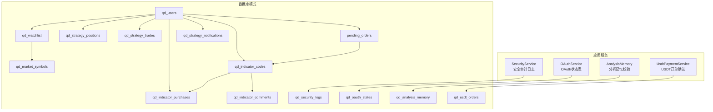
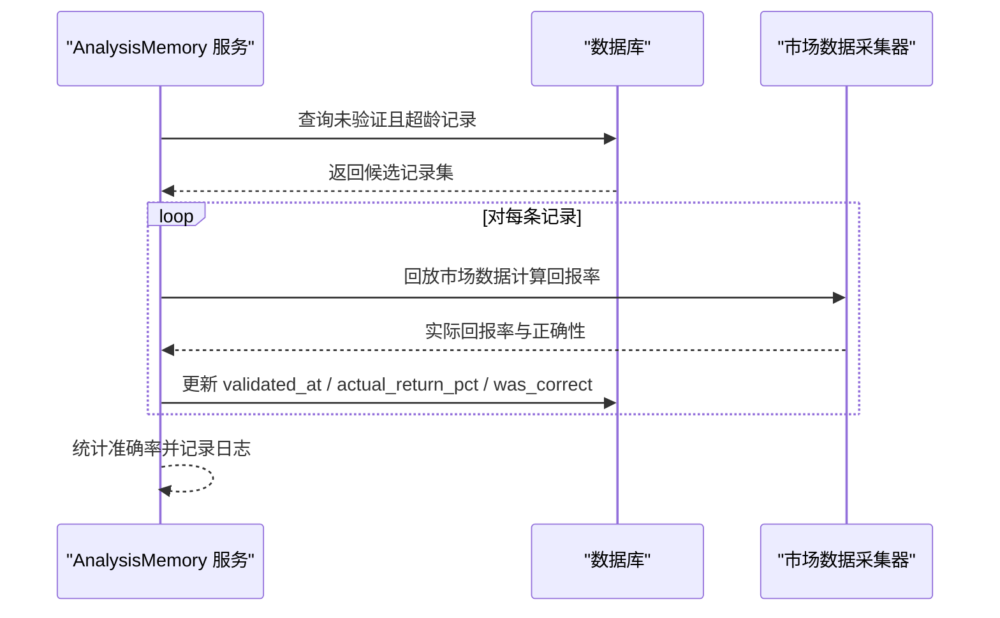
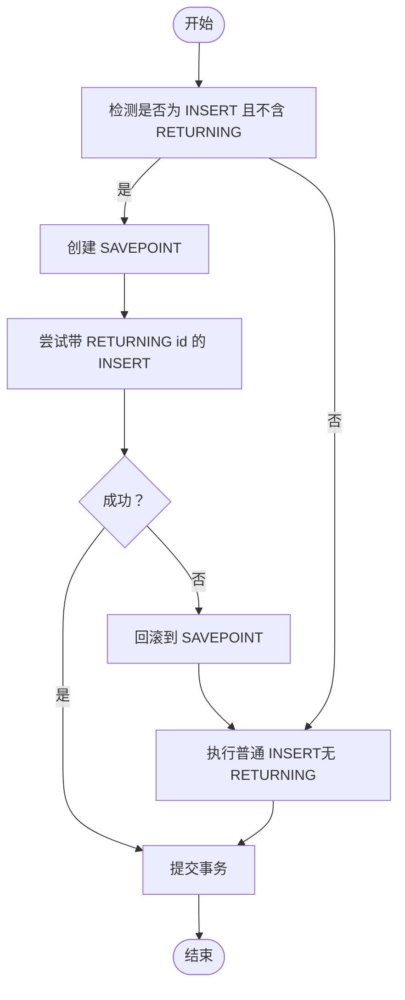
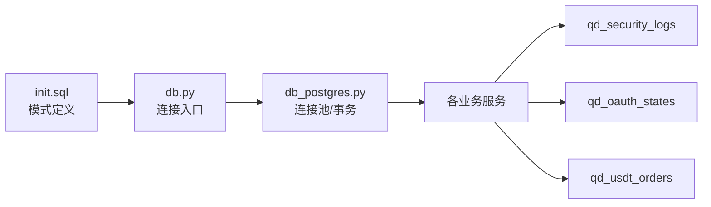

# 数据完整性与约束

<cite>
**本文引用的文件**
- [init.sql](file://backend_api_python/migrations/init.sql)
- [db_postgres.py](file://backend_api_python/app/utils/db_postgres.py)
- [security_service.py](file://backend_api_python/app/services/security_service.py)
- [oauth_service.py](file://backend_api_python/app/services/oauth_service.py)
- [usdt_payment_service.py](file://backend_api_python/app/services/usdt_payment_service.py)
- [analysis_memory.py](file://backend_api_python/app/services/analysis_memory.py)
- [db.py](file://backend_api_python/app/utils/db.py)
</cite>

## 目录
1. [简介](#简介)
2. [项目结构](#项目结构)
3. [核心组件](#核心组件)
4. [架构总览](#架构总览)
5. [详细组件分析](#详细组件分析)
6. [依赖关系分析](#依赖关系分析)
7. [性能考量](#性能考量)
8. [故障排查指南](#故障排查指南)
9. [结论](#结论)
10. [附录](#附录)

## 简介
本文件系统化梳理 QuantDinger 的数据完整性与约束设计，覆盖外键约束与级联策略、唯一约束与复合唯一约束、检查约束、触发器使用场景、数据迁移与版本升级的完整性保障、一致性校验与修复流程，以及并发事务下的竞争条件与解决方案。目标是帮助开发者与运维人员在不深入源码的前提下理解数据库层的关键约束与最佳实践。

## 项目结构
QuantDinger 的数据库模式由初始化脚本统一定义，涵盖用户、认证、策略、交易、挂单、通知、指标社区、市场符号、分析记忆、支付订单、OAuth 状态等核心领域。应用通过统一的数据库工具模块访问 PostgreSQL，确保连接池健康、事务边界与兼容性处理。



**图示来源**
- [init.sql:8-1026](file://backend_api_python/migrations/init.sql#L8-L1026)
- [security_service.py:246-275](file://backend_api_python/app/services/security_service.py#L246-L275)
- [oauth_service.py:42-68](file://backend_api_python/app/services/oauth_service.py#L42-L68)
- [usdt_payment_service.py:53-736](file://backend_api_python/app/services/usdt_payment_service.py#L53-L736)
- [analysis_memory.py:701-776](file://backend_api_python/app/services/analysis_memory.py#L701-L776)

**章节来源**
- [init.sql:8-1026](file://backend_api_python/migrations/init.sql#L8-L1026)
- [db.py:1-66](file://backend_api_python/app/utils/db.py#L1-L66)

## 核心组件
- 外键与级联策略：大量采用 ON DELETE CASCADE 保证“用户删除”时级联清理其子数据；对可选从属关系使用 ON DELETE SET NULL，避免强制级联导致的数据丢失。
- 唯一约束与复合唯一：qd_watchlist、qd_market_symbols、qd_indicator_purchases 等表通过唯一约束或复合唯一约束保证业务唯一性。
- 检查约束：指标评论评分字段使用 CHECK 约束限定有效范围。
- 触发器：未在脚本中发现显式触发器定义；审计日志通过应用层写入 qd_security_logs 表实现。
- 迁移与版本升级：使用 DO $$ ... $$ 包裹的条件列添加逻辑，确保幂等性与向后兼容。

**章节来源**
- [init.sql:42-94](file://backend_api_python/migrations/init.sql#L42-L94)
- [init.sql:261-277](file://backend_api_python/migrations/init.sql#L261-L277)
- [init.sql:427-436](file://backend_api_python/migrations/init.sql#L427-L436)
- [init.sql:621-633](file://backend_api_python/migrations/init.sql#L621-L633)
- [init.sql:861-869](file://backend_api_python/migrations/init.sql#L861-L869)
- [init.sql:879-881](file://backend_api_python/migrations/init.sql#L879-L881)
- [init.sql:830-839](file://backend_api_python/migrations/init.sql#L830-L839)
- [init.sql:845-854](file://backend_api_python/migrations/init.sql#L845-L854)

## 架构总览
下图展示关键表之间的外键关系与级联策略，帮助理解数据流向与完整性约束。

```mermaid
erDiagram
QD_USERS {
int id PK
varchar username UK
varchar email UK
int token_version
varchar timezone
}
QD_WATCHLIST {
int id PK
int user_id FK
varchar market
varchar symbol
varchar name
unique(user_id, market, symbol)
}
QD_MARKET_SYMBOLS {
int id PK
varchar market
varchar symbol
varchar name
varchar exchange
varchar currency
int is_active
int is_hot
int sort_order
unique(market, symbol)
}
QD_INDICATOR_CODES {
int id PK
int user_id FK
int is_buy
int end_time
varchar name
text code
text description
int publish_to_community
varchar pricing_type
decimal price
int is_encrypted
varchar preview_image
boolean vip_free
int createtime
int updatetime
int purchase_count
decimal avg_rating
int rating_count
int view_count
varchar review_status
text review_note
timestamp reviewed_at
int reviewed_by
int source_indicator_id
}
QD_INDICATOR_PURCHASES {
int id PK
int indicator_id FK
int buyer_id FK
int seller_id
decimal price
timestamp created_at
unique(indicator_id, buyer_id)
}
QD_INDICATOR_COMMENTS {
int id PK
int indicator_id FK
int user_id FK
int rating CHECK(1..5)
text content
int parent_id FK
int is_deleted
timestamp created_at
timestamp updated_at
}
QD_STRATEGY_POSITIONS {
int id PK
int user_id FK
int strategy_id FK
varchar symbol
varchar side
decimal size
decimal entry_price
decimal current_price
decimal highest_price
decimal lowest_price
decimal unrealized_pnl
decimal pnl_percent
decimal equity
timestamp updated_at
unique(strategy_id, symbol, side)
}
QD_STRATEGY_TRADES {
int id PK
int user_id FK
int strategy_id FK
varchar symbol
varchar type
decimal price
decimal amount
decimal value
decimal commission
varchar commission_ccy
decimal profit
timestamp created_at
}
PENDING_ORDERS {
int id PK
int user_id FK
int strategy_id FK
varchar symbol
varchar signal_type
bigint signal_ts
varchar market_type
varchar order_type
decimal amount
decimal price
varchar execution_mode
varchar status
int priority
int attempts
int max_attempts
text last_error
text payload_json
text dispatch_note
varchar exchange_id
varchar exchange_order_id
text exchange_response_json
decimal filled
decimal avg_price
timestamp executed_at
timestamp created_at
timestamp updated_at
timestamp processed_at
timestamp sent_at
}
QD_STRATEGY_NOTIFICATIONS {
int id PK
int user_id FK
int strategy_id FK
varchar symbol
varchar signal_type
varchar channels
varchar title
text message
text payload_json
int is_read
timestamp created_at
}
QD_SECURITY_LOGS {
int id PK
int user_id
varchar action
varchar ip_address
text user_agent
text details
timestamp created_at
}
QD_OAUTH_STATES {
varchar state PK
varchar provider
text redirect
timestamp created_at
timestamp expires_at
}
QD_USDT_ORDERS {
int id PK
int user_id FK
varchar plan
varchar chain
decimal amount_usdt
int address_index
varchar address
varchar status
varchar tx_hash
timestamp paid_at
timestamp confirmed_at
timestamp expires_at
timestamp created_at
timestamp updated_at
unique(chain, address)
}
QD_ANALYSIS_MEMORY {
int id PK
int user_id
varchar market
varchar symbol
varchar decision
int confidence
decimal price_at_analysis
text summary
jsonb reasons
jsonb scores
jsonb indicators_snapshot
jsonb raw_result
decimal consensus_score
decimal consensus_abs
decimal agreement_ratio
decimal quality_multiplier
timestamp created_at
timestamp validated_at
varchar actual_outcome
decimal actual_return_pct
boolean was_correct
varchar user_feedback
timestamp feedback_at
}
QD_USERS ||--o{ QD_WATCHLIST : "拥有"
QD_USERS ||--o{ QD_INDICATOR_CODES : "创建"
QD_USERS ||--o{ QD_INDICATOR_PURCHASES : "购买"
QD_USERS ||--o{ QD_INDICATOR_COMMENTS : "评论"
QD_USERS ||--o{ QD_STRATEGY_POSITIONS : "持有"
QD_USERS ||--o{ QD_STRATEGY_TRADES : "交易"
QD_USERS ||--o{ PENDING_ORDERS : "提交"
QD_USERS ||--o{ QD_STRATEGY_NOTIFICATIONS : "接收"
QD_USERS ||--o{ QD_USDT_ORDERS : "下单"
QD_USERS ||--o{ QD_SECURITY_LOGS : "产生"
QD_INDICATOR_CODES ||--o{ QD_INDICATOR_PURCHASES : "被购买"
QD_INDICATOR_CODES ||--o{ QD_INDICATOR_COMMENTS : "被评论"
QD_STRATEGY_POSITIONS ||--o{ QD_STRATEGY_TRADES : "对应"
PENDING_ORDERS }o--|| QD_STRATEGY_POSITIONS : "可能关联"
PENDING_ORDERS }o--|| QD_USERS : "归属"
```

**图示来源**
- [init.sql:8-1026](file://backend_api_python/migrations/init.sql#L8-L1026)

## 详细组件分析

### 外键约束与级联操作策略
- 用户主表 qd_users 与多个子表建立外键关系，多数采用 ON DELETE CASCADE，确保当用户被删除时，其所有相关数据（如积分日志、会员订单、USDT 订单、OAuth 关联、策略、持仓、交易、挂单、通知、指标购买与评论、手动仓位、提醒与监控）被自动清理，避免悬挂引用。
- 对于挂单表 pending_orders，strategy_id 使用 ON DELETE SET NULL，允许策略被删除后，挂单仍保留但解除与已删除策略的关联，便于后续归档或重新分配，降低数据丢失风险。
- 指标评论 parent_id 自引用也使用 ON DELETE CASCADE，保证子回复随父回复删除而级联清理。

策略选择依据
- ON DELETE CASCADE：适用于强从属关系且删除用户不应保留其子数据的场景（如积分日志、订单、OAuth 关联、策略、持仓、交易、挂单、通知、指标购买与评论、手动仓位、提醒与监控）。
- ON DELETE SET NULL：适用于可选关联或需要保留主数据但断开策略绑定的场景（如挂单）。

**章节来源**
- [init.sql:42-53](file://backend_api_python/migrations/init.sql#L42-L53)
- [init.sql:63-71](file://backend_api_python/migrations/init.sql#L63-L71)
- [init.sql:79-94](file://backend_api_python/migrations/init.sql#L79-L94)
- [init.sql:155-168](file://backend_api_python/migrations/init.sql#L155-L168)
- [init.sql:195-220](file://backend_api_python/migrations/init.sql#L195-L220)
- [init.sql:261-277](file://backend_api_python/migrations/init.sql#L261-L277)
- [init.sql:286-299](file://backend_api_python/migrations/init.sql#L286-L299)
- [init.sql:309-338](file://backend_api_python/migrations/init.sql#L309-L338)
- [init.sql:348-360](file://backend_api_python/migrations/init.sql#L348-L360)
- [init.sql:414-417](file://backend_api_python/migrations/init.sql#L414-L417)
- [init.sql:861-869](file://backend_api_python/migrations/init.sql#L861-L869)
- [init.sql:879-882](file://backend_api_python/migrations/init.sql#L879-L882)

### 唯一约束与复合唯一约束
- qd_watchlist：唯一约束 (user_id, market, symbol)，防止同一用户在同一市场重复添加相同标的。
- qd_market_symbols：唯一约束 (market, symbol)，保证市场+符号的全局唯一，种子数据插入使用 ON CONFLICT (market, symbol) DO NOTHING，避免重复。
- qd_indicator_purchases：唯一约束 (indicator_id, buyer_id)，确保同一买家对同一指标仅有一条购买记录。
- qd_strategy_positions：复合唯一约束 (strategy_id, symbol, side)，确保同一策略在同标上同一方向仅一条持仓记录。
- qd_oauth_links：唯一约束 (provider, provider_user_id)，保证第三方平台用户标识的全局唯一。
- qd_usdt_orders：唯一索引 (chain, address)，保证链+地址的唯一性，避免重复收款地址。
- qd_indicator_codes：外键约束 qd_indicator_codes_user_id_fkey，配合用户主键保证指标归属正确。

应用场景
- watchlist 与 market_symbols 的唯一性保证了用户自定义关注清单与系统种子数据的无冲突一致性。
- indicator_purchases 的唯一性避免重复计费与权益发放。
- strategy_positions 的复合唯一性简化了策略层面的头寸管理与风控计算。

**章节来源**
- [init.sql:427-436](file://backend_api_python/migrations/init.sql#L427-L436)
- [init.sql:621-633](file://backend_api_python/migrations/init.sql#L621-L633)
- [init.sql:861-869](file://backend_api_python/migrations/init.sql#L861-L869)
- [init.sql:261-277](file://backend_api_python/migrations/init.sql#L261-L277)
- [init.sql:155-168](file://backend_api_python/migrations/init.sql#L155-L168)
- [init.sql:96-96](file://backend_api_python/migrations/init.sql#L96-L96)

### 检查约束
- qd_indicator_comments.rating 字段使用 CHECK (rating >= 1 AND rating <= 5)，确保评分在有效范围内，防止脏数据进入评论系统。
- 其他数值型字段通过类型与默认值约束保证基本合理性（如金额、数量、杠杆等），并在应用层进一步校验。

**章节来源**
- [init.sql:879-881](file://backend_api_python/migrations/init.sql#L879-L881)

### 触发器使用场景
- 未在初始化脚本中发现显式触发器定义。
- 审计日志通过应用层服务写入 qd_security_logs 表，实现安全事件的自动记录与查询。

**章节来源**
- [init.sql:177-189](file://backend_api_python/migrations/init.sql#L177-L189)
- [security_service.py:246-275](file://backend_api_python/app/services/security_service.py#L246-L275)

### 数据迁移与版本升级的完整性保障
- 使用 DO $$ ... $$ 包裹的条件列添加逻辑，确保在不同版本数据库中幂等地添加新列并创建必要索引。
- 示例：
  - 为 qd_users 添加 token_version、timezone 等列。
  - 为 qd_analysis_memory 动态添加共识与质量相关列。
  - 为 qd_indicator_codes 批量添加社区统计列。
- 这些迁移逻辑避免了直接 ALTER TABLE 导致的锁表与失败风险，提升部署可靠性。

**章节来源**
- [init.sql:830-839](file://backend_api_python/migrations/init.sql#L830-L839)
- [init.sql:845-854](file://backend_api_python/migrations/init.sql#L845-L854)
- [init.sql:103-143](file://backend_api_python/migrations/init.sql#L103-L143)
- [init.sql:892-925](file://backend_api_python/migrations/init.sql#L892-L925)

### 数据一致性检查与修复
- 分析记忆一致性校验：后台任务会扫描超过一定年龄的未验证记录，回放市场数据以计算实际回报率并标记正确性，同时统计准确率。
- 自动修复：结合 LLM 服务对策略代码进行自动修复提示与重写（策略代码修复流程），辅助解决因历史数据或代码问题导致的一致性异常。
- OAuth 状态表：确保跨工作进程/多副本共享的状态表存在并带过期索引，避免 OAuth 回调状态失效。



**图示来源**
- [analysis_memory.py:701-776](file://backend_api_python/app/services/analysis_memory.py#L701-L776)

**章节来源**
- [analysis_memory.py:701-776](file://backend_api_python/app/services/analysis_memory.py#L701-L776)
- [analysis_memory.py:103-143](file://backend_api_python/app/services/analysis_memory.py#L103-L143)
- [oauth_service.py:42-68](file://backend_api_python/app/services/oauth_service.py#L42-L68)

### 并发事务中的数据竞争条件与解决方案
- 插入返回主键兼容性：针对某些表（如 qd_oauth_states）使用 state 作为主键而非 id，统一插入返回 id 的旧逻辑可能导致 UndefinedColumn 异常。通过 SAVEPOINT 包裹 RETURNING id 的变体，若失败则回滚到保存点并改用普通 INSERT，从而保持事务一致性与兼容性。
- 连接池健康与等待：数据库工具模块提供连接池健康检查与获取等待机制，避免瞬时池耗尽导致请求立即失败，降低并发压力下的竞争条件。
- 幂等更新：USDT 订单确认流程对状态进行条件更新，确保重复确认不会破坏状态机。



**图示来源**
- [db_postgres.py:260-284](file://backend_api_python/app/utils/db_postgres.py#L260-L284)

**章节来源**
- [db_postgres.py:260-284](file://backend_api_python/app/utils/db_postgres.py#L260-L284)
- [db_postgres.py:184-219](file://backend_api_python/app/utils/db_postgres.py#L184-L219)
- [usdt_payment_service.py:715-736](file://backend_api_python/app/services/usdt_payment_service.py#L715-L736)

## 依赖关系分析
- 初始化脚本集中定义了所有表、索引、约束与迁移逻辑，是数据库模式的权威来源。
- 应用服务通过统一的数据库工具模块访问 PostgreSQL，确保连接池、事务与错误处理的一致性。
- 审计日志、OAuth 状态、USDT 订单确认等关键流程依赖数据库约束与索引保障数据一致性。



**图示来源**
- [init.sql:1-1026](file://backend_api_python/migrations/init.sql#L1-L1026)
- [db.py:1-66](file://backend_api_python/app/utils/db.py#L1-L66)
- [db_postgres.py:164-442](file://backend_api_python/app/utils/db_postgres.py#L164-L442)
- [security_service.py:246-275](file://backend_api_python/app/services/security_service.py#L246-L275)
- [oauth_service.py:42-68](file://backend_api_python/app/services/oauth_service.py#L42-L68)
- [usdt_payment_service.py:53-736](file://backend_api_python/app/services/usdt_payment_service.py#L53-L736)

**章节来源**
- [init.sql:1-1026](file://backend_api_python/migrations/init.sql#L1-L1026)
- [db.py:1-66](file://backend_api_python/app/utils/db.py#L1-L66)
- [db_postgres.py:164-442](file://backend_api_python/app/utils/db_postgres.py#L164-L442)

## 性能考量
- 索引设计：为高频查询字段（如用户 ID、状态、时间戳、市场+符号组合）建立索引，显著提升查询与连接效率。
- 唯一约束：通过唯一索引/约束减少重复数据与冗余写入，降低存储与计算成本。
- 迁移幂等：使用条件列添加与 DO $$ ... $$ 逻辑，避免重复迁移带来的锁表与失败风险。
- 连接池：合理的连接池大小与等待策略有助于缓解高并发下的竞争条件与延迟。

[本节为通用指导，无需具体文件引用]

## 故障排查指南
- 审计日志缺失：确认 qd_security_logs 写入路径与权限，检查应用服务日志输出。
- OAuth 回调失败：检查 qd_oauth_states 表是否存在且带过期索引，确认状态未过期。
- USDT 订单状态异常：核对状态机更新逻辑与幂等条件，排查并发重复确认问题。
- 唯一约束冲突：定位冲突字段（如 watchlist、market_symbols、indicator_purchases、strategy_positions、usdt_orders），修正输入或清理重复数据。
- 检查约束失败：针对评分等字段，确保输入符合范围要求。
- 迁移失败：查看迁移日志与权限，确认条件列添加逻辑是否已执行。

**章节来源**
- [security_service.py:246-275](file://backend_api_python/app/services/security_service.py#L246-L275)
- [oauth_service.py:42-68](file://backend_api_python/app/services/oauth_service.py#L42-L68)
- [usdt_payment_service.py:715-736](file://backend_api_python/app/services/usdt_payment_service.py#L715-L736)
- [init.sql:427-436](file://backend_api_python/migrations/init.sql#L427-L436)
- [init.sql:621-633](file://backend_api_python/migrations/init.sql#L621-L633)
- [init.sql:861-869](file://backend_api_python/migrations/init.sql#L861-L869)
- [init.sql:261-277](file://backend_api_python/migrations/init.sql#L261-L277)
- [init.sql:96-96](file://backend_api_python/migrations/init.sql#L96-L96)
- [init.sql:879-881](file://backend_api_python/migrations/init.sql#L879-L881)

## 结论
QuantDinger 的数据库层通过完善的外键与级联策略、严格的唯一与检查约束、幂等的迁移机制与应用层一致性校验，构建了稳健的数据完整性体系。在并发场景下，借助连接池健康检查、SAVEPOINT 与幂等更新等手段，有效降低了竞争条件与数据不一致的风险。建议在新增表与字段时延续现有约束与迁移规范，确保系统长期稳定演进。

[本节为总结，无需具体文件引用]

## 附录
- 关键表与约束速览
  - qd_watchlist：唯一约束 (user_id, market, symbol)
  - qd_market_symbols：唯一约束 (market, symbol)
  - qd_indicator_purchases：唯一约束 (indicator_id, buyer_id)
  - qd_strategy_positions：复合唯一约束 (strategy_id, symbol, side)
  - qd_oauth_links：唯一约束 (provider, provider_user_id)
  - qd_usdt_orders：唯一索引 (chain, address)
  - qd_indicator_comments.rating：CHECK (rating >= 1 AND rating <= 5)
  - pending_orders.strategy_id：ON DELETE SET NULL
  - 其余多数外键：ON DELETE CASCADE

**章节来源**
- [init.sql:427-436](file://backend_api_python/migrations/init.sql#L427-L436)
- [init.sql:621-633](file://backend_api_python/migrations/init.sql#L621-L633)
- [init.sql:861-869](file://backend_api_python/migrations/init.sql#L861-L869)
- [init.sql:261-277](file://backend_api_python/migrations/init.sql#L261-L277)
- [init.sql:155-168](file://backend_api_python/migrations/init.sql#L155-L168)
- [init.sql:96-96](file://backend_api_python/migrations/init.sql#L96-L96)
- [init.sql:879-881](file://backend_api_python/migrations/init.sql#L879-L881)
- [init.sql:309-338](file://backend_api_python/migrations/init.sql#L309-L338)