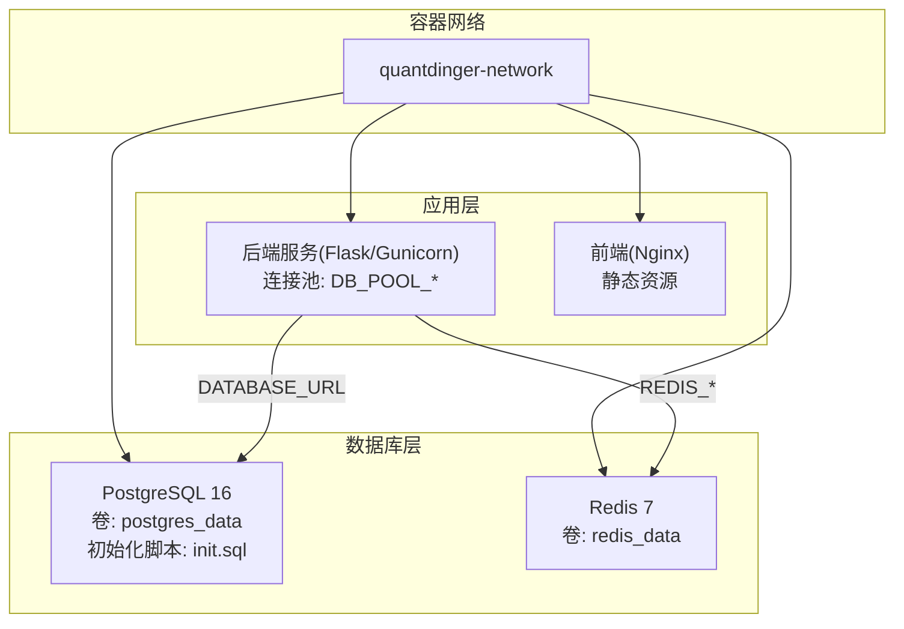
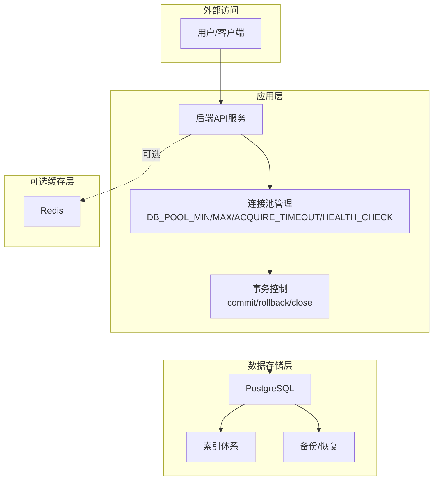
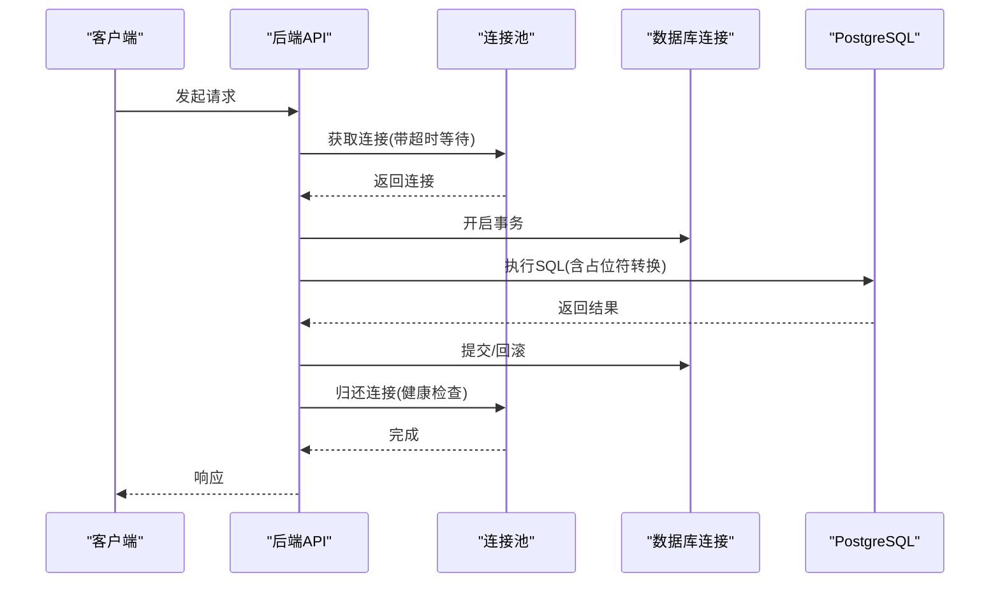
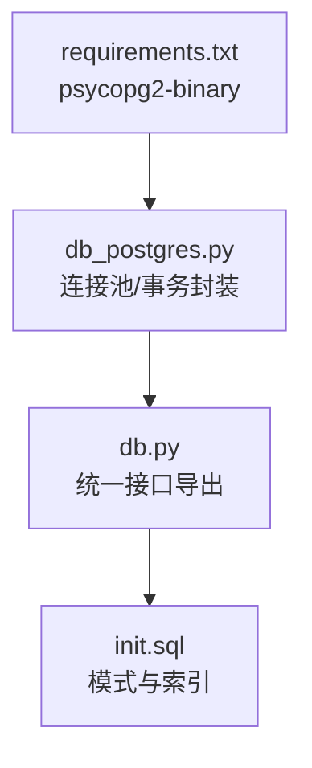
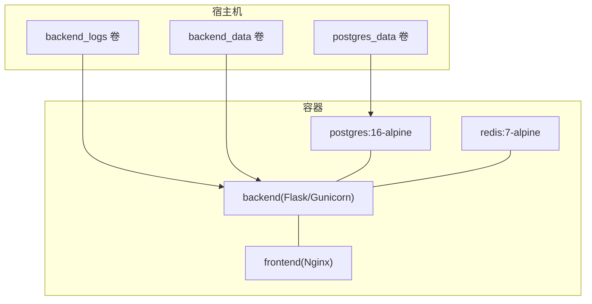

# 数据库架构概览

<cite>
**本文档引用的文件**
- [docker-compose.yml](file://docker-compose.yml)
- [init.sql](file://backend_api_python/migrations/init.sql)
- [db_postgres.py](file://backend_api_python/app/utils/db_postgres.py)
- [db.py](file://backend_api_python/app/utils/db.py)
- [settings.py](file://backend_api_python/app/config/settings.py)
- [requirements.txt](file://backend_api_python/requirements.txt)
- [logger.py](file://backend_api_python/app/utils/logger.py)
</cite>

## 目录
1. [简介](#简介)
2. [项目结构](#项目结构)
3. [核心组件](#核心组件)
4. [架构总览](#架构总览)
5. [详细组件分析](#详细组件分析)
6. [依赖关系分析](#依赖关系分析)
7. [性能考虑](#性能考虑)
8. [故障排除指南](#故障排除指南)
9. [结论](#结论)
10. [附录](#附录)

## 简介
本文件面向QuantDinger项目的数据库架构，系统化阐述PostgreSQL数据库的整体设计思路与实现要点，覆盖以下主题：
- 表分区策略与索引设计原则
- 查询优化策略与事务管理机制
- 数据库连接池配置与并发控制方案
- 备份恢复策略、主从复制与高可用性设计
- 性能监控指标、慢查询分析与资源使用优化
- 部署拓扑图与基础设施要求
- 数据安全策略、访问控制与审计日志实现

## 项目结构
QuantDinger采用容器化部署，数据库层以PostgreSQL为核心，配合Redis作为可选缓存层，后端服务通过连接池统一访问数据库。

**图表来源**
- [docker-compose.yml:25-167](file://docker-compose.yml#L25-L167)

**章节来源**
- [docker-compose.yml:25-167](file://docker-compose.yml#L25-L167)

## 核心组件
- PostgreSQL连接池与事务管理：通过统一的连接池封装，提供健康检查、超时等待与断连回收能力，确保高并发下的稳定性与资源可控。
- 数据库模式与索引：通过初始化脚本定义核心业务表及索引，覆盖用户、交易、回测、分析记忆等场景。
- 缓存层：Redis作为可选缓存，支持键空间过期与LRU淘汰策略，减轻数据库压力。
- 安全与审计：内置安全审计日志表与事件记录逻辑，支持登录、注册、密码重置等关键动作审计。

**章节来源**
- [db_postgres.py:1-495](file://backend_api_python/app/utils/db_postgres.py#L1-L495)
- [init.sql:1-1026](file://backend_api_python/migrations/init.sql#L1-L1026)
- [docker-compose.yml:25-167](file://docker-compose.yml#L25-L167)

## 架构总览
下图展示数据库层在整体系统中的位置与交互关系：

**图表来源**
- [db_postgres.py:1-495](file://backend_api_python/app/utils/db_postgres.py#L1-L495)
- [init.sql:1-1026](file://backend_api_python/migrations/init.sql#L1-L1026)
- [docker-compose.yml:25-167](file://docker-compose.yml#L25-L167)

## 详细组件分析

### PostgreSQL连接池与事务管理
- 连接池参数
  - 最小/最大连接数：可通过环境变量动态调优，满足不同并发需求。
  - 获取超时：在连接池耗尽时，按指数退避等待，避免瞬时失败。
  - 健康检查：启用时对连接执行轻量探测，剔除异常连接。
  - 连接选项：设置时区为UTC，启用keepalives以维持长连接稳定。
- 事务控制
  - 统一的上下文管理器封装，确保异常时自动回滚与连接归还。
  - 断连检测：若连接在请求过程中失效，标记为“损坏”并丢弃，防止污染池。
- 兼容性处理
  - 占位符转换：兼容旧版SQL语法，自动将问号占位符转换为PostgreSQL格式。
  - 插入返回ID：在存在自增主键的表上尽量返回新插入记录ID，保证向后兼容。

**图表来源**
- [db_postgres.py:184-235](file://backend_api_python/app/utils/db_postgres.py#L184-L235)
- [db_postgres.py:402-438](file://backend_api_python/app/utils/db_postgres.py#L402-L438)

**章节来源**
- [db_postgres.py:1-495](file://backend_api_python/app/utils/db_postgres.py#L1-L495)

### 表分区策略
- 当前现状：初始化脚本未定义任何分区表。
- 设计建议：
  - 时间序列数据（如K线、回测成交明细）可按时间范围进行水平分区，便于冷热数据分离与批量清理。
  - 按用户ID或租户维度分区，提升多租户隔离与查询局部性。
  - 分区裁剪结合索引，避免全表扫描；定期维护分区统计信息。

[本节为概念性建议，不直接分析具体文件]

### 索引设计原则
- 主键与唯一约束：确保主键与唯一性约束，保障数据完整性与查询效率。
- 常用查询列建立索引：
  - 用户相关：用户名、邮箱、邀请人、时区等。
  - 交易与回测：用户ID、状态、创建时间、策略ID等。
  - 订单与凭证：用户ID、状态、链路与地址组合等。
- JSON/JSONB字段：针对高频过滤字段建立GIN或按需索引，平衡写入与查询成本。
- 复合索引：根据查询条件组合建立复合索引，避免回表与排序。

**章节来源**
- [init.sql:1-1026](file://backend_api_python/migrations/init.sql#L1-L1026)

### 查询优化策略
- 使用参数化查询与占位符，避免SQL注入与计划缓存碎片化。
- 合理利用索引：通过EXPLAIN/ANALYZE分析执行计划，识别全表扫描与缺失索引。
- 分页与限制：对列表查询添加LIMIT与OFFSET，避免一次性加载大量数据。
- 写入批量化：批量插入与更新，减少往返次数与锁竞争。
- 读写分离：热点读取可引入只读副本，但需注意一致性窗口。

[本节为通用优化建议，不直接分析具体文件]

### 并发控制方案
- 连接池并发：通过最小/最大连接数与获取超时，控制并发与资源占用。
- 事务粒度：短事务优先，避免长时间持有锁；必要时使用SELECT FOR UPDATE精确锁定。
- 死锁规避：统一锁定顺序，缩短事务持续时间，重试幂等操作。
- 重试与幂等：对外部依赖失败采用指数退避重试，确保数据库操作幂等。

**章节来源**
- [db_postgres.py:1-495](file://backend_api_python/app/utils/db_postgres.py#L1-L495)

### 备份恢复策略
- 容量与频率：根据业务数据增长速率制定备份周期（如每日全备+增量），保留足够历史备份。
- 工具选择：使用pg_dump/pg_restore进行逻辑备份，或pg_basebackup进行物理备份。
- 验证与演练：定期验证备份文件可恢复性，模拟故障切换流程。
- 存储与传输：备份数据加密存储，跨区域冗余，传输通道加密。

[本节为通用策略建议，不直接分析具体文件]

### 主从复制与高可用设计
- 主从复制：配置主库写入与从库只读，实现读扩展与故障转移。
- 自动故障转移：结合心跳检测与仲裁机制，实现主节点故障时的快速切换。
- 连接池与路由：在应用层区分读写连接，写走主库，读走从库。
- 一致性权衡：在最终一致场景下提升读性能，在强一致场景下牺牲部分吞吐。

[本节为通用架构建议，不直接分析具体文件]

### 数据安全策略、访问控制与审计日志
- 访问控制：
  - 最小权限原则：为应用账户授予仅必要的数据库权限。
  - 网络隔离：数据库容器置于专用网络，限制外部访问。
  - 凭据管理：通过环境变量注入数据库凭据，避免硬编码。
- 审计日志：
  - 安全事件记录：登录、注册、密码变更、OAuth登录等关键动作均写入审计表。
  - 详情字段：以JSON格式记录IP、UA、设备信息等，便于溯源分析。
- 日志与监控：
  - 应用日志：统一日志格式与轮转，关键模块降低噪声级别。
  - 数据库日志：开启慢查询日志与错误日志，定期巡检。

**章节来源**
- [init.sql:177-189](file://backend_api_python/migrations/init.sql#L177-L189)
- [logger.py:1-63](file://backend_api_python/app/utils/logger.py#L1-L63)

## 依赖关系分析

**图表来源**
- [requirements.txt:19-20](file://backend_api_python/requirements.txt#L19-L20)
- [db_postgres.py:1-495](file://backend_api_python/app/utils/db_postgres.py#L1-L495)
- [db.py:1-66](file://backend_api_python/app/utils/db.py#L1-L66)
- [init.sql:1-1026](file://backend_api_python/migrations/init.sql#L1-L1026)

**章节来源**
- [requirements.txt:1-37](file://backend_api_python/requirements.txt#L1-L37)
- [db_postgres.py:1-495](file://backend_api_python/app/utils/db_postgres.py#L1-L495)
- [db.py:1-66](file://backend_api_python/app/utils/db.py#L1-L66)
- [init.sql:1-1026](file://backend_api_python/migrations/init.sql#L1-L1026)

## 性能考虑
- 连接池调优
  - 初始值：DB_POOL_MIN=5、DB_POOL_MAX=50为默认安全值，可根据并发峰值调整。
  - 获取超时：DB_POOL_ACQUIRE_TIMEOUT控制等待时间，避免请求堆积。
  - 健康检查：DB_POOL_HEALTH_CHECK启用时增加轻量探测，提升连接可靠性。
- 数据库参数
  - max_connections：容器启动时设置为150，预留后台管理与运维连接。
  - shared_buffers：可按宿主机内存比例调整，提升缓存命中率。
- 缓存策略
  - Redis作为可选缓存，针对热点数据设置TTL，降低数据库压力。
  - 缓存失效与更新遵循最终一致，避免脏读。

**章节来源**
- [docker-compose.yml:38-46](file://docker-compose.yml#L38-L46)
- [db_postgres.py:53-56](file://backend_api_python/app/utils/db_postgres.py#L53-L56)
- [database.py:1-90](file://backend_api_python/app/config/database.py#L1-L90)

## 故障排除指南
- 连接池耗尽
  - 现象：出现“连接池耗尽”相关告警。
  - 排查：检查DB_POOL_MAX是否过低，是否存在长事务未提交。
  - 处置：适当提高DB_POOL_MAX，优化事务时长与批量写入。
- 连接异常
  - 现象：连接被标记为损坏或无法归还。
  - 排查：确认网络波动、NAT超时或数据库重启。
  - 处置：启用健康检查，缩短keepalives间隔，重试请求。
- 慢查询
  - 现象：响应时间显著上升。
  - 排查：使用EXPLAIN/ANALYZE定位瓶颈，检查索引缺失与全表扫描。
  - 处置：补充索引、改写查询、拆分复杂语句。
- 审计与日志
  - 现象：安全事件未记录或日志过多。
  - 排查：确认审计表存在与索引，检查日志级别与模块过滤。
  - 处置：补充缺失索引，调整日志级别，聚焦关键模块。

**章节来源**
- [db_postgres.py:204-231](file://backend_api_python/app/utils/db_postgres.py#L204-L231)
- [logger.py:19-33](file://backend_api_python/app/utils/logger.py#L19-L33)

## 结论
QuantDinger的数据库架构以PostgreSQL为核心，辅以连接池与统一事务封装，满足高并发与稳定性需求。当前初始化脚本提供了完整的业务表与索引基础，建议在生产环境中进一步完善表分区、索引优化与监控告警体系，并结合主从复制与备份策略构建高可用方案。同时，强化访问控制与审计日志，确保数据安全与合规可追溯。

## 附录

### 部署拓扑图（容器化）

**图表来源**
- [docker-compose.yml:156-167](file://docker-compose.yml#L156-L167)

### 基础设施要求（建议）
- CPU：根据并发与计算负载评估，建议至少2核起步。
- 内存：建议不低于4GB，数据库与应用各占一定份额。
- 存储：SSD优先，容量按备份保留周期与数据增长预测设定。
- 网络：内网互通，开放端口：5432（数据库）、6379（Redis）、5000（后端）、80（前端）。
- 操作系统：Linux发行版，Docker环境。

[本节为通用建议，不直接分析具体文件]