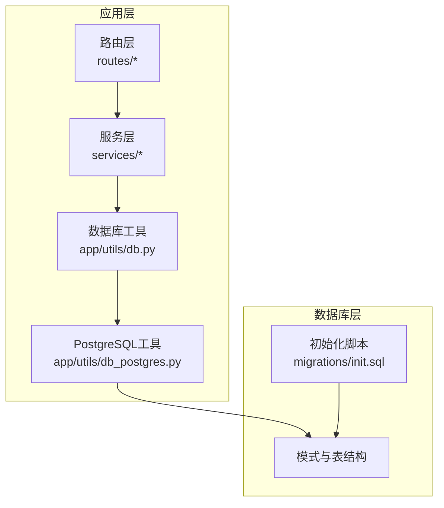
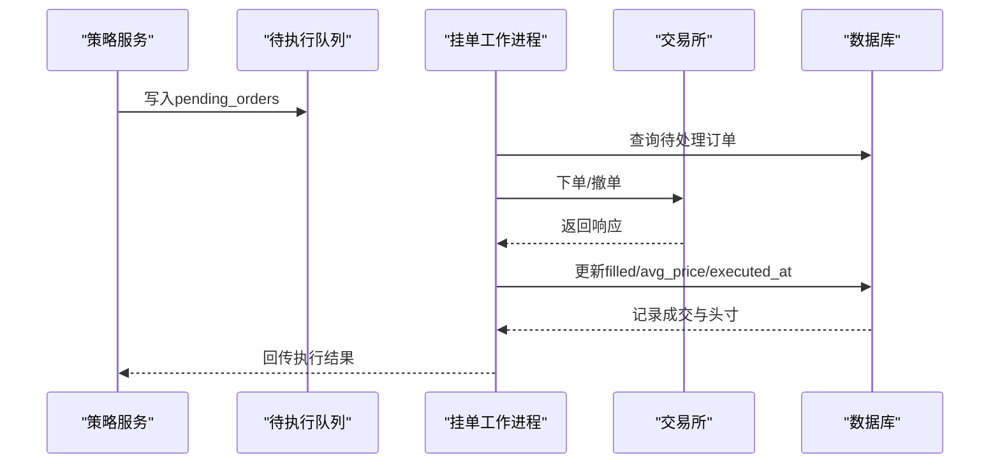
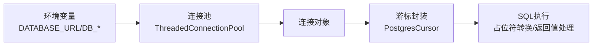

# 数据库设计

<cite>
**本文引用的文件**
- [init.sql](file://backend_api_python/migrations/init.sql)
- [db_postgres.py](file://backend_api_python/app/utils/db_postgres.py)
- [db.py](file://backend_api_python/app/utils/db.py)
- [user_service.py](file://backend_api_python/app/services/user_service.py)
- [security_service.py](file://backend_api_python/app/services/security_service.py)
- [market_symbols_seed.py](file://backend_api_python/app/data/market_symbols_seed.py)
- [strategy.py](file://backend_api_python/app/services/strategy.py)
- [pending_order_worker.py](file://backend_api_python/app/services/pending_order_worker.py)
- [backtest.py](file://backend_api_python/app/services/backtest.py)
- [user.py](file://backend_api_python/app/routes/user.py)
- [strategy.py](file://backend_api_python/app/routes/strategy.py)
- [database.py](file://backend_api_python/app/config/database.py)
</cite>

## 目录
1. [简介](#简介)
2. [项目结构](#项目结构)
3. [核心组件](#核心组件)
4. [架构总览](#架构总览)
5. [详细组件分析](#详细组件分析)
6. [依赖分析](#依赖分析)
7. [性能考虑](#性能考虑)
8. [故障排查指南](#故障排查指南)
9. [结论](#结论)
10. [附录](#附录)

## 简介
本文件系统化梳理 QuantDinger 的 PostgreSQL 数据库设计与实现，覆盖模式结构、表关系、字段与数据类型、索引与查询优化、数据完整性与业务规则、数据生命周期与安全隐私等方面。文档以“用户与权限”、“策略与交易”、“位置与订单”为主线，结合实际迁移脚本与服务层代码，给出可操作的架构图、流程图与最佳实践建议。

## 项目结构
- 数据库初始化脚本位于 migrations/init.sql，负责创建所有核心表及种子数据。
- 应用侧通过统一的数据库工具模块 app/utils/db.py 提供 PostgreSQL 连接封装，底层由 app/utils/db_postgres.py 实现连接池、占位符兼容与事务管理。
- 业务服务层（如用户、安全、策略、回测、挂单执行）围绕这些表进行读写，遵循外键与唯一性约束，确保数据一致性。



**图表来源**
- [db.py:19-31](file://backend_api_python/app/utils/db.py#L19-L31)
- [db_postgres.py:107-162](file://backend_api_python/app/utils/db_postgres.py#L107-L162)
- [init.sql:1-50](file://backend_api_python/migrations/init.sql#L1-L50)

**章节来源**
- [db.py:1-66](file://backend_api_python/app/utils/db.py#L1-L66)
- [db_postgres.py:1-120](file://backend_api_python/app/utils/db_postgres.py#L1-L120)
- [init.sql:1-120](file://backend_api_python/migrations/init.sql#L1-L120)

## 核心组件
- 用户与认证：qd_users、qd_credits_log、qd_membership_orders、qd_usdt_orders、qd_oauth_states、qd_verification_codes、qd_login_attempts、qd_oauth_links、qd_security_logs。
- 策略与交易：qd_strategies_trading、qd_strategy_positions、qd_strategy_trades、pending_orders、qd_strategy_notifications、qd_strategy_logs。
- 指标与监控：qd_indicator_codes、qd_watchlist、qd_analysis_tasks、qd_backtest_runs、qd_backtest_trades、qd_backtest_equity_points。
- 交易所凭证与手动持仓：qd_exchange_credentials、qd_manual_positions、qd_position_alerts、qd_position_monitors。
- 市场符号：qd_market_symbols（含种子数据）。
- AI 分析记忆：qd_analysis_memory。

上述表均在初始化脚本中定义，并配有必要的索引与约束，支撑高并发下的读写与审计需求。

**章节来源**
- [init.sql:8-803](file://backend_api_python/migrations/init.sql#L8-L803)

## 架构总览
下图展示核心数据模型之间的关系与约束，突出用户、策略、位置、订单、交易与审计链路。

```mermaid
erDiagram
QD_USERS {
int id PK
varchar username UK
varchar email UK
varchar role
varchar status
decimal credits
timestamp created_at
timestamp updated_at
}
QD_CREDITS_LOG {
int id PK
int user_id FK
varchar action
decimal amount
decimal balance_after
varchar feature
varchar reference_id
timestamp created_at
}
QD_MEMBERSHIP_ORDERS {
int id PK
int user_id FK
varchar plan
decimal price_usd
varchar status
timestamp created_at
timestamp paid_at
}
QD_USDT_ORDERS {
int id PK
int user_id FK
varchar plan
varchar chain
decimal amount_usdt
int address_index
varchar address UK
varchar status
varchar tx_hash
timestamp paid_at
timestamp confirmed_at
timestamp expires_at
timestamp created_at
timestamp updated_at
}
QD_OAUTH_STATES {
varchar state PK
varchar provider
text redirect
timestamp created_at
timestamp expires_at
}
QD_VERIFICATION_CODES {
int id PK
varchar email
varchar code
varchar type
timestamp expires_at
timestamp used_at
varchar ip_address
int attempts
timestamp last_attempt_at
timestamp created_at
}
QD_LOGIN_ATTEMPTS {
int id PK
varchar identifier
varchar identifier_type
timestamp attempt_time
bool success
varchar ip_address
text user_agent
}
QD_OAUTH_LINKS {
int id PK
int user_id FK
varchar provider
varchar provider_user_id
varchar provider_email
varchar provider_name
varchar provider_avatar
text access_token
text refresh_token
timestamp created_at
timestamp updated_at
}
QD_SECURITY_LOGS {
int id PK
int user_id
varchar action
varchar ip_address
text user_agent
text details
timestamp created_at
}
QD_STRATEGIES_TRADING {
int id PK
int user_id FK
varchar strategy_name
varchar strategy_type
varchar market_category
varchar execution_mode
varchar status
varchar symbol
varchar timeframe
decimal initial_capital
int leverage
varchar market_type
text exchange_config
text indicator_config
text trading_config
text ai_model_config
int decide_interval
varchar strategy_group_id
varchar group_base_name
varchar strategy_mode
text strategy_code
timestamp created_at
timestamp updated_at
}
QD_STRATEGY_POSITIONS {
int id PK
int user_id FK
int strategy_id FK
varchar symbol
varchar side
decimal size
decimal entry_price
decimal current_price
decimal highest_price
decimal lowest_price
decimal unrealized_pnl
decimal pnl_percent
decimal equity
timestamp updated_at
unique(strategy_id, symbol, side)
}
QD_STRATEGY_TRADES {
int id PK
int user_id FK
int strategy_id FK
varchar symbol
varchar type
decimal price
decimal amount
decimal value
decimal commission
varchar commission_ccy
decimal profit
timestamp created_at
}
PENDING_ORDERS {
int id PK
int user_id FK
int strategy_id FK
varchar symbol
varchar signal_type
bigint signal_ts
varchar market_type
varchar order_type
decimal amount
decimal price
varchar execution_mode
varchar status
int priority
int attempts
int max_attempts
text last_error
text payload_json
text dispatch_note
varchar exchange_id
varchar exchange_order_id
text exchange_response_json
decimal filled
decimal avg_price
timestamp executed_at
timestamp created_at
timestamp updated_at
timestamp processed_at
timestamp sent_at
}
QD_STRATEGY_NOTIFICATIONS {
int id PK
int user_id FK
int strategy_id FK
varchar symbol
varchar signal_type
varchar channels
varchar title
text message
text payload_json
int is_read
timestamp created_at
}
QD_STRATEGY_LOGS {
int id PK
int strategy_id FK
varchar level
text message
timestamp timestamp
}
QD_INDICATOR_CODES {
int id PK
int user_id FK
int is_buy
int end_time
varchar name
text code
text description
int publish_to_community
varchar pricing_type
decimal price
int is_encrypted
varchar preview_image
bool vip_free
int createtime
int updatetime
timestamp created_at
timestamp updated_at
int purchase_count
decimal avg_rating
int rating_count
int view_count
varchar review_status
text review_note
timestamp reviewed_at
int reviewed_by
int source_indicator_id
}
QD_WATCHLIST {
int id PK
int user_id FK
varchar market
varchar symbol
varchar name
timestamp created_at
timestamp updated_at
unique(user_id, market, symbol)
}
QD_ANALYSIS_TASKS {
int id PK
int user_id FK
varchar market
varchar symbol
varchar model
varchar language
varchar status
text result_json
text error_message
timestamp created_at
timestamp completed_at
}
QD_BACKTEST_RUNS {
int id PK
int user_id FK
int indicator_id
int strategy_id
varchar strategy_name
varchar run_type
varchar market
varchar symbol
varchar timeframe
varchar start_date
varchar end_date
decimal initial_capital
decimal commission
decimal slippage
int leverage
varchar trade_direction
text strategy_config
text config_snapshot
varchar engine_version
varchar code_hash
varchar status
text error_message
text result_json
timestamp created_at
}
QD_BACKTEST_TRADES {
int id PK
int run_id FK
int user_id FK
int strategy_id
int trade_index
varchar trade_time
varchar trade_type
varchar side
double price
double amount
double profit
double balance
varchar reason
text payload_json
timestamp created_at
}
QD_BACKTEST_EQUITY_POINTS {
int id PK
int run_id FK
int point_index
varchar point_time
double point_value
timestamp created_at
}
QD_EXCHANGE_CREDENTIALS {
int id PK
int user_id FK
varchar name
varchar exchange_id
varchar api_key_hint
text encrypted_config
timestamp created_at
timestamp updated_at
}
QD_MANUAL_POSITIONS {
int id PK
int user_id FK
varchar market
varchar symbol
varchar name
varchar side
decimal quantity
decimal entry_price
int entry_time
text notes
text tags
varchar group_name
timestamp created_at
timestamp updated_at
unique(user_id, market, symbol, side, group_name)
}
QD_POSITION_ALERTS {
int id PK
int user_id FK
int position_id
varchar market
varchar symbol
varchar alert_type
decimal threshold
text notification_config
int is_active
int is_triggered
timestamp last_triggered_at
int trigger_count
int repeat_interval
text notes
timestamp created_at
timestamp updated_at
}
QD_POSITION_MONITORS {
int id PK
int user_id FK
varchar name
text position_ids
varchar monitor_type
text config
text notification_config
int is_active
timestamp last_run_at
timestamp next_run_at
text last_result
int run_count
timestamp created_at
timestamp updated_at
}
QD_MARKET_SYMBOLS {
int id PK
varchar market
varchar symbol
varchar name
varchar exchange
varchar currency
int is_active
int is_hot
int sort_order
timestamp created_at
unique(market, symbol)
}
QD_ANALYSIS_MEMORY {
int id PK
int user_id
varchar market
varchar symbol
varchar decision
int confidence
decimal price_at_analysis
text summary
jsonb reasons
jsonb scores
jsonb indicators_snapshot
jsonb raw_result
decimal consensus_score
decimal consensus_abs
decimal agreement_ratio
decimal quality_multiplier
timestamp created_at
timestamp validated_at
varchar actual_outcome
decimal actual_return_pct
bool was_correct
varchar user_feedback
timestamp feedback_at
}
QD_USERS ||--o{ QD_CREDITS_LOG : "拥有"
QD_USERS ||--o{ QD_MEMBERSHIP_ORDERS : "拥有"
QD_USERS ||--o{ QD_USDT_ORDERS : "拥有"
QD_USERS ||--o{ QD_OAUTH_LINKS : "拥有"
QD_USERS ||--o{ QD_STRATEGIES_TRADING : "拥有"
QD_USERS ||--o{ QD_STRATEGY_POSITIONS : "拥有"
QD_USERS ||--o{ QD_STRATEGY_TRADES : "拥有"
QD_USERS ||--o{ QD_WATCHLIST : "拥有"
QD_USERS ||--o{ QD_ANALYSIS_TASKS : "拥有"
QD_USERS ||--o{ QD_EXCHANGE_CREDENTIALS : "拥有"
QD_USERS ||--o{ QD_MANUAL_POSITIONS : "拥有"
QD_USERS ||--o{ QD_POSITION_ALERTS : "拥有"
QD_USERS ||--o{ QD_POSITION_MONITORS : "拥有"
QD_USERS ||--o{ QD_SECURITY_LOGS : "产生"
QD_STRATEGIES_TRADING ||--o{ QD_STRATEGY_POSITIONS : "包含"
QD_STRATEGIES_TRADING ||--o{ QD_STRATEGY_TRADES : "生成"
QD_STRATEGIES_TRADING ||--o{ PENDING_ORDERS : "驱动"
QD_STRATEGIES_TRADING ||--o{ QD_STRATEGY_NOTIFICATIONS : "触发"
QD_STRATEGIES_TRADING ||--o{ QD_STRATEGY_LOGS : "记录"
QD_INDICATOR_CODES ||--o{ QD_WATCHLIST : "被购买/收藏"
QD_MARKET_SYMBOLS ||--|| QD_STRATEGIES_TRADING : "约束symbol"
QD_MARKET_SYMBOLS ||--|| QD_STRATEGY_POSITIONS : "约束symbol"
QD_MARKET_SYMBOLS ||--|| QD_STRATEGY_TRADES : "约束symbol"
QD_MARKET_SYMBOLS ||--|| QD_ANALYSIS_TASKS : "约束symbol"
```

**图表来源**
- [init.sql:8-803](file://backend_api_python/migrations/init.sql#L8-L803)

## 详细组件分析

### 用户与权限模型
- 表结构要点
  - qd_users：用户名、邮箱唯一；角色与状态枚举；积分、VIP 有效期与套餐；时区、通知配置、图表模板等。
  - qd_credits_log：积分变动流水，支持充值、消费、退款、管理员调整、VIP 赠送等动作，带特征与引用标识。
  - qd_membership_orders：会员订单（Mock 支付），记录套餐、金额、状态与支付时间。
  - qd_usdt_orders：USDT 收款订单，每单独立链与地址，支持状态机与过期控制。
  - qd_oauth_states、qd_verification_codes、qd_login_attempts、qd_oauth_links、qd_security_logs：支撑多因子登录、防爆破、OAuth 关联与审计。
- 约束与索引
  - 唯一性：username、email、(provider, provider_user_id)、(chain, address)、(user_id, market, symbol)。
  - 索引：按 user_id、action、expires_at、status 等高频过滤字段建立索引。
- 业务规则
  - 密码哈希采用 bcrypt（若可用），否则降级为 sha256+盐。
  - 角色权限映射，管理员可重置用户密码并校验长度。
  - 审计日志记录登录、注册、重置密码等关键事件，详情以 JSON 存储。
- 示例数据
  - 初始管理员账户由应用启动时自动创建（基于环境变量）。
  - 种子数据包含热门市场与符号清单。

**章节来源**
- [init.sql:8-190](file://backend_api_python/migrations/init.sql#L8-L190)
- [user_service.py:56-100](file://backend_api_python/app/services/user_service.py#L56-L100)
- [user_service.py:345-410](file://backend_api_python/app/services/user_service.py#L345-L410)
- [security_service.py:246-275](file://backend_api_python/app/services/security_service.py#L246-L275)
- [user.py:233-290](file://backend_api_python/app/routes/user.py#L233-L290)

### 策略与交易模型
- 表结构要点
  - qd_strategies_trading：策略元数据（名称、类型、市场类别、执行模式、状态、参数、代码等），支持脚本型策略扩展。
  - qd_strategy_positions：策略内按 symbol+side 唯一的未平仓头寸，记录入场价、当前价、最高/最低、未实现盈亏、权益等。
  - qd_strategy_trades：策略产生的成交明细，记录价格、数量、价值、手续费、利润等。
  - pending_orders：待执行队列，承载信号、优先级、尝试次数、错误信息、交易所对接字段等。
  - qd_strategy_notifications、qd_strategy_logs：通知与运行日志。
- 约束与索引
  - positions 唯一性约束：(strategy_id, symbol, side)。
  - 索引：按 user_id、strategy_id、status、created_at 等维度建立。
- 业务规则
  - 执行器根据策略配置与信号生成订单，进入 pending_orders 队列；后续由挂单工作进程拉取并执行，再回写成交与头寸。
  - 回测引擎读取历史 K 线，按策略信号模拟开平仓，生成回测交易与净值曲线。
- 示例数据
  - 初始化脚本包含大量市场符号种子数据，便于策略回测与实时交易。

**章节来源**
- [init.sql:195-525](file://backend_api_python/migrations/init.sql#L195-L525)
- [strategy.py:14-57](file://backend_api_python/app/services/strategy.py#L14-L57)
- [pending_order_worker.py:1279-1303](file://backend_api_python/app/services/pending_order_worker.py#L1279-L1303)
- [backtest.py:2602-2627](file://backend_api_python/app/services/backtest.py#L2602-L2627)

### 位置与订单模型
- 表结构要点
  - qd_strategy_positions：按策略+标的+方向聚合的头寸，支持跨时段动态更新。
  - qd_strategy_trades：逐笔成交，支持手续费币种分离。
  - pending_orders：信号驱动的订单队列，支持优先级、重试上限、交易所响应存储。
- 流程图（挂单执行）


**图表来源**
- [init.sql:309-338](file://backend_api_python/migrations/init.sql#L309-L338)
- [pending_order_worker.py:1279-1303](file://backend_api_python/app/services/pending_order_worker.py#L1279-L1303)

**章节来源**
- [init.sql:261-338](file://backend_api_python/migrations/init.sql#L261-L338)
- [pending_order_worker.py:1279-1303](file://backend_api_python/app/services/pending_order_worker.py#L1279-L1303)

### 指标与监控模型
- 表结构要点
  - qd_indicator_codes：指标代码与社区化能力，支持定价、评分、购买统计、审核状态等。
  - qd_watchlist：用户自选清单，唯一约束保障去重。
  - qd_analysis_tasks：AI 快速分析任务，支持语言与状态跟踪。
  - qd_backtest_runs、qd_backtest_trades、qd_backtest_equity_points：回测运行、交易与净值点。
- 约束与索引
  - 指标代码表对 source_indicator_id 建有索引，便于同步与关联。
  - 回测表按 run_type、user_id、strategy_id 等建立索引。

**章节来源**
- [init.sql:385-525](file://backend_api_python/migrations/init.sql#L385-L525)

### 市场符号与种子数据
- qd_market_symbols：市场符号清单，包含交易所、货币、热度排序等，ON CONFLICT DO NOTHING 保证幂等。
- 种子数据覆盖 Crypto、USStock、Forex、Futures、CNStock、HKStock 等主要市场，便于策略开发与演示。

**章节来源**
- [init.sql:618-772](file://backend_api_python/migrations/init.sql#L618-L772)
- [market_symbols_seed.py:26-192](file://backend_api_python/app/data/market_symbols_seed.py#L26-L192)

### AI 分析记忆
- qd_analysis_memory：存储 AI 分析结果、共识分数、一致性比率、质量系数、用户反馈与实际回报等，支持历史回放与学习。

**章节来源**
- [init.sql:774-803](file://backend_api_python/migrations/init.sql#L774-L803)

## 依赖分析
- 连接池与占位符兼容
  - 通过 app/utils/db_postgres.py 创建线程安全连接池，支持健康检查与超时等待；SQL 占位符从 ? 自动转换为 %s，INSERT 无 RETURNING 时通过 SAVEPOINT 与回滚保障兼容性。
- 环境变量与配置
  - DATABASE_URL 解析与连接参数；连接池最小/最大连接数、获取超时、健康检查开关均可通过环境变量调节。
- 服务层依赖
  - 用户服务、安全服务、策略服务、回测服务等均通过统一的 get_db_connection 获取连接，确保一致的事务与错误处理。



**图表来源**
- [db_postgres.py:59-162](file://backend_api_python/app/utils/db_postgres.py#L59-L162)
- [database.py:5-36](file://backend_api_python/app/config/database.py#L5-L36)

**章节来源**
- [db_postgres.py:53-162](file://backend_api_python/app/utils/db_postgres.py#L53-L162)
- [database.py:49-81](file://backend_api_python/app/config/database.py#L49-L81)

## 性能考虑
- 连接池与并发
  - 通过 DB_POOL_MIN、DB_POOL_MAX、DB_POOL_ACQUIRE_TIMEOUT、DB_POOL_HEALTH_CHECK 控制连接池行为，避免瞬时高并发导致的连接耗尽。
- 索引策略
  - 高频过滤字段（user_id、strategy_id、status、action、expires_at、created_at 等）均建立索引，显著降低查询成本。
  - 复合索引（如 watchlist 的 (user_id, market, symbol)、positions 的 (strategy_id, symbol, side)）提升关联查询效率。
- 查询优化建议
  - 使用 EXPLAIN/ANALYZE 分析慢查询，优先利用现有索引；对大表扫描场景考虑分区或物化视图。
  - 将复杂聚合（如总收益、交易数、持仓数）通过预计算字段或汇总表维护，减少在线查询压力。
- 缓存策略
  - Redis 缓存用于热点数据（如K线、分析结果、价格），TTL 针对不同粒度（1m/5m/1H/1D）设置，降低数据库压力。

**章节来源**
- [db_postgres.py:53-56](file://backend_api_python/app/utils/db_postgres.py#L53-L56)
- [database.py:62-84](file://backend_api_python/app/config/database.py#L62-L84)

## 故障排查指南
- 连接问题
  - 检查 DATABASE_URL 格式与可达性；确认连接池参数合理；查看健康检查日志。
- 事务与回滚
  - 发生 OperationalError/InterfaceError 时自动丢弃坏连接；确保 finally 分支正确归还连接。
- 登录与验证码
  - 验证码过期与暴力破解防护：verification_codes 与 login_attempts 表配合使用；定期清理过期记录。
- 审计与合规
  - security_logs 记录关键事件；必要时导出审计数据满足合规要求。

**章节来源**
- [db_postgres.py:418-438](file://backend_api_python/app/utils/db_postgres.py#L418-L438)
- [security_service.py:362-372](file://backend_api_python/app/services/security_service.py#L362-L372)

## 结论
QuantDinger 的数据库设计以 PostgreSQL 为核心，围绕“用户—策略—交易—审计”的主干构建了清晰的表结构与索引体系。通过连接池、占位符兼容与统一工具层，兼顾了高并发与易维护性。建议持续关注查询性能、索引维护与缓存命中率，并完善数据生命周期管理与归档策略，以支撑业务长期演进。

## 附录
- 字段与数据类型概览（节选）
  - 数值：DECIMAL(p,s) 用于资金与价格，DOUBLE PRECISION 用于回测中间值。
  - 文本：VARCHAR/TEXT/JSONB 用于配置、描述与分析结果。
  - 时间戳：TIMESTAMP 用于创建/更新/过期/执行等关键节点。
- 索引清单（节选）
  - qd_credits_log：user_id、action、created_at
  - qd_usdt_orders：user_id、status、(chain,address)
  - qd_strategy_positions：user_id、strategy_id
  - qd_strategy_trades：user_id、strategy_id、created_at
  - qd_analysis_memory：user_id、market、symbol、decision
- 数据生命周期与归档
  - 建议对历史回测交易与净值点按时间分区归档；对审计日志与登录尝试定期清理至冷存储。
- 安全与隐私
  - 用户凭据与第三方令牌加密存储；敏感字段脱敏显示；审计日志保留期限符合法规要求。