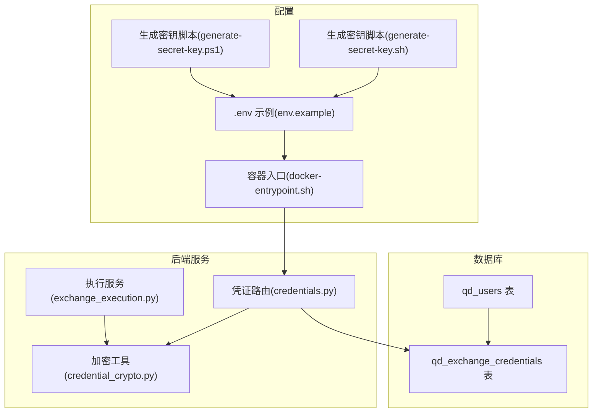
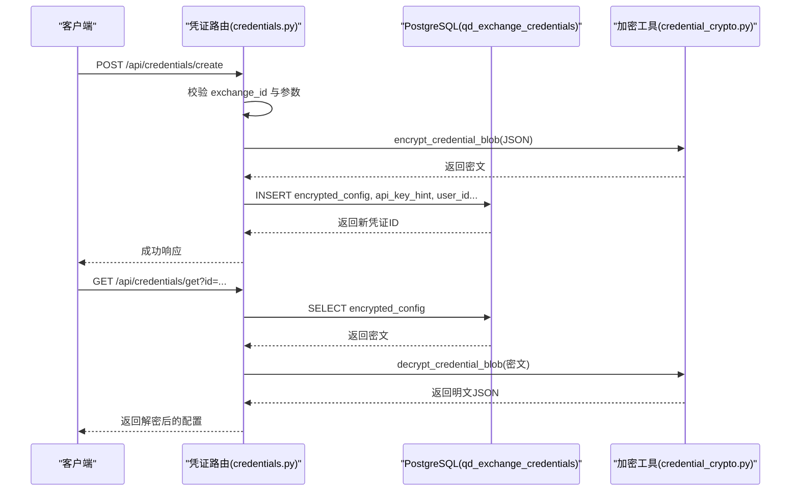
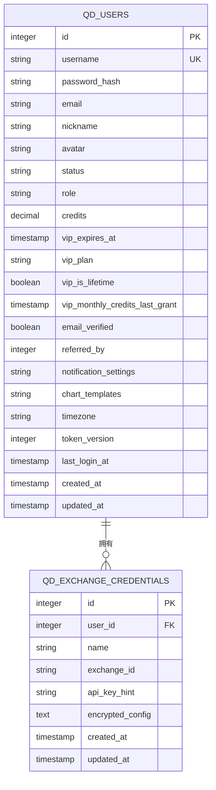
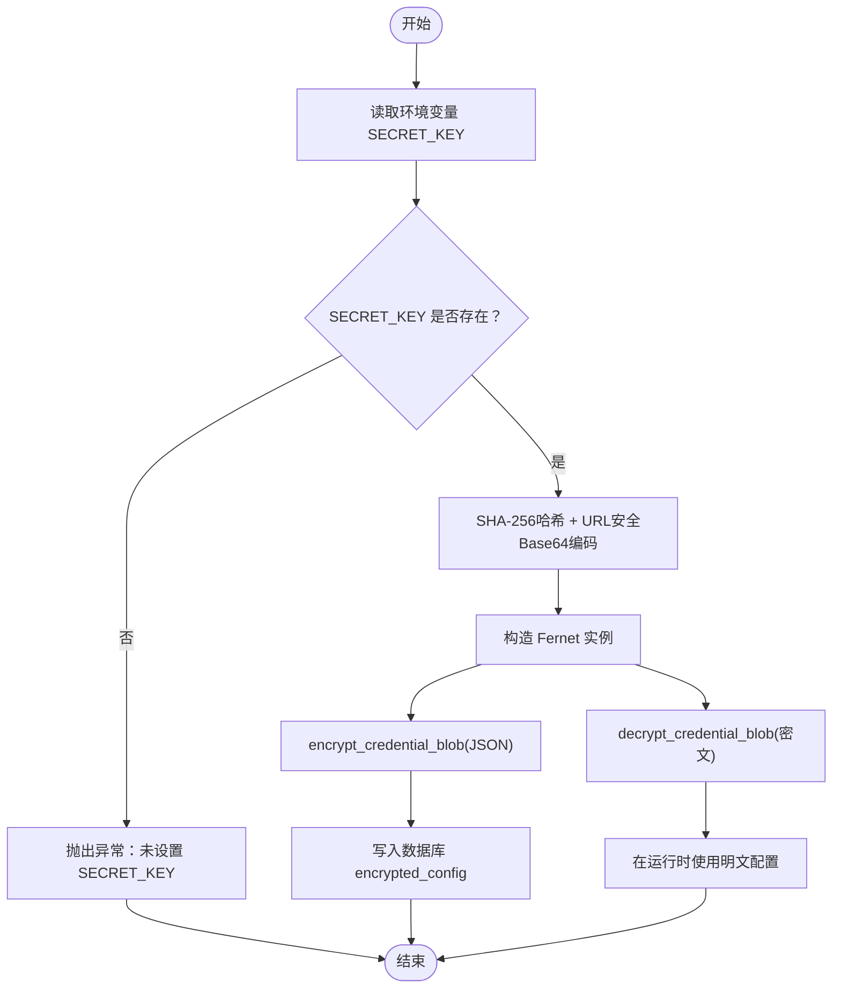
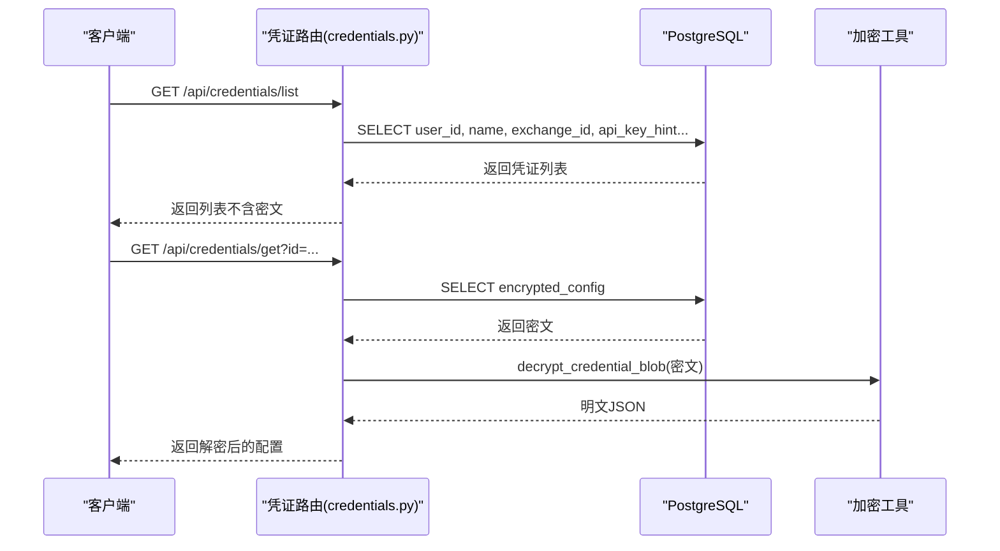
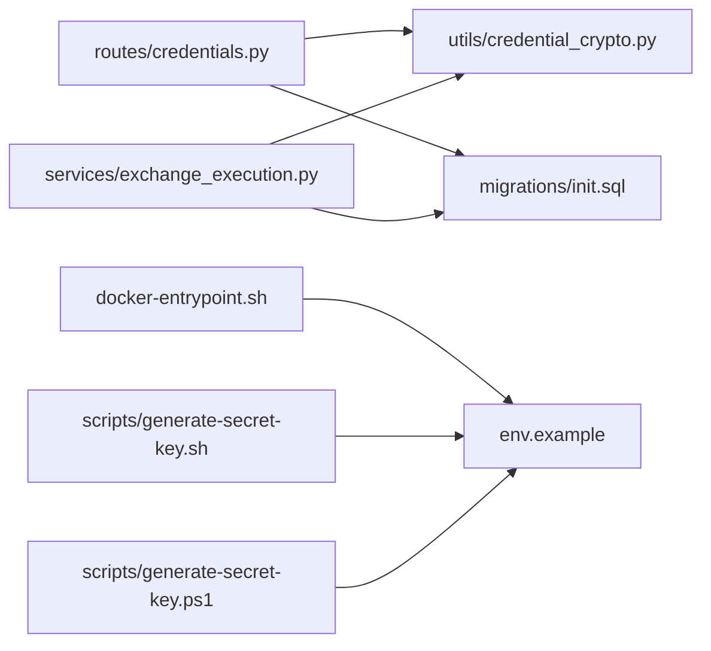

# 交易所凭证模型

<cite>
**本文引用的文件**
- [init.sql](file://backend_api_python/migrations/init.sql)
- [credentials.py](file://backend_api_python/app/routes/credentials.py)
- [credential_crypto.py](file://backend_api_python/app/utils/credential_crypto.py)
- [exchange_execution.py](file://backend_api_python/app/services/exchange_execution.py)
- [env.example](file://backend_api_python/env.example)
- [docker-entrypoint.sh](file://backend_api_python/docker-entrypoint.sh)
- [generate-secret-key.sh](file://scripts/generate-secret-key.sh)
- [generate-secret-key.ps1](file://scripts/generate-secret-key.ps1)
</cite>

## 目录
1. [简介](#简介)
2. [项目结构](#项目结构)
3. [核心组件](#核心组件)
4. [架构总览](#架构总览)
5. [详细组件分析](#详细组件分析)
6. [依赖关系分析](#依赖关系分析)
7. [性能考量](#性能考量)
8. [故障排查指南](#故障排查指南)
9. [结论](#结论)
10. [附录](#附录)

## 简介
本文件系统化阐述交易所凭证数据模型与实现，围绕 qd_exchange_credentials 表的凭证管理架构展开，重点覆盖：
- 权限控制：user_id 外键关联 qd_users 的用户隔离
- 标识与命名：exchange_id 字段标识交易所类型；name 字段支持用户自定义名称
- 安全存储：encrypted_config 字段采用对称加密（Fernet）存储凭证内容
- 脱敏展示：api_key_hint 字段提供 API Key 的安全脱敏显示
- 生命周期：从创建、读取、到删除的完整流程
- 多用户隔离：基于数据库外键约束与路由层鉴权的强隔离
- 最佳实践：密钥管理、备份恢复、合规性与安全配置建议

## 项目结构
与凭证模型直接相关的核心文件与职责如下：
- 数据库迁移脚本：定义 qd_exchange_credentials 表结构、索引与外键
- 凭证路由模块：提供凭证实例的创建、查询、列表与删除接口
- 加密工具模块：封装 Fernet 对称加密/解密逻辑，基于 SECRET_KEY
- 执行服务模块：在运行时解析并加载凭证，进行安全日志脱敏
- 环境配置：提供 SECRET_KEY 的生成与校验脚本及默认示例

**图示来源**
- [init.sql:531-542](file://backend_api_python/migrations/init.sql#L531-L542)
- [credentials.py:1-303](file://backend_api_python/app/routes/credentials.py#L1-L303)
- [credential_crypto.py:1-50](file://backend_api_python/app/utils/credential_crypto.py#L1-L50)
- [exchange_execution.py:1-150](file://backend_api_python/app/services/exchange_execution.py#L1-L150)
- [env.example:12-13](file://backend_api_python/env.example#L12-L13)
- [docker-entrypoint.sh:1-48](file://backend_api_python/docker-entrypoint.sh#L1-L48)
- [generate-secret-key.sh:1-33](file://scripts/generate-secret-key.sh#L1-L33)
- [generate-secret-key.ps1:1-31](file://scripts/generate-secret-key.ps1#L1-L31)

**章节来源**
- [init.sql:531-542](file://backend_api_python/migrations/init.sql#L531-L542)
- [credentials.py:1-303](file://backend_api_python/app/routes/credentials.py#L1-L303)
- [credential_crypto.py:1-50](file://backend_api_python/app/utils/credential_crypto.py#L1-L50)
- [exchange_execution.py:1-150](file://backend_api_python/app/services/exchange_execution.py#L1-L150)
- [env.example:12-13](file://backend_api_python/env.example#L12-L13)
- [docker-entrypoint.sh:1-48](file://backend_api_python/docker-entrypoint.sh#L1-L48)
- [generate-secret-key.sh:1-33](file://scripts/generate-secret-key.sh#L1-L33)
- [generate-secret-key.ps1:1-31](file://scripts/generate-secret-key.ps1#L1-L31)

## 核心组件
- qd_exchange_credentials 表：存储用户凭证，包含 user_id 外键、exchange_id 标识、name 自定义名、api_key_hint 脱敏提示、encrypted_config 加密存储、时间戳等
- 凭证路由(credentials.py)：提供凭证实例的创建、查询、列表与删除接口，并在创建时计算 api_key_hint
- 加密工具(credential_crypto.py)：基于 SECRET_KEY 生成 Fernet 密钥，实现对 JSON 文本的加密与解密
- 执行服务(exchange_execution.py)：在运行时按需加载凭证，进行安全日志脱敏与合并策略
- 环境与脚本：提供 SECRET_KEY 的生成、校验与自动注入流程

**章节来源**
- [init.sql:531-542](file://backend_api_python/migrations/init.sql#L531-L542)
- [credentials.py:137-223](file://backend_api_python/app/routes/credentials.py#L137-L223)
- [credential_crypto.py:17-49](file://backend_api_python/app/utils/credential_crypto.py#L17-L49)
- [exchange_execution.py:95-147](file://backend_api_python/app/services/exchange_execution.py#L95-L147)
- [env.example:12-13](file://backend_api_python/env.example#L12-L13)
- [docker-entrypoint.sh:25-44](file://backend_api_python/docker-entrypoint.sh#L25-L44)

## 架构总览
凭证管理的整体架构由“数据层”“服务层”“路由层”“配置层”构成，强调强隔离与最小暴露原则。

**图示来源**
- [credentials.py:137-223](file://backend_api_python/app/routes/credentials.py#L137-L223)
- [credential_crypto.py:25-49](file://backend_api_python/app/utils/credential_crypto.py#L25-L49)
- [init.sql:531-542](file://backend_api_python/migrations/init.sql#L531-L542)

## 详细组件分析

### 数据模型：qd_exchange_credentials
- 主键与外键
  - id：主键
  - user_id：外键引用 qd_users(id)，删除级联，确保用户删除时凭证一并清理
- 字段语义
  - name：用户自定义名称，便于识别不同交易所账户
  - exchange_id：交易所标识，如 binance、okx、ibkr、mt5 等
  - api_key_hint：API Key 脱敏提示，仅用于前端展示，不参与解密
  - encrypted_config：凭证 JSON 的 Fernet 密文，仅在服务端解密
  - created_at/updated_at：时间戳
- 索引
  - idx_exchange_credentials_user_id：按 user_id 查询优化

**图示来源**
- [init.sql:8-31](file://backend_api_python/migrations/init.sql#L8-L31)
- [init.sql:531-542](file://backend_api_python/migrations/init.sql#L531-L542)

**章节来源**
- [init.sql:531-542](file://backend_api_python/migrations/init.sql#L531-L542)

### 权限控制与用户隔离
- 外键约束：user_id 引用 qd_users(id)，删除级联，保证用户与凭证的强一致性
- 路由层鉴权：所有凭证操作均要求登录态，且在 SQL 中显式限定 user_id，防止越权访问
- 多用户隔离：每个用户只能看到自己的凭证，不存在跨用户泄露风险

**章节来源**
- [init.sql](file://backend_api_python/migrations/init.sql#L533)
- [credentials.py:54-92](file://backend_api_python/app/routes/credentials.py#L54-L92)
- [credentials.py:226-249](file://backend_api_python/app/routes/credentials.py#L226-L249)
- [credentials.py:252-300](file://backend_api_python/app/routes/credentials.py#L252-L300)

### 加密存储机制与算法选择
- 加密算法：Fernet（对称加密），基于 SECRET_KEY 派生密钥
- 密钥来源：从环境变量 SECRET_KEY 获取，经 SHA-256 哈希与 URL 安全 Base64 编码转换为 Fernet 密钥
- 存储格式：encrypted_config 字段保存密文字符串
- 解密异常：当密钥错误或数据非该密钥加密时抛出异常，便于定位问题

**图示来源**
- [credential_crypto.py:17-49](file://backend_api_python/app/utils/credential_crypto.py#L17-L49)
- [env.example:12-13](file://backend_api_python/env.example#L12-L13)
- [docker-entrypoint.sh:25-44](file://backend_api_python/docker-entrypoint.sh#L25-L44)

**章节来源**
- [credential_crypto.py:1-50](file://backend_api_python/app/utils/credential_crypto.py#L1-L50)
- [env.example:12-13](file://backend_api_python/env.example#L12-L13)
- [docker-entrypoint.sh:25-44](file://backend_api_python/docker-entrypoint.sh#L25-L44)

### 脱敏显示设计：api_key_hint
- 设计目标：在不泄露真实 API Key 的前提下，向用户提供可辨识的提示信息
- 生成规则：对 API Key 进行截断与星号替换，保留前缀与后缀
- 使用场景：列表页展示、前端表单自动填充提示

**章节来源**
- [credentials.py:45-51](file://backend_api_python/app/routes/credentials.py#L45-L51)
- [credentials.py:185-197](file://backend_api_python/app/routes/credentials.py#L185-L197)

### 凭证生命周期管理
- 创建
  - 校验 exchange_id 与必要参数（如加密交易所需 api_key/secret_key）
  - 生成 api_key_hint（加密交易所）
  - 将配置 JSON 序列化后加密，写入数据库
- 读取
  - 通过 id 与 user_id 查询，解密 encrypted_config 得到明文 JSON
- 列表
  - 仅返回当前用户的所有凭证摘要（不含密文）
- 删除
  - 通过 id 与 user_id 删除对应记录

**图示来源**
- [credentials.py:54-92](file://backend_api_python/app/routes/credentials.py#L54-L92)
- [credentials.py:252-300](file://backend_api_python/app/routes/credentials.py#L252-L300)
- [credential_crypto.py:33-49](file://backend_api_python/app/utils/credential_crypto.py#L33-L49)

**章节来源**
- [credentials.py:137-223](file://backend_api_python/app/routes/credentials.py#L137-L223)
- [credentials.py:226-249](file://backend_api_python/app/routes/credentials.py#L226-L249)
- [credentials.py:252-300](file://backend_api_python/app/routes/credentials.py#L252-L300)

### 运行时解析与安全日志
- 解析策略：支持直接内嵌配置与凭证引用两种方式，后者通过 credential_id 加载并合并
- 安全日志：对敏感字段（如 api_key、secret_key、passphrase 等）进行脱敏输出
- 错误处理：解密失败时记录警告并返回空配置，避免影响上层流程

**章节来源**
- [exchange_execution.py:95-147](file://backend_api_python/app/services/exchange_execution.py#L95-L147)
- [exchange_execution.py:49-56](file://backend_api_python/app/services/exchange_execution.py#L49-L56)

### 多用户环境下的凭证隔离机制
- 数据库层面：外键约束与唯一索引确保凭证归属唯一用户
- 服务层面：所有查询/修改均带 user_id 条件，防止越权
- 路由中间件：统一要求登录态，结合 g.user_id 保证上下文一致

**章节来源**
- [init.sql](file://backend_api_python/migrations/init.sql#L533)
- [credentials.py:54-92](file://backend_api_python/app/routes/credentials.py#L54-L92)
- [credentials.py:226-249](file://backend_api_python/app/routes/credentials.py#L226-L249)

## 依赖关系分析
- 凭证路由依赖数据库连接与认证中间件，同时调用加密工具完成加解密
- 执行服务依赖数据库连接与加密工具，负责运行时解析与脱敏
- 环境脚本负责 SECRET_KEY 的生成与注入，保障加密密钥可用性

**图示来源**
- [credentials.py:1-303](file://backend_api_python/app/routes/credentials.py#L1-L303)
- [credential_crypto.py:1-50](file://backend_api_python/app/utils/credential_crypto.py#L1-L50)
- [init.sql:531-542](file://backend_api_python/migrations/init.sql#L531-L542)
- [exchange_execution.py:1-150](file://backend_api_python/app/services/exchange_execution.py#L1-L150)
- [docker-entrypoint.sh:1-48](file://backend_api_python/docker-entrypoint.sh#L1-L48)
- [env.example:12-13](file://backend_api_python/env.example#L12-L13)
- [generate-secret-key.sh:1-33](file://scripts/generate-secret-key.sh#L1-L33)
- [generate-secret-key.ps1:1-31](file://scripts/generate-secret-key.ps1#L1-L31)

**章节来源**
- [credentials.py:1-303](file://backend_api_python/app/routes/credentials.py#L1-L303)
- [credential_crypto.py:1-50](file://backend_api_python/app/utils/credential_crypto.py#L1-L50)
- [init.sql:531-542](file://backend_api_python/migrations/init.sql#L531-L542)
- [exchange_execution.py:1-150](file://backend_api_python/app/services/exchange_execution.py#L1-L150)
- [docker-entrypoint.sh:1-48](file://backend_api_python/docker-entrypoint.sh#L1-L48)
- [env.example:12-13](file://backend_api_python/env.example#L12-L13)
- [generate-secret-key.sh:1-33](file://scripts/generate-secret-key.sh#L1-L33)
- [generate-secret-key.ps1:1-31](file://scripts/generate-secret-key.ps1#L1-L31)

## 性能考量
- 加密/解密成本：Fernet 为轻量对称加密，单次加解密开销极低，适合高频读取场景
- 数据库 IO：凭证列表仅返回摘要字段，避免传输密文，降低网络负载
- 并发与连接池：建议配合数据库连接池与合理的并发策略，避免阻塞
- 日志脱敏：在高并发日志输出中，对敏感字段进行脱敏，避免无意泄露

[本节为通用性能讨论，无需特定文件来源]

## 故障排查指南
- 无法解密
  - 现象：解密时报错，提示密钥不匹配或数据非该密钥加密
  - 排查：确认 SECRET_KEY 是否正确、是否被意外更改或容器重启后未注入
  - 参考：加密工具中的异常抛出位置
- 缺少 SECRET_KEY
  - 现象：启动时报错，提示未设置 SECRET_KEY
  - 排查：检查 .env 文件是否存在、值是否为默认占位符、容器入口脚本是否成功注入
  - 参考：容器入口脚本与环境示例
- 越权访问
  - 现象：查询/删除凭证返回 Not Found 或无权限
  - 排查：确认请求携带的用户上下文与凭证所属 user_id 一致
  - 参考：路由层对 user_id 的严格限定

**章节来源**
- [credential_crypto.py:46-49](file://backend_api_python/app/utils/credential_crypto.py#L46-L49)
- [docker-entrypoint.sh:25-44](file://backend_api_python/docker-entrypoint.sh#L25-L44)
- [env.example:12-13](file://backend_api_python/env.example#L12-L13)
- [credentials.py:252-300](file://backend_api_python/app/routes/credentials.py#L252-L300)

## 结论
qd_exchange_credentials 凭证模型以“外键强隔离 + 对称加密 + 脱敏展示”为核心设计，既满足多用户环境下的安全隔离，又兼顾易用性与可维护性。通过严格的生命周期管理与运行时安全策略，有效降低了 API 密钥泄露风险，为交易系统的稳定运行提供了基础保障。

[本节为总结性内容，无需特定文件来源]

## 附录

### 常见加密库与使用建议
- cryptography.fernet：对称加密，推荐使用
- 建议：在生产环境中使用硬件安全模块(HSM)或密钥管理系统(KMS)管理 SECRET_KEY，避免硬编码于环境文件

[本节为通用建议，无需特定文件来源]

### 安全配置与最佳实践
- 密钥管理
  - 使用专用密钥管理服务或 HSM 生成与轮换 SECRET_KEY
  - 避免在代码仓库中提交密钥
- 备份与恢复
  - 数据库备份应包含 qd_exchange_credentials 表
  - 恢复时需同步恢复 SECRET_KEY，否则无法解密历史凭证
- 合规性
  - 符合数据最小化原则，仅存储必要的 API 凭证
  - 审计日志记录凭证创建、删除与访问事件
- 网络与白名单
  - 交易所 API Key 可配置 IP 白名单，使用路由提供的出口 IP 接口进行核验

**章节来源**
- [credentials.py:114-134](file://backend_api_python/app/routes/credentials.py#L114-L134)
- [docker-entrypoint.sh:25-44](file://backend_api_python/docker-entrypoint.sh#L25-L44)