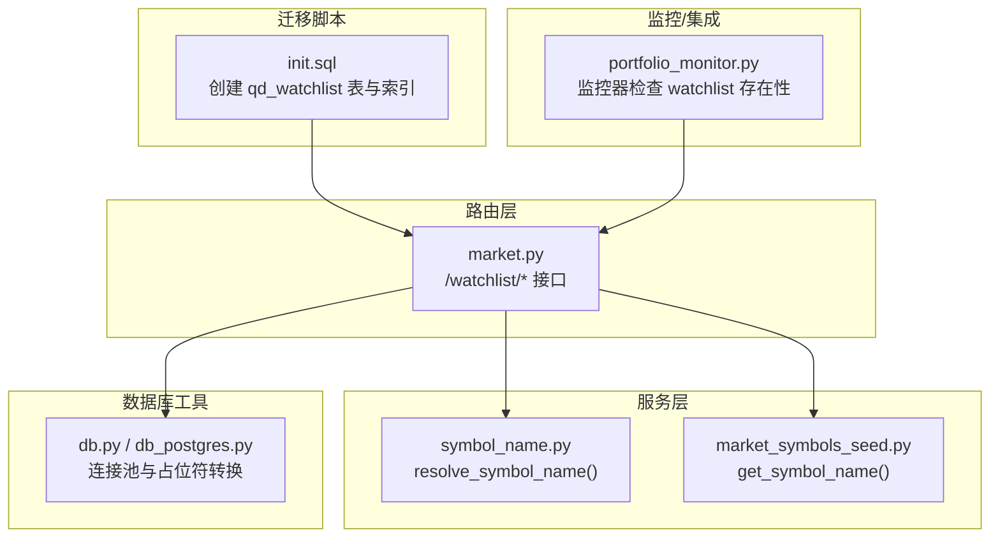
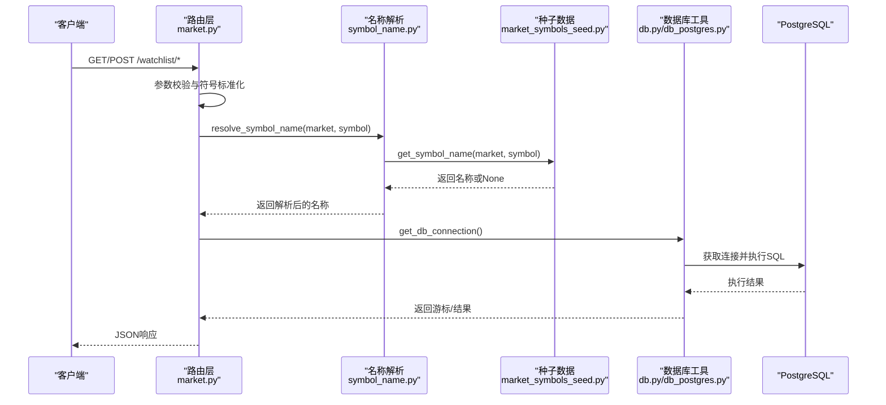
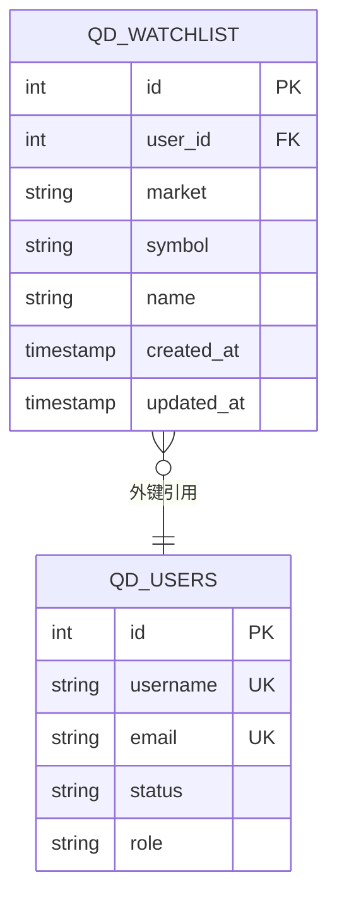
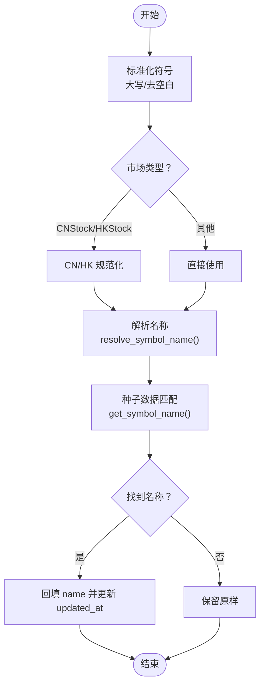
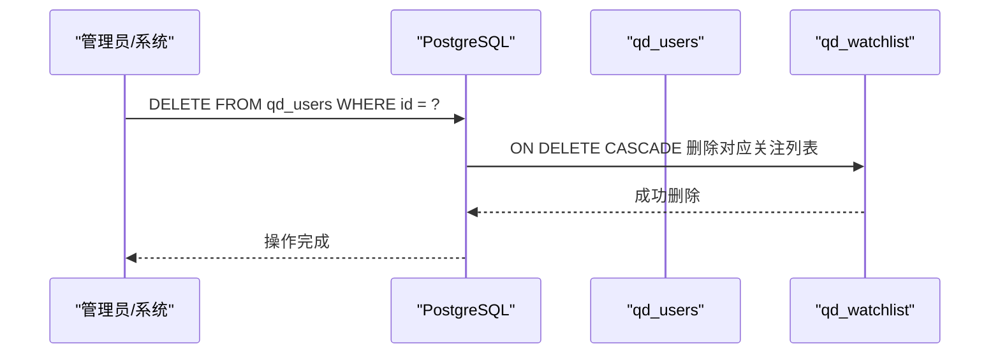
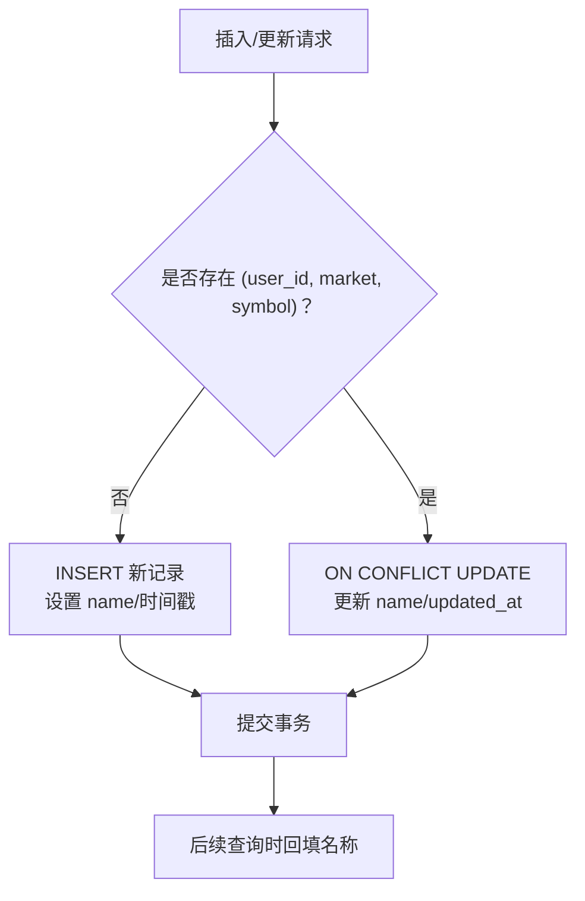
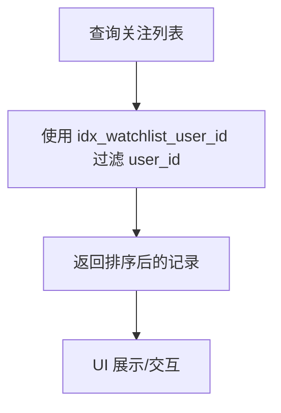
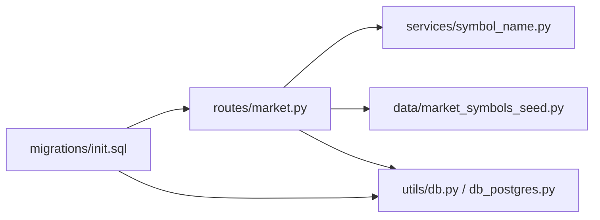

# 关注列表模型

<cite>
**本文引用的文件**
- [init.sql](file://backend_api_python/migrations/init.sql)
- [market.py](file://backend_api_python/app/routes/market.py)
- [symbol_name.py](file://backend_api_python/app/services/symbol_name.py)
- [market_symbols_seed.py](file://backend_api_python/app/data/market_symbols_seed.py)
- [portfolio_monitor.py](file://backend_api_python/app/services/portfolio_monitor.py)
- [db.py](file://backend_api_python/app/utils/db.py)
- [db_postgres.py](file://backend_api_python/app/utils/db_postgres.py)
</cite>

## 目录
1. [简介](#简介)
2. [项目结构](#项目结构)
3. [核心组件](#核心组件)
4. [架构总览](#架构总览)
5. [详细组件分析](#详细组件分析)
6. [依赖关系分析](#依赖关系分析)
7. [性能考量](#性能考量)
8. [故障排查指南](#故障排查指南)
9. [结论](#结论)
10. [附录](#附录)

## 简介
本文件系统化阐述关注列表数据模型的设计与实现，重点覆盖以下方面：
- 表结构与约束：qd_watchlist 的字段定义、外键与级联删除、唯一性约束（user_id, market, symbol）的设计动机与影响。
- 数据结构与标准化：market 字段支持的市场类型、symbol 字段的标准化规则、name 字段的人类可读名称来源与回填策略。
- 索引与查询优化：idx_watchlist_user_id 对查询性能的影响与使用场景。
- 数据同步策略：关注列表与种子数据源的联动、名称解析与持久化流程。
- 增删改查操作示例与最佳实践：基于现有路由与服务层的调用路径与参数约定。

## 项目结构
关注列表相关的核心代码分布在迁移脚本、路由层、服务层与数据库工具模块中：
- 迁移脚本定义表结构、索引与约束。
- 路由层提供关注列表的增删改查接口。
- 服务层负责名称解析与符号标准化。
- 数据库工具层提供连接池与占位符兼容的执行器。

**图示来源**
- [init.sql:427-438](file://backend_api_python/migrations/init.sql#L427-L438)
- [market.py:255-360](file://backend_api_python/app/routes/market.py#L255-L360)
- [symbol_name.py:89-139](file://backend_api_python/app/services/symbol_name.py#L89-L139)
- [market_symbols_seed.py:112-152](file://backend_api_python/app/data/market_symbols_seed.py#L112-L152)
- [portfolio_monitor.py:1293-1312](file://backend_api_python/app/services/portfolio_monitor.py#L1293-L1312)
- [db.py:19-25](file://backend_api_python/app/utils/db.py#L19-L25)
- [db_postgres.py:237-400](file://backend_api_python/app/utils/db_postgres.py#L237-L400)

**章节来源**
- [init.sql:427-438](file://backend_api_python/migrations/init.sql#L427-L438)
- [market.py:255-360](file://backend_api_python/app/routes/market.py#L255-L360)
- [symbol_name.py:89-139](file://backend_api_python/app/services/symbol_name.py#L89-L139)
- [market_symbols_seed.py:112-152](file://backend_api_python/app/data/market_symbols_seed.py#L112-L152)
- [portfolio_monitor.py:1293-1312](file://backend_api_python/app/services/portfolio_monitor.py#L1293-L1312)
- [db.py:19-25](file://backend_api_python/app/utils/db.py#L19-L25)
- [db_postgres.py:237-400](file://backend_api_python/app/utils/db_postgres.py#L237-L400)

## 核心组件
- qd_watchlist 表：存储用户的关注标的，包含 user_id 外键、market 类型、symbol 标准化符号、name 名称、时间戳与唯一性约束。
- 路由接口：提供获取、添加、删除关注列表的 REST 接口。
- 名称解析服务：从种子数据或外部源解析 symbol 的人类可读名称，并回填到 watchlist。
- 数据库工具：统一的 PostgreSQL 连接池与占位符兼容执行器。

**章节来源**
- [init.sql:427-438](file://backend_api_python/migrations/init.sql#L427-L438)
- [market.py:255-360](file://backend_api_python/app/routes/market.py#L255-L360)
- [symbol_name.py:89-139](file://backend_api_python/app/services/symbol_name.py#L89-L139)
- [db.py:19-25](file://backend_api_python/app/utils/db.py#L19-L25)

## 架构总览
关注列表的端到端流程如下：
- 客户端调用路由接口提交请求。
- 路由层进行参数校验与符号标准化。
- 通过服务层解析名称，必要时回填至 watchlist。
- 使用数据库工具执行 SQL，利用唯一性约束实现幂等插入/更新。
- 监控器等业务模块按需查询 watchlist 判断策略有效性。

**图示来源**
- [market.py:255-360](file://backend_api_python/app/routes/market.py#L255-L360)
- [symbol_name.py:89-139](file://backend_api_python/app/services/symbol_name.py#L89-L139)
- [market_symbols_seed.py:112-152](file://backend_api_python/app/data/market_symbols_seed.py#L112-L152)
- [db.py:19-25](file://backend_api_python/app/utils/db.py#L19-L25)
- [db_postgres.py:402-438](file://backend_api_python/app/utils/db_postgres.py#L402-L438)

## 详细组件分析

### 表结构与约束设计
- 主键与字段
  - id：自增主键。
  - user_id：默认值 1，引用 qd_users(id)，ON DELETE CASCADE 实现用户删除时级联删除其关注列表。
  - market：VARCHAR(50)，非空，支持多种市场类型。
  - symbol：VARCHAR(50)，非空，标准化后的符号。
  - name：VARCHAR(100)，默认空字符串，存储人类可读名称。
  - 时间戳：created_at/updated_at，默认当前时间。
- 唯一性约束
  - UNIQUE(user_id, market, symbol)：确保同一用户在同一市场下对同一符号仅有一条记录，天然去重。
- 索引
  - idx_watchlist_user_id(user_id)：加速按用户过滤的关注列表查询。

**图示来源**
- [init.sql:8-31](file://backend_api_python/migrations/init.sql#L8-L31)
- [init.sql:427-438](file://backend_api_python/migrations/init.sql#L427-L438)

**章节来源**
- [init.sql:427-438](file://backend_api_python/migrations/init.sql#L427-L438)

### 市场类型与符号标准化
- 支持的市场类型
  - USStock、CNStock、HKStock、Crypto、Forex、Futures。这些类型在路由层的市场类型接口中明确列出并排序，保证前端一致性。
- 符号标准化
  - 统一采用大写与去除空白的策略；对于 CN/HK 股票，进一步通过数据源工具进行规范化。
- 名称解析与回填
  - 若 watchlist 中 name 为空或与 symbol 相同，则在查询时尝试解析真实名称并回填，保持 UI 一致性。

**图示来源**
- [market.py:46-47](file://backend_api_python/app/routes/market.py#L46-L47)
- [symbol_name.py:29-36](file://backend_api_python/app/services/symbol_name.py#L29-L36)
- [symbol_name.py:89-139](file://backend_api_python/app/services/symbol_name.py#L89-L139)
- [market_symbols_seed.py:112-152](file://backend_api_python/app/data/market_symbols_seed.py#L112-L152)
- [market.py:270-291](file://backend_api_python/app/routes/market.py#L270-L291)

**章节来源**
- [market.py:93-135](file://backend_api_python/app/routes/market.py#L93-L135)
- [symbol_name.py:29-36](file://backend_api_python/app/services/symbol_name.py#L29-L36)
- [symbol_name.py:89-139](file://backend_api_python/app/services/symbol_name.py#L89-L139)
- [market_symbols_seed.py:112-152](file://backend_api_python/app/data/market_symbols_seed.py#L112-L152)
- [market.py:270-291](file://backend_api_python/app/routes/market.py#L270-L291)

### 级联删除机制（user_id 外键）
- 设计要点
  - qd_watchlist.user_id 引用 qd_users(id)，ON DELETE CASCADE。
  - 当用户被删除时，其所有关注列表记录会自动级联删除，无需额外清理逻辑。
- 影响与注意事项
  - 删除用户前无需手动清理 watchlist。
  - 若未来需要保留历史关注数据，应评估是否调整级联策略。

**图示来源**
- [init.sql:429](file://backend_api_python/migrations/init.sql#L429)

**章节来源**
- [init.sql:429](file://backend_api_python/migrations/init.sql#L429)

### 唯一性约束设计原理与数据同步
- 唯一性约束
  - UNIQUE(user_id, market, symbol)：防止重复添加同一用户在相同市场的同一符号。
- 同步策略
  - 插入时使用 UPSERT（ON CONFLICT），若冲突则更新 name 与 updated_at，实现“幂等添加”。
  - 查询时对历史记录进行名称回填，确保 UI 展示一致。
- 数据一致性
  - 唯一性约束 + UPSERT 保证并发场景下的数据一致性与去重。

**图示来源**
- [market.py:317-327](file://backend_api_python/app/routes/market.py#L317-L327)
- [market.py:270-291](file://backend_api_python/app/routes/market.py#L270-L291)
- [init.sql:435](file://backend_api_python/migrations/init.sql#L435)

**章节来源**
- [market.py:317-327](file://backend_api_python/app/routes/market.py#L317-L327)
- [market.py:270-291](file://backend_api_python/app/routes/market.py#L270-L291)
- [init.sql:435](file://backend_api_python/migrations/init.sql#L435)

### 索引设计与查询性能
- idx_watchlist_user_id(user_id)
  - 用途：加速按用户过滤的关注列表查询。
  - 场景：/watchlist/get、/watchlist/add、/watchlist/remove 等均以 user_id 作为过滤条件。
- 性能建议
  - 在高并发场景下，结合连接池与 UPSERT 可降低锁竞争。
  - 若关注列表规模增长，可考虑复合索引或分区策略（视业务需求评估）。

**图示来源**
- [init.sql:438](file://backend_api_python/migrations/init.sql#L438)
- [market.py:264-267](file://backend_api_python/app/routes/market.py#L264-L267)

**章节来源**
- [init.sql:438](file://backend_api_python/migrations/init.sql#L438)
- [market.py:264-267](file://backend_api_python/app/routes/market.py#L264-L267)

### 关注列表在个性化体验中的作用
- 个性化展示
  - 用户可按市场类型筛选与管理关注标的，提升信息密度与决策效率。
- 监控与策略联动
  - 监控器在执行前检查目标符号是否仍在 watchlist 中，不在则跳过，避免无效提醒或交易。
- 数据回填
  - 自动补齐缺失或简化的名称，提升 UI 一致性与可读性。

**章节来源**
- [portfolio_monitor.py:1293-1312](file://backend_api_python/app/services/portfolio_monitor.py#L1293-L1312)
- [market.py:270-291](file://backend_api_python/app/routes/market.py#L270-L291)

### 增删改查操作示例与最佳实践
- 获取关注列表
  - 方法：GET /watchlist/get
  - 参数：无（基于登录态 g.user_id）
  - 行为：按用户过滤，返回 id、market、symbol、name；同时回填历史名称。
- 添加关注
  - 方法：POST /watchlist/add
  - 参数：market、symbol（必填），name（可选，优先使用传入值）
  - 行为：标准化符号，解析名称，UPSERT 写入，幂等。
- 删除关注
  - 方法：POST /watchlist/remove
  - 参数：symbol（必填）
  - 行为：按 user_id 与 symbol 删除，支持模糊匹配（标准化后）。
- 最佳实践
  - 始终先标准化符号再入库，避免大小写与格式差异导致的重复。
  - 优先使用服务层提供的名称解析，确保 UI 一致性。
  - 在高并发场景下，利用 UPSERT 与连接池，避免重复插入与锁竞争。
  - 对于批量导入，建议先解析名称再批量写入，减少回填次数。

**章节来源**
- [market.py:255-360](file://backend_api_python/app/routes/market.py#L255-L360)
- [market.py:46-47](file://backend_api_python/app/routes/market.py#L46-L47)
- [symbol_name.py:89-139](file://backend_api_python/app/services/symbol_name.py#L89-L139)

## 依赖关系分析
- 外键依赖
  - qd_watchlist.user_id -> qd_users(id)，ON DELETE CASCADE。
- 服务依赖
  - 路由层依赖名称解析服务与种子数据服务。
- 数据库依赖
  - 路由层通过数据库工具层获取连接，使用占位符兼容执行器。

**图示来源**
- [market.py:255-360](file://backend_api_python/app/routes/market.py#L255-L360)
- [symbol_name.py:89-139](file://backend_api_python/app/services/symbol_name.py#L89-L139)
- [market_symbols_seed.py:112-152](file://backend_api_python/app/data/market_symbols_seed.py#L112-L152)
- [db.py:19-25](file://backend_api_python/app/utils/db.py#L19-L25)
- [db_postgres.py:237-400](file://backend_api_python/app/utils/db_postgres.py#L237-L400)
- [init.sql:427-438](file://backend_api_python/migrations/init.sql#L427-L438)

**章节来源**
- [market.py:255-360](file://backend_api_python/app/routes/market.py#L255-L360)
- [symbol_name.py:89-139](file://backend_api_python/app/services/symbol_name.py#L89-L139)
- [market_symbols_seed.py:112-152](file://backend_api_python/app/data/market_symbols_seed.py#L112-L152)
- [db.py:19-25](file://backend_api_python/app/utils/db.py#L19-L25)
- [db_postgres.py:237-400](file://backend_api_python/app/utils/db_postgres.py#L237-L400)
- [init.sql:427-438](file://backend_api_python/migrations/init.sql#L427-L438)

## 性能考量
- 连接池与占位符兼容
  - 使用线程安全的连接池，支持超时等待与健康检查，降低连接争用。
  - 占位符转换（? -> %s）与事务提交/回滚确保跨模块兼容性。
- 查询优化
  - idx_watchlist_user_id 提升按用户过滤的查询性能。
  - UPSERT 减少重复插入与锁竞争。
- 并发与幂等
  - 唯一性约束 + UPSERT 实现幂等写入，适合高并发场景。
- 建议
  - 监控连接池利用率与慢查询，必要时调整池大小与索引策略。
  - 对于大规模 watchlist，可考虑按 market 或时间维度分区（视业务需求）。

**章节来源**
- [db_postgres.py:107-161](file://backend_api_python/app/utils/db_postgres.py#L107-L161)
- [db_postgres.py:237-400](file://backend_api_python/app/utils/db_postgres.py#L237-L400)
- [init.sql:438](file://backend_api_python/migrations/init.sql#L438)
- [market.py:317-327](file://backend_api_python/app/routes/market.py#L317-L327)

## 故障排查指南
- 连接问题
  - 确认 DATABASE_URL 环境变量正确，连接池初始化成功。
  - 查看连接池健康检查与超时配置，避免长时间阻塞。
- 唯一性冲突
  - 若出现重复添加，确认是否已使用 UPSERT；检查 user_id 与符号标准化是否一致。
- 名称解析失败
  - 检查名称解析服务的外部 API 配置（如 FINNHUB_API_KEY）与种子数据可用性。
- 监控器跳过
  - 若监控器提示符号已移除，确认 watchlist 中是否存在该记录，或是否被级联删除。

**章节来源**
- [db.py:38-48](file://backend_api_python/app/utils/db.py#L38-L48)
- [db_postgres.py:107-161](file://backend_api_python/app/utils/db_postgres.py#L107-L161)
- [market.py:317-327](file://backend_api_python/app/routes/market.py#L317-L327)
- [portfolio_monitor.py:1293-1312](file://backend_api_python/app/services/portfolio_monitor.py#L1293-L1312)

## 结论
关注列表模型通过清晰的表结构、外键级联、唯一性约束与索引设计，实现了用户个性化体验与高性能查询的平衡。配合名称解析与回填策略，确保了 UI 的一致性与可读性。在高并发场景下，UPSERT 与连接池共同保障了数据一致性与系统稳定性。建议在业务扩展时持续监控性能指标，并根据实际数据规模与访问模式优化索引与分区策略。

## 附录
- 常用 SQL 参考（基于现有实现）
  - 获取关注列表：按 user_id 查询并返回 id、market、symbol、name。
  - 添加关注：UPSERT 写入，冲突时更新 name 与 updated_at。
  - 删除关注：按 user_id 与标准化后的 symbol 删除。
- 市场类型参考
  - USStock、CNStock、HKStock、Crypto、Forex、Futures。

**章节来源**
- [market.py:255-360](file://backend_api_python/app/routes/market.py#L255-L360)
- [init.sql:427-438](file://backend_api_python/migrations/init.sql#L427-L438)