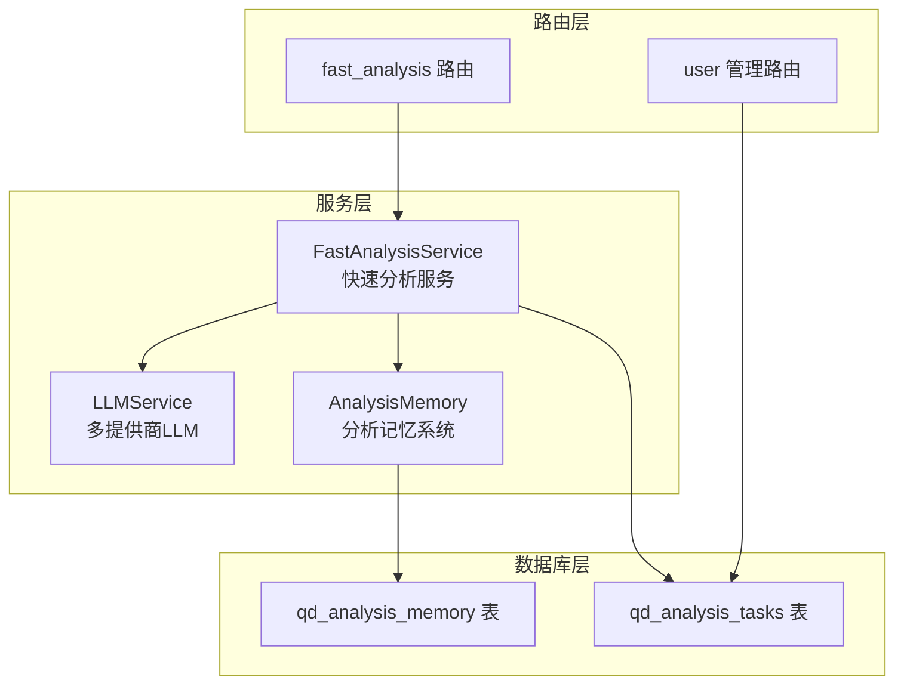
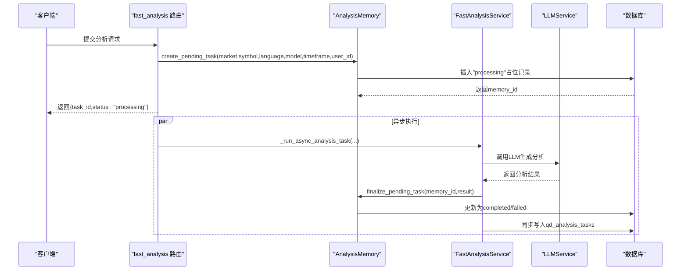
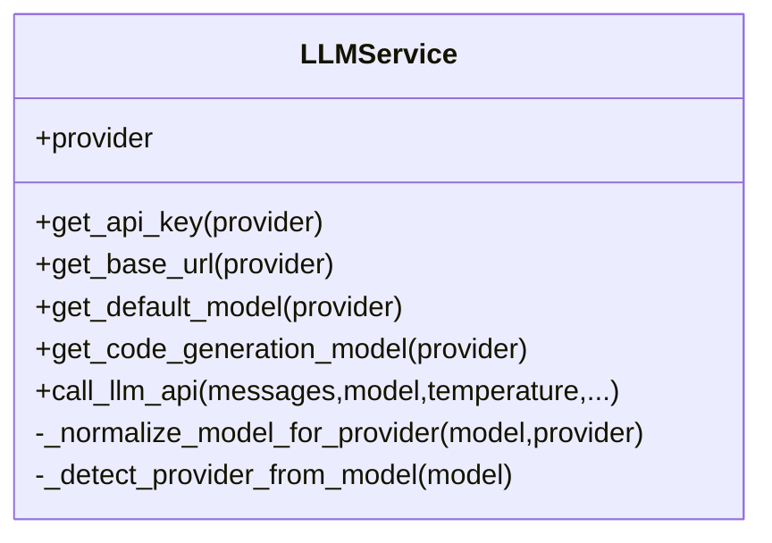
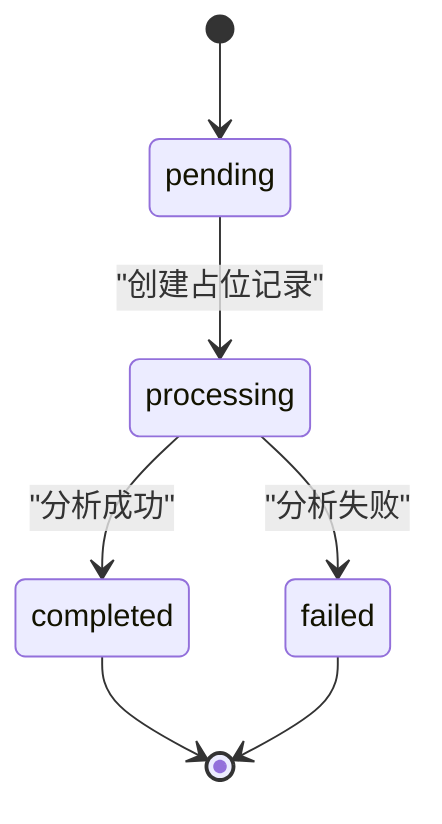
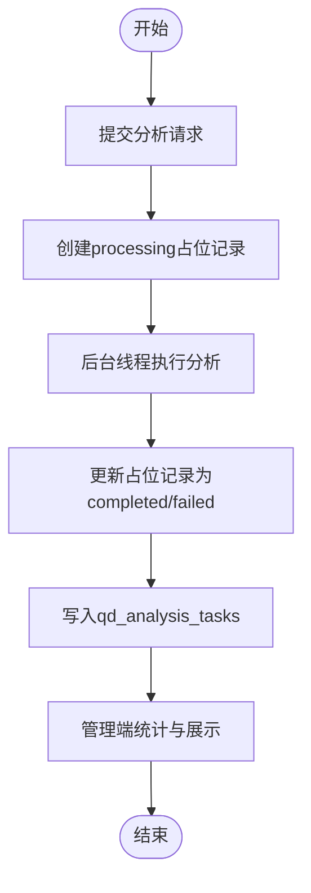
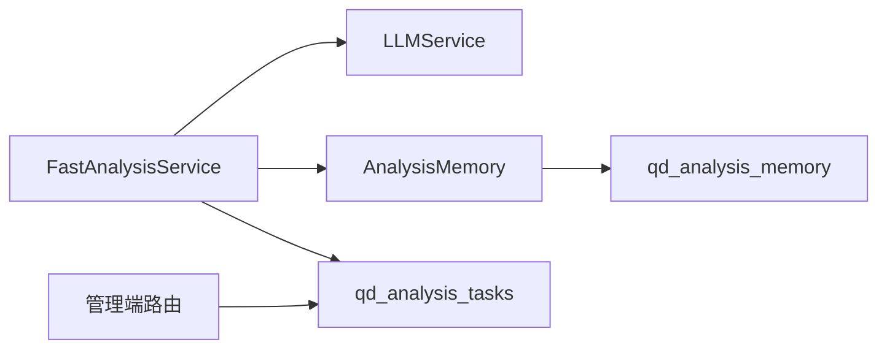

# 分析任务模型

<cite>
**本文引用的文件**
- [init.sql](file://backend_api_python/migrations/init.sql)
- [fast_analysis.py](file://backend_api_python/app/services/fast_analysis.py)
- [analysis_memory.py](file://backend_api_python/app/services/analysis_memory.py)
- [user.py](file://backend_api_python/app/routes/user.py)
- [fast_analysis.py](file://backend_api_python/app/routes/fast_analysis.py)
- [llm.py](file://backend_api_python/app/services/llm.py)
- [language.py](file://backend_api_python/app/utils/language.py)
</cite>

## 目录
1. [简介](#简介)
2. [项目结构](#项目结构)
3. [核心组件](#核心组件)
4. [架构总览](#架构总览)
5. [详细组件分析](#详细组件分析)
6. [依赖关系分析](#依赖关系分析)
7. [性能考量](#性能考量)
8. [故障排查指南](#故障排查指南)
9. [结论](#结论)
10. [附录](#附录)

## 简介
本文件系统性阐述分析任务数据模型，聚焦于 qd_analysis_tasks 表的任务管理架构与生命周期。内容涵盖：
- 外键 user_id 的关联约束与默认值策略
- market 与 symbol 组合作为任务标识的语义与索引设计
- model 字段对多提供商 LLM 的配置支持
- language 字段的多语言输出控制
- status 字段的状态流转（pending、processing、completed、failed）及其业务含义
- result_json 与 error_message 的存储与解析策略
- completed_at 时间戳记录策略
- 查询优化与批量处理最佳实践

## 项目结构
与分析任务模型相关的核心文件与职责如下：
- 数据库初始化脚本：定义 qd_analysis_tasks 表结构、索引与约束
- 快速分析服务：负责生成分析结果、持久化到 qd_analysis_tasks，并触发异步分析流程
- 分析记忆系统：提供“处理中”占位记录与最终落库更新，同时兼容历史统计
- 管理端路由：提供统计与最近记录查询，展示任务生命周期
- LLM 服务：提供多提供商模型选择与默认模型回退
- 语言工具：统一请求语言检测与规范化

图示来源
- [init.sql:444-456](file://backend_api_python/migrations/init.sql#L444-L456)
- [fast_analysis.py:2626-2690](file://backend_api_python/app/services/fast_analysis.py#L2626-L2690)
- [analysis_memory.py:396-485](file://backend_api_python/app/services/analysis_memory.py#L396-L485)
- [fast_analysis.py:1-241](file://backend_api_python/app/routes/fast_analysis.py#L1-L241)
- [user.py:1630-1829](file://backend_api_python/app/routes/user.py#L1630-L1829)
- [llm.py:70-122](file://backend_api_python/app/services/llm.py#L70-L122)

章节来源
- [init.sql:444-456](file://backend_api_python/migrations/init.sql#L444-L456)
- [fast_analysis.py:2626-2690](file://backend_api_python/app/services/fast_analysis.py#L2626-L2690)
- [analysis_memory.py:396-485](file://backend_api_python/app/services/analysis_memory.py#L396-L485)
- [fast_analysis.py:1-241](file://backend_api_python/app/routes/fast_analysis.py#L1-L241)
- [user.py:1630-1829](file://backend_api_python/app/routes/user.py#L1630-L1829)
- [llm.py:70-122](file://backend_api_python/app/services/llm.py#L70-L122)

## 核心组件
- qd_analysis_tasks 表：存储分析任务的元数据、状态与结果快照
- FastAnalysisService：执行分析、写入任务记录、触发异步流程
- AnalysisMemory：提供“processing”占位记录与最终落库更新
- LLMService：多提供商模型选择、默认模型回退与错误处理
- 语言工具：请求语言检测与规范化，确保输出语言一致

章节来源
- [init.sql:444-456](file://backend_api_python/migrations/init.sql#L444-L456)
- [fast_analysis.py:2626-2690](file://backend_api_python/app/services/fast_analysis.py#L2626-L2690)
- [analysis_memory.py:396-485](file://backend_api_python/app/services/analysis_memory.py#L396-L485)
- [llm.py:70-122](file://backend_api_python/app/services/llm.py#L70-L122)
- [language.py:1-58](file://backend_api_python/app/utils/language.py#L1-L58)

## 架构总览
分析任务的生命周期由“提交—异步处理—落库—统计展示”构成。关键路径如下：
- 提交阶段：路由接收请求，创建“processing”占位记录，返回任务ID
- 异步阶段：后台线程调用 FastAnalysisService.analyze，完成后更新 AnalysisMemory 并同步写入 qd_analysis_tasks
- 展示阶段：管理端路由聚合统计与最近记录，基于 qd_analysis_tasks 进行查询

图示来源
- [fast_analysis.py:41-241](file://backend_api_python/app/routes/fast_analysis.py#L41-L241)
- [analysis_memory.py:396-485](file://backend_api_python/app/services/analysis_memory.py#L396-L485)
- [fast_analysis.py:2626-2690](file://backend_api_python/app/services/fast_analysis.py#L2626-L2690)
- [llm.py:369-554](file://backend_api_python/app/services/llm.py#L369-L554)

## 详细组件分析

### 表结构与字段语义
- 主键与外键
  - id：自增主键
  - user_id：默认值 1，引用 qd_users(id)，删除级联
- 任务标识
  - market/symbol：联合组成任务标识，用于区分不同市场的不同标的
- 模型与语言
  - model：AI 模型名称，支持多提供商模型名（含 OpenRouter 前缀）
  - language：输出语言代码，默认 en-US
- 状态与结果
  - status：任务状态，支持 pending/processing/completed/failed
  - result_json：完整分析结果的 JSON 序列化文本
  - error_message：错误信息文本
- 时间戳
  - created_at：任务创建时间
  - completed_at：任务完成时间（与 status 更新策略配合）

索引设计
- idx_analysis_tasks_user_id：按用户过滤统计与查询

章节来源
- [init.sql:444-456](file://backend_api_python/migrations/init.sql#L444-L456)
- [init.sql:458-458](file://backend_api_python/migrations/init.sql#L458-L458)

### 外键关联与默认值策略
- user_id 默认值 1，若未传入则使用默认用户；实际业务中应传入真实 user_id
- 删除级联：当用户被删除时，其分析任务也会被一并清理，保证数据一致性

章节来源
- [init.sql:446-446](file://backend_api_python/migrations/init.sql#L446-L446)
- [fast_analysis.py:2669-2669](file://backend_api_python/app/services/fast_analysis.py#L2669-L2669)

### 任务标识组合（market + symbol）
- 语义：唯一标识一次分析任务的市场与标的
- 约束：非空，且与 user_id 共同参与统计维度
- 索引：当前仅对 user_id 建有索引，建议根据查询模式评估是否需要复合索引

章节来源
- [init.sql:447-448](file://backend_api_python/migrations/init.sql#L447-L448)
- [user.py:1652-1660](file://backend_api_python/app/routes/user.py#L1652-L1660)

### 模型配置（model 字段）
- 支持多提供商模型名，包括 OpenRouter 前缀（如 openai/gpt-4o）
- LLMService 提供自动检测与规范化，确保模型名与当前提供商匹配
- 当未指定模型时，优先使用 LLMService 的默认模型

图示来源
- [llm.py:70-122](file://backend_api_python/app/services/llm.py#L70-L122)
- [llm.py:296-343](file://backend_api_python/app/services/llm.py#L296-L343)
- [llm.py:345-367](file://backend_api_python/app/services/llm.py#L345-L367)
- [llm.py:369-554](file://backend_api_python/app/services/llm.py#L369-L554)

章节来源
- [fast_analysis.py:2644-2647](file://backend_api_python/app/services/fast_analysis.py#L2644-L2647)
- [llm.py:369-554](file://backend_api_python/app/services/llm.py#L369-L554)

### 多语言支持（language 字段）
- 语言代码默认 en-US，可在请求中传入或由前端语言头决定
- 语言工具提供规范化与别名映射，确保支持的语言集合一致

章节来源
- [init.sql:449-450](file://backend_api_python/migrations/init.sql#L449-L450)
- [fast_analysis.py:2648-2648](file://backend_api_python/app/services/fast_analysis.py#L2648-L2648)
- [language.py:13-53](file://backend_api_python/app/utils/language.py#L13-L53)

### 状态流转（status 字段）
- pending/processing：由 AnalysisMemory.create_pending_task 写入“processing”
- completed/failed：由 AnalysisMemory.finalize_pending_task 或 FastAnalysisService._save_analysis_task 写入
- 写入规则：
  - 若 result 中存在 error，则 status 设为 failed，否则 completed
  - completed_at 与 created_at 在插入时均设为当前时间，后续更新策略需结合业务需求

图示来源
- [analysis_memory.py:396-485](file://backend_api_python/app/services/analysis_memory.py#L396-L485)
- [fast_analysis.py:2649-2649](file://backend_api_python/app/services/fast_analysis.py#L2649-L2649)

章节来源
- [analysis_memory.py:396-485](file://backend_api_python/app/services/analysis_memory.py#L396-L485)
- [fast_analysis.py:2649-2649](file://backend_api_python/app/services/fast_analysis.py#L2649-L2649)

### 结果存储与错误处理
- result_json：将完整分析结果进行 JSON 序列化后存入
- error_message：将错误信息存入，便于后续统计与排障
- 解析策略：AnalysisMemory.store 与 AnalysisMemory.get_all_history 使用安全解析函数，兼容字符串与对象两种形式

章节来源
- [fast_analysis.py:2650-2651](file://backend_api_python/app/services/fast_analysis.py#L2650-L2651)
- [analysis_memory.py:22-33](file://backend_api_python/app/services/analysis_memory.py#L22-L33)
- [analysis_memory.py:336-367](file://backend_api_python/app/services/analysis_memory.py#L336-L367)

### 时间戳记录策略（completed_at）
- 插入时：created_at 与 completed_at 均设置为当前时间
- 更新策略：当前实现未见对 completed_at 的显式更新逻辑，建议在状态变为 completed/failed 时同步更新 completed_at，以便统计与排序

章节来源
- [fast_analysis.py:2665-2665](file://backend_api_python/app/services/fast_analysis.py#L2665-L2665)
- [analysis_memory.py:444-461](file://backend_api_python/app/services/analysis_memory.py#L444-L461)

### 生命周期管理（从创建到结果存储）
- 提交流程：路由层创建“processing”占位记录，返回任务ID
- 异步执行：后台线程调用 FastAnalysisService.analyze，完成后更新 AnalysisMemory 并同步写入 qd_analysis_tasks
- 管理统计：管理端路由聚合统计与最近记录，基于 qd_analysis_tasks 进行查询

图示来源
- [fast_analysis.py:205-241](file://backend_api_python/app/routes/fast_analysis.py#L205-L241)
- [analysis_memory.py:396-485](file://backend_api_python/app/services/analysis_memory.py#L396-L485)
- [fast_analysis.py:2626-2690](file://backend_api_python/app/services/fast_analysis.py#L2626-L2690)
- [user.py:1630-1829](file://backend_api_python/app/routes/user.py#L1630-L1829)

章节来源
- [fast_analysis.py:205-241](file://backend_api_python/app/routes/fast_analysis.py#L205-L241)
- [analysis_memory.py:396-485](file://backend_api_python/app/services/analysis_memory.py#L396-L485)
- [fast_analysis.py:2626-2690](file://backend_api_python/app/services/fast_analysis.py#L2626-L2690)
- [user.py:1630-1829](file://backend_api_python/app/routes/user.py#L1630-L1829)

### 查询优化与批量处理最佳实践
- 索引建议
  - idx_analysis_tasks_user_id：按用户过滤统计与查询
  - 可考虑为 (market, symbol) 或 (user_id, market, symbol) 建立复合索引，以优化高频查询
- 分页与限制
  - 管理端路由对最近记录采用 LIMIT 50，避免一次性返回过多数据
- 批量处理
  - 建议在批量查询时使用参数化查询与游标分批处理，避免大事务锁竞争
- 语言与模型过滤
  - 可在查询中加入 language 与 model 条件，结合索引提升筛选效率

章节来源
- [init.sql:458-458](file://backend_api_python/migrations/init.sql#L458-L458)
- [user.py:1760-1783](file://backend_api_python/app/routes/user.py#L1760-L1783)

## 依赖关系分析
- FastAnalysisService 依赖 LLMService 进行模型调用
- FastAnalysisService 与 AnalysisMemory 协作，前者负责分析，后者负责占位与最终落库
- 管理端路由依赖 qd_analysis_tasks 进行统计与展示
- 语言工具为分析输出提供语言规范

图示来源
- [fast_analysis.py:2626-2690](file://backend_api_python/app/services/fast_analysis.py#L2626-L2690)
- [analysis_memory.py:396-485](file://backend_api_python/app/services/analysis_memory.py#L396-L485)
- [llm.py:70-122](file://backend_api_python/app/services/llm.py#L70-L122)
- [user.py:1630-1829](file://backend_api_python/app/routes/user.py#L1630-L1829)

章节来源
- [fast_analysis.py:2626-2690](file://backend_api_python/app/services/fast_analysis.py#L2626-L2690)
- [analysis_memory.py:396-485](file://backend_api_python/app/services/analysis_memory.py#L396-L485)
- [llm.py:70-122](file://backend_api_python/app/services/llm.py#L70-L122)
- [user.py:1630-1829](file://backend_api_python/app/routes/user.py#L1630-L1829)

## 性能考量
- 异步执行：通过后台线程执行分析，避免阻塞主线程
- 占位记录：先写入“processing”，再更新为最终状态，降低锁竞争
- JSON 存储：result_json 采用 TEXT 存储，注意大对象的 IO 与压缩策略
- 索引与查询：合理使用索引与分页，避免全表扫描

## 故障排查指南
- 任务状态异常
  - 检查 AnalysisMemory.finalize_pending_task 是否正确执行
  - 核对 FastAnalysisService._save_analysis_task 的 status 写入逻辑
- 语言输出不一致
  - 确认 language 参数传递与语言工具的规范化
- 模型调用失败
  - 检查 LLMService 的 API Key 配置与提供商可用性
- 统计缺失
  - 确认管理端路由对 qd_analysis_tasks 的查询条件与权限

章节来源
- [analysis_memory.py:438-485](file://backend_api_python/app/services/analysis_memory.py#L438-L485)
- [fast_analysis.py:2649-2649](file://backend_api_python/app/services/fast_analysis.py#L2649-L2649)
- [llm.py:413-431](file://backend_api_python/app/services/llm.py#L413-L431)
- [user.py:1630-1829](file://backend_api_python/app/routes/user.py#L1630-L1829)

## 结论
qd_analysis_tasks 表为分析任务提供了清晰的生命周期管理与统计基础。通过 FastAnalysisService、AnalysisMemory 与 LLMService 的协同，实现了从提交、异步处理到结果落库与统计展示的完整闭环。建议进一步完善 completed_at 的更新策略与索引设计，以提升查询性能与可观测性。

## 附录
- 术语
  - pending：等待处理
  - processing：正在处理
  - completed：处理完成
  - failed：处理失败
- 相关文件
  - [init.sql:444-456](file://backend_api_python/migrations/init.sql#L444-L456)
  - [fast_analysis.py:2626-2690](file://backend_api_python/app/services/fast_analysis.py#L2626-L2690)
  - [analysis_memory.py:396-485](file://backend_api_python/app/services/analysis_memory.py#L396-L485)
  - [user.py:1630-1829](file://backend_api_python/app/routes/user.py#L1630-L1829)
  - [llm.py:70-122](file://backend_api_python/app/services/llm.py#L70-L122)
  - [language.py:1-58](file://backend_api_python/app/utils/language.py#L1-L58)