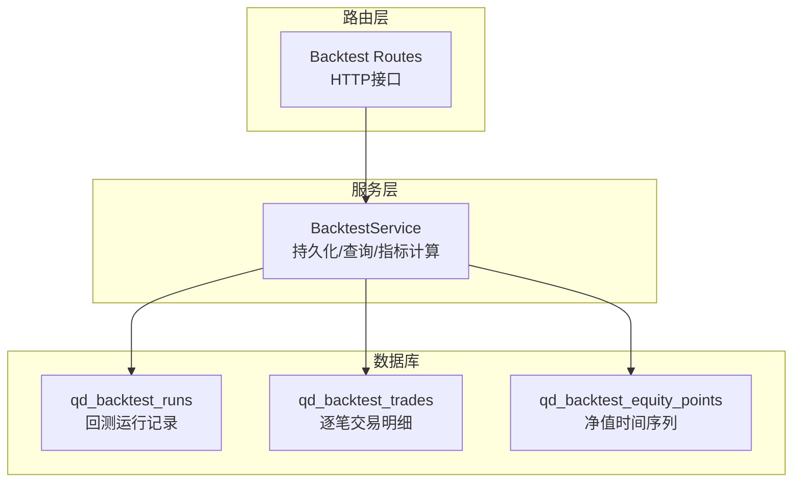
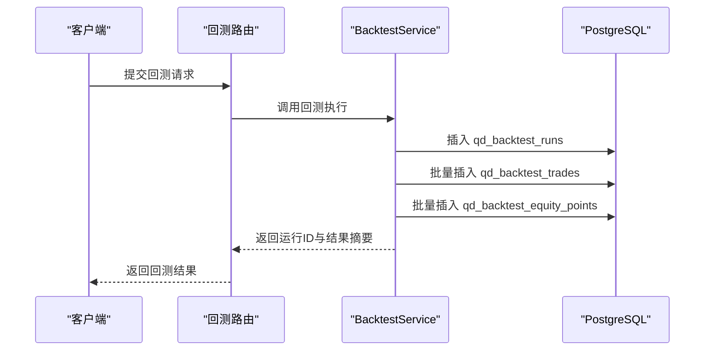
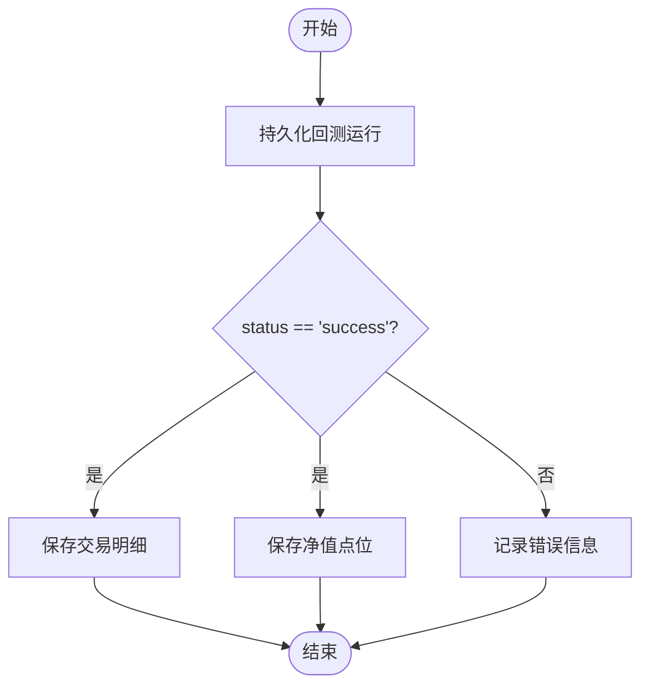
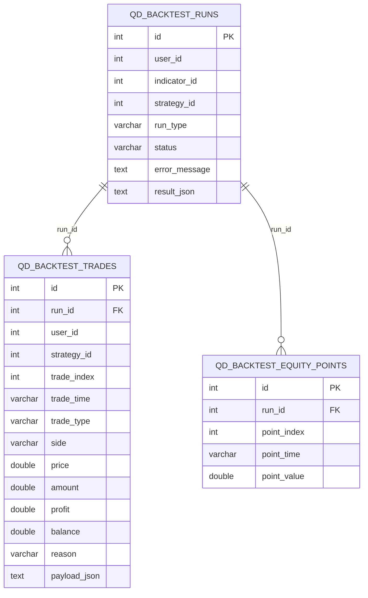
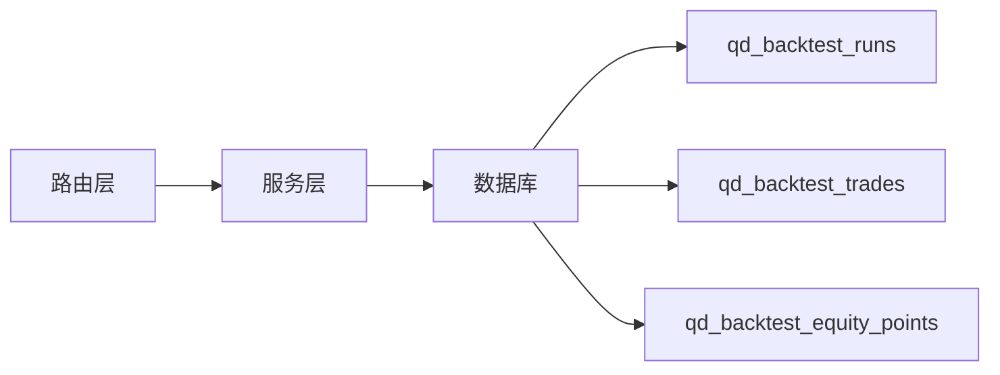

# 回测系统模型

<cite>
**本文档引用的文件**
- [backtest.py](file://backend_api_python/app/services/backtest.py)
- [init.sql](file://backend_api_python/migrations/init.sql)
- [backtest.py](file://backend_api_python/app/routes/backtest.py)
</cite>

## 目录
1. [简介](#简介)
2. [项目结构](#项目结构)
3. [核心组件](#核心组件)
4. [架构总览](#架构总览)
5. [详细组件分析](#详细组件分析)
6. [依赖关系分析](#依赖关系分析)
7. [性能考量](#性能考量)
8. [故障排查指南](#故障排查指南)
9. [结论](#结论)
10. [附录](#附录)

## 简介
本文件系统性梳理回测系统在数据库层面的数据模型设计与实现，重点围绕以下三张核心表展开：
- qd_backtest_runs：回测运行记录与元数据管理
- qd_backtest_trades：逐笔交易明细与序列化载荷
- qd_backtest_equity_points：净值曲线的时间序列点位

文档将详细解释字段语义、状态管理、序列化策略、索引优化与大数据量下的性能考量，并给出查询统计与分析方法。

## 项目结构
回测数据模型由迁移脚本初始化，服务层负责运行持久化与查询；路由层提供对外接口。

**图示来源**
- [init.sql:464-525](file://backend_api_python/migrations/init.sql#L464-L525)
- [backtest.py:88-141](file://backend_api_python/app/services/backtest.py#L88-L141)

**章节来源**
- [init.sql:464-525](file://backend_api_python/migrations/init.sql#L464-L525)
- [backtest.py:88-141](file://backend_api_python/app/services/backtest.py#L88-L141)

## 核心组件

### qd_backtest_runs 表：回测运行管理
- 作用：保存一次完整回测的元信息、配置快照、执行状态与结果摘要。
- 关键字段与语义
  - run_type：区分回测类型
    - indicator：基于指标信号的回测
    - strategy：基于策略脚本的回测
  - status：运行状态
    - success：成功完成
    - 其他：失败或异常状态（配合 error_message）
  - error_message：错误追踪文本
  - strategy_id / strategy_name：策略相关标识
  - config_snapshot / strategy_config：配置快照与策略配置
  - engine_version / code_hash：引擎版本与代码哈希
  - result_json：回测结果的序列化存储（包含收益、胜率、最大回撤等指标）
- 索引
  - idx_backtest_runs_run_type：按 run_type 查询
  - idx_backtest_runs_strategy_id：按策略 ID 查询
  - idx_backtest_runs_user_id / idx_backtest_runs_indicator_id：按用户/指标查询

**章节来源**
- [init.sql:464-489](file://backend_api_python/migrations/init.sql#L464-L489)
- [backtest.py:233-295](file://backend_api_python/app/services/backtest.py#L233-L295)
- [backtest.py:344-397](file://backend_api_python/app/services/backtest.py#L344-L397)

### qd_backtest_trades 表：交易记录存储
- 作用：存储逐笔交易明细，支持回放与复盘。
- 关键字段与语义
  - run_id：关联回测运行
  - trade_index：同一回测内的交易序号（1..N）
  - trade_time / trade_type / side：时间、类型与方向
  - price / amount / profit / balance：成交价格、数量、利润、余额
  - reason：触发原因（如开仓/平仓/止损/止盈/止盈追踪）
  - payload_json：完整交易载荷的序列化（便于扩展）
- 索引
  - idx_backtest_trades_run_id：按回测运行查询交易

**章节来源**
- [init.sql:496-512](file://backend_api_python/migrations/init.sql#L496-L512)
- [backtest.py:298-321](file://backend_api_python/app/services/backtest.py#L298-L321)

### qd_backtest_equity_points 表：净值曲线数据
- 作用：存储净值曲线的时间序列点位，便于可视化与分析。
- 关键字段与语义
  - run_id：关联回测运行
  - point_index：时间序列索引（1..N）
  - point_time / point_value：时间与净值
- 索引
  - idx_backtest_equity_points_run_id：按回测运行查询净值

**章节来源**
- [init.sql:516-523](file://backend_api_python/migrations/init.sql#L516-L523)
- [backtest.py:323-336](file://backend_api_python/app/services/backtest.py#L323-L336)

## 架构总览
回测流程的关键数据流如下：

**图示来源**
- [backtest.py:233-342](file://backend_api_python/app/services/backtest.py#L233-L342)
- [backtest.py:672-706](file://backend_api_python/app/routes/backtest.py#L672-L706)

## 详细组件分析

### 组件A：回测运行管理（qd_backtest_runs）
- 字段设计要点
  - run_type 与 strategy_id 的并存设计，既支持指标驱动回测，也支持策略脚本回测
  - status 与 error_message 的双字段状态管理，便于快速定位问题
  - result_json 存储指标化的结果摘要，便于统计与检索
- 状态流转
  - 成功：status='success'，error_message 留空
  - 失败：status 非 'success'，error_message 记录错误
- 序列化策略
  - strategy_config / config_snapshot / result_json 均以 JSON 文本存储，便于灵活扩展

**图示来源**
- [backtest.py:233-342](file://backend_api_python/app/services/backtest.py#L233-L342)

**章节来源**
- [backtest.py:233-295](file://backend_api_python/app/services/backtest.py#L233-L295)
- [backtest.py:344-397](file://backend_api_python/app/services/backtest.py#L344-L397)

### 组件B：交易记录存储（qd_backtest_trades）
- 交易序列编号
  - trade_index 严格递增，确保交易顺序与可复现性
- 详细载荷
  - payload_json 存储完整交易对象，便于后续扩展字段或解析复杂结构
- 时间序列组织
  - 以 trade_time 作为时间维度，结合 trade_index 保证排序一致性

**图示来源**
- [init.sql:464-523](file://backend_api_python/migrations/init.sql#L464-L523)

**章节来源**
- [init.sql:496-512](file://backend_api_python/migrations/init.sql#L496-L512)
- [backtest.py:298-321](file://backend_api_python/app/services/backtest.py#L298-L321)

### 组件C：净值曲线存储（qd_backtest_equity_points）
- 时间序列索引
  - point_index 与 point_time 双重索引，便于按时间或序号查询
- 净值计算
  - point_value 为累计净值，便于绘制曲线与计算回撤

**章节来源**
- [init.sql:516-523](file://backend_api_python/migrations/init.sql#L516-L523)
- [backtest.py:323-336](file://backend_api_python/app/services/backtest.py#L323-L336)

### 组件D：查询与统计（基于现有实现的扩展建议）
- 列表查询
  - 支持按 user_id、indicator_id、strategy_id、run_type、symbol、market、timeframe 等条件过滤
- 结果解析
  - 通过 _hydrate_run_row 将 result_json 解析为字典，提取 totalReturn、annualReturn、winRate、totalTrades 等指标
- 统计分析
  - 可基于 qd_backtest_trades 的 profit、balance、reason 等字段进行统计
  - 可基于 qd_backtest_equity_points 的 point_value 计算最大回撤等指标

**章节来源**
- [backtest.py:344-397](file://backend_api_python/app/services/backtest.py#L344-L397)
- [backtest.py:420-442](file://backend_api_python/app/services/backtest.py#L420-L442)

## 依赖关系分析
- 服务层依赖数据库连接与事务，确保回测运行、交易明细与净值点位的一致性写入
- 路由层依赖服务层提供的查询能力，返回标准化的回测结果

**图示来源**
- [backtest.py:88-141](file://backend_api_python/app/services/backtest.py#L88-L141)
- [backtest.py:672-706](file://backend_api_python/app/routes/backtest.py#L672-L706)

**章节来源**
- [backtest.py:88-141](file://backend_api_python/app/services/backtest.py#L88-L141)
- [backtest.py:672-706](file://backend_api_python/app/routes/backtest.py#L672-L706)

## 性能考量
- 索引策略
  - qd_backtest_runs：run_type、strategy_id、user_id、indicator_id 等常用过滤字段已建立索引
  - qd_backtest_trades：run_id 建有索引，便于按回测运行批量查询
  - qd_backtest_equity_points：run_id 建有索引，便于按回测运行批量查询
- 批量写入
  - 交易明细与净值点位采用批量插入，降低事务开销
- 数据规模
  - 交易明细与净值点位可能随回测周期与频率增长，建议定期归档历史数据或按用户/策略拆分存储
- 查询优化
  - 对高频过滤条件（如 user_id、run_type、strategy_id）保持索引
  - 对大结果集分页查询，限制单次返回条数

[本节为通用性能指导，无需特定文件引用]

## 故障排查指南
- 状态与错误
  - 若 status 非 'success'，检查 error_message 获取具体错误
- 数据完整性
  - 确认 qd_backtest_runs 的 run_id 与 qd_backtest_trades、qd_backtest_equity_points 的关联一致
- 查询异常
  - 检查索引是否存在（如 idx_backtest_runs_run_type、idx_backtest_trades_run_id 等）
  - 确认过滤条件与索引匹配，避免全表扫描

**章节来源**
- [backtest.py:233-295](file://backend_api_python/app/services/backtest.py#L233-L295)
- [backtest.py:344-397](file://backend_api_python/app/services/backtest.py#L344-L397)

## 结论
该数据模型以 qd_backtest_runs 为核心，串联交易明细与净值曲线，形成完整的回测数据链路。通过 run_type 区分指标与策略回测，status/error_message 提供清晰的状态与错误追踪，result_json 支持指标化结果的快速统计。索引与批量写入策略在保证查询效率的同时，满足大规模回测场景的需求。建议在实际部署中结合业务规模持续评估索引与归档策略，确保长期稳定运行。

## 附录
- 字段速查
  - qd_backtest_runs：run_type、status、error_message、strategy_id、strategy_name、config_snapshot、strategy_config、engine_version、code_hash、result_json
  - qd_backtest_trades：run_id、trade_index、trade_time、trade_type、side、price、amount、profit、balance、reason、payload_json
  - qd_backtest_equity_points：run_id、point_index、point_time、point_value

[本节为概览性内容，无需特定文件引用]