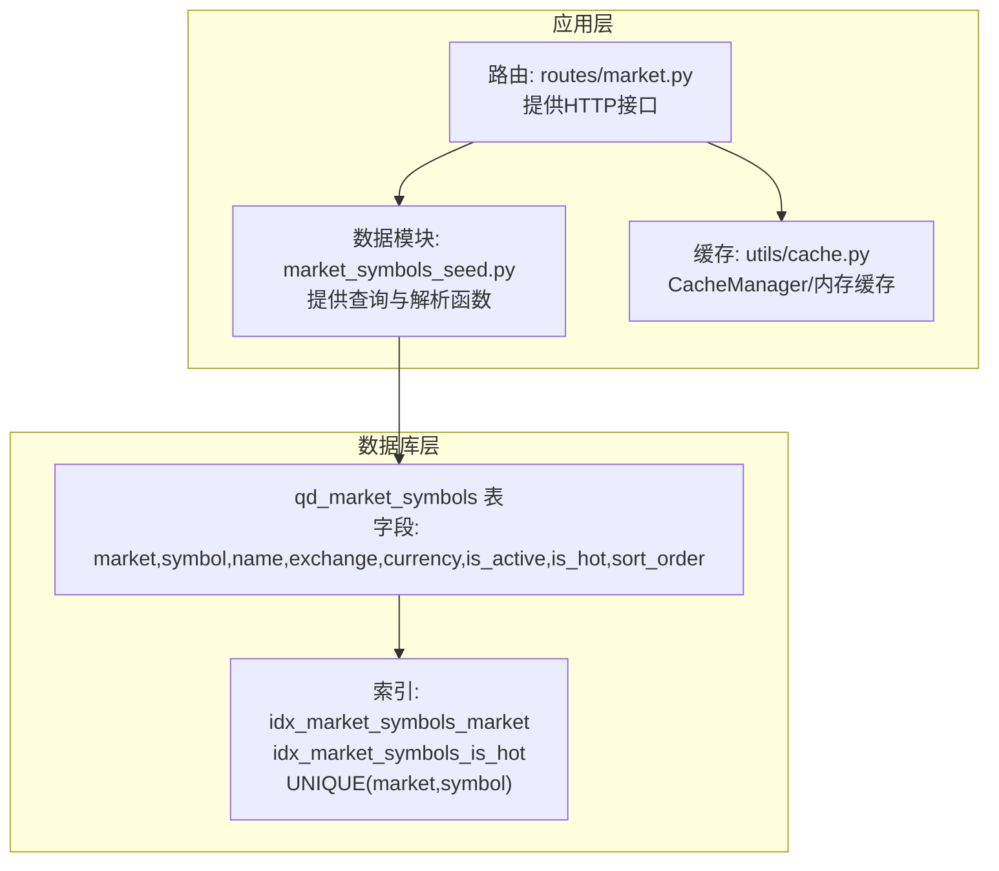
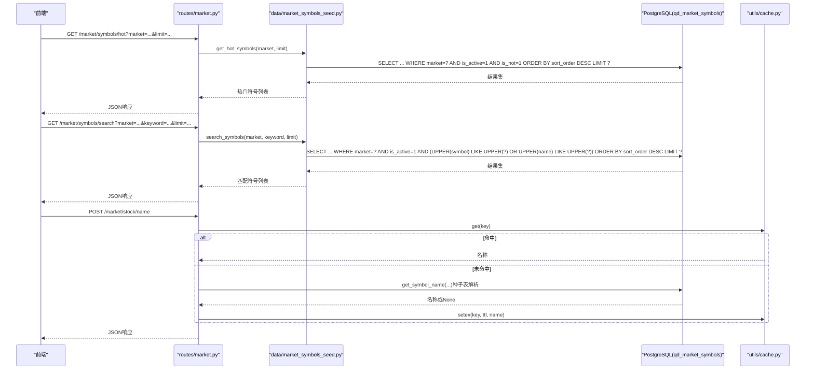
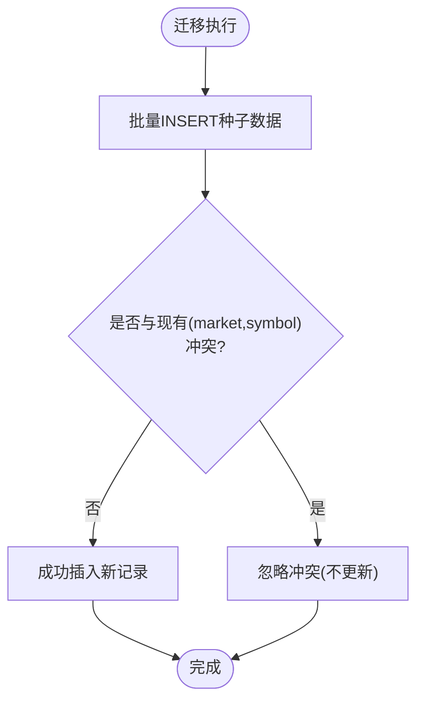
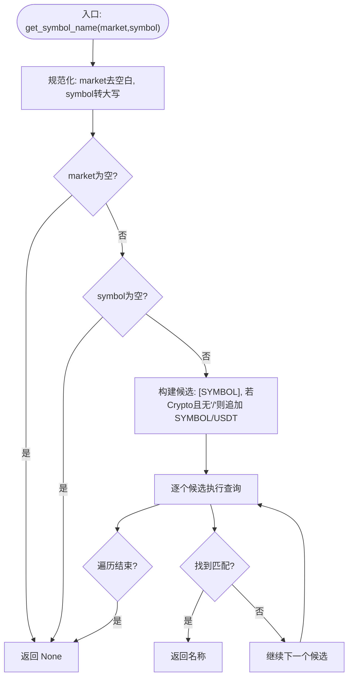
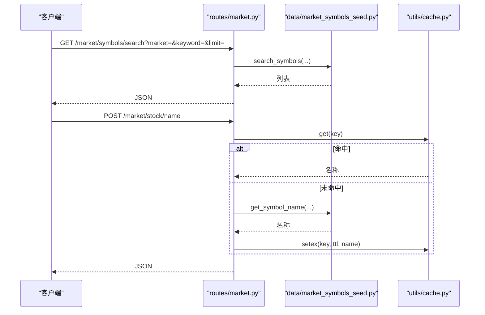
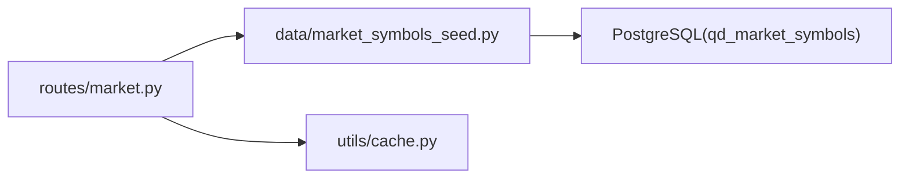

# 市场符号模型

<cite>
**本文引用的文件**
- [backend_api_python/app/data/market_symbols_seed.py](file://backend_api_python/app/data/market_symbols_seed.py)
- [backend_api_python/migrations/init.sql](file://backend_api_python/migrations/init.sql)
- [backend_api_python/app/routes/market.py](file://backend_api_python/app/routes/market.py)
- [backend_api_python/app/utils/cache.py](file://backend_api_python/app/utils/cache.py)
</cite>

## 目录
1. [简介](#简介)
2. [项目结构](#项目结构)
3. [核心组件](#核心组件)
4. [架构总览](#架构总览)
5. [详细组件分析](#详细组件分析)
6. [依赖分析](#依赖分析)
7. [性能考虑](#性能考虑)
8. [故障排查指南](#故障排查指南)
9. [结论](#结论)
10. [附录](#附录)

## 简介
本文件系统化阐述“qd_market_symbols”市场符号数据模型的设计与实现，覆盖以下关键点：
- 表结构与字段语义：market（市场分类）、symbol（标准化符号）、name（显示名）、exchange（交易所）、currency（计价货币）、is_active（启用标记）、is_hot（热门标记）、sort_order（排序权重）。
- 种子数据设计：按市场类别组织的热门符号清单，包含USStock、Crypto、Forex、Futures、CNStock、HKStock，并给出数据初始化策略与冲突处理。
- 查询接口与流程：热门符号、关键词搜索、符号名称解析的实现与SQL逻辑。
- 约束与索引：UNIQUE约束、索引策略及其对性能与一致性的影响。
- 插入优化与批量导入：ON CONFLICT策略与迁移脚本中的批量插入。
- 查询优化与缓存策略：数据库索引、前端缓存与服务端缓存的协同。

## 项目结构
围绕市场符号模型的相关文件与职责如下：
- 数据模型与种子数据：在迁移脚本中定义表结构与初始种子数据，并通过ON CONFLICT策略进行幂等插入。
- 查询与解析：在数据模块中提供热门符号、搜索、名称解析等查询函数；在路由层暴露HTTP接口。
- 缓存：提供本地内存缓存与可选Redis缓存的统一管理器，用于热点数据的快速读取。

**图示来源**
- [backend_api_python/migrations/init.sql:620-637](file://backend_api_python/migrations/init.sql#L620-L637)
- [backend_api_python/app/data/market_symbols_seed.py:26-192](file://backend_api_python/app/data/market_symbols_seed.py#L26-L192)
- [backend_api_python/app/routes/market.py:163-253](file://backend_api_python/app/routes/market.py#L163-L253)
- [backend_api_python/app/utils/cache.py:49-129](file://backend_api_python/app/utils/cache.py#L49-L129)

**章节来源**
- [backend_api_python/migrations/init.sql:618-772](file://backend_api_python/migrations/init.sql#L618-L772)
- [backend_api_python/app/data/market_symbols_seed.py:1-193](file://backend_api_python/app/data/market_symbols_seed.py#L1-L193)
- [backend_api_python/app/routes/market.py:1-635](file://backend_api_python/app/routes/market.py#L1-L635)
- [backend_api_python/app/utils/cache.py:1-129](file://backend_api_python/app/utils/cache.py#L1-L129)

## 核心组件
- qd_market_symbols 表
  - 字段与含义
    - market：市场分类，取值示例包括 USStock、Crypto、Forex、Futures、CNStock、HKStock。
    - symbol：标准化符号，例如 Crypto 的“BTC/USDT”，Forex 的“EURUSD”，CNStock 的“600519”。
    - name：显示名称，如“Apple Inc.”、“比特币”等。
    - exchange、currency：交易所与计价货币，便于跨市场展示与计算。
    - is_active：启用标记，仅查询活跃符号。
    - is_hot：热门标记，用于筛选热门符号。
    - sort_order：排序权重，数值越大越靠前。
  - 约束与索引
    - UNIQUE(market, symbol)：保证每个市场下符号唯一。
    - idx_market_symbols_market：按市场过滤。
    - idx_market_symbols_is_hot：按市场+热门过滤。
- 种子数据
  - 按市场分组提供热门符号，覆盖主流币种、货币对、商品合约及A/H股代表性标的。
  - 使用ON CONFLICT (market, symbol) DO NOTHING实现幂等插入，避免重复初始化导致的错误。
- 查询函数
  - 热门符号：按 is_active=1 且 is_hot=1 过滤，按 sort_order 降序返回。
  - 搜索：支持大小写无关匹配 symbol 或 name，按 sort_order 降序返回。
  - 名称解析：优先从种子表匹配，若为 Crypto 且输入不含“/”，会尝试“SYMBOL/USDT”。

**章节来源**
- [backend_api_python/migrations/init.sql:620-637](file://backend_api_python/migrations/init.sql#L620-L637)
- [backend_api_python/migrations/init.sql:638-772](file://backend_api_python/migrations/init.sql#L638-L772)
- [backend_api_python/app/data/market_symbols_seed.py:26-192](file://backend_api_python/app/data/market_symbols_seed.py#L26-L192)

## 架构总览
市场符号模型的调用链路如下：

**图示来源**
- [backend_api_python/app/routes/market.py:163-253](file://backend_api_python/app/routes/market.py#L163-L253)
- [backend_api_python/app/data/market_symbols_seed.py:26-192](file://backend_api_python/app/data/market_symbols_seed.py#L26-L192)
- [backend_api_python/app/utils/cache.py:100-124](file://backend_api_python/app/utils/cache.py#L100-L124)

## 详细组件分析

### 数据模型与种子数据设计
- 表结构与字段
  - 字段定义与默认值见迁移脚本中的建表语句。
  - UNIQUE(market, symbol) 确保每类市场内符号唯一，防止重复录入。
- 种子数据组织
  - USStock：科技与金融龙头公司，如AAPL、MSFT、NVDA等。
  - Crypto：主流币种（BTC/USDT、ETH/USDT等）、Layer 1/2、DeFi、Meme币、AI/Infra及其他。
  - Forex：主要货币对，如EURUSD、GBPUSD、USDJPY等。
  - Futures：能源、金属、农产品与股指期货，如CL、GC、ES、NQ等。
  - CNStock：上交所与深交所代表性标的，如贵州茅台、招商银行等。
  - HKStock：港股代表企业，如腾讯控股、阿里巴巴等。
- 初始化策略与冲突处理
  - 迁移脚本中一次性批量插入所有种子数据。
  - 使用 ON CONFLICT (market, symbol) DO NOTHING 实现幂等，避免重复执行迁移时报错或重复数据。

**图示来源**
- [backend_api_python/migrations/init.sql:638-772](file://backend_api_python/migrations/init.sql#L638-L772)

**章节来源**
- [backend_api_python/migrations/init.sql:620-637](file://backend_api_python/migrations/init.sql#L620-L637)
- [backend_api_python/migrations/init.sql:638-772](file://backend_api_python/migrations/init.sql#L638-L772)

### 查询与解析函数
- 热门符号查询
  - 条件：is_active=1 且 is_hot=1，按 sort_order 降序，限制数量。
  - 返回字段：market、symbol、name。
- 关键词搜索
  - 条件：is_active=1，symbol或name包含关键字（大小写无关），按 sort_order 降序。
  - 返回字段：market、symbol、name。
- 符号名称解析（get_symbol_name）
  - 规则：先按传入的 market+symbol 精确匹配；若为 Crypto 且输入不含“/”，会尝试“SYMBOL/USDT”作为候选。
  - 返回：名称字符串或 None。

**图示来源**
- [backend_api_python/app/data/market_symbols_seed.py:112-152](file://backend_api_python/app/data/market_symbols_seed.py#L112-L152)

**章节来源**
- [backend_api_python/app/data/market_symbols_seed.py:26-192](file://backend_api_python/app/data/market_symbols_seed.py#L26-L192)

### HTTP 接口与集成
- 热门符号接口
  - 路径：GET /market/symbols/hot
  - 参数：market、limit
  - 流程：路由层调用数据模块的 get_hot_symbols，返回JSON。
- 搜索接口
  - 路径：GET /market/symbols/search
  - 参数：market、keyword、limit
  - 流程：路由层调用数据模块的 search_symbols；当 market=Crypto 且结果不足时，补充从交易所动态市场列表搜索的结果。
- 名称解析接口
  - 路径：POST /market/stock/name
  - 流程：优先从缓存读取；未命中则解析并写入缓存（1天有效期）。

**图示来源**
- [backend_api_python/app/routes/market.py:163-253](file://backend_api_python/app/routes/market.py#L163-L253)
- [backend_api_python/app/data/market_symbols_seed.py:112-152](file://backend_api_python/app/data/market_symbols_seed.py#L112-L152)
- [backend_api_python/app/utils/cache.py:100-124](file://backend_api_python/app/utils/cache.py#L100-L124)

**章节来源**
- [backend_api_python/app/routes/market.py:163-253](file://backend_api_python/app/routes/market.py#L163-L253)
- [backend_api_python/app/routes/market.py:513-635](file://backend_api_python/app/routes/market.py#L513-L635)

### 约束与索引策略
- UNIQUE(market, symbol)
  - 作用：确保同一市场下的符号唯一性，避免重复注册。
  - 冲突处理：迁移脚本使用 ON CONFLICT DO NOTHING 幂等插入。
- 索引
  - idx_market_symbols_market：加速按市场过滤。
  - idx_market_symbols_is_hot：加速按市场+热门过滤。
- SQL 查询特性
  - 热门与搜索均使用 is_active=1 与 sort_order 降序，保证只返回有效且高优先级的符号。

**章节来源**
- [backend_api_python/migrations/init.sql:620-637](file://backend_api_python/migrations/init.sql#L620-L637)
- [backend_api_python/migrations/init.sql:638-772](file://backend_api_python/migrations/init.sql#L638-L772)
- [backend_api_python/app/data/market_symbols_seed.py:26-192](file://backend_api_python/app/data/market_symbols_seed.py#L26-L192)

## 依赖分析
- 组件耦合
  - routes/market.py 依赖 data/market_symbols_seed.py 提供的查询能力。
  - routes/market.py 同时依赖 utils/cache.py 提供的缓存能力。
  - data/market_symbols_seed.py 依赖数据库连接工具（由应用启动时注入）。
- 外部依赖
  - Crypto 动态搜索依赖 ccxt 库。
  - 股票名称解析在某些市场下依赖 yfinance。
- 循环依赖
  - 当前模块间无循环依赖，职责清晰。

**图示来源**
- [backend_api_python/app/routes/market.py:18-23](file://backend_api_python/app/routes/market.py#L18-L23)
- [backend_api_python/app/data/market_symbols_seed.py:17-23](file://backend_api_python/app/data/market_symbols_seed.py#L17-L23)
- [backend_api_python/app/utils/cache.py:1-129](file://backend_api_python/app/utils/cache.py#L1-L129)

**章节来源**
- [backend_api_python/app/routes/market.py:1-635](file://backend_api_python/app/routes/market.py#L1-L635)
- [backend_api_python/app/data/market_symbols_seed.py:1-193](file://backend_api_python/app/data/market_symbols_seed.py#L1-L193)
- [backend_api_python/app/utils/cache.py:1-129](file://backend_api_python/app/utils/cache.py#L1-L129)

## 性能考虑
- 数据库层面
  - 使用 UNIQUE(market, symbol) 与索引 idx_market_symbols_market、idx_market_symbols_is_hot，降低重复与过滤成本。
  - 查询使用 LIMIT 控制结果规模，避免全表扫描。
- 应用层面
  - 热门与搜索接口直接基于索引过滤，复杂度与返回条数近似线性。
  - Crypto 搜索在结果不足时才触发外部交易所市场列表查询，避免不必要的网络开销。
- 缓存层面
  - 股票名称解析采用1天TTL的缓存，显著降低重复请求的数据库与外部API压力。
  - CacheManager 支持本地内存缓存与可选Redis缓存，具备良好的可扩展性。

**章节来源**
- [backend_api_python/migrations/init.sql:620-637](file://backend_api_python/migrations/init.sql#L620-L637)
- [backend_api_python/app/routes/market.py:193-242](file://backend_api_python/app/routes/market.py#L193-L242)
- [backend_api_python/app/utils/cache.py:49-129](file://backend_api_python/app/utils/cache.py#L49-L129)

## 故障排查指南
- 热门/搜索无结果
  - 检查 market 与 keyword 输入是否为空。
  - 确认 is_active=1 且 is_hot=1 的记录是否存在。
- 名称解析失败
  - 确认种子表中是否存在该 market+symbol 的记录。
  - 对于 Crypto，确认输入是否为“SYMBOL/USDT”或仅“SYMBOL”（后者会自动尝试“SYMBOL/USDT”）。
- 缓存未生效
  - 检查 CacheManager 是否启用（环境变量）与Redis连通性。
  - 确认缓存键格式是否正确（例如“stock_name:USStock:AAPL”）。
- 迁移报错或重复数据
  - 确认迁移脚本使用了 ON CONFLICT DO NOTHING。
  - 如需更新种子数据，建议通过维护脚本或手动清理后重新初始化。

**章节来源**
- [backend_api_python/app/data/market_symbols_seed.py:26-192](file://backend_api_python/app/data/market_symbols_seed.py#L26-L192)
- [backend_api_python/app/routes/market.py:513-635](file://backend_api_python/app/routes/market.py#L513-L635)
- [backend_api_python/app/utils/cache.py:71-98](file://backend_api_python/app/utils/cache.py#L71-L98)

## 结论
qd_market_symbols 模型以明确的字段语义、完善的约束与索引、以及清晰的种子数据组织，支撑起跨市场的符号查询与展示需求。结合路由层的HTTP接口与缓存策略，系统在性能与可维护性之间取得良好平衡。建议在后续迭代中持续完善各市场类别的热门符号清单，并根据业务增长逐步优化缓存策略与查询路径。

## 附录
- 常用查询要点
  - 热门符号：WHERE is_active=1 AND is_hot=1 ORDER BY sort_order DESC LIMIT N
  - 搜索：WHERE is_active=1 AND (UPPER(symbol) LIKE UPPER(?) OR UPPER(name) LIKE UPPER(?)) ORDER BY sort_order DESC LIMIT N
  - 名称解析：按候选顺序精确匹配，优先返回命中项
- 环境与配置
  - 缓存启用：通过 CacheConfig/RedisConfig 控制
  - 执行器并发：通过 MARKET_EXECUTOR_WORKERS 控制并行度（影响价格批量获取）