# 支撑数据模型

<cite>
**本文档引用的文件**
- [init.sql](file://backend_api_python/migrations/init.sql)
- [market_symbols_seed.py](file://backend_api_python/app/data/market_symbols_seed.py)
- [credential_crypto.py](file://backend_api_python/app/utils/credential_crypto.py)
- [credentials.py](file://backend_api_python/app/routes/credentials.py)
- [market.py](file://backend_api_python/app/routes/market.py)
- [backtest.py](file://backend_api_python/app/services/backtest.py)
- [fast_analysis.py](file://backend_api_python/app/services/fast_analysis.py)
</cite>

## 目录
1. [简介](#简介)
2. [项目结构](#项目结构)
3. [核心组件](#核心组件)
4. [架构概览](#架构概览)
5. [详细组件分析](#详细组件分析)
6. [依赖关系分析](#依赖关系分析)
7. [性能考虑](#性能考虑)
8. [故障排除指南](#故障排除指南)
9. [结论](#结论)

## 简介

本文档详细介绍了 SharkQuantDinger 项目中的支撑性数据模型，重点关注以下关键表的设计与实现：

- **qd_watchlist 表**：用户关注列表管理，包含 user_id 外键关联、market 和 symbol 的唯一性约束以及数据同步机制
- **qd_analysis_tasks 表**：分析任务管理，包含 market、symbol、model 字段的任务配置和 result_json 的结果存储
- **qd_backtest_runs 和 qd_backtest_trades 表**：回测系统设计，包含 run_type 字段的任务类型区分、status 状态管理和回测结果的序列化存储
- **qd_exchange_credentials 表**：交易所凭证管理，包含 encrypted_config 的加密存储和 api_key_hint 的安全显示
- **qd_market_symbols 表**：市场符号种子数据设计，包含各市场类别的热门符号列表和数据初始化策略

这些支撑表之间建立了清晰的关联关系和数据一致性保证机制，为整个量化交易系统的稳定运行提供了坚实的数据基础。

## 项目结构

项目采用模块化的数据库设计，主要涉及以下核心表：

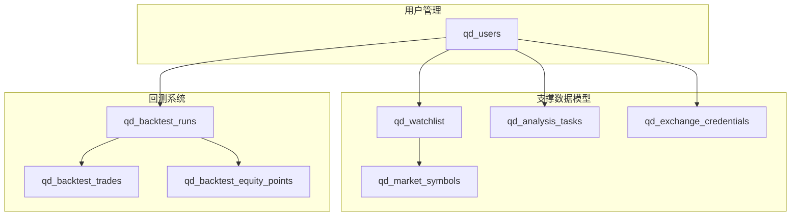

**图表来源**
- [init.sql:427-436](file://backend_api_python/migrations/init.sql#L427-L436)
- [init.sql:444-456](file://backend_api_python/migrations/init.sql#L444-L456)
- [init.sql:621-633](file://backend_api_python/migrations/init.sql#L621-L633)
- [init.sql:531-540](file://backend_api_python/migrations/init.sql#L531-L540)
- [init.sql:464-489](file://backend_api_python/migrations/init.sql#L464-L489)
- [init.sql:496-512](file://backend_api_python/migrations/init.sql#L496-L512)
- [init.sql:516-523](file://backend_api_python/migrations/init.sql#L516-L523)

## 核心组件

### 用户关注列表 (qd_watchlist)

qd_watchlist 表是用户关注列表的核心数据结构，设计特点如下：

- **外键关联**：user_id 字段引用 qd_users.id，采用级联删除确保数据完整性
- **唯一性约束**：(user_id, market, symbol) 组合的唯一性约束，防止重复添加相同市场的相同符号
- **索引优化**：对 user_id 字段建立索引，提升查询性能
- **数据同步**：支持自动名称回填机制，从种子数据或公共源解析符号名称

### 分析任务管理 (qd_analysis_tasks)

qd_analysis_tasks 表负责存储 AI 分析任务的相关信息：

- **任务配置**：market、symbol、model 字段定义分析目标和模型类型
- **状态管理**：status 字段跟踪任务执行状态，language 字段支持多语言
- **结果存储**：result_json 字段存储完整的分析结果，error_message 字段记录错误信息
- **时间戳**：created_at 和 completed_at 字段记录任务生命周期

### 回测系统 (qd_backtest_runs & qd_backtest_trades)

回测系统采用三级表结构设计：

- **qd_backtest_runs**：存储回测运行的基本信息，包括 run_type 区分任务类型、status 状态管理、result_json 结果存储
- **qd_backtest_trades**：存储详细的交易记录，包括 trade_index、trade_time、trade_type、side、price、amount、profit、balance 等字段
- **qd_backtest_equity_points**：存储净值曲线点位，支持回测结果的可视化展示

### 交易所凭证管理 (qd_exchange_credentials)

qd_exchange_credentials 表提供安全的凭证存储机制：

- **加密存储**：encrypted_config 字段使用 Fernet 对称加密算法存储敏感信息
- **安全显示**：api_key_hint 字段提供 API 密钥的安全显示，仅显示前缀和后缀
- **索引优化**：对 user_id 字段建立索引，支持快速查询用户的所有凭证

### 市场符号种子数据 (qd_market_symbols)

qd_market_symbols 表提供市场符号的基础数据：

- **种子数据**：包含各市场类别的热门符号列表，涵盖 USStock、Crypto、Forex、Futures、CNStock、HKStock 等
- **活跃状态**：is_active 字段标记符号的可用性，is_hot 字段标记热门程度
- **排序机制**：sort_order 字段控制符号的显示优先级
- **索引优化**：对 market 和 (market, is_hot) 建立复合索引

**章节来源**
- [init.sql:427-436](file://backend_api_python/migrations/init.sql#L427-L436)
- [init.sql:444-456](file://backend_api_python/migrations/init.sql#L444-L456)
- [init.sql:464-489](file://backend_api_python/migrations/init.sql#L464-L489)
- [init.sql:496-512](file://backend_api_python/migrations/init.sql#L496-L512)
- [init.sql:516-523](file://backend_api_python/migrations/init.sql#L516-L523)
- [init.sql:531-540](file://backend_api_python/migrations/init.sql#L531-L540)
- [init.sql:621-633](file://backend_api_python/migrations/init.sql#L621-L633)

## 架构概览

系统采用分层架构设计，各组件之间通过明确的接口进行交互：

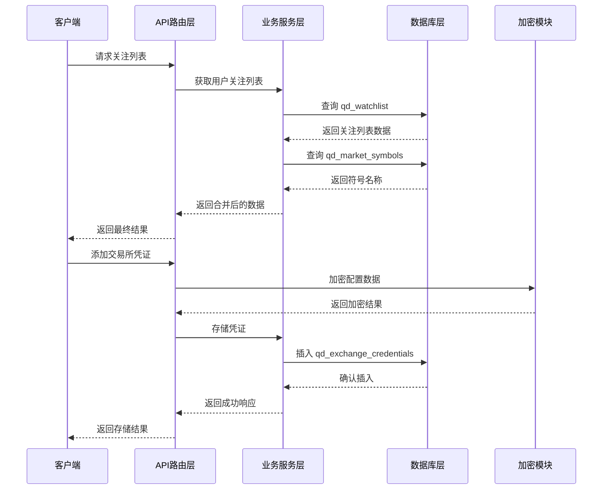

**图表来源**
- [market.py:298-335](file://backend_api_python/app/routes/market.py#L298-L335)
- [credentials.py:201-219](file://backend_api_python/app/routes/credentials.py#L201-L219)
- [credential_crypto.py:25-30](file://backend_api_python/app/utils/credential_crypto.py#L25-L30)

## 详细组件分析

### 关注列表系统 (qd_watchlist)

关注列表系统实现了完整的用户个性化管理功能：

#### 数据结构设计

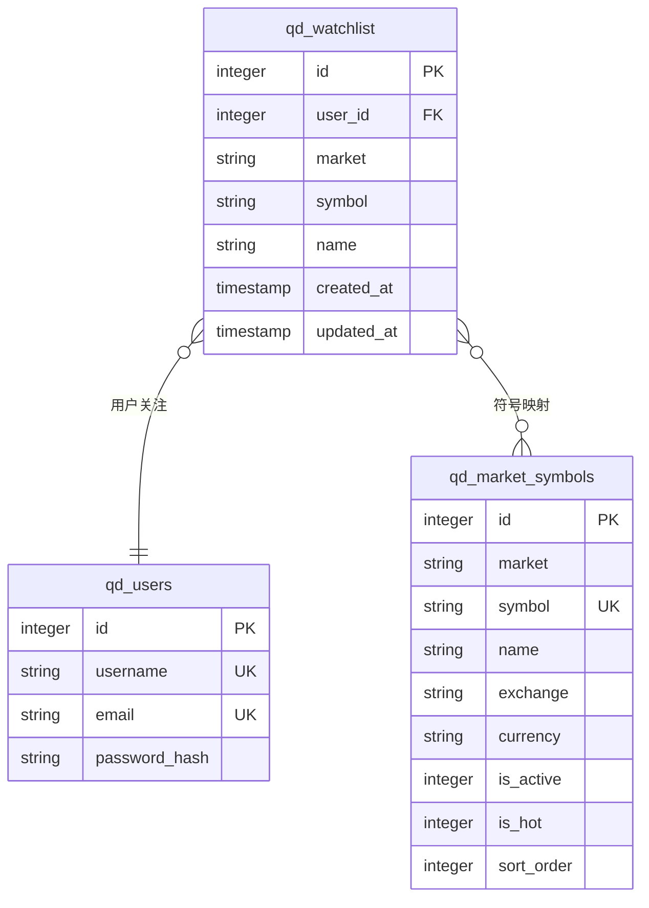

**图表来源**
- [init.sql:427-436](file://backend_api_python/migrations/init.sql#L427-L436)
- [init.sql:621-633](file://backend_api_python/migrations/init.sql#L621-L633)

#### 数据同步机制

关注列表支持自动名称回填机制，确保用户界面的一致性：

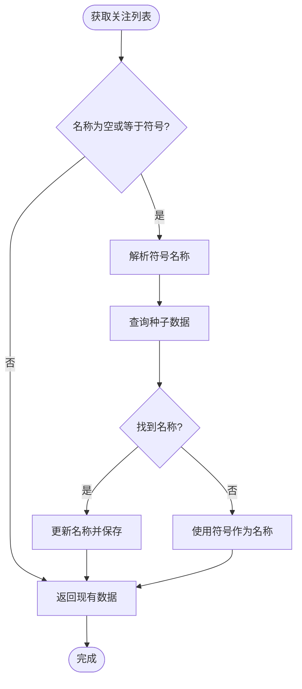

**图表来源**
- [market.py:270-292](file://backend_api_python/app/routes/market.py#L270-L292)

#### 关键操作流程

关注列表的主要操作包括添加、删除和批量获取：

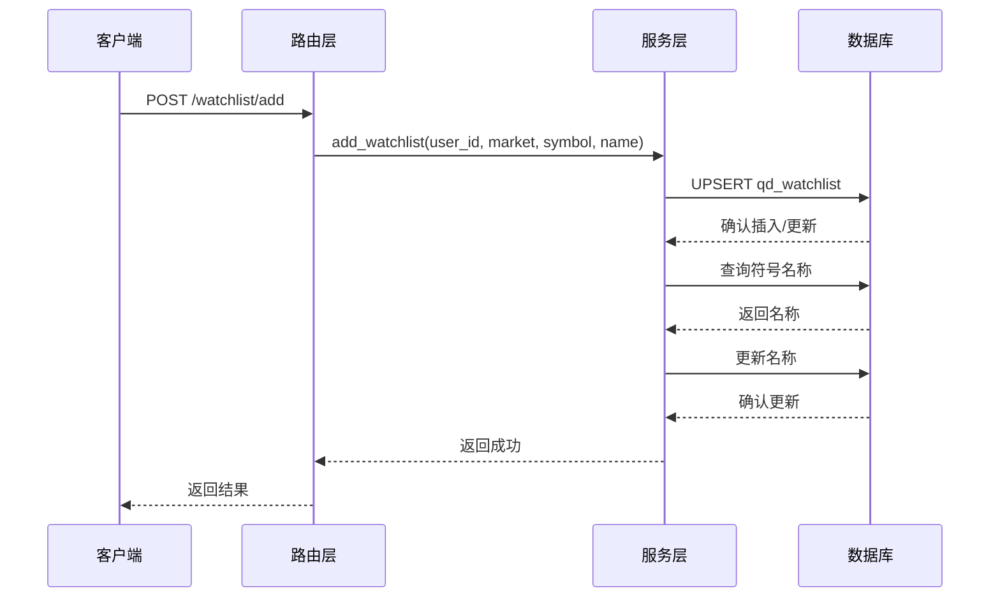

**图表来源**
- [market.py:300-335](file://backend_api_python/app/routes/market.py#L300-L335)

**章节来源**
- [market.py:270-292](file://backend_api_python/app/routes/market.py#L270-L292)
- [market.py:298-335](file://backend_api_python/app/routes/market.py#L298-L335)

### 分析任务系统 (qd_analysis_tasks)

分析任务系统提供了完整的 AI 分析工作流管理：

#### 任务生命周期管理

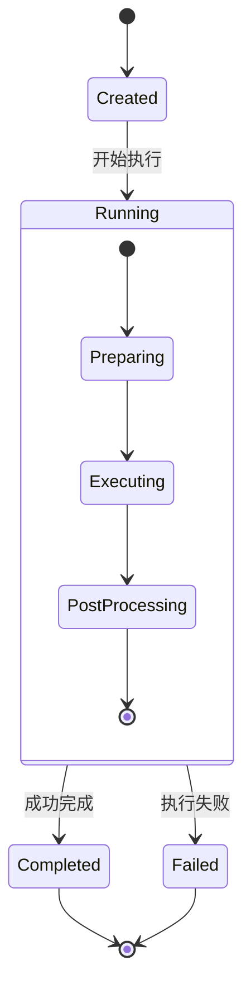

#### 结果存储策略

分析任务的结果存储采用了灵活的 JSON 序列化机制：

- **结构化存储**：result_json 字段存储完整的分析结果对象
- **错误处理**：error_message 字段记录执行过程中的异常信息
- **时间追踪**：created_at 和 completed_at 字段提供完整的时间线

**章节来源**
- [init.sql:444-456](file://backend_api_python/migrations/init.sql#L444-L456)
- [fast_analysis.py:2626-2642](file://backend_api_python/app/services/fast_analysis.py#L2626-L2642)

### 回测系统 (qd_backtest_runs & qd_backtest_trades)

回测系统采用了标准化的三表架构设计：

#### 数据模型关系

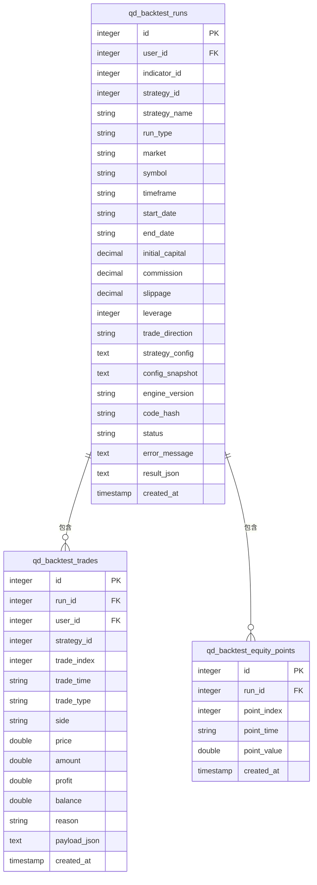

**图表来源**
- [init.sql:464-489](file://backend_api_python/migrations/init.sql#L464-L489)
- [init.sql:496-512](file://backend_api_python/migrations/init.sql#L496-L512)
- [init.sql:516-523](file://backend_api_python/migrations/init.sql#L516-L523)

#### 回测类型区分

run_type 字段用于区分不同类型的回测任务：

- **indicator**：基于指标的回测分析
- **strategy**：基于策略的完整回测
- **custom**：自定义回测任务

#### 状态管理模式

回测系统支持多种状态管理：

- **success**：回测成功完成
- **running**：回测正在执行
- **failed**：回测执行失败
- **cancelled**：回测被取消

**章节来源**
- [init.sql:464-489](file://backend_api_python/migrations/init.sql#L464-L489)
- [init.sql:496-512](file://backend_api_python/migrations/init.sql#L496-L512)
- [init.sql:516-523](file://backend_api_python/migrations/init.sql#L516-L523)

### 凭证管理系统 (qd_exchange_credentials)

凭证管理系统提供了安全的敏感信息存储机制：

#### 加密架构设计

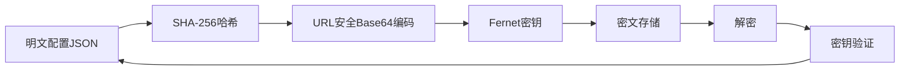

**图表来源**
- [credential_crypto.py:17-30](file://backend_api_python/app/utils/credential_crypto.py#L17-L30)

#### 安全特性

- **对称加密**：使用 Fernet 对称加密算法确保数据机密性
- **密钥管理**：基于环境变量 SECRET_KEY 生成加密密钥
- **安全显示**：api_key_hint 字段提供部分可见的 API 密钥显示
- **访问控制**：严格的用户权限验证机制

#### 数据访问流程

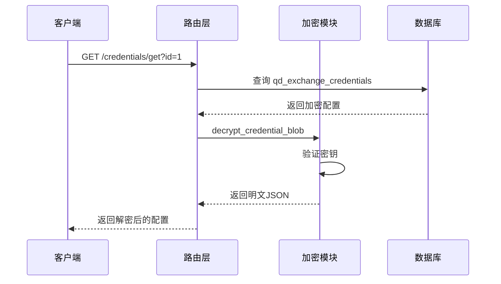

**图表来源**
- [credentials.py:252-296](file://backend_api_python/app/routes/credentials.py#L252-L296)
- [credential_crypto.py:33-49](file://backend_api_python/app/utils/credential_crypto.py#L33-L49)

**章节来源**
- [credentials.py:54-88](file://backend_api_python/app/routes/credentials.py#L54-L88)
- [credentials.py:201-219](file://backend_api_python/app/routes/credentials.py#L201-L219)
- [credentials.py:252-296](file://backend_api_python/app/routes/credentials.py#L252-L296)
- [credential_crypto.py:17-49](file://backend_api_python/app/utils/credential_crypto.py#L17-L49)

### 市场符号种子数据 (qd_market_symbols)

市场符号种子数据提供了完整的市场符号基础信息：

#### 种子数据结构

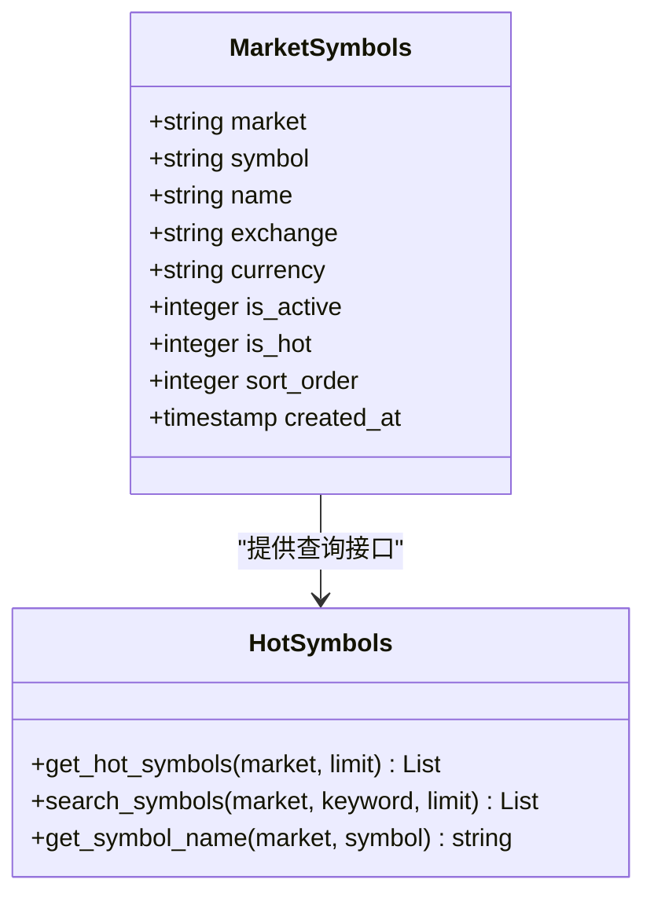

**图表来源**
- [market_symbols_seed.py:26-59](file://backend_api_python/app/data/market_symbols_seed.py#L26-L59)
- [market_symbols_seed.py:61-99](file://backend_api_python/app/data/market_symbols_seed.py#L61-L99)
- [market_symbols_seed.py:112-152](file://backend_api_python/app/data/market_symbols_seed.py#L112-L152)

#### 热门符号查询

系统提供了高效的热门符号查询机制：

- **按市场筛选**：支持按 USStock、Crypto、Forex 等市场类别查询
- **关键词搜索**：支持符号和名称的模糊匹配搜索
- **排序机制**：基于 sort_order 字段进行优先级排序

**章节来源**
- [market_symbols_seed.py:26-59](file://backend_api_python/app/data/market_symbols_seed.py#L26-L59)
- [market_symbols_seed.py:61-99](file://backend_api_python/app/data/market_symbols_seed.py#L61-L99)
- [market_symbols_seed.py:112-152](file://backend_api_python/app/data/market_symbols_seed.py#L112-L152)

## 依赖关系分析

系统中各表之间的依赖关系形成了清晰的数据层次结构：

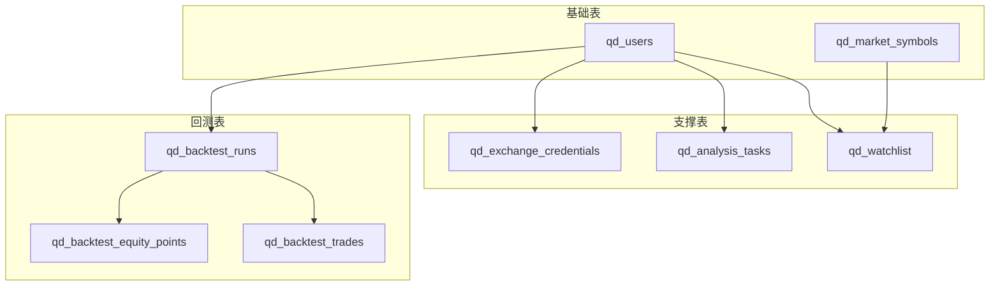

**图表来源**
- [init.sql:427-436](file://backend_api_python/migrations/init.sql#L427-L436)
- [init.sql:444-456](file://backend_api_python/migrations/init.sql#L444-L456)
- [init.sql:531-540](file://backend_api_python/migrations/init.sql#L531-L540)
- [init.sql:464-489](file://backend_api_python/migrations/init.sql#L464-L489)
- [init.sql:496-512](file://backend_api_python/migrations/init.sql#L496-L512)
- [init.sql:516-523](file://backend_api_python/migrations/init.sql#L516-L523)

### 外键约束分析

系统中的外键约束确保了数据的完整性和一致性：

- **qd_watchlist.user_id → qd_users.id**：用户关注列表必须关联有效用户
- **qd_analysis_tasks.user_id → qd_users.id**：分析任务必须关联有效用户
- **qd_exchange_credentials.user_id → qd_users.id**：凭证必须关联有效用户
- **qd_backtest_runs.user_id → qd_users.id**：回测运行必须关联有效用户
- **qd_backtest_trades.run_id → qd_backtest_runs.id**：交易记录必须关联有效回测运行

### 索引优化策略

系统针对高频查询场景建立了相应的索引：

- **qd_watchlist.user_id**：支持用户维度的快速查询
- **qd_analysis_tasks.user_id**：支持分析任务的用户过滤
- **qd_backtest_runs.user_id**：支持回测运行的用户查询
- **qd_backtest_runs.strategy_id**：支持策略维度的回测查询
- **qd_backtest_runs.run_type**：支持回测类型过滤
- **qd_backtest_trades.run_id**：支持回测交易明细查询
- **qd_market_symbols.market**：支持市场维度的符号查询
- **qd_market_symbols.is_hot**：支持热门符号的快速检索

**章节来源**
- [init.sql:427-436](file://backend_api_python/migrations/init.sql#L427-L436)
- [init.sql:444-456](file://backend_api_python/migrations/init.sql#L444-L456)
- [init.sql:531-540](file://backend_api_python/migrations/init.sql#L531-L540)
- [init.sql:464-489](file://backend_api_python/migrations/init.sql#L464-L489)
- [init.sql:496-512](file://backend_api_python/migrations/init.sql#L496-L512)
- [init.sql:516-523](file://backend_api_python/migrations/init.sql#L516-L523)

## 性能考虑

系统在设计时充分考虑了性能优化需求：

### 查询性能优化

- **索引策略**：为高频查询字段建立适当索引，平衡查询速度和写入性能
- **分区策略**：对于大量历史数据，考虑按时间分区存储
- **缓存机制**：实现热点数据的内存缓存，减少数据库访问压力

### 存储优化

- **数据压缩**：对大文本字段（如 result_json）考虑压缩存储
- **归档策略**：实现历史数据的定期归档，保持主表的查询效率
- **增量更新**：支持部分字段的增量更新，减少不必要的全量更新

### 加密性能

- **异步处理**：凭证加密和解密操作采用异步处理，避免阻塞主线程
- **密钥缓存**：加密密钥在内存中缓存，减少密钥派生开销
- **批量操作**：支持批量加密和解密操作，提高处理效率

## 故障排除指南

### 常见问题及解决方案

#### 关注列表重复添加

**问题描述**：用户尝试重复添加相同的符号到关注列表

**解决方法**：
- 系统自动检测 (user_id, market, symbol) 的唯一性约束
- 使用 UPSERT 操作自动更新现有记录的名称和时间戳

#### 凭证解密失败

**问题描述**：无法解密存储的凭证配置

**解决方法**：
- 检查 SECRET_KEY 环境变量是否正确设置
- 验证密文格式是否符合 Fernet 标准
- 确认数据库中的加密数据未被篡改

#### 回测数据不一致

**问题描述**：回测运行与交易记录不匹配

**解决方法**：
- 检查 run_id 外键约束是否正确
- 验证回测运行的状态是否为 success
- 确认交易记录的时间戳顺序正确

#### 符号名称解析失败

**问题描述**：关注列表中的符号名称显示为符号本身

**解决方法**：
- 检查 qd_market_symbols 表中是否存在对应的符号记录
- 验证种子数据是否正确加载
- 确认符号标准化处理逻辑正常工作

**章节来源**
- [market.py:270-292](file://backend_api_python/app/routes/market.py#L270-L292)
- [credentials.py:280-296](file://backend_api_python/app/routes/credentials.py#L280-L296)
- [credential_crypto.py:43-49](file://backend_api_python/app/utils/credential_crypto.py#L43-L49)

## 结论

SharkQuantDinger 项目的支撑数据模型设计体现了以下核心特点：

### 设计优势

1. **数据完整性**：通过外键约束和唯一性约束确保数据一致性
2. **安全性**：采用 Fernet 对称加密保护敏感信息，提供安全的凭证管理
3. **扩展性**：模块化的表结构支持功能的持续扩展和演进
4. **性能优化**：合理的索引设计和查询优化策略
5. **用户体验**：自动化的数据同步和名称解析机制

### 技术亮点

- **回测系统**：标准化的三表架构支持复杂的回测数据分析
- **关注列表**：智能的符号名称解析和数据同步机制
- **凭证管理**：安全的加密存储和便捷的访问控制
- **种子数据**：完善的市场符号基础数据支持

### 发展建议

1. **监控告警**：建立数据库性能监控和异常告警机制
2. **备份策略**：制定完善的数据备份和恢复策略
3. **版本管理**：实现数据库结构的版本化管理
4. **容量规划**：根据业务增长预测数据库容量需求

该支撑数据模型为 SharkQuantDinger 项目提供了坚实的数据基础设施，支持复杂的量化交易功能需求，为系统的长期发展奠定了良好的技术基础。