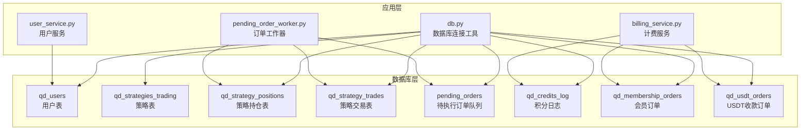
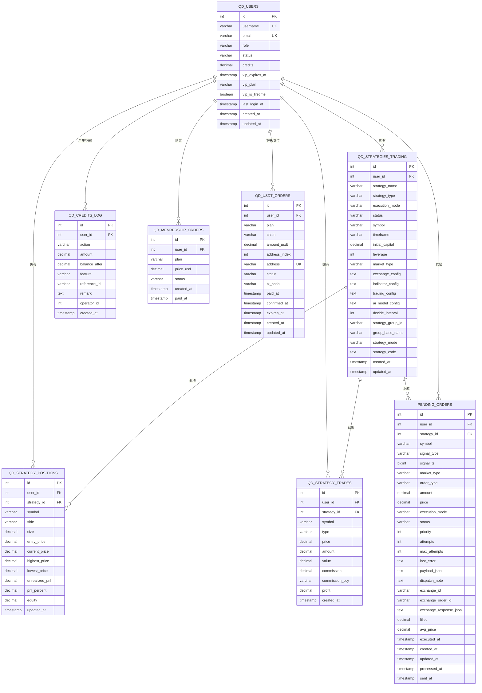
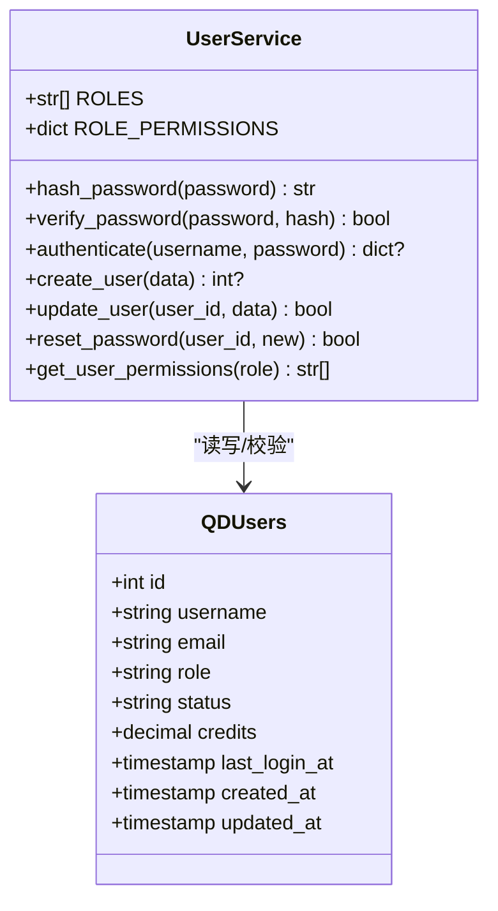
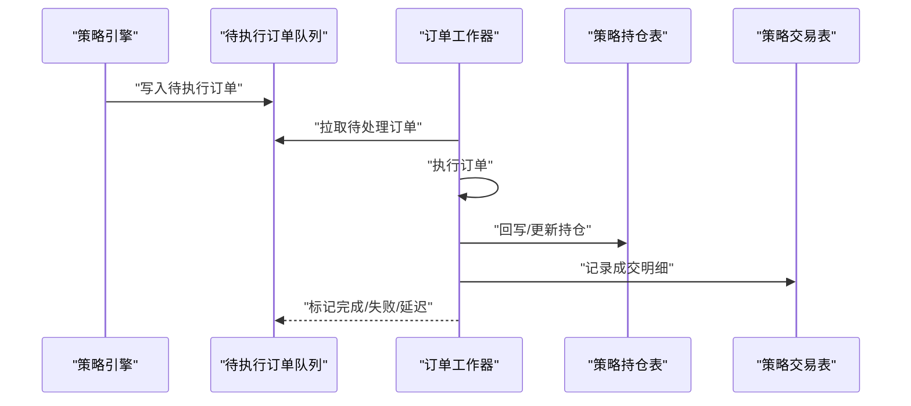
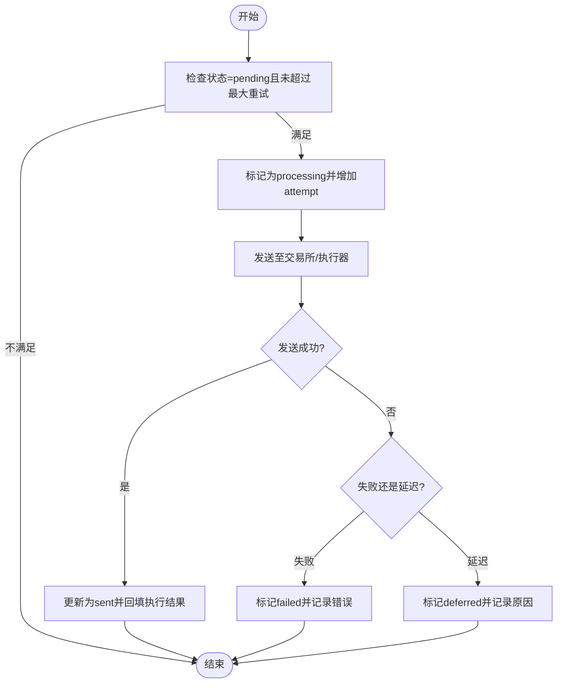
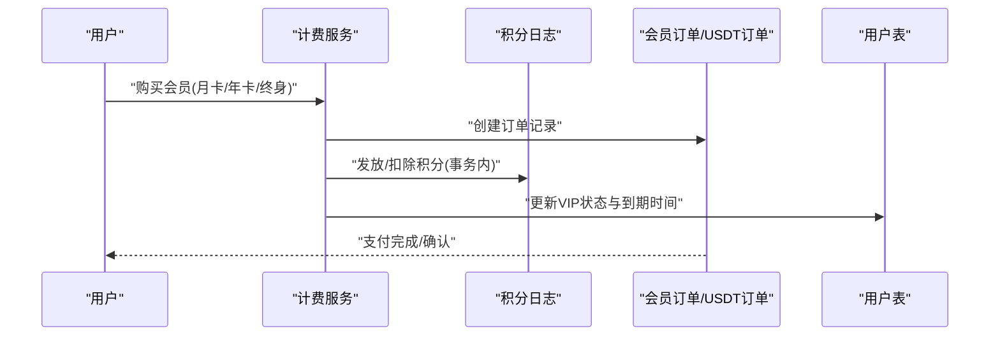
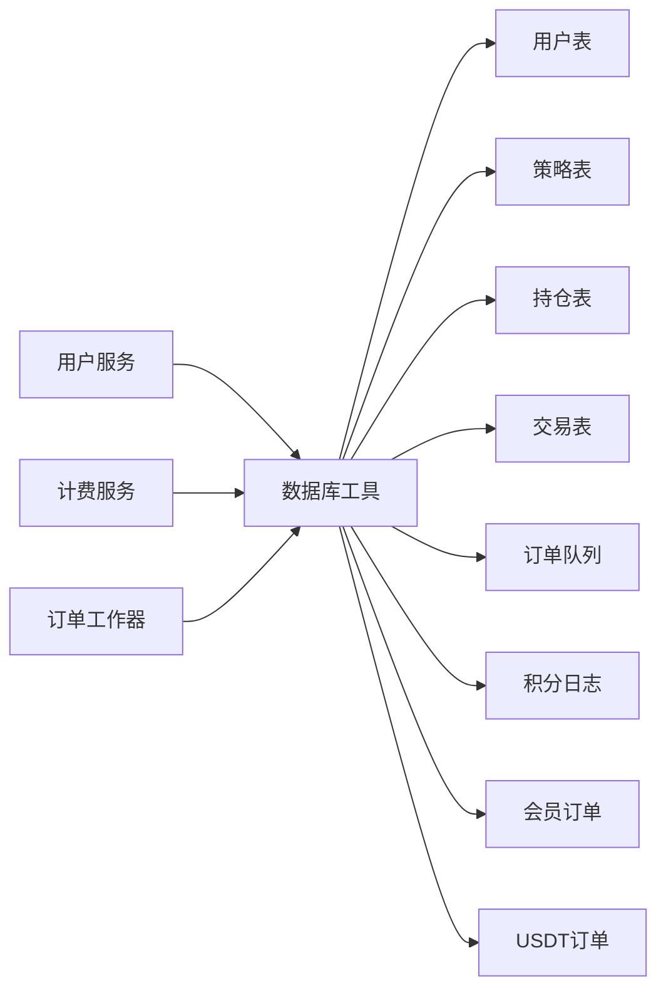

# 核心数据模型

<cite>
**本文档引用的文件**
- [init.sql](file://backend_api_python/migrations/init.sql)
- [user_service.py](file://backend_api_python/app/services/user_service.py)
- [pending_order_worker.py](file://backend_api_python/app/services/pending_order_worker.py)
- [billing_service.py](file://backend_api_python/app/services/billing_service.py)
- [db.py](file://backend_api_python/app/utils/db.py)
</cite>

## 目录
1. [简介](#简介)
2. [项目结构](#项目结构)
3. [核心组件](#核心组件)
4. [架构总览](#架构总览)
5. [详细组件分析](#详细组件分析)
6. [依赖关系分析](#依赖关系分析)
7. [性能考量](#性能考量)
8. [故障排查指南](#故障排查指南)
9. [结论](#结论)
10. [附录](#附录)

## 简介
本文件系统性梳理QuantDinger的核心数据模型，重点覆盖用户与权限模型、策略与交易模型、位置与订单模型、积分与会员系统，并结合实际迁移脚本与服务层实现，给出字段定义、关系约束、状态机与生命周期管理、数据验证规则与业务约束，以及数据完整性保障机制。目标是帮助开发者与运维人员快速理解并正确使用数据库结构。

## 项目结构
QuantDinger采用PostgreSQL作为主数据库，通过初始化迁移脚本一次性创建所有核心表结构。应用层通过统一的数据库工具模块进行连接管理，服务层封装业务逻辑与数据一致性处理。

**图表来源**
- [init.sql:8-338](file://backend_api_python/migrations/init.sql#L8-L338)
- [db.py:19-25](file://backend_api_python/app/utils/db.py#L19-L25)
- [user_service.py:56-68](file://backend_api_python/app/services/user_service.py#L56-L68)
- [billing_service.py:202-321](file://backend_api_python/app/services/billing_service.py#L202-L321)
- [pending_order_worker.py:637-710](file://backend_api_python/app/services/pending_order_worker.py#L637-L710)

**章节来源**
- [init.sql:1-1026](file://backend_api_python/migrations/init.sql#L1-L1026)
- [db.py:1-66](file://backend_api_python/app/utils/db.py#L1-L66)

## 核心组件
本节从数据模型角度拆解核心表及其职责：
- 用户与权限模型：qd_users承载用户身份、角色、状态、积分、VIP等信息；配合服务层的角色权限映射实现细粒度授权。
- 策略与交易模型：qd_strategies_trading记录策略元数据；qd_strategy_positions与qd_strategy_trades分别记录实时持仓与历史成交。
- 位置与订单模型：pending_orders作为统一的待执行订单队列，支持优先级、重试、状态机流转与执行结果回填。
- 积分与会员系统：qd_credits_log记录积分变动流水；qd_membership_orders与qd_usdt_orders支撑会员购买与支付闭环。

**章节来源**
- [init.sql:8-338](file://backend_api_python/migrations/init.sql#L8-L338)
- [user_service.py:56-68](file://backend_api_python/app/services/user_service.py#L56-L68)
- [billing_service.py:181-321](file://backend_api_python/app/services/billing_service.py#L181-L321)

## 架构总览
下图展示核心表之间的实体关系与外键约束，体现策略驱动交易与订单执行的主干流程。

**图表来源**
- [init.sql:8-338](file://backend_api_python/migrations/init.sql#L8-L338)

## 详细组件分析

### 用户与权限模型
- 表结构要点
  - 主键自增id，用户名与邮箱唯一，支持邀请人关联、通知配置、图表模板、时区、单点登录令牌版本等字段。
  - 角色枚举：viewer/user/manager/admin；状态枚举：active/disabled/pending。
  - 积分字段与VIP相关字段用于积分消费与会员权益。
- 权限体系
  - 服务层定义角色到权限的映射，支持装饰器按权限校验。
  - 单用户模式兼容，便于旧版部署。
- 数据完整性
  - 外键约束确保用户删除时级联清理相关记录。
  - 唯一索引保证用户名与邮箱唯一性。
- 安全与审计
  - 登录尝试、验证码、OAuth状态、安全日志等表支撑防暴力破解与审计追踪。

**图表来源**
- [user_service.py:56-68](file://backend_api_python/app/services/user_service.py#L56-L68)
- [user_service.py:194-246](file://backend_api_python/app/services/user_service.py#L194-L246)
- [init.sql:8-31](file://backend_api_python/migrations/init.sql#L8-L31)

**章节来源**
- [user_service.py:56-68](file://backend_api_python/app/services/user_service.py#L56-L68)
- [user_service.py:194-246](file://backend_api_python/app/services/user_service.py#L194-L246)
- [init.sql:8-31](file://backend_api_python/migrations/init.sql#L8-L31)

### 策略与交易模型
- 策略表（qd_strategies_trading）
  - 记录策略元数据：名称、类型、执行模式、状态、标的、时间框架、初始资金、杠杆、市场类型、配置JSON、决策间隔、分组信息、脚本模式与代码等。
  - 提供策略分组与脚本策略扩展字段，支持跨市场与脚本化策略。
- 持仓表（qd_strategy_positions）
  - 记录策略的实时持仓：符号、方向、数量、入场价、当前价、最高/最低价、未实现盈亏、收益率、权益等。
  - 唯一约束保证同一策略、符号、方向仅一条持仓记录。
- 交易表（qd_strategy_trades）
  - 记录策略的历史成交：符号、类型（开多/平空等）、价格、数量、价值、手续费、利润、时间戳等。
- 数据流
  - 策略运行产生信号，进入待执行订单队列；订单执行后回写持仓与交易记录，同时更新积分与会员状态。

**图表来源**
- [init.sql:195-220](file://backend_api_python/migrations/init.sql#L195-L220)
- [init.sql:261-280](file://backend_api_python/migrations/init.sql#L261-L280)
- [init.sql:286-299](file://backend_api_python/migrations/init.sql#L286-L299)
- [pending_order_worker.py:637-710](file://backend_api_python/app/services/pending_order_worker.py#L637-L710)
- [pending_order_worker.py:601-626](file://backend_api_python/app/services/pending_order_worker.py#L601-L626)

**章节来源**
- [init.sql:195-220](file://backend_api_python/migrations/init.sql#L195-L220)
- [init.sql:261-280](file://backend_api_python/migrations/init.sql#L261-L280)
- [init.sql:286-299](file://backend_api_python/migrations/init.sql#L286-L299)
- [pending_order_worker.py:601-626](file://backend_api_python/app/services/pending_order_worker.py#L601-L626)

### 位置与订单模型
- 待执行订单队列（pending_orders）
  - 字段覆盖用户、策略、标的、信号、市场类型、订单类型、数量、价格、执行模式、优先级、重试次数、错误信息、载荷、交换商ID/订单ID、填充量与均价、时间戳等。
  - 状态机：pending → processing → sent/failed/deferred → 结束；支持超时自动重入与最大重试保护。
  - 工作器负责拉取、标记处理、发送、回写执行结果与状态转换。
- 生命周期管理
  - 创建：策略或手动触发写入。
  - 处理：工作器拉取并标记processing，执行后根据结果更新状态与统计字段。
  - 结束：成功则回写filled/avg_price/executed_at，失败/延迟记录last_error与dispatch_note。
- 数据一致性
  - 使用事务与行级锁避免重复处理；超时检测与重入逻辑保障崩溃恢复。

**图表来源**
- [init.sql:309-338](file://backend_api_python/migrations/init.sql#L309-L338)
- [pending_order_worker.py:637-710](file://backend_api_python/app/services/pending_order_worker.py#L637-L710)
- [pending_order_worker.py:2361-2436](file://backend_api_python/app/services/pending_order_worker.py#L2361-L2436)

**章节来源**
- [init.sql:309-338](file://backend_api_python/migrations/init.sql#L309-L338)
- [pending_order_worker.py:637-710](file://backend_api_python/app/services/pending_order_worker.py#L637-L710)
- [pending_order_worker.py:2361-2436](file://backend_api_python/app/services/pending_order_worker.py#L2361-L2436)

### 积分与会员系统
- 积分日志（qd_credits_log）
  - 记录用户积分变动：动作类型（充值/消费/退款/管理员调整/VIP发放）、金额、变动后余额、功能类型、关联ID、备注、操作员等。
  - 通过事务原子更新用户余额并写入日志，保证账实一致。
- 会员订单（qd_membership_orders）
  - 记录传统支付路径的会员购买：计划、价格、状态、时间戳等。
- USDT收款订单（qd_usdt_orders）
  - 记录USDT支付路径的收款订单：链类型、金额、地址索引、地址唯一、状态、交易哈希、时间戳等。
  - 支付确认后激活会员并发放相应积分。
- 业务约束
  - 会员计划定价与积分发放策略在服务层集中管理，支持月卡、年卡、终身卡与终身月度积分发放。
  - USDT订单状态机：pending → paid → confirmed → 结束；幂等确认与激活。

**图表来源**
- [init.sql:42-53](file://backend_api_python/migrations/init.sql#L42-L53)
- [init.sql:63-71](file://backend_api_python/migrations/init.sql#L63-L71)
- [init.sql:79-94](file://backend_api_python/migrations/init.sql#L79-L94)
- [billing_service.py:181-321](file://backend_api_python/app/services/billing_service.py#L181-L321)
- [billing_service.py:202-321](file://backend_api_python/app/services/billing_service.py#L202-L321)

**章节来源**
- [init.sql:42-53](file://backend_api_python/migrations/init.sql#L42-L53)
- [init.sql:63-71](file://backend_api_python/migrations/init.sql#L63-L71)
- [init.sql:79-94](file://backend_api_python/migrations/init.sql#L79-L94)
- [billing_service.py:181-321](file://backend_api_python/app/services/billing_service.py#L181-L321)

## 依赖关系分析
- 组件耦合
  - 用户服务与数据库工具紧密耦合，负责密码哈希、权限校验与用户生命周期管理。
  - 计费服务与积分日志、会员订单、USDT订单强耦合，确保支付与权益发放的一致性。
  - 订单工作器与策略表、持仓表、交易表存在直接写入关系，形成策略-订单-交易闭环。
- 外部依赖
  - PostgreSQL作为唯一数据库后端，迁移脚本集中定义表结构与索引。
  - Redis配置在独立模块中管理，用于缓存与会话存储（非本文重点）。

**图表来源**
- [db.py:19-25](file://backend_api_python/app/utils/db.py#L19-L25)
- [user_service.py:56-68](file://backend_api_python/app/services/user_service.py#L56-L68)
- [billing_service.py:202-321](file://backend_api_python/app/services/billing_service.py#L202-L321)
- [pending_order_worker.py:637-710](file://backend_api_python/app/services/pending_order_worker.py#L637-L710)

**章节来源**
- [db.py:19-25](file://backend_api_python/app/utils/db.py#L19-L25)
- [user_service.py:56-68](file://backend_api_python/app/services/user_service.py#L56-L68)
- [billing_service.py:202-321](file://backend_api_python/app/services/billing_service.py#L202-L321)
- [pending_order_worker.py:637-710](file://backend_api_python/app/services/pending_order_worker.py#L637-L710)

## 性能考量
- 索引策略
  - 用户表：邀请人索引、邮箱/用户名唯一索引。
  - 策略表：用户ID、状态、分组ID索引，加速查询与分页。
  - 持仓表：用户ID、策略ID索引，唯一约束避免重复记录。
  - 交易表：用户ID、策略ID、时间戳索引，支持回测与报表。
  - 订单队列：状态、策略ID、用户ID索引，优先级排序。
  - 积分日志：用户ID、动作、时间戳索引，支持审计与统计。
- 查询优化
  - 分页查询与条件过滤结合索引，避免全表扫描。
  - 批量写入与事务提交，减少锁竞争。
- 缓存与异步
  - 订单工作器采用批量拉取与状态更新，降低数据库压力。
  - 服务层对热点数据（如用户信息）进行缓存与预取。

[本节为通用指导，无需具体文件来源]

## 故障排查指南
- 登录失败
  - 检查用户状态是否为active；核对密码哈希与输入；查看安全日志与登录尝试记录。
- 订单未执行
  - 查看订单状态是否为pending/processing/sent；检查重试次数与最后错误；确认交易所响应与回填字段。
- 积分异常
  - 对比积分日志与用户余额；核对动作类型与参考ID；检查管理员调整记录。
- 会员权益未生效
  - 核对会员订单状态与USDT订单确认状态；检查VIP到期时间与月度积分发放时间。

**章节来源**
- [init.sql:138-189](file://backend_api_python/migrations/init.sql#L138-L189)
- [pending_order_worker.py:637-710](file://backend_api_python/app/services/pending_order_worker.py#L637-L710)
- [billing_service.py:202-321](file://backend_api_python/app/services/billing_service.py#L202-L321)

## 结论
QuantDinger的核心数据模型以qd_users为中心，围绕策略-订单-交易形成闭环，辅以积分与会员系统完善商业化闭环。通过严格的外键约束、唯一索引与事务一致性，保障了数据完整性与业务连续性。服务层在用户认证、权限控制、支付结算与订单调度方面提供了清晰的边界与可维护性。

[本节为总结性内容，无需具体文件来源]

## 附录
- 数据模型示例（字段与含义）
  - 用户表：用户名、邮箱、角色、状态、积分、VIP到期时间、时区、最后登录时间等。
  - 策略表：策略名称、类型、执行模式、状态、标的、时间框架、初始资金、杠杆、配置等。
  - 持仓表：符号、方向、数量、入场价、当前价、最高/最低价、未实现盈亏、收益率、权益等。
  - 交易表：符号、类型、价格、数量、价值、手续费、利润、时间戳等。
  - 订单队列表：符号、信号类型、市场类型、订单类型、数量、价格、执行模式、状态、优先级、重试次数、错误信息、时间戳等。
  - 积分日志：动作类型、金额、变动后余额、功能类型、关联ID、备注、操作员等。
  - 会员订单：计划、价格、状态、时间戳等。
  - USDT订单：计划、链类型、金额、地址索引、地址、状态、交易哈希、时间戳等。

[本节为概览性内容，无需具体文件来源]