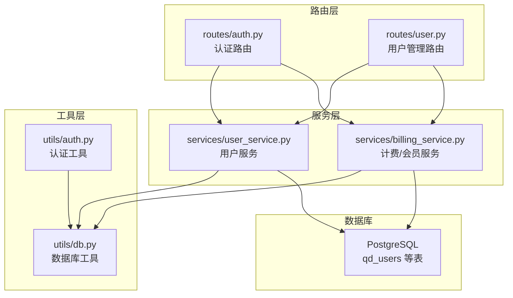
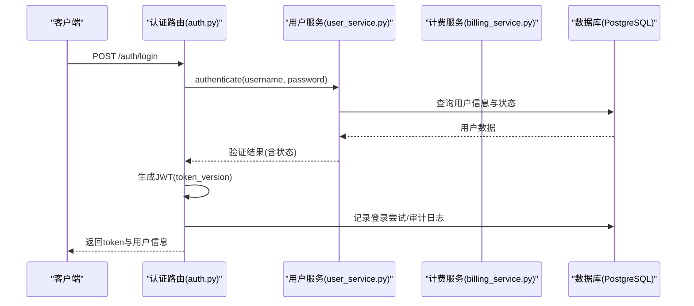
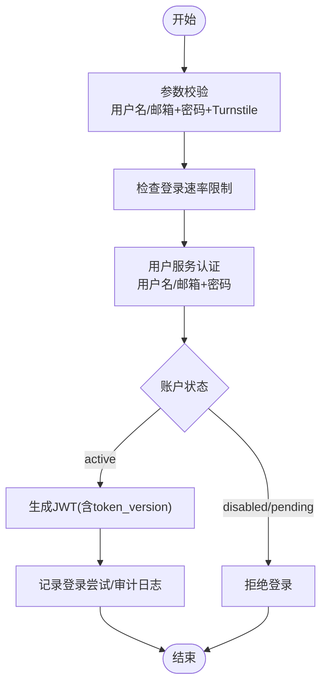
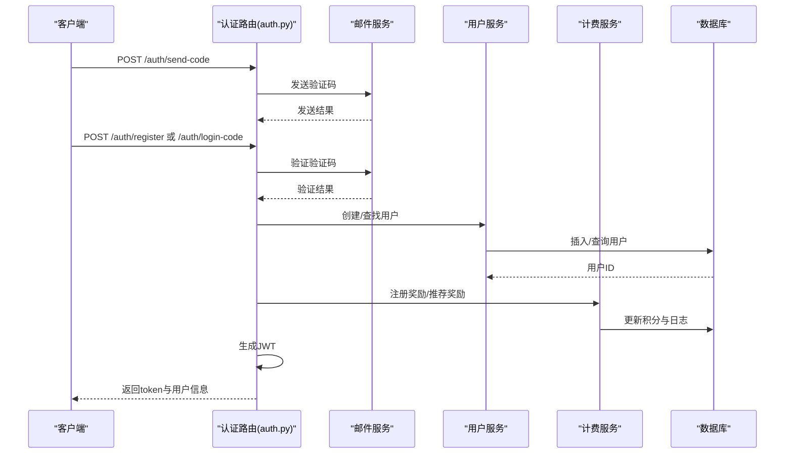
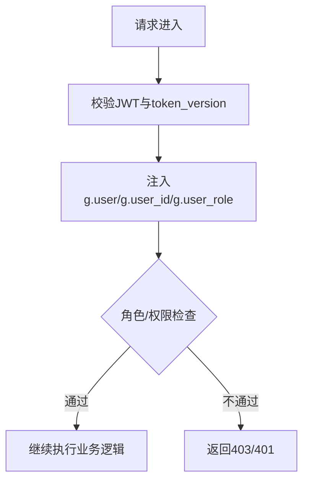
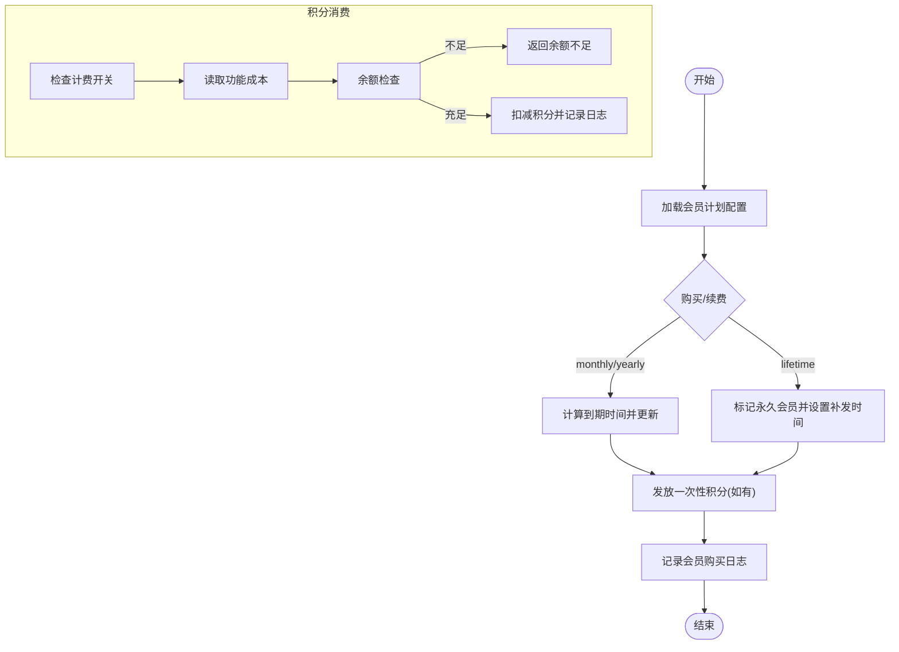
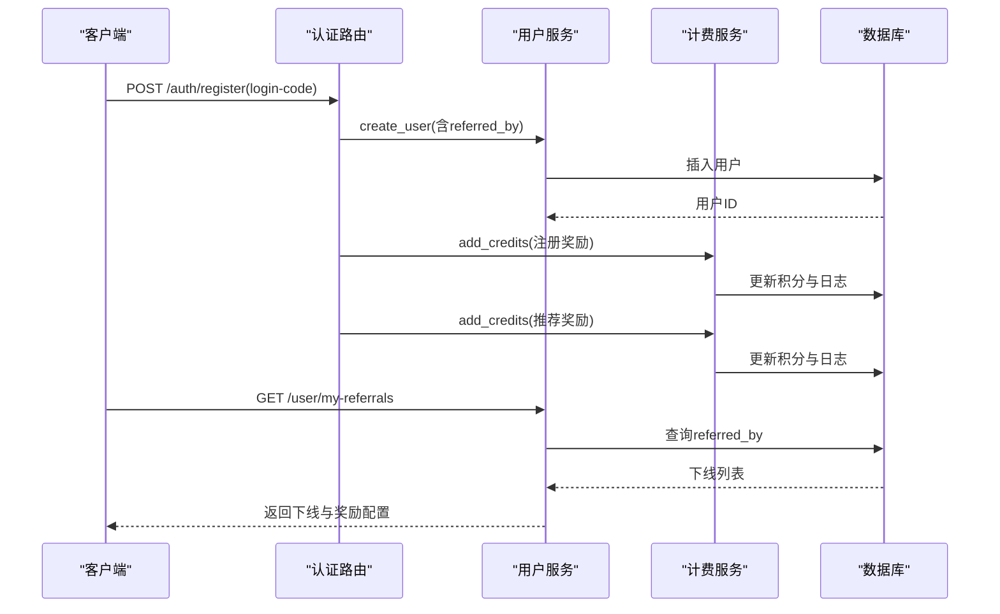
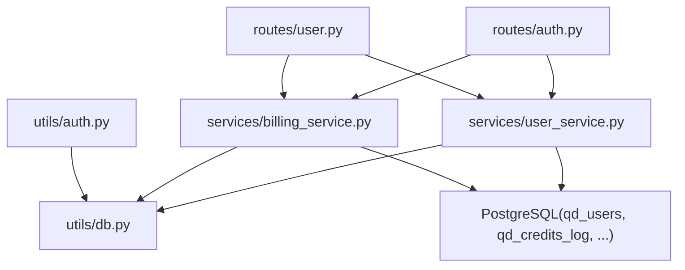

# 用户认证模型

<cite>
**本文档引用的文件**
- [init.sql](file://backend_api_python/migrations/init.sql)
- [user.py](file://backend_api_python/app/routes/user.py)
- [auth.py](file://backend_api_python/app/routes/auth.py)
- [user_service.py](file://backend_api_python/app/services/user_service.py)
- [billing_service.py](file://backend_api_python/app/services/billing_service.py)
- [auth_utils.py](file://backend_api_python/app/utils/auth.py)
- [db.py](file://backend_api_python/app/utils/db.py)
</cite>

## 目录
1. [简介](#简介)
2. [项目结构](#项目结构)
3. [核心组件](#核心组件)
4. [架构总览](#架构总览)
5. [详细组件分析](#详细组件分析)
6. [依赖关系分析](#依赖关系分析)
7. [性能考虑](#性能考虑)
8. [故障排除指南](#故障排除指南)
9. [结论](#结论)

## 简介
本文件系统性阐述 SharkQuantDinger 项目中的用户认证与权限管理数据模型，重点覆盖以下方面：
- qd_users 表的字段定义、作用与约束
- 用户状态管理（active/disabled/pending）与角色权限体系（admin/manager/user/viewer）
- 积分系统与 VIP 会员机制（credits、vip_expires_at、vip_plan、vip_is_lifetime、vip_monthly_credits_last_grant）
- 用户邀请机制（referred_by）与推荐奖励的数据库实现
- 用户表索引策略与性能优化方案
- 用户注册、登录、权限验证的完整数据流程

## 项目结构
围绕用户认证与权限管理的核心文件组织如下：
- 数据库初始化脚本：定义 qd_users 及相关表结构、索引与迁移
- 路由层：用户管理与认证接口
- 服务层：用户业务逻辑、计费与会员管理
- 工具层：认证令牌生成与校验、数据库连接

**图示来源**
- [auth.py:140-278](file://backend_api_python/app/routes/auth.py#L140-L278)
- [user.py:41-116](file://backend_api_python/app/routes/user.py#L41-L116)
- [user_service.py:56-701](file://backend_api_python/app/services/user_service.py#L56-L701)
- [billing_service.py:47-758](file://backend_api_python/app/services/billing_service.py#L47-L758)
- [auth_utils.py:18-114](file://backend_api_python/app/utils/auth.py#L18-L114)
- [db.py:19-31](file://backend_api_python/app/utils/db.py#L19-L31)

**章节来源**
- [init.sql:8-31](file://backend_api_python/migrations/init.sql#L8-L31)
- [auth.py:140-278](file://backend_api_python/app/routes/auth.py#L140-L278)
- [user.py:41-116](file://backend_api_python/app/routes/user.py#L41-L116)
- [user_service.py:56-701](file://backend_api_python/app/services/user_service.py#L56-L701)
- [billing_service.py:47-758](file://backend_api_python/app/services/billing_service.py#L47-L758)
- [auth_utils.py:18-114](file://backend_api_python/app/utils/auth.py#L18-L114)
- [db.py:19-31](file://backend_api_python/app/utils/db.py#L19-L31)

## 核心组件

### qd_users 表字段定义与约束
- id：自增主键
- username：唯一、非空，长度限制在 3-50 字符
- password_hash：非空，支持 bcrypt 或 SHA256 回退
- email：唯一、可空
- nickname：可空
- avatar：默认头像路径
- status：默认 active，支持 active/disabled/pending
- role：默认 user，支持 viewer/user/manager/admin
- credits：积分余额，默认 0
- vip_expires_at：VIP 过期时间戳
- vip_plan：VIP 套餐类型（monthly/yearly/lifetime）
- vip_is_lifetime：是否永久会员
- vip_monthly_credits_last_grant：永久会员上次发放月度积分时间
- email_verified：邮箱是否已验证
- referred_by：邀请人 ID（自引用外键）
- notification_settings：JSON 存储通知配置
- chart_templates：JSON 存储图表模板
- timezone：IANA 时区标识
- token_version：令牌版本号，用于单一客户端登录控制
- last_login_at：最后登录时间
- created_at/updated_at：记录创建与更新时间

**章节来源**
- [init.sql:8-31](file://backend_api_python/migrations/init.sql#L8-L31)

### 角色权限体系
- 角色层级（从低到高）：viewer → user → manager → admin
- 权限映射：
  - viewer：dashboard、view
  - user：dashboard、view、indicator、backtest、strategy、portfolio
  - manager：在 user 基础上增加 settings
  - admin：在 manager 基础上增加 user_manage、credentials

**章节来源**
- [user_service.py:59-68](file://backend_api_python/app/services/user_service.py#L59-L68)

### 积分系统设计
- credits 字段：用户可用积分余额
- 计费开关与功能成本：通过环境变量配置，支持按功能扣费
- 日志表 qd_credits_log：记录充值、消费、退款、管理员调整、VIP 赠送、注册/推荐奖励等
- VIP 会员：
  - monthly/yearly：到期时间累加
  - lifetime：长期有效，并按 30 天周期补发月度积分（最多补 6 期）

**章节来源**
- [init.sql:42-53](file://backend_api_python/migrations/init.sql#L42-L53)
- [billing_service.py:24-44](file://backend_api_python/app/services/billing_service.py#L24-L44)
- [billing_service.py:117-156](file://backend_api_python/app/services/billing_service.py#L117-L156)
- [billing_service.py:202-345](file://backend_api_python/app/services/billing_service.py#L202-L345)
- [billing_service.py:397-459](file://backend_api_python/app/services/billing_service.py#L397-L459)

### 用户邀请机制与推荐奖励
- referred_by：用户注册时可携带邀请人 ID
- 注册奖励：新用户注册即获得注册积分奖励
- 推荐奖励：邀请人获得推荐积分奖励
- 奖励通过计费服务的 add_credits 接口发放并记录日志

**章节来源**
- [auth.py:386-407](file://backend_api_python/app/routes/auth.py#L386-L407)
- [auth.py:689-710](file://backend_api_python/app/routes/auth.py#L689-L710)
- [billing_service.py:527-578](file://backend_api_python/app/services/billing_service.py#L527-L578)

### 索引策略与性能优化
- qd_users.referred_by：用于查询某邀请人的下线用户
- qd_credits_log：按 user_id、action、created_at 建立索引，支撑积分日志查询与统计
- 登录尝试与验证码：针对登录尝试与验证码表建立复合索引，提升风控与查询效率
- 建议：
  - 在高频查询字段（如 username、email、status、role）上建立合适索引
  - 对涉及时间范围的查询（如 created_at、last_login_at）使用索引
  - 对 VIP 相关字段（vip_expires_at、vip_is_lifetime）建立索引以优化会员状态查询

**章节来源**
- [init.sql:33-33](file://backend_api_python/migrations/init.sql#L33-L33)
- [init.sql:55-57](file://backend_api_python/migrations/init.sql#L55-L57)
- [init.sql:130-132](file://backend_api_python/migrations/init.sql#L130-L132)
- [init.sql:148-149](file://backend_api_python/migrations/init.sql#L148-L149)

## 架构总览
用户认证与权限管理的整体流程：
- 客户端发起登录/注册请求
- 认证路由调用用户服务进行身份验证
- 服务层校验状态与密码，生成 JWT 并写入安全审计日志
- 权限装饰器根据角色与权限进行访问控制
- 计费/会员服务参与 VIP 状态与积分的读取与变更

**图示来源**
- [auth.py:140-278](file://backend_api_python/app/routes/auth.py#L140-L278)
- [user_service.py:194-246](file://backend_api_python/app/services/user_service.py#L194-L246)
- [auth_utils.py:18-47](file://backend_api_python/app/utils/auth.py#L18-L47)

## 详细组件分析

### 用户认证流程（用户名/密码）
- 输入校验：用户名或邮箱、密码、Turnstile 校验码
- 登录尝试限制：防爆破与速率限制
- 身份验证：支持用户名与邮箱两种登录方式
- 状态检查：disabled/pending 账户拒绝登录
- 单一客户端登录：每次登录递增 token_version，旧 token 失效
- 成功后记录登录尝试与审计日志

**图示来源**
- [auth.py:140-278](file://backend_api_python/app/routes/auth.py#L140-L278)
- [user_service.py:194-246](file://backend_api_python/app/services/user_service.py#L194-L246)
- [auth_utils.py:82-114](file://backend_api_python/app/utils/auth.py#L82-L114)

**章节来源**
- [auth.py:140-278](file://backend_api_python/app/routes/auth.py#L140-L278)
- [user_service.py:194-246](file://backend_api_python/app/services/user_service.py#L194-L246)
- [auth_utils.py:82-114](file://backend_api_python/app/utils/auth.py#L82-L114)

### 用户认证流程（邮箱验证码）
- 发送验证码：支持 register/reset_password/change_password 等类型
- 验证码校验：校验有效期与使用次数
- 自动注册：若用户不存在且允许注册，则自动创建用户（无密码）
- 推荐奖励：若携带邀请码且邀请人有效，向邀请人发放推荐奖励
- 登录成功后更新最后登录时间并生成 JWT

**图示来源**
- [auth.py:491-751](file://backend_api_python/app/routes/auth.py#L491-L751)
- [auth.py:285-484](file://backend_api_python/app/routes/auth.py#L285-L484)
- [billing_service.py:527-578](file://backend_api_python/app/services/billing_service.py#L527-L578)

**章节来源**
- [auth.py:491-751](file://backend_api_python/app/routes/auth.py#L491-L751)
- [auth.py:285-484](file://backend_api_python/app/routes/auth.py#L285-L484)
- [billing_service.py:527-578](file://backend_api_python/app/services/billing_service.py#L527-L578)

### 权限验证与装饰器
- login_required：解析 Bearer Token，注入用户上下文
- admin_required/manager_required/permission_required：基于角色与权限进行访问控制
- 权限来源于用户服务的角色权限映射

**图示来源**
- [auth_utils.py:126-171](file://backend_api_python/app/utils/auth.py#L126-L171)
- [auth_utils.py:188-217](file://backend_api_python/app/utils/auth.py#L188-L217)
- [user_service.py:656-658](file://backend_api_python/app/services/user_service.py#L656-L658)

**章节来源**
- [auth_utils.py:126-171](file://backend_api_python/app/utils/auth.py#L126-L171)
- [auth_utils.py:188-217](file://backend_api_python/app/utils/auth.py#L188-L217)
- [user_service.py:656-658](file://backend_api_python/app/services/user_service.py#L656-L658)

### VIP 会员与积分管理
- VIP 状态查询：判断是否过期，支持 lifetime 的周期性月度积分补发
- 会员购买：按 plan 类型更新到期时间、套餐类型与标志位，并发放相应积分
- 积分消费：按功能成本检查余额并扣减，记录日志
- 管理员操作：设置积分、设置 VIP 状态并记录日志

**图示来源**
- [billing_service.py:160-200](file://backend_api_python/app/services/billing_service.py#L160-L200)
- [billing_service.py:202-345](file://backend_api_python/app/services/billing_service.py#L202-L345)
- [billing_service.py:461-526](file://backend_api_python/app/services/billing_service.py#L461-L526)

**章节来源**
- [billing_service.py:117-156](file://backend_api_python/app/services/billing_service.py#L117-L156)
- [billing_service.py:202-345](file://backend_api_python/app/services/billing_service.py#L202-L345)
- [billing_service.py:397-459](file://backend_api_python/app/services/billing_service.py#L397-L459)
- [billing_service.py:461-526](file://backend_api_python/app/services/billing_service.py#L461-L526)
- [billing_service.py:527-578](file://backend_api_python/app/services/billing_service.py#L527-L578)
- [billing_service.py:629-673](file://backend_api_python/app/services/billing_service.py#L629-L673)

### 用户邀请与推荐奖励
- 注册流程：支持携带 referral_code，若邀请人有效则设置 referred_by
- 奖励发放：注册奖励与推荐奖励通过计费服务 add_credits 实现
- 下线查询：用户可查询自己的邀请列表

**图示来源**
- [auth.py:581-751](file://backend_api_python/app/routes/auth.py#L581-L751)
- [auth.py:285-484](file://backend_api_python/app/routes/auth.py#L285-L484)
- [user.py:556-635](file://backend_api_python/app/routes/user.py#L556-L635)
- [billing_service.py:527-578](file://backend_api_python/app/services/billing_service.py#L527-L578)

**章节来源**
- [auth.py:581-751](file://backend_api_python/app/routes/auth.py#L581-L751)
- [auth.py:285-484](file://backend_api_python/app/routes/auth.py#L285-L484)
- [user.py:556-635](file://backend_api_python/app/routes/user.py#L556-L635)
- [billing_service.py:527-578](file://backend_api_python/app/services/billing_service.py#L527-L578)

## 依赖关系分析
- 路由层依赖服务层与工具层
- 服务层依赖数据库工具与配置
- 认证工具依赖配置与数据库工具
- 数据库层包含用户、计费日志、登录尝试、验证码等表

**图示来源**
- [auth.py:140-278](file://backend_api_python/app/routes/auth.py#L140-L278)
- [user.py:41-116](file://backend_api_python/app/routes/user.py#L41-L116)
- [user_service.py:56-701](file://backend_api_python/app/services/user_service.py#L56-L701)
- [billing_service.py:47-758](file://backend_api_python/app/services/billing_service.py#L47-L758)
- [auth_utils.py:18-114](file://backend_api_python/app/utils/auth.py#L18-L114)
- [db.py:19-31](file://backend_api_python/app/utils/db.py#L19-L31)

**章节来源**
- [auth.py:140-278](file://backend_api_python/app/routes/auth.py#L140-L278)
- [user.py:41-116](file://backend_api_python/app/routes/user.py#L41-L116)
- [user_service.py:56-701](file://backend_api_python/app/services/user_service.py#L56-L701)
- [billing_service.py:47-758](file://backend_api_python/app/services/billing_service.py#L47-L758)
- [auth_utils.py:18-114](file://backend_api_python/app/utils/auth.py#L18-L114)
- [db.py:19-31](file://backend_api_python/app/utils/db.py#L19-L31)

## 性能考虑
- 登录与认证
  - 使用 token_version 实现单一客户端登录，避免频繁校验用户状态
  - 将 Turnstile 校验前置，减少无效认证请求
- 数据库访问
  - 使用连接池与事务封装，减少连接开销
  - 对高频查询字段建立索引，避免全表扫描
- 计费与会员
  - VIP 状态查询与积分日志查询应利用索引
  - 生命周期内定期清理过期记录，保持表规模可控

[本节为通用指导，无需具体文件引用]

## 故障排除指南
- 登录失败
  - 检查 Turnstile 校验与速率限制
  - 确认用户状态为 active
  - 核对密码哈希与 bcrypt 可用性
- 权限错误
  - 确认角色与权限映射正确
  - 检查装饰器顺序（先 login_required 再权限装饰器）
- 积分异常
  - 核对计费开关与功能成本配置
  - 检查 qd_credits_log 中的记录与余额一致性
- VIP 状态异常
  - 检查 vip_expires_at 与时区转换
  - 确认 lifetime 月度积分补发逻辑执行

**章节来源**
- [auth.py:172-225](file://backend_api_python/app/routes/auth.py#L172-L225)
- [auth_utils.py:126-171](file://backend_api_python/app/utils/auth.py#L126-L171)
- [billing_service.py:461-526](file://backend_api_python/app/services/billing_service.py#L461-L526)

## 结论
本数据模型通过清晰的字段定义、完善的索引策略与严格的权限控制，实现了安全、可扩展的用户认证与权限管理体系。积分与 VIP 机制结合推荐奖励，形成完整的用户生命周期运营闭环。配合路由层的装饰器与服务层的业务封装，整体具备良好的可维护性与扩展性。