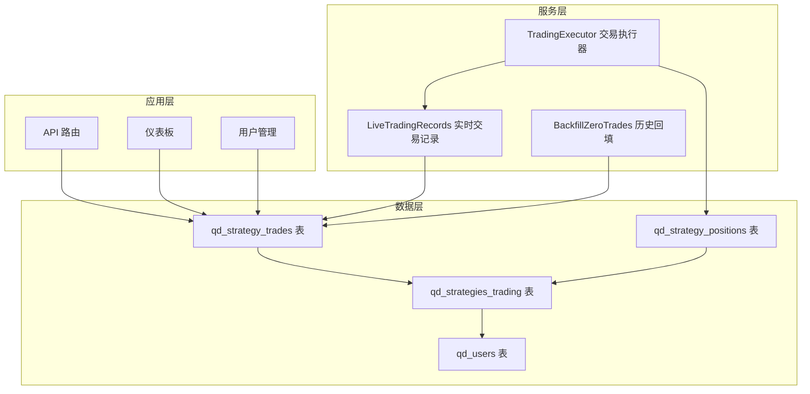
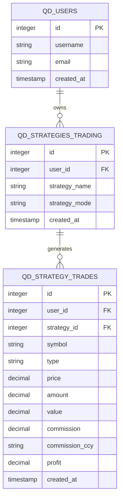
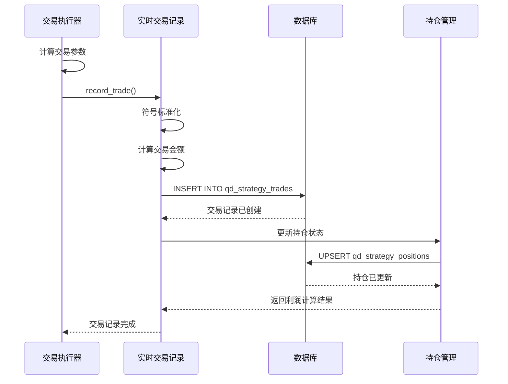
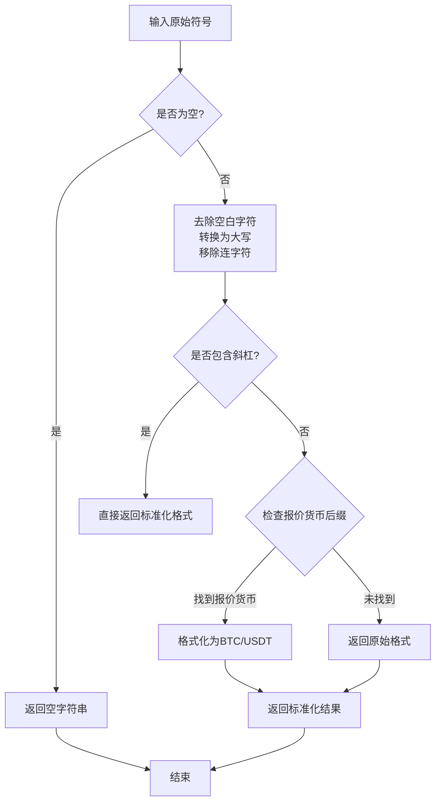
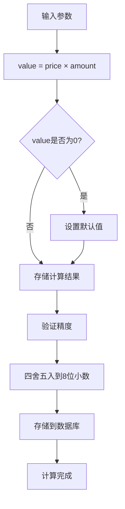
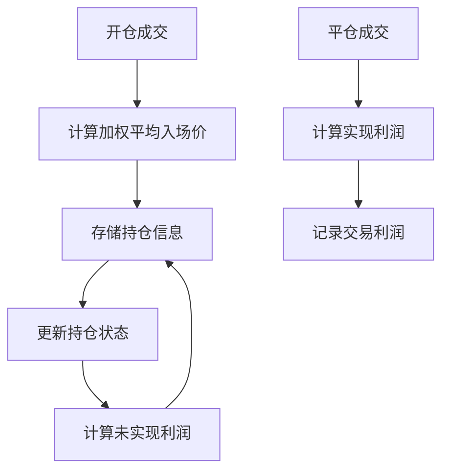
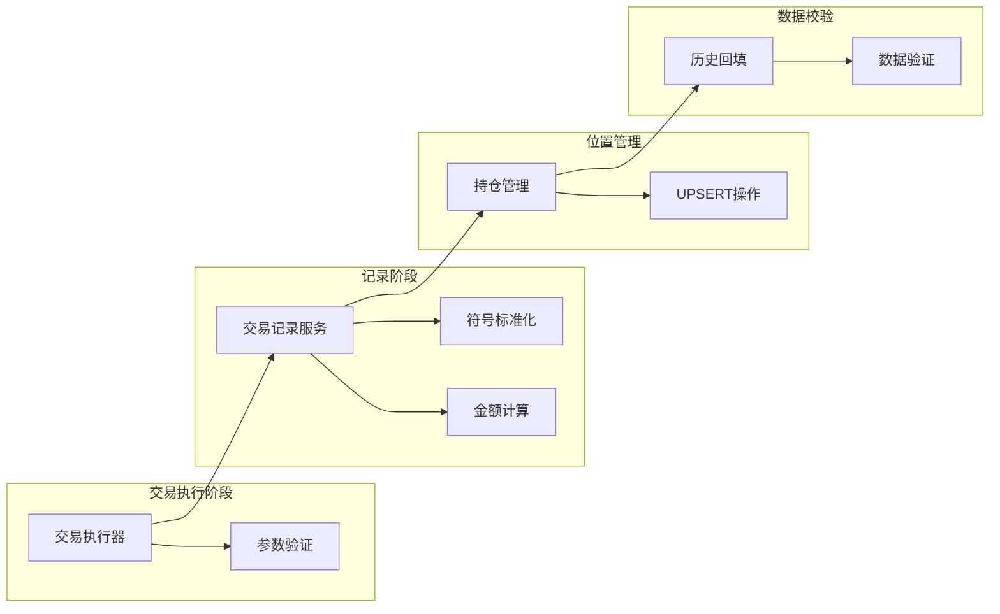

# 交易记录模型

<cite>
**本文档引用的文件**
- [init.sql](file://backend_api_python/migrations/init.sql)
- [records.py](file://backend_api_python/app/services/live_trading/records.py)
- [trading_executor.py](file://backend_api_python/app/services/trading_executor.py)
- [strategy.py](file://backend_api_python/app/routes/strategy.py)
- [dashboard.py](file://backend_api_python/app/routes/dashboard.py)
- [user.py](file://backend_api_python/app/routes/user.py)
- [backfill_zero_trades.py](file://backend_api_python/scripts/backfill_zero_trades.py)
- [quick_trade.py](file://backend_api_python/app/routes/quick_trade.py)
</cite>

## 目录
1. [简介](#简介)
2. [项目结构概览](#项目结构概览)
3. [核心数据模型](#核心数据模型)
4. [架构设计](#架构设计)
5. [详细组件分析](#详细组件分析)
6. [依赖关系分析](#依赖关系分析)
7. [性能考虑](#性能考虑)
8. [故障排除指南](#故障排除指南)
9. [结论](#结论)

## 简介

qd_strategy_trades表是SharkQuantDinger量化交易系统中的核心数据模型，用于存储策略交易记录的完整生命周期。该表设计遵循金融交易数据的严格规范，确保交易记录的准确性、可追溯性和可分析性。

本文档将深入解释交易记录表的核心字段设计，包括主键、外键关联关系、字段标准化处理、交易类型枚举、计算逻辑和精度控制，并提供完整的索引优化策略和数据一致性维护方案。

## 项目结构概览

交易记录模型在整个系统中的位置如下：

**图表来源**
- [init.sql:286-303](file://backend_api_python/migrations/init.sql#L286-L303)
- [records.py:85-125](file://backend_api_python/app/services/live_trading/records.py#L85-L125)
- [trading_executor.py:3398-3407](file://backend_api_python/app/services/trading_executor.py#L3398-L3407)

## 核心数据模型

### 表结构定义

qd_strategy_trades表采用PostgreSQL数据库设计，具有以下核心字段：

| 字段名 | 数据类型 | 约束条件 | 描述 |
|--------|----------|----------|------|
| id | SERIAL | PRIMARY KEY | 主键，自增序列 |
| user_id | INTEGER | NOT NULL DEFAULT 1, REFERENCES qd_users(id) | 用户外键，关联交易记录归属 |
| strategy_id | INTEGER | REFERENCES qd_strategies_trading(id) | 策略外键，关联具体策略实例 |
| symbol | VARCHAR(50) | | 交易对标准化后的标识符 |
| type | VARCHAR(30) | | 交易类型枚举，如open_long、close_short等 |
| price | DECIMAL(20,8) | | 成交价格，精确到8位小数 |
| amount | DECIMAL(20,8) | | 成交数量，精确到8位小数 |
| value | DECIMAL(20,8) | | 交易金额，price × amount |
| commission | DECIMAL(20,8) | DEFAULT 0 | 手续费，精确到8位小数 |
| commission_ccy | VARCHAR(20) | DEFAULT '' | 手续费币种 |
| profit | DECIMAL(20,8) | DEFAULT 0 | 实现利润，用于平仓或减仓 |
| created_at | TIMESTAMP | DEFAULT NOW() | 创建时间戳 |

### 外键关联关系

**图表来源**
- [init.sql:286-303](file://backend_api_python/migrations/init.sql#L286-L303)

**章节来源**
- [init.sql:286-303](file://backend_api_python/migrations/init.sql#L286-L303)

## 架构设计

### 交易记录流程

**图表来源**
- [records.py:85-125](file://backend_api_python/app/services/live_trading/records.py#L85-L125)
- [trading_executor.py:3398-3407](file://backend_api_python/app/services/trading_executor.py#L3398-L3407)

### 符号标准化处理

系统实现了robust的符号标准化机制，确保不同交易所的交易对格式统一：

**图表来源**
- [records.py:17-32](file://backend_api_python/app/services/live_trading/records.py#L17-L32)

**章节来源**
- [records.py:17-32](file://backend_api_python/app/services/live_trading/records.py#L17-L32)

## 详细组件分析

### 交易类型枚举设计

系统支持以下标准交易类型枚举：

| 类型 | 业务含义 | 会计处理 | 位置影响 |
|------|----------|----------|----------|
| open_long | 开多仓 | 增加多头仓位 | 新建或增加多头位置 |
| close_long | 平多仓 | 减少多头仓位 | 减少或删除多头位置 |
| open_short | 开空仓 | 增加空头仓位 | 新建或增加空头位置 |
| close_short | 平空仓 | 减少空头仓位 | 减少或删除空头位置 |
| add_long | 加仓多头 | 增加多头仓位 | 增加多头位置规模 |
| reduce_long | 减仓多头 | 减少多头仓位 | 减少多头位置规模 |
| add_short | 加仓空头 | 增加空头仓位 | 增加空头位置规模 |
| reduce_short | 减仓空头 | 减少空头仓位 | 减少空头位置规模 |

### 交易金额计算逻辑

系统采用精确的decimal计算确保金融数据的准确性：

**图表来源**
- [records.py:97](file://backend_api_python/app/services/live_trading/records.py#L97)

### 手续费计算规则

手续费处理遵循以下规则：

- **commission字段**：存储实际支付的手续费金额，使用DECIMAL(20,8)确保精度
- **commission_ccy字段**：存储手续费币种，如USDT、BNB等
- **会计处理**：手续费从账户余额中扣除，不影响交易金额计算
- **数据来源**：从交易所API回调中获取，部分交易所可能返回0值

### 利润计算方法

系统支持两种利润计算方式：

1. **实时计算**：基于当前市场价格和持仓成本计算未实现利润
2. **历史记录**：平仓时记录实现利润，用于财务对账

**图表来源**
- [records.py:224-277](file://backend_api_python/app/services/live_trading/records.py#L224-L277)

**章节来源**
- [records.py:85-125](file://backend_api_python/app/services/live_trading/records.py#L85-L125)
- [records.py:224-277](file://backend_api_python/app/services/live_trading/records.py#L224-L277)

## 依赖关系分析

### 数据一致性维护

**图表来源**
- [records.py:85-125](file://backend_api_python/app/services/live_trading/records.py#L85-L125)
- [backfill_zero_trades.py:42-63](file://backend_api_python/scripts/backfill_zero_trades.py#L42-L63)

### 查询性能优化

系统通过以下索引策略优化查询性能：

| 索引名称 | 字段组合 | 查询场景 | 性能收益 |
|----------|----------|----------|----------|
| idx_trades_user_id | user_id | 用户级查询 | 快速筛选用户交易 |
| idx_trades_strategy_id | strategy_id | 策略级查询 | 快速筛选策略交易 |
| idx_trades_created_at | created_at | 时间范围查询 | 快速时间序列分析 |
| idx_trades_user_strategy | user_id, strategy_id | 复合条件查询 | 组合过滤优化 |

**章节来源**
- [init.sql:301-303](file://backend_api_python/migrations/init.sql#L301-L303)
- [dashboard.py:400-430](file://backend_api_python/app/routes/dashboard.py#L400-L430)

## 性能考虑

### 精度控制策略

系统采用DECIMAL(20,8)数据类型确保金融计算的精确性：

- **价格精度**：支持最多8位小数，满足高精度交易需求
- **数量精度**：支持最多8位小数，适应各种交易对的最小交易单位
- **金额精度**：通过中间计算确保最终结果的准确性

### 内存优化

- **批量操作**：支持批量插入和更新操作，减少数据库往返
- **连接池管理**：使用连接池复用数据库连接，降低资源消耗
- **延迟加载**：非关键字段采用延迟加载策略

### 缓存策略

- **符号映射缓存**：缓存常用交易对的标准化结果
- **用户策略缓存**：缓存用户和策略的关联关系
- **价格缓存**：缓存常用交易对的实时价格

## 故障排除指南

### 常见问题及解决方案

#### 1. 交易记录缺失问题

**问题描述**：某些交易所返回的成交回报中price/amount/value为0

**解决方案**：
- 使用历史回填脚本自动修复
- 配置订单队列进行二次确认
- 实施数据验证和告警机制

#### 2. 符号格式不一致问题

**问题描述**：不同交易所的交易对格式差异导致查询失败

**解决方案**：
- 实施统一的符号标准化流程
- 建立符号映射表
- 提供模糊匹配查询能力

#### 3. 性能瓶颈问题

**问题描述**：大量交易数据导致查询缓慢

**解决方案**：
- 优化索引策略
- 实施分页查询
- 建立数据归档机制

**章节来源**
- [backfill_zero_trades.py:1-178](file://backend_api_python/scripts/backfill_zero_trades.py#L1-L178)

### 监控和告警

系统提供了完善的监控机制：

- **实时监控**：交易执行成功率和延迟监控
- **异常告警**：数据异常和系统错误告警
- **性能监控**：数据库查询性能和响应时间监控
- **业务监控**：交易量和收益统计监控

## 结论

qd_strategy_trades表作为SharkQuantDinger量化交易系统的核心数据模型，体现了金融交易数据处理的最佳实践。通过精心设计的字段结构、严格的精度控制、完善的索引优化和可靠的数据一致性维护机制，该模型能够有效支持复杂的量化交易场景。

系统的关键优势包括：

1. **标准化设计**：统一的符号格式和交易类型枚举
2. **精确计算**：基于DECIMAL类型的金融计算
3. **性能优化**：合理的索引策略和查询优化
4. **数据完整性**：完善的外键约束和数据校验
5. **扩展性**：支持多种交易所和交易对格式

该数据模型为后续的交易统计分析、风险管理和财务对账提供了坚实的基础，是构建专业量化交易系统的必备组件。