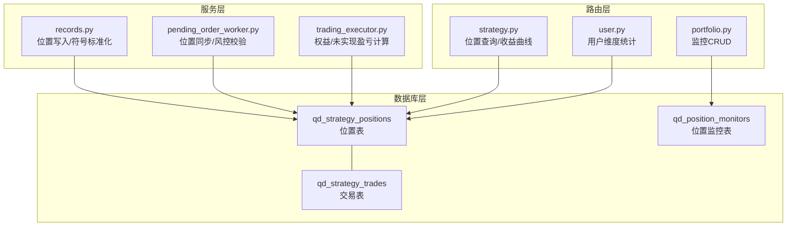
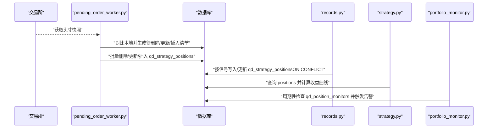
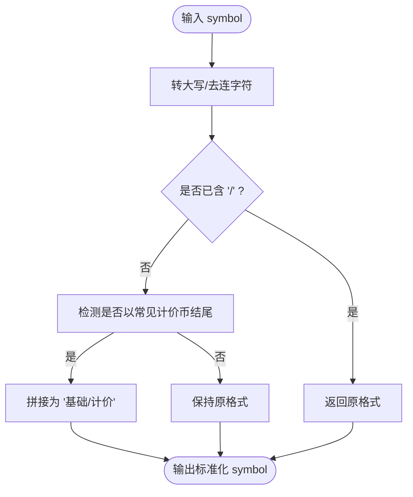
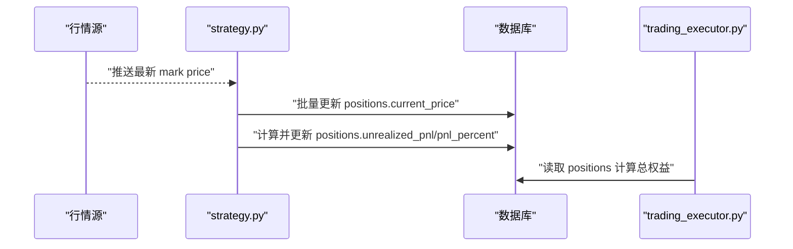
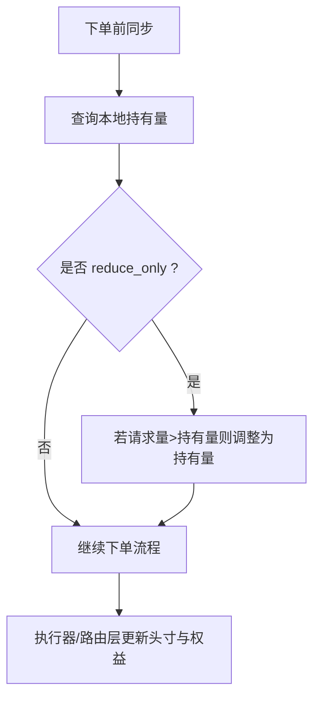
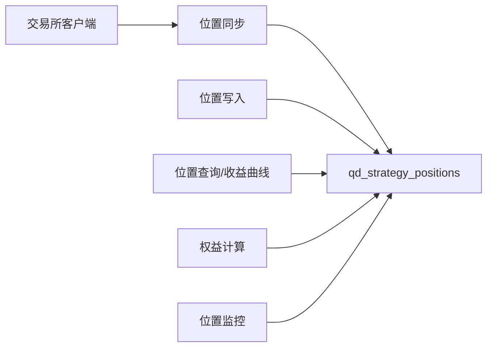

# 位置管理模型

<cite>
**本文引用的文件**
- [init.sql](file://backend_api_python/migrations/init.sql)
- [records.py](file://backend_api_python/app/services/live_trading/records.py)
- [pending_order_worker.py](file://backend_api_python/app/services/pending_order_worker.py)
- [strategy.py](file://backend_api_python/app/routes/strategy.py)
- [user.py](file://backend_api_python/app/routes/user.py)
- [trading_executor.py](file://backend_api_python/app/services/trading_executor.py)
- [portfolio.py](file://backend_api_python/app/routes/portfolio.py)
- [portfolio_monitor.py](file://backend_api_python/app/services/portfolio_monitor.py)
</cite>

## 目录
1. [简介](#简介)
2. [项目结构](#项目结构)
3. [核心组件](#核心组件)
4. [架构总览](#架构总览)
5. [详细组件分析](#详细组件分析)
6. [依赖分析](#依赖分析)
7. [性能考虑](#性能考虑)
8. [故障排查指南](#故障排查指南)
9. [结论](#结论)
10. [附录](#附录)

## 简介
本文件系统性梳理 qd_strategy_positions 表的数据模型与位置管理机制，覆盖以下关键主题：
- 主键与外键关系：id、user_id、strategy_id 的作用与约束
- 符号标准化：symbol 字段的统一格式（如 BTC/USDT、AAPL 等）
- 方向标识：side 字段 long/short 的含义与头寸合并规则
- 仓位大小：size 的加仓/减仓与合并逻辑
- 价格序列：entry_price、current_price、highest_price、lowest_price 的维护与更新
- 收益指标：unrealized_pnl、pnl_percent 的实时计算与更新
- 权益曲线：equity 的计算与资金曲线跟踪
- 唯一约束：(strategy_id, symbol, side) 防止重复头寸
- 时间戳：updated_at 的更新策略与一致性保障
- 风控与监控：位置状态监控与风控执行点位

## 项目结构
与位置管理相关的核心文件与职责如下：
- 数据库迁移脚本：定义 qd_strategy_positions 表结构、索引与唯一约束
- 实盘记录服务：提供符号标准化、位置读取/插入/更新、按成交填充位置
- 订单执行与同步：从交易所抓取头寸快照并同步至本地，执行风控校验
- 路由接口：提供位置查询、收益曲线构建、用户维度统计
- 交易执行器：计算未实现盈亏、权益、日收益等
- 投资组合监控：位置监控器与告警任务调度

图表来源
- [init.sql:261-281](file://backend_api_python/migrations/init.sql#L261-L281)
- [records.py:17-184](file://backend_api_python/app/services/live_trading/records.py#L17-L184)
- [pending_order_worker.py:580-636](file://backend_api_python/app/services/pending_order_worker.py#L580-L636)
- [strategy.py:870-890](file://backend_api_python/app/routes/strategy.py#L870-L890)
- [user.py:1158-1166](file://backend_api_python/app/routes/user.py#L1158-L1166)
- [trading_executor.py:3286-3485](file://backend_api_python/app/services/trading_executor.py#L3286-L3485)
- [portfolio.py:523-697](file://backend_api_python/app/routes/portfolio.py#L523-L697)

章节来源
- [init.sql:261-281](file://backend_api_python/migrations/init.sql#L261-L281)

## 核心组件
- 表结构与约束
  - 主键：id
  - 外键：user_id 引用用户表；strategy_id 引用策略表
  - 唯一约束：(strategy_id, symbol, side) 保证同一策略下同标的同方向仅一条头寸
  - 索引：对 user_id、strategy_id 建有索引以提升查询性能
- 关键字段语义
  - symbol：标准化后的交易对名称（如 BTC/USDT、ETH/USDT、AAPL 等）
  - side：多头/空头方向（long/short）
  - size：头寸数量（base 资产）
  - entry_price：开仓均价
  - current_price：当前标记价/最新价
  - highest_price/lowest_price：历史最高/最低价（用于回撤与风控）
  - unrealized_pnl：未实现盈亏
  - pnl_percent：未实现收益率百分比
  - equity：头寸层面的权益贡献（通常等于未实现盈亏）
  - updated_at：最后更新时间戳

章节来源
- [init.sql:261-281](file://backend_api_python/migrations/init.sql#L261-L281)

## 架构总览
位置管理贯穿“实盘记录服务”“订单执行与同步”“路由接口”“交易执行器”“监控系统”，形成“写入—同步—计算—展示—风控”的闭环。

图表来源
- [pending_order_worker.py:580-636](file://backend_api_python/app/services/pending_order_worker.py#L580-L636)
- [records.py:150-184](file://backend_api_python/app/services/live_trading/records.py#L150-L184)
- [strategy.py:870-890](file://backend_api_python/app/routes/strategy.py#L870-L890)
- [portfolio_monitor.py:1682-1717](file://backend_api_python/app/services/portfolio_monitor.py#L1682-L1717)

## 详细组件分析

### 数据模型与字段设计
- 主键与外键
  - id：自增主键，定位单条头寸记录
  - user_id：默认 1，指向用户表，用于权限隔离与统计
  - strategy_id：指向策略表，决定归属策略
- 唯一约束
  - (strategy_id, symbol, side)：确保同一策略下同一标的同一方向仅存在一条头寸，避免重复头寸导致的统计与风控偏差
- 索引
  - idx_positions_user_id、idx_positions_strategy_id：加速按用户/策略筛选
- 字段类型与精度
  - 数值字段采用高精度 DECIMAL，满足金融计算对精度的要求

章节来源
- [init.sql:261-281](file://backend_api_python/migrations/init.sql#L261-L281)

### 符号标准化与多市场支持
- 标准化规则
  - 统一大写、去除连字符、优先保留斜杠分隔形式
  - 若以常见计价币结尾（如 USDT/USDC/USD/BUSD/EUR），自动补全为“基础/计价”格式
- 查询兼容
  - 提供候选集合：原始、大写、标准化、紧凑（去分隔符）、去连字符的大写形式，提升模糊匹配成功率
- 写入策略
  - 更新已有头寸时沿用数据库中已存在的 symbol；新建头寸时使用标准化后的 symbol
- 交易所映射
  - 不同交易所返回的符号格式不同（如 BTCUSDT、BTC/USDT、INSTID 等），同步时进行格式转换与规范化

图表来源
- [records.py:17-47](file://backend_api_python/app/services/live_trading/records.py#L17-L47)

章节来源
- [records.py:17-70](file://backend_api_python/app/services/live_trading/records.py#L17-L70)

### 方向标识与头寸合并逻辑
- side 含义
  - long：多头；short：空头
- 加仓/减仓/平仓
  - open_* / add_*：加仓，按权重均价更新 entry_price，并更新 highest/lowest
  - close_* / reduce_*：减仓/平仓，按已持有数量与成交数量比较，计算平仓收益后更新剩余头寸或删除头寸
- ON CONFLICT 策略
  - 使用唯一约束（strategy_id, symbol, side）进行 upsert，避免重复头寸
  - 在更新时，若新值为 0 则保留旧值（例如 highest/lowest 仅在新值大于 0 时才覆盖）

章节来源
- [records.py:150-184](file://backend_api_python/app/services/live_trading/records.py#L150-L184)
- [records.py:186-278](file://backend_api_python/app/services/live_trading/records.py#L186-L278)

### 价格序列管理与更新机制
- 字段含义
  - entry_price：开仓均价
  - current_price：当前价格（由外部驱动更新）
  - highest_price/lowest_price：历史最高/最低价，仅在新值有效时更新
- 更新路径
  - 路由层定时更新：根据最新行情批量更新 positions 的 current_price，并同步计算 unrealized_pnl 与 pnl_percent
  - 执行器层：在权益计算时，按最新 mark price 重新计算未实现盈亏
  - 同步器层：在交易所同步时，将 entry_price 与 size 同步到本地

图表来源
- [strategy.py:870-890](file://backend_api_python/app/routes/strategy.py#L870-L890)
- [trading_executor.py:3286-3485](file://backend_api_python/app/services/trading_executor.py#L3286-L3485)

章节来源
- [strategy.py:870-890](file://backend_api_python/app/routes/strategy.py#L870-L890)
- [trading_executor.py:3286-3485](file://backend_api_python/app/services/trading_executor.py#L3286-L3485)

### 收益与权益计算
- 未实现盈亏（unrealized_pnl）
  - 多头：(current_price - entry_price) × size
  - 空头：(entry_price - current_price) × size
- 收益率（pnl_percent）
  - 未实现收益率 = unrealized_pnl / (entry_price × size) × 100%
- 权益（equity）
  - 单头寸权益：等于未实现盈亏
  - 策略总权益：初始资本 + 已实现收益 + 所有头寸未实现盈亏之和
- 收益曲线
  - 由交易流水 realized PnL 与 positions 中 unrealized_pnl 共同构成，叠加当前未实现收益得到实时权益曲线

章节来源
- [trading_executor.py:3286-3485](file://backend_api_python/app/services/trading_executor.py#L3286-L3485)
- [strategy.py:892-949](file://backend_api_python/app/routes/strategy.py#L892-L949)

### 重复头寸防护与数据一致性
- 唯一约束（strategy_id, symbol, side）
  - 通过 ON CONFLICT upsert 保证同一方向仅一条记录
- 符号标准化
  - 写入前统一 symbol 格式，减少因格式差异导致的重复头寸
- 同步器校验
  - 从交易所拉取头寸后，对比本地记录，自动删除“幽灵”头寸、更新缺失字段、插入新头寸
- 时间戳一致性
  - 所有写入/更新均设置 updated_at = NOW()，保证排序与审计

章节来源
- [init.sql:261-281](file://backend_api_python/migrations/init.sql#L261-L281)
- [records.py:150-184](file://backend_api_python/app/services/live_trading/records.py#L150-L184)
- [pending_order_worker.py:580-636](file://backend_api_python/app/services/pending_order_worker.py#L580-L636)

### 风控与监控实现
- 预执行同步
  - 在每次下单前触发一次位置同步，确保风控校验基于真实头寸
- 金额校验
  - reduce_only 场景下，若请求平仓量超过本地持有量，则自动调整为持有量（避免超报）
- 交易所实际头寸校正
  - 对于某些交易所返回的合约数，转换为基础资产数量后再做风控判断
- 位置监控
  - 定时任务扫描 qd_position_monitors，按配置触发价格/收益类告警
  - 支持新增/更新/删除监控项，以及运行间隔与通知配置

图表来源
- [pending_order_worker.py:1100-1150](file://backend_api_python/app/services/pending_order_worker.py#L1100-L1150)
- [pending_order_worker.py:1150-1299](file://backend_api_python/app/services/pending_order_worker.py#L1150-L1299)

章节来源
- [pending_order_worker.py:1100-1299](file://backend_api_python/app/services/pending_order_worker.py#L1100-L1299)
- [portfolio.py:523-697](file://backend_api_python/app/routes/portfolio.py#L523-L697)
- [portfolio_monitor.py:1682-1717](file://backend_api_python/app/services/portfolio_monitor.py#L1682-L1717)

## 依赖分析
- 低耦合高内聚
  - 位置写入集中在 records.py，统一走标准化与 upsert 流程
  - 位置同步集中在 pending_order_worker.py，负责与交易所对账与风控
  - 位置查询与收益曲线集中在 strategy.py 与 trading_executor.py
- 外部依赖
  - 交易所客户端（Binance/OKX/Bybit/Bitget 等）返回的头寸格式不一致，需在同步阶段做格式转换
- 循环依赖
  - 未发现循环导入；模块间通过数据库作为共享状态

图表来源
- [pending_order_worker.py:250-359](file://backend_api_python/app/services/pending_order_worker.py#L250-L359)
- [records.py:150-184](file://backend_api_python/app/services/live_trading/records.py#L150-L184)
- [strategy.py:870-890](file://backend_api_python/app/routes/strategy.py#L870-L890)
- [trading_executor.py:3286-3485](file://backend_api_python/app/services/trading_executor.py#L3286-L3485)
- [portfolio_monitor.py:1682-1717](file://backend_api_python/app/services/portfolio_monitor.py#L1682-L1717)

## 性能考虑
- 索引优化
  - 为 user_id、strategy_id 建立索引，提升按用户/策略筛选效率
- 批量操作
  - 同步器采用批量删除/更新/插入，降低网络往返与锁竞争
- 精度与计算
  - 使用 DECIMAL 类型存储价格与数量，避免浮点误差累积
- 计算拆分
  - realized PnL 与 unrealized PnL 分别计算，避免重复扫描

## 故障排查指南
- 符号不一致导致的重复头寸
  - 症状：同一策略下出现两条相同方向的头寸
  - 排查：确认 symbol 是否经过标准化；检查唯一约束是否生效
  - 参考：[records.py:17-70](file://backend_api_python/app/services/live_trading/records.py#L17-L70)、[init.sql:261-281](file://backend_api_python/migrations/init.sql#L261-L281)
- 未实现盈亏不更新
  - 症状：pnl_percent/unrealized_pnl 长期不变
  - 排查：确认路由层是否定期更新 current_price；执行器是否按最新 mark price 重新计算
  - 参考：[strategy.py:870-890](file://backend_api_python/app/routes/strategy.py#L870-L890)、[trading_executor.py:3286-3485](file://backend_api_python/app/services/trading_executor.py#L3286-L3485)
- 同步后出现“幽灵”头寸
  - 症状：本地存在但交易所无的头寸
  - 排查：检查同步器是否正确识别并删除；确认交易所返回的符号格式转换是否正确
  - 参考：[pending_order_worker.py:580-636](file://backend_api_python/app/services/pending_order_worker.py#L580-L636)
- 下单量异常
  - 症状：reduce_only 请求被拒绝或自动调整
  - 排查：确认本地持有量查询是否成功；检查交易所返回的实际头寸
  - 参考：[pending_order_worker.py:1100-1299](file://backend_api_python/app/services/pending_order_worker.py#L1100-L1299)

章节来源
- [records.py:17-70](file://backend_api_python/app/services/live_trading/records.py#L17-L70)
- [init.sql:261-281](file://backend_api_python/migrations/init.sql#L261-L281)
- [strategy.py:870-890](file://backend_api_python/app/routes/strategy.py#L870-L890)
- [trading_executor.py:3286-3485](file://backend_api_python/app/services/trading_executor.py#L3286-L3485)
- [pending_order_worker.py:580-636](file://backend_api_python/app/services/pending_order_worker.py#L580-L636)
- [pending_order_worker.py:1100-1299](file://backend_api_python/app/services/pending_order_worker.py#L1100-L1299)

## 结论
qd_strategy_positions 表通过严格的唯一约束、符号标准化与 upsert 机制，实现了对多市场、多方向头寸的可靠管理。配合路由层的定期更新与执行器的实时计算，形成了从“写入—同步—计算—监控—风控”的完整闭环，既满足了实时展示需求，也为风控与合规提供了坚实的数据基础。

## 附录
- 用户维度统计字段
  - 总未实现盈亏：按策略聚合 positions.unrealized_pnl
  - 总权益：按策略聚合 positions.equity
  - 交易次数：按策略聚合 trades 计数
- 收益曲线构建
  - 由 realized PnL（交易流水）与 positions.unrealized_pnl 共同构成，叠加当前未实现收益得到实时权益曲线

章节来源
- [user.py:1158-1166](file://backend_api_python/app/routes/user.py#L1158-L1166)
- [strategy.py:892-949](file://backend_api_python/app/routes/strategy.py#L892-L949)