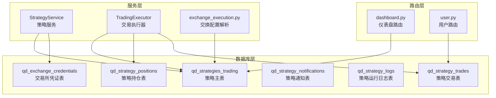
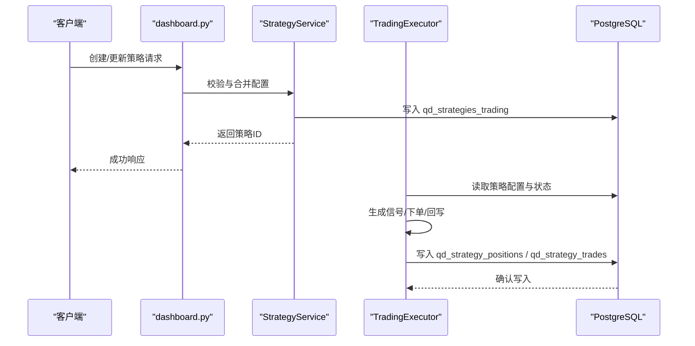
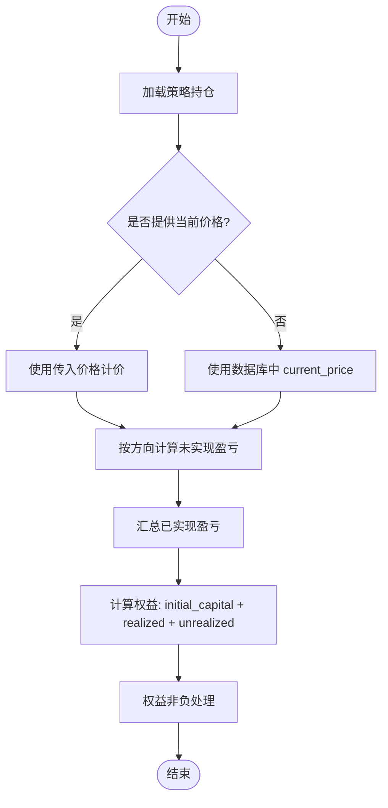
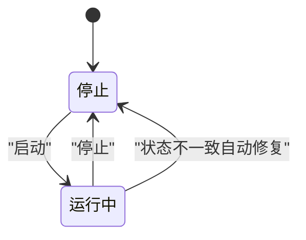
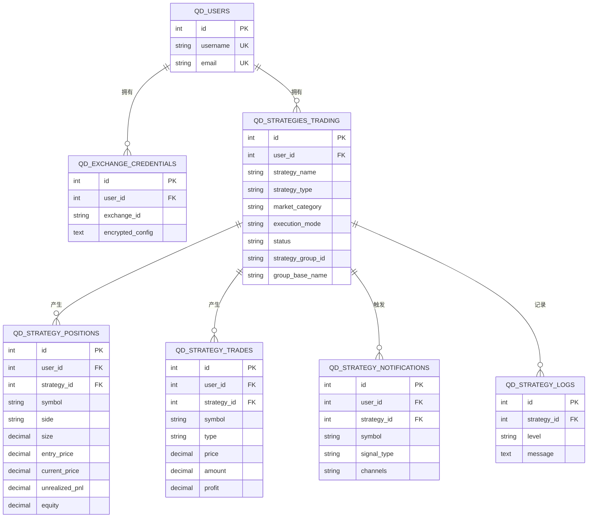

# 策略交易模型

<cite>
**本文引用的文件**
- [init.sql](file://backend_api_python/migrations/init.sql)
- [strategy.py](file://backend_api_python/app/services/strategy.py)
- [trading_executor.py](file://backend_api_python/app/services/trading_executor.py)
- [exchange_execution.py](file://backend_api_python/app/services/exchange_execution.py)
- [CROSS_SECTIONAL_STRATEGY_GUIDE_EN.md](file://docs/CROSS_SECTIONAL_STRATEGY_GUIDE_EN.md)
- [user.py](file://backend_api_python/app/routes/user.py)
- [dashboard.py](file://backend_api_python/app/routes/dashboard.py)
- [community_service.py](file://backend_api_python/app/services/community_service.py)
- [strategy_snapshot.py](file://backend_api_python/app/services/strategy_snapshot.py)
</cite>

## 目录
1. [简介](#简介)
2. [项目结构](#项目结构)
3. [核心组件](#核心组件)
4. [架构总览](#架构总览)
5. [详细组件分析](#详细组件分析)
6. [依赖关系分析](#依赖关系分析)
7. [性能考量](#性能考量)
8. [故障排查指南](#故障排查指南)
9. [结论](#结论)
10. [附录](#附录)

## 简介
本文件系统化梳理策略与交易相关的核心数据模型，围绕以下目标展开：
- 解释 qd_strategies_trading 表的关键字段设计及其业务含义（策略名称、策略类型、市场类别、执行模式、状态管理等）
- 说明策略配置字段（indicator_config、trading_config、exchange_config）的 JSON 结构设计与验证规则
- 详解策略组管理机制（strategy_group_id、group_base_name）与跨市场策略的实现方式
- 解释 qd_strategy_positions 表的位置管理字段（symbol、side、size、entry_price、unrealized_pnl 等）的数据流转与计算逻辑
- 提供 qd_strategy_trades 表的交易记录设计（type、price、amount、profit 等）的业务规则与财务计算
- 总结策略生命周期管理、状态转换与数据一致性保障机制

## 项目结构
本项目采用后端服务与数据库迁移脚本分离的组织方式。策略与交易模型由数据库迁移脚本定义，业务服务负责策略创建、更新、状态管理与执行；前端路由负责展示与交互。

图示来源
- [init.sql:195-220](file://backend_api_python/migrations/init.sql#L195-L220)
- [init.sql:261-280](file://backend_api_python/migrations/init.sql#L261-L280)
- [init.sql:286-299](file://backend_api_python/migrations/init.sql#L286-L299)
- [init.sql:348-364](file://backend_api_python/migrations/init.sql#L348-L364)
- [init.sql:370-376](file://backend_api_python/migrations/init.sql#L370-L376)
- [strategy.py:14-57](file://backend_api_python/app/services/strategy.py#L14-L57)
- [trading_executor.py:418-444](file://backend_api_python/app/services/trading_executor.py#L418-L444)
- [exchange_execution.py:118-147](file://backend_api_python/app/services/exchange_execution.py#L118-L147)
- [dashboard.py:647-662](file://backend_api_python/app/routes/dashboard.py#L647-L662)
- [user.py:1269-1298](file://backend_api_python/app/routes/user.py#L1269-L1298)

章节来源
- [init.sql:195-220](file://backend_api_python/migrations/init.sql#L195-L220)
- [init.sql:261-280](file://backend_api_python/migrations/init.sql#L261-L280)
- [init.sql:286-299](file://backend_api_python/migrations/init.sql#L286-L299)
- [init.sql:348-364](file://backend_api_python/migrations/init.sql#L348-L364)
- [init.sql:370-376](file://backend_api_python/migrations/init.sql#L370-L376)

## 核心组件
- 策略主表（qd_strategies_trading）：承载策略元数据、配置与状态，支持指标型与脚本型策略、信号/实盘执行模式、跨市场与跨符号策略组管理。
- 持仓表（qd_strategy_positions）：记录单策略下按 symbol+side 的未平仓头寸，提供未实现盈亏、最高/最低价、权益等字段。
- 交易表（qd_strategy_trades）：记录策略产生的每笔成交，含手续费、币种、利润等财务字段。
- 通知与日志：qd_strategy_notifications 与 qd_strategy_logs 辅助策略运行监控与告警。
- 服务与路由：StrategyService 负责策略生命周期与配置校验；TradingExecutor 负责策略循环、信号生成与执行；路由层负责对外暴露策略与统计接口。

章节来源
- [init.sql:195-220](file://backend_api_python/migrations/init.sql#L195-L220)
- [init.sql:261-280](file://backend_api_python/migrations/init.sql#L261-L280)
- [init.sql:286-299](file://backend_api_python/migrations/init.sql#L286-L299)
- [init.sql:348-364](file://backend_api_python/migrations/init.sql#L348-L364)
- [init.sql:370-376](file://backend_api_python/migrations/init.sql#L370-L376)
- [strategy.py:927-1020](file://backend_api_python/app/services/strategy.py#L927-L1020)
- [trading_executor.py:3286-3345](file://backend_api_python/app/services/trading_executor.py#L3286-L3345)
- [user.py:1269-1298](file://backend_api_python/app/routes/user.py#L1269-L1298)

## 架构总览
策略从“配置—校验—持久化—执行—回写”闭环运行。服务层负责配置解析与校验，执行器负责策略循环与信号生成，数据库负责状态与结果持久化。

图示来源
- [dashboard.py:647-662](file://backend_api_python/app/routes/dashboard.py#L647-L662)
- [strategy.py:927-1020](file://backend_api_python/app/services/strategy.py#L927-L1020)
- [trading_executor.py:418-444](file://backend_api_python/app/services/trading_executor.py#L418-L444)
- [init.sql:195-220](file://backend_api_python/migrations/init.sql#L195-L220)

## 详细组件分析

### qd_strategies_trading 策略主表字段设计与业务含义
- 核心字段
  - id：自增主键
  - user_id：所属用户，外键约束 qd_users
  - strategy_name：策略显示名称
  - strategy_type：策略类型，支持 IndicatorStrategy（指标型）与 ScriptStrategy（脚本型）
  - market_category：市场类别，如 Crypto/Future/Forex/USStock 等
  - execution_mode：执行模式，signal（仅信号）或 live（实盘）
  - status：策略状态，stopped（停止）、running（运行中）
  - symbol/timeframe：单标策略的标的与周期
  - initial_capital/leverage：初始资金与杠杆
  - market_type：swap（永续）/spot（现货）
  - decide_interval：决策间隔（秒）
  - strategy_group_id/group_base_name：策略组管理字段，支持批量创建/管理
  - strategy_mode：signal/script，区分信号与脚本策略
  - strategy_code：脚本策略源码（文本）
  - indicator_config/trading_config/exchange_config：JSON 配置字段
  - ai_model_config：AI 模型配置（文本）
  - created_at/updated_at：时间戳

- 字段业务要点
  - 策略类型与模式：通过 strategy_type 与 strategy_mode 区分指标型与脚本型策略及运行模式。
  - 市场与执行：market_category 与 execution_mode 控制可用交易所与执行路径；不同交易所对市场类别有限制（例如 MT5 仅 Forex，IBKR 仅 USStock）。
  - 资金与杠杆：initial_capital 与 leverage 影响资金管理与风险控制。
  - 策略组：strategy_group_id 与 group_base_name 支持批量创建与统一管理，便于跨符号/跨市场的组合策略。
  - 配置字段：三类 JSON 配置分别承载指标参数、交易参数与交易所配置，均以文本形式存储，便于灵活扩展。

章节来源
- [init.sql:195-220](file://backend_api_python/migrations/init.sql#L195-L220)
- [strategy.py:949-960](file://backend_api_python/app/services/strategy.py#L949-L960)
- [strategy.py:968-977](file://backend_api_python/app/services/strategy.py#L968-L977)
- [strategy.py:1185-1205](file://backend_api_python/app/services/strategy.py#L1185-L1205)
- [exchange_execution.py:118-147](file://backend_api_python/app/services/exchange_execution.py#L118-L147)

### 策略配置字段（JSON）设计与验证规则
- indicator_config
  - 用途：承载指标参数与指标 ID 等信息，支持社区指标引用与复用。
  - 示例：包含 indicator_id、indicator_params 等键位。
  - 注意：服务层会将 indicator_config 中的 indicator_id 作为查询条件，用于统计使用该指标的策略数量。
- trading_config
  - 用途：交易相关参数，单标与跨标策略均在此配置。
  - 单标参数：symbol、timeframe、initial_capital、leverage、market_type 等。
  - 跨标参数：cs_strategy_type、symbol_list、portfolio_size、long_ratio、rebalance_frequency 等。
  - 验证：当策略类型为跨标时，需确保 symbol_list 非空、rebalance_frequency 合法、portfolio_size 不小于 0 且 long_ratio 在 [0,1]。
- exchange_config
  - 用途：交易所配置，支持直接内联或通过 credential_id 引用已保存凭证。
  - 安全：创建/更新策略时，若存在 credential_id，会移除明文密钥字段，避免敏感信息落库。
  - 校验：exchange_id 与 market_category 必须匹配（如 MT5 仅 Forex，IBKR 仅 USStock）。

章节来源
- [strategy.py:938-967](file://backend_api_python/app/services/strategy.py#L938-L967)
- [strategy.py:980-992](file://backend_api_python/app/services/strategy.py#L980-L992)
- [strategy.py:1265-1279](file://backend_api_python/app/services/strategy.py#L1265-L1279)
- [exchange_execution.py:118-147](file://backend_api_python/app/services/exchange_execution.py#L118-L147)
- [community_service.py:1157-1175](file://backend_api_python/app/services/community_service.py#L1157-L1175)
- [CROSS_SECTIONAL_STRATEGY_GUIDE_EN.md:19-33](file://docs/CROSS_SECTIONAL_STRATEGY_GUIDE_EN.md#L19-L33)

### 策略组管理机制（strategy_group_id、group_base_name）
- 策略组
  - 通过 strategy_group_id 将一组策略归档，便于批量启停、查询与统计。
  - group_base_name 作为组名前缀，结合具体 symbol 自动生成策略名称，提升可读性。
- 批量创建
  - 服务层支持按 symbol 列表批量创建策略，统一注入 group_base_name 与 strategy_group_id，并在 trading_config 中写入当前 symbol。
- 查询与统计
  - 可按 strategy_group_id 查询组内策略 ID 列表，用于批量操作与汇总统计。

章节来源
- [strategy.py:1092-1110](file://backend_api_python/app/services/strategy.py#L1092-L1110)
- [strategy.py:1185-1205](file://backend_api_python/app/services/strategy.py#L1185-L1205)
- [strategy.py:1128-1164](file://backend_api_python/app/services/strategy.py#L1128-L1164)

### 跨市场策略与跨符号策略实现
- 跨标策略（Cross-Sectional）
  - 通过 trading_config 中的 cs_strategy_type="cross_sectional" 标识。
  - 配置项包括 symbol_list、portfolio_size、long_ratio、rebalance_frequency 等。
  - 执行器根据指标评分与排序生成信号，批量并发执行，支持每日/每周/每月调仓。
- 跨市场策略
  - 通过 market_category 与 execution_mode 控制策略适用的市场与执行方式。
  - 不同交易所对市场类别有限制（如 MT5 仅 Forex，IBKR 仅 USStock），服务层在创建/更新时进行校验。
- 脚本策略（ScriptStrategy）
  - 通过 strategy_type=ScriptStrategy 与 strategy_mode=script 或 strategy_mode=signal 实现。
  - strategy_code 存储策略源码，支持更灵活的策略逻辑。

章节来源
- [CROSS_SECTIONAL_STRATEGY_GUIDE_EN.md:1-13](file://docs/CROSS_SECTIONAL_STRATEGY_GUIDE_EN.md#L1-L13)
- [CROSS_SECTIONAL_STRATEGY_GUIDE_EN.md:19-33](file://docs/CROSS_SECTIONAL_STRATEGY_GUIDE_EN.md#L19-L33)
- [strategy.py:949-960](file://backend_api_python/app/services/strategy.py#L949-L960)
- [strategy.py:1272-1279](file://backend_api_python/app/services/strategy.py#L1272-L1279)
- [trading_executor.py:3770-3833](file://backend_api_python/app/services/trading_executor.py#L3770-L3833)

### qd_strategy_positions 持仓管理字段与计算逻辑
- 关键字段
  - symbol/side：标的与方向（long/short）
  - size/entry_price：头寸规模与开仓均价
  - current_price/highest_price/lowest_price：当前价与历史最高/最低价
  - unrealized_pnl/pnl_percent：未实现盈亏与百分比
  - equity：账户权益（由 realized_pnl 与 unrealized_pnl 推导）
  - updated_at：更新时间
- 数据流与计算
  - 未实现盈亏：按方向计算（多头：(current_price - entry_price) * size；空头：(entry_price - current_price) * size）
  - 权益：initial_capital + realized_pnl + unrealized_pnl（非负）
  - 服务层提供按策略与符号聚合的权益计算函数，支持传入当前价格以覆盖未实现盈亏的计价。

图示来源
- [trading_executor.py:3320-3345](file://backend_api_python/app/services/trading_executor.py#L3320-L3345)
- [trading_executor.py:3286-3318](file://backend_api_python/app/services/trading_executor.py#L3286-L3318)
- [init.sql:261-280](file://backend_api_python/migrations/init.sql#L261-L280)

章节来源
- [init.sql:261-280](file://backend_api_python/migrations/init.sql#L261-L280)
- [trading_executor.py:3320-3345](file://backend_api_python/app/services/trading_executor.py#L3320-L3345)
- [trading_executor.py:3286-3318](file://backend_api_python/app/services/trading_executor.py#L3286-L3318)

### qd_strategy_trades 交易记录设计与财务规则
- 关键字段
  - symbol/type：标的与交易类型（open_long/close_short 等）
  - price/amount/value：成交价、数量与名义价值
  - commission/commission_ccy：手续费与币种
  - profit：已实现利润（通常为 realized_pnl 的累加项）
  - created_at：成交时间
- 业务规则
  - 已实现利润：每笔成交的 profit 累加得到 realized_pnl，用于权益计算。
  - 财务一致性：手续费以 decimal 存储，便于精确计算。
  - 统计口径：用户路由按策略聚合 realized_pnl 与交易次数，用于展示收益与频率。

章节来源
- [init.sql:286-299](file://backend_api_python/migrations/init.sql#L286-L299)
- [user.py:1269-1298](file://backend_api_python/app/routes/user.py#L1269-L1298)

### 策略生命周期管理、状态转换与数据一致性
- 生命周期
  - 创建：校验 exchange_id 与 market_category 的兼容性，清理敏感字段，写入策略主表。
  - 启动：线程池启动策略执行循环，更新状态为 running。
  - 停止：线程停止，状态更新为 stopped；若线程不存在而状态仍为 running，则自动修复为 stopped，避免“僵尸”状态。
  - 批量操作：支持批量启停，逐个校验与更新。
- 状态一致性
  - 数据库状态与线程状态双轨校验，发现不一致时强制修正，确保 UI 与实际运行状态一致。
- 运行日志与通知
  - 日志表记录策略运行级别消息，通知表用于推送信号与告警，辅助运维与风控。

图示来源
- [strategy.py:1128-1164](file://backend_api_python/app/services/strategy.py#L1128-L1164)
- [trading_executor.py:1543-1570](file://backend_api_python/app/services/trading_executor.py#L1543-L1570)

章节来源
- [strategy.py:1128-1164](file://backend_api_python/app/services/strategy.py#L1128-L1164)
- [trading_executor.py:1543-1570](file://backend_api_python/app/services/trading_executor.py#L1543-L1570)

## 依赖关系分析
- 表间依赖
  - qd_strategy_positions.strategy_id → qd_strategies_trading.id（级联删除）
  - qd_strategy_trades.strategy_id → qd_strategies_trading.id（级联删除）
  - qd_strategy_notifications.strategy_id → qd_strategies_trading.id（级联删除）
  - qd_strategy_logs.strategy_id → qd_strategies_trading.id（级联删除）
  - qd_exchange_credentials.user_id → qd_users.id（级联删除）
- 服务依赖
  - StrategyService 依赖 exchange_execution 解析交易所配置，并对策略配置进行校验与持久化。
  - TradingExecutor 依赖策略配置与数据库状态，驱动策略循环、信号生成与执行。
  - 路由层依赖服务层完成策略创建、更新与统计查询。

图示来源
- [init.sql:8-31](file://backend_api_python/migrations/init.sql#L8-L31)
- [init.sql:531-542](file://backend_api_python/migrations/init.sql#L531-L542)
- [init.sql:195-220](file://backend_api_python/migrations/init.sql#L195-L220)
- [init.sql:261-280](file://backend_api_python/migrations/init.sql#L261-L280)
- [init.sql:286-299](file://backend_api_python/migrations/init.sql#L286-L299)
- [init.sql:348-364](file://backend_api_python/migrations/init.sql#L348-L364)
- [init.sql:370-376](file://backend_api_python/migrations/init.sql#L370-L376)

章节来源
- [init.sql:8-31](file://backend_api_python/migrations/init.sql#L8-L31)
- [init.sql:531-542](file://backend_api_python/migrations/init.sql#L531-L542)
- [init.sql:195-220](file://backend_api_python/migrations/init.sql#L195-L220)
- [init.sql:261-280](file://backend_api_python/migrations/init.sql#L261-L280)
- [init.sql:286-299](file://backend_api_python/migrations/init.sql#L286-L299)
- [init.sql:348-364](file://backend_api_python/migrations/init.sql#L348-L364)
- [init.sql:370-376](file://backend_api_python/migrations/init.sql#L370-L376)

## 性能考量
- 并发与批处理
  - 跨标策略执行采用线程池并发批量执行信号，最大并发受控，避免对交易所造成过大压力。
- 索引优化
  - 策略主表对 user_id、status、strategy_group_id 建有索引，利于快速筛选与分页。
  - 交易与持仓表对 user_id、strategy_id、created_at 建有索引，支撑高频查询与统计。
- 数值精度
  - 所有金额与价格使用 decimal(20,8)，确保金融计算精度。
- 配置与凭证
  - 敏感配置通过 credential_id 引用，避免明文落库，降低泄露风险。

## 故障排查指南
- 策略无法启动
  - 检查 exchange_id 与 market_category 是否匹配（如 MT5 仅 Forex，IBKR 仅 USStock）。
  - 检查策略状态是否为 running 但线程已停止，必要时触发自动修复。
- 交易统计异常
  - 核对 realized_pnl 的计算来源（qd_strategy_trades.profit 累加），确认手续费与币种字段正确。
- 持仓未更新
  - 确认 current_price 是否正确传入，或检查数据库中 current_price 是否更新。
- 跨标策略未执行
  - 检查 trading_config 中 cs_strategy_type、symbol_list、rebalance_frequency 是否配置正确。
  - 查看日志表与通知表，确认信号生成与执行流程是否正常。

章节来源
- [strategy.py:949-960](file://backend_api_python/app/services/strategy.py#L949-L960)
- [strategy.py:1272-1279](file://backend_api_python/app/services/strategy.py#L1272-L1279)
- [trading_executor.py:1543-1570](file://backend_api_python/app/services/trading_executor.py#L1543-L1570)
- [user.py:1269-1298](file://backend_api_python/app/routes/user.py#L1269-L1298)
- [CROSS_SECTIONAL_STRATEGY_GUIDE_EN.md:210-224](file://docs/CROSS_SECTIONAL_STRATEGY_GUIDE_EN.md#L210-L224)

## 结论
本数据模型以 qd_strategies_trading 为核心，通过 indicator_config、trading_config、exchange_config 三类 JSON 配置实现策略的高扩展性；配合策略组管理与跨标策略机制，满足多市场、多符号的复杂交易需求。服务层在创建与更新阶段严格校验配置与执行限制，在运行阶段通过状态一致性机制保障策略稳定执行。财务层面以 decimal 精度与标准化字段设计确保统计与风控的准确性。

## 附录
- 策略快照与运行参数
  - 服务层提供策略快照构建方法，将策略配置与运行参数序列化输出，便于前端展示与调试。
- 仪表盘与用户路由
  - 仪表盘路由对 exchange_id 与通知渠道进行安全派生，避免敏感信息泄露；用户路由提供按策略聚合的交易统计。

章节来源
- [strategy_snapshot.py:173-200](file://backend_api_python/app/services/strategy_snapshot.py#L173-L200)
- [dashboard.py:647-662](file://backend_api_python/app/routes/dashboard.py#L647-L662)
- [user.py:1269-1298](file://backend_api_python/app/routes/user.py#L1269-L1298)