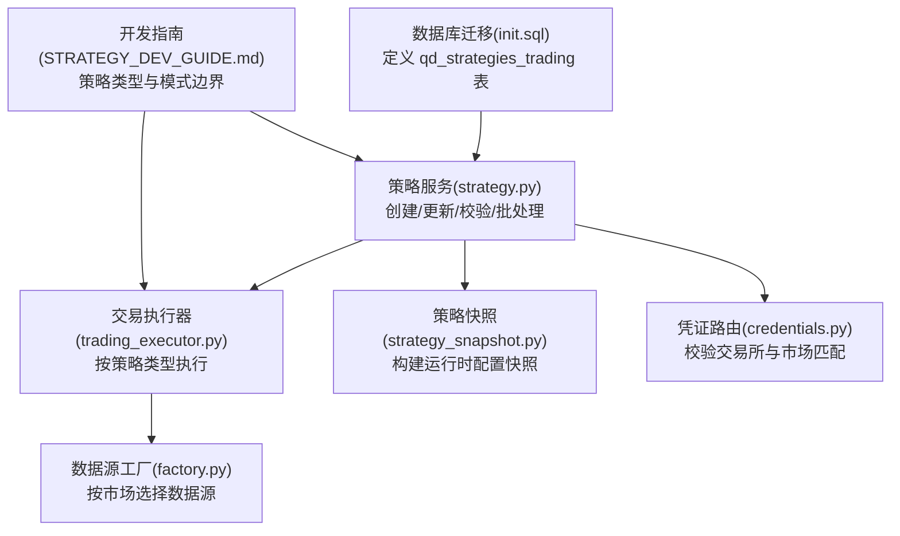
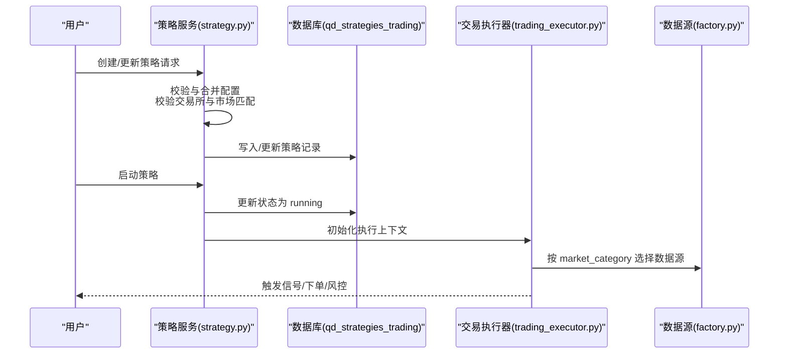
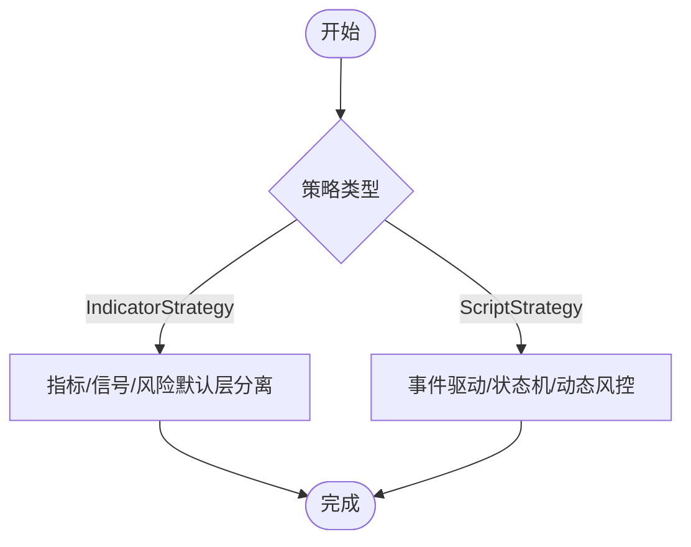
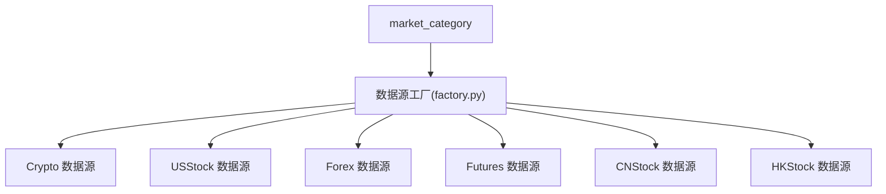
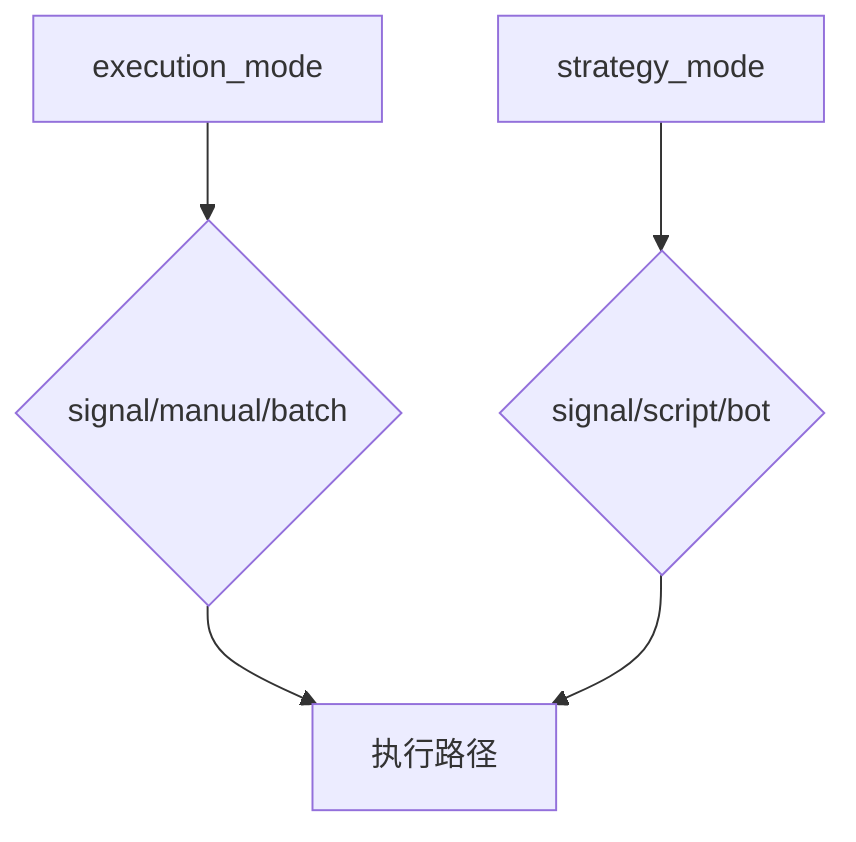
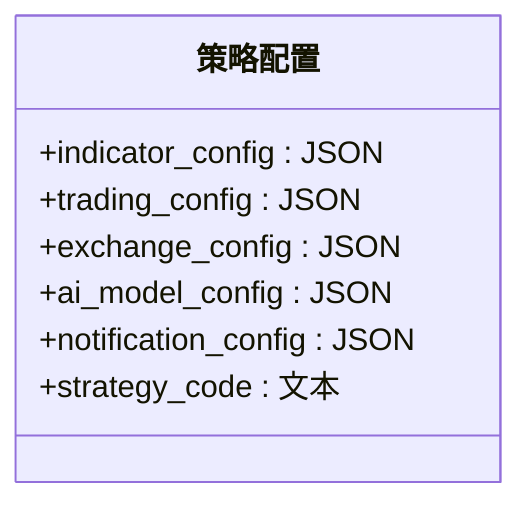
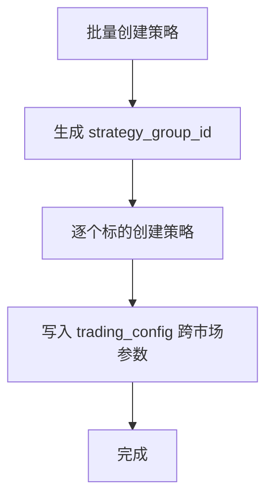
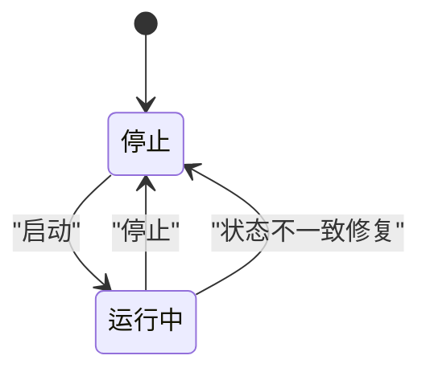
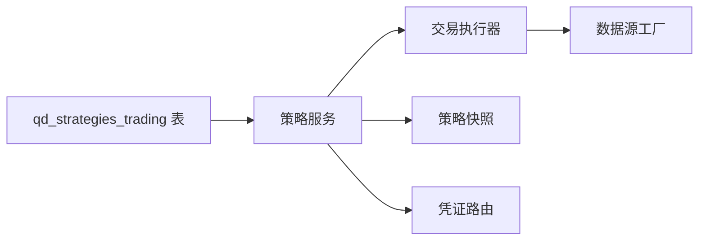

# 策略定义模型

<cite>
**本文引用的文件**
- [init.sql](file://backend_api_python/migrations/init.sql)
- [strategy.py](file://backend_api_python/app/services/strategy.py)
- [trading_executor.py](file://backend_api_python/app/services/trading_executor.py)
- [strategy_snapshot.py](file://backend_api_python/app/services/strategy_snapshot.py)
- [STRATEGY_DEV_GUIDE.md](file://docs/STRATEGY_DEV_GUIDE.md)
- [factory.py](file://backend_api_python/app/data_sources/factory.py)
- [market.py](file://backend_api_python/app/routes/market.py)
- [credentials.py](file://backend_api_python/app/routes/credentials.py)
</cite>

## 目录
1. [简介](#简介)
2. [项目结构](#项目结构)
3. [核心组件](#核心组件)
4. [架构总览](#架构总览)
5. [详细组件分析](#详细组件分析)
6. [依赖关系分析](#依赖关系分析)
7. [性能考量](#性能考量)
8. [故障排查指南](#故障排查指南)
9. [结论](#结论)
10. [附录](#附录)

## 简介
本文件面向策略开发者与运维人员，系统化梳理 qd_strategies_trading 表的数据模型与业务语义，重点解释以下方面：
- 主键与外键约束、字段含义与默认值
- 策略类型（IndicatorStrategy 与 ScriptStrategy）的差异与适用场景
- 市场类别（Crypto、USStock、Forex、Futures、CNStock、HKStock）的业务边界
- 执行模式（execution_mode）与策略模式（strategy_mode）的区分及信号/手动/批量等执行方式
- 配置字段（indicator_config、trading_config、exchange_config、ai_model_config）的结构与校验要点
- 策略组管理（strategy_group_id、group_base_name）与跨市场策略的实现思路
- 资金管理（initial_capital、leverage）与风控参数的设计考虑
- 策略状态（status）的生命周期与一致性保障

## 项目结构
与策略定义模型直接相关的核心文件与职责如下：
- 数据库迁移脚本：定义 qd_strategies_trading 表结构、索引与列演进
- 策略服务：负责策略创建、更新、批量启停、配置合并与校验
- 交易执行器：根据策略配置选择执行路径（指标或脚本），并驱动下单与风控
- 策略快照：将策略配置序列化为运行时可消费的快照结构
- 开发指南：明确策略类型与模式的使用边界
- 数据源工厂与行情路由：支撑多市场符号解析与数据源选择
- 凭证路由：按交易所校验市场类别限制

**图示来源**
- [init.sql:195-220](file://backend_api_python/migrations/init.sql#L195-L220)
- [strategy.py:927-1093](file://backend_api_python/app/services/strategy.py#L927-L1093)
- [trading_executor.py:993-1019](file://backend_api_python/app/services/trading_executor.py#L993-L1019)
- [strategy_snapshot.py:173-219](file://backend_api_python/app/services/strategy_snapshot.py#L173-L219)
- [factory.py:80-95](file://backend_api_python/app/data_sources/factory.py#L80-L95)
- [credentials.py:162-188](file://backend_api_python/app/routes/credentials.py#L162-L188)

**章节来源**
- [init.sql:195-220](file://backend_api_python/migrations/init.sql#L195-L220)
- [strategy.py:927-1093](file://backend_api_python/app/services/strategy.py#L927-L1093)

## 核心组件
qd_strategies_trading 表作为策略定义与运行的中枢，承载策略元信息、配置与状态。关键字段与约束如下：

- 主键与外键
  - id：自增主键
  - user_id：外键引用用户表，删除级联保证用户删除时策略清理
- 基础信息
  - strategy_name：策略名称，必填
  - strategy_type：策略类型，默认 IndicatorStrategy；支持 IndicatorStrategy 与 ScriptStrategy
  - strategy_mode：策略模式，默认 signal；与 execution_mode 共同决定执行行为
  - execution_mode：执行模式，默认 signal；支持 signal、manual、batch 等
  - status：策略状态，默认 stopped；支持 running/stopped 等
  - symbol/timeframe：标的与周期
  - market_category：市场类别，默认 Crypto；支持 Crypto、USStock、Forex、Futures、CNStock、HKStock
  - market_type：市场类型，默认 swap；如期货的永续/交割等
  - decide_interval：决策间隔（秒），默认 300
- 资金与风控
  - initial_capital：初始资金，默认 1000
  - leverage：杠杆，默认 1
- 配置字段（均以文本存储，内部为 JSON 或加密字符串）
  - indicator_config：指标层配置
  - trading_config：交易层配置（含资金、风控、跨市场等）
  - exchange_config：交易所配置（含凭证、服务器、账户等）
  - ai_model_config：AI 模型配置
  - notification_config：通知配置
  - strategy_code：脚本策略源码（ScriptStrategy）
- 策略组与跨市场
  - strategy_group_id：策略组标识，用于批量管理
  - group_base_name：策略组基础名
- 时间戳
  - created_at/updated_at：自动维护

**章节来源**
- [init.sql:195-220](file://backend_api_python/migrations/init.sql#L195-L220)

## 架构总览
策略从“定义”到“执行”的关键流转如下：

**图示来源**
- [strategy.py:927-1093](file://backend_api_python/app/services/strategy.py#L927-L1093)
- [strategy.py:1265-1294](file://backend_api_python/app/services/strategy.py#L1265-L1294)
- [trading_executor.py:993-1019](file://backend_api_python/app/services/trading_executor.py#L993-L1019)
- [factory.py:80-95](file://backend_api_python/app/data_sources/factory.py#L80-L95)

## 详细组件分析

### 字段设计与业务含义
- id（主键）
  - 唯一标识策略实例，用于与其他表（如持仓、交易、日志）关联
- user_id（外键）
  - 关联用户，删除级联确保数据一致性
- strategy_name
  - 策略名称，必填；建议遵循清晰、可读的命名规范，便于仪表盘与日志识别
- strategy_type
  - 策略类型：IndicatorStrategy（基于 DataFrame 的信号策略）与 ScriptStrategy（事件驱动的脚本策略）
  - 开发指南明确了两者的边界与适用场景
- market_category
  - 市场类别：Crypto、USStock、Forex、Futures、CNStock、HKStock
  - 与交易所配置存在强约束（见下节“执行模式与策略模式”）
- execution_mode
  - 执行模式：signal（信号驱动）、manual（手动）、batch（批量）
  - 与 strategy_mode 协同决定策略如何被调度与执行
- strategy_mode
  - 策略模式：signal（信号模式）、script/bot（脚本/机器人模式）
  - 与 strategy_type 存在映射关系（脚本策略通常对应 ScriptStrategy）
- status
  - 策略状态：running/stopped 等
  - 由服务层提供批量启停接口，并在执行器中进行一致性检查与修复
- symbol/timeframe
  - 标的与周期，用于数据拉取与回测
- initial_capital/leverage
  - 初始资金与杠杆，用于资金管理与风控计算
- market_type
  - 市场类型：如 swap（永续）、spot（现货）、futures（期货）
- 配置字段
  - indicator_config：指标层参数与输出
  - trading_config：交易层参数（含资金、风控、跨市场等）
  - exchange_config：交易所凭证与连接参数
  - ai_model_config：AI 模型参数
  - notification_config：通知渠道与模板
  - strategy_code：脚本策略源码（ScriptStrategy）
- 策略组
  - strategy_group_id/group_base_name：用于批量创建与管理策略组
- decide_interval
  - 决策间隔（秒），默认 300

**章节来源**
- [init.sql:195-220](file://backend_api_python/migrations/init.sql#L195-L220)
- [STRATEGY_DEV_GUIDE.md:75-89](file://docs/STRATEGY_DEV_GUIDE.md#L75-L89)

### 策略类型：IndicatorStrategy 与 ScriptStrategy
- IndicatorStrategy
  - 适合信号研究、指标叠加、回测与图表展示
  - 强调三层分离：指标层、信号层、风险默认层
  - 不混入执行细节，杠杆等产品级配置不应出现在指标代码中
- ScriptStrategy
  - 适合需要状态机、动态止盈止损、分批进出、冷却期等复杂执行逻辑
  - 提供 bar-by-bar 控制与位置状态查询能力

**图示来源**
- [STRATEGY_DEV_GUIDE.md:24-72](file://docs/STRATEGY_DEV_GUIDE.md#L24-L72)

**章节来源**
- [STRATEGY_DEV_GUIDE.md:24-72](file://docs/STRATEGY_DEV_GUIDE.md#L24-L72)

### 市场类别与数据源选择
- 支持市场类别：Crypto、USStock、Forex、Futures、CNStock、HKStock
- 工厂方法按类别选择具体数据源实现，确保数据拉取与符号解析正确
- 市场类别与交易所配置存在强约束：例如 MT5 仅支持 Forex，IBKR 仅支持 USStock

**图示来源**
- [factory.py:80-95](file://backend_api_python/app/data_sources/factory.py#L80-L95)

**章节来源**
- [factory.py:80-95](file://backend_api_python/app/data_sources/factory.py#L80-L95)

### 执行模式与策略模式
- execution_mode
  - signal：信号驱动，按信号生成订单
  - manual：手动执行，由用户确认后执行
  - batch：批量执行，支持批量启停与统一调度
- strategy_mode
  - signal：信号模式
  - script/bot：脚本/机器人模式（常与 ScriptStrategy 对应）
- 两者协同决定策略的调度与执行路径

**图示来源**
- [strategy.py:1287-1294](file://backend_api_python/app/services/strategy.py#L1287-L1294)

**章节来源**
- [strategy.py:1287-1294](file://backend_api_python/app/services/strategy.py#L1287-L1294)

### 配置字段设计与验证规则
- indicator_config
  - 指标层参数与输出，建议采用 JSON 结构，包含参数名、默认值与描述
- trading_config
  - 交易层参数，包含资金、风控、跨市场等配置
  - 跨市场策略（如交叉截面）会将相关字段写入该字段，避免频繁变更表结构
- exchange_config
  - 交易所配置，包含凭证、服务器、账户等
  - 与市场类别强绑定：MT5 仅 Forex，IBKR 仅 USStock
- ai_model_config
  - AI 模型参数，建议采用 JSON 结构
- notification_config
  - 通知渠道与模板，建议采用 JSON 结构
- strategy_code
  - 脚本策略源码，仅在 ScriptStrategy 下使用

**图示来源**
- [init.sql:195-220](file://backend_api_python/migrations/init.sql#L195-L220)
- [strategy.py:1265-1294](file://backend_api_python/app/services/strategy.py#L1265-L1294)

**章节来源**
- [init.sql:195-220](file://backend_api_python/migrations/init.sql#L195-L220)
- [strategy.py:1265-1294](file://backend_api_python/app/services/strategy.py#L1265-L1294)

### 策略组管理与跨市场策略
- 策略组
  - strategy_group_id：策略组唯一标识，用于批量创建与管理
  - group_base_name：策略组基础名，便于批量命名与识别
- 跨市场策略
  - 通过 trading_config 中的跨市场字段（如 symbol_list、portfolio_size、long_ratio、rebalance_frequency 等）实现
  - 服务层在创建时将跨市场配置写入 trading_config，避免频繁修改表结构

**图示来源**
- [strategy.py:1080-1093](file://backend_api_python/app/services/strategy.py#L1080-L1093)
- [strategy.py:972-993](file://backend_api_python/app/services/strategy.py#L972-L993)

**章节来源**
- [strategy.py:1080-1093](file://backend_api_python/app/services/strategy.py#L1080-L1093)
- [strategy.py:972-993](file://backend_api_python/app/services/strategy.py#L972-L993)

### 资金管理与风控参数
- initial_capital
  - 初始资金，用于回测与实盘权益计算
- leverage
  - 杠杆倍数，影响保证金占用与风险敞口
- 交易配置中的 commission、slippage 等（脚本策略 UI 创建时可选）
- 快照服务会根据策略类型与模式推断默认 commission/slippage

**章节来源**
- [strategy_snapshot.py:135-152](file://backend_api_python/app/services/strategy_snapshot.py#L135-L152)

### 策略状态管理与生命周期
- 状态
  - running：运行中
  - stopped：已停止
- 生命周期
  - 创建：默认状态 stopped
  - 启动：批量启动或单个启动
  - 停止：批量停止或单个停止
  - 删除：删除策略记录
- 一致性保障
  - 执行器定期检查数据库状态与线程状态，若不一致则修复为 stopped，防止“僵尸”状态

**图示来源**
- [strategy.py:1128-1164](file://backend_api_python/app/services/strategy.py#L1128-L1164)
- [trading_executor.py:1543-1578](file://backend_api_python/app/services/trading_executor.py#L1543-L1578)

**章节来源**
- [strategy.py:1128-1164](file://backend_api_python/app/services/strategy.py#L1128-L1164)
- [trading_executor.py:1543-1578](file://backend_api_python/app/services/trading_executor.py#L1543-L1578)

## 依赖关系分析
- 策略服务依赖数据库迁移脚本定义的表结构
- 交易执行器依据策略配置选择数据源与执行路径
- 凭证路由对交易所与市场类别的约束，确保配置合法
- 快照服务将策略配置转化为运行时可消费的快照

**图示来源**
- [init.sql:195-220](file://backend_api_python/migrations/init.sql#L195-L220)
- [strategy.py:927-1093](file://backend_api_python/app/services/strategy.py#L927-L1093)
- [trading_executor.py:993-1019](file://backend_api_python/app/services/trading_executor.py#L993-L1019)
- [strategy_snapshot.py:173-219](file://backend_api_python/app/services/strategy_snapshot.py#L173-L219)
- [credentials.py:162-188](file://backend_api_python/app/routes/credentials.py#L162-L188)
- [factory.py:80-95](file://backend_api_python/app/data_sources/factory.py#L80-L95)

**章节来源**
- [init.sql:195-220](file://backend_api_python/migrations/init.sql#L195-L220)
- [strategy.py:927-1093](file://backend_api_python/app/services/strategy.py#L927-L1093)

## 性能考量
- 决策间隔（decide_interval）影响策略执行频率与资源占用，需结合市场波动性与信号频率合理设置
- 跨市场策略的 symbol_list 与再平衡频率会影响数据拉取与计算开销
- 交易所与数据源的选择直接影响延迟与吞吐，建议在高频场景下优化缓存与限流策略

## 故障排查指南
- 交易所与市场类别不匹配
  - 现象：更新策略时报错，提示 MT5 仅支持 Forex，IBKR 仅支持 USStock
  - 排查：检查 exchange_config 中的 exchange_id 与 market_category 是否一致
- 策略状态不一致
  - 现象：数据库显示 running，但执行器检测不到线程
  - 排查：执行器会自动将状态修复为 stopped，检查策略线程是否异常退出
- 配置字段过大或格式错误
  - 现象：JSON 解析失败或存储异常
  - 排查：确认各配置字段为合法 JSON，必要时进行最小化验证后再入库

**章节来源**
- [strategy.py:1265-1294](file://backend_api_python/app/services/strategy.py#L1265-L1294)
- [trading_executor.py:1543-1578](file://backend_api_python/app/services/trading_executor.py#L1543-L1578)

## 结论
qd_strategies_trading 表以清晰的字段划分与严格的约束，支撑了从策略定义、配置管理到执行与风控的完整闭环。通过 IndicatorStrategy 与 ScriptStrategy 的分层设计、多市场类别支持、策略组与跨市场配置，以及状态一致性保障，系统能够稳定地服务于回测与实盘交易需求。

## 附录
- 市场类别与交易所约束对照
  - MT5：仅 Forex
  - IBKR：仅 USStock
  - 其他：按类别选择相应数据源

**章节来源**
- [credentials.py:162-188](file://backend_api_python/app/routes/credentials.py#L162-L188)
- [factory.py:80-95](file://backend_api_python/app/data_sources/factory.py#L80-L95)