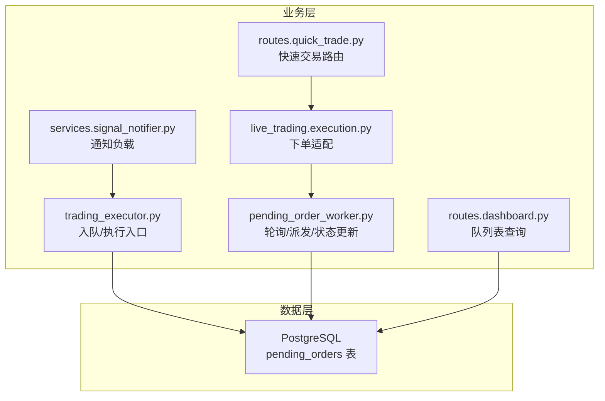
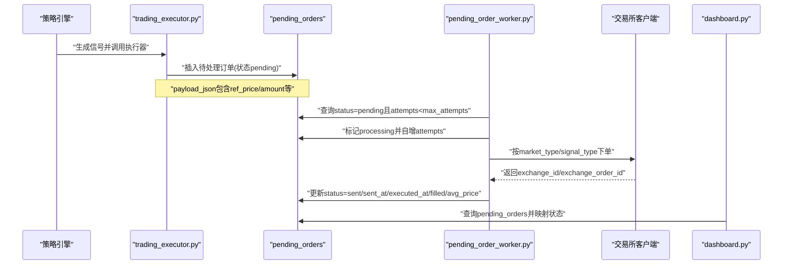
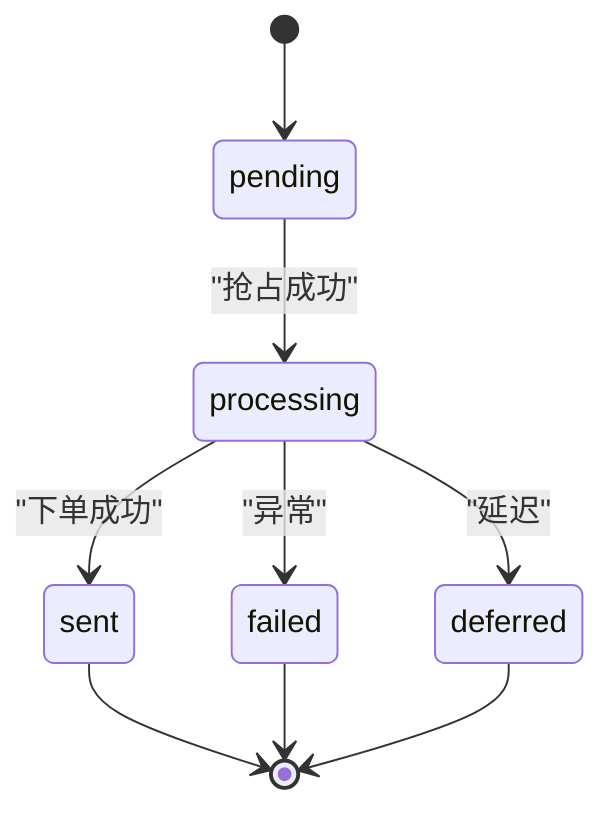
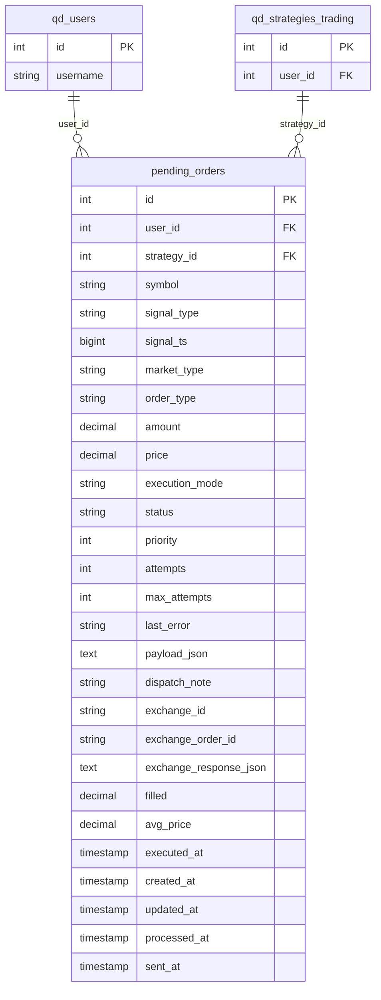

# 订单队列模型

<cite>
**本文引用的文件**
- [init.sql](file://backend_api_python/migrations/init.sql)
- [pending_order_worker.py](file://backend_api_python/app/services/pending_order_worker.py)
- [execution.py](file://backend_api_python/app/services/live_trading/execution.py)
- [quick_trade.py](file://backend_api_python/app/routes/quick_trade.py)
- [dashboard.py](file://backend_api_python/app/routes/dashboard.py)
- [signal_notifier.py](file://backend_api_python/app/services/signal_notifier.py)
- [trading_executor.py](file://backend_api_python/app/services/trading_executor.py)
</cite>

## 目录
1. [简介](#简介)
2. [项目结构](#项目结构)
3. [核心组件](#核心组件)
4. [架构总览](#架构总览)
5. [详细组件分析](#详细组件分析)
6. [依赖关系分析](#依赖关系分析)
7. [性能考量](#性能考量)
8. [故障排查指南](#故障排查指南)
9. [结论](#结论)

## 简介
本文件面向“pending_orders”订单队列表的数据模型与业务流程，系统性梳理其字段设计、标准化处理、状态机与重试机制、负载数据结构、与交易所映射关系、以及监控与异常处理方案。目标是帮助开发者与运维人员快速理解并正确使用该队列模型，确保订单从生成到执行、回写与可视化的端到端一致性。

## 项目结构
与“pending_orders”直接相关的关键模块与文件：
- 数据库初始化脚本：定义表结构、索引与种子数据
- 订单工作线程：负责轮询、派发、状态更新与重试
- 实盘下单入口：将信号转换为标准化下单请求
- 快速交易路由：根据市场类型与订单类型选择下单路径
- 仪表盘接口：查询与展示队列表数据
- 信号通知器：构造通知负载，包含 pending_order_id 等追踪信息
- 交易执行器：在“信号模式”下将订单入队 pending_orders

图示来源
- [init.sql](file://backend_api_python/migrations/init.sql)
- [pending_order_worker.py](file://backend_api_python/app/services/pending_order_worker.py)
- [execution.py](file://backend_api_python/app/services/live_trading/execution.py)
- [quick_trade.py](file://backend_api_python/app/routes/quick_trade.py)
- [dashboard.py](file://backend_api_python/app/routes/dashboard.py)
- [signal_notifier.py](file://backend_api_python/app/services/signal_notifier.py)
- [trading_executor.py](file://backend_api_python/app/services/trading_executor.py)

章节来源
- [init.sql](file://backend_api_python/migrations/init.sql)
- [pending_order_worker.py](file://backend_api_python/app/services/pending_order_worker.py)
- [execution.py](file://backend_api_python/app/services/live_trading/execution.py)
- [quick_trade.py](file://backend_api_python/app/routes/quick_trade.py)
- [dashboard.py](file://backend_api_python/app/routes/dashboard.py)
- [signal_notifier.py](file://backend_api_python/app/services/signal_notifier.py)
- [trading_executor.py](file://backend_api_python/app/services/trading_executor.py)

## 核心组件
- 表结构与字段
  - 主键与外键：id（主键），user_id（外键到用户表），strategy_id（外键到策略表，允许为空）
  - 标准化符号：symbol 字段存储标准化后的交易对
  - 信号与时序：signal_type（信号类型）、signal_ts（信号时间戳）
  - 市场与订单：market_type（swap/spot 等）、order_type（market/limit 等）
  - 参数与执行：amount（数量）、price（价格）、execution_mode（signal/live）
  - 状态与重试：status（pending/sent/acked/filled/canceled/error 等）、attempts/max_attempts
  - 负载与映射：payload_json（结构化负载）、exchange_id/exchange_order_id
  - 成交与时间：filled（已成交数量）、avg_price（平均成交价）、executed_at/sent_at/created_at/updated_at/processed_at
- 工作线程职责
  - 轮询 pending_orders 中 status=pending 且 attempts<max_attempts 的行
  - 将行标记为 processing 并派发至对应交易所客户端
  - 更新状态与时间戳，并持久化交易所返回结果
- 下单适配
  - 将 signal_type 映射为 buy/sell、posSide、reduceOnly
  - 根据 market_type 规范化 symbol（例如统一大小写、补齐后缀）
  - 依据 order_type 选择市价或限价下单路径
- 通知与可视化
  - 通知负载包含 pending_order_id，便于前端跟踪
  - 仪表盘接口将 sent 状态映射为 completed，deferred 映射为 pending，以提升用户体验

章节来源
- [init.sql](file://backend_api_python/migrations/init.sql)
- [pending_order_worker.py](file://backend_api_python/app/services/pending_order_worker.py)
- [execution.py](file://backend_api_python/app/services/live_trading/execution.py)
- [quick_trade.py](file://backend_api_python/app/routes/quick_trade.py)
- [dashboard.py](file://backend_api_python/app/routes/dashboard.py)
- [signal_notifier.py](file://backend_api_python/app/services/signal_notifier.py)
- [trading_executor.py](file://backend_api_python/app/services/trading_executor.py)

## 架构总览
以下序列图展示了从策略产生信号到订单入队、派发与回写的完整流程。

图示来源
- [trading_executor.py](file://backend_api_python/app/services/trading_executor.py)
- [pending_order_worker.py](file://backend_api_python/app/services/pending_order_worker.py)
- [dashboard.py](file://backend_api_python/app/routes/dashboard.py)
- [init.sql](file://backend_api_python/migrations/init.sql)

## 详细组件分析

### 数据模型字段详解
- 主键与外键
  - id：自增主键
  - user_id：外键到用户表，保证订单归属
  - strategy_id：外键到策略表，允许为 NULL（非策略驱动的订单）
- 标准化符号与多市场格式
  - symbol：存储标准化后的交易对，统一大小写、补齐后缀等
  - 不同交易所对 symbol 的格式要求不同，下单前会进行规范化
- 信号与时间戳
  - signal_type：open_long/open_short/close_long/close_short 等
  - signal_ts：信号时间戳（毫秒或秒，取决于上游）
- 市场与订单类型
  - market_type：swap/spot/futures 等，系统内部统一归一为 swap
  - order_type：market/limit
- 订单参数
  - amount：下单数量（标准化为基础货币）
  - price：下单价格（限价单）
  - execution_mode：signal/live，决定是否真实下单
- 状态与重试
  - status：pending/processing/sent/acked/filled/canceled/failed/deferred
  - attempts/max_attempts：尝试次数与最大尝试次数
- 负载与映射
  - payload_json：结构化负载，包含 ref_price、amount、reason、止盈止损等
  - exchange_id/exchange_order_id：交易所标识与交易所订单号
- 成交与时间戳
  - filled/avg_price：已成交数量与平均成交价
  - executed_at/sent_at/created_at/updated_at/processed_at：各阶段时间戳

章节来源
- [init.sql](file://backend_api_python/migrations/init.sql)
- [execution.py](file://backend_api_python/app/services/live_trading/execution.py)
- [pending_order_worker.py](file://backend_api_python/app/services/pending_order_worker.py)

### 状态生命周期与转换规则
- 初始状态：pending（入队后）
- 处理中：processing（仅当前进程成功抢占）
- 执行完成：sent（已发送至交易所，记录 exchange_id/exchange_order_id）
- 异常与延迟：failed（失败）、deferred（延迟）
- 终态：acked/filled（由外部回写或监控回填，此处不作为工作线程职责）

图示来源
- [pending_order_worker.py](file://backend_api_python/app/services/pending_order_worker.py)

章节来源
- [pending_order_worker.py](file://backend_api_python/app/services/pending_order_worker.py)

### 重试机制设计
- 抢占与重试
  - 查询条件：status=pending 且 attempts<max_attempts
  - 抢占：将 status 更新为 processing 并自增 attempts
  - 死锁恢复：若某行长时间处于 processing，按 stale_processing_sec 回收为 pending
- 最大尝试次数
  - max_attempts：默认值为 10，超过则不再派发
- 失败与延迟
  - 失败：记录 last_error，状态置为 failed
  - 延迟：记录原因，状态置为 deferred

章节来源
- [pending_order_worker.py](file://backend_api_python/app/services/pending_order_worker.py)

### 负载数据结构与解析
- 结构化存储
  - payload_json：存储下单所需的关键字段（如 ref_price、amount、reason、止盈止损等）
- 解析与使用
  - 工作线程从 payload_json 提取 ref_price/amount/signal_type/symbol 等
  - 通知器在通知负载中注入 pending_order_id，便于前端追踪

章节来源
- [pending_order_worker.py](file://backend_api_python/app/services/pending_order_worker.py)
- [signal_notifier.py](file://backend_api_python/app/services/signal_notifier.py)

### 交易所映射关系
- exchange_id：交易所标识（如 binance、bybit、okx 等）
- exchange_order_id：交易所返回的订单号
- 工作线程在下单成功后回写上述字段，同时持久化交易所响应

章节来源
- [pending_order_worker.py](file://backend_api_python/app/services/pending_order_worker.py)

### 实时更新逻辑（已成交与均价）
- filled/avg_price：在下单成功后由工作线程回写
- executed_at：下单成功时写入当前时间
- 若交易所返回的 filled/avg_price 为 0，则回退使用 ref_price/amount

章节来源
- [pending_order_worker.py](file://backend_api_python/app/services/pending_order_worker.py)

### 时间戳管理
- created_at/updated_at：记录创建与最后更新时间
- processed_at：被工作线程处理的时间
- sent_at：发送至交易所的时间
- executed_at：执行完成的时间（由工作线程在回写时设置）

章节来源
- [init.sql](file://backend_api_python/migrations/init.sql)
- [pending_order_worker.py](file://backend_api_python/app/services/pending_order_worker.py)

### 订单监控与异常处理实现方案
- 监控
  - 仪表盘接口查询 pending_orders 并对状态做友好映射（sent 显示为 completed，deferred 显示为 pending）
  - 工作线程记录日志，包含 exchange_id、exchange_order_id、filled、avg_price 等关键信息
- 异常处理
  - 抢占失败/下单异常：记录 last_error，状态置为 failed 或 deferred
  - 死锁恢复：stale_processing_sec 过期后自动回收为 pending
  - 通知：通过 SignalNotifier 注入 pending_order_id，便于前端跟踪

章节来源
- [dashboard.py](file://backend_api_python/app/routes/dashboard.py)
- [pending_order_worker.py](file://backend_api_python/app/services/pending_order_worker.py)
- [signal_notifier.py](file://backend_api_python/app/services/signal_notifier.py)

## 依赖关系分析
- 表结构依赖
  - pending_orders 依赖 qd_users（user_id 外键）
  - pending_orders 依赖 qd_strategies_trading（strategy_id 外键，可为空）
- 服务依赖
  - trading_executor：将订单入队
  - pending_order_worker：轮询、派发、状态更新
  - live_trading.execution：信号到下单的适配
  - routes.quick_trade：根据 market_type 与 order_type 决定下单路径
  - routes.dashboard：查询与展示
  - services.signal_notifier：构造通知负载

图示来源
- [init.sql](file://backend_api_python/migrations/init.sql)

章节来源
- [init.sql](file://backend_api_python/migrations/init.sql)

## 性能考量
- 轮询批大小与间隔
  - batch_size：每次批量抓取的订单数
  - poll_interval_sec：轮询间隔
- 死锁恢复
  - stale_processing_sec：超过阈值自动回收为 pending，避免死锁
- 索引优化
  - pending_orders 上存在 user_id/status/strategy_id 等索引，建议结合查询条件使用
- 日志与可观测性
  - 工作线程输出关键字段（exchange_id、exchange_order_id、filled、avg_price），便于问题定位

[本节为通用指导，无需特定文件来源]

## 故障排查指南
- 订单长时间停留在 pending
  - 检查 attempts 是否达到 max_attempts
  - 检查 stale_processing_sec 设置是否合理
- 抢占失败
  - 查看 last_error，确认是否存在并发抢占导致的失败
- 下单失败
  - 查看 last_error 与 exchange_response_json，定位具体错误
- 状态显示异常
  - 仪表盘对 sent 映射为 completed，deferred 映射为 pending，属于前端展示逻辑

章节来源
- [pending_order_worker.py](file://backend_api_python/app/services/pending_order_worker.py)
- [dashboard.py](file://backend_api_python/app/routes/dashboard.py)

## 结论
pending_orders 表是系统订单队列的核心载体，通过标准化的字段设计、严格的重试与死锁恢复机制、清晰的状态机与丰富的可观测性，实现了从策略信号到实盘执行的可靠闭环。配合工作线程的轮询与回写、通知器的追踪能力以及仪表盘的可视化展示，能够满足多交易所、多市场的复杂交易场景需求。