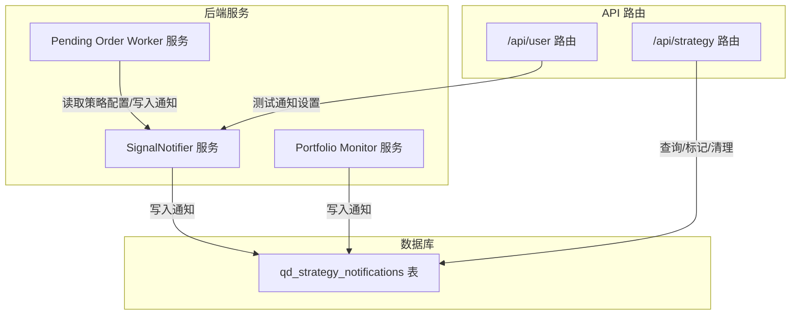
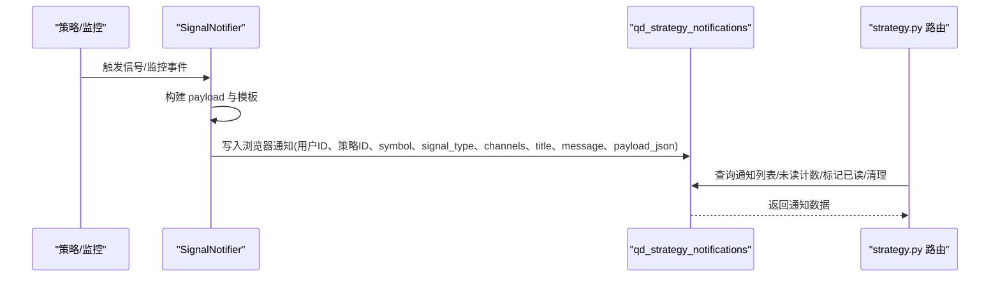
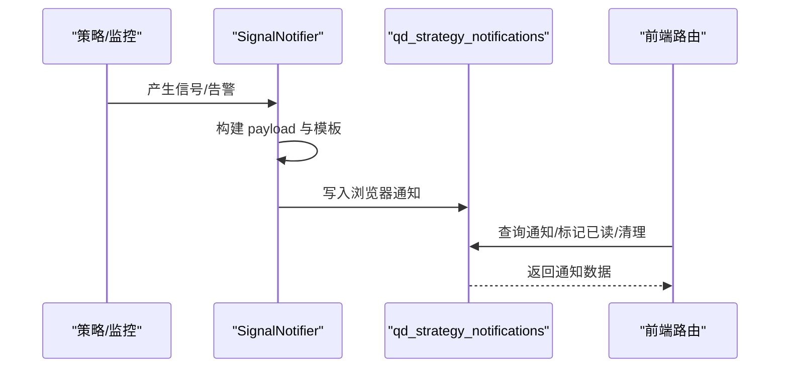
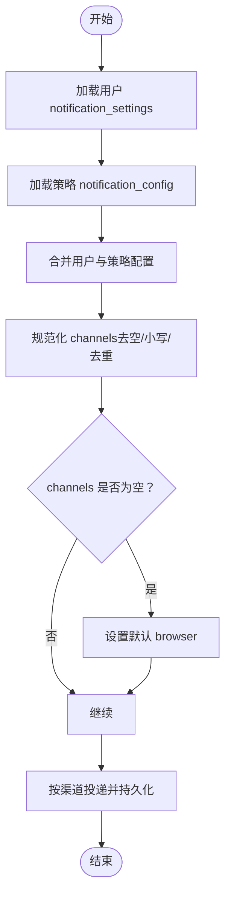
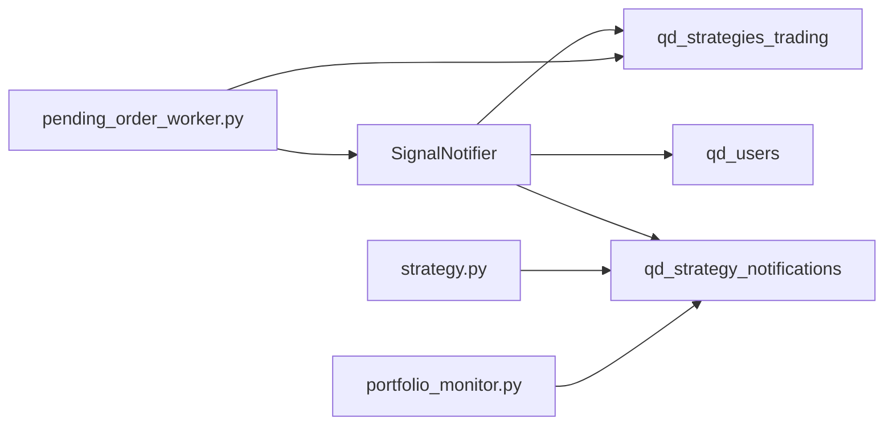

# 通知模型

<cite>
**本文引用的文件**
- [init.sql](file://backend_api_python/migrations/init.sql)
- [signal_notifier.py](file://backend_api_python/app/services/signal_notifier.py)
- [strategy.py](file://backend_api_python/app/routes/strategy.py)
- [portfolio_monitor.py](file://backend_api_python/app/services/portfolio_monitor.py)
- [pending_order_worker.py](file://backend_api_python/app/services/pending_order_worker.py)
- [user.py](file://backend_api_python/app/routes/user.py)
</cite>

## 目录
1. [简介](#简介)
2. [项目结构](#项目结构)
3. [核心组件](#核心组件)
4. [架构总览](#架构总览)
5. [详细组件分析](#详细组件分析)
6. [依赖分析](#依赖分析)
7. [性能考虑](#性能考虑)
8. [故障排查指南](#故障排查指南)
9. [结论](#结论)
10. [附录](#附录)

## 简介
本文件面向“qd_strategy_notifications”通知表，提供从数据库结构、字段语义、业务流程到性能优化与运维保障的全栈级数据模型文档。重点覆盖以下主题：
- 主键与外键关系：id、user_id、strategy_id
- 交易对标识与标准化：symbol 字段的来源与规范
- 信号类型与通知渠道：signal_type 与 channels 的映射与解析
- 标题与消息模板：模板化设计与动态参数替换
- 负载数据结构化：payload_json 的结构、存储与解析
- 已读状态与用户追踪：is_read 的标记机制与前端展示
- 时间戳与排序：created_at 的业务含义与查询排序
- 索引优化策略：user_id、strategy_id、is_read 的影响
- 通知与策略执行的关联：实时推送与持久化
- 通知渠道配置与个性化：用户设置、策略配置与合并逻辑
- 统计分析与行为追踪：未读计数、清理与批量操作

## 项目结构
通知模型位于数据库迁移脚本中，由后端服务在触发策略信号或监控事件时写入，并通过路由接口提供查询、标记已读与清理等能力。

图表来源
- [init.sql:348-364](file://backend_api_python/migrations/init.sql#L348-L364)
- [signal_notifier.py:484-538](file://backend_api_python/app/services/signal_notifier.py#L484-L538)
- [strategy.py:1326-1362](file://backend_api_python/app/routes/strategy.py#L1326-L1362)
- [portfolio_monitor.py:1101-1118](file://backend_api_python/app/services/portfolio_monitor.py#L1101-L1118)
- [pending_order_worker.py:800-821](file://backend_api_python/app/services/pending_order_worker.py#L800-L821)
- [user.py:947-1010](file://backend_api_python/app/routes/user.py#L947-L1010)

章节来源
- [init.sql:348-364](file://backend_api_python/migrations/init.sql#L348-L364)
- [signal_notifier.py:484-538](file://backend_api_python/app/services/signal_notifier.py#L484-L538)
- [strategy.py:1326-1362](file://backend_api_python/app/routes/strategy.py#L1326-L1362)

## 核心组件
- 数据表：qd_strategy_notifications
  - 主键：id（自增）
  - 外键：user_id 引用 qd_users(id)，strategy_id 引用 qd_strategies_trading(id)，删除时级联
  - 关键字段：symbol、signal_type、channels、title、message、payload_json、is_read、created_at
- 服务层：SignalNotifier
  - 构建 payload、渲染模板、按渠道投递、持久化浏览器通知
- 路由层：strategy.py
  - 查询通知列表、未读计数、标记已读、批量已读、清理通知
- 监控与执行：portfolio_monitor、pending_order_worker
  - 触发监控告警通知、读取策略通知配置并合并用户设置

章节来源
- [init.sql:348-364](file://backend_api_python/migrations/init.sql#L348-L364)
- [signal_notifier.py:171-283](file://backend_api_python/app/services/signal_notifier.py#L171-L283)
- [strategy.py:1369-1496](file://backend_api_python/app/routes/strategy.py#L1369-L1496)
- [portfolio_monitor.py:1101-1118](file://backend_api_python/app/services/portfolio_monitor.py#L1101-L1118)
- [pending_order_worker.py:800-821](file://backend_api_python/app/services/pending_order_worker.py#L800-L821)

## 架构总览
通知从策略或监控产生，经服务层模板化与渠道投递，最终持久化到通知表；前端通过路由接口读取、标记与清理。

图表来源
- [signal_notifier.py:171-283](file://backend_api_python/app/services/signal_notifier.py#L171-L283)
- [signal_notifier.py:484-538](file://backend_api_python/app/services/signal_notifier.py#L484-L538)
- [strategy.py:1326-1362](file://backend_api_python/app/routes/strategy.py#L1326-L1362)

## 详细组件分析

### 数据表结构与字段语义
- id：自增主键，唯一标识每条通知
- user_id：通知归属用户，外键引用用户表，删除时级联
- strategy_id：所属策略，外键引用策略表，删除时级联
- symbol：交易对标识，来源于策略或监控输入，用于定位具体标的
- signal_type：信号类型，如开仓/加仓/平仓/减仓等动作与方向组合
- channels：启用的通知渠道集合，逗号分隔字符串
- title/message：标题与消息正文，分别用于不同渠道显示
- payload_json：结构化负载，包含事件元数据、策略、标的、信号、订单与追踪信息
- is_read：已读标记，0 未读，非 0 已读
- created_at：通知创建时间，默认为当前时间

章节来源
- [init.sql:348-364](file://backend_api_python/migrations/init.sql#L348-L364)

### 字段设计与业务含义

#### 主键与外键关系
- 主键 id 保证每条通知唯一性
- user_id 与 strategy_id 的外键约束确保数据一致性与级联删除
- 删除策略或用户时，通知随之清理，避免悬挂引用

章节来源
- [init.sql:348-364](file://backend_api_python/migrations/init.sql#L348-L364)

#### symbol 字段的标准化与交易对标识
- 来源：策略信号或监控结果中的 symbol
- 存储：直接存入表的 symbol 字段，便于前端展示与筛选
- 规范：建议遵循统一命名约定（如交易所/市场前缀、大小写规范），由上层服务在写入前进行标准化处理

章节来源
- [signal_notifier.py:484-538](file://backend_api_python/app/services/signal_notifier.py#L484-L538)
- [portfolio_monitor.py:1101-1118](file://backend_api_python/app/services/portfolio_monitor.py#L1101-L1118)

#### signal_type 与 channels 的关联关系
- signal_type：描述信号动作与方向，服务层据此生成 payload 元信息
- channels：策略或用户配置的通知渠道集合，服务层按渠道分别投递
- 合并与规范化：用户设置与策略配置合并后，channels 经过去空、小写与去重处理

章节来源
- [signal_notifier.py:171-283](file://backend_api_python/app/services/signal_notifier.py#L171-L283)
- [signal_notifier.py:41-52](file://backend_api_python/app/services/signal_notifier.py#L41-L52)
- [portfolio_monitor.py:68-83](file://backend_api_python/app/services/portfolio_monitor.py#L68-L83)

#### 标题与消息的模板化设计
- 标题：基于策略名称、symbol、动作与方向生成
- 正文（纯文本/HTML）：包含策略、符号、信号、价格、金额、挂单ID、模式与时区显示等
- 渲染：服务层根据 payload 动态拼装多渠道消息体

章节来源
- [signal_notifier.py:339-413](file://backend_api_python/app/services/signal_notifier.py#L339-L413)
- [signal_notifier.py:415-482](file://backend_api_python/app/services/signal_notifier.py#L415-L482)

#### payload_json 结构化存储与解析
- 结构要点：事件类型、版本、时间戳、策略元信息、标的、信号、订单、追踪与额外字段
- 存储：序列化为 JSON 文本存入 payload_json
- 解析：读取时反序列化，用于渠道投递与前端展示

章节来源
- [signal_notifier.py:285-337](file://backend_api_python/app/services/signal_notifier.py#L285-L337)
- [signal_notifier.py:516-538](file://backend_api_python/app/services/signal_notifier.py#L516-L538)
- [pending_order_worker.py:717-731](file://backend_api_python/app/services/pending_order_worker.py#L717-L731)

#### is_read 已读状态与用户阅读追踪
- 标记机制：单条/批量/按用户清理
- 查询条件：结合用户策略集合与用户自身通知进行过滤
- 前端展示：未读计数用于顶部徽章

章节来源
- [strategy.py:1369-1413](file://backend_api_python/app/routes/strategy.py#L1369-L1413)
- [strategy.py:1416-1471](file://backend_api_python/app/routes/strategy.py#L1416-L1471)
- [strategy.py:1474-1496](file://backend_api_python/app/routes/strategy.py#L1474-L1496)

#### created_at 时间戳与排序规则
- 业务意义：记录通知创建时刻，用于排序与统计
- 排序：默认按 id 降序（近似按时间倒序）
- 前端转换：将 created_at 转换为 UTC 秒级时间戳

章节来源
- [strategy.py:1326-1362](file://backend_api_python/app/routes/strategy.py#L1326-L1362)

### 通知与策略执行的关联与实时推送
- 触发点：策略信号、监控告警、订单执行结果
- 实时推送：服务层按 channels 投递至各渠道
- 持久化：浏览器渠道直接写入通知表，便于后续查询与管理
- 执行链路：策略/监控 → 服务层 → 渠道投递 → 数据库写入

图表来源
- [signal_notifier.py:171-283](file://backend_api_python/app/services/signal_notifier.py#L171-L283)
- [signal_notifier.py:484-538](file://backend_api_python/app/services/signal_notifier.py#L484-L538)
- [strategy.py:1326-1362](file://backend_api_python/app/routes/strategy.py#L1326-L1362)

章节来源
- [signal_notifier.py:171-283](file://backend_api_python/app/services/signal_notifier.py#L171-L283)
- [signal_notifier.py:484-538](file://backend_api_python/app/services/signal_notifier.py#L484-L538)
- [strategy.py:1326-1362](file://backend_api_python/app/routes/strategy.py#L1326-L1362)

### 通知渠道配置与个性化设置
- 用户设置：个人中心保存 notification_settings，包含默认渠道与目标地址
- 策略配置：策略表中保存 notification_config，包含 channels 与 targets
- 合并策略：服务层将用户设置与策略配置合并，规范化 channels 并补充默认值
- 测试通道：提供 profile test 通知，验证各渠道可用性

图表来源
- [portfolio_monitor.py:68-83](file://backend_api_python/app/services/portfolio_monitor.py#L68-L83)
- [signal_notifier.py:41-52](file://backend_api_python/app/services/signal_notifier.py#L41-L52)
- [user.py:947-1010](file://backend_api_python/app/routes/user.py#L947-L1010)

章节来源
- [portfolio_monitor.py:68-83](file://backend_api_python/app/services/portfolio_monitor.py#L68-L83)
- [signal_notifier.py:41-52](file://backend_api_python/app/services/signal_notifier.py#L41-L52)
- [user.py:947-1010](file://backend_api_python/app/routes/user.py#L947-L1010)

### 通知统计分析与用户行为追踪
- 未读计数：按用户与策略集合统计未读数量，用于前端徽章
- 清理策略：按用户批量清理通知
- 行为追踪：结合 created_at 进行趋势分析与活跃度统计

章节来源
- [strategy.py:1369-1413](file://backend_api_python/app/routes/strategy.py#L1369-L1413)
- [strategy.py:1474-1496](file://backend_api_python/app/routes/strategy.py#L1474-L1496)

## 依赖分析
- 表级依赖：qd_strategy_notifications 依赖 qd_users 与 qd_strategies_trading
- 服务级依赖：SignalNotifier 依赖数据库工具与日志工具
- 路由级依赖：strategy.py 路由依赖数据库连接与认证上下文
- 执行链依赖：pending_order_worker 依赖策略配置与通知服务

图表来源
- [init.sql:348-364](file://backend_api_python/migrations/init.sql#L348-L364)
- [signal_notifier.py:35-36](file://backend_api_python/app/services/signal_notifier.py#L35-L36)
- [strategy.py:1326-1362](file://backend_api_python/app/routes/strategy.py#L1326-L1362)
- [portfolio_monitor.py:1101-1118](file://backend_api_python/app/services/portfolio_monitor.py#L1101-L1118)
- [pending_order_worker.py:800-821](file://backend_api_python/app/services/pending_order_worker.py#L800-L821)

章节来源
- [init.sql:348-364](file://backend_api_python/migrations/init.sql#L348-L364)
- [signal_notifier.py:35-36](file://backend_api_python/app/services/signal_notifier.py#L35-L36)
- [strategy.py:1326-1362](file://backend_api_python/app/routes/strategy.py#L1326-L1362)
- [portfolio_monitor.py:1101-1118](file://backend_api_python/app/services/portfolio_monitor.py#L1101-L1118)
- [pending_order_worker.py:800-821](file://backend_api_python/app/services/pending_order_worker.py#L800-L821)

## 性能考虑
- 索引策略
  - idx_notifications_user_id：加速按用户查询
  - idx_notifications_strategy_id：加速按策略查询
  - idx_notifications_is_read：加速未读计数与已读标记
- 查询优化
  - 使用 LIMIT 控制返回量
  - created_at 默认降序，满足“最近优先”的展示需求
- 写入优化
  - 浏览器渠道直接写入，减少中间缓存
  - payload_json 采用结构化存储，便于后续扩展解析

章节来源
- [init.sql:362-364](file://backend_api_python/migrations/init.sql#L362-L364)
- [strategy.py:1326-1362](file://backend_api_python/app/routes/strategy.py#L1326-L1362)
- [strategy.py:1369-1413](file://backend_api_python/app/routes/strategy.py#L1369-L1413)

## 故障排查指南
- 未读计数异常
  - 检查用户策略集合是否正确加载
  - 确认 is_read 标记逻辑与用户权限
- 通知未显示
  - 检查 channels 是否为空或被规范化为 browser
  - 确认用户 notification_settings 与策略 notification_config 合并是否成功
- 渠道投递失败
  - 查看服务日志中的错误信息
  - 验证 webhook/discord/telegram/email/phone 的配置与凭据
- 数据库写入失败
  - 检查外键约束与连接状态
  - 确认 payload_json 序列化是否合法

章节来源
- [strategy.py:1369-1413](file://backend_api_python/app/routes/strategy.py#L1369-L1413)
- [signal_notifier.py:277-281](file://backend_api_python/app/services/signal_notifier.py#L277-L281)
- [signal_notifier.py:535-538](file://backend_api_python/app/services/signal_notifier.py#L535-L538)

## 结论
qd_strategy_notifications 表以简洁而清晰的字段设计承载了策略与监控通知的全生命周期：从信号/告警产生、模板化渲染、多渠道投递到持久化与查询管理。配合合理的索引与合并策略，可在保证功能完整性的同时兼顾性能与可维护性。建议在生产环境中持续完善渠道配置校验与日志可观测性，以提升用户体验与系统稳定性。

## 附录

### 字段清单与类型摘要
- id：整型（主键）
- user_id：整型（外键）
- strategy_id：整型（外键）
- symbol：字符串
- signal_type：字符串
- channels：字符串（逗号分隔）
- title：字符串
- message：文本
- payload_json：文本（JSON）
- is_read：整型（布尔化）
- created_at：时间戳

章节来源
- [init.sql:348-364](file://backend_api_python/migrations/init.sql#L348-L364)