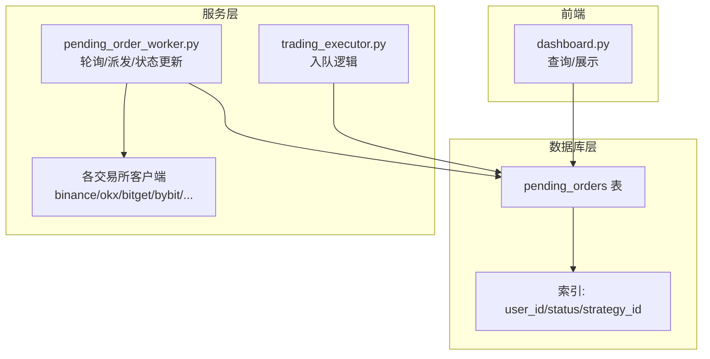
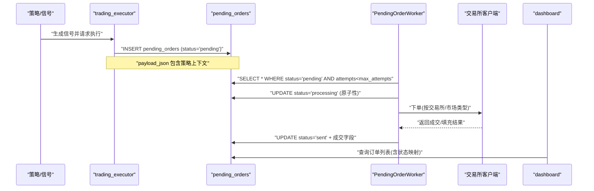
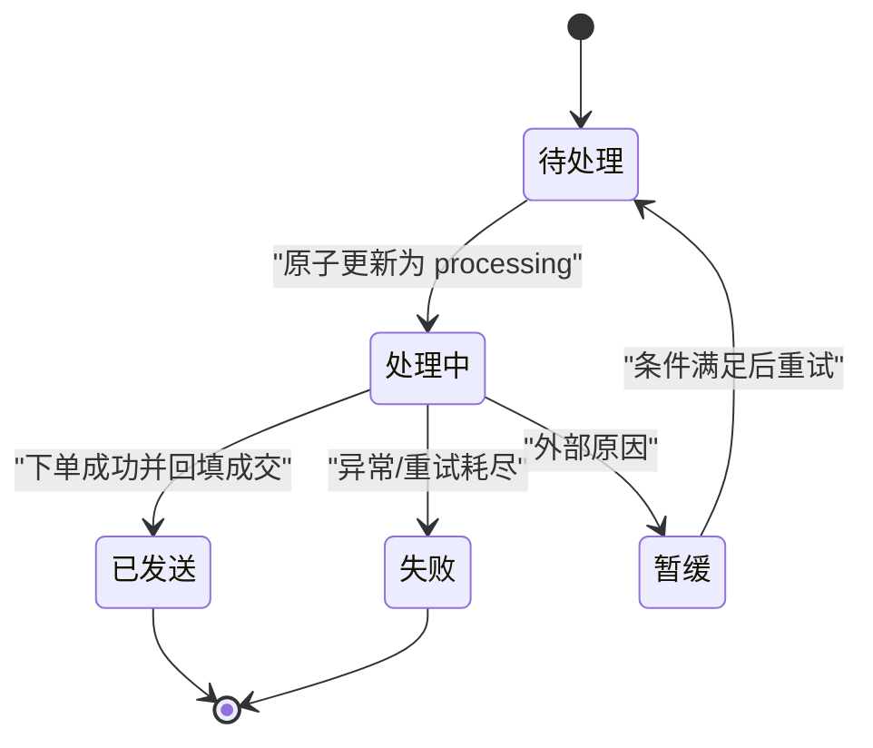
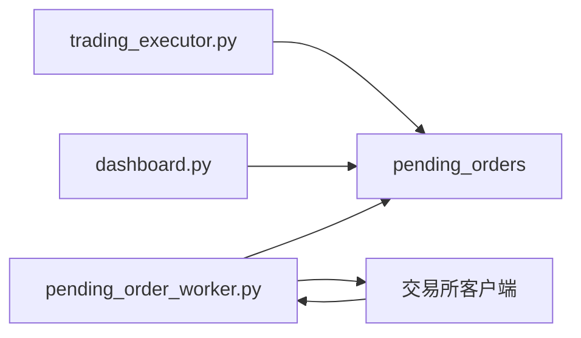

# 订单执行模型

<cite>
**本文引用的文件**
- [init.sql](file://backend_api_python/migrations/init.sql)
- [pending_order_worker.py](file://backend_api_python/app/services/pending_order_worker.py)
- [trading_executor.py](file://backend_api_python/app/services/trading_executor.py)
- [dashboard.py](file://backend_api_python/app/routes/dashboard.py)
- [bitget.py](file://backend_api_python/app/services/live_trading/bitget.py)
- [bitget_spot.py](file://backend_api_python/app/services/live_trading/bitget_spot.py)
- [bybit.py](file://backend_api_python/app/services/live_trading/bybit.py)
- [binance.py](file://backend_api_python/app/services/live_trading/binance.py)
- [okx.py](file://backend_api_python/app/services/live_trading/okx.py)
</cite>

## 目录
1. [简介](#简介)
2. [项目结构](#项目结构)
3. [核心组件](#核心组件)
4. [架构总览](#架构总览)
5. [详细组件分析](#详细组件分析)
6. [依赖关系分析](#依赖关系分析)
7. [性能考量](#性能考量)
8. [故障排查指南](#故障排查指南)
9. [结论](#结论)
10. [附录](#附录)

## 简介
本文件系统化梳理 SharkQuantDinger 的“订单执行与队列管理”数据模型与运行机制，重点覆盖：
- pending_orders 表的字段设计与业务语义
- 订单状态机与状态转换规则
- 优先级管理、重试与失败处理策略
- 与交易所对接的执行字段与流程
- 订单生命周期管理（从创建到完成/取消）
- 并发控制与性能优化
- 状态监控、异常处理与数据恢复方案
- 典型订单执行场景的数据变化示例

## 项目结构
围绕订单执行的关键模块与文件如下：
- 数据库迁移脚本定义了 pending_orders 表及索引
- 订单工作线程负责轮询、派发与状态更新
- 交易执行器负责将信号入队 pending_orders
- 前端仪表盘负责读取与展示订单状态
- 各交易所客户端负责实际下单与回填成交信息

图示来源
- [init.sql:309-342](file://backend_api_python/migrations/init.sql#L309-L342)
- [pending_order_worker.py:1-200](file://backend_api_python/app/services/pending_order_worker.py#L1-L200)
- [trading_executor.py:3058-3240](file://backend_api_python/app/services/trading_executor.py#L3058-L3240)
- [dashboard.py:612-645](file://backend_api_python/app/routes/dashboard.py#L612-L645)

章节来源
- [init.sql:309-342](file://backend_api_python/migrations/init.sql#L309-L342)
- [pending_order_worker.py:1-200](file://backend_api_python/app/services/pending_order_worker.py#L1-L200)
- [trading_executor.py:3058-3240](file://backend_api_python/app/services/trading_executor.py#L3058-L3240)
- [dashboard.py:612-645](file://backend_api_python/app/routes/dashboard.py#L612-L645)

## 核心组件
- pending_orders 表：持久化待执行订单的全生命周期数据载体
- PendingOrderWorker：轮询 pending_orders，按优先级与重试策略派发执行
- trading_executor：根据策略信号将订单入队 pending_orders
- 交易所客户端：调用具体交易所 API 完成下单与成交回填
- dashboard：查询并展示订单状态（含前端兼容映射）

章节来源
- [init.sql:309-342](file://backend_api_python/migrations/init.sql#L309-L342)
- [pending_order_worker.py:637-715](file://backend_api_python/app/services/pending_order_worker.py#L637-L715)
- [trading_executor.py:3058-3240](file://backend_api_python/app/services/trading_executor.py#L3058-L3240)
- [dashboard.py:612-645](file://backend_api_python/app/routes/dashboard.py#L612-L645)

## 架构总览
订单执行链路自上而下分为三层：
- 策略层：产生信号并调用 trading_executor 入队
- 队列层：pending_orders 存储订单与状态，PendingOrderWorker 轮询派发
- 执行层：根据交易所客户端完成下单与成交回填，更新队列状态

图示来源
- [trading_executor.py:3058-3240](file://backend_api_python/app/services/trading_executor.py#L3058-L3240)
- [pending_order_worker.py:637-715](file://backend_api_python/app/services/pending_order_worker.py#L637-L715)
- [dashboard.py:612-645](file://backend_api_python/app/routes/dashboard.py#L612-L645)

## 详细组件分析

### pending_orders 表字段设计与语义
- 主键与外键
  - id：自增主键
  - user_id：用户外键，约束删除级联
  - strategy_id：策略外键，删除时置空
- 基本订单信息
  - symbol、signal_type、signal_ts：标的、信号类型、信号时间戳
  - market_type、order_type：市场类型（如 swap）、订单类型（默认市价）
  - amount、price：数量与价格
- 执行模式与状态
  - execution_mode：signal/live
  - status：pending/processing/sent/failed/deferred
  - priority：整型优先级，高优先出队
  - attempts/max_attempts：当前尝试次数与最大尝试次数
  - last_error：最近一次错误文本
- 交付与执行字段
  - payload_json：入队时的完整策略上下文（JSON）
  - dispatch_note：派发备注（如重排 stale processing）
  - exchange_id、exchange_order_id、exchange_response_json：交易所对接字段
  - filled、avg_price：已成交数量与平均成交价
  - timestamps：created_at/updated_at/processed_at/sent_at/executed_at

索引设计
- idx_pending_orders_user_id/status/strategy_id：加速查询与过滤

章节来源
- [init.sql:309-342](file://backend_api_python/migrations/init.sql#L309-L342)

### 订单状态机与状态转换
- 初始状态：pending（入队）
- 原子派发：processing（仅当原状态为 pending 时才更新）
- 成功执行：sent（写入交易所字段、成交字段、时间戳）
- 失败：failed（记录错误）
- 暂缓：deferred（外部原因导致的暂缓）
- 查询映射：前端将 sent 显示为 completed，deferred 显示为 pending

图示来源
- [pending_order_worker.py:685-715](file://backend_api_python/app/services/pending_order_worker.py#L685-L715)
- [pending_order_worker.py:2361-2436](file://backend_api_python/app/services/pending_order_worker.py#L2361-L2436)
- [dashboard.py:636-640](file://backend_api_python/app/routes/dashboard.py#L636-L640)

章节来源
- [pending_order_worker.py:685-715](file://backend_api_python/app/services/pending_order_worker.py#L685-L715)
- [pending_order_worker.py:2361-2436](file://backend_api_python/app/services/pending_order_worker.py#L2361-L2436)
- [dashboard.py:636-640](file://backend_api_python/app/routes/dashboard.py#L636-L640)

### 优先级管理与重试机制
- 出队排序：ORDER BY priority DESC, id ASC，确保高优先级优先，同优先级按 ID 升序
- 重试策略：每次派发时 attempts 自增；仅在 attempts < max_attempts 的条件下继续重试
- 死锁/崩溃恢复：若 processing 超过阈值秒未更新，则自动回滚为 pending，并追加 dispatch_note

章节来源
- [pending_order_worker.py:637-683](file://backend_api_python/app/services/pending_order_worker.py#L637-L683)
- [pending_order_worker.py:685-715](file://backend_api_python/app/services/pending_order_worker.py#L685-L715)

### 订单执行字段与交易所对接
- exchange_id：交易所标识（如 binance/okx/bitget/bybit 等）
- exchange_order_id：交易所返回的订单号
- exchange_response_json：交易所响应的序列化内容（便于回溯与审计）
- filled/avg_price/executed_at/sent_at：成交与时间戳字段
- 交易所客户端在下单完成后，调用 _mark_sent 将上述字段写回 pending_orders

章节来源
- [pending_order_worker.py:1994-2006](file://backend_api_python/app/services/pending_order_worker.py#L1994-L2006)
- [pending_order_worker.py:2361-2404](file://backend_api_python/app/services/pending_order_worker.py#L2361-L2404)

### 订单生命周期管理
- 创建：trading_executor 将信号入队 pending_orders，状态为 pending
- 派发：PendingOrderWorker 原子更新为 processing，随后按 execution_mode 分支处理
  - signal：仅通知，不真实下单
  - live：创建交易所客户端并下单
- 执行：交易所客户端完成下单与成交回填，调用 _mark_sent 更新为 sent
- 结束：sent 表示完成；failed 表示失败；deferred 表示暂缓
- 删除：仅允许删除非 processing 状态的订单

章节来源
- [trading_executor.py:3058-3240](file://backend_api_python/app/services/trading_executor.py#L3058-L3240)
- [pending_order_worker.py:712-798](file://backend_api_python/app/services/pending_order_worker.py#L712-L798)
- [pending_order_worker.py:2361-2436](file://backend_api_python/app/services/pending_order_worker.py#L2361-L2436)
- [dashboard.py:725-744](file://backend_api_python/app/routes/dashboard.py#L725-L744)

### 并发控制与性能优化
- 原子派发：UPDATE ... WHERE id=? AND status='pending'，仅当原状态仍为 pending 时才更新，避免重复处理
- 批量拉取：支持批量 limit，降低轮询开销
- 死锁恢复：定期扫描 stale processing 订单并回滚为 pending
- 位置同步：Best-effort 与交易所对账，避免“幽灵仓位”
- 通知与记录：通知与本地记录采用 best-effort，不影响执行主流程

章节来源
- [pending_order_worker.py:685-715](file://backend_api_python/app/services/pending_order_worker.py#L685-L715)
- [pending_order_worker.py:637-683](file://backend_api_python/app/services/pending_order_worker.py#L637-L683)
- [pending_order_worker.py:138-200](file://backend_api_python/app/services/pending_order_worker.py#L138-L200)

### 订单状态监控、异常处理与数据恢复
- 状态监控：dashboard 查询 pending_orders 并进行状态映射（sent 显示为 completed，deferred 显示为 pending），前端期望字段 filled_amount/filled_price/error_message
- 异常处理：
  - _mark_failed：记录错误并标记失败
  - _mark_deferred：记录原因并暂缓
  - _mark_sent：成功回填交易所字段与成交字段
- 数据恢复：
  - stale processing 回滚：定期将超时的 processing 订单回滚为 pending
  - 通知与记录失败：best-effort 日志与通知，不影响主流程

章节来源
- [dashboard.py:612-645](file://backend_api_python/app/routes/dashboard.py#L612-L645)
- [pending_order_worker.py:2406-2436](file://backend_api_python/app/services/pending_order_worker.py#L2406-L2436)
- [pending_order_worker.py:637-683](file://backend_api_python/app/services/pending_order_worker.py#L637-L683)

### 典型订单执行场景的数据变化示例
以下以“策略信号入队—派发—下单—回填—完成”的时序展示字段变化（以路径引用代替具体值）：
- 入队阶段
  - pending_orders.status = 'pending'
  - pending_orders.attempts = 0
  - pending_orders.payload_json = 策略上下文
- 原子派发
  - pending_orders.status = 'processing'
  - pending_orders.processed_at = 当前时间
  - pending_orders.attempts += 1
- 下单成功
  - pending_orders.status = 'sent'
  - pending_orders.exchange_id/exchange_order_id/exchange_response_json = 交易所返回
  - pending_orders.filled/avg_price/executed_at/sent_at = 成交回填
- 失败/暂缓
  - pending_orders.status = 'failed' 或 'deferred'
  - pending_orders.last_error = 错误描述

章节来源
- [trading_executor.py:3058-3240](file://backend_api_python/app/services/trading_executor.py#L3058-L3240)
- [pending_order_worker.py:685-715](file://backend_api_python/app/services/pending_order_worker.py#L685-L715)
- [pending_order_worker.py:2361-2436](file://backend_api_python/app/services/pending_order_worker.py#L2361-L2436)

## 依赖关系分析
- pending_orders 表被多个模块依赖：
  - trading_executor：入队
  - pending_order_worker：轮询、派发、状态更新
  - dashboard：查询与展示
- 交易所客户端依赖：
  - pending_order_worker：下单后回填字段
  - 本地记录模块：成交后记录 trade 与 position

图示来源
- [trading_executor.py:3058-3240](file://backend_api_python/app/services/trading_executor.py#L3058-L3240)
- [pending_order_worker.py:1-200](file://backend_api_python/app/services/pending_order_worker.py#L1-L200)
- [dashboard.py:612-645](file://backend_api_python/app/routes/dashboard.py#L612-L645)

章节来源
- [trading_executor.py:3058-3240](file://backend_api_python/app/services/trading_executor.py#L3058-L3240)
- [pending_order_worker.py:1-200](file://backend_api_python/app/services/pending_order_worker.py#L1-L200)
- [dashboard.py:612-645](file://backend_api_python/app/routes/dashboard.py#L612-L645)

## 性能考量
- 出队排序：priority DESC, id ASC，兼顾吞吐与公平性
- 批量限制：batch_size 控制每轮处理数量，避免过载
- 死锁恢复：定期扫描 stale processing，降低长时间阻塞风险
- 最佳努力（best-effort）：通知与记录失败不阻断主流程
- 位置同步：周期性与策略绑定，避免频繁查询

章节来源
- [pending_order_worker.py:52-71](file://backend_api_python/app/services/pending_order_worker.py#L52-L71)
- [pending_order_worker.py:637-683](file://backend_api_python/app/services/pending_order_worker.py#L637-L683)
- [pending_order_worker.py:138-200](file://backend_api_python/app/services/pending_order_worker.py#L138-L200)

## 故障排查指南
- 订单卡在 processing
  - 检查 PENDING_ORDER_STALE_SEC 环境变量与 stale processing 回滚逻辑
  - 查看 dispatch_note 是否包含 requeued_stale_processing
- 订单一直 pending
  - 检查 attempts 与 max_attempts 是否达到上限
  - 排查优先级与批量大小设置
- 订单 sent 但无成交
  - 核对 exchange_id/exchange_order_id 是否正确
  - 使用交易所客户端轮询成交，确认 filled/avg_price 是否回填
- 删除失败
  - processing 状态不可删除，需等待状态变更或人工干预

章节来源
- [pending_order_worker.py:637-683](file://backend_api_python/app/services/pending_order_worker.py#L637-L683)
- [pending_order_worker.py:2361-2436](file://backend_api_python/app/services/pending_order_worker.py#L2361-L2436)
- [dashboard.py:725-744](file://backend_api_python/app/routes/dashboard.py#L725-L744)

## 结论
该订单执行模型通过 pending_orders 表统一承载订单生命周期，配合 PendingOrderWorker 的原子派发与最佳努力回填，实现了稳定、可观测且可恢复的订单执行流水线。通过优先级、重试与死锁恢复机制，系统在高并发与异常情况下仍能保持一致性与可用性。交易所对接字段标准化，便于跨平台扩展与审计追踪。

## 附录
- 字段清单与含义参考 [init.sql:309-342](file://backend_api_python/migrations/init.sql#L309-L342)
- 入队与派发流程参考 [trading_executor.py:3058-3240](file://backend_api_python/app/services/trading_executor.py#L3058-L3240)、[pending_order_worker.py:637-715](file://backend_api_python/app/services/pending_order_worker.py#L637-L715)
- 展示与删除逻辑参考 [dashboard.py:612-645](file://backend_api_python/app/routes/dashboard.py#L612-L645)、[dashboard.py:725-744](file://backend_api_python/app/routes/dashboard.py#L725-L744)