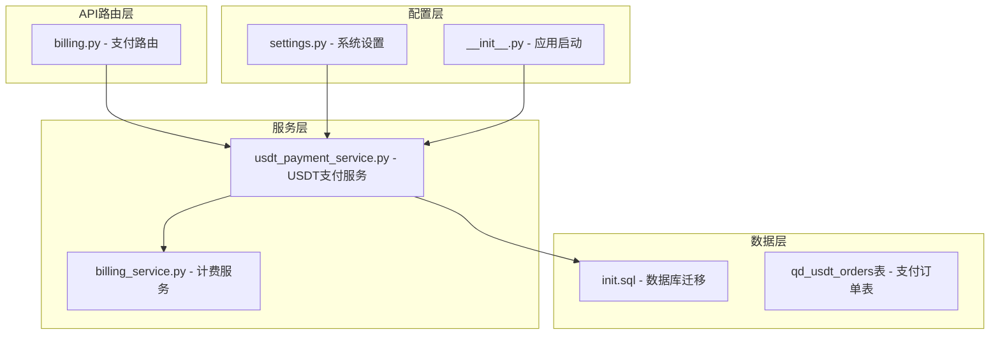
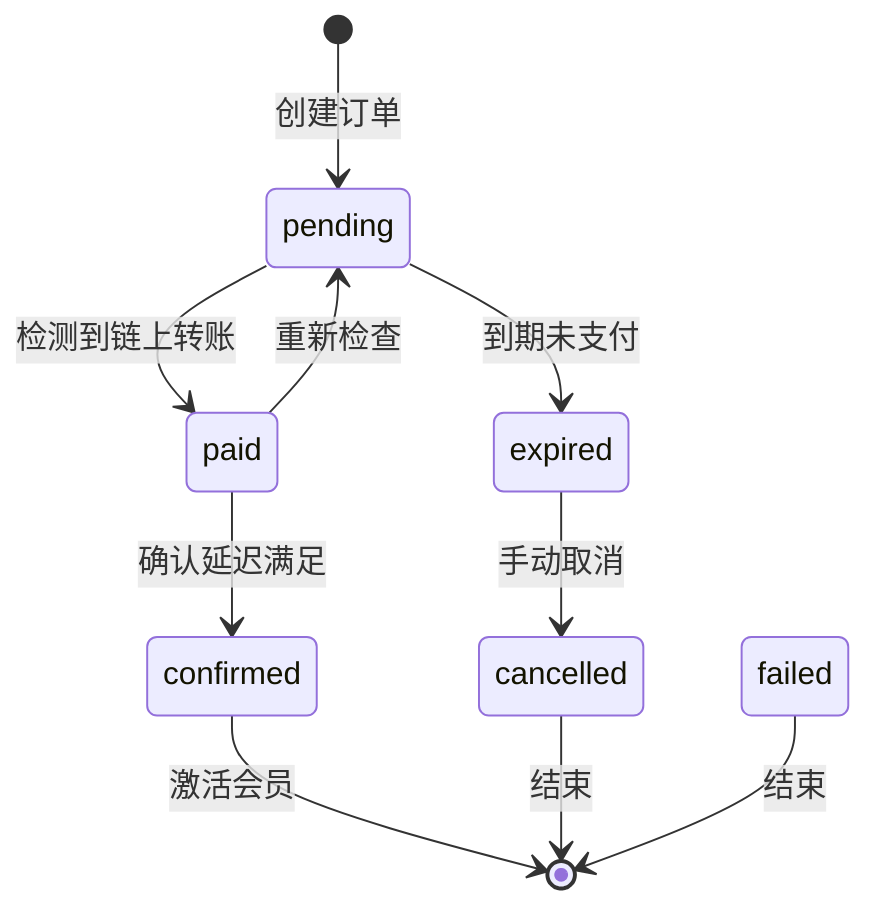
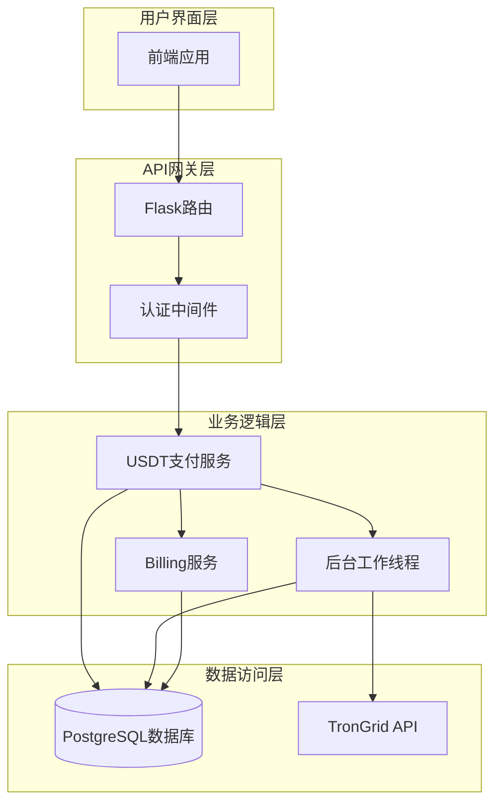
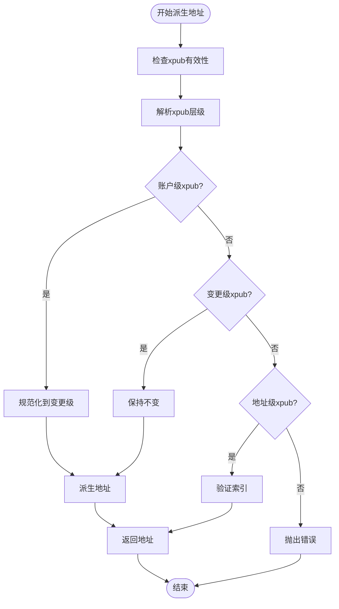
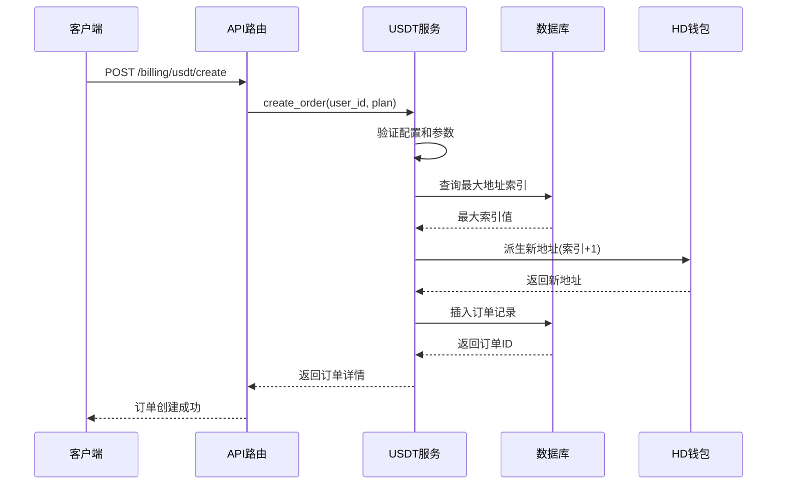
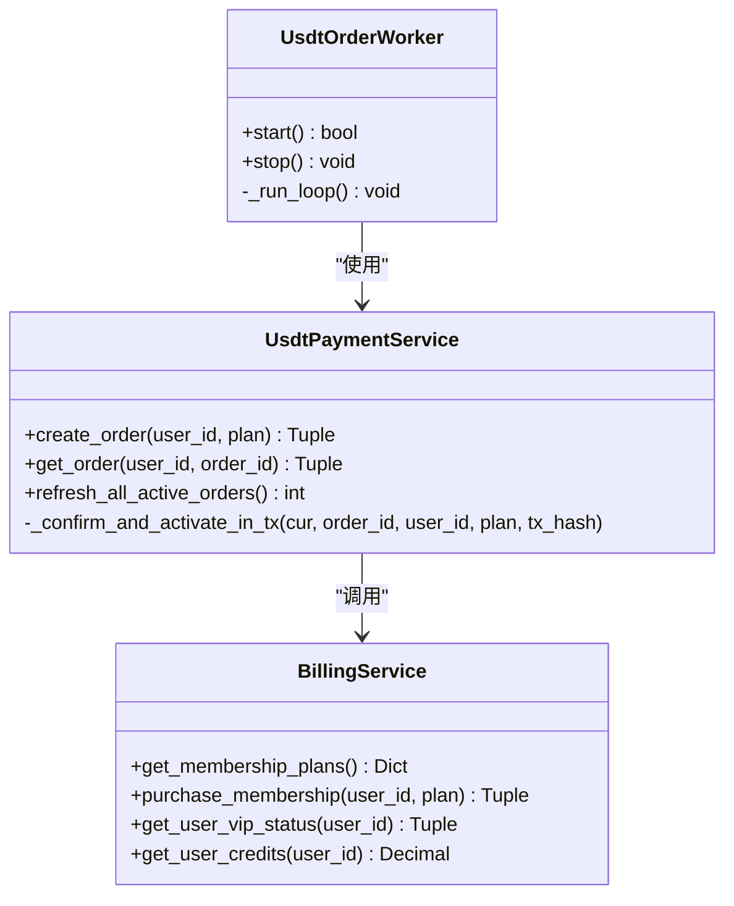
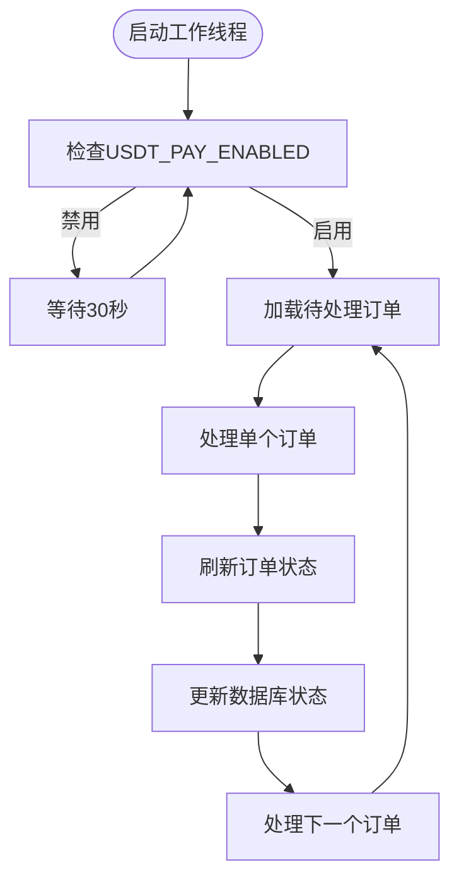
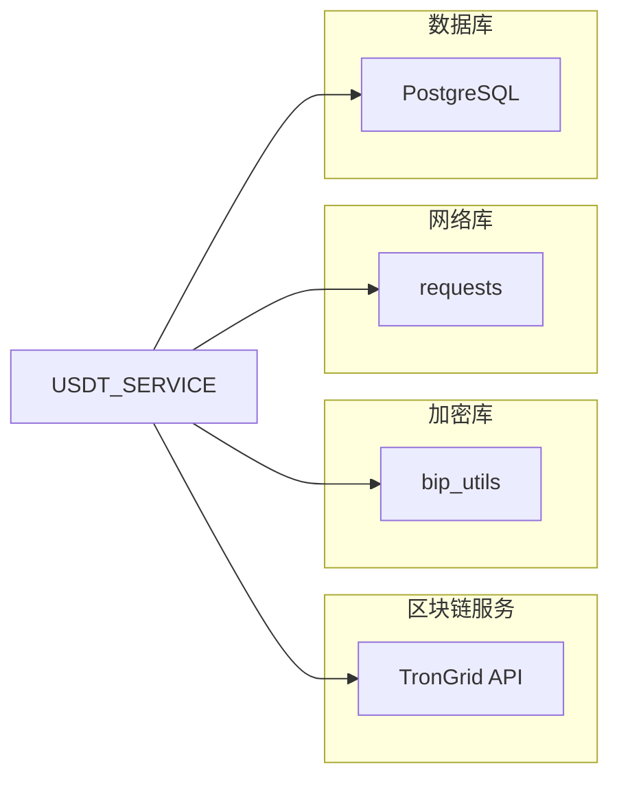
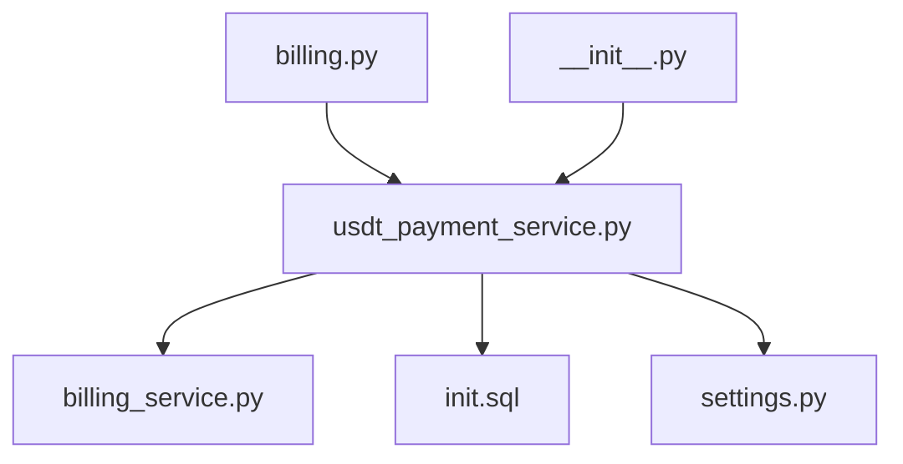
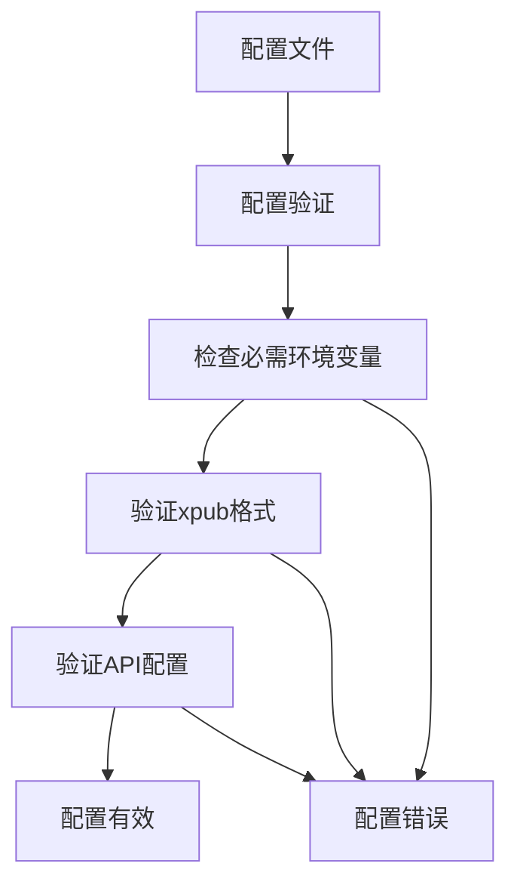

# USDT支付系统

<cite>
**本文档引用的文件**
- [usdt_payment_service.py](file://backend_api_python/app/services/usdt_payment_service.py)
- [billing.py](file://backend_api_python/app/routes/billing.py)
- [billing_service.py](file://backend_api_python/app/services/billing_service.py)
- [init.sql](file://backend_api_python/migrations/init.sql)
- [settings.py](file://backend_api_python/app/routes/settings.py)
- [__init__.py](file://backend_api_python/app/__init__.py)
</cite>

## 目录
1. [简介](#简介)
2. [项目结构](#项目结构)
3. [核心组件](#核心组件)
4. [架构概览](#架构概览)
5. [详细组件分析](#详细组件分析)
6. [依赖关系分析](#依赖关系分析)
7. [性能考虑](#性能考虑)
8. [故障排除指南](#故障排除指南)
9. [结论](#结论)

## 简介

USDT支付系统是一个基于区块链的支付解决方案，专门设计用于处理会员套餐的USDT-TRC20支付。该系统采用"每单独立地址+自动对账"的方案，为每个支付订单生成唯一的TRON地址，支持实时链上状态监控和自动确认机制。

系统的核心特点包括：
- 每个订单生成独立的TRON地址进行收款
- 基于HD钱包的地址派生机制
- 实时链上交易监控和自动对账
- 多层状态管理确保支付安全性
- 完整的后台工作线程处理异步任务

## 项目结构

USDT支付系统主要分布在以下模块中：

**图表来源**
- [billing.py:55-95](file://backend_api_python/app/routes/billing.py#L55-L95)
- [usdt_payment_service.py:23-829](file://backend_api_python/app/services/usdt_payment_service.py#L23-L829)
- [init.sql:76-99](file://backend_api_python/migrations/init.sql#L76-L99)

**章节来源**
- [billing.py:1-95](file://backend_api_python/app/routes/billing.py#L1-L95)
- [usdt_payment_service.py:1-830](file://backend_api_python/app/services/usdt_payment_service.py#L1-L830)
- [init.sql:1-1026](file://backend_api_python/migrations/init.sql#L1-L1026)

## 核心组件

### 数据库表结构

qd_usdt_orders表是整个支付系统的核心数据存储，包含以下关键字段：

| 字段名 | 类型 | 默认值 | 约束 | 描述 |
|--------|------|--------|------|------|
| id | SERIAL | - | PRIMARY KEY | 订单主键 |
| user_id | INTEGER | - | NOT NULL, REFERENCES qd_users | 用户外键关联 |
| plan | VARCHAR(20) | - | NOT NULL | 会员套餐选择 |
| chain | VARCHAR(20) | 'TRC20' | NOT NULL | 区块链选择 |
| amount_usdt | DECIMAL(20,6) | 0 | NOT NULL | 金额管理 |
| address_index | INTEGER | 0 | NOT NULL | HD钱包派生索引 |
| address | VARCHAR(80) | '' | NOT NULL | 支付地址 |
| status | VARCHAR(20) | 'pending' | NOT NULL | 订单状态 |
| tx_hash | VARCHAR(120) | '' | - | 链上交易哈希 |
| paid_at | TIMESTAMP | - | - | 支付时间戳 |
| confirmed_at | TIMESTAMP | - | - | 确认时间戳 |
| expires_at | TIMESTAMP | - | - | 过期时间 |
| created_at | TIMESTAMP | NOW() | - | 创建时间 |
| updated_at | TIMESTAMP | NOW() | - | 更新时间 |

### 状态流转机制

系统实现了完整的订单状态管理，支持以下状态转换：

**图表来源**
- [usdt_payment_service.py:282-424](file://backend_api_python/app/services/usdt_payment_service.py#L282-L424)

**章节来源**
- [init.sql:79-94](file://backend_api_python/migrations/init.sql#L79-L94)
- [usdt_payment_service.py:282-424](file://backend_api_python/app/services/usdt_payment_service.py#L282-L424)

## 架构概览

USDT支付系统采用分层架构设计，确保高可用性和可扩展性：

**图表来源**
- [billing.py:55-95](file://backend_api_python/app/routes/billing.py#L55-L95)
- [usdt_payment_service.py:23-829](file://backend_api_python/app/services/usdt_payment_service.py#L23-L829)
- [__init__.py:127-150](file://backend_api_python/app/__init__.py#L127-L150)

## 详细组件分析

### USDT支付服务类

UsdtPaymentService是系统的核心服务类，负责处理所有USDT支付相关的业务逻辑：

#### 核心功能模块

1. **配置管理**：动态加载环境变量配置
2. **地址派生**：基于HD钱包标准生成唯一支付地址
3. **订单管理**：创建、查询和状态更新订单
4. **链上监控**：实时监控TRON链上交易状态
5. **自动对账**：自动识别和确认已完成的支付

#### 地址派生算法

系统使用BIP44标准的HD钱包派生算法：

**图表来源**
- [usdt_payment_service.py:90-128](file://backend_api_python/app/services/usdt_payment_service.py#L90-L128)

#### 订单创建流程

**图表来源**
- [billing.py:55-77](file://backend_api_python/app/routes/billing.py#L55-L77)
- [usdt_payment_service.py:132-187](file://backend_api_python/app/services/usdt_payment_service.py#L132-L187)

**章节来源**
- [usdt_payment_service.py:23-829](file://backend_api_python/app/services/usdt_payment_service.py#L23-L829)

### 计费服务集成

系统通过BillingService与会员管理系统集成：

**图表来源**
- [billing_service.py:47-758](file://backend_api_python/app/services/billing_service.py#L47-L758)
- [usdt_payment_service.py:23-829](file://backend_api_python/app/services/usdt_payment_service.py#L23-L829)

**章节来源**
- [billing_service.py:158-346](file://backend_api_python/app/services/billing_service.py#L158-L346)

### 后台工作线程

UsdtOrderWorker负责异步处理订单状态更新：

**图表来源**
- [usdt_payment_service.py:754-829](file://backend_api_python/app/services/usdt_payment_service.py#L754-L829)

**章节来源**
- [usdt_payment_service.py:754-829](file://backend_api_python/app/services/usdt_payment_service.py#L754-L829)

## 依赖关系分析

### 外部依赖

系统依赖以下外部服务和库：

**图表来源**
- [usdt_payment_service.py:7-18](file://backend_api_python/app/services/usdt_payment_service.py#L7-L18)

### 内部依赖关系

**图表来源**
- [billing.py:8-13](file://backend_api_python/app/routes/billing.py#L8-L13)
- [usdt_payment_service.py:16-18](file://backend_api_python/app/services/usdt_payment_service.py#L16-L18)
- [settings.py:800-860](file://backend_api_python/app/routes/settings.py#L800-L860)

**章节来源**
- [billing.py:8-13](file://backend_api_python/app/routes/billing.py#L8-L13)
- [usdt_payment_service.py:7-18](file://backend_api_python/app/services/usdt_payment_service.py#L7-L18)

## 性能考虑

### 数据库优化

系统通过以下方式优化数据库性能：

1. **索引优化**：为常用查询字段建立索引
2. **连接池管理**：避免长时间持有数据库连接
3. **批量处理**：后台工作线程批量处理订单
4. **事务分离**：将链上HTTP请求与数据库事务分离

### 缓存策略

- 配置缓存：避免频繁读取环境变量
- 单例模式：确保服务实例的唯一性
- 进程级缓存：schema确保标志避免重复DDL执行

### 异步处理

- 后台工作线程处理链上监控
- HTTP请求在数据库事务外执行
- 分离的确认和激活流程

## 故障排除指南

### 常见问题及解决方案

| 问题类型 | 症状 | 可能原因 | 解决方案 |
|----------|------|----------|----------|
| 支付地址生成失败 | 创建订单时报错 | xpub无效或索引错误 | 检查USDT_TRC20_XPUB配置 |
| 链上交易监控失败 | 订单状态不更新 | TronGrid API不可用 | 检查TRONGRID_BASE_URL和API密钥 |
| 订单确认延迟 | 支付完成后无法立即激活 | USDT_PAY_CONFIRM_SECONDS设置过高 | 调整确认延迟参数 |
| 并发冲突 | 订单状态更新冲突 | 多实例同时处理同一订单 | 使用数据库事务和锁机制 |

### 日志监控

系统提供了详细的日志记录机制：

- **调试日志**：详细的状态变化和处理过程
- **警告日志**：链上API错误和异常情况
- **错误日志**：系统内部异常和错误
- **信息日志**：正常流程的状态报告

**章节来源**
- [usdt_payment_service.py:805-807](file://backend_api_python/app/services/usdt_payment_service.py#L805-L807)

### 配置验证

系统提供了配置验证机制：

**图表来源**
- [settings.py:800-860](file://backend_api_python/app/routes/settings.py#L800-L860)

## 结论

USDT支付系统是一个设计精良的区块链支付解决方案，具有以下优势：

1. **安全性**：基于HD钱包的地址派生机制确保每个订单的唯一性
2. **可靠性**：多层状态管理和后台工作线程确保支付流程的完整性
3. **可扩展性**：模块化设计支持未来功能扩展
4. **易维护性**：清晰的代码结构和完善的日志记录

系统的主要改进方向包括：
- 支持更多区块链网络
- 增强异常处理和重试机制
- 优化性能监控和告警系统
- 扩展支付方式支持

通过合理的配置和部署，该系统能够为企业提供稳定可靠的USDT支付服务。