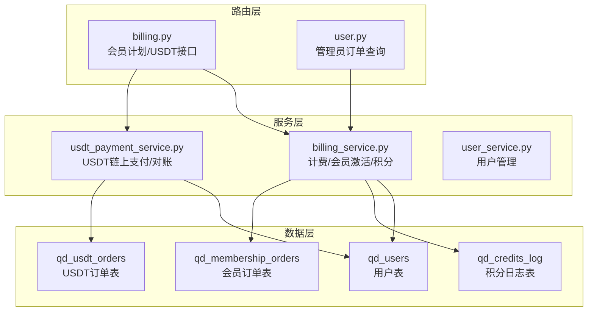
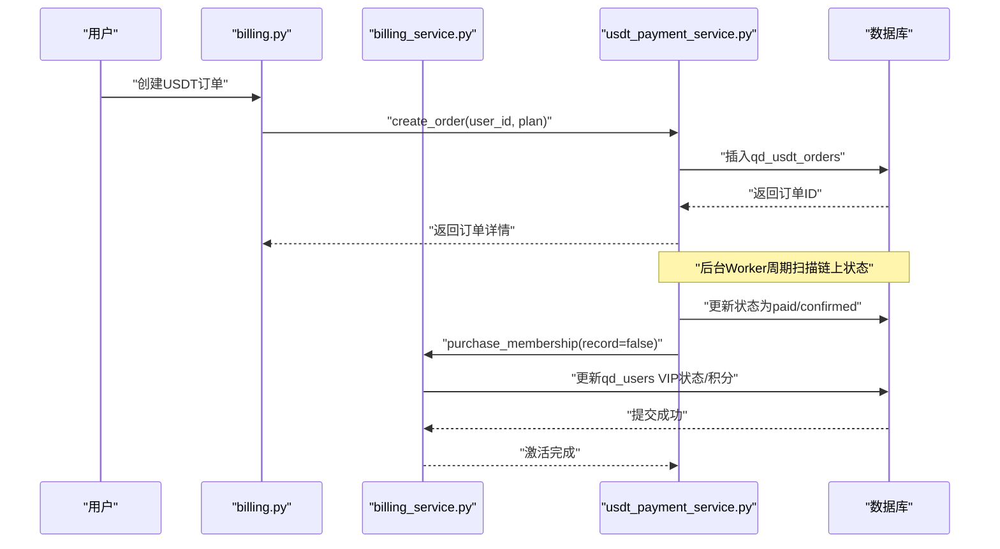
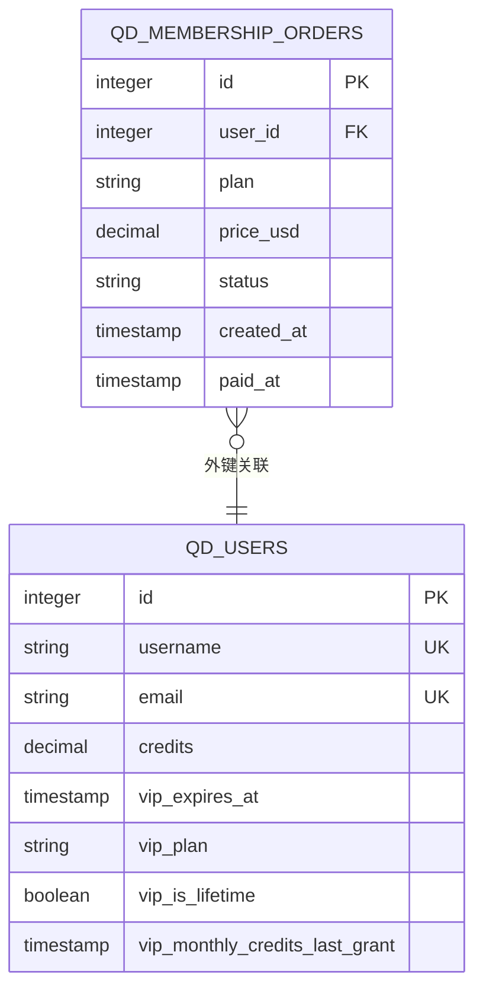
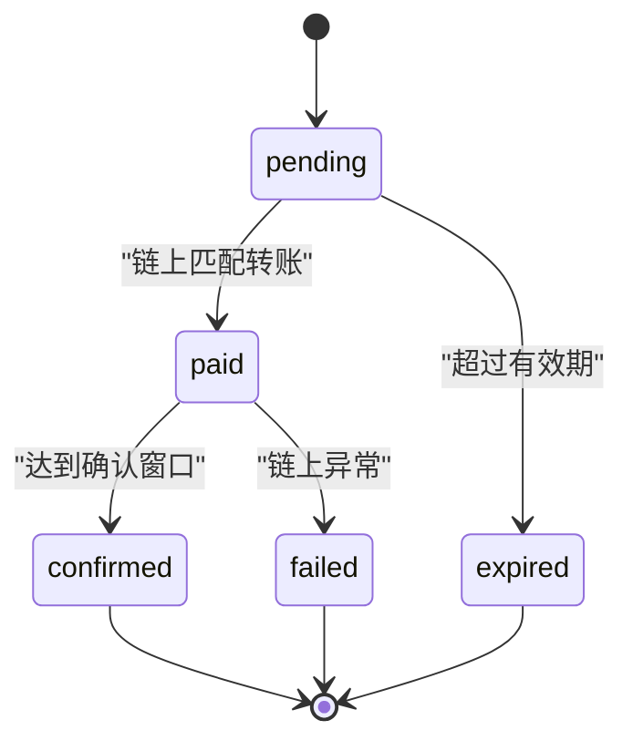
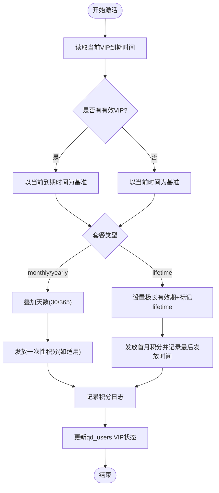
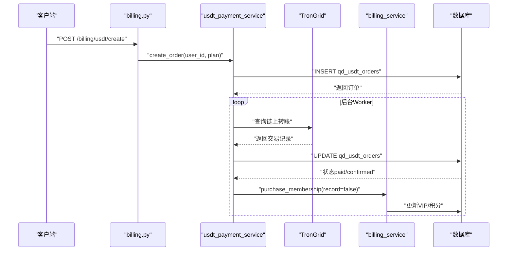
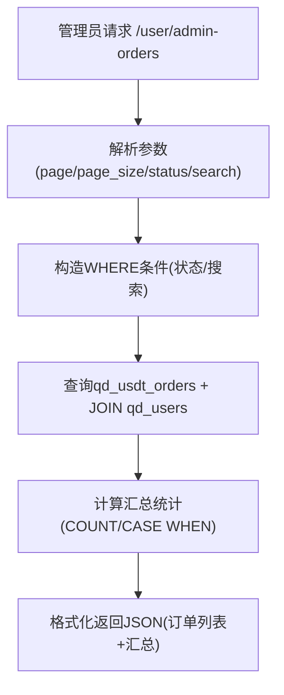
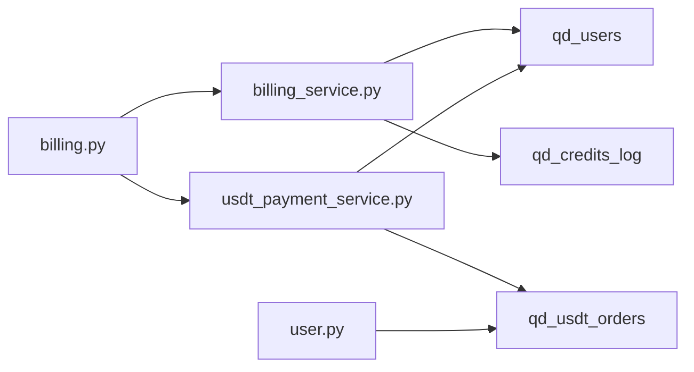

# 会员订单系统

<cite>
**本文档引用的文件**
- [init.sql](file://backend_api_python/migrations/init.sql)
- [billing.py](file://backend_api_python/app/routes/billing.py)
- [billing_service.py](file://backend_api_python/app/services/billing_service.py)
- [usdt_payment_service.py](file://backend_api_python/app/services/usdt_payment_service.py)
- [user.py](file://backend_api_python/app/routes/user.py)
- [user_service.py](file://backend_api_python/app/services/user_service.py)
</cite>

## 目录
1. [简介](#简介)
2. [项目结构](#项目结构)
3. [核心组件](#核心组件)
4. [架构总览](#架构总览)
5. [详细组件分析](#详细组件分析)
6. [依赖关系分析](#依赖关系分析)
7. [性能考量](#性能考量)
8. [故障排查指南](#故障排查指南)
9. [结论](#结论)
10. [附录](#附录)

## 简介
本文件面向SharkQuantDinger项目的会员订单系统，围绕qd_membership_orders表进行全面技术文档化，涵盖表结构设计、外键关联、套餐类型与定价、状态管理、会员权益实现、生命周期流程、续费与升级逻辑、与积分系统的交互，以及查询统计与报表能力。文档旨在帮助开发者与运营人员快速理解并高效维护该系统。

## 项目结构
会员订单系统主要涉及以下模块：
- 数据库迁移脚本：定义qd_membership_orders与相关表结构及索引
- 路由层：提供会员计划查询、传统模拟支付入口、USDT链上支付相关接口
- 服务层：计费服务（含会员套餐配置、激活、积分发放）、USDT支付服务（链上对账、状态机推进）
- 管理员接口：全站订单查询与统计

**图示来源**
- [billing.py:1-95](file://backend_api_python/app/routes/billing.py#L1-L95)
- [billing_service.py:1-758](file://backend_api_python/app/services/billing_service.py#L1-L758)
- [usdt_payment_service.py:1-830](file://backend_api_python/app/services/usdt_payment_service.py#L1-L830)
- [user.py:1476-1624](file://backend_api_python/app/routes/user.py#L1476-L1624)

**章节来源**
- [init.sql:63-73](file://backend_api_python/migrations/init.sql#L63-L73)
- [billing.py:1-95](file://backend_api_python/app/routes/billing.py#L1-L95)
- [billing_service.py:1-758](file://backend_api_python/app/services/billing_service.py#L1-L758)
- [usdt_payment_service.py:1-830](file://backend_api_python/app/services/usdt_payment_service.py#L1-L830)
- [user.py:1476-1624](file://backend_api_python/app/routes/user.py#L1476-L1624)

## 核心组件
- qd_membership_orders表：记录会员订单（传统模拟支付路径）
- qd_usdt_orders表：记录USDT链上支付订单（主推路径）
- 计费服务billing_service：提供会员套餐配置、激活、积分发放、VIP状态管理
- USDT支付服务usdt_payment_service：负责订单创建、链上扫描、状态推进、会员激活
- 管理员接口：聚合查询qd_usdt_orders并生成汇总统计

**章节来源**
- [init.sql:63-98](file://backend_api_python/migrations/init.sql#L63-L98)
- [billing_service.py:160-345](file://backend_api_python/app/services/billing_service.py#L160-L345)
- [usdt_payment_service.py:132-424](file://backend_api_python/app/services/usdt_payment_service.py#L132-L424)
- [user.py:1476-1624](file://backend_api_python/app/routes/user.py#L1476-L1624)

## 架构总览
会员订单系统采用“双轨制”：
- 传统模拟支付：通过billing_service写入qd_membership_orders，状态默认paid
- USDT链上支付：通过usdt_payment_service创建qd_usdt_orders，链上扫描后推进状态，最终调用billing_service激活会员

**图示来源**
- [billing.py:55-93](file://backend_api_python/app/routes/billing.py#L55-L93)
- [usdt_payment_service.py:132-424](file://backend_api_python/app/services/usdt_payment_service.py#L132-L424)
- [billing_service.py:202-345](file://backend_api_python/app/services/billing_service.py#L202-L345)

## 详细组件分析

### qd_membership_orders表设计
- 字段说明
  - id：自增主键
  - user_id：外键关联qd_users(id)，级联删除
  - plan：会员套餐类型，枚举值monthly/yearly/lifetime
  - price_usd：订单金额（美元），精度至分
  - status：订单状态，枚举值paid/pending/failed/refunded（模拟默认paid）
  - created_at：创建时间
  - paid_at：支付完成时间
- 索引
  - idx_membership_orders_user_id：按user_id建立索引，便于按用户查询

**图示来源**
- [init.sql:8-31](file://backend_api_python/migrations/init.sql#L8-L31)
- [init.sql:63-73](file://backend_api_python/migrations/init.sql#L63-L73)

**章节来源**
- [init.sql:63-73](file://backend_api_python/migrations/init.sql#L63-L73)

### 会员套餐类型与定价机制
- 套餐类型
  - monthly：月卡，持续30天
  - yearly：年卡，持续365天
  - lifetime：终身卡，长期有效，按月发放积分
- 定价来源
  - 通过环境变量配置：MEMBERSHIP_MONTHLY_PRICE_USD、MEMBERSHIP_YEARLY_PRICE_USD、MEMBERSHIP_LIFETIME_PRICE_USD
  - 一次性积分奖励：monthly/yearly对应credits_once；lifetime对应credits_monthly（按月发放）
- 价格字段price_usd
  - 存储USD金额，用于订单记录与统计
  - 实际支付以USDT订单为准（qd_usdt_orders）

**章节来源**
- [billing_service.py:160-200](file://backend_api_python/app/services/billing_service.py#L160-L200)
- [init.sql:66-67](file://backend_api_python/migrations/init.sql#L66-L67)

### 订单状态管理
- qd_membership_orders状态
  - paid：模拟支付默认状态
  - pending/failed/refunded：预留扩展（模拟路径）
- qd_usdt_orders状态（主推路径）
  - pending：等待链上转账
  - paid：链上已确认转账，等待确认窗口
  - confirmed：满足确认窗口后激活会员
  - expired/cancelled/failed：过期或失败

**图示来源**
- [usdt_payment_service.py:282-395](file://backend_api_python/app/services/usdt_payment_service.py#L282-L395)
- [usdt_payment_service.py:543-605](file://backend_api_python/app/services/usdt_payment_service.py#L543-L605)

**章节来源**
- [init.sql:68-87](file://backend_api_python/migrations/init.sql#L68-L87)
- [usdt_payment_service.py:282-395](file://backend_api_python/app/services/usdt_payment_service.py#L282-L395)

### 会员权益实现机制
- VIP过期时间字段vip_expires_at
  - 通过billing_service.purchase_membership更新
  - monthly/yearly：基于当前VIP到期时间或当前时间，叠加天数
  - lifetime：设置极长有效期并标记vip_is_lifetime
- VIP套餐字段vip_plan
  - 记录当前生效的套餐类型（monthly/yearly/lifetime）
- 与积分系统的交互
  - monthly/yearly：首次购买发放一次性积分（credits_once）
  - lifetime：首次购买发放首月积分，并设置vip_monthly_credits_last_grant
  - 后续定期发放：通过_lifetime月度积分发放逻辑按30天周期补发
- 审计日志
  - 在qd_credits_log中记录会员购买与积分发放动作

**图示来源**
- [billing_service.py:202-345](file://backend_api_python/app/services/billing_service.py#L202-L345)
- [billing_service.py:397-459](file://backend_api_python/app/services/billing_service.py#L397-L459)

**章节来源**
- [init.sql:18-21](file://backend_api_python/migrations/init.sql#L18-L21)
- [billing_service.py:202-345](file://backend_api_python/app/services/billing_service.py#L202-L345)
- [billing_service.py:397-459](file://backend_api_python/app/services/billing_service.py#L397-L459)

### 会员订单生命周期管理
- 传统模拟支付路径
  - 路由billing.py提供禁用的模拟支付接口（仅返回提示）
  - billing_service.purchase_membership在record_membership_order=true时向qd_membership_orders写入一条paid订单
- USDT链上支付路径（推荐）
  - 创建订单：usdt_payment_service.create_order生成唯一地址与订单
  - 链上扫描：refresh_all_active_orders或后台Worker扫描TronGrid
  - 状态推进：paid->confirmed后调用billing_service.purchase_membership激活会员
  - 最终落库：qd_usdt_orders状态更新，qd_users VIP状态与积分更新

**图示来源**
- [billing.py:55-93](file://backend_api_python/app/routes/billing.py#L55-L93)
- [usdt_payment_service.py:132-424](file://backend_api_python/app/services/usdt_payment_service.py#L132-L424)
- [billing_service.py:202-345](file://backend_api_python/app/services/billing_service.py#L202-L345)

**章节来源**
- [billing.py:35-47](file://backend_api_python/app/routes/billing.py#L35-L47)
- [usdt_payment_service.py:132-424](file://backend_api_python/app/services/usdt_payment_service.py#L132-L424)
- [billing_service.py:202-345](file://backend_api_python/app/services/billing_service.py#L202-L345)

### 续费与升级业务逻辑
- 续费策略
  - monthly/yearly：若用户已有有效VIP，新订单以当前到期时间作为基点，叠加相应天数，实现无缝续费
- 升级策略
  - 从较低套餐升级到较高套餐时，同样以当前到期时间作为基点，叠加新套餐天数
- lifetime专属
  - lifetime用户享受月度积分补发机制，且VIP状态长期有效
- 与积分系统交互
  - 升级/续费不重复发放一次性积分，但lifetime会按周期补发月度积分

**章节来源**
- [billing_service.py:230-254](file://backend_api_python/app/services/billing_service.py#L230-L254)
- [billing_service.py:397-459](file://backend_api_python/app/services/billing_service.py#L397-L459)

### 查询统计与报表功能
- 管理员订单查询
  - 接口：GET /user/admin-orders
  - 支持按状态过滤（paid/pending/confirmed/expired/all）与用户名/邮箱搜索
  - 返回字段：订单ID、用户信息、套餐、金额、链、状态、时间戳等
  - 汇总统计：总订单数、已支付订单数、待支付订单数、失败订单数、总营收
- 数据来源
  - 主要查询qd_usdt_orders，通过LEFT JOIN qd_users获取用户信息
  - 使用COUNT与CASE WHEN进行状态分类统计

**图示来源**
- [user.py:1476-1624](file://backend_api_python/app/routes/user.py#L1476-L1624)

**章节来源**
- [user.py:1476-1624](file://backend_api_python/app/routes/user.py#L1476-L1624)

## 依赖关系分析
- 外键依赖
  - qd_membership_orders.user_id -> qd_users.id (级联删除)
  - qd_usdt_orders.user_id -> qd_users.id (级联删除)
- 服务间依赖
  - billing_service依赖usdt_payment_service进行USDT订单激活
  - usdt_payment_service依赖TronGrid API进行链上扫描
  - 管理员接口依赖usdt订单表进行全站统计
- 数据一致性
  - 会员激活通过事务更新qd_users与qd_credits_log，保证原子性
  - USDT订单状态推进通过短事务与链上查询分离，避免长时间持有连接

**图示来源**
- [billing_service.py:202-345](file://backend_api_python/app/services/billing_service.py#L202-L345)
- [usdt_payment_service.py:132-424](file://backend_api_python/app/services/usdt_payment_service.py#L132-L424)
- [user.py:1476-1624](file://backend_api_python/app/routes/user.py#L1476-L1624)

**章节来源**
- [init.sql:63-98](file://backend_api_python/migrations/init.sql#L63-L98)
- [billing_service.py:202-345](file://backend_api_python/app/services/billing_service.py#L202-L345)
- [usdt_payment_service.py:132-424](file://backend_api_python/app/services/usdt_payment_service.py#L132-L424)
- [user.py:1476-1624](file://backend_api_python/app/routes/user.py#L1476-L1624)

## 性能考量
- 连接池与事务
  - USDT支付服务将链上HTTP调用与数据库更新分离，避免长时间持有连接，降低“idle in transaction”风险
- 批量处理
  - 后台Worker批量扫描qd_usdt_orders，限制每次处理数量，避免阻塞
- 索引优化
  - qd_membership_orders与qd_usdt_orders均按user_id建立索引，提升按用户查询效率
- 缓存与配置
  - 计费配置采用短期缓存，减少频繁读取环境变量带来的开销

[本节为通用性能建议，无需特定文件引用]

## 故障排查指南
- USDT订单未激活
  - 检查TronGrid API密钥与网络连通性
  - 查看后台Worker日志，确认refresh_all_active_orders执行情况
  - 核对订单状态是否停留在paid且未满足确认窗口
- 会员未生效
  - 确认billing_service.purchase_membership是否被调用（USDT路径）
  - 检查qd_users的vip_expires_at与vip_plan是否更新
  - 核对qd_credits_log中是否存在会员购买与积分发放记录
- 订单查询异常
  - 管理员接口返回错误时，检查参数page/page_size/status/search合法性
  - 确认qd_usdt_orders表存在且索引正常

**章节来源**
- [usdt_payment_service.py:543-605](file://backend_api_python/app/services/usdt_payment_service.py#L543-L605)
- [billing_service.py:202-345](file://backend_api_python/app/services/billing_service.py#L202-L345)
- [user.py:1476-1624](file://backend_api_python/app/routes/user.py#L1476-L1624)

## 结论
qd_membership_orders表为会员订单系统提供了清晰的数据结构与外键约束，结合billing_service与usdt_payment_service实现了从订单创建、链上对账到会员激活的完整闭环。系统通过双轨制设计兼顾了传统模拟支付与USDT链上支付两种场景，并通过完善的查询统计接口支持运营监控与决策。建议在生产环境中优先使用USDT链上支付路径，并持续优化后台Worker的扫描频率与TronGrid集成稳定性。

[本节为总结性内容，无需特定文件引用]

## 附录
- 环境变量配置项
  - MEMBERSHIP_MONTHLY_PRICE_USD：月卡价格（美元）
  - MEMBERSHIP_YEARLY_PRICE_USD：年卡价格（美元）
  - MEMBERSHIP_LIFETIME_PRICE_USD：终身卡价格（美元）
  - MEMBERSHIP_MONTHLY_CREDITS：月卡一次性积分
  - MEMBERSHIP_YEARLY_CREDITS：年卡一次性积分
  - MEMBERSHIP_LIFETIME_MONTHLY_CREDITS：终身卡月度积分
  - USDT_PAY_ENABLED：是否启用USDT支付
  - TRONGRID_BASE_URL/USDT_TRC20_CONTRACT/TRONGRID_API_KEY：TronGrid配置
  - USDT_PAY_CONFIRM_SECONDS/USDT_PAY_EXPIRE_MINUTES：确认窗口与过期时间
- 常用接口
  - GET /billing/plans：获取会员计划与用户计费快照
  - POST /billing/usdt/create：创建USDT订单
  - GET /billing/usdt/order/{id}：查询USDT订单
  - GET /user/admin-orders：管理员全站订单查询与统计

**章节来源**
- [billing_service.py:160-200](file://backend_api_python/app/services/billing_service.py#L160-L200)
- [usdt_payment_service.py:33-46](file://backend_api_python/app/services/usdt_payment_service.py#L33-L46)
- [billing.py:20-93](file://backend_api_python/app/routes/billing.py#L20-L93)
- [user.py:1476-1624](file://backend_api_python/app/routes/user.py#L1476-L1624)