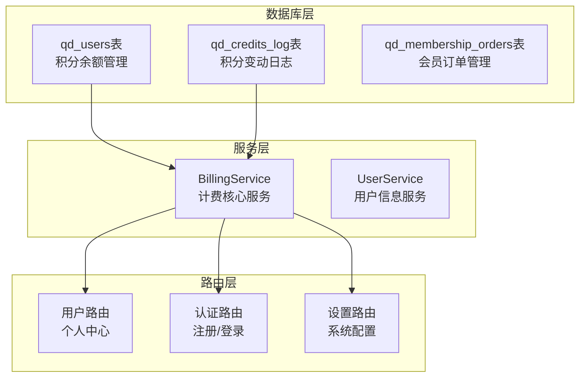
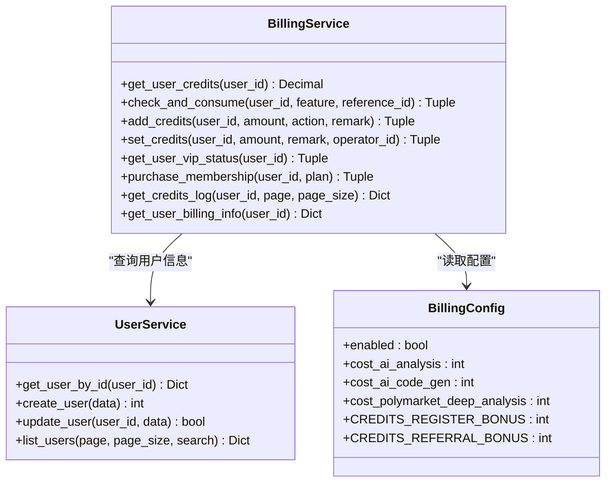
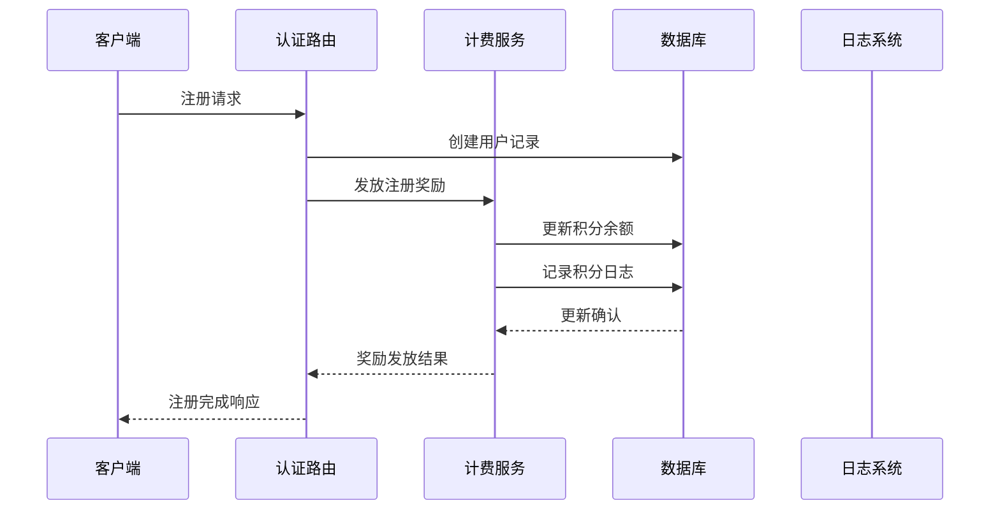
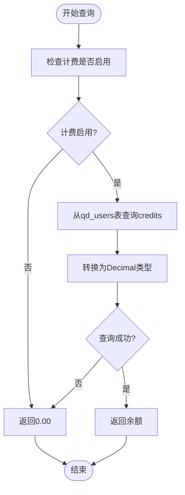
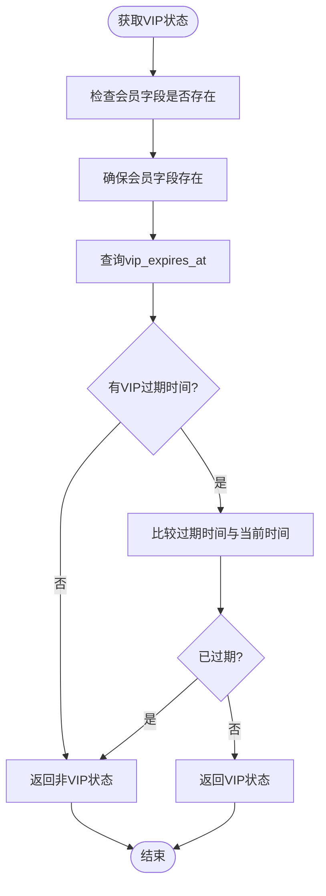
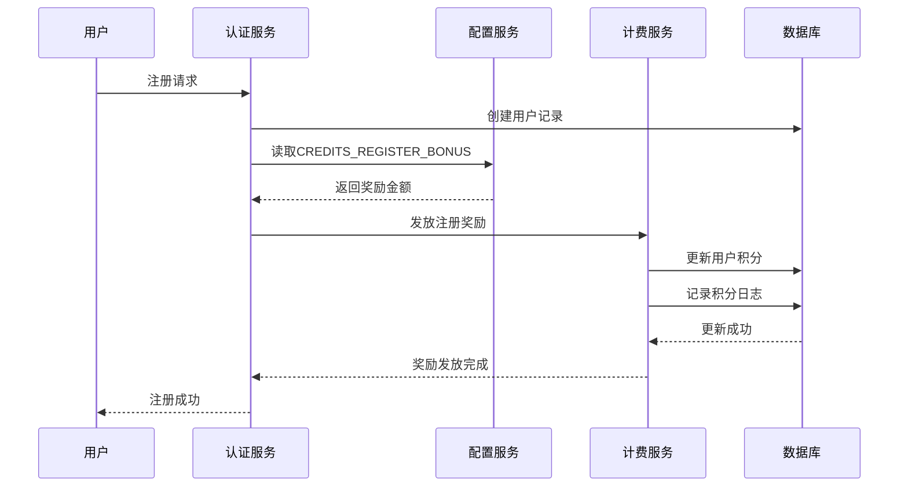
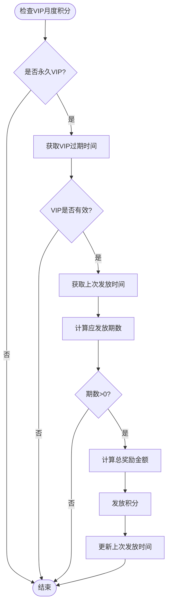
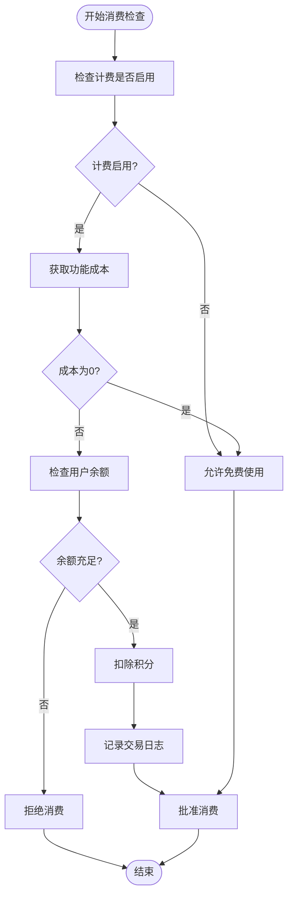
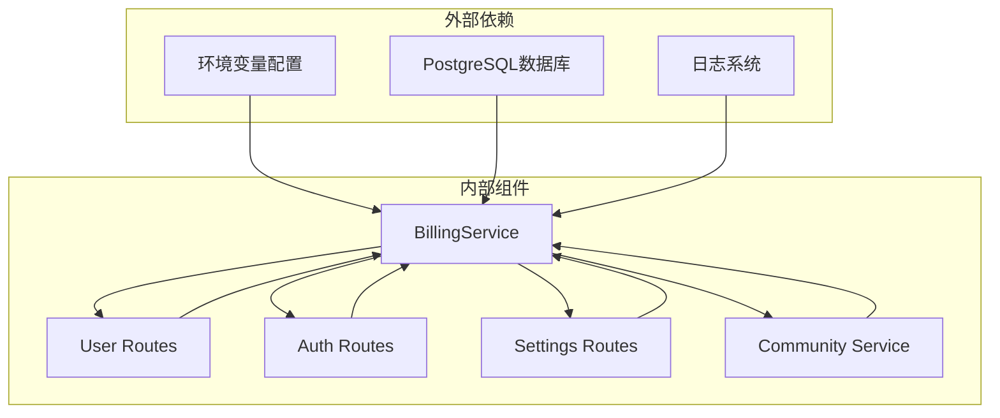

# 用户积分管理

<cite>
**本文档引用的文件**
- [init.sql](file://backend_api_python/migrations/init.sql)
- [billing_service.py](file://backend_api_python/app/services/billing_service.py)
- [user.py](file://backend_api_python/app/routes/user.py)
- [auth.py](file://backend_api_python/app/routes/auth.py)
- [env.example](file://backend_api_python/env.example)
- [community_service.py](file://backend_api_python/app/services/community_service.py)
</cite>

## 目录
1. [简介](#简介)
2. [项目结构](#项目结构)
3. [核心组件](#核心组件)
4. [架构概览](#架构概览)
5. [详细组件分析](#详细组件分析)
6. [依赖关系分析](#依赖关系分析)
7. [性能考虑](#性能考虑)
8. [故障排除指南](#故障排除指南)
9. [结论](#结论)

## 简介

QuantDinger平台采用基于积分的付费模式，通过qd_users表的credits字段实现精细化的用户消费管理。该系统支持多种积分获取渠道（注册奖励、邀请奖励、VIP月度发放），并提供完整的积分消费追踪和风控机制。

系统的核心设计理念是"透明化积分管理"，所有积分变动都有详细的日志记录，支持管理员审计和用户自助查询。通过DECIMAL(20,2)的数据类型设计，确保了金融级精度的计算准确性。

## 项目结构

积分管理系统主要分布在以下模块中：

**图表来源**
- [init.sql:8-53](file://backend_api_python/migrations/init.sql#L8-L53)
- [billing_service.py:47-758](file://backend_api_python/app/services/billing_service.py#L47-L758)

**章节来源**
- [init.sql:8-53](file://backend_api_python/migrations/init.sql#L8-L53)
- [billing_service.py:47-758](file://backend_api_python/app/services/billing_service.py#L47-L758)

## 核心组件

### 数据库表结构设计

#### qd_users表 - 用户积分核心表
| 字段名 | 数据类型 | 约束 | 描述 | 默认值 |
|--------|----------|------|------|--------|
| credits | DECIMAL(20,2) | DEFAULT 0 | 积分余额 | 0.00 |
| vip_expires_at | TIMESTAMP | NULL | VIP过期时间 | NULL |
| vip_plan | VARCHAR(20) | DEFAULT '' | VIP套餐类型 | '' |
| vip_is_lifetime | BOOLEAN | DEFAULT FALSE | 是否永久会员 | FALSE |
| vip_monthly_credits_last_grant | TIMESTAMP | NULL | 上次发放月度积分时间 | NULL |

#### qd_credits_log表 - 积分变动日志
| 字段名 | 数据类型 | 约束 | 描述 |
|--------|----------|------|------|
| user_id | INTEGER | NOT NULL | 用户ID |
| action | VARCHAR(50) | NOT NULL | 操作类型(recharge/consume/refund/admin_adjust/vip_grant) |
| amount | DECIMAL(20,2) | NOT NULL | 变动金额 |
| balance_after | DECIMAL(20,2) | NOT NULL | 变动后余额 |
| feature | VARCHAR(50) | DEFAULT '' | 消费的功能(ai_analysis/strategy_run/backtest等) |
| reference_id | VARCHAR(100) | DEFAULT '' | 关联ID(订单号、分析任务ID等) |
| remark | TEXT | DEFAULT '' | 备注 |
| operator_id | INTEGER | NULL | 操作人ID(管理员调整时记录) |

**章节来源**
- [init.sql:8-53](file://backend_api_python/migrations/init.sql#L8-L53)

### 服务层架构

**图表来源**
- [billing_service.py:47-758](file://backend_api_python/app/services/billing_service.py#L47-L758)
- [user_service.py:56-701](file://backend_api_python/app/services/user_service.py#L56-L701)

**章节来源**
- [billing_service.py:47-758](file://backend_api_python/app/services/billing_service.py#L47-L758)
- [user_service.py:56-701](file://backend_api_python/app/services/user_service.py#L56-L701)

## 架构概览

积分管理系统采用分层架构设计，确保了高内聚低耦合的特性：

**图表来源**
- [auth.py:670-707](file://backend_api_python/app/routes/auth.py#L670-L707)
- [billing_service.py:527-577](file://backend_api_python/app/services/billing_service.py#L527-L577)

系统支持的积分获取方式包括：
- **注册奖励**: 新用户首次注册获得固定积分
- **邀请奖励**: 推荐新用户注册获得积分
- **VIP月度发放**: VIP用户定期获得月度积分
- **会员购买**: 通过购买会员套餐获得积分

## 详细组件分析

### 积分余额管理

#### 数据类型设计决策

系统采用DECIMAL(20,2)作为积分余额的数据类型，这一设计具有以下优势：

1. **金融级精度**: 支持最多20位数字，其中2位小数，满足金融计算的精确要求
2. **避免浮点误差**: DECIMAL类型避免了二进制浮点运算的累积误差问题
3. **扩展性**: 20位数字足以支持大型平台的积分规模需求
4. **合规性**: 符合金融行业对精确计算的要求

#### 积分余额查询流程

**图表来源**
- [billing_service.py:98-116](file://backend_api_python/app/services/billing_service.py#L98-L116)

**章节来源**
- [billing_service.py:98-116](file://backend_api_python/app/services/billing_service.py#L98-L116)

### VIP相关字段设计

#### VIP状态管理

系统通过四个字段协同工作来管理VIP状态：

| 字段名 | 类型 | 描述 | 业务含义 |
|--------|------|------|----------|
| vip_expires_at | TIMESTAMP | VIP过期时间 | 记录VIP的有效截止时间 |
| vip_plan | VARCHAR(20) | VIP套餐类型 | 记录当前VIP套餐(monthly/yearly/lifetime) |
| vip_is_lifetime | BOOLEAN | 是否永久会员 | 标识用户是否为永久VIP |
| vip_monthly_credits_last_grant | TIMESTAMP | 上次月度积分发放时间 | 用于计算累计应发积分 |

#### VIP状态判断逻辑

**图表来源**
- [billing_service.py:117-156](file://backend_api_python/app/services/billing_service.py#L117-L156)

**章节来源**
- [billing_service.py:117-156](file://backend_api_python/app/services/billing_service.py#L117-L156)

### 积分获取机制

#### 注册奖励机制

系统在用户注册完成后自动发放注册奖励：

**图表来源**
- [auth.py:689-697](file://backend_api_python/app/routes/auth.py#L689-L697)
- [env.example:161](file://backend_api_python/env.example#L161)

#### 邀请奖励机制

系统支持两级邀请奖励体系：

1. **直接邀请奖励**: 邀请人获得固定积分
2. **间接邀请奖励**: 通过邀请链传递的奖励

**章节来源**
- [auth.py:699-707](file://backend_api_python/app/routes/auth.py#L699-L707)
- [user.py:556-635](file://backend_api_python/app/routes/user.py#L556-L635)
- [env.example:162](file://backend_api_python/env.example#L162)

#### VIP月度积分发放

系统为VIP用户提供定期的月度积分奖励：

**图表来源**
- [billing_service.py:397-459](file://backend_api_python/app/services/billing_service.py#L397-L459)

**章节来源**
- [billing_service.py:397-459](file://backend_api_python/app/services/billing_service.py#L397-L459)

### 积分消费机制

#### 功能定价策略

系统为不同功能设置了不同的积分消耗标准：

| 功能名称 | 积分消耗 | 描述 |
|----------|----------|------|
| ai_analysis | 10积分 | AI分析功能 |
| ai_code_gen | 30积分 | AI代码生成 |
| polymarket_deep_analysis | 15积分 | 深度分析功能 |

#### 消费检查流程

**图表来源**
- [billing_service.py:461-525](file://backend_api_python/app/services/billing_service.py#L461-L525)

**章节来源**
- [billing_service.py:461-525](file://backend_api_python/app/services/billing_service.py#L461-L525)

### 积分日志管理

#### 日志记录策略

系统为所有积分变动提供完整的审计追踪：

1. **自动记录**: 所有积分增减操作都会自动生成日志
2. **详细信息**: 包含操作类型、金额、余额、功能类型、关联ID等
3. **时间戳**: 使用UTC时间确保全球一致性
4. **管理员操作**: 管理员调整会记录操作人信息

#### 日志查询接口

用户可以通过以下接口查询积分日志：
- 自己的积分日志：`/api/user/my-credits-log`
- 管理员查看：`/api/user/credits-log`

**章节来源**
- [billing_service.py:675-727](file://backend_api_python/app/services/billing_service.py#L675-L727)
- [user.py:387-415](file://backend_api_python/app/routes/user.py#L387-L415)

### 风控与反作弊机制

#### 配置缓存机制

系统采用配置缓存机制防止频繁的环境变量读取：

- **缓存时间**: 60秒
- **自动刷新**: 超时后自动重新加载
- **线程安全**: 支持多线程并发访问

#### 错误处理策略

1. **最佳努力原则**: 对于VIP月度积分发放等操作采用"失败不中断"策略
2. **异常捕获**: 所有数据库操作都包含异常处理
3. **日志记录**: 详细的错误日志便于问题排查

**章节来源**
- [billing_service.py:55-86](file://backend_api_python/app/services/billing_service.py#L55-L86)
- [billing_service.py:457-459](file://backend_api_python/app/services/billing_service.py#L457-L459)

## 依赖关系分析

### 组件间依赖关系

**图表来源**
- [billing_service.py:12-21](file://backend_api_python/app/services/billing_service.py#L12-L21)
- [user.py:11-17](file://backend_api_python/app/routes/user.py#L11-L17)

### 数据流依赖

系统中的数据流向呈现典型的三层架构特征：

1. **路由层**: 处理HTTP请求，调用服务层
2. **服务层**: 实现业务逻辑，操作数据库
3. **数据层**: 管理数据库连接和事务

**章节来源**
- [billing_service.py:18-21](file://backend_api_python/app/services/billing_service.py#L18-L21)
- [user.py:11-17](file://backend_api_python/app/routes/user.py#L11-L17)

## 性能考虑

### 数据库优化

1. **索引策略**: 在qd_credits_log表上建立了多个索引以优化查询性能
2. **连接池**: 使用PostgreSQL连接池管理数据库连接
3. **批量操作**: VIP月度积分发放采用批量处理减少数据库压力

### 缓存策略

1. **配置缓存**: 计费配置每60秒缓存一次
2. **查询优化**: 对常用查询结果进行缓存
3. **连接复用**: 复用数据库连接减少开销

## 故障排除指南

### 常见问题及解决方案

#### 积分余额显示异常

**症状**: 用户积分余额显示为负数或异常大

**可能原因**:
1. 数据库连接异常导致的事务未提交
2. 并发操作导致的数据竞争
3. DECIMAL类型转换错误

**解决步骤**:
1. 检查数据库连接状态
2. 查看积分日志确认最近的变动
3. 手动执行余额校验

#### VIP积分发放失败

**症状**: VIP用户未收到月度积分

**排查步骤**:
1. 检查VIP状态是否有效
2. 确认上次发放时间是否正确
3. 验证月度积分配置

**章节来源**
- [billing_service.py:457-459](file://backend_api_python/app/services/billing_service.py#L457-L459)

### 监控指标

建议监控以下关键指标：
- 积分余额查询成功率
- 积分消费成功率
- VIP积分发放成功率
- 数据库连接池使用率

## 结论

QuantDinger的积分管理系统通过精心设计的数据结构和完善的业务逻辑，实现了高精度、高可靠性的用户积分管理。系统的主要优势包括：

1. **精确性**: 采用DECIMAL(20,2)确保金融级计算精度
2. **完整性**: 全面的日志记录支持审计和追踪
3. **扩展性**: 模块化设计支持未来功能扩展
4. **安全性**: 完善的风控机制防止作弊行为
5. **易用性**: 清晰的API接口和错误处理

该系统为QuantDinger平台的商业化运营提供了坚实的技术基础，能够支持复杂的积分生态系统的长期发展需求。