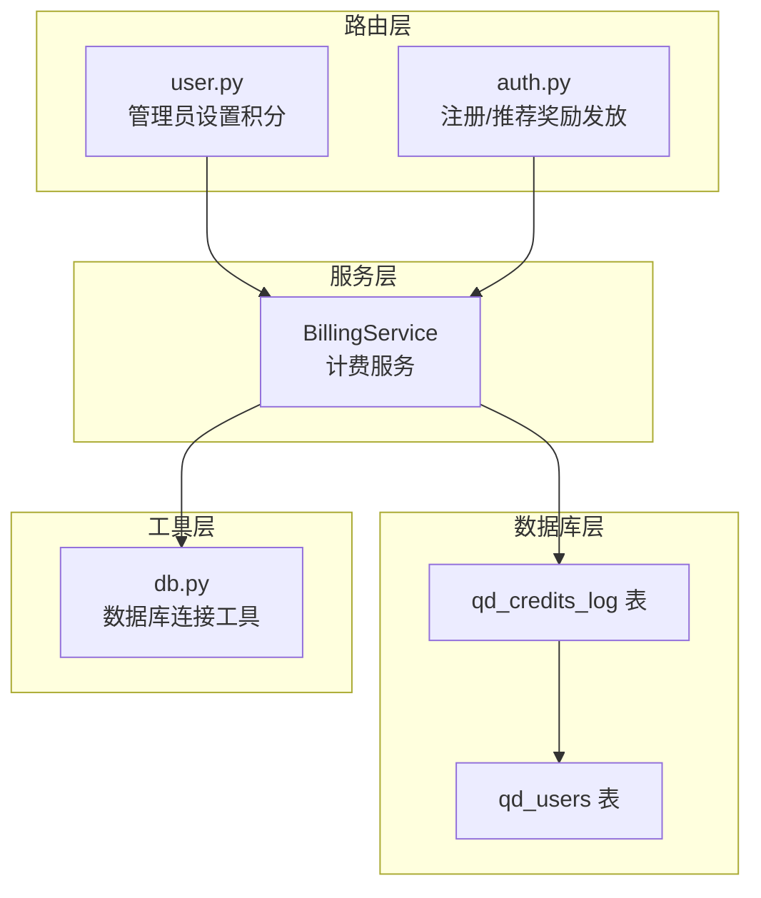
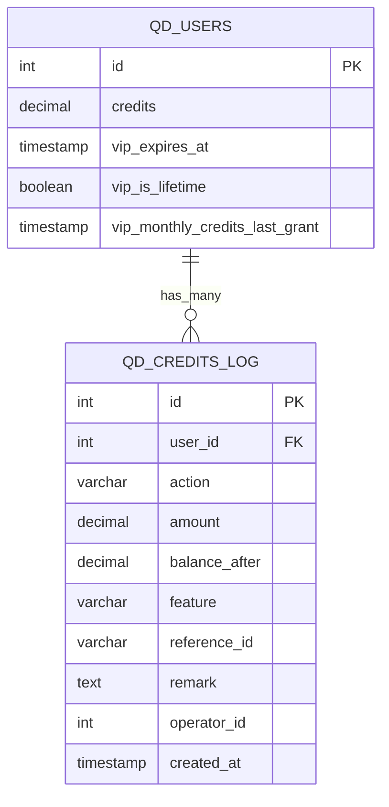
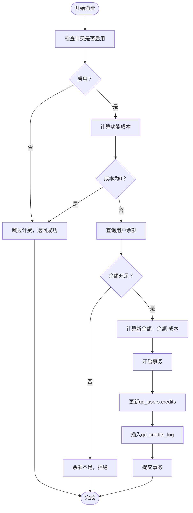
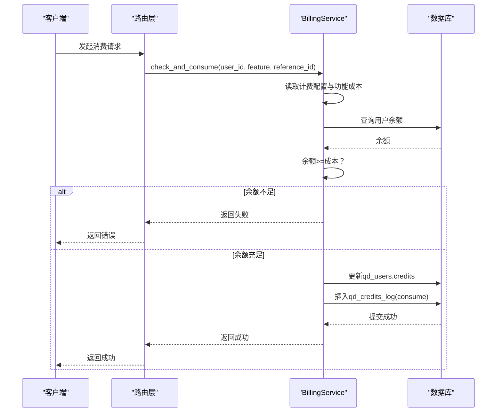
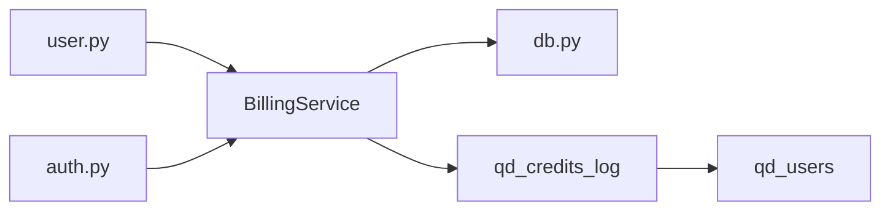

# 积分变动日志系统

<cite>
**本文引用的文件**
- [init.sql](file://backend_api_python/migrations/init.sql)
- [billing_service.py](file://backend_api_python/app/services/billing_service.py)
- [user.py](file://backend_api_python/app/routes/user.py)
- [auth.py](file://backend_api_python/app/routes/auth.py)
- [db.py](file://backend_api_python/app/utils/db.py)
</cite>

## 目录
1. [简介](#简介)
2. [项目结构](#项目结构)
3. [核心组件](#核心组件)
4. [架构概览](#架构概览)
5. [详细组件分析](#详细组件分析)
6. [依赖分析](#依赖分析)
7. [性能考虑](#性能考虑)
8. [故障排查指南](#故障排查指南)
9. [结论](#结论)

## 简介
本文件面向“qd_credits_log”积分日志表，系统性阐述其设计架构与业务规则，覆盖以下关键点：
- 表结构与外键约束
- 操作类型（recharge、consume、refund、admin_adjust、vip_grant）及其业务规则
- amount与balance_after字段的正负值含义与余额计算逻辑
- feature字段的功能分类与reference_id的关联机制
- operator_id在管理员操作中的作用与审计追踪
- 积分消费的具体业务流程与限额控制
- 查询优化策略与性能考量

## 项目结构
积分日志系统位于后端服务层，核心实现集中在计费服务模块，并通过数据库迁移脚本定义表结构与索引。主要涉及以下文件：
- 数据库迁移脚本：定义q.d.credits_log表及索引
- 计费服务：封装积分增减、消费检查、日志写入、管理员操作与查询接口
- 路由层：对外暴露管理员设置积分、注册/推荐奖励发放等入口
- 数据库工具：提供统一的PostgreSQL连接与事务管理

**图表来源**
- [init.sql:42-57](file://backend_api_python/migrations/init.sql#L42-L57)
- [billing_service.py:47-758](file://backend_api_python/app/services/billing_service.py#L47-L758)
- [user.py:290-327](file://backend_api_python/app/routes/user.py#L290-L327)
- [auth.py:386-406](file://backend_api_python/app/routes/auth.py#L386-L406)
- [db.py:19-25](file://backend_api_python/app/utils/db.py#L19-L25)

**章节来源**
- [init.sql:42-57](file://backend_api_python/migrations/init.sql#L42-L57)
- [billing_service.py:47-758](file://backend_api_python/app/services/billing_service.py#L47-L758)
- [user.py:290-327](file://backend_api_python/app/routes/user.py#L290-L327)
- [auth.py:386-406](file://backend_api_python/app/routes/auth.py#L386-L406)
- [db.py:19-25](file://backend_api_python/app/utils/db.py#L19-L25)

## 核心组件
- qd_credits_log表：记录所有积分变动事件，包含用户ID、操作类型、变动金额、余额、功能分类、关联ID、备注、操作人ID与时间戳。
- BillingService：提供积分增减、消费检查、管理员操作、日志查询等能力；所有写入均通过原子事务保证一致性。
- 管理员路由：提供管理员设置用户积分、授予/撤销VIP等接口，自动写入审计日志。
- 注册/推荐奖励：在用户注册或邀请他人时发放积分，记录对应日志。

**章节来源**
- [init.sql:42-57](file://backend_api_python/migrations/init.sql#L42-L57)
- [billing_service.py:461-728](file://backend_api_python/app/services/billing_service.py#L461-L728)
- [user.py:290-327](file://backend_api_python/app/routes/user.py#L290-L327)
- [auth.py:386-406](file://backend_api_python/app/routes/auth.py#L386-L406)

## 架构概览
积分日志系统围绕“qd_credits_log”表构建，遵循以下原则：
- 严格外键约束：user_id指向qd_users.id，删除级联保证数据一致性
- 明确的操作类型：recharge、consume、refund、admin_adjust、vip_grant
- 金额与余额：amount为正表示增加，负表示减少；balance_after为变动后的余额
- 审计追踪：管理员操作记录operator_id，便于审计
- 查询优化：针对user_id、action、created_at建立索引

**图表来源**
- [init.sql:8-31](file://backend_api_python/migrations/init.sql#L8-L31)
- [init.sql:42-57](file://backend_api_python/migrations/init.sql#L42-L57)

## 详细组件分析

### 表结构与字段语义
- user_id：外键，关联qd_users.id，删除级联
- action：操作类型，取值范围包括recharge、consume、refund、admin_adjust、vip_grant
- amount：变动金额，正数表示充值/返现/调整增加，负数表示消费/扣除
- balance_after：变动后余额，用于审计与对账
- feature：功能分类，如ai_analysis、ai_code_gen、polymarket_deep_analysis等
- reference_id：关联ID，如订单号、任务ID、被邀请用户ID等
- remark：备注，用于记录业务上下文
- operator_id：操作人ID，管理员操作时记录
- created_at：记录时间，默认NOW()

索引设计：
- idx_credits_log_user_id：按用户查询日志
- idx_credits_log_action：按操作类型筛选
- idx_credits_log_created_at：按时间排序

**章节来源**
- [init.sql:42-57](file://backend_api_python/migrations/init.sql#L42-L57)

### 操作类型与业务规则
- recharge（充值）：amount为正，balance_after为当前余额+amount
- consume（消费）：amount为负，balance_after为当前余额-amount；需满足余额充足
- refund（退款）：amount为正，balance_after为当前余额+amount；通常由系统自动处理
- admin_adjust（管理员调整）：amount为正或负，balance_after为最终目标余额；记录operator_id
- vip_grant（VIP授予/撤销）：amount为0，balance_after为当前余额；记录operator_id

业务规则要点：
- 充值/返现/调整：amount必须为正数
- 消费：需检查余额充足，否则拒绝
- 管理员调整：不允许将余额设为负数
- VIP状态变更：不影响积分余额，仅记录日志

**章节来源**
- [billing_service.py:527-577](file://backend_api_python/app/services/billing_service.py#L527-L577)
- [billing_service.py:461-525](file://backend_api_python/app/services/billing_service.py#L461-L525)
- [billing_service.py:579-627](file://backend_api_python/app/services/billing_service.py#L579-L627)
- [billing_service.py:629-673](file://backend_api_python/app/services/billing_service.py#L629-L673)

### 金额与余额计算逻辑
- amount字段含义：正数表示增加，负数表示减少
- balance_after字段：每次变动后的最终余额，用于审计与对账
- 余额校验：消费前检查用户余额是否≥消费金额
- 事务一致性：更新qd_users.credits与插入qd_credits_log在同一个事务内完成

**图表来源**
- [billing_service.py:461-525](file://backend_api_python/app/services/billing_service.py#L461-L525)

**章节来源**
- [billing_service.py:461-525](file://backend_api_python/app/services/billing_service.py#L461-L525)

### feature字段与reference_id关联机制
- feature：功能分类，如ai_analysis、ai_code_gen、polymarket_deep_analysis等
- reference_id：关联ID，用于追踪业务对象，如订单号、分析任务ID、被邀请用户ID等
- 日志记录：消费时记录feature与reference_id，便于溯源与统计

**章节来源**
- [billing_service.py:461-525](file://backend_api_python/app/services/billing_service.py#L461-L525)

### operator_id与审计追踪
- 管理员操作：在管理员设置积分、授予/撤销VIP时记录operator_id
- 审计价值：支持对账、合规审查与问题追溯
- 路由入口：管理员设置积分接口自动注入当前操作人ID

**章节来源**
- [user.py:290-327](file://backend_api_python/app/routes/user.py#L290-L327)
- [billing_service.py:579-627](file://backend_api_python/app/services/billing_service.py#L579-L627)
- [billing_service.py:629-673](file://backend_api_python/app/services/billing_service.py#L629-L673)

### 积分消费业务流程与限额控制
- 流程概述：检查计费开关→读取功能成本→判断免费→余额校验→更新余额→写入日志→提交事务
- 限额控制：当前实现未在qd_credits_log层面设置全局限额，限额控制由功能成本与余额校验共同实现
- 注册/推荐奖励：用户注册与邀请他人成功后发放积分，记录对应日志

**图表来源**
- [billing_service.py:461-525](file://backend_api_python/app/services/billing_service.py#L461-L525)

**章节来源**
- [billing_service.py:461-525](file://backend_api_python/app/services/billing_service.py#L461-L525)
- [auth.py:386-406](file://backend_api_python/app/routes/auth.py#L386-L406)

## 依赖分析
- 外键依赖：qd_credits_log.user_id → qd_users.id（删除级联）
- 服务依赖：BillingService依赖数据库工具进行连接与事务管理
- 路由依赖：管理员设置积分与注册/推荐奖励发放依赖BillingService

**图表来源**
- [billing_service.py:18-25](file://backend_api_python/app/services/billing_service.py#L18-L25)
- [db.py:19-25](file://backend_api_python/app/utils/db.py#L19-L25)
- [init.sql:42-57](file://backend_api_python/migrations/init.sql#L42-L57)
- [user.py:290-327](file://backend_api_python/app/routes/user.py#L290-L327)
- [auth.py:386-406](file://backend_api_python/app/routes/auth.py#L386-L406)

**章节来源**
- [billing_service.py:18-25](file://backend_api_python/app/services/billing_service.py#L18-L25)
- [db.py:19-25](file://backend_api_python/app/utils/db.py#L19-L25)
- [init.sql:42-57](file://backend_api_python/migrations/init.sql#L42-L57)
- [user.py:290-327](file://backend_api_python/app/routes/user.py#L290-L327)
- [auth.py:386-406](file://backend_api_python/app/routes/auth.py#L386-L406)

## 性能考虑
- 索引策略：已为user_id、action、created_at建立索引，满足常见查询场景
- 分页查询：日志查询采用LIMIT/OFFSET分页，注意大数据量下的OFFSET性能
- 时间字段：日志写入使用UTC时间，前端统一转换显示，避免跨时区显示问题
- 事务边界：所有写入在单事务内完成，保证一致性但可能影响并发写入吞吐
- 连接池：通过数据库工具统一管理连接，建议结合应用层连接池配置优化

**章节来源**
- [init.sql:55-57](file://backend_api_python/migrations/init.sql#L55-L57)
- [billing_service.py:675-728](file://backend_api_python/app/services/billing_service.py#L675-L728)
- [db.py:19-25](file://backend_api_python/app/utils/db.py#L19-L25)

## 故障排查指南
- 余额不足：消费失败时返回“余额不足”，检查功能成本与用户余额
- 计费未启用：若计费开关关闭，消费直接放行，检查环境变量配置
- 管理员操作失败：检查operator_id是否传入且具备管理员权限
- 日志查询异常：确认分页参数与索引使用情况，必要时重建索引
- 数据库连接问题：检查DATABASE_URL与连接池配置

**章节来源**
- [billing_service.py:461-525](file://backend_api_python/app/services/billing_service.py#L461-L525)
- [billing_service.py:675-728](file://backend_api_python/app/services/billing_service.py#L675-L728)
- [db.py:38-48](file://backend_api_python/app/utils/db.py#L38-L48)

## 结论
qd_credits_log表通过明确的操作类型、严格的外键约束与审计字段，构建了完整的积分变动审计体系。配合BillingService的事务化写入与索引优化，能够满足日常计费与审计需求。未来可在以下方面持续优化：
- 在qd_credits_log层面引入更细粒度的限额控制策略
- 针对高频查询场景引入物化视图或缓存
- 增加日志归档与清理策略，降低历史数据对查询性能的影响