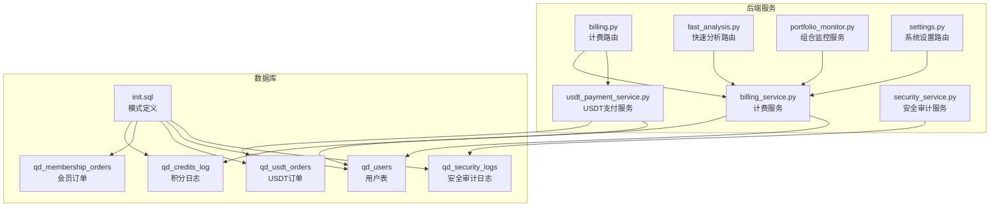
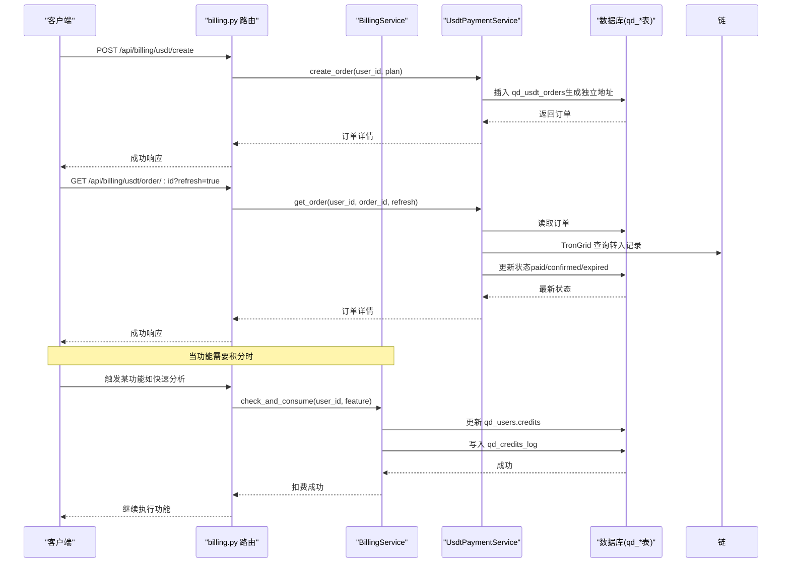
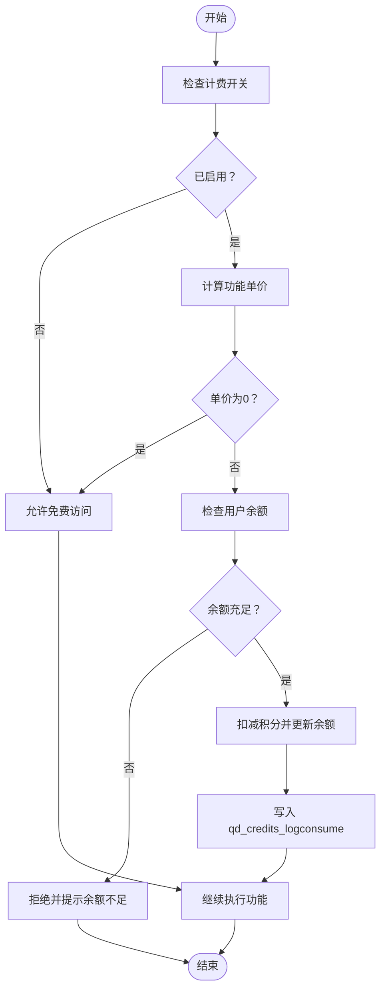
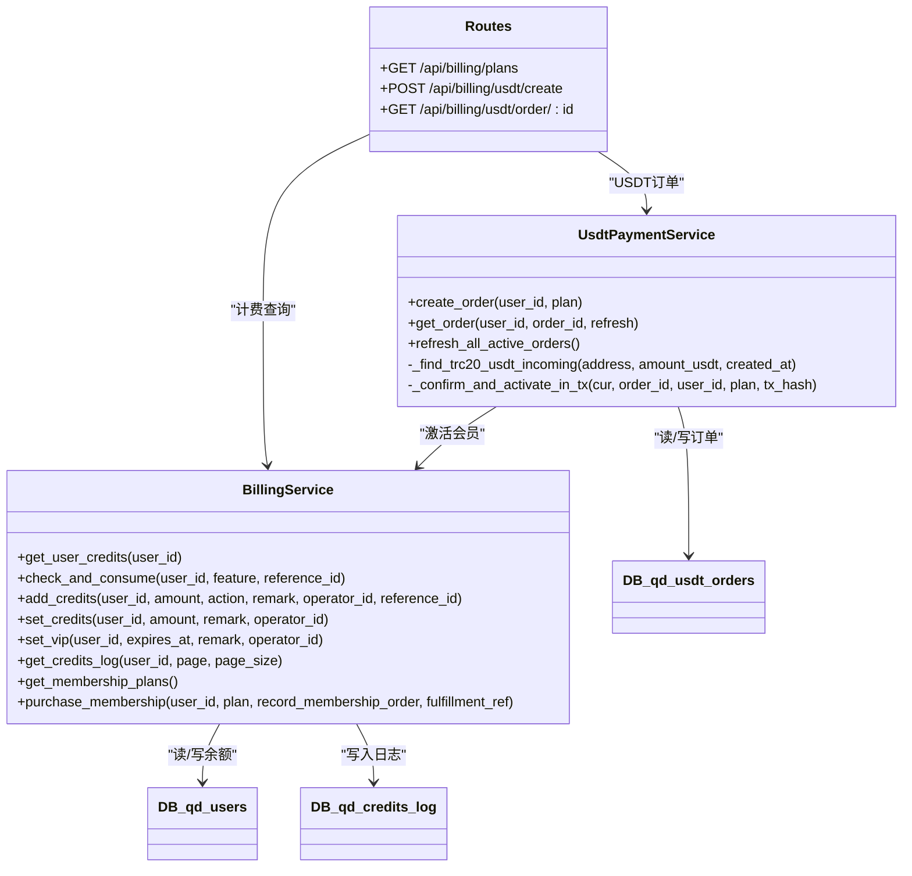

# 财务积分模型

<cite>
**本文引用的文件**
- [init.sql](file://backend_api_python/migrations/init.sql)
- [billing_service.py](file://backend_api_python/app/services/billing_service.py)
- [usdt_payment_service.py](file://backend_api_python/app/services/usdt_payment_service.py)
- [billing.py](file://backend_api_python/app/routes/billing.py)
- [fast_analysis.py](file://backend_api_python/app/routes/fast_analysis.py)
- [portfolio_monitor.py](file://backend_api_python/app/services/portfolio_monitor.py)
- [settings.py](file://backend_api_python/app/routes/settings.py)
- [security_service.py](file://backend_api_python/app/services/security_service.py)
</cite>

## 目录
1. [简介](#简介)
2. [项目结构](#项目结构)
3. [核心组件](#核心组件)
4. [架构总览](#架构总览)
5. [详细组件分析](#详细组件分析)
6. [依赖关系分析](#依赖关系分析)
7. [性能考量](#性能考量)
8. [故障排查指南](#故障排查指南)
9. [结论](#结论)
10. [附录](#附录)

## 简介
本文件面向财务与积分系统，围绕以下三张核心表展开：
- qd_credits_log：积分变动日志，记录积分的充值、消费、退款、管理员调整、会员购买等动作，并维护余额后值。
- qd_membership_orders：会员订单（模拟支付），记录用户购买的会员套餐（monthly/yearly/lifetime）及状态。
- qd_usdt_orders：USDT支付订单，基于每单独立地址的链上支付与自动对账，支持TRON TRC20链。

文档将详细解释：
- qd_credits_log 的 action 字段与业务规则
- 积分余额管理与 balance_after 的计算与一致性保障
- 会员订单 plan 字段与价格管理
- USDT 订单的地址派生、链选择与状态流转
- 积分消费的业务流程（ai_analysis、polymarket_deep_analysis 等）
- 财务审计与合规实现建议

## 项目结构
本项目采用后端服务与数据库迁移脚本分离的结构，财务与积分相关逻辑集中在服务层与路由层，数据库模式通过初始化脚本定义。

图示来源
- [init.sql](file://backend_api_python/migrations/init.sql)
- [billing_service.py](file://backend_api_python/app/services/billing_service.py)
- [usdt_payment_service.py](file://backend_api_python/app/services/usdt_payment_service.py)
- [billing.py](file://backend_api_python/app/routes/billing.py)
- [fast_analysis.py](file://backend_api_python/app/routes/fast_analysis.py)
- [portfolio_monitor.py](file://backend_api_python/app/services/portfolio_monitor.py)
- [settings.py](file://backend_api_python/app/routes/settings.py)
- [security_service.py](file://backend_api_python/app/services/security_service.py)

章节来源
- [init.sql](file://backend_api_python/migrations/init.sql)
- [billing_service.py](file://backend_api_python/app/services/billing_service.py)
- [usdt_payment_service.py](file://backend_api_python/app/services/usdt_payment_service.py)
- [billing.py](file://backend_api_python/app/routes/billing.py)

## 核心组件
- 计费服务（BillingService）
  - 提供积分查询、消费、充值、管理员调整、VIP状态管理、会员套餐购买与日志查询等能力
  - 通过环境变量配置计费开关与各项功能的积分单价
- USDT支付服务（UsdtPaymentService）
  - 基于TRON TRC20链的每单独立地址派生与链上对账
  - 支持订单创建、状态刷新、批量对账与后台工作线程
- 路由层
  - 提供会员套餐查询、USDT订单创建与查询接口
  - 快速分析与组合监控在调用计费服务进行积分扣减
- 安全审计
  - 安全事件记录到 qd_security_logs，便于合规审计

章节来源
- [billing_service.py](file://backend_api_python/app/services/billing_service.py)
- [usdt_payment_service.py](file://backend_api_python/app/services/usdt_payment_service.py)
- [billing.py](file://backend_api_python/app/routes/billing.py)
- [fast_analysis.py](file://backend_api_python/app/routes/fast_analysis.py)
- [portfolio_monitor.py](file://backend_api_python/app/services/portfolio_monitor.py)
- [security_service.py](file://backend_api_python/app/services/security_service.py)

## 架构总览
下图展示了积分与USDT支付的关键交互路径，以及与用户表的关系。

图示来源
- [billing.py](file://backend_api_python/app/routes/billing.py)
- [usdt_payment_service.py](file://backend_api_python/app/services/usdt_payment_service.py)
- [billing_service.py](file://backend_api_python/app/services/billing_service.py)
- [init.sql](file://backend_api_python/migrations/init.sql)

## 详细组件分析

### qd_credits_log 表：积分变动日志设计
- 字段说明
  - user_id：关联用户
  - action：操作类型，包括 recharge（充值）、consume（消费）、refund（退款）、admin_adjust（管理员调整）、membership_purchase（会员购买）、vip_grant（授予VIP）、membership_bonus（会员首购积分）、membership_monthly（终身会员月度积分）
  - amount：变动金额（正数为增加，负数为减少）
  - balance_after：变动后的余额
  - feature：消费的功能标识（如 ai_analysis、polymarket_deep_analysis）
  - reference_id：关联ID（如订单号、分析任务ID等）
  - remark：备注
  - operator_id：操作人ID（管理员调整时记录）
  - created_at：记录时间（UTC）
- 业务规则
  - 充值/退款/管理员调整：amount 为正数，balance_after = 上次余额 + amount
  - 消费：amount 为负数，balance_after = 上次余额 + amount；当余额不足时拒绝
  - 会员购买：记录一条 action 为 membership_purchase 的日志，amount 为 0，balance_after 为当前余额
  - VIP 授予/撤销：记录 action 为 vip_grant 或 vip_revoke 的日志，amount 为 0
  - 终身会员月度积分：记录 action 为 membership_monthly 的日志，amount 为当月应得积分
- 数据一致性
  - 所有积分变更均在事务内更新 qd_users.credits 并写入 qd_credits_log，确保 balance_after 与用户余额一致
  - 日志中的 created_at 使用 UTC，便于前端正确显示

章节来源
- [init.sql](file://backend_api_python/migrations/init.sql)
- [billing_service.py](file://backend_api_python/app/services/billing_service.py)

### 积分余额管理机制与 balance_after 计算
- 计算逻辑
  - 新余额 = 旧余额 + 变动金额（正/负）
  - balance_after 直接存储为“变动后”的余额值，便于审计与对账
- 一致性保障
  - 在同一事务中完成余额更新与日志写入
  - 对外暴露的查询接口返回的余额与日志中的 balance_after 保持一致
- 余额不足处理
  - 消费前检查余额，不足则拒绝并返回当前余额与所需余额

章节来源
- [billing_service.py](file://backend_api_python/app/services/billing_service.py)

### qd_membership_orders 表：会员订单设计
- 字段说明
  - user_id：下单用户
  - plan：套餐类型，monthly/yearly/lifetime
  - price_usd：订单金额（美元）
  - status：订单状态，mock 默认 paid
  - created_at/paid_at：创建与支付时间
- 价格管理
  - 价格来自系统设置（.env），通过设置界面配置
  - 三种套餐的价格与一次性赠送积分（或终身会员月度积分）在服务层集中管理
- 与USDT支付的关系
  - 传统模拟支付会插入该表；USDT链上支付通过 qd_usdt_orders 记录，不写入该表

章节来源
- [init.sql](file://backend_api_python/migrations/init.sql)
- [billing_service.py](file://backend_api_python/app/services/billing_service.py)
- [settings.py](file://backend_api_python/app/routes/settings.py)

### qd_usdt_orders 表：USDT支付订单系统
- 字段说明
  - user_id：下单用户
  - plan：套餐类型（monthly/yearly/lifetime）
  - chain：区块链类型，默认 TRC20（MVP）
  - amount_usdt：订单金额（USDT，TRC20 6 位小数）
  - address_index：HD 钱包派生索引
  - address：收款地址（每单独立）
  - status：订单状态，pending/paid/confirmed/expired/cancelled/failed
  - tx_hash：链上交易哈希
  - paid_at/confirmed_at/expires_at：支付、确认、过期时间
  - created_at/updated_at：创建与更新时间
- 地址派生机制（HD钱包）
  - 使用 xpub（BIP44 TRON）派生外部链地址，address_index 递增
  - 支持账户级 xpub 与变更级 xpub 的规范化处理
- 区块链选择
  - MVP 仅支持 TRC20；其他链需扩展配置
- 状态管理
  - pending：等待链上转入
  - paid：链上匹配到转入，写入 tx_hash 与 paid_at
  - confirmed：满足确认延迟后标记为已确认并激活会员
  - expired：超过有效期未支付
- 自动对账
  - 通过 TronGrid API 查询转入记录，匹配目标地址与金额
  - 支持批量扫描与后台工作线程轮询

章节来源
- [init.sql](file://backend_api_python/migrations/init.sql)
- [usdt_payment_service.py](file://backend_api_python/app/services/usdt_payment_service.py)

### 积分消费业务流程（ai_analysis、polymarket_deep_analysis 等）
- 流程概览
  - 功能调用前检查计费开关与功能单价
  - 若单价大于 0，则检查用户余额，余额不足则拒绝
  - 余额充足则扣减积分并在 qd_credits_log 中记录消费日志
  - 失败或异常时自动退款（部分场景）
- 典型调用点
  - 快速分析：在路由层调用计费服务进行扣费
  - 组合监控：按符号数量累计扣费，逐个符号扣费
- 特殊处理
  - 当功能执行失败或抛出异常时，自动进行退款（refund）

图示来源
- [billing_service.py](file://backend_api_python/app/services/billing_service.py)
- [fast_analysis.py](file://backend_api_python/app/routes/fast_analysis.py)
- [portfolio_monitor.py](file://backend_api_python/app/services/portfolio_monitor.py)

章节来源
- [billing_service.py](file://backend_api_python/app/services/billing_service.py)
- [fast_analysis.py](file://backend_api_python/app/routes/fast_analysis.py)
- [portfolio_monitor.py](file://backend_api_python/app/services/portfolio_monitor.py)

### 财务审计与合规实现方案
- 审计追踪
  - qd_credits_log：记录所有积分变动（含管理员调整、会员购买、VIP 授予/撤销、退款等），支持按用户分页查询
  - qd_security_logs：记录安全事件（登录、注册、重置密码等），便于合规审计
- 合规要点
  - 余额与日志一致性：事务内更新余额与写入日志，确保 balance_after 与实际余额一致
  - 退款机制：功能执行失败或异常时自动退款，减少争议
  - 透明度：日志包含 feature、reference_id、remark 等字段，便于溯源
  - 时区处理：日志 created_at 使用 UTC，避免跨时区显示问题

章节来源
- [billing_service.py](file://backend_api_python/app/services/billing_service.py)
- [security_service.py](file://backend_api_python/app/services/security_service.py)
- [init.sql](file://backend_api_python/migrations/init.sql)

## 依赖关系分析

图示来源
- [billing_service.py](file://backend_api_python/app/services/billing_service.py)
- [usdt_payment_service.py](file://backend_api_python/app/services/usdt_payment_service.py)
- [billing.py](file://backend_api_python/app/routes/billing.py)
- [init.sql](file://backend_api_python/migrations/init.sql)

章节来源
- [billing_service.py](file://backend_api_python/app/services/billing_service.py)
- [usdt_payment_service.py](file://backend_api_python/app/services/usdt_payment_service.py)
- [billing.py](file://backend_api_python/app/routes/billing.py)

## 性能考量
- 数据库事务
  - 积分扣减与日志写入在同一事务内完成，避免并发导致的不一致
- 连接池与长事务
  - USDT 对账在短事务中读取订单，链上查询在事务外进行，避免连接长时间占用
- 批量处理
  - 后台工作线程批量扫描 pending/paid 订单，限制每次扫描数量，降低压力
- 索引优化
  - qd_credits_log、qd_usdt_orders、qd_users 等关键表建立必要索引，提升查询效率

[本节为通用指导，无需特定文件引用]

## 故障排查指南
- 积分扣费失败
  - 检查计费开关与功能单价配置
  - 确认用户余额是否充足
  - 查看 qd_credits_log 中最近的消费记录与错误信息
- USDT 订单未确认
  - 检查链上转入是否匹配（地址与金额）
  - 确认 TronGrid API 配置与网络连通性
  - 查看后台工作线程日志与订单状态变化
- 审计日志缺失
  - 确认 qd_security_logs 是否存在对应事件
  - 检查日志写入权限与数据库连接

章节来源
- [billing_service.py](file://backend_api_python/app/services/billing_service.py)
- [usdt_payment_service.py](file://backend_api_python/app/services/usdt_payment_service.py)
- [security_service.py](file://backend_api_python/app/services/security_service.py)

## 结论
本财务与积分系统以 qd_credits_log 为核心，结合 BillingService 的严格事务控制，实现了积分的精确计量与可追溯审计。USDT 支付通过 qd_usdt_orders 与链上对账，提供了可靠的链上支付体验。通过环境变量与系统设置，价格与计费策略具备良好的可配置性。配合 qd_security_logs，系统满足基本的合规审计需求。

[本节为总结，无需特定文件引用]

## 附录
- 系统设置项（部分）
  - 会员套餐价格与赠送积分（monthly/yearly/lifetime）
  - 功能计费开关与单价（如 ai_analysis、polymarket_deep_analysis）
- 常用查询
  - 获取用户积分日志：按用户ID分页查询 qd_credits_log
  - 获取 USDT 订单状态：按订单ID查询 qd_usdt_orders
  - 获取用户 VIP 状态：查询 qd_users.vip_expires_at

章节来源
- [settings.py](file://backend_api_python/app/routes/settings.py)
- [billing_service.py](file://backend_api_python/app/services/billing_service.py)
- [usdt_payment_service.py](file://backend_api_python/app/services/usdt_payment_service.py)
- [init.sql](file://backend_api_python/migrations/init.sql)