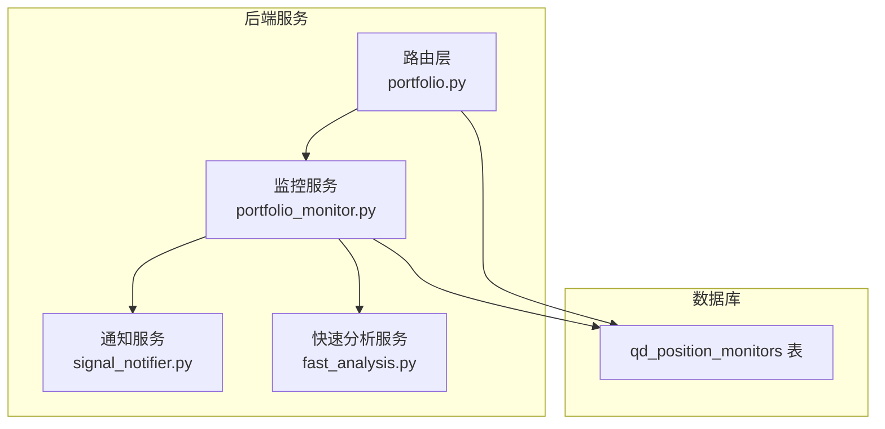
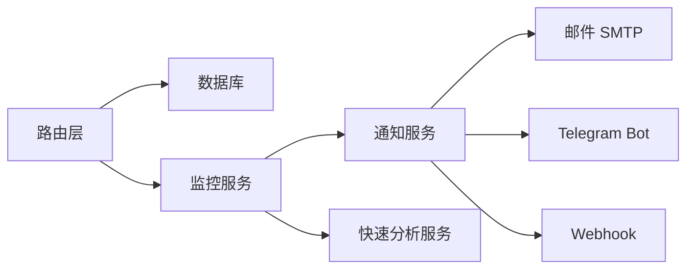

# 位置监控器模型

<cite>
**本文档引用的文件**
- [init.sql](file://backend_api_python/migrations/init.sql)
- [portfolio.py](file://backend_api_python/app/routes/portfolio.py)
- [portfolio_monitor.py](file://backend_api_python/app/services/portfolio_monitor.py)
- [signal_notifier.py](file://backend_api_python/app/services/signal_notifier.py)
- [fast_analysis.py](file://backend_api_python/app/services/fast_analysis.py)
</cite>

## 目录
1. [简介](#简介)
2. [项目结构](#项目结构)
3. [核心组件](#核心组件)
4. [架构总览](#架构总览)
5. [详细组件分析](#详细组件分析)
6. [依赖关系分析](#依赖关系分析)
7. [性能考虑](#性能考虑)
8. [故障排查指南](#故障排查指南)
9. [结论](#结论)

## 简介
本文件为 qd_position_monitors 表的详细数据模型文档，聚焦于“位置监控器”的设计与实现。内容涵盖：
- 监控类型枚举 monitor_type 的取值与行为
- config 配置字段的 JSON 结构设计与关键参数
- position_ids 字段的多位置管理机制与批量监控能力
- notification_config 通知配置系统与多通道投递
- 运行调度机制（last_run_at、next_run_at、run_count、last_result）
- 生命周期管理（is_active、名称与备注）
- 配置示例（AI 监控器的提示词与语言设置、手动监控器的范围与通知）
- 监控结果的数据结构与分析算法（趋势分析、异常检测、预测模型）
- 性能优化、资源管理与故障恢复策略

## 项目结构
与位置监控器相关的核心文件与职责如下：
- 数据库迁移脚本：定义 qd_position_monitors 表结构与索引
- 路由层：提供监控器的增删改查接口
- 服务层：实现监控器的执行、调度、通知与计费
- 通知服务：封装邮件、Webhook、Telegram 等投递通道
- 快速分析服务：提供统一的 LLM 分析与结构化输出



**图示来源**
- [init.sql:598-613](file://backend_api_python/migrations/init.sql#L598-L613)
- [portfolio.py:523-725](file://backend_api_python/app/routes/portfolio.py#L523-L725)
- [portfolio_monitor.py:1674-1770](file://backend_api_python/app/services/portfolio_monitor.py#L1674-L1770)
- [signal_notifier.py:550-749](file://backend_api_python/app/services/signal_notifier.py#L550-L749)
- [fast_analysis.py:186-200](file://backend_api_python/app/services/fast_analysis.py#L186-L200)

**章节来源**
- [init.sql:598-613](file://backend_api_python/migrations/init.sql#L598-L613)
- [portfolio.py:523-725](file://backend_api_python/app/routes/portfolio.py#L523-L725)

## 核心组件
- 表结构字段
  - id：主键
  - user_id：所属用户
  - name：监控器名称
  - position_ids：逗号分隔或 JSON 数组形式的位置 ID 列表（多位置管理）
  - monitor_type：监控类型（ai、price_alert、pnl_alert 等）
  - config：监控配置（运行间隔、语言、提示词等）
  - notification_config：通知配置（通道、目标、语言等）
  - is_active：激活状态
  - last_run_at / next_run_at：最近运行时间与下次运行时间
  - last_result：上次运行结果（JSON 文本）
  - run_count：运行次数
  - created_at / updated_at：创建与更新时间

- 关键业务流程
  - 创建监控器：写入表并计算 next_run_at
  - 执行监控：按 next_run_at 排序取出待运行项，执行 AI 分析或规则判断
  - 更新状态：更新 last_run_at、next_run_at、last_result、run_count
  - 通知投递：根据 notification_config 投递到浏览器、Telegram、邮件、Webhook 等

**章节来源**
- [init.sql:598-613](file://backend_api_python/migrations/init.sql#L598-L613)
- [portfolio.py:569-609](file://backend_api_python/app/routes/portfolio.py#L569-L609)
- [portfolio_monitor.py:1238-1424](file://backend_api_python/app/services/portfolio_monitor.py#L1238-L1424)

## 架构总览
位置监控器的运行采用“后台轮询 + 批量通知”的模式：
- 后台循环查询所有已激活且到达运行时间的监控器
- 并行执行多个监控器，收集结果
- 按用户聚合结果，发送一次性汇总通知
- 更新每个监控器的运行状态与下次运行时间

```mermaid
sequenceDiagram
participant Loop as "监控循环"
participant DB as "数据库"
participant Svc as "监控服务"
participant Noti as "通知服务"
Loop->>DB : 查询已激活且 next_run_at<=NOW() 的监控器
DB-->>Loop : 返回待运行监控器列表
loop 对每个监控器
Loop->>Svc : run_single_monitor(monitor_id)
Svc->>DB : 读取监控器配置与位置
Svc->>Svc : 执行AI分析/规则判断
Svc->>DB : 更新 last_run_at/next_run_at/last_result/run_count
Svc->>Noti : 发送通知按用户聚合
end
```

**图示来源**
- [portfolio_monitor.py:1674-1770](file://backend_api_python/app/services/portfolio_monitor.py#L1674-L1770)
- [portfolio_monitor.py:1238-1424](file://backend_api_python/app/services/portfolio_monitor.py#L1238-L1424)

## 详细组件分析

### 数据模型与字段详解
- 表结构与索引
  - 主键 id，索引 idx_position_monitors_user_id(user_id)
  - 字段类型与默认值见迁移脚本定义

- 字段语义与约束
  - monitor_type：支持 ai、price_alert、pnl_alert 等；未识别时回退为 ai
  - position_ids：支持逗号分隔字符串或 JSON 数组；为空时可按 symbol 匹配观察
  - config：包含运行间隔、语言、提示词等；运行间隔优先级为 run_interval_minutes > interval_minutes
  - notification_config：包含 channels（浏览器/邮件/Telegram/Webhook）与 targets（各通道的目标凭据）
  - 时间字段：last_run_at、next_run_at 严格受 config 中运行间隔控制
  - 统计字段：run_count 仅在成功运行后递增

**章节来源**
- [init.sql:598-613](file://backend_api_python/migrations/init.sql#L598-L613)
- [portfolio.py:569-609](file://backend_api_python/app/routes/portfolio.py#L569-L609)
- [portfolio_monitor.py:1281-1285](file://backend_api_python/app/services/portfolio_monitor.py#L1281-L1285)

### 监控类型与配置（monitor_type 与 config）
- monitor_type
  - ai：调用 AI 分析服务生成报告
  - price_alert / pnl_alert：作为规则型告警（由其他表实现，此处保留扩展）

- config 关键字段
  - run_interval_minutes / interval_minutes：运行间隔（分钟）
  - language：分析语言（如 en-US、zh-CN）
  - prompt：自定义提示词（可选）
  - symbol / market：当 position_ids 为空时，按符号与市场匹配观察

- 创建与更新逻辑
  - 创建时将运行间隔转换为 next_run_at
  - 更新时如变更了运行间隔，会同步更新 next_run_at

**章节来源**
- [portfolio.py:569-609](file://backend_api_python/app/routes/portfolio.py#L569-L609)
- [portfolio_monitor.py:1281-1285](file://backend_api_python/app/services/portfolio_monitor.py#L1281-L1285)
- [portfolio_monitor.py:682-684](file://backend_api_python/app/services/portfolio_monitor.py#L682-L684)

### 多位置管理（position_ids）与批量监控
- 位置来源
  - 从 qd_manual_positions 读取用户手动持仓
  - 支持按 position_ids 列表过滤
  - 若 position_ids 为空，可按 config.symbol + config.market 观察虚拟头寸

- 批量处理
  - 后台循环每次最多取 20 条到期监控器
  - 先并行执行，再按用户聚合发送通知，降低通知风暴

- 价格与盈亏计算
  - 实时获取当前价格，计算 PnL 与 PnL%
  - 未获取到价格时仍可继续分析（虚拟观察）

**章节来源**
- [portfolio_monitor.py:148-217](file://backend_api_python/app/services/portfolio_monitor.py#L148-L217)
- [portfolio_monitor.py:1674-1770](file://backend_api_python/app/services/portfolio_monitor.py#L1674-L1770)

### 通知配置系统（notification_config）
- channels 与 targets
  - channels：浏览器、邮件、Telegram、Webhook 等
  - targets：各通道的目标凭据（如 email、telegram_chat_id、webhook_url 等）
  - 若 channels 缺失，自动补全浏览器通道以确保站内提醒

- 通知投递
  - 浏览器：站内通知
  - 邮件：HTML 报告
  - Telegram：机器人消息
  - Webhook：带签名与重试的 HTTP 回调

- 用户配置合并
  - 从用户表 qd_users.notification_settings 合并默认通道与凭据

**章节来源**
- [portfolio_monitor.py:68-129](file://backend_api_python/app/services/portfolio_monitor.py#L68-L129)
- [signal_notifier.py:550-749](file://backend_api_python/app/services/signal_notifier.py#L550-L749)

### 运行调度与统计（last_run_at、next_run_at、run_count、last_result）
- 调度机制
  - 后台循环按 next_run_at 升序取出监控器
  - 每次执行后更新 last_run_at 与 next_run_at（基于运行间隔）

- 统计与结果
  - run_count 成功运行后递增
  - last_result 存储本次运行的完整结果（JSON 文本）

- 错误处理
  - 执行失败时返回错误信息，但不更新 next_run_at 与 run_count

**章节来源**
- [portfolio_monitor.py:1674-1770](file://backend_api_python/app/services/portfolio_monitor.py#L1674-L1770)
- [portfolio_monitor.py:1374-1389](file://backend_api_python/app/services/portfolio_monitor.py#L1374-L1389)

### 生命周期管理（is_active、名称与备注）
- is_active：控制监控器是否参与调度
- 名称与备注：便于用户识别与归档
- 删除：物理删除监控器及其关联的运行记录

**章节来源**
- [portfolio.py:706-725](file://backend_api_python/app/routes/portfolio.py#L706-L725)

### 监控结果的数据结构与分析算法
- 结果结构
  - success：是否成功
  - analysis：综合报告文本（HTML 报告）
  - position_analyses：逐个位置的分析明细
  - positions：去重后的观察位置列表
  - position_count / analyzed_count：位置数量与成功分析数量
  - timestamp：分析时间戳

- 分析算法要点
  - 快速分析服务采用统一数据采集器与 LLM 提示词约束，输出结构化分析
  - 支持多维度趋势展望（24h/3d/1w/1m）与地缘政治风险评估
  - 支持异常检测与预测模型应用（由底层服务实现）

**章节来源**
- [portfolio_monitor.py:356-386](file://backend_api_python/app/services/portfolio_monitor.py#L356-L386)
- [fast_analysis.py:186-200](file://backend_api_python/app/services/fast_analysis.py#L186-L200)

### 配置示例
- AI 监控器
  - monitor_type：ai
  - config：
    - run_interval_minutes：运行间隔（分钟）
    - language：分析语言（如 zh-CN）
    - prompt：自定义提示词（可选）
  - notification_config：
    - channels：["browser","telegram","email","webhook"]
    - targets：包含 telegram_chat_id、email、webhook_url 等

- 手动监控器（观察范围）
  - position_ids：["1","2","3"] 或空数组
  - config.symbol / config.market：当 position_ids 为空时生效，进行虚拟观察

**章节来源**
- [portfolio.py:569-609](file://backend_api_python/app/routes/portfolio.py#L569-L609)
- [portfolio_monitor.py:1287-1332](file://backend_api_python/app/services/portfolio_monitor.py#L1287-L1332)

## 依赖关系分析
- 组件耦合
  - 路由层依赖数据库连接与监控服务
  - 监控服务依赖通知服务、快速分析服务、计费服务
  - 通知服务依赖外部服务（SMTP、Telegram、Webhook）

- 外部依赖
  - 数据库：PostgreSQL（迁移脚本定义表结构）
  - 外部 API：实时行情、邮件 SMTP、Telegram Bot、Webhook



**图示来源**
- [portfolio.py:523-725](file://backend_api_python/app/routes/portfolio.py#L523-L725)
- [portfolio_monitor.py:1674-1770](file://backend_api_python/app/services/portfolio_monitor.py#L1674-L1770)
- [signal_notifier.py:550-749](file://backend_api_python/app/services/signal_notifier.py#L550-L749)

**章节来源**
- [portfolio.py:523-725](file://backend_api_python/app/routes/portfolio.py#L523-L725)
- [portfolio_monitor.py:1674-1770](file://backend_api_python/app/services/portfolio_monitor.py#L1674-L1770)
- [signal_notifier.py:550-749](file://backend_api_python/app/services/signal_notifier.py#L550-L749)

## 性能考虑
- 批量调度
  - 后台循环每次最多处理 20 条到期监控器，避免瞬时压力
  - 先并行执行，再聚合通知，降低通知风暴

- 计费与资源
  - AI 分析前检查用户积分余额与消费额度，不足则跳过
  - 每个符号单独计费，避免超支

- 数据访问
  - 通过索引 idx_position_monitors_user_id 加速查询
  - 仅在需要时加载通知配置与用户设置

- 网络与外部依赖
  - Webhook 支持自动重试（429/5xx）
  - Telegram/邮件失败不影响整体调度

**章节来源**
- [portfolio_monitor.py:1674-1770](file://backend_api_python/app/services/portfolio_monitor.py#L1674-L1770)
- [portfolio_monitor.py:1341-1367](file://backend_api_python/app/services/portfolio_monitor.py#L1341-L1367)
- [signal_notifier.py:550-749](file://backend_api_python/app/services/signal_notifier.py#L550-L749)

## 故障排查指南
- 常见问题
  - 无匹配位置：当 position_ids 为空且未命中观察符号时，监控会被跳过
  - 积分不足：AI 分析前检查积分，不足则返回错误并跳过
  - 通知失败：各通道失败不影响监控执行，可在通知服务日志中查看具体原因
  - 运行时间未更新：执行失败不会更新 next_run_at 与 run_count

- 排查步骤
  - 检查 qd_position_monitors 表中对应监控器的 next_run_at 与 is_active
  - 查看监控服务日志中的 run_single_monitor 执行结果
  - 检查 notification_config 的 channels/targets 是否完整
  - 如使用 Webhook，确认签名与重试逻辑

**章节来源**
- [portfolio_monitor.py:1337-1339](file://backend_api_python/app/services/portfolio_monitor.py#L1337-L1339)
- [portfolio_monitor.py:1347-1357](file://backend_api_python/app/services/portfolio_monitor.py#L1347-L1357)
- [portfolio_monitor.py:1421-1424](file://backend_api_python/app/services/portfolio_monitor.py#L1421-L1424)
- [signal_notifier.py:550-749](file://backend_api_python/app/services/signal_notifier.py#L550-L749)

## 结论
qd_position_monitors 表为位置监控器提供了完整的数据承载与生命周期管理能力。通过灵活的配置（monitor_type、config、notification_config）、强大的多位置管理与批量调度、完善的运行统计与通知系统，实现了高可用、可扩展的自动化监控方案。结合快速分析服务与计费控制，既能满足个性化需求，又能保障资源与成本的可控。