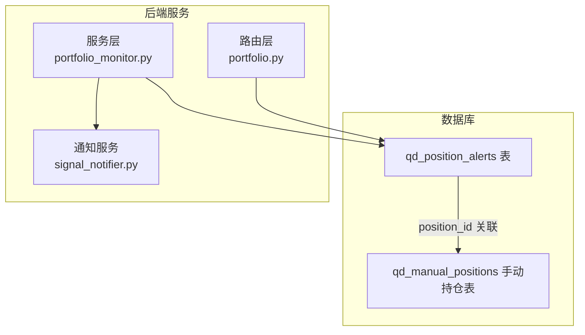
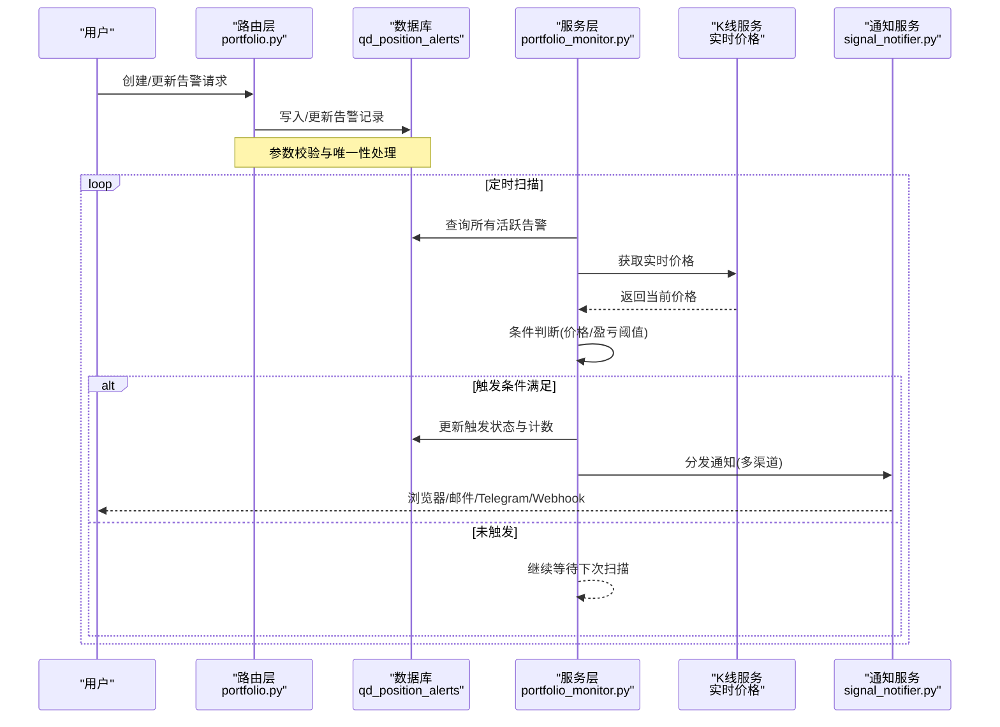
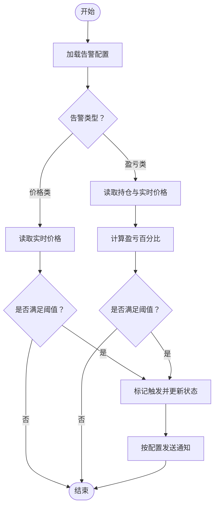
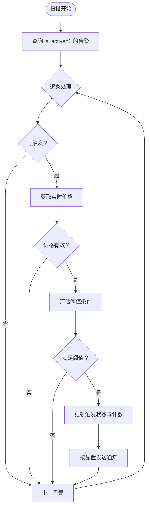
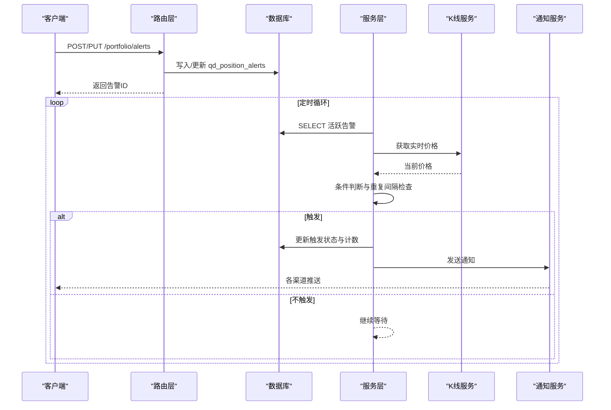
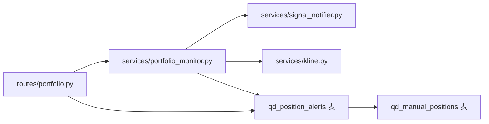

# 持仓告警模型

<cite>
**本文引用的文件**
- [init.sql](file://backend_api_python/migrations/init.sql)
- [portfolio.py](file://backend_api_python/app/routes/portfolio.py)
- [portfolio_monitor.py](file://backend_api_python/app/services/portfolio_monitor.py)
- [signal_notifier.py](file://backend_api_python/app/services/signal_notifier.py)
- [user.py](file://backend_api_python/app/routes/user.py)
</cite>

## 目录
1. [简介](#简介)
2. [项目结构](#项目结构)
3. [核心组件](#核心组件)
4. [架构总览](#架构总览)
5. [详细组件分析](#详细组件分析)
6. [依赖关系分析](#依赖关系分析)
7. [性能考量](#性能考量)
8. [故障排查指南](#故障排查指南)
9. [结论](#结论)
10. [附录](#附录)

## 简介
本文档围绕 qd_position_alerts 表构建完整的数据模型与业务流程说明，聚焦以下关键点：
- position_id 外键关联：与手动持仓表建立一对一关联，支持按持仓或按标的进行告警。
- alert_type 字段：定义告警类型枚举（价格突破/跌破、盈亏百分比突破/跌破）。
- threshold 阈值字段：支持价格阈值与百分比阈值两类配置方式。
- notification_config 通知配置：JSON 结构化配置目标渠道、消息模板语言与触发条件。
- 状态管理：is_active 与 is_triggered 的激活/停用与触发状态控制。
- 触发历史：last_triggered_at 与 trigger_count 记录最近触发时间与累计次数。
- 重复间隔：repeat_interval 控制重复触发的最小间隔，避免频繁告警。
- 完整业务流程：从条件检测到告警触发再到状态更新与通知分发。

## 项目结构
与 qd_position_alerts 相关的核心模块分布如下：
- 数据库迁移脚本：定义表结构、索引与约束。
- 路由层：提供告警的增删改查接口，负责参数校验与持久化。
- 服务层：定时扫描活跃告警、计算阈值条件、发送通知。
- 通知服务：统一处理浏览器、邮件、Telegram、Webhook 等渠道。

图表来源
- [init.sql:572-589](file://backend_api_python/migrations/init.sql#L572-L589)
- [portfolio.py:846-938](file://backend_api_python/app/routes/portfolio.py#L846-L938)
- [portfolio_monitor.py:1427-1591](file://backend_api_python/app/services/portfolio_monitor.py#L1427-L1591)
- [signal_notifier.py:236-909](file://backend_api_python/app/services/signal_notifier.py#L236-L909)

章节来源
- [init.sql:572-589](file://backend_api_python/migrations/init.sql#L572-L589)
- [portfolio.py:846-1023](file://backend_api_python/app/routes/portfolio.py#L846-L1023)
- [portfolio_monitor.py:1427-1591](file://backend_api_python/app/services/portfolio_monitor.py#L1427-L1591)
- [signal_notifier.py:236-909](file://backend_api_python/app/services/signal_notifier.py#L236-L909)

## 核心组件
- 表结构与字段
  - 主键与外键：id 自增主键；user_id 引用用户表；position_id 可空，指向 qd_manual_positions 的 id。
  - 告警类型：alert_type 枚举限定为价格类与盈亏类两类。
  - 阈值：threshold 使用高精度数值类型，支持价格阈值与百分比阈值。
  - 通知配置：notification_config 以文本存储 JSON，包含 channels 与 targets。
  - 状态字段：is_active 控制是否启用；is_triggered 标记是否已触发。
  - 时间与计数：last_triggered_at 记录最近触发时间；trigger_count 统计触发次数。
  - 间隔与元信息：repeat_interval 控制重复触发间隔；created_at/updated_at 记录创建与更新时间。
- 索引
  - 用户索引与持仓索引，提升查询效率。

章节来源
- [init.sql:572-589](file://backend_api_python/migrations/init.sql#L572-L589)
- [init.sql:591-592](file://backend_api_python/migrations/init.sql#L591-L592)

## 架构总览
下图展示从用户配置到告警触发与通知分发的整体流程。

图表来源
- [portfolio.py:846-938](file://backend_api_python/app/routes/portfolio.py#L846-L938)
- [portfolio_monitor.py:1427-1591](file://backend_api_python/app/services/portfolio_monitor.py#L1427-L1591)
- [signal_notifier.py:236-909](file://backend_api_python/app/services/signal_notifier.py#L236-L909)

## 详细组件分析

### 数据模型与字段详解
- 主键与外键
  - id：自增主键。
  - user_id：默认值与外键约束，确保归属与级联删除。
  - position_id：可空外键，指向 qd_manual_positions 的 id，用于按持仓维度配置告警。
- 标识与描述
  - market/symbol：用于定位标的，便于实时行情查询与消息模板渲染。
  - alert_type：告警类型枚举，限定为价格突破/跌破与盈亏百分比突破/跌破四类。
- 阈值与配置
  - threshold：数值型阈值，价格类必须为正数；盈亏类可为正或负，表示目标或止损。
  - notification_config：JSON 文本，包含 channels 与 targets，语言字段用于本地化消息模板。
- 状态与历史
  - is_active：布尔开关，控制是否参与扫描。
  - is_triggered：布尔标记，首次触发置位，需显式重置才可再次触发。
  - last_triggered_at：最近一次触发时间，UTC 时间，用于重复间隔控制。
  - trigger_count：累计触发次数，用于统计与审计。
- 重复控制
  - repeat_interval：秒级间隔，仅当上次触发超过该间隔后才允许再次触发。
- 元数据
  - notes：备注字段，便于用户记录用途。
  - created_at/updated_at：自动维护的时间戳。

章节来源
- [init.sql:572-589](file://backend_api_python/migrations/init.sql#L572-L589)

### 告警类型与阈值配置机制
- 告警类型枚举
  - price_above：价格大于等于阈值触发。
  - price_below：价格小于等于阈值触发。
  - pnl_above：盈亏百分比大于等于阈值触发。
  - pnl_below：盈亏百分比小于等于阈值触发。
- 阈值类型
  - 价格阈值：仅适用于价格类告警，必须为正数。
  - 百分比阈值：适用于盈亏类告警，正值表示目标盈利，负值表示止损。
- 复合条件
  - 盈亏类条件依赖持仓信息（入场价、数量、方向），通过实时价格计算当前盈亏百分比后与阈值比较。

图表来源
- [portfolio_monitor.py:1488-1534](file://backend_api_python/app/services/portfolio_monitor.py#L1488-L1534)

章节来源
- [portfolio.py:863-886](file://backend_api_python/app/routes/portfolio.py#L863-L886)
- [portfolio_monitor.py:1488-1534](file://backend_api_python/app/services/portfolio_monitor.py#L1488-L1534)

### 通知配置 notification_config 结构
- channels：字符串或数组，支持的渠道包括 browser、email、telegram、webhook 等。
- targets：对象，包含各渠道的目标标识与令牌，如 email、telegram_chat_id、telegram_bot_token、webhook_url 等。
- language：字符串，决定消息模板的语言版本（例如 en-US 或 zh-CN）。
- 解析与合并
  - 服务层会合并用户全局通知设置（notification_settings）中的目标信息，确保即使前端未提供完整 targets，也能通过账户信息补齐。
  - 若配置的渠道均不可达，则自动追加 browser 渠道以保证站内通知可达。

章节来源
- [portfolio.py:858](file://backend_api_python/app/routes/portfolio.py#L858)
- [portfolio_monitor.py:68-129](file://backend_api_python/app/services/portfolio_monitor.py#L68-L129)
- [signal_notifier.py:236-909](file://backend_api_python/app/services/signal_notifier.py#L236-L909)
- [user.py:947-1011](file://backend_api_python/app/routes/user.py#L947-L1011)

### 状态管理：is_active 与 is_triggered
- is_active
  - 控制告警是否参与扫描。
  - 更新时若重新激活，会同时重置 is_triggered，允许立即再次触发（结合 repeat_interval 实现安全控制）。
- is_triggered
  - 首次触发后置位，阻止同周期重复触发。
  - 需要通过更新接口显式复位或等待 repeat_interval 过期后再次触发。

章节来源
- [portfolio.py:965-971](file://backend_api_python/app/routes/portfolio.py#L965-L971)
- [portfolio_monitor.py:1464-1475](file://backend_api_python/app/services/portfolio_monitor.py#L1464-L1475)

### 触发历史与重复间隔控制
- last_triggered_at
  - 记录最近一次触发时间，用于重复间隔判断。
  - 服务层会将无时区的时间转换为 UTC，确保跨时区一致性。
- trigger_count
  - 每次成功触发后递增，用于统计与审计。
- repeat_interval
  - 秒级间隔，仅当距离上次触发时间超过该间隔时才允许再次触发。
  - 未触发或首次触发不受此限制，但一旦触发后即受控。

图表来源
- [portfolio_monitor.py:1427-1591](file://backend_api_python/app/services/portfolio_monitor.py#L1427-L1591)

章节来源
- [portfolio_monitor.py:1464-1475](file://backend_api_python/app/services/portfolio_monitor.py#L1464-L1475)
- [portfolio_monitor.py:1538-1550](file://backend_api_python/app/services/portfolio_monitor.py#L1538-L1550)

### 业务流程：从条件检测到状态更新
- 创建/更新流程
  - 路由层接收请求，进行参数校验（类型、阈值、市场/符号）。
  - 对于按持仓配置的告警，若已存在同一用户+持仓组合的告警，则更新而非新建。
  - 将 notification_config 序列化为 JSON 文本存入数据库。
- 扫描与触发流程
  - 服务层定时查询所有活跃告警，逐条判断是否可触发（未触发或超过重复间隔）。
  - 获取实时价格，计算条件是否满足（价格类或盈亏类）。
  - 满足条件则更新 is_triggered、last_triggered_at、trigger_count，并发送通知。
- 通知分发
  - 依据 notification_config 中的 channels 与 targets，调用通知服务向各渠道发送消息。
  - 支持浏览器站内通知、邮件、Telegram、Webhook 等。

图表来源
- [portfolio.py:846-938](file://backend_api_python/app/routes/portfolio.py#L846-L938)
- [portfolio_monitor.py:1427-1591](file://backend_api_python/app/services/portfolio_monitor.py#L1427-L1591)
- [signal_notifier.py:236-909](file://backend_api_python/app/services/signal_notifier.py#L236-L909)

章节来源
- [portfolio.py:846-1023](file://backend_api_python/app/routes/portfolio.py#L846-L1023)
- [portfolio_monitor.py:1427-1591](file://backend_api_python/app/services/portfolio_monitor.py#L1427-L1591)

## 依赖关系分析
- 表间依赖
  - qd_position_alerts.position_id → qd_manual_positions.id：按持仓维度关联。
  - qd_position_alerts.user_id → qd_users.id：归属关系与级联删除。
- 服务依赖
  - portfolio_monitor 依赖 KlineService 获取实时价格，依赖 SignalNotifier 发送通知。
  - SignalNotifier 依赖用户配置（notification_settings）与各渠道令牌。
- 路由依赖
  - portfolio 路由负责参数校验、唯一性处理与 JSON 序列化。

图表来源
- [portfolio.py:846-938](file://backend_api_python/app/routes/portfolio.py#L846-L938)
- [portfolio_monitor.py:1427-1591](file://backend_api_python/app/services/portfolio_monitor.py#L1427-L1591)
- [signal_notifier.py:236-909](file://backend_api_python/app/services/signal_notifier.py#L236-L909)

章节来源
- [portfolio.py:846-1023](file://backend_api_python/app/routes/portfolio.py#L846-L1023)
- [portfolio_monitor.py:1427-1591](file://backend_api_python/app/services/portfolio_monitor.py#L1427-L1591)

## 性能考量
- 扫描频率与并发
  - 服务层采用后台循环扫描，建议根据用户规模与告警数量调整扫描周期，避免过度轮询。
- 数据库访问
  - 使用索引加速查询：用户索引与持仓索引。
  - 单次扫描批量处理，减少连接开销。
- 实时价格获取
  - 优先使用高效的价格服务接口，对异常与超时做好降级处理。
- 通知分发
  - 对外部渠道调用增加超时与重试策略，避免阻塞主流程。
- 重复间隔策略
  - repeat_interval 作为防抖与节流的关键手段，建议结合业务场景合理设置，避免频繁告警影响用户体验与成本。

## 故障排查指南
- 常见问题
  - 通知未送达：检查 notification_config 中 channels 与 targets 是否完整，必要时通过用户全局设置补齐。
  - 重复触发过于频繁：适当提高 repeat_interval，或在更新时重置 is_triggered 并设置合理的间隔。
  - 阈值无效：确认 alert_type 与阈值类型匹配（价格类必须为正数）。
  - 未触发：检查 is_active 与 last_triggered_at 是否导致重复间隔未过期。
- 排查步骤
  - 查看告警记录与状态：确认 is_active、is_triggered、last_triggered_at、trigger_count。
  - 检查实时价格接口：确认返回价格有效且非零。
  - 验证通知配置：使用测试接口验证各渠道连通性。
- 日志与监控
  - 关注服务层扫描日志与异常捕获，定位具体失败环节。

章节来源
- [portfolio_monitor.py:1464-1475](file://backend_api_python/app/services/portfolio_monitor.py#L1464-L1475)
- [portfolio_monitor.py:1587-1591](file://backend_api_python/app/services/portfolio_monitor.py#L1587-L1591)
- [user.py:947-1011](file://backend_api_python/app/routes/user.py#L947-L1011)

## 结论
qd_position_alerts 表通过清晰的字段设计与严格的业务流程实现了灵活而可靠的持仓告警能力。其核心特性包括：
- 明确的外键关联与索引设计，保障查询与一致性。
- 精准的阈值类型与条件判断，覆盖价格与盈亏两大场景。
- 完备的通知配置与渠道扩展，满足多端触达。
- 健壮的状态与历史管理，配合重复间隔控制，避免误报与骚扰。
建议在实际部署中结合用户规模与业务需求，合理设置重复间隔与扫描频率，并完善通知配置的测试与监控。

## 附录
- 最佳实践
  - 价格类阈值必须为正数；盈亏类阈值可正可负，明确目标与止损边界。
  - 合理设置 repeat_interval，兼顾及时性与体验。
  - 使用 notification_config 的 language 字段保持消息本地化一致性。
  - 对高频交易标的建议缩短扫描周期，对低频标的可延长周期以节省资源。
- 性能优化建议
  - 批量查询与处理，减少数据库往返。
  - 对外部服务调用增加超时与熔断保护。
  - 使用缓存与限流策略，避免瞬时高峰冲击。