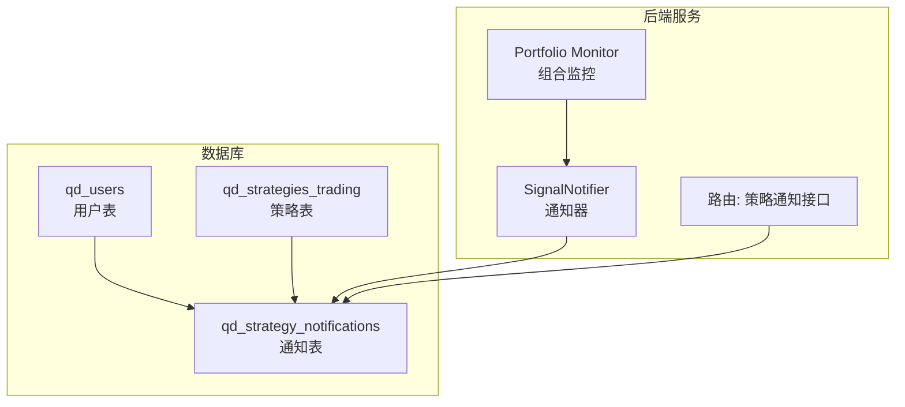
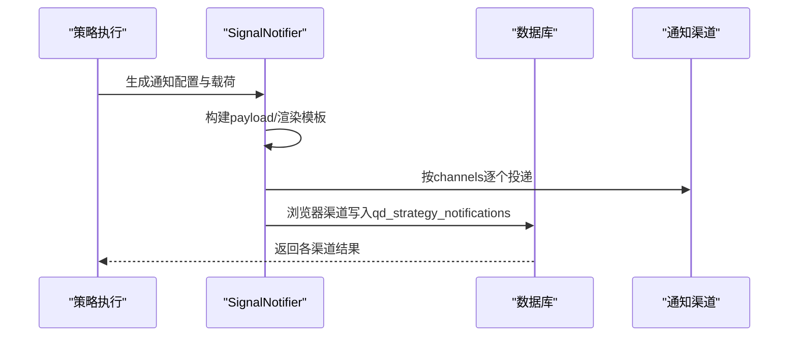
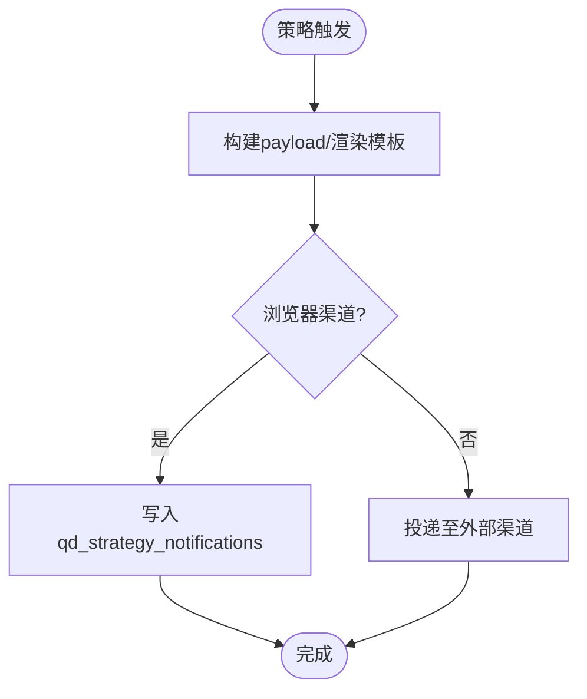
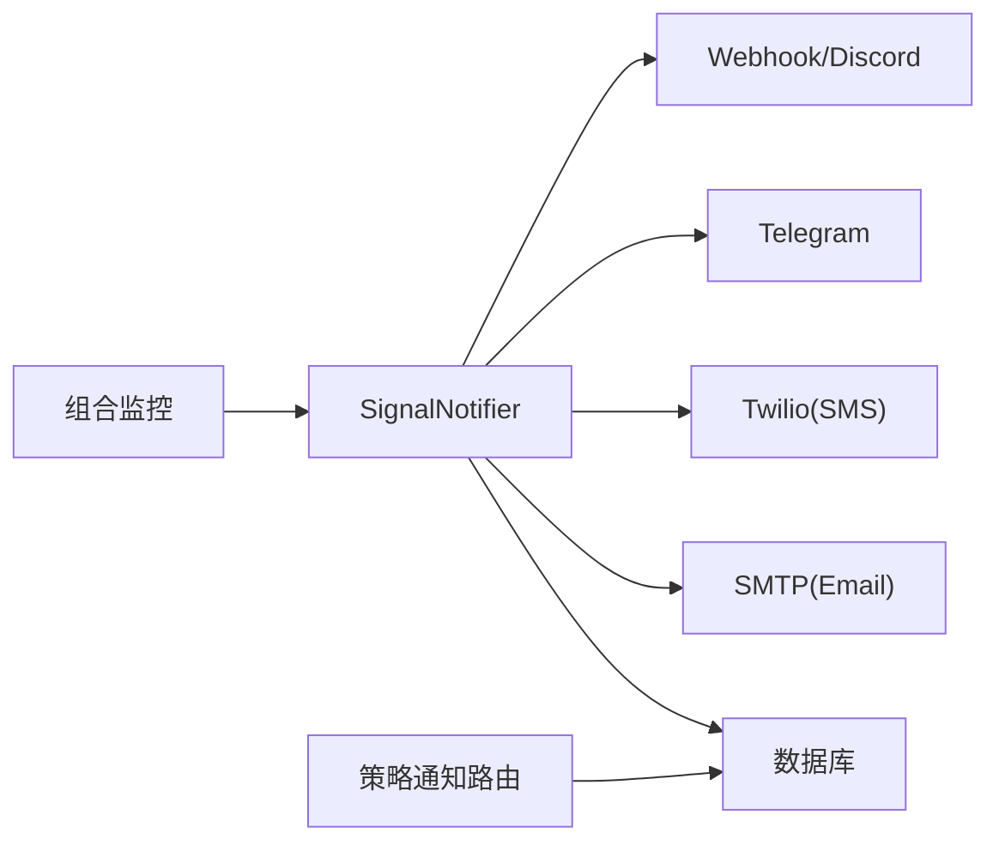

# 策略通知模型

<cite>
**本文引用的文件**
- [init.sql](file://backend_api_python/migrations/init.sql)
- [signal_notifier.py](file://backend_api_python/app/services/signal_notifier.py)
- [strategy.py](file://backend_api_python/app/routes/strategy.py)
- [portfolio_monitor.py](file://backend_api_python/app/services/portfolio_monitor.py)
- [NOTIFICATION_TELEGRAM_CONFIG_EN.md](file://docs/NOTIFICATION_TELEGRAM_CONFIG_EN.md)
- [NOTIFICATION_EMAIL_CONFIG_EN.md](file://docs/NOTIFICATION_EMAIL_CONFIG_EN.md)
- [NOTIFICATION_SMS_CONFIG_EN.md](file://docs/NOTIFICATION_SMS_CONFIG_EN.md)
</cite>

## 目录
1. [简介](#简介)
2. [项目结构](#项目结构)
3. [核心组件](#核心组件)
4. [架构总览](#架构总览)
5. [详细组件分析](#详细组件分析)
6. [依赖关系分析](#依赖关系分析)
7. [性能考量](#性能考量)
8. [故障排查指南](#故障排查指南)
9. [结论](#结论)
10. [附录](#附录)

## 简介
本文件面向“qd_strategy_notifications”策略通知表，提供完整的数据模型与通知架构文档。内容涵盖：
- 表结构与字段语义
- 与用户与策略的外键关联
- symbol 与 signal_type 的策略绑定机制
- channels 多渠道配置系统（Telegram、Email、SMS、Webhook、Discord、浏览器）
- message 模板系统（动态参数、HTML、国际化）
- is_read 状态管理与批量清理
- 生命周期流程（创建、发送、状态更新）
- 频率控制、去重与性能优化
- 典型场景与最佳实践

## 项目结构
与通知模型直接相关的核心位置如下：
- 数据库初始化脚本定义了 qd_strategy_notifications 表及索引
- 信号通知器负责构建消息、渲染模板、多渠道投递与持久化
- 路由层提供通知查询、未读计数、标记已读/全部已读、清空等接口
- 组合监控服务负责合并多监控通道并解析用户通知配置
- 文档提供 Telegram/Email/SMS 的配置指引

图示来源
- [init.sql:348-364](file://backend_api_python/migrations/init.sql#L348-L364)
- [signal_notifier.py:517-538](file://backend_api_python/app/services/signal_notifier.py#L517-L538)
- [strategy.py:1326-1362](file://backend_api_python/app/routes/strategy.py#L1326-L1362)

章节来源
- [init.sql:348-364](file://backend_api_python/migrations/init.sql#L348-L364)
- [signal_notifier.py:517-538](file://backend_api_python/app/services/signal_notifier.py#L517-L538)
- [strategy.py:1326-1362](file://backend_api_python/app/routes/strategy.py#L1326-L1362)

## 核心组件
- 表：qd_strategy_notifications
  - 主键 id，自增
  - user_id 外键关联 qd_users(id)，删除级联
  - strategy_id 外键关联 qd_strategies_trading(id)，删除级联
  - symbol、signal_type 用于策略绑定与过滤
  - channels 存储启用的渠道列表（逗号分隔）
  - title、message 为标题与正文（支持 HTML）
  - payload_json 为结构化载荷（事件元数据）
  - is_read 标记未读/已读
  - created_at 时间戳，默认当前时间

- 通知器 SignalNotifier
  - 构建 payload（策略、标的、信号、订单、追踪等）
  - 渲染多渠道消息（纯文本、Telegram HTML、Email HTML）
  - 多渠道投递（浏览器、Webhook、Discord、Telegram、Email、Phone）
  - 浏览器渠道持久化到数据库

- 路由接口
  - 查询通知列表（支持按策略、since_id、limit）
  - 未读计数
  - 标记单条/全部已读
  - 清空通知

- 组合监控
  - 合并多监控的 channels 并解析用户通知配置
  - 规范化 targets（优先策略配置，其次用户全局配置）

章节来源
- [init.sql:348-364](file://backend_api_python/migrations/init.sql#L348-L364)
- [signal_notifier.py:171-284](file://backend_api_python/app/services/signal_notifier.py#L171-L284)
- [strategy.py:1326-1496](file://backend_api_python/app/routes/strategy.py#L1326-L1496)
- [portfolio_monitor.py:68-1118](file://backend_api_python/app/services/portfolio_monitor.py#L68-L1118)

## 架构总览
通知从策略触发到用户接收的总体流程：

图示来源
- [signal_notifier.py:171-284](file://backend_api_python/app/services/signal_notifier.py#L171-L284)
- [signal_notifier.py:517-538](file://backend_api_python/app/services/signal_notifier.py#L517-L538)

## 详细组件分析

### 数据模型与字段语义
- 主键与时间
  - id：自增主键
  - created_at：默认当前时间，用于排序与前端时间戳转换

- 关联字段
  - user_id：通知归属用户，外键关联 qd_users(id)，删除级联
  - strategy_id：可空，关联 qd_strategies_trading(id)，删除级联；为空时表示组合监控类通知

- 策略绑定字段
  - symbol：标的符号，用于过滤与展示
  - signal_type：信号类型（如 open_long、close_short 等），用于模板渲染与过滤

- 渠道与内容
  - channels：启用的渠道列表，存储为逗号分隔字符串（如 "telegram,email"）
  - title、message：标题与正文，message 支持 HTML
  - payload_json：结构化载荷，包含事件元数据（策略、标的、信号、订单、追踪等）

- 状态字段
  - is_read：整型标记，0 未读、非 0 已读

- 索引
  - idx_notifications_user_id、idx_notifications_strategy_id、idx_notifications_is_read 提升查询与统计效率

章节来源
- [init.sql:348-364](file://backend_api_python/migrations/init.sql#L348-L364)

### 外键关联与策略绑定机制
- user_id 外键
  - 保障通知归属用户一致性，删除用户时级联删除通知
- strategy_id 外键
  - 通知可绑定到具体策略；为空表示组合监控类通知
- symbol 与 signal_type
  - 用于前端筛选与模板渲染，便于用户按策略/标的/信号类型查看通知

章节来源
- [init.sql:350-353](file://backend_api_python/migrations/init.sql#L350-L353)

### channels 多渠道配置系统
- 配置来源
  - 策略配置中的 channels 列表与 targets 映射
  - 用户全局通知设置（如 Telegram Chat ID、Bot Token、Email、Phone、Webhook 等）
- 渲染与投递
  - 浏览器：写入数据库，供前端拉取
  - Webhook/Discord：按配置投递，支持签名与重试
  - Telegram：支持用户级 Token 或策略级 Token 覆盖
  - Email：基于 SMTP 配置投递
  - Phone：基于 Twilio 投递
- 优先级
  - 策略级 targets 优先于用户全局设置
  - 若 channels 为空，自动补全为 browser 以确保站内可见

章节来源
- [signal_notifier.py:171-284](file://backend_api_python/app/services/signal_notifier.py#L171-L284)
- [signal_notifier.py:540-628](file://backend_api_python/app/services/signal_notifier.py#L540-L628)
- [signal_notifier.py:630-704](file://backend_api_python/app/services/signal_notifier.py#L630-L704)
- [signal_notifier.py:706-740](file://backend_api_python/app/services/signal_notifier.py#L706-L740)
- [signal_notifier.py:741-785](file://backend_api_python/app/services/signal_notifier.py#L741-L785)
- [signal_notifier.py:787-800](file://backend_api_python/app/services/signal_notifier.py#L787-L800)
- [portfolio_monitor.py:68-1118](file://backend_api_python/app/services/portfolio_monitor.py#L68-L1118)
- [NOTIFICATION_TELEGRAM_CONFIG_EN.md:77-118](file://docs/NOTIFICATION_TELEGRAM_CONFIG_EN.md#L77-L118)
- [NOTIFICATION_EMAIL_CONFIG_EN.md:248-253](file://docs/NOTIFICATION_EMAIL_CONFIG_EN.md#L248-L253)
- [NOTIFICATION_SMS_CONFIG_EN.md:87-127](file://docs/NOTIFICATION_SMS_CONFIG_EN.md#L87-L127)

### message 模板系统
- 动态参数
  - payload 包含策略名称/ID、标的、信号类型、方向、价格、金额、PendingOrder ID、模式、时间戳等
- HTML 支持
  - Telegram 使用 HTML 格式（带标签与转义）
  - Email 使用内联 CSS 的 HTML 表格
- 国际化
  - 通知器内部未对 message 进行本地化；组合监控提供语言选择逻辑，但通知器仍按英文模板渲染
- 输出形态
  - plain：纯文本摘要
  - telegram_html：Telegram HTML
  - email_html：Email HTML

章节来源
- [signal_notifier.py:285-337](file://backend_api_python/app/services/signal_notifier.py#L285-L337)
- [signal_notifier.py:339-413](file://backend_api_python/app/services/signal_notifier.py#L339-L413)
- [signal_notifier.py:415-482](file://backend_api_python/app/services/signal_notifier.py#L415-L482)

### is_read 状态管理机制
- 未读/已读
  - 0 表示未读，非 0 表示已读
- 接口能力
  - 单条标记已读
  - 全部标记已读
  - 清空通知
- 权限与范围
  - 仅允许操作当前用户的策略通知或组合监控通知（strategy_id 属于该用户或为空且 user_id 匹配）

章节来源
- [strategy.py:1416-1496](file://backend_api_python/app/routes/strategy.py#L1416-L1496)

### 通知生命周期
- 创建
  - 策略触发后，SignalNotifier 构建 payload 并渲染消息
  - 浏览器渠道直接写入数据库
- 发送
  - 按 channels 顺序投递至各渠道
  - Webhook/Discord 支持签名与重试
- 状态更新
  - 前端轮询或拉取接口获取通知
  - 用户阅读后调用标记已读/全部已读接口

图示来源
- [signal_notifier.py:171-284](file://backend_api_python/app/services/signal_notifier.py#L171-L284)
- [signal_notifier.py:517-538](file://backend_api_python/app/services/signal_notifier.py#L517-L538)

### 通知频率控制、去重与性能优化
- 频率控制
  - 通知器未内置通知级别的频率限制；可通过上游策略或 Webhook/Discord 等渠道侧限流策略配合
- 去重机制
  - 通知器未对 qd_strategy_notifications 做去重；去重主要体现在下单执行层面的信号去重（与本表无直接关系）
- 性能优化
  - 数据库索引：idx_notifications_user_id、idx_notifications_strategy_id、idx_notifications_is_read
  - 分页查询：路由层支持 limit 与 since_id
  - 时间转换：created_at 统一转换为 UTC 秒级时间戳，避免时区偏差

章节来源
- [init.sql:362-364](file://backend_api_python/migrations/init.sql#L362-L364)
- [strategy.py:1326-1362](file://backend_api_python/app/routes/strategy.py#L1326-L1362)

### 典型通知场景与最佳实践
- 场景一：策略信号通知
  - channels：["telegram","email"]
  - targets：包含 Telegram Chat ID、Bot Token、Email、Phone、Webhook 等
  - 建议：策略级 targets 优先，必要时补充浏览器渠道确保站内可见
- 场景二：组合监控告警
  - channels：可能来自多个监控的合并集合
  - targets：由用户全局设置与监控配置共同决定
  - 建议：统一语言（zh-CN/en-US）并在监控侧进行去重与限流
- 最佳实践
  - 明确 symbol 与 signal_type，便于前端筛选
  - message 使用 HTML 时注意兼容性与长度限制
  - Webhook 使用签名头（X-QD-Timestamp/X-QD-Signature）提升安全性
  - 定期清理历史通知，避免表膨胀

章节来源
- [portfolio_monitor.py:1004-1042](file://backend_api_python/app/services/portfolio_monitor.py#L1004-L1042)
- [signal_notifier.py:592-609](file://backend_api_python/app/services/signal_notifier.py#L592-L609)
- [NOTIFICATION_TELEGRAM_CONFIG_EN.md:90-118](file://docs/NOTIFICATION_TELEGRAM_CONFIG_EN.md#L90-L118)
- [NOTIFICATION_EMAIL_CONFIG_EN.md:248-253](file://docs/NOTIFICATION_EMAIL_CONFIG_EN.md#L248-L253)
- [NOTIFICATION_SMS_CONFIG_EN.md:113-127](file://docs/NOTIFICATION_SMS_CONFIG_EN.md#L113-L127)

## 依赖关系分析
- SignalNotifier 依赖
  - 数据库连接：写入通知
  - 外部服务：SMTP/Twilio/Webhook/Discord/Telegram
  - 环境变量：SMTP、Twilio、Webhook 签名密钥等
- 路由层依赖
  - 查询通知列表、未读计数、标记已读/全部已读、清空通知
- 组合监控依赖
  - 合并多监控 channels，解析用户通知设置

图示来源
- [signal_notifier.py:148-170](file://backend_api_python/app/services/signal_notifier.py#L148-L170)
- [signal_notifier.py:540-628](file://backend_api_python/app/services/signal_notifier.py#L540-L628)
- [strategy.py:1326-1496](file://backend_api_python/app/routes/strategy.py#L1326-L1496)
- [portfolio_monitor.py:68-1118](file://backend_api_python/app/services/portfolio_monitor.py#L68-L1118)

章节来源
- [signal_notifier.py:148-170](file://backend_api_python/app/services/signal_notifier.py#L148-L170)
- [strategy.py:1326-1496](file://backend_api_python/app/routes/strategy.py#L1326-L1496)
- [portfolio_monitor.py:68-1118](file://backend_api_python/app/services/portfolio_monitor.py#L68-L1118)

## 性能考量
- 查询性能
  - 使用索引加速 user_id、strategy_id、is_read 的过滤与统计
  - 分页查询 with since_id 与 limit，避免一次性加载过多数据
- 写入性能
  - 浏览器渠道写入为单条插入，建议在高并发下评估数据库写入压力
- 渲染与投递
  - HTML 渲染与网络请求为 IO 密集，建议合理设置超时与重试策略
- 存储与清理
  - 建议定期清理历史通知，控制表规模

## 故障排查指南
- 未收到通知
  - 检查 channels 是否为空（自动补全为 browser）
  - 检查 targets 是否正确配置（Email/Phone/Telegram/Webhook）
  - 查看各渠道返回的错误码与日志
- Telegram
  - 确认 Bot Token 与 Chat ID 正确，Token 格式为 数字:字母数字串
  - 群组/频道 ID 为负数
- Email
  - 确认 SMTP_HOST、SMTP_FROM 已配置
  - 检查 TLS/SSL 设置与端口
- SMS
  - 确认 Twilio 账户、Auth Token、Sender Number 配置正确
  - 注意国际号码格式与运营商限制
- Webhook
  - 检查 URL 格式、签名密钥与重试逻辑

章节来源
- [signal_notifier.py:540-628](file://backend_api_python/app/services/signal_notifier.py#L540-L628)
- [signal_notifier.py:630-704](file://backend_api_python/app/services/signal_notifier.py#L630-L704)
- [signal_notifier.py:706-740](file://backend_api_python/app/services/signal_notifier.py#L706-L740)
- [signal_notifier.py:741-785](file://backend_api_python/app/services/signal_notifier.py#L741-L785)
- [signal_notifier.py:787-800](file://backend_api_python/app/services/signal_notifier.py#L787-L800)
- [NOTIFICATION_TELEGRAM_CONFIG_EN.md:103-118](file://docs/NOTIFICATION_TELEGRAM_CONFIG_EN.md#L103-L118)
- [NOTIFICATION_SMS_CONFIG_EN.md:158-175](file://docs/NOTIFICATION_SMS_CONFIG_EN.md#L158-L175)

## 结论
qd_strategy_notifications 表为策略信号与监控告警提供了统一的存储与查询入口。结合 SignalNotifier 的多渠道投递与路由层的权限控制，形成了从策略触发到用户接收的闭环。建议在实际部署中：
- 明确 channels 与 targets 的优先级与来源
- 使用签名与限流保护 Webhook/Discord
- 定期清理历史通知，保持查询性能
- 在前端按策略/标的/信号类型进行筛选与聚合

## 附录
- 字段清单与约束
  - id：主键
  - user_id：外键 qd_users(id)，删除级联
  - strategy_id：外键 qd_strategies_trading(id)，删除级联
  - symbol、signal_type：策略绑定字段
  - channels：启用渠道列表（逗号分隔）
  - title、message：标题与正文（支持 HTML）
  - payload_json：结构化载荷
  - is_read：未读/已读标记
  - created_at：时间戳

章节来源
- [init.sql:348-364](file://backend_api_python/migrations/init.sql#L348-L364)