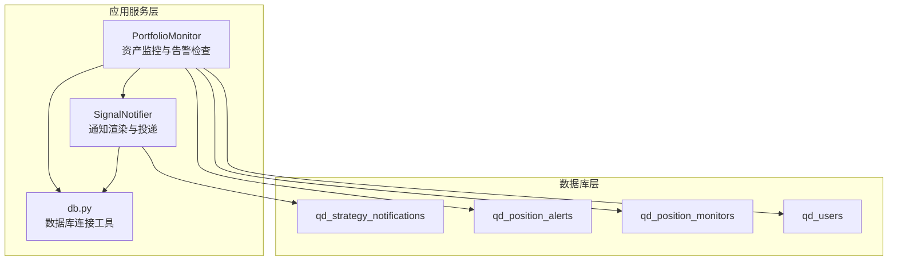
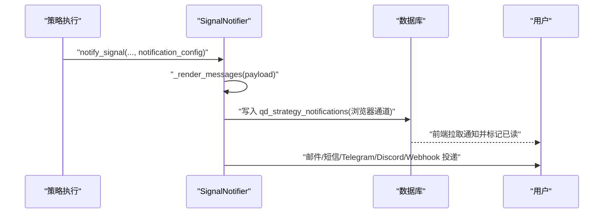
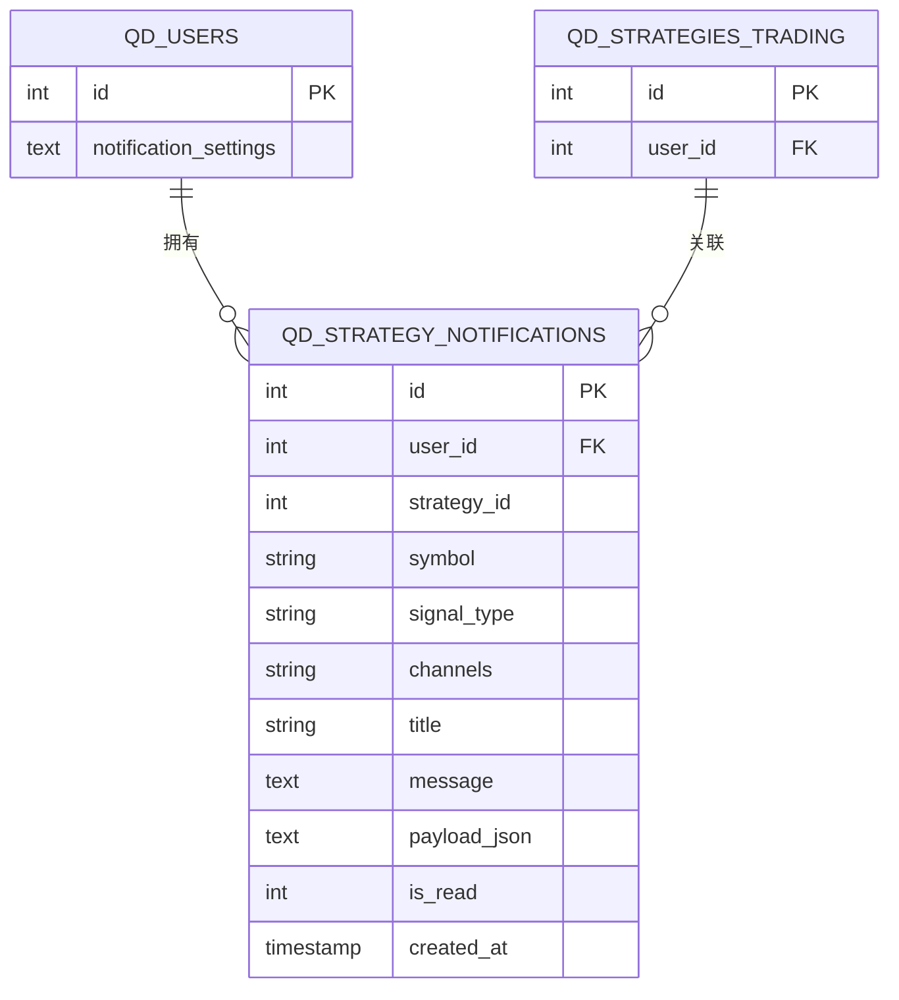
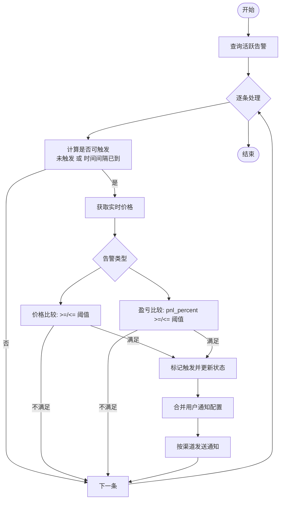
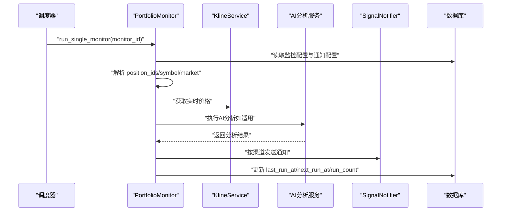
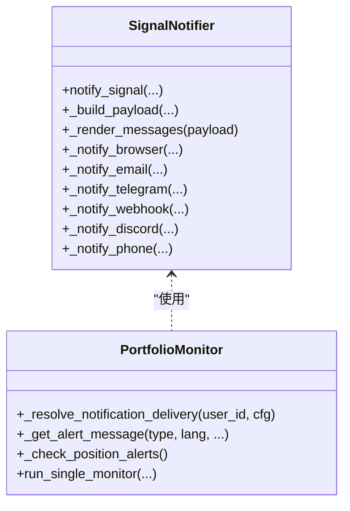
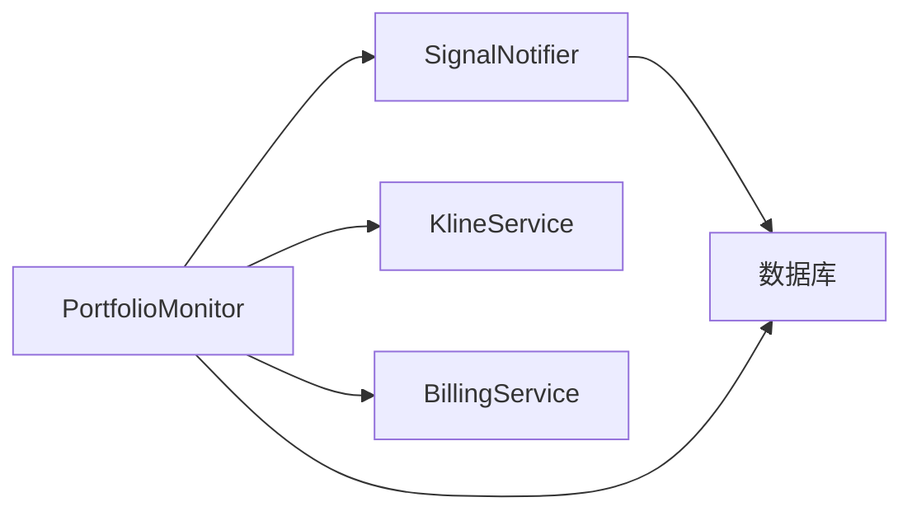

# 通知告警模型

<cite>
**本文引用的文件**
- [init.sql](file://backend_api_python/migrations/init.sql)
- [signal_notifier.py](file://backend_api_python/app/services/signal_notifier.py)
- [portfolio_monitor.py](file://backend_api_python/app/services/portfolio_monitor.py)
- [db.py](file://backend_api_python/app/utils/db.py)
- [NOTIFICATION_EMAIL_CONFIG_EN.md](file://docs/NOTIFICATION_EMAIL_CONFIG_EN.md)
- [NOTIFICATION_TELEGRAM_CONFIG_EN.md](file://docs/NOTIFICATION_TELEGRAM_CONFIG_EN.md)
- [NOTIFICATION_SMS_CONFIG_EN.md](file://docs/NOTIFICATION_SMS_CONFIG_EN.md)
</cite>

## 目录
1. [简介](#简介)
2. [项目结构](#项目结构)
3. [核心组件](#核心组件)
4. [架构总览](#架构总览)
5. [详细组件分析](#详细组件分析)
6. [依赖关系分析](#依赖关系分析)
7. [性能考量](#性能考量)
8. [故障排查指南](#故障排查指南)
9. [结论](#结论)
10. [附录](#附录)

## 简介
本文件聚焦于通知与告警系统的数据模型与实现，围绕以下三张核心表展开：
- qd_strategy_notifications：策略信号通知消息表，支持多渠道投递与状态管理
- qd_position_alerts：持仓告警表，支持价格/盈亏阈值告警与重复触发控制
- qd_position_monitors：位置监控器表，支持AI/人工监控类型与配置管理

同时，文档解释通知模板系统与动态内容生成机制，梳理告警触发的业务逻辑（条件判断、频率控制、通知发送），并给出性能优化与大规模通知处理策略，最后提供典型通知场景的数据结构示例。

## 项目结构
与通知告警相关的核心文件与职责如下：
- 数据库初始化脚本：定义三张关键表及索引
- 通知服务：统一渲染与投递策略信号通知，支持浏览器、邮件、短信、Telegram、Discord、Webhook
- 资产监控服务：负责批量资产监控、告警检查、通知合并与投递
- 数据访问工具：提供统一的数据库连接与事务封装
- 文档：各通知渠道的配置说明

图示来源
- [init.sql](file://backend_api_python/migrations/init.sql)
- [signal_notifier.py](file://backend_api_python/app/services/signal_notifier.py)
- [portfolio_monitor.py](file://backend_api_python/app/services/portfolio_monitor.py)
- [db.py](file://backend_api_python/app/utils/db.py)

章节来源
- [init.sql](file://backend_api_python/migrations/init.sql)
- [signal_notifier.py](file://backend_api_python/app/services/signal_notifier.py)
- [portfolio_monitor.py](file://backend_api_python/app/services/portfolio_monitor.py)
- [db.py](file://backend_api_python/app/utils/db.py)

## 核心组件
- qd_strategy_notifications：策略信号通知消息表
  - 字段要点：channels（逗号分隔的多渠道字符串）、is_read（0/1状态）、payload_json（动态渲染的结构化载荷）
  - 用途：持久化策略信号通知，供前端拉取与标记已读
- qd_position_alerts：持仓告警表
  - 字段要点：alert_type（告警类型）、threshold（阈值）、repeat_interval（重复间隔）、is_triggered/is_active（触发与激活状态）
  - 用途：按条件触发价格/盈亏类告警，并控制重复发送频率
- qd_position_monitors：位置监控器表
  - 字段要点：monitor_type（ai/manual）、config（监控配置）、notification_config（通知配置）
  - 用途：定时运行AI或人工监控，产出报告并通过多渠道投递

章节来源
- [init.sql](file://backend_api_python/migrations/init.sql)
- [portfolio_monitor.py](file://backend_api_python/app/services/portfolio_monitor.py)

## 架构总览
通知与告警的整体流程：
- 策略信号触发 → SignalNotifier 渲染模板 → 写入 qd_strategy_notifications（浏览器通道）或调用外部通道
- 资产监控/告警检查 → PortfolioMonitor 查询活跃告警 → 条件判断与频率控制 → 选择渠道投递 → 更新告警状态

图示来源
- [signal_notifier.py](file://backend_api_python/app/services/signal_notifier.py)
- [init.sql](file://backend_api_python/migrations/init.sql)

## 详细组件分析

### 组件A：通知消息表 qd_strategy_notifications
- 设计要点
  - channels：以逗号分隔的字符串，存储启用的多个通知渠道（如 browser,email,telegram 等）
  - is_read：整型状态位，0为未读，1为已读，便于前端与移动端进行状态管理
  - payload_json：结构化载荷，包含策略、信号、订单、时间戳等信息，用于动态模板渲染
  - title/message：标题与正文，用于快速展示与邮件/短信摘要
- 动态内容生成
  - SignalNotifier 根据 notification_config 渲染不同渠道的消息体（纯文本、HTML、Telegram HTML）
  - 浏览器通道直接持久化 payload_json，便于前端复用
- 使用场景
  - 策略信号事件（开仓、加仓、平仓、减仓）触发通知
  - 资产监控批量报告与错误通知也走相同表结构

图示来源
- [init.sql](file://backend_api_python/migrations/init.sql)

章节来源
- [init.sql](file://backend_api_python/migrations/init.sql)
- [signal_notifier.py](file://backend_api_python/app/services/signal_notifier.py)

### 组件B：持仓告警系统 qd_position_alerts
- 设计要点
  - alert_type：告警类型，如 price_above/price_below（价格突破/跌破）、pnl_above/pnl_below（盈亏阈值）
  - threshold：阈值，数值型，配合 alert_type 进行比较
  - repeat_interval：重复间隔（秒），用于频率控制；为0表示仅触发一次
  - is_active/is_triggered：激活与触发状态；触发后更新 last_triggered_at 与 trigger_count
  - notification_config：通知配置（含 channels/targets/language 等），用于最终投递
- 触发逻辑
  - 获取实时价格，与阈值比较
  - 对于盈亏类告警，需结合持仓的 entry_price、quantity、side 计算 pnl_percent
  - 频率控制：若已触发且 repeat_interval>0，则需满足时间间隔才允许再次触发
- 通知发送
  - 合并用户个人中心通知配置（email/telegram/webhook 等）
  - 按渠道发送（浏览器写入表、邮件/Telegram 投递）

图示来源
- [portfolio_monitor.py](file://backend_api_python/app/services/portfolio_monitor.py)
- [signal_notifier.py](file://backend_api_python/app/services/signal_notifier.py)

章节来源
- [portfolio_monitor.py](file://backend_api_python/app/services/portfolio_monitor.py)
- [signal_notifier.py](file://backend_api_python/app/services/signal_notifier.py)

### 组件C：位置监控器 qd_position_monitors
- 设计要点
  - monitor_type：监控类型，ai 或 manual
  - config：监控配置（如运行间隔、语言、提示词等）
  - notification_config：通知配置（与告警一致）
  - 运行调度：维护 last_run_at/next_run_at/run_count，按配置周期执行
- 执行流程
  - 读取监控配置与通知配置
  - 获取目标持仓（或虚拟观察）
  - 调用计费与AI分析（若类型为 ai）
  - 生成报告并按渠道投递
  - 更新运行状态与下次运行时间

图示来源
- [portfolio_monitor.py](file://backend_api_python/app/services/portfolio_monitor.py)
- [signal_notifier.py](file://backend_api_python/app/services/signal_notifier.py)

章节来源
- [portfolio_monitor.py](file://backend_api_python/app/services/portfolio_monitor.py)

### 组件D：通知模板系统与动态内容生成
- 模板与渲染
  - SignalNotifier 提供统一的 payload 结构，包含策略、信号、订单、时间戳等
  - 渲染输出：纯文本、HTML（邮件）、Telegram HTML（带转义与格式）
  - 多语言：内置英文/中文模板，按语言选择
- 配置合并
  - _resolve_notification_delivery 将用户个人中心的 notification_settings 合并到 targets 中
  - 若 channels 无法送达（如缺少邮箱/Chat ID），自动补上 browser 通道确保站内可见

图示来源
- [signal_notifier.py](file://backend_api_python/app/services/signal_notifier.py)
- [portfolio_monitor.py](file://backend_api_python/app/services/portfolio_monitor.py)

章节来源
- [signal_notifier.py](file://backend_api_python/app/services/signal_notifier.py)
- [portfolio_monitor.py](file://backend_api_python/app/services/portfolio_monitor.py)

## 依赖关系分析
- 表间依赖
  - qd_strategy_notifications.user_id → qd_users.id
  - qd_strategy_notifications.strategy_id → qd_strategies_trading.id
  - qd_position_alerts.user_id → qd_users.id
  - qd_position_alerts.position_id → qd_manual_positions.id
  - qd_position_monitors.user_id → qd_users.id
- 服务依赖
  - SignalNotifier 依赖数据库写入与外部通道（邮件、短信、Telegram、Discord、Webhook）
  - PortfolioMonitor 依赖 KlineService 获取实时价格、计费服务检查积分、SignalNotifier 发送通知

图示来源
- [signal_notifier.py](file://backend_api_python/app/services/signal_notifier.py)
- [portfolio_monitor.py](file://backend_api_python/app/services/portfolio_monitor.py)
- [db.py](file://backend_api_python/app/utils/db.py)

章节来源
- [signal_notifier.py](file://backend_api_python/app/services/signal_notifier.py)
- [portfolio_monitor.py](file://backend_api_python/app/services/portfolio_monitor.py)
- [db.py](file://backend_api_python/app/utils/db.py)

## 性能考量
- 数据库写入
  - 浏览器通道写入 qd_strategy_notifications 采用单条插入，建议在高并发场景下使用连接池与批量写入策略
- 通知投递
  - 邮件/短信/Telegram/Discord/Webhook 为外部调用，建议：
    - 设置超时与重试（Webhook/Discord 已内置）
    - 异步队列化投递，避免阻塞主流程
- 告警检查
  - _check_position_alerts 逐条扫描活跃告警，建议：
    - 基于 repeat_interval 做时间窗口过滤，减少无效查询
    - 对高频符号建立缓存最近价格，降低实时接口调用次数
- 并发与资源
  - PortfolioMonitor 的 run_single_monitor 支持并发执行多个监控，注意数据库连接与外部服务限流

[本节为通用性能建议，无需特定文件引用]

## 故障排查指南
- 邮件通知
  - 确认 SMTP_HOST/SMTP_PORT/SMTP_USER/SMTP_PASSWORD/SMTP_FROM 等环境变量正确
  - 检查发送方与收件方邮箱设置与安全策略
- Telegram 通知
  - 确认 TELEGRAM_BOT_TOKEN 与 chat_id 配置正确
  - 确保已向 Bot 发送消息以激活会话
- 短信通知（Twilio）
  - 确认 TWILIO_ACCOUNT_SID/TWILIO_AUTH_TOKEN/TWILIO_FROM_NUMBER 配置正确
  - 注意号码格式与国际短信限制
- 通知未送达
  - 检查用户 notification_settings 与 notification_config.targets 是否完整
  - 若 channels 无法送达，系统会自动补上 browser 通道

章节来源
- [NOTIFICATION_EMAIL_CONFIG_EN.md](file://docs/NOTIFICATION_EMAIL_CONFIG_EN.md)
- [NOTIFICATION_TELEGRAM_CONFIG_EN.md](file://docs/NOTIFICATION_TELEGRAM_CONFIG_EN.md)
- [NOTIFICATION_SMS_CONFIG_EN.md](file://docs/NOTIFICATION_SMS_CONFIG_EN.md)
- [portfolio_monitor.py](file://backend_api_python/app/services/portfolio_monitor.py)

## 结论
本通知与告警体系以三张表为核心，结合 SignalNotifier 的统一模板渲染与 PortfolioMonitor 的条件判断与频率控制，实现了从策略信号到资产监控的全链路通知能力。通过 channels 与 notification_config 的灵活配置，系统支持多渠道并行投递，并在用户中心层面实现个性化通知偏好管理。针对高并发与大规模通知，建议引入异步队列、连接池与缓存策略，持续优化性能与稳定性。

[本节为总结性内容，无需特定文件引用]

## 附录

### 典型通知场景的数据结构示例（路径引用）
- 策略信号通知 payload（字段结构参考）
  - [signal_notifier.py](file://backend_api_python/app/services/signal_notifier.py)
- 浏览器通知写入（字段映射参考）
  - [signal_notifier.py](file://backend_api_python/app/services/signal_notifier.py)
- 告警检查与触发（字段与逻辑参考）
  - [portfolio_monitor.py](file://backend_api_python/app/services/portfolio_monitor.py)
- 监控器运行与报告（字段与流程参考）
  - [portfolio_monitor.py](file://backend_api_python/app/services/portfolio_monitor.py)

[本节为示例路径汇总，无需额外来源]