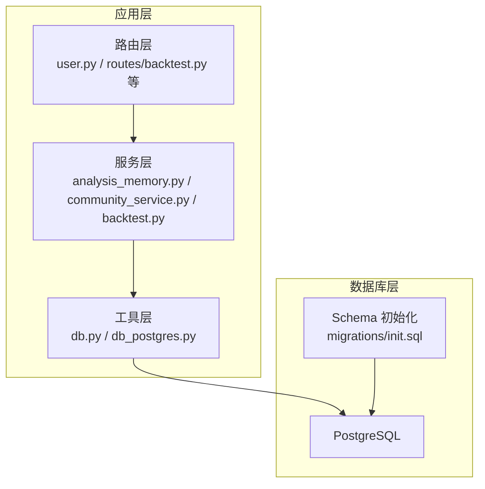
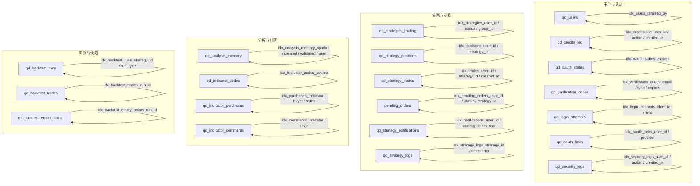
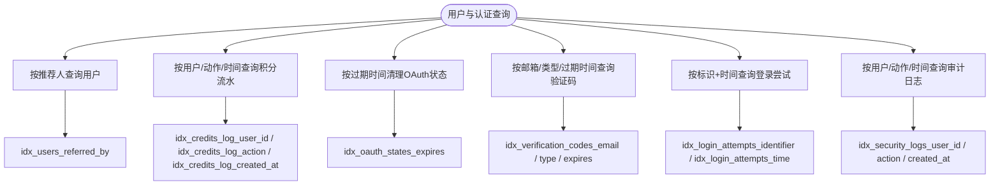
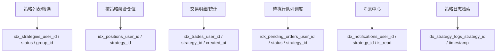
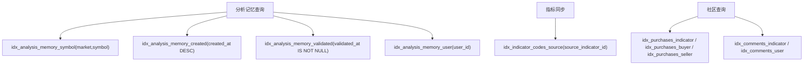
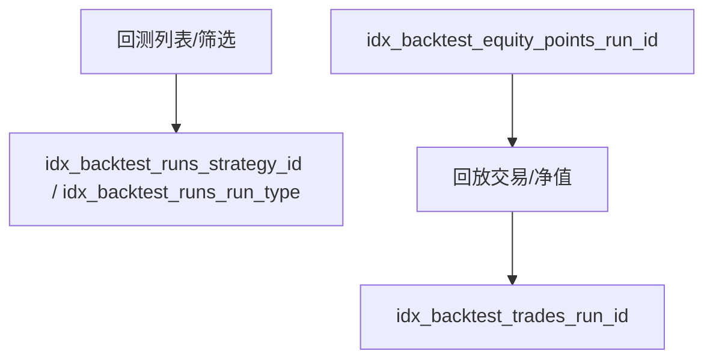
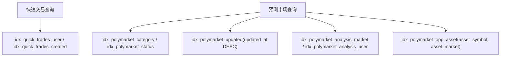
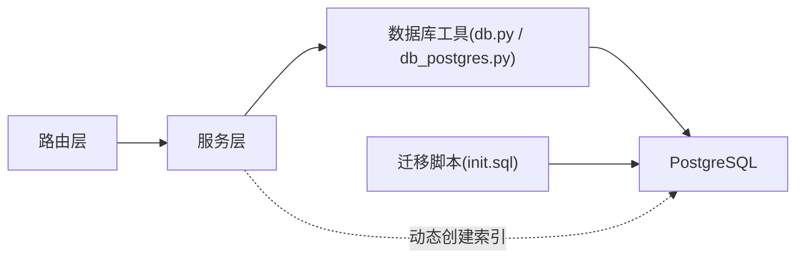

# 索引优化策略

<cite>
**本文引用的文件**
- [init.sql](file://backend_api_python/migrations/init.sql)
- [db.py](file://backend_api_python/app/utils/db.py)
- [db_postgres.py](file://backend_api_python/app/utils/db_postgres.py)
- [analysis_memory.py](file://backend_api_python/app/services/analysis_memory.py)
- [community_service.py](file://backend_api_python/app/services/community_service.py)
- [backtest.py](file://backend_api_python/app/services/backtest.py)
- [oauth_service.py](file://backend_api_python/app/services/oauth_service.py)
- [usdt_payment_service.py](file://backend_api_python/app/services/usdt_payment_service.py)
- [user.py](file://backend_api_python/app/routes/user.py)
- [routes/backtest.py](file://backend_api_python/app/routes/backtest.py)
- [routes/credentials.py](file://backend_api_python/app/routes/credentials.py)
- [routes/dashboard.py](file://backend_api_python/app/routes/dashboard.py)
</cite>

## 目录
1. [简介](#简介)
2. [项目结构](#项目结构)
3. [核心组件](#核心组件)
4. [架构总览](#架构总览)
5. [详细组件分析](#详细组件分析)
6. [依赖关系分析](#依赖关系分析)
7. [性能考量](#性能考量)
8. [故障排查指南](#故障排查指南)
9. [结论](#结论)
10. [附录](#附录)

## 简介
本文件面向QuantDinger数据库索引优化，系统性阐述索引类型选择原则、高频查询模式与对应索引设计方案、复合索引设计与最左前缀规则、索引维护与统计信息更新、索引性能测试与查询计划分析、写入性能影响与平衡策略，以及分区表与全局索引的适用场景。文档结合项目现有PostgreSQL迁移脚本与服务层实现，给出可操作的优化建议与最佳实践。

## 项目结构
QuantDinger采用PostgreSQL作为主存储，通过迁移脚本初始化核心业务表及索引；应用层通过统一的数据库工具模块进行连接池管理与SQL执行。关键索引分布在用户、策略、交易、回测、分析记忆、指标社区等模块，覆盖高频读写路径。

图示来源
- [db.py:1-65](file://backend_api_python/app/utils/db.py#L1-L65)
- [db_postgres.py:1-120](file://backend_api_python/app/utils/db_postgres.py#L1-L120)
- [init.sql:1-120](file://backend_api_python/migrations/init.sql#L1-L120)

章节来源
- [db.py:1-65](file://backend_api_python/app/utils/db.py#L1-L65)
- [db_postgres.py:1-120](file://backend_api_python/app/utils/db_postgres.py#L1-L120)
- [init.sql:1-120](file://backend_api_python/migrations/init.sql#L1-L120)

## 核心组件
- 数据库连接与池化：提供统一的PostgreSQL连接接口与连接池配置，支持多用户并发访问。
- 迁移与初始化：通过迁移脚本创建核心业务表并建立基础索引，确保启动即具备可用索引。
- 服务层查询：围绕用户、策略、交易、回测、分析记忆、指标社区等模块编写SQL查询，形成高频查询模式。
- 索引现状：涵盖B-tree索引、唯一索引、部分索引（条件过滤）等，满足不同查询特征。

章节来源
- [db.py:1-65](file://backend_api_python/app/utils/db.py#L1-L65)
- [db_postgres.py:1-120](file://backend_api_python/app/utils/db_postgres.py#L1-L120)
- [init.sql:1-120](file://backend_api_python/migrations/init.sql#L1-L120)

## 架构总览
下图展示应用层服务与数据库索引的关系，突出高频查询路径与对应索引位置。

图示来源
- [init.sql:32-190](file://backend_api_python/migrations/init.sql#L32-L190)
- [init.sql:221-380](file://backend_api_python/migrations/init.sql#L221-L380)
- [init.sql:419-422](file://backend_api_python/migrations/init.sql#L419-L422)
- [init.sql:805-808](file://backend_api_python/migrations/init.sql#L805-L808)
- [init.sql:860-874](file://backend_api_python/migrations/init.sql#L860-L874)
- [init.sql:875-890](file://backend_api_python/migrations/init.sql#L875-L890)
- [init.sql:464-526](file://backend_api_python/migrations/init.sql#L464-L526)
- [init.sql:930-956](file://backend_api_python/migrations/init.sql#L930-L956)
- [init.sql:960-1018](file://backend_api_python/migrations/init.sql#L960-L1018)

## 详细组件分析

### 用户与认证相关索引
- 用户邀请链路：对推荐人字段建立索引，便于按邀请关系查询。
- 积分流水：按用户、动作、创建时间建立索引，支撑积分明细与报表。
- OAuth状态与验证码：按过期时间建立索引，便于清理与失效校验。
- 登录尝试与安全审计：按标识组合与时间建立索引，支撑风控与审计查询。

图示来源
- [init.sql:32-190](file://backend_api_python/migrations/init.sql#L32-L190)

章节来源
- [init.sql:32-190](file://backend_api_python/migrations/init.sql#L32-L190)

### 策略与交易相关索引
- 策略：按用户、状态、分组ID建立索引，支撑策略列表与筛选。
- 仓位：按用户与策略ID建立索引，支撑按策略聚合。
- 交易：按用户、策略、时间建立索引，支撑交易明细与统计。
- 待执行队列：按用户、状态、策略ID建立索引，支撑调度与监控。
- 通知：按用户、策略、已读状态建立索引，支撑消息中心。
- 策略日志：按策略与时间建立索引，支撑日志检索。

图示来源
- [init.sql:221-380](file://backend_api_python/migrations/init.sql#L221-L380)

章节来源
- [init.sql:221-380](file://backend_api_python/migrations/init.sql#L221-L380)

### 分析记忆与指标社区索引
- 分析记忆：按市场+符号、创建时间倒序、已验证过滤、用户ID建立索引，支撑历史检索、验证与用户维度查询。
- 指标代码：按来源ID建立索引，支撑购买后本地副本与原版同步。
- 指标购买与评论：按指标、买家、卖家、用户建立索引，支撑社区生态查询。

图示来源
- [init.sql:805-808](file://backend_api_python/migrations/init.sql#L805-L808)
- [init.sql:419-422](file://backend_api_python/migrations/init.sql#L419-L422)
- [init.sql:860-890](file://backend_api_python/migrations/init.sql#L860-L890)

章节来源
- [init.sql:805-808](file://backend_api_python/migrations/init.sql#L805-L808)
- [init.sql:419-422](file://backend_api_python/migrations/init.sql#L419-L422)
- [init.sql:860-890](file://backend_api_python/migrations/init.sql#L860-L890)

### 回测与快照索引
- 回测运行：按策略ID与运行类型建立索引，支撑回测列表与筛选。
- 回测交易与净值点：按运行ID建立索引，支撑回放与可视化。

图示来源
- [init.sql:464-526](file://backend_api_python/migrations/init.sql#L464-L526)

章节来源
- [init.sql:464-526](file://backend_api_python/migrations/init.sql#L464-L526)
- [backtest.py:88-141](file://backend_api_python/app/services/backtest.py#L88-L141)

### 快速交易与预测市场索引
- 快速交易：按用户与创建时间建立索引，支撑交易面板查询。
- 预测市场：按分类、状态、更新时间建立索引，支撑AI分析与机会表查询。

图示来源
- [init.sql:930-956](file://backend_api_python/migrations/init.sql#L930-L956)
- [init.sql:960-1018](file://backend_api_python/migrations/init.sql#L960-L1018)

章节来源
- [init.sql:930-956](file://backend_api_python/migrations/init.sql#L930-L956)
- [init.sql:960-1018](file://backend_api_python/migrations/init.sql#L960-L1018)

## 依赖关系分析
- 应用层通过统一数据库工具模块获取连接与执行SQL，迁移脚本在容器启动时自动创建表与索引。
- 服务层在运行时根据需要动态创建索引（如分析记忆、回测、OAuth状态等），确保查询性能。
- 查询路由层（如用户、回测、凭证、仪表盘）直接使用SQL查询，索引直接影响查询效率。

图示来源
- [db.py:1-65](file://backend_api_python/app/utils/db.py#L1-L65)
- [db_postgres.py:1-120](file://backend_api_python/app/utils/db_postgres.py#L1-L120)
- [init.sql:1-120](file://backend_api_python/migrations/init.sql#L1-L120)
- [analysis_memory.py:154-167](file://backend_api_python/app/services/analysis_memory.py#L154-L167)
- [backtest.py:88-141](file://backend_api_python/app/services/backtest.py#L88-L141)
- [oauth_service.py:42-68](file://backend_api_python/app/services/oauth_service.py#L42-L68)
- [usdt_payment_service.py:53-82](file://backend_api_python/app/services/usdt_payment_service.py#L53-L82)

章节来源
- [db.py:1-65](file://backend_api_python/app/utils/db.py#L1-L65)
- [db_postgres.py:1-120](file://backend_api_python/app/utils/db_postgres.py#L1-L120)
- [init.sql:1-120](file://backend_api_python/migrations/init.sql#L1-L120)
- [analysis_memory.py:154-167](file://backend_api_python/app/services/analysis_memory.py#L154-L167)
- [backtest.py:88-141](file://backend_api_python/app/services/backtest.py#L88-L141)
- [oauth_service.py:42-68](file://backend_api_python/app/services/oauth_service.py#L42-L68)
- [usdt_payment_service.py:53-82](file://backend_api_python/app/services/usdt_payment_service.py#L53-L82)

## 性能考量
- 写入开销：索引越多，INSERT/UPDATE/DELETE的写入成本越高。需权衡读多写少与读写均衡场景。
- 统计信息：定期更新PG统计信息有助于查询优化器选择最优执行计划。
- 并发与锁：大量索引可能增加锁竞争，需结合业务高峰时段进行维护窗口规划。
- 复合索引选择：优先覆盖最常见查询谓词，遵循最左前缀规则；对选择性高的列优先。
- 部分索引：对高基数且过滤性强的条件使用条件索引，降低存储与维护成本。
- 分区表：对超大表（如回测交易、净值点、分析记忆）可考虑按时间分区，配合全局索引提升查询效率。

## 故障排查指南
- 索引缺失导致慢查询：通过EXPLAIN/EXPLAIN ANALYZE分析查询计划，确认缺少必要索引。
- 动态索引创建失败：检查服务层动态创建索引逻辑与权限，确保幂等性与异常处理。
- 连接池问题：关注连接池配置与健康检查，避免“空闲事务”与“锁不可用”问题。
- 数据一致性：索引变更需配合迁移脚本与服务层升级，确保全量部署一致。

章节来源
- [db_postgres.py:466-494](file://backend_api_python/app/utils/db_postgres.py#L466-L494)
- [analysis_memory.py:154-167](file://backend_api_python/app/services/analysis_memory.py#L154-L167)
- [backtest.py:88-141](file://backend_api_python/app/services/backtest.py#L88-L141)
- [oauth_service.py:42-68](file://backend_api_python/app/services/oauth_service.py#L42-L68)
- [usdt_payment_service.py:53-82](file://backend_api_python/app/services/usdt_payment_service.py#L53-L82)

## 结论
QuantDinger已在关键业务表上建立了基础索引，覆盖用户、策略、交易、回测、分析记忆与社区等高频查询路径。建议在现有基础上进一步完善复合索引设计、引入部分索引与条件过滤、优化统计信息更新策略，并针对超大表探索分区表与全局索引方案，以实现读写性能与维护成本的平衡。

## 附录

### 索引类型与选择原则
- B-tree索引：适用于等值、范围、排序查询，广泛用于主键、外键与常用过滤列。
- 唯一索引：保证业务唯一性约束，如用户邮箱、OAuth状态主键、USDT订单地址组合唯一。
- 部分索引：对高选择性且过滤强的条件建立条件索引，降低存储与维护成本。
- 函数索引：对表达式或函数结果建立索引，提升复杂过滤与计算查询性能（需结合实际查询模式评估）。

章节来源
- [init.sql:95-98](file://backend_api_python/migrations/init.sql#L95-L98)
- [init.sql:129-133](file://backend_api_python/migrations/init.sql#L129-L133)
- [init.sql:147-149](file://backend_api_python/migrations/init.sql#L147-L149)
- [init.sql:186-189](file://backend_api_python/migrations/init.sql#L186-L189)
- [init.sql:221-225](file://backend_api_python/migrations/init.sql#L221-L225)
- [init.sql:278-281](file://backend_api_python/migrations/init.sql#L278-L281)
- [init.sql:300-304](file://backend_api_python/migrations/init.sql#L300-L304)
- [init.sql:339-343](file://backend_api_python/migrations/init.sql#L339-L343)
- [init.sql:347-365](file://backend_api_python/migrations/init.sql#L347-L365)
- [init.sql:370-380](file://backend_api_python/migrations/init.sql#L370-L380)
- [init.sql:419-422](file://backend_api_python/migrations/init.sql#L419-L422)
- [init.sql:805-808](file://backend_api_python/migrations/init.sql#L805-L808)
- [init.sql:860-874](file://backend_api_python/migrations/init.sql#L860-L874)
- [init.sql:875-890](file://backend_api_python/migrations/init.sql#L875-L890)
- [init.sql:930-956](file://backend_api_python/migrations/init.sql#L930-L956)
- [init.sql:960-1018](file://backend_api_python/migrations/init.sql#L960-L1018)

### 复合索引设计与最左前缀规则
- 设计原则：将最常用于过滤的列放在前面，其次为排序与连接列；遵循最左前缀，确保查询谓词能命中索引前缀。
- 示例：用户+状态+分组ID的复合索引可覆盖策略列表与筛选；市场+符号+创建时间倒序可覆盖分析记忆检索。

章节来源
- [init.sql:221-225](file://backend_api_python/migrations/init.sql#L221-L225)
- [init.sql:805-808](file://backend_api_python/migrations/init.sql#L805-L808)

### 索引维护策略与统计信息更新
- 定期维护：重建或重组织索引，降低碎片化；更新统计信息，确保查询优化器准确估计成本。
- 动态索引：服务层在首次使用时创建索引，确保幂等性与异常处理，避免重复创建。
- 迁移脚本：容器启动时自动执行，确保新部署具备完整索引集。

章节来源
- [analysis_memory.py:154-167](file://backend_api_python/app/services/analysis_memory.py#L154-L167)
- [backtest.py:88-141](file://backend_api_python/app/services/backtest.py#L88-L141)
- [oauth_service.py:42-68](file://backend_api_python/app/services/oauth_service.py#L42-L68)
- [usdt_payment_service.py:53-82](file://backend_api_python/app/services/usdt_payment_service.py#L53-L82)
- [init.sql:1-120](file://backend_api_python/migrations/init.sql#L1-L120)

### 索引性能测试与查询计划分析
- 测试方法：使用EXPLAIN/EXPLAIN ANALYZE对比索引前后执行计划与耗时；构造真实业务负载进行压测。
- 关注点：索引选择性、扫描行数、排序与连接成本、是否发生顺序扫描或全表扫描。
- 优化技巧：合理拆分复合索引、避免冗余索引、利用部分索引与条件过滤。

章节来源
- [user.py:1146-1167](file://backend_api_python/app/routes/user.py#L1146-L1167)
- [user.py:1515-1552](file://backend_api_python/app/routes/user.py#L1515-L1552)
- [routes/backtest.py:700-710](file://backend_api_python/app/routes/backtest.py#L700-L710)
- [routes/credentials.py:60-70](file://backend_api_python/app/routes/credentials.py#L60-L70)
- [routes/dashboard.py:360-370](file://backend_api_python/app/routes/dashboard.py#L360-L370)
- [routes/dashboard.py:420-430](file://backend_api_python/app/routes/dashboard.py#L420-L430)

### 写入性能影响与平衡策略
- 影响因素：索引数量与类型、写入模式（批量/单条）、并发度、统计信息更新频率。
- 平衡策略：热点表适度降维索引、冷数据归档、异步统计信息更新、维护窗口规划。

章节来源
- [db_postgres.py:1-120](file://backend_api_python/app/utils/db_postgres.py#L1-L120)

### 分区表与全局索引
- 分区表：对超大表（如回测交易、净值点、分析记忆）按时间分区，提升查询与维护效率。
- 全局索引：在分区表上建立全局索引，保持跨分区查询能力；注意维护成本与写入开销。

章节来源
- [init.sql:464-526](file://backend_api_python/migrations/init.sql#L464-L526)
- [init.sql:930-956](file://backend_api_python/migrations/init.sql#L930-L956)
- [init.sql:960-1018](file://backend_api_python/migrations/init.sql#L960-L1018)