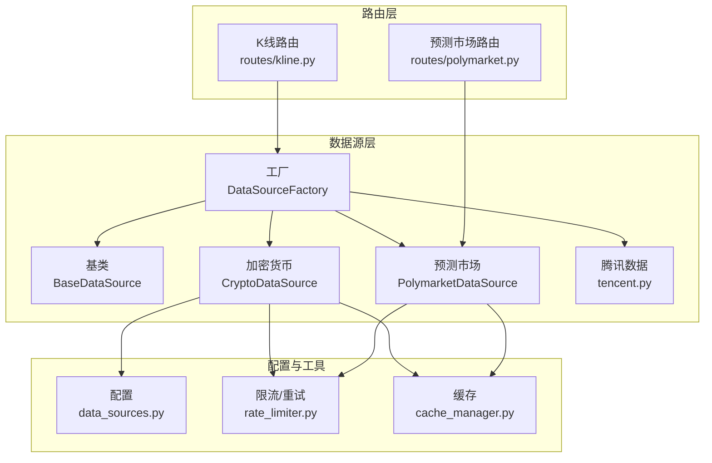
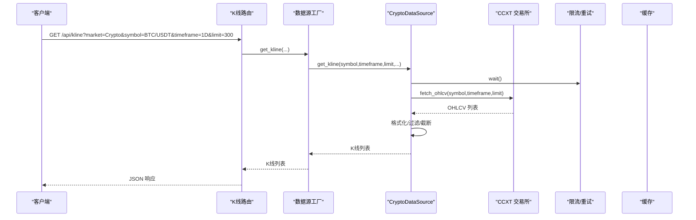
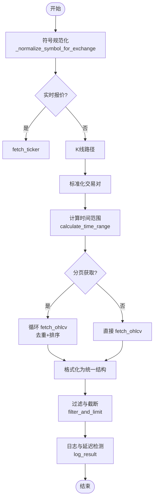
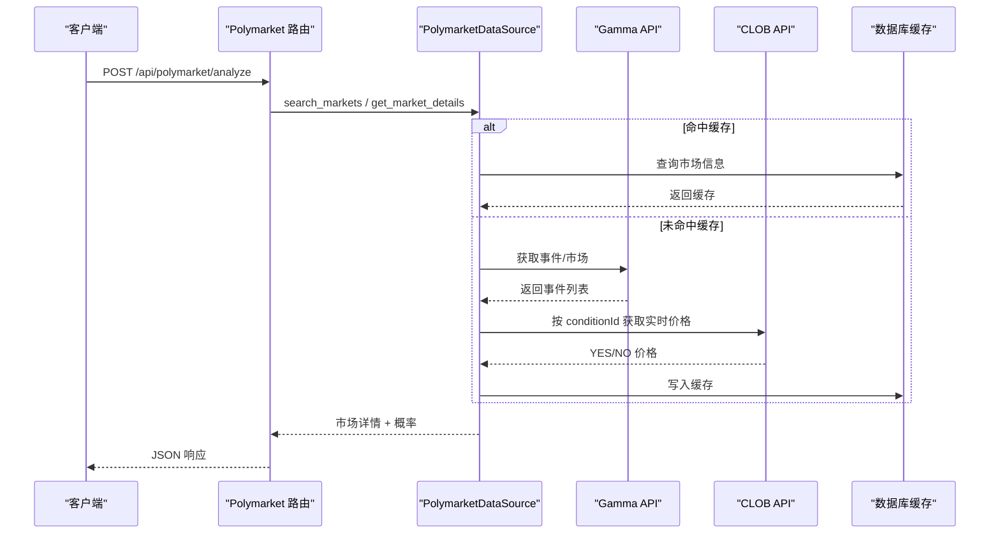
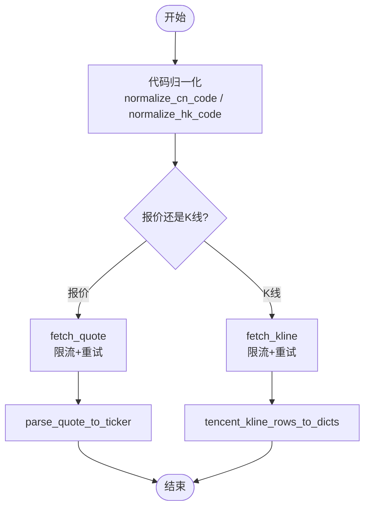
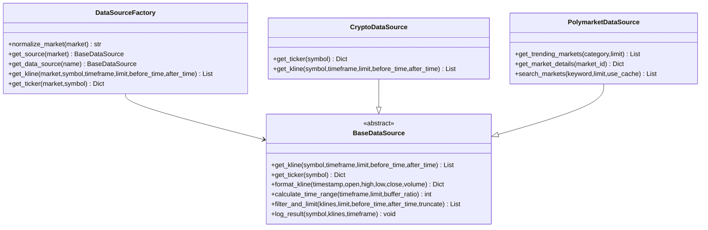
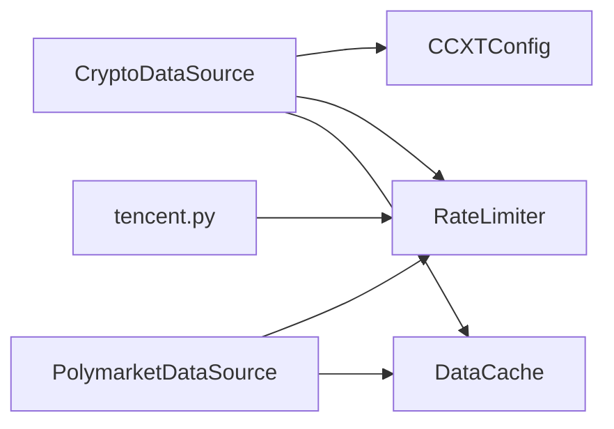

# 加密货币数据源

<cite>
**本文引用的文件**
- [crypto.py](file://backend_api_python/app/data_sources/crypto.py)
- [polymarket.py](file://backend_api_python/app/data_sources/polymarket.py)
- [tencent.py](file://backend_api_python/app/data_sources/tencent.py)
- [base.py](file://backend_api_python/app/data_sources/base.py)
- [factory.py](file://backend_api_python/app/data_sources/factory.py)
- [data_sources.py](file://backend_api_python/app/config/data_sources.py)
- [cache_manager.py](file://backend_api_python/app/data_sources/cache_manager.py)
- [rate_limiter.py](file://backend_api_python/app/data_sources/rate_limiter.py)
- [kline.py](file://backend_api_python/app/routes/kline.py)
- [polymarket.py](file://backend_api_python/app/routes/polymarket.py)
- [env.example](file://backend_api_python/env.example)
</cite>

## 目录
1. [简介](#简介)
2. [项目结构](#项目结构)
3. [核心组件](#核心组件)
4. [架构总览](#架构总览)
5. [详细组件分析](#详细组件分析)
6. [依赖关系分析](#依赖关系分析)
7. [性能考量](#性能考量)
8. [故障排查指南](#故障排查指南)
9. [结论](#结论)
10. [附录](#附录)

## 简介
本文件面向加密货币数据源的实现与使用，重点涵盖以下方面：
- CryptoDataSource 对多家加密货币交易所的支持（Binance、OKX、Bybit、Bitget、KuCoin、Gate.io、MEXC、Kraken、Coinbase 等）。
- K 线数据获取机制、实时价格获取与交易量数据处理。
- PolyMarket 预测市场数据源的集成，包括概率数据获取与事件结果追踪。
- 腾讯新闻数据源的使用场景与数据格式。
- 加密货币市场的特殊考虑（24/7 交易、高波动性、流动性管理）。
- 具体的 API 调用示例与错误处理策略。

## 项目结构
数据源层采用“抽象基类 + 工厂 + 配置 + 限流/缓存”的分层设计，统一对外提供 K 线与实时报价接口，并通过路由层暴露 HTTP API。

**图表来源**
- [factory.py:27-102](file://backend_api_python/app/data_sources/factory.py#L27-L102)
- [base.py:27-179](file://backend_api_python/app/data_sources/base.py#L27-L179)
- [crypto.py:16-53](file://backend_api_python/app/data_sources/crypto.py#L16-L53)
- [polymarket.py:17-34](file://backend_api_python/app/data_sources/polymarket.py#L17-L34)
- [tencent.py:24-239](file://backend_api_python/app/data_sources/tencent.py#L24-L239)
- [data_sources.py:101-150](file://backend_api_python/app/config/data_sources.py#L101-L150)
- [rate_limiter.py:109-273](file://backend_api_python/app/data_sources/rate_limiter.py#L109-L273)
- [cache_manager.py:44-233](file://backend_api_python/app/data_sources/cache_manager.py#L44-L233)
- [kline.py:17-124](file://backend_api_python/app/routes/kline.py#L17-L124)
- [polymarket.py:22-329](file://backend_api_python/app/routes/polymarket.py#L22-L329)

**章节来源**
- [factory.py:27-102](file://backend_api_python/app/data_sources/factory.py#L27-L102)
- [base.py:27-179](file://backend_api_python/app/data_sources/base.py#L27-L179)
- [data_sources.py:101-150](file://backend_api_python/app/config/data_sources.py#L101-L150)
- [rate_limiter.py:109-273](file://backend_api_python/app/data_sources/rate_limiter.py#L109-L273)
- [cache_manager.py:44-233](file://backend_api_python/app/data_sources/cache_manager.py#L44-L233)
- [kline.py:17-124](file://backend_api_python/app/routes/kline.py#L17-L124)
- [polymarket.py:22-329](file://backend_api_python/app/routes/polymarket.py#L22-L329)

## 核心组件
- 数据源基类 BaseDataSource：定义统一接口（K 线、实时报价）、时间窗计算、过滤截断、日志延迟检测等。
- CryptoDataSource：基于 CCXT 的加密货币数据源，支持多交易所动态切换、符号规范化、OHLCV 分页拉取、备用获取路径。
- PolymarketDataSource：聚合 Gamma/Data/CLOB 三个公开端点，解析事件与市场、提取概率与流动性、支持搜索与缓存。
- 腾讯数据源：提供 A/HK 股票报价与 K 线，使用限流与重试策略，兼容 GBK 编码。
- 工厂 DataSourceFactory：按市场类型返回对应数据源实例，提供便捷的 K 线与报价获取方法。
- 配置 CCXTConfig：集中管理默认交易所、超时、时间周期映射、代理等。
- 限流与重试：随机抖动、指数退避、UA 轮换、请求频率控制。
- 缓存：TTL + LRU，按类型分区管理。

**章节来源**
- [base.py:27-179](file://backend_api_python/app/data_sources/base.py#L27-L179)
- [crypto.py:16-53](file://backend_api_python/app/data_sources/crypto.py#L16-L53)
- [polymarket.py:17-34](file://backend_api_python/app/data_sources/polymarket.py#L17-L34)
- [tencent.py:24-239](file://backend_api_python/app/data_sources/tencent.py#L24-L239)
- [factory.py:27-102](file://backend_api_python/app/data_sources/factory.py#L27-L102)
- [data_sources.py:101-150](file://backend_api_python/app/config/data_sources.py#L101-L150)
- [rate_limiter.py:109-273](file://backend_api_python/app/data_sources/rate_limiter.py#L109-L273)
- [cache_manager.py:44-233](file://backend_api_python/app/data_sources/cache_manager.py#L44-L233)

## 架构总览
数据从路由层进入，经工厂选择具体数据源，再通过 CCXT 或第三方 API 获取数据，必要时应用限流/重试与缓存策略，最后统一格式返回。

**图表来源**
- [kline.py:17-84](file://backend_api_python/app/routes/kline.py#L17-L84)
- [factory.py:105-139](file://backend_api_python/app/data_sources/factory.py#L105-L139)
- [crypto.py:232-306](file://backend_api_python/app/data_sources/crypto.py#L232-L306)
- [rate_limiter.py:135-159](file://backend_api_python/app/data_sources/rate_limiter.py#L135-L159)

**章节来源**
- [kline.py:17-84](file://backend_api_python/app/routes/kline.py#L17-L84)
- [factory.py:105-139](file://backend_api_python/app/data_sources/factory.py#L105-L139)
- [crypto.py:232-306](file://backend_api_python/app/data_sources/crypto.py#L232-L306)
- [rate_limiter.py:135-159](file://backend_api_python/app/data_sources/rate_limiter.py#L135-L159)

## 详细组件分析

### CryptoDataSource 加密货币数据源
- 支持交易所动态加载：默认通过 CCXTConfig.DEFAULT_EXCHANGE 决定，若指定交易所不可用则回退至 coinbase。
- 符号规范化：支持多种输入格式（含 swap/futures 后缀、无分隔符、常见报价货币），并尝试在交易所 markets 中查找有效符号。
- 实时报价：fetch_ticker，包含错误关键字检测与替代符号尝试。
- K 线获取：统一时间周期映射，支持 before_time/after_time 窗口，内部实现分页拉取与去重排序，保证连续性与完整性。
- 备用获取路径：当直接 fetch_ohlcv 失败时，自动切换到基于 since 的备用方法。
- 结果日志：记录最新 K 线时间与阈值比较，输出延迟警告。

**图表来源**
- [crypto.py:176-306](file://backend_api_python/app/data_sources/crypto.py#L176-L306)
- [base.py:85-179](file://backend_api_python/app/data_sources/base.py#L85-L179)

**章节来源**
- [crypto.py:16-53](file://backend_api_python/app/data_sources/crypto.py#L16-L53)
- [crypto.py:176-306](file://backend_api_python/app/data_sources/crypto.py#L176-L306)
- [base.py:85-179](file://backend_api_python/app/data_sources/base.py#L85-L179)

### Polymarket 预测市场数据源
- 多端点聚合：Gamma API（事件/市场）、Data API（用户/活动）、CLOB API（订单簿/价格）。
- 热门市场与搜索：支持按类别筛选、关键词匹配、slug 直查、数据库缓存与新鲜度控制。
- 市场详情解析：从 CLOB 或事件/市场对象提取概率、流动性、交易量、结束时间、outcome_tokens 等。
- 数据库缓存：定期写入/读取，避免频繁调用外部 API。
- 历史数据占位：get_market_history 当前返回空列表，后续可扩展。

**图表来源**
- [polymarket.py:35-88](file://backend_api_python/app/data_sources/polymarket.py#L35-L88)
- [polymarket.py:89-158](file://backend_api_python/app/data_sources/polymarket.py#L89-L158)
- [polymarket.py:166-373](file://backend_api_python/app/data_sources/polymarket.py#L166-L373)
- [polymarket.py:22-228](file://backend_api_python/app/routes/polymarket.py#L22-L228)

**章节来源**
- [polymarket.py:17-34](file://backend_api_python/app/data_sources/polymarket.py#L17-L34)
- [polymarket.py:35-88](file://backend_api_python/app/data_sources/polymarket.py#L35-L88)
- [polymarket.py:89-158](file://backend_api_python/app/data_sources/polymarket.py#L89-L158)
- [polymarket.py:166-373](file://backend_api_python/app/data_sources/polymarket.py#L166-L373)
- [polymarket.py:22-228](file://backend_api_python/app/routes/polymarket.py#L22-L228)

### 腾讯新闻数据源
- 股票报价与 K 线：提供 A/HK 股票的实时报价与日线/周线 K 线，支持 GBK 编码处理。
- 代码归一化：A 股 SH/SZ、港股 HK00000 格式转换。
- 限流与重试：内置指数退避与 UA 轮换，降低被限流风险。
- 数据格式：报价返回统一字典，K 线转换为统一结构（时间、开盘、最高、最低、收盘、成交量）。

**图表来源**
- [tencent.py:24-106](file://backend_api_python/app/data_sources/tencent.py#L24-L106)
- [tencent.py:108-146](file://backend_api_python/app/data_sources/tencent.py#L108-L146)
- [tencent.py:194-239](file://backend_api_python/app/data_sources/tencent.py#L194-L239)

**章节来源**
- [tencent.py:24-106](file://backend_api_python/app/data_sources/tencent.py#L24-L106)
- [tencent.py:108-146](file://backend_api_python/app/data_sources/tencent.py#L108-L146)
- [tencent.py:194-239](file://backend_api_python/app/data_sources/tencent.py#L194-L239)

### 工厂与路由集成
- DataSourceFactory：按市场类型返回对应数据源，提供 get_kline 与 get_ticker 的便捷方法，内部统一排序与异常处理。
- 路由层：K 线路由与 Polymarket 路由分别对接工厂与数据源，返回统一 JSON 结构。

**图表来源**
- [factory.py:27-102](file://backend_api_python/app/data_sources/factory.py#L27-L102)
- [base.py:27-179](file://backend_api_python/app/data_sources/base.py#L27-L179)
- [crypto.py:16-53](file://backend_api_python/app/data_sources/crypto.py#L16-L53)
- [polymarket.py:17-34](file://backend_api_python/app/data_sources/polymarket.py#L17-L34)

**章节来源**
- [factory.py:27-102](file://backend_api_python/app/data_sources/factory.py#L27-L102)
- [base.py:27-179](file://backend_api_python/app/data_sources/base.py#L27-L179)

## 依赖关系分析
- CryptoDataSource 依赖 CCXTConfig（默认交易所、超时、时间周期映射、代理），并通过限流器与缓存管理器提升稳定性与性能。
- PolymarketDataSource 依赖数据库缓存与 HTTP 会话，结合指数退避与 UA 轮换应对第三方 API 的限流与变化。
- 腾讯数据源依赖限流器与重试装饰器，确保在不稳定网络环境下稳定获取数据。

**图表来源**
- [crypto.py:27-48](file://backend_api_python/app/data_sources/crypto.py#L27-L48)
- [data_sources.py:101-150](file://backend_api_python/app/config/data_sources.py#L101-L150)
- [rate_limiter.py:109-273](file://backend_api_python/app/data_sources/rate_limiter.py#L109-L273)
- [cache_manager.py:44-233](file://backend_api_python/app/data_sources/cache_manager.py#L44-L233)
- [tencent.py:73-90](file://backend_api_python/app/data_sources/tencent.py#L73-L90)

**章节来源**
- [crypto.py:27-48](file://backend_api_python/app/data_sources/crypto.py#L27-L48)
- [data_sources.py:101-150](file://backend_api_python/app/config/data_sources.py#L101-L150)
- [rate_limiter.py:109-273](file://backend_api_python/app/data_sources/rate_limiter.py#L109-L273)
- [cache_manager.py:44-233](file://backend_api_python/app/data_sources/cache_manager.py#L44-L233)
- [tencent.py:73-90](file://backend_api_python/app/data_sources/tencent.py#L73-L90)

## 性能考量
- 分页拉取与去重：K 线获取采用分页批量拉取并按时间戳去重，避免重复与空洞，提升连续性。
- 缓存策略：实时行情与 K 线分别设置 TTL 与 LRU 淘汰，减少重复请求。
- 限流与抖动：随机抖动与指数退避降低触发限流的概率，UA 轮换提升稳定性。
- 时间窗缓冲：计算时间范围时引入缓冲系数，避免边界误差导致的数据缺失。

**章节来源**
- [crypto.py:308-426](file://backend_api_python/app/data_sources/crypto.py#L308-L426)
- [cache_manager.py:44-233](file://backend_api_python/app/data_sources/cache_manager.py#L44-L233)
- [rate_limiter.py:170-231](file://backend_api_python/app/data_sources/rate_limiter.py#L170-L231)
- [base.py:85-104](file://backend_api_python/app/data_sources/base.py#L85-L104)

## 故障排查指南
- 交易所不可用回退：当默认交易所不可用时自动回退至 coinbase，确保服务可用性。
- 符号错误处理：实时报价与 K 线获取均包含错误关键字检测与替代符号尝试，失败时记录警告并返回默认值。
- Polymarket API 限流与错误：对 429/503 等状态码进行专门处理，建议降低请求频率或稍后重试。
- 腾讯数据编码问题：自动尝试 GBK 编码解码，避免乱码导致解析失败。
- 路由层错误：统一捕获异常并返回结构化 JSON，便于前端与监控系统定位问题。

**章节来源**
- [crypto.py:42-48](file://backend_api_python/app/data_sources/crypto.py#L42-L48)
- [crypto.py:200-230](file://backend_api_python/app/data_sources/crypto.py#L200-L230)
- [polymarket.py:521-541](file://backend_api_python/app/data_sources/polymarket.py#L521-L541)
- [tencent.py:86-91](file://backend_api_python/app/data_sources/tencent.py#L86-L91)
- [kline.py:77-84](file://backend_api_python/app/routes/kline.py#L77-L84)

## 结论
该数据源体系通过抽象基类统一接口、工厂模式灵活选择、配置中心集中管理、限流与缓存保障稳定性，实现了对多家加密货币交易所与第三方预测市场的高效接入。结合路由层的统一 API，能够满足策略回测与实盘交易对数据的高可靠需求。

## 附录

### API 调用示例（路径与参数）
- 获取 K 线
  - 路径：GET /api/kline
  - 参数：market（默认 USStock）、symbol（必填）、timeframe（默认 1D）、limit（默认 300）、before_time（可选）
  - 示例：/api/kline?market=Crypto&symbol=BTC/USDT&timeframe=1D&limit=300
  - 参考：[kline.py:17-84](file://backend_api_python/app/routes/kline.py#L17-L84)

- 获取最新价格
  - 路径：GET /api/kline/price
  - 参数：market（默认 USStock）、symbol（必填）
  - 示例：/api/kline/price?market=Crypto&symbol=BTC/USDT
  - 参考：[kline.py:87-124](file://backend_api_python/app/routes/kline.py#L87-L124)

- 分析 Polymarket 预测市场
  - 路径：POST /api/polymarket/analyze
  - 参数：input（Polymarket URL 或市场标题）、language（可选）
  - 示例：{"input":"https://polymarket.com/event/xxx","language":"zh-CN"}
  - 参考：[polymarket.py:22-228](file://backend_api_python/app/routes/polymarket.py#L22-L228)

### 环境变量与配置要点
- CCXT 相关
  - CCXT_DEFAULT_EXCHANGE：默认交易所（如 binance、coinbase 等）
  - CCXT_TIMEOUT：超时时间
  - PROXY_URL/HTTPS_PROXY：代理配置
  - 参考：[data_sources.py:101-150](file://backend_api_python/app/config/data_sources.py#L101-L150)、[env.example:223-224](file://backend_api_python/env.example#L223-L224)

- 数据源通用配置
  - DATA_SOURCE_TIMEOUT/DATA_SOURCE_RETRY/DATA_SOURCE_RETRY_BACKOFF：统一超时与重试策略
  - 参考：[data_sources.py:1-28](file://backend_api_python/app/config/data_sources.py#L1-L28)、[env.example:217-219](file://backend_api_python/env.example#L217-L219)

- Polymarket 缓存
  - cache_ttl：缓存 TTL（秒）
  - 参考：[polymarket.py](file://backend_api_python/app/data_sources/polymarket.py#L28)

- 腾讯数据限流
  - get_tencent_limiter：请求间隔与抖动配置
  - 参考：[rate_limiter.py:246-250](file://backend_api_python/app/data_sources/rate_limiter.py#L246-L250)