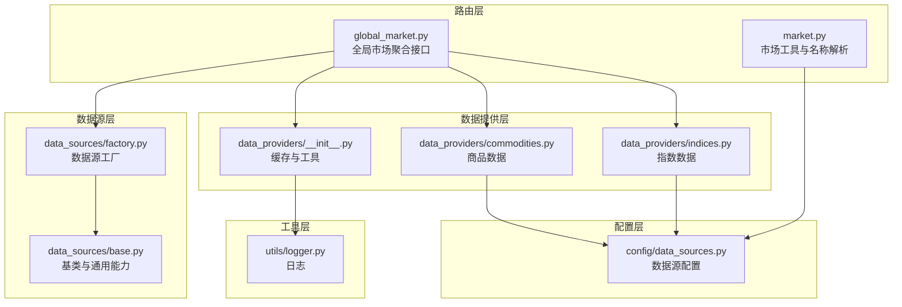
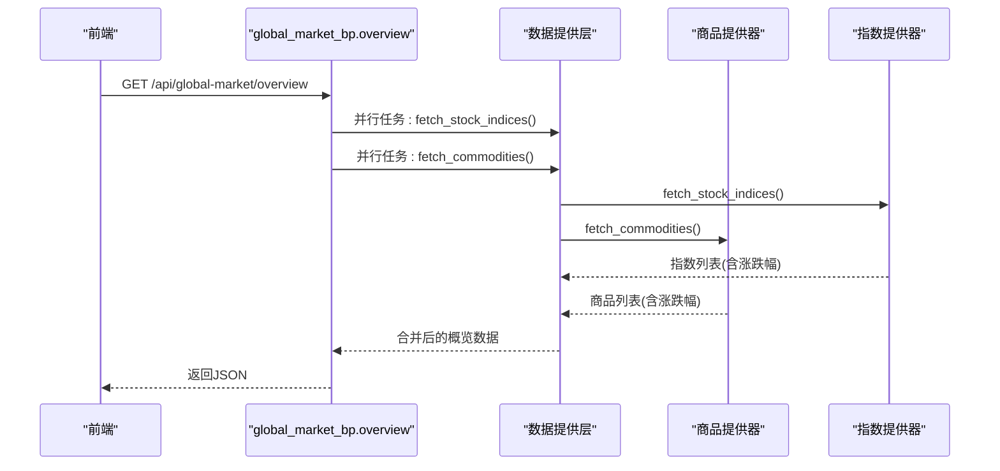
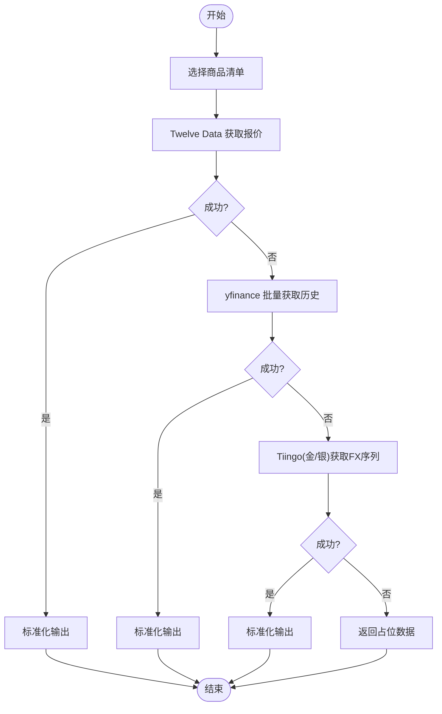
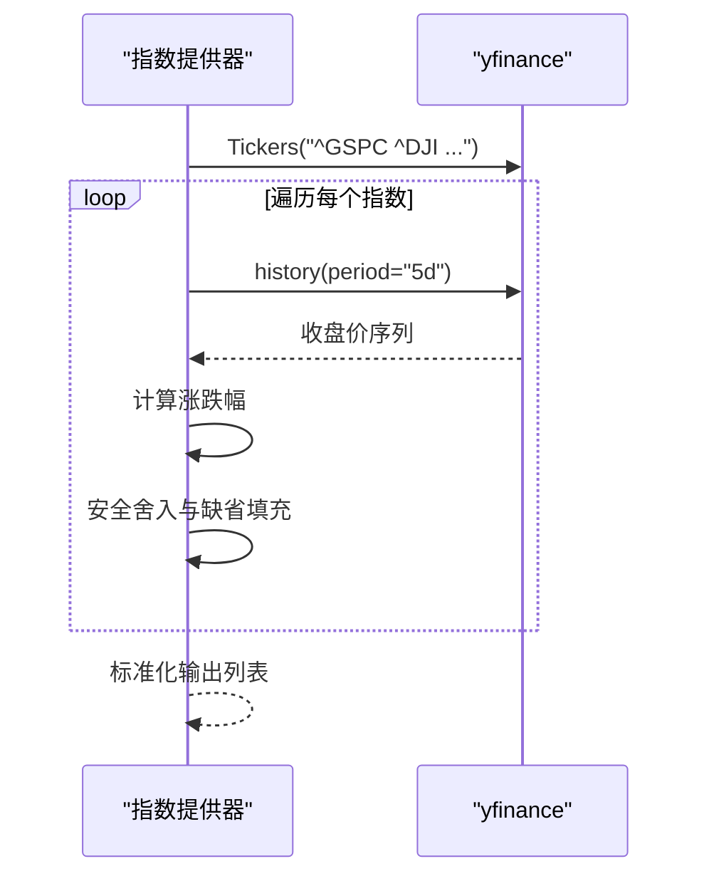
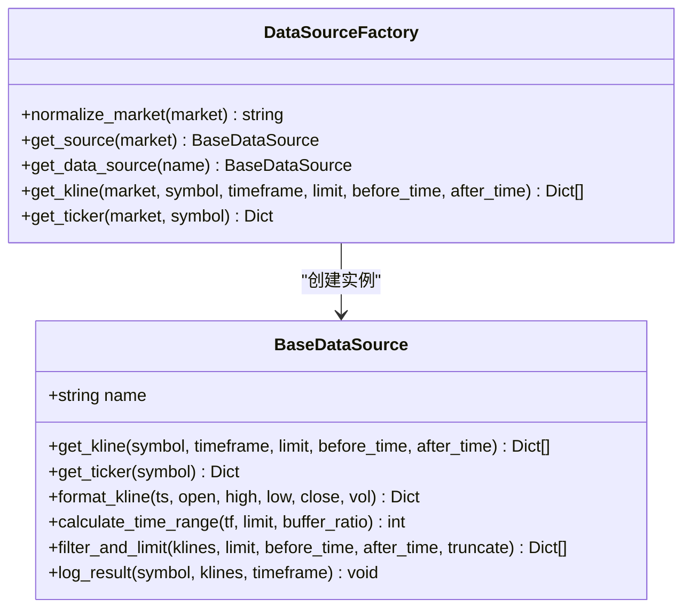
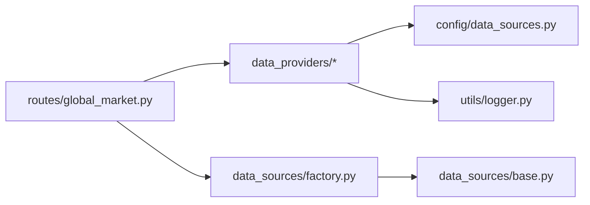

# 商品数据源

<cite>
**本文引用的文件**
- [commodities.py](file://backend_api_python/app/data_providers/commodities.py)
- [indices.py](file://backend_api_python/app/data_providers/indices.py)
- [base.py](file://backend_api_python/app/data_sources/base.py)
- [factory.py](file://backend_api_python/app/data_sources/factory.py)
- [data_sources.py](file://backend_api_python/app/config/data_sources.py)
- [global_market.py](file://backend_api_python/app/routes/global_market.py)
- [market.py](file://backend_api_python/app/routes/market.py)
- [__init__.py](file://backend_api_python/app/data_providers/__init__.py)
- [logger.py](file://backend_api_python/app/utils/logger.py)
</cite>

## 目录
1. [简介](#简介)
2. [项目结构](#项目结构)
3. [核心组件](#核心组件)
4. [架构总览](#架构总览)
5. [详细组件分析](#详细组件分析)
6. [依赖分析](#依赖分析)
7. [性能考量](#性能考量)
8. [故障排查指南](#故障排查指南)
9. [结论](#结论)
10. [附录](#附录)

## 简介
本文件聚焦于商品与指数两类“全局市场”数据源的实现与使用，系统性说明如下内容：
- 商品（Commodities）数据源对大宗商品市场的支持，涵盖能源、金属、农产品等类别，并解释其多数据源回退策略与标准化输出。
- 指数（Indices）数据源对全球主要股指的支持，包括标普500、纳指100、恒生指数等基准指数，以及其标准化输出与地理/区域标注。
- 商品市场的特殊考虑：合约月份轮换、交割机制与季节性因素在当前实现中的处理方式与局限。
- 指数计算方法与权重调整：当前实现采用简单历史收盘价序列计算涨跌幅，不涉及成分股权重调整或除权调整。
- 数据标准化、复权与收益计算：当前实现未进行复权调整与收益归因计算，仅提供基础价格与涨跌幅。
- 商品代码格式与指数基期设置：商品代码遵循各数据源标准，指数代码采用 yfinance 标准前缀；基期与权重调整不在本仓库范围内。

## 项目结构
与商品和指数数据源直接相关的模块组织如下：
- 数据提供层（data_providers）：封装具体数据抓取与标准化逻辑，统一缓存与错误处理。
- 数据源层（data_sources）：抽象统一接口，工厂负责按市场类型选择具体实现。
- 配置层（config）：集中管理数据源超时、重试、映射等配置。
- 路由层（routes）：对外暴露聚合接口，组合多数据源并缓存结果。
- 工具层（utils）：日志、缓存等基础设施。

**图表来源**
- [global_market.py:58-112](file://backend_api_python/app/routes/global_market.py#L58-L112)
- [market.py:513-634](file://backend_api_python/app/routes/market.py#L513-L634)
- [commodities.py:155-180](file://backend_api_python/app/data_providers/commodities.py#L155-L180)
- [indices.py:30-87](file://backend_api_python/app/data_providers/indices.py#L30-L87)
- [factory.py:105-139](file://backend_api_python/app/data_sources/factory.py#L105-L139)
- [base.py:27-179](file://backend_api_python/app/data_sources/base.py#L27-L179)
- [data_sources.py:26-98](file://backend_api_python/app/config/data_sources.py#L26-L98)
- [__init__.py:23-58](file://backend_api_python/app/data_providers/__init__.py#L23-L58)
- [logger.py:9-48](file://backend_api_python/app/utils/logger.py#L9-L48)

**章节来源**
- [global_market.py:58-112](file://backend_api_python/app/routes/global_market.py#L58-L112)
- [market.py:513-634](file://backend_api_python/app/routes/market.py#L513-L634)
- [commodities.py:155-180](file://backend_api_python/app/data_providers/commodities.py#L155-L180)
- [indices.py:30-87](file://backend_api_python/app/data_providers/indices.py#L30-L87)
- [factory.py:105-139](file://backend_api_python/app/data_sources/factory.py#L105-L139)
- [base.py:27-179](file://backend_api_python/app/data_sources/base.py#L27-L179)
- [data_sources.py:26-98](file://backend_api_python/app/config/data_sources.py#L26-L98)
- [__init__.py:23-58](file://backend_api_python/app/data_providers/__init__.py#L23-L58)
- [logger.py:9-48](file://backend_api_python/app/utils/logger.py#L9-L48)

## 核心组件
- 商品数据提供器（CommoditiesDataProvider）
  - 支持黄金、白银、原油（WTI/Brent）、铜、天然气等主流商品。
  - 多数据源回退策略：优先 Twelve Data，其次 yfinance，最后 Tiingo（金/银）。
  - 输出标准化字段：symbol、name（中英文）、price、change、unit、category。
- 指数数据提供器（IndicesDataProvider）
  - 支持标普500、道琼斯、纳斯达克、DAX、富时100、CAC40、日经225、KOSPI、ASX200、SENSEX。
  - 通过 yfinance 获取历史收盘价序列，计算涨跌幅。
  - 输出标准化字段：symbol、name（中英文）、price、change、region、flag、经纬度、category。
- 数据源工厂与基类
  - 工厂按市场类型返回对应数据源实例，支持 Crypto、Forex、Futures、USStock、CNStock、HKStock。
  - 基类提供 K 线格式化、时间范围计算、过滤截断、延迟检测等通用能力。
- 配置与缓存
  - 统一配置项：超时、重试次数、回退系数、yfinance 时间粒度映射、CCXT 代理等。
  - 提供缓存 TTL：商品、指数、宏观等键的缓存时长。

**章节来源**
- [commodities.py:13-20](file://backend_api_python/app/data_providers/commodities.py#L13-L20)
- [commodities.py:155-180](file://backend_api_python/app/data_providers/commodities.py#L155-L180)
- [indices.py:11-22](file://backend_api_python/app/data_providers/indices.py#L11-L22)
- [indices.py:30-87](file://backend_api_python/app/data_providers/indices.py#L30-L87)
- [factory.py:47-102](file://backend_api_python/app/data_sources/factory.py#L47-L102)
- [base.py:27-179](file://backend_api_python/app/data_sources/base.py#L27-L179)
- [data_sources.py:26-98](file://backend_api_python/app/config/data_sources.py#L26-L98)
- [__init__.py:23-58](file://backend_api_python/app/data_providers/__init__.py#L23-L58)

## 架构总览
全局市场聚合接口会并行拉取商品与指数数据，并将结果写入缓存。前端通过统一接口获取概览数据。

**图表来源**
- [global_market.py:58-112](file://backend_api_python/app/routes/global_market.py#L58-L112)
- [indices.py:30-87](file://backend_api_python/app/data_providers/indices.py#L30-L87)
- [commodities.py:155-180](file://backend_api_python/app/data_providers/commodities.py#L155-L180)

**章节来源**
- [global_market.py:58-112](file://backend_api_python/app/routes/global_market.py#L58-L112)

## 详细组件分析

### 商品数据源（CommoditiesDataProvider）
- 支持商品清单与单位
  - 黄金、白银、原油（WTI/Brent）、铜、天然气等。
  - 单位分别为每盎司、每盎司、每桶、每磅、每千立方英尺等。
- 数据源优先级与回退
  - 十二数据（Twelve Data）：获取实时报价与前收，计算涨跌幅。
  - yfinance（回退）：批量获取多个商品的历史序列，计算涨跌幅。
  - Tiingo（金/银专用回退）：通过外汇接口获取金/银美元计价价格序列。
- 标准化输出
  - 字段：symbol（如 yfinance 合约）、name_cn/en、price、change、unit、category。
- 错误处理与占位
  - 任一层失败均记录日志并尝试下一层；若全部失败，返回占位数据（price/change=0）。

**图表来源**
- [commodities.py:23-58](file://backend_api_python/app/data_providers/commodities.py#L23-L58)
- [commodities.py:61-105](file://backend_api_python/app/data_providers/commodities.py#L61-L105)
- [commodities.py:108-152](file://backend_api_python/app/data_providers/commodities.py#L108-L152)
- [commodities.py:155-180](file://backend_api_python/app/data_providers/commodities.py#L155-L180)

**章节来源**
- [commodities.py:13-20](file://backend_api_python/app/data_providers/commodities.py#L13-L20)
- [commodities.py:23-58](file://backend_api_python/app/data_providers/commodities.py#L23-L58)
- [commodities.py:61-105](file://backend_api_python/app/data_providers/commodities.py#L61-L105)
- [commodities.py:108-152](file://backend_api_python/app/data_providers/commodities.py#L108-L152)
- [commodities.py:155-180](file://backend_api_python/app/data_providers/commodities.py#L155-L180)

### 指数数据源（IndicesDataProvider）
- 支持指数清单与地理标注
  - 包括 ^GSPC、^DJI、^IXIC、^GDAXI、^FTSE、^FCHI、^N225、^KS11、^AXJO、^BSESN。
  - 每个指数包含 region、emoji flag、经纬度等地理信息。
- 数据获取与计算
  - 通过 yfinance 获取最近若干日的历史序列，取最新与前一日收盘价计算涨跌幅。
  - 对缺失或异常值进行安全处理（NaN/Inf 安全舍入）。
- 标准化输出
  - 字段：symbol、name_cn/en、price、change、region、flag、lat/lng、category。

**图表来源**
- [indices.py:30-87](file://backend_api_python/app/data_providers/indices.py#L30-L87)

**章节来源**
- [indices.py:11-22](file://backend_api_python/app/data_providers/indices.py#L11-L22)
- [indices.py:30-87](file://backend_api_python/app/data_providers/indices.py#L30-L87)

### 数据源工厂与基类（BaseDataSource）
- 工厂职责
  - 归一化市场枚举（如 "usstock" → "USStock"），按需创建对应数据源实例。
  - 提供便捷方法：get_kline、get_ticker。
- 基类能力
  - 统一 K 线格式化（四舍五入精度控制）。
  - 时间范围计算与数据过滤（按 before/after 截断）。
  - 延迟检测：基于 UTC 时间比较，区分分钟/小时、日线、周线的阈值。

**图表来源**
- [base.py:27-179](file://backend_api_python/app/data_sources/base.py#L27-L179)
- [factory.py:47-102](file://backend_api_python/app/data_sources/factory.py#L47-L102)
- [factory.py:105-139](file://backend_api_python/app/data_sources/factory.py#L105-L139)

**章节来源**
- [factory.py:47-102](file://backend_api_python/app/data_sources/factory.py#L47-L102)
- [factory.py:105-139](file://backend_api_python/app/data_sources/factory.py#L105-L139)
- [base.py:27-179](file://backend_api_python/app/data_sources/base.py#L27-L179)

### 配置与缓存
- 配置项
  - 数据源通用超时、重试次数、回退系数。
  - yfinance 时间粒度映射（1m→1m、1D→1d 等）。
  - CCXT 默认交易所、超时、代理等。
- 缓存策略
  - 统一缓存键前缀 dp:，不同数据域设置不同 TTL。
  - 全局概览接口对 indices、forex、crypto、commodities 设置短 TTL，提升新鲜度。

**章节来源**
- [data_sources.py:26-98](file://backend_api_python/app/config/data_sources.py#L26-L98)
- [__init__.py:23-58](file://backend_api_python/app/data_providers/__init__.py#L23-L58)
- [global_market.py:63-108](file://backend_api_python/app/routes/global_market.py#L63-L108)

## 依赖分析
- 路由层依赖数据提供层与工厂层，实现并行抓取与缓存。
- 数据提供层依赖配置层（API Key、超时、映射）与日志工具。
- 工厂层依赖具体数据源实现，当前未包含 Futures 数据源类文件，因此无法直接通过工厂获取商品数据源实例。

**图表来源**
- [global_market.py:58-112](file://backend_api_python/app/routes/global_market.py#L58-L112)
- [factory.py:81-102](file://backend_api_python/app/data_sources/factory.py#L81-L102)
- [data_sources.py:26-98](file://backend_api_python/app/config/data_sources.py#L26-L98)
- [logger.py:9-48](file://backend_api_python/app/utils/logger.py#L9-L48)

**章节来源**
- [global_market.py:58-112](file://backend_api_python/app/routes/global_market.py#L58-L112)
- [factory.py:81-102](file://backend_api_python/app/data_sources/factory.py#L81-L102)

## 性能考量
- 并行抓取：全局概览接口使用线程池并行获取指数与商品数据，缩短等待时间。
- 缓存命中：指数与商品概览设置短 TTL，兼顾时效性与性能。
- 延迟检测：基类对 K 线数据进行延迟检测，避免过期数据误导策略执行。
- 超时与重试：配置层提供可调的超时与重试参数，降低外部服务抖动影响。

**章节来源**
- [global_market.py:79-95](file://backend_api_python/app/routes/global_market.py#L79-L95)
- [base.py:141-179](file://backend_api_python/app/data_sources/base.py#L141-L179)
- [data_sources.py:8-23](file://backend_api_python/app/config/data_sources.py#L8-L23)

## 故障排查指南
- 日志级别与输出
  - 后台日志默认 INFO，可通过环境变量调整；路由层对特定子系统进行降噪。
- 常见问题定位
  - 商品/指数抓取失败：检查 API Key 是否配置、网络连通性、外部服务可用性。
  - 占位数据：当所有数据源均不可用时，系统返回 price/change=0 的占位数据。
  - 缺失涨跌幅：当历史序列不足或前收缺失时，可能返回 0 或跳过该条目。
- 缓存刷新
  - 通过全局刷新接口清空缓存，强制重新抓取。

**章节来源**
- [logger.py:9-48](file://backend_api_python/app/utils/logger.py#L9-L48)
- [commodities.py:173-180](file://backend_api_python/app/data_providers/commodities.py#L173-L180)
- [indices.py:69-82](file://backend_api_python/app/data_providers/indices.py#L69-L82)
- [global_market.py:306-315](file://backend_api_python/app/routes/global_market.py#L306-L315)

## 结论
- 商品与指数数据源通过统一的数据提供层实现标准化输出，具备多数据源回退与缓存能力。
- 当前实现未包含商品期货数据源类文件，因此无法通过工厂直接获取商品数据源实例；指数数据通过 yfinance 获取历史序列并计算涨跌幅。
- 商品市场的合约轮换、交割机制与季节性因素在当前实现中未体现；指数计算未进行成分权重调整与复权处理。
- 如需扩展商品期货数据源，可在工厂中注册对应实现，并在数据提供层补充相应映射与抓取逻辑。

## 附录

### 商品与指数数据标准化字段说明
- 商品（category=commodity）
  - 字段：symbol、name_cn、name_en、price、change、unit、category。
- 指数（category=index）
  - 字段：symbol、name_cn、name_en、price、change、region、flag、lat、lng、category。

**章节来源**
- [commodities.py:42-50](file://backend_api_python/app/data_providers/commodities.py#L42-L50)
- [indices.py:57-68](file://backend_api_python/app/data_providers/indices.py#L57-L68)

### 商品代码格式与指数基期设置
- 商品代码
  - 黄金/白银：TD 代码（GC/SI）与 yfinance 合约（GC=F/SI=F）并存；Tiingo 金/银使用 FX 代码。
- 指数代码
  - 采用 yfinance 标准前缀（如 ^GSPC、^DJI、^IXIC 等）。
- 基期与权重
  - 当前实现未设置基期与成分权重调整，指数涨跌幅基于历史收盘价序列计算。

**章节来源**
- [commodities.py:13-20](file://backend_api_python/app/data_providers/commodities.py#L13-L20)
- [indices.py:11-22](file://backend_api_python/app/data_providers/indices.py#L11-L22)