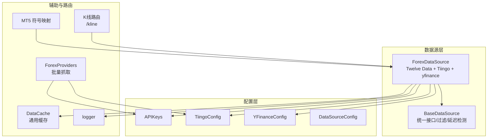
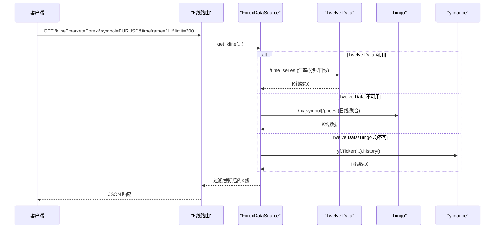
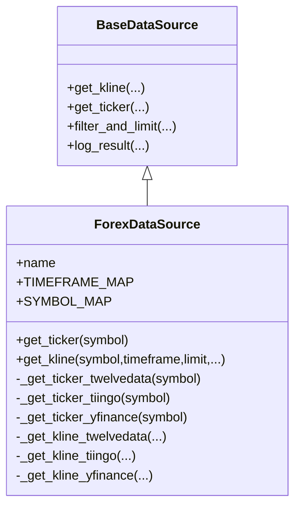
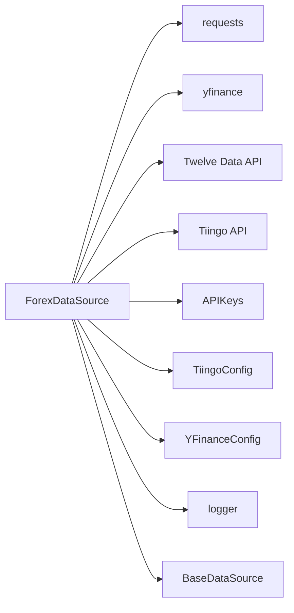

# 外汇数据源

<cite>
**本文引用的文件**
- [forex.py](file://backend_api_python/app/data_sources/forex.py)
- [base.py](file://backend_api_python/app/data_sources/base.py)
- [data_sources.py](file://backend_api_python/app/config/data_sources.py)
- [api_keys.py](file://backend_api_python/app/config/api_keys.py)
- [forex.py](file://backend_api_python/app/data_providers/forex.py)
- [kline.py](file://backend_api_python/app/routes/kline.py)
- [config_loader.py](file://backend_api_python/app/utils/config_loader.py)
- [symbols.py](file://backend_api_python/app/services/mt5_trading/symbols.py)
- [cache_manager.py](file://backend_api_python/app/data_sources/cache_manager.py)
- [logger.py](file://backend_api_python/app/utils/logger.py)
</cite>

## 目录
1. [简介](#简介)
2. [项目结构](#项目结构)
3. [核心组件](#核心组件)
4. [架构总览](#架构总览)
5. [详细组件分析](#详细组件分析)
6. [依赖分析](#依赖分析)
7. [性能考量](#性能考量)
8. [故障排查指南](#故障排查指南)
9. [结论](#结论)
10. [附录](#附录)

## 简介
本文件面向外汇数据源的实现与使用，聚焦于 ForexDataSource 的设计与运行机制，涵盖主要货币对（如 EURUSD、GBPUSD 等）与交叉盘的汇率数据获取流程、报价单位与符号标准化、多数据源降级策略（Twelve Data → Tiingo → yfinance）、K线聚合与过滤、以及数据质量保障（延迟检测、异常处理）。同时补充外汇市场的特殊性说明（24小时交易、点差与杠杆相关背景知识）、时区与节假日休市处理建议，以及常见问题与解决方案。

## 项目结构
与外汇数据源直接相关的模块分布如下：
- 数据源层：ForexDataSource（Twelve Data/Tiingo/yfinance 三路降级）
- 基类与通用能力：BaseDataSource（统一接口、过滤与延迟检测）
- 配置层：APIKeys、TiingoConfig、YFinanceConfig、DataSourceConfig
- 批量外汇对抓取：ForexProviders（Twelve Data/yfinance/Tiingo 批量抓取）
- 路由层：K线路由（参数解析、错误提示）
- 符号与映射：MT5 符号映射与归一化
- 缓存与日志：DataCache（通用缓存）、logger（日志）

图表来源
- [forex.py:104-121](file://backend_api_python/app/data_sources/forex.py#L104-L121)
- [base.py:27-55](file://backend_api_python/app/data_sources/base.py#L27-L55)
- [data_sources.py:58-98](file://backend_api_python/app/config/data_sources.py#L58-L98)
- [api_keys.py:28-42](file://backend_api_python/app/config/api_keys.py#L28-L42)
- [forex.py:12-22](file://backend_api_python/app/data_providers/forex.py#L12-L22)
- [kline.py:17-84](file://backend_api_python/app/routes/kline.py#L17-L84)
- [symbols.py:10-30](file://backend_api_python/app/services/mt5_trading/symbols.py#L10-L30)
- [cache_manager.py:44-70](file://backend_api_python/app/data_sources/cache_manager.py#L44-L70)
- [logger.py:9-28](file://backend_api_python/app/utils/logger.py#L9-L28)

章节来源
- [forex.py:104-121](file://backend_api_python/app/data_sources/forex.py#L104-L121)
- [base.py:27-55](file://backend_api_python/app/data_sources/base.py#L27-L55)
- [data_sources.py:58-98](file://backend_api_python/app/config/data_sources.py#L58-L98)
- [api_keys.py:28-42](file://backend_api_python/app/config/api_keys.py#L28-L42)
- [forex.py:12-22](file://backend_api_python/app/data_providers/forex.py#L12-L22)
- [kline.py:17-84](file://backend_api_python/app/routes/kline.py#L17-L84)
- [symbols.py:10-30](file://backend_api_python/app/services/mt5_trading/symbols.py#L10-L30)
- [cache_manager.py:44-70](file://backend_api_python/app/data_sources/cache_manager.py#L44-L70)
- [logger.py:9-28](file://backend_api_python/app/utils/logger.py#L9-L28)

## 核心组件
- ForexDataSource：实现外汇实时报价与K线的三路降级获取，支持 EURUSD、GBPUSD、AUDUSD、NZDUSD、USDCAD、USDCHF、USDJPY、XAUUSD/XAGUSD 等主要货币对与交叉盘；提供缓存、过滤与延迟检测。
- BaseDataSource：统一 K线/实时接口、时间周期映射、过滤与延迟检测。
- APIKeys/TiingoConfig/YFinanceConfig：集中管理第三方 API Key 与超时、重试等配置。
- ForexProviders：批量抓取主要外汇对报价（Twelve Data/yfinance/Tiingo）。
- K线路由：对外提供 /kline 接口，含错误提示与订阅说明。
- MT5 符号映射：提供外汇符号归一化与映射，便于交易端一致性。
- DataCache：通用缓存组件（可复用至其他模块）。

章节来源
- [forex.py:104-121](file://backend_api_python/app/data_sources/forex.py#L104-L121)
- [base.py:27-55](file://backend_api_python/app/data_sources/base.py#L27-L55)
- [api_keys.py:28-42](file://backend_api_python/app/config/api_keys.py#L28-L42)
- [data_sources.py:58-98](file://backend_api_python/app/config/data_sources.py#L58-L98)
- [forex.py:12-22](file://backend_api_python/app/data_providers/forex.py#L12-L22)
- [kline.py:17-84](file://backend_api_python/app/routes/kline.py#L17-L84)
- [symbols.py:10-30](file://backend_api_python/app/services/mt5_trading/symbols.py#L10-L30)
- [cache_manager.py:44-70](file://backend_api_python/app/data_sources/cache_manager.py#L44-L70)

## 架构总览
外汇数据获取采用“主备降级”策略：优先 Twelve Data，其次 Tiingo，最后 yfinance。实时报价与 K线均遵循统一的过滤与延迟检测逻辑。

图表来源
- [forex.py:314-344](file://backend_api_python/app/data_sources/forex.py#L314-L344)
- [forex.py:346-392](file://backend_api_python/app/data_sources/forex.py#L346-L392)
- [forex.py:394-578](file://backend_api_python/app/data_sources/forex.py#L394-L578)
- [forex.py:663-708](file://backend_api_python/app/data_sources/forex.py#L663-L708)
- [kline.py:17-84](file://backend_api_python/app/routes/kline.py#L17-L84)

## 详细组件分析

### ForexDataSource：实时报价与K线获取
- 实时报价（get_ticker）优先级：Twelve Data → Tiingo → yfinance。若任一成功，写入进程内缓存并返回。
- K线（get_kline）优先级：Twelve Data → Tiingo → yfinance。返回前统一进行时间过滤与数量截断。
- 缓存：进程内字典缓存（带 TTL 与锁），键为“ticker_{symbol}”，默认 TTL 60 秒。
- 十二数据（Twelve Data）：支持分钟/小时/日线时间周期映射；报价字段包含 last、change、changePercent、previousClose。
- Tiingo：FX Top-of-Book 提供 bid/ask/mid；日线价格用于计算涨跌；支持周线/月线通过日线聚合；对 429 限流做重试与降级。
- yfinance：作为第三梯队，使用标准 Yahoo Finance 符号映射与历史数据接口。
- 过滤与延迟检测：基于 BaseDataSource 的 filter_and_limit 与 log_result，按周期设定阈值判断数据延迟。

图表来源
- [base.py:27-55](file://backend_api_python/app/data_sources/base.py#L27-L55)
- [forex.py:104-121](file://backend_api_python/app/data_sources/forex.py#L104-L121)
- [forex.py:129-156](file://backend_api_python/app/data_sources/forex.py#L129-L156)
- [forex.py:314-344](file://backend_api_python/app/data_sources/forex.py#L314-L344)

章节来源
- [forex.py:129-156](file://backend_api_python/app/data_sources/forex.py#L129-L156)
- [forex.py:158-183](file://backend_api_python/app/data_sources/forex.py#L158-L183)
- [forex.py:185-282](file://backend_api_python/app/data_sources/forex.py#L185-L282)
- [forex.py:284-308](file://backend_api_python/app/data_sources/forex.py#L284-L308)
- [forex.py:314-344](file://backend_api_python/app/data_sources/forex.py#L314-L344)
- [forex.py:346-392](file://backend_api_python/app/data_sources/forex.py#L346-L392)
- [forex.py:394-578](file://backend_api_python/app/data_sources/forex.py#L394-L578)
- [forex.py:663-708](file://backend_api_python/app/data_sources/forex.py#L663-L708)
- [base.py:105-139](file://backend_api_python/app/data_sources/base.py#L105-L139)
- [base.py:141-178](file://backend_api_python/app/data_sources/base.py#L141-L178)

### 主要货币对与交叉盘处理
- 支持的主要货币对（Twelve Data/yfinance/Tiingo 符号映射）：
  - EURUSD、GBPUSD、USDJPY、AUDUSD、NZDUSD、USDCAD、USDCHF、USD/CNH、XAUUSD/XAGUSD 等。
- 符号归一化：normalize_forex_pair_symbol 将“EUR/USD”“EUR-USD”“EURUSD”等统一为“EURUSD”，确保内部缓存键一致。
- 交叉盘（交叉汇率）：EURUSD、GBPUSD 等作为基础货币对；交叉盘如 EURGBP、AUDNZD 等通过相同流程处理，最终以统一格式返回。

章节来源
- [forex.py:20-26](file://backend_api_python/app/data_sources/forex.py#L20-L26)
- [forex.py:42-56](file://backend_api_python/app/data_sources/forex.py#L42-L56)
- [forex.py:115-120](file://backend_api_python/app/data_sources/forex.py#L115-L120)
- [forex.py:12-22](file://backend_api_python/app/data_providers/forex.py#L12-L22)

### 报价单位与符号格式
- 报价单位：外汇报价通常以“点位”显示，小数位精度按数据源而定；Twelve Data 与 yfinance 默认保留 5 位小数，Tiingo 提供 bid/ask/mid。
- 符号格式：内部统一为“EURUSD”形式；Twelve Data 使用“EUR/USD”；yfinance 使用“EURUSD=X”；Tiingo 使用“eurusd”。映射与转换函数确保一致性。
- 金属类：XAUUSD（黄金）、XAGUSD（白银）通过各自映射处理。

章节来源
- [forex.py:20-26](file://backend_api_python/app/data_sources/forex.py#L20-L26)
- [forex.py:42-56](file://backend_api_python/app/data_sources/forex.py#L42-L56)
- [forex.py:286-289](file://backend_api_python/app/data_sources/forex.py#L286-L289)
- [forex.py:667-670](file://backend_api_python/app/data_sources/forex.py#L667-L670)

### 外汇市场特殊性说明
- 24小时交易：外汇市场每日 22:00–次日 22:00（GMT）开市，周末休市。系统在延迟检测中针对日线/周线设置了更宽松的阈值，避免节假日与周末导致的误报。
- 点差机制：点差是做市商与客户之间的买卖价差，直接影响交易成本；Tiingo 提供 bid/ask/mid，可用于评估点差与滑点影响。
- 杠杆交易：杠杆放大收益与风险，属于交易执行层面的策略配置，与数据源本身无关；系统在交易侧提供杠杆设置能力（非本数据源职责）。

章节来源
- [base.py:154-177](file://backend_api_python/app/data_sources/base.py#L154-L177)

### 数据质量保障
- 延迟检测：log_result 基于最新K线时间与当前 UTC 时间比较，按周期设置阈值（分钟/小时约 2 根K线，日线约 5 自然日，周线更宽松），对异常延迟发出警告。
- 异常值检测：K线解析中对非法字段进行跳过（例如时间/价格解析失败），避免污染整体序列。
- 数据完整性检查：过滤阶段按 before_time/after_time 限定时间窗，必要时按 limit 截断，确保返回数据满足调用方需求。
- 速率限制与降级：Tiingo 429 时返回缓存数据或降级处理，避免阻塞；Twelve Data 错误状态直接跳过。

章节来源
- [base.py:141-178](file://backend_api_python/app/data_sources/base.py#L141-L178)
- [forex.py:374-387](file://backend_api_python/app/data_sources/forex.py#L374-L387)
- [forex.py:216-224](file://backend_api_python/app/data_sources/forex.py#L216-L224)

### 时区处理、夏令时与节假日休市
- 时区与时间戳：Twelve Data 返回 ISO 时间；Tiingo 返回 UTC（ISO Z 后缀），解析时统一转换为本地时间戳；日线/周线聚合时注意周末休市导致的缺失。
- 夏令时：系统未内置自动夏令时切换逻辑，建议在策略层或外部系统中根据目标交易所时区进行对齐。
- 节假日休市：延迟检测对日线/周线放宽阈值，避免节假日导致的误报；周线/月线通过日线聚合，注意起止日期限制。

章节来源
- [forex.py:377-385](file://backend_api_python/app/data_sources/forex.py#L377-L385)
- [forex.py:536-544](file://backend_api_python/app/data_sources/forex.py#L536-L544)
- [base.py:154-177](file://backend_api_python/app/data_sources/base.py#L154-L177)

### 外汇数据获取示例与常见问题
- 示例：通过 /kline 接口获取 EURUSD 1H K线
  - 请求：GET /kline?market=Forex&symbol=EURUSD&timeframe=1H&limit=200
  - 若返回空且 timeframe=1m，提示“需 Tiingo 付费订阅”
  - 若 timeframe=1W/1M，提示“该时段暂无周/月线数据”
- 常见问题与解决：
  - 无数据：检查 API Key 是否配置；确认数据源可用性；检查 before_time/after_time 是否合理。
  - 1 分钟数据为空：确认 Tiingo 订阅是否付费；系统会提示“1 分钟数据需付费”。
  - 周/月线为空：Tiingo 免费版限制日线请求范围，系统会限制最大天数并提示。
  - 延迟告警：检查数据源延迟阈值与周期设置；节假日/周末属正常延迟。

章节来源
- [kline.py:17-84](file://backend_api_python/app/routes/kline.py#L17-L84)
- [forex.py:432-434](file://backend_api_python/app/data_sources/forex.py#L432-L434)
- [forex.py:451-455](file://backend_api_python/app/data_sources/forex.py#L451-L455)

## 依赖分析
- 外部依赖：requests、yfinance、Twelve Data API、Tiingo API。
- 内部依赖：BaseDataSource（统一接口与过滤）、APIKeys（密钥加载）、TiingoConfig/YFinanceConfig（超时与映射）、logger（日志）。
- 符号映射：Twelve Data、Tiingo、yfinance 三方符号映射表，确保内部统一。

图表来源
- [forex.py:5-16](file://backend_api_python/app/data_sources/forex.py#L5-L16)
- [api_keys.py:28-42](file://backend_api_python/app/config/api_keys.py#L28-L42)
- [data_sources.py:58-98](file://backend_api_python/app/config/data_sources.py#L58-L98)
- [base.py:27-55](file://backend_api_python/app/data_sources/base.py#L27-L55)

章节来源
- [forex.py:5-16](file://backend_api_python/app/data_sources/forex.py#L5-L16)
- [api_keys.py:28-42](file://backend_api_python/app/config/api_keys.py#L28-L42)
- [data_sources.py:58-98](file://backend_api_python/app/config/data_sources.py#L58-L98)
- [base.py:27-55](file://backend_api_python/app/data_sources/base.py#L27-L55)

## 性能考量
- 缓存：进程内缓存（TTL=60s）降低重复请求；建议在高并发场景引入分布式缓存（Redis/Memcached）。
- 重试与退避：Twelve Data 与 Tiingo 请求包含重试与指数退避，减少瞬时失败影响。
- 限流降级：Tiingo 429 时返回缓存或降级，避免阻塞；1 分钟数据需付费订阅，免费版限制较多。
- 聚合策略：周线/月线通过日线聚合，注意请求上限与时间跨度限制，避免超限。

章节来源
- [forex.py:87-101](file://backend_api_python/app/data_sources/forex.py#L87-L101)
- [forex.py:207-224](file://backend_api_python/app/data_sources/forex.py#L207-L224)
- [forex.py:475-498](file://backend_api_python/app/data_sources/forex.py#L475-L498)
- [forex.py:417-426](file://backend_api_python/app/data_sources/forex.py#L417-L426)

## 故障排查指南
- API Key 未配置：Twelve Data 与 Tiingo 均需有效 Key；系统会输出警告提示。
- 1 分钟数据为空：确认 Tiingo 订阅状态；系统会提示“需付费订阅”。
- 周/月线为空：Tiingo 免费版限制日线请求范围；系统会限制最大天数并提示。
- 延迟告警：检查数据源延迟阈值与周期设置；节假日/周末属正常延迟。
- 日志定位：启用 INFO/WARNING 级别日志，关注“TwelveData error/request failed”“Tiingo rate limit”“Returning stale cache”。

章节来源
- [forex.py:126-127](file://backend_api_python/app/data_sources/forex.py#L126-L127)
- [forex.py:432-434](file://backend_api_python/app/data_sources/forex.py#L432-L434)
- [forex.py:451-455](file://backend_api_python/app/data_sources/forex.py#L451-L455)
- [base.py:154-177](file://backend_api_python/app/data_sources/base.py#L154-L177)
- [logger.py:9-28](file://backend_api_python/app/utils/logger.py#L9-L28)

## 结论
ForexDataSource 通过三路降级策略与统一过滤/延迟检测机制，为外汇市场提供了稳定可靠的数据获取能力。其对主要货币对与交叉盘的支持完善，符号与报价单位标准化良好，配合缓存与异常处理，能够满足策略回测与实盘需求。对于高频与高并发场景，建议引入分布式缓存与更细粒度的限流控制；同时在策略层结合时区与节假日规则，提升数据使用的准确性与时效性。

## 附录
- 配置项参考
  - API Keys：TWELVE_DATA_API_KEY、TIINGO_API_KEY
  - 超时与重试：DATA_SOURCE_TIMEOUT、DATA_SOURCE_RETRY、TIINGO_TIMEOUT、YFINANCE_TIMEOUT
  - 符号映射：Twelve Data、Tiingo、yfinance 映射表
- MT5 符号映射：提供外汇符号归一化与映射，便于交易端一致性

章节来源
- [api_keys.py:28-42](file://backend_api_python/app/config/api_keys.py#L28-L42)
- [data_sources.py:58-98](file://backend_api_python/app/config/data_sources.py#L58-L98)
- [config_loader.py:110-133](file://backend_api_python/app/utils/config_loader.py#L110-L133)
- [symbols.py:10-30](file://backend_api_python/app/services/mt5_trading/symbols.py#L10-L30)