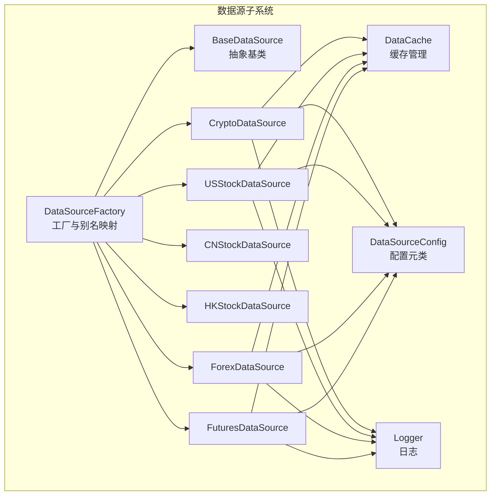
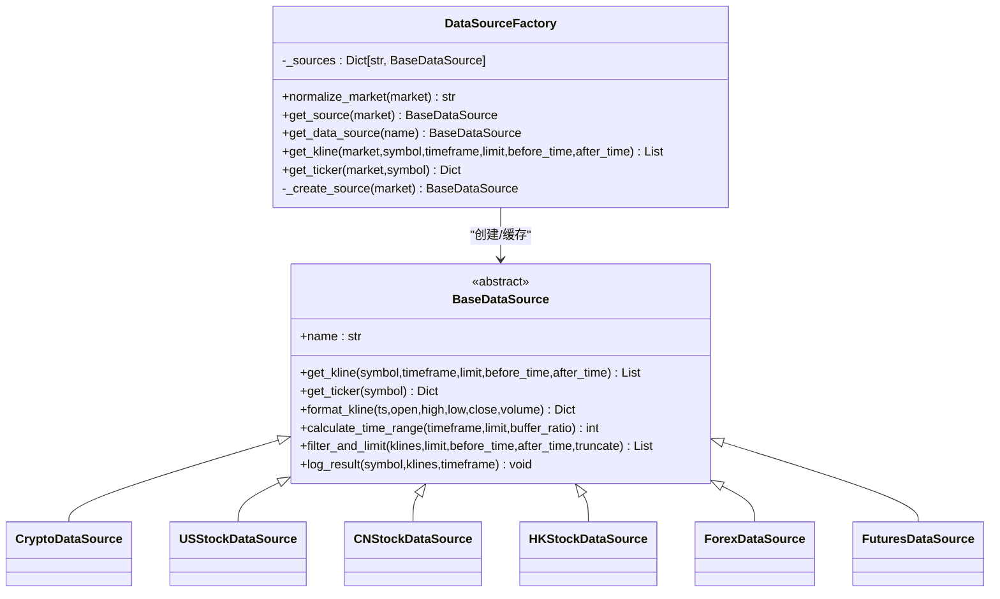
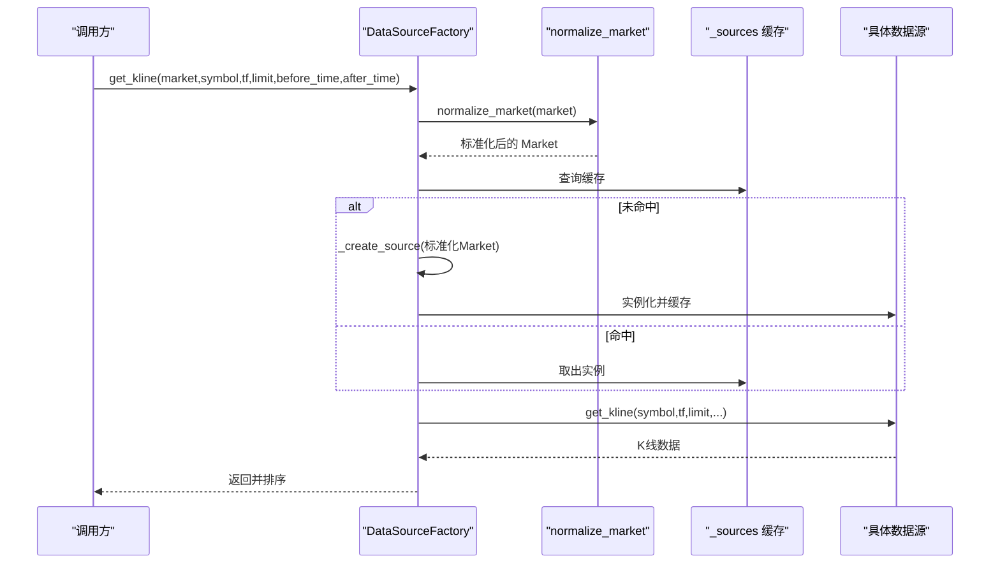
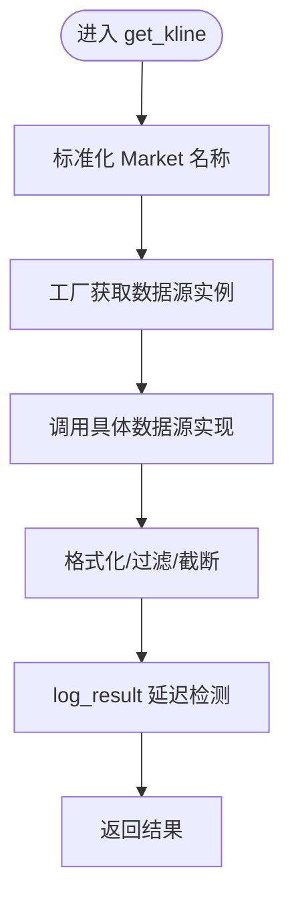
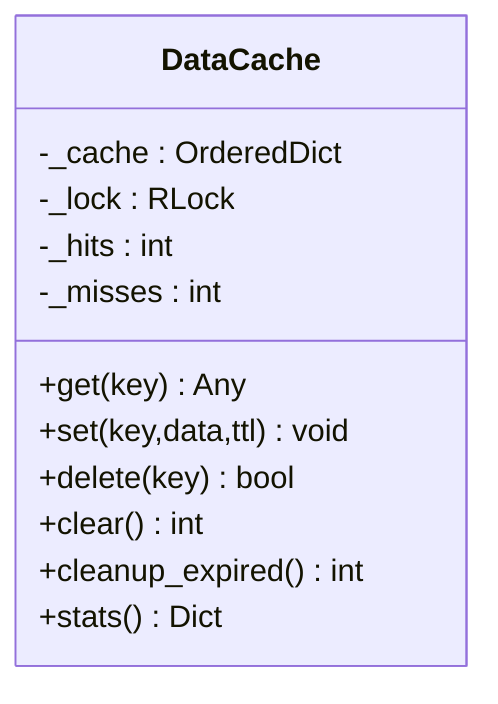
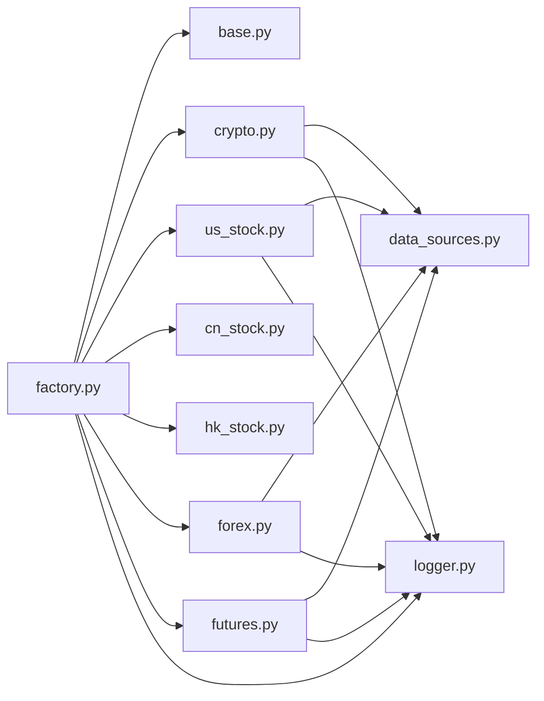

# 数据源架构设计

<cite>
**本文引用的文件**
- [factory.py](file://backend_api_python/app/data_sources/factory.py)
- [base.py](file://backend_api_python/app/data_sources/base.py)
- [cache_manager.py](file://backend_api_python/app/data_sources/cache_manager.py)
- [__init__.py](file://backend_api_python/app/data_sources/__init__.py)
- [data_sources.py](file://backend_api_python/app/config/data_sources.py)
- [crypto.py](file://backend_api_python/app/data_sources/crypto.py)
- [us_stock.py](file://backend_api_python/app/data_sources/us_stock.py)
- [cn_stock.py](file://backend_api_python/app/data_sources/cn_stock.py)
- [hk_stock.py](file://backend_api_python/app/data_sources/hk_stock.py)
- [forex.py](file://backend_api_python/app/data_sources/forex.py)
- [futures.py](file://backend_api_python/app/data_sources/futures.py)
- [logger.py](file://backend_api_python/app/utils/logger.py)
</cite>

## 目录
1. [简介](#简介)
2. [项目结构](#项目结构)
3. [核心组件](#核心组件)
4. [架构总览](#架构总览)
5. [详细组件分析](#详细组件分析)
6. [依赖分析](#依赖分析)
7. [性能考量](#性能考量)
8. [故障排查指南](#故障排查指南)
9. [结论](#结论)
10. [附录](#附录)

## 简介
本文件系统性阐述 SharkQuantDinger 后端数据源子系统的架构设计与实现要点，重点覆盖：
- 工厂模式与 Market 别名映射机制
- 数据源实例缓存与懒加载策略
- BaseDataSource 基类的统一接口、异常处理与日志策略
- 数据标准化流程（市场类型、符号、格式）
- 新数据源扩展的最佳实践与性能优化建议
- 工厂模式与数据流的 UML 图与流程图

## 项目结构
数据源子系统位于 backend_api_python/app/data_sources 目录，采用“工厂 + 多数据源实现 + 基类 + 缓存/限流/熔断”的分层架构。核心文件职责如下：
- 工厂与入口：factory.py
- 基类与通用能力：base.py
- 缓存与限流：cache_manager.py、rate_limiter.py（通过 __init__.py 导出）
- 配置：data_sources.py
- 各市场实现：crypto.py、us_stock.py、cn_stock.py、hk_stock.py、forex.py、futures.py
- 日志：utils/logger.py

图表来源
- [factory.py:27-102](file://backend_api_python/app/data_sources/factory.py#L27-L102)
- [base.py:27-179](file://backend_api_python/app/data_sources/base.py#L27-L179)
- [cache_manager.py:44-174](file://backend_api_python/app/data_sources/cache_manager.py#L44-L174)
- [data_sources.py:6-170](file://backend_api_python/app/config/data_sources.py#L6-L170)
- [crypto.py:16-428](file://backend_api_python/app/data_sources/crypto.py#L16-L428)
- [us_stock.py:17-334](file://backend_api_python/app/data_sources/us_stock.py#L17-L334)
- [cn_stock.py:30-125](file://backend_api_python/app/data_sources/cn_stock.py#L30-L125)
- [hk_stock.py:30-125](file://backend_api_python/app/data_sources/hk_stock.py#L30-L125)
- [forex.py:104-709](file://backend_api_python/app/data_sources/forex.py#L104-L709)
- [futures.py:60-468](file://backend_api_python/app/data_sources/futures.py#L60-L468)

章节来源
- [factory.py:1-169](file://backend_api_python/app/data_sources/factory.py#L1-L169)
- [__init__.py:1-45](file://backend_api_python/app/data_sources/__init__.py#L1-L45)

## 核心组件
- 工厂类 DataSourceFactory：负责 Market 枚举归一化、实例缓存与懒加载、便捷方法封装（K线/报价获取）。
- 基类 BaseDataSource：定义统一接口（get_kline/get_ticker）、通用格式化与过滤、时间窗口计算、延迟检测日志。
- 缓存 DataCache：TTL/LRU 管理，线程安全，提供统计信息。
- 配置元类 DataSourceConfig/Meta*Config：集中管理超时、重试、限流等参数。
- 各市场实现：Crypto、USStock、CN/HK Stock、Forex、Futures，均继承 BaseDataSource 并实现各自 fetch_* 逻辑。

章节来源
- [factory.py:27-169](file://backend_api_python/app/data_sources/factory.py#L27-L169)
- [base.py:27-179](file://backend_api_python/app/data_sources/base.py#L27-L179)
- [cache_manager.py:44-233](file://backend_api_python/app/data_sources/cache_manager.py#L44-L233)
- [data_sources.py:6-170](file://backend_api_python/app/config/data_sources.py#L6-L170)

## 架构总览
工厂模式通过 Market 类型映射到具体数据源，实现“按需加载 + 单例缓存”。各数据源在实现层完成外部 API 的适配、符号规范化、时间窗口计算与降级策略，最终统一输出标准化 K 线/报价。

图表来源
- [factory.py:27-102](file://backend_api_python/app/data_sources/factory.py#L27-L102)
- [base.py:27-179](file://backend_api_python/app/data_sources/base.py#L27-L179)
- [crypto.py:16-428](file://backend_api_python/app/data_sources/crypto.py#L16-L428)
- [us_stock.py:17-334](file://backend_api_python/app/data_sources/us_stock.py#L17-L334)
- [cn_stock.py:30-125](file://backend_api_python/app/data_sources/cn_stock.py#L30-L125)
- [hk_stock.py:30-125](file://backend_api_python/app/data_sources/hk_stock.py#L30-L125)
- [forex.py:104-709](file://backend_api_python/app/data_sources/forex.py#L104-L709)
- [futures.py:60-468](file://backend_api_python/app/data_sources/futures.py#L60-L468)

## 详细组件分析

### 工厂模式与 Market 别名映射
- 归一化规则：空白/大小写/连字符/空格规范化，再映射到固定 PascalCase 键（如 "crypto"/"cryptocurrency" -> "Crypto"）。
- 实例缓存：首次访问创建并放入内存字典，后续直接复用，实现懒加载与单例。
- 便捷方法：get_kline/get_ticker 直接委托给具体数据源，并在工厂层做异常兜底与日志记录。

图表来源
- [factory.py:36-139](file://backend_api_python/app/data_sources/factory.py#L36-L139)

章节来源
- [factory.py:12-102](file://backend_api_python/app/data_sources/factory.py#L12-L102)

### BaseDataSource 基类设计
- 统一接口：get_kline 必须实现；get_ticker 可选，默认抛出 NotImplementedError。
- 格式化与过滤：format_kline 统一精度；filter_and_limit 支持时间窗裁剪与截断策略；calculate_time_range 基于 TIMEFRAME_SECONDS 计算请求窗口。
- 日志与延迟检测：log_result 基于 UTC 时间差判断数据延迟并告警，区分分钟/小时/日/周级别阈值。
- 异常处理：子类可覆盖 get_ticker 抛出 NotImplementedError 时，工厂层捕获并返回默认结构，避免上游崩溃。

图表来源
- [base.py:32-179](file://backend_api_python/app/data_sources/base.py#L32-L179)
- [factory.py:105-139](file://backend_api_python/app/data_sources/factory.py#L105-L139)

章节来源
- [base.py:14-179](file://backend_api_python/app/data_sources/base.py#L14-L179)

### 数据源标准化流程
- 市场类型规范化：工厂 normalize_market 将别名映射为固定枚举，保证路由与入口一致性。
- 符号标准化：各数据源内部实现符号规范化与交易所兼容映射（如 Crypto 的 _normalize_symbol_for_exchange、Forex 的 normalize_forex_pair_symbol、CN/HK 的代码规范化）。
- 数据格式统一：统一返回 K 线字段（time/open/high/low/close/volume），并按时间升序排列。

章节来源
- [factory.py:36-44](file://backend_api_python/app/data_sources/factory.py#L36-L44)
- [crypto.py:70-174](file://backend_api_python/app/data_sources/crypto.py#L70-L174)
- [forex.py:20-26](file://backend_api_python/app/data_sources/forex.py#L20-L26)
- [cn_stock.py:61-62](file://backend_api_python/app/data_sources/cn_stock.py#L61-L62)
- [hk_stock.py:61-62](file://backend_api_python/app/data_sources/hk_stock.py#L61-L62)

### 缓存策略与懒加载
- 工厂缓存：_sources 内存字典按 Market 键缓存实例，首次访问创建，后续复用。
- 全局缓存：DataCache 提供 TTL/LRU 管理，线程安全，支持命中/未命中统计与过期清理。
- 使用建议：对高频查询（如 K 线）可结合 DataCache 与工厂缓存，减少重复实例化与外部请求。

图表来源
- [cache_manager.py:44-174](file://backend_api_python/app/data_sources/cache_manager.py#L44-L174)

章节来源
- [cache_manager.py:1-233](file://backend_api_python/app/data_sources/cache_manager.py#L1-L233)
- [factory.py:33-60](file://backend_api_python/app/data_sources/factory.py#L33-L60)

### 各数据源实现要点
- 加密货币（Crypto）：基于 CCXT，支持多交易所动态加载、markets 延迟加载、符号映射与降级获取 OHLCV。
- 美股（USStock）：优先 Finnhub，降级 yfinance，支持 fast_info 与 info 两套路径。
- 中国/A 股（CNStock）：多层降级（Twelve Data -> Tencent -> yfinance -> AkShare），按周期与时间窗拼装请求。
- 港股/H 股（HKStock）：与 CNStock 类似，针对港股特殊处理。
- 外汇（Forex）：Twelve Data -> Tiingo -> yfinance 三级降级，含全局缓存与聚合逻辑。
- 期货（Futures）：传统期货（Twelve Data/yfinance/Tiingo）与加密货币期货（CCXT Binance Futures）双通道。

章节来源
- [crypto.py:16-428](file://backend_api_python/app/data_sources/crypto.py#L16-L428)
- [us_stock.py:17-334](file://backend_api_python/app/data_sources/us_stock.py#L17-L334)
- [cn_stock.py:30-125](file://backend_api_python/app/data_sources/cn_stock.py#L30-L125)
- [hk_stock.py:30-125](file://backend_api_python/app/data_sources/hk_stock.py#L30-L125)
- [forex.py:104-709](file://backend_api_python/app/data_sources/forex.py#L104-L709)
- [futures.py:60-468](file://backend_api_python/app/data_sources/futures.py#L60-L468)

## 依赖分析
- 工厂依赖：导入 BaseDataSource 与各具体数据源模块，在 _create_source 中按需引入，实现懒加载。
- 配置依赖：各数据源读取 CCXTConfig、TiingoConfig、YFinanceConfig 等配置元类属性。
- 日志依赖：统一通过 get_logger 获取日志器，工厂与数据源均使用 logger 记录异常与调试信息。

图表来源
- [factory.py:7-102](file://backend_api_python/app/data_sources/factory.py#L7-L102)
- [data_sources.py:6-170](file://backend_api_python/app/config/data_sources.py#L6-L170)
- [logger.py:51-63](file://backend_api_python/app/utils/logger.py#L51-L63)

章节来源
- [factory.py:1-169](file://backend_api_python/app/data_sources/factory.py#L1-L169)
- [data_sources.py:1-171](file://backend_api_python/app/config/data_sources.py#L1-L171)
- [logger.py:1-63](file://backend_api_python/app/utils/logger.py#L1-L63)

## 性能考量
- 工厂缓存：避免重复实例化，显著降低初始化开销。
- 缓存管理：DataCache 的 TTL/LRU 与统计接口可用于监控命中率与过期清理，建议结合业务热点调整默认 TTL 与最大容量。
- 时间窗口估算：BaseDataSource 的 calculate_time_range 与 filter_and_limit 减少无效请求与多余数据传输。
- 降级策略：多数据源实现均内置降级路径，提升可用性与稳定性。
- 日志与延迟检测：log_result 帮助定位数据延迟问题，指导窗口参数与缓冲比例调整。

## 故障排查指南
- 工厂异常：get_kline/get_ticker 在工厂层捕获异常并记录日志，必要时返回空结果或默认结构，避免中断。
- 数据源异常：get_ticker 未实现时返回默认结构；各数据源内部 try/except 包裹外部 API 调用，记录错误并降级。
- 日志定位：通过 logger 输出错误堆栈与关键参数，结合 log_result 的延迟告警快速定位问题。
- 配置检查：确认 CCXT/Tiingo/Finnhub/yfinance 等配置项与 API Key 设置正确。

章节来源
- [factory.py:137-167](file://backend_api_python/app/data_sources/factory.py#L137-L167)
- [base.py:141-179](file://backend_api_python/app/data_sources/base.py#L141-L179)
- [logger.py:1-63](file://backend_api_python/app/utils/logger.py#L1-L63)

## 结论
该数据源架构以工厂模式为核心，结合 Market 别名映射、实例缓存与懒加载，实现了高内聚、低耦合的多数据源统一接入。BaseDataSource 提供一致的接口与通用能力，配合缓存与降级策略，兼顾性能与稳定性。通过清晰的标准化流程与完善的日志体系，开发者能够快速扩展新数据源并保障线上质量。

## 附录

### 新数据源扩展最佳实践
- 继承 BaseDataSource，实现 get_kline 与可选 get_ticker。
- 在工厂 _create_source 中注册新 Market 类型与模块导入。
- 设计符号规范化与时间窗口计算逻辑，确保与 BaseDataSource 的 filter_and_limit/log_result 协作。
- 合理设置 TTL 与容量，必要时引入 DataCache。
- 编写降级路径与异常处理，保证在外部 API 不可用时仍能返回合理数据或默认结构。
- 通过日志记录关键参数与耗时，便于监控与排障。

章节来源
- [factory.py:80-102](file://backend_api_python/app/data_sources/factory.py#L80-L102)
- [base.py:27-179](file://backend_api_python/app/data_sources/base.py#L27-L179)
- [cache_manager.py:44-174](file://backend_api_python/app/data_sources/cache_manager.py#L44-L174)