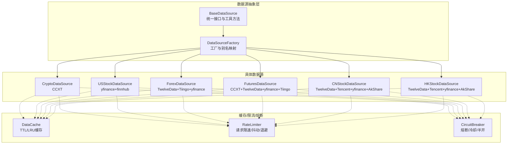
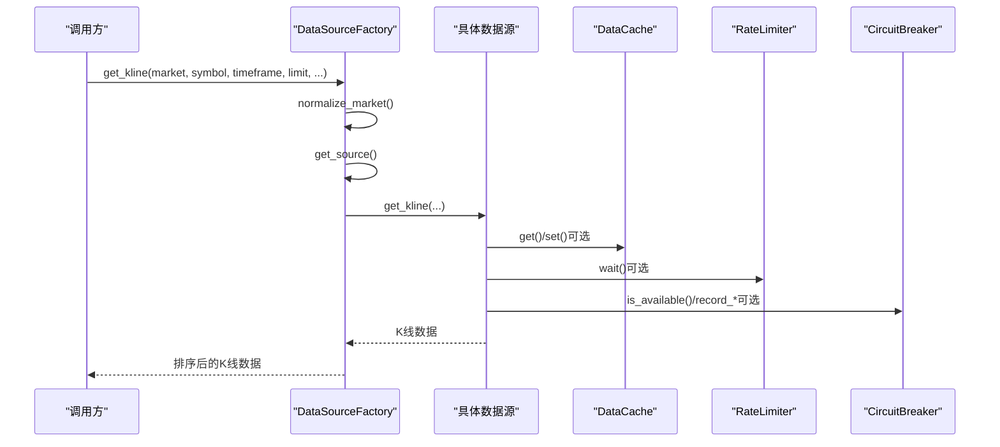
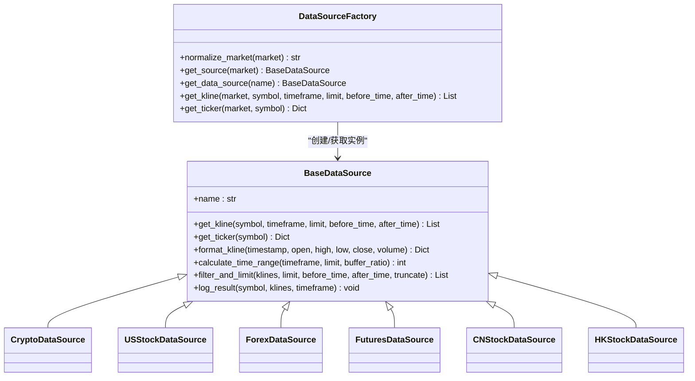
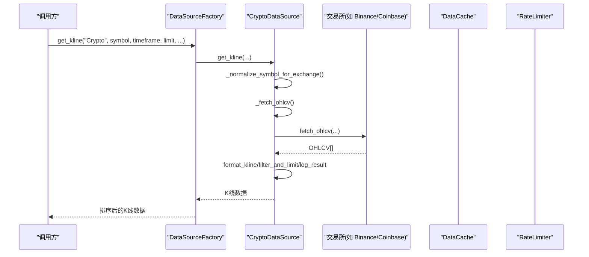
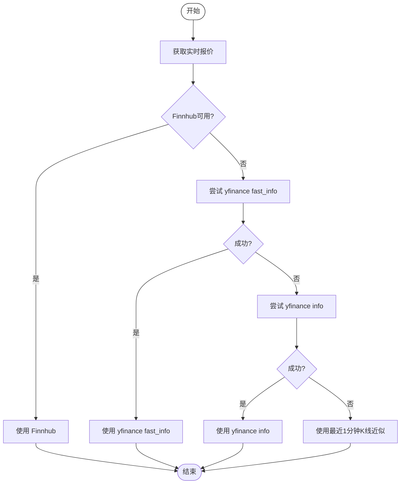
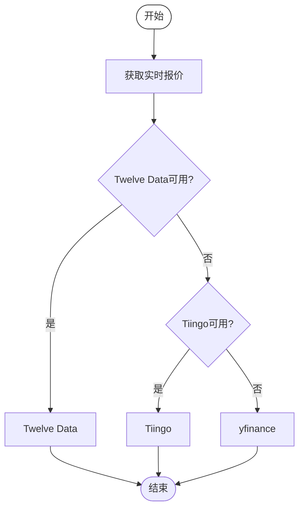
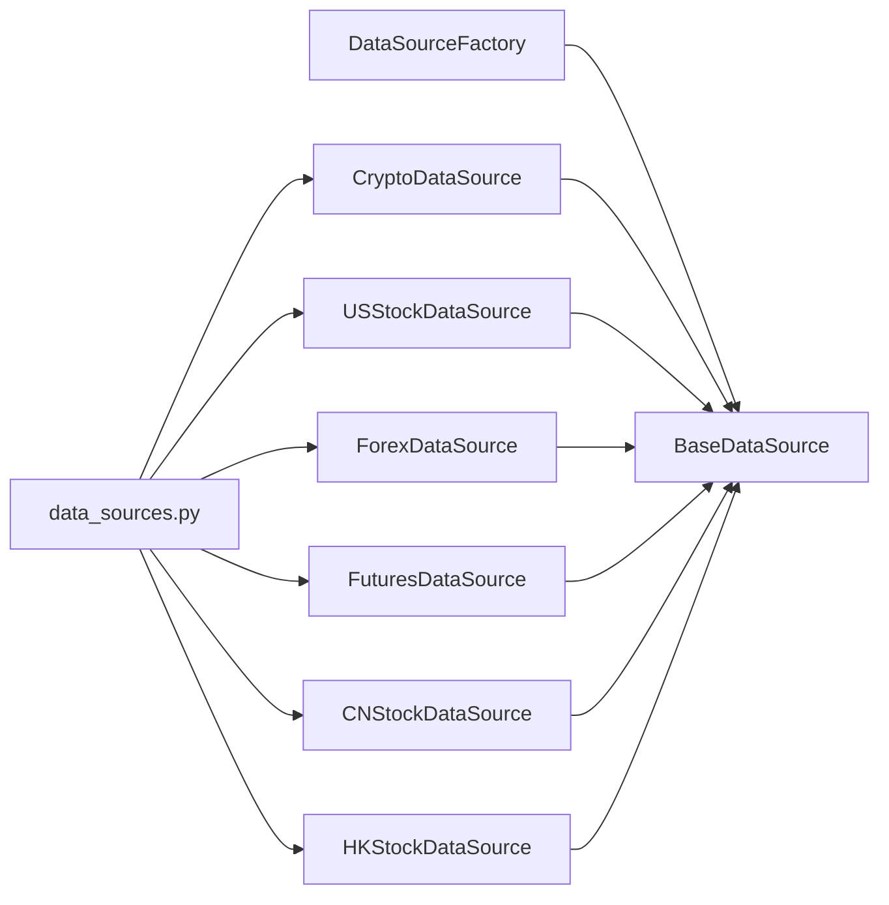

# 数据源系统

<cite>
**本文引用的文件**
- [backend_api_python/app/data_sources/base.py](file://backend_api_python/app/data_sources/base.py)
- [backend_api_python/app/data_sources/factory.py](file://backend_api_python/app/data_sources/factory.py)
- [backend_api_python/app/data_sources/cache_manager.py](file://backend_api_python/app/data_sources/cache_manager.py)
- [backend_api_python/app/data_sources/rate_limiter.py](file://backend_api_python/app/data_sources/rate_limiter.py)
- [backend_api_python/app/data_sources/circuit_breaker.py](file://backend_api_python/app/data_sources/circuit_breaker.py)
- [backend_api_python/app/data_sources/crypto.py](file://backend_api_python/app/data_sources/crypto.py)
- [backend_api_python/app/data_sources/us_stock.py](file://backend_api_python/app/data_sources/us_stock.py)
- [backend_api_python/app/data_sources/forex.py](file://backend_api_python/app/data_sources/forex.py)
- [backend_api_python/app/data_sources/futures.py](file://backend_api_python/app/data_sources/futures.py)
- [backend_api_python/app/data_sources/cn_stock.py](file://backend_api_python/app/data_sources/cn_stock.py)
- [backend_api_python/app/data_sources/hk_stock.py](file://backend_api_python/app/data_sources/hk_stock.py)
- [backend_api_python/app/data_sources/asia_stock_kline.py](file://backend_api_python/app/data_sources/asia_stock_kline.py)
- [backend_api_python/app/data_sources/tencent.py](file://backend_api_python/app/data_sources/tencent.py)
- [backend_api_python/app/config/data_sources.py](file://backend_api_python/app/config/data_sources.py)
</cite>

## 目录
1. [简介](#简介)
2. [项目结构](#项目结构)
3. [核心组件](#核心组件)
4. [架构总览](#架构总览)
5. [详细组件分析](#详细组件分析)
6. [依赖分析](#依赖分析)
7. [性能考虑](#性能考虑)
8. [故障排除指南](#故障排除指南)
9. [结论](#结论)
10. [附录](#附录)

## 简介
QuantDinger 的数据源系统通过统一的抽象层屏蔽底层数据提供商差异，采用工厂模式按市场类型动态选择具体数据源实现，支持加密货币、股票（美国、中国A股、港股）、外汇、期货等多市场数据。系统内置缓存、限流、熔断与降级策略，确保在复杂网络环境下稳定高效地提供数据。

## 项目结构
数据源相关代码集中在 backend_api_python/app/data_sources 下，核心文件包括：
- 抽象基类与工厂：base.py、factory.py
- 缓存、限流、熔断：cache_manager.py、rate_limiter.py、circuit_breaker.py
- 各市场数据源：crypto.py、us_stock.py、forex.py、futures.py、cn_stock.py、hk_stock.py
- 亚洲股票辅助：asia_stock_kline.py、tencent.py
- 配置：data_sources.py

图表来源
- [backend_api_python/app/data_sources/base.py:27-179](file://backend_api_python/app/data_sources/base.py#L27-L179)
- [backend_api_python/app/data_sources/factory.py:27-169](file://backend_api_python/app/data_sources/factory.py#L27-L169)
- [backend_api_python/app/data_sources/cache_manager.py:44-233](file://backend_api_python/app/data_sources/cache_manager.py#L44-L233)
- [backend_api_python/app/data_sources/rate_limiter.py:109-273](file://backend_api_python/app/data_sources/rate_limiter.py#L109-L273)
- [backend_api_python/app/data_sources/circuit_breaker.py:31-175](file://backend_api_python/app/data_sources/circuit_breaker.py#L31-L175)
- [backend_api_python/app/data_sources/crypto.py:16-428](file://backend_api_python/app/data_sources/crypto.py#L16-L428)
- [backend_api_python/app/data_sources/us_stock.py:17-334](file://backend_api_python/app/data_sources/us_stock.py#L17-L334)
- [backend_api_python/app/data_sources/forex.py:104-709](file://backend_api_python/app/data_sources/forex.py#L104-L709)
- [backend_api_python/app/data_sources/futures.py:60-468](file://backend_api_python/app/data_sources/futures.py#L60-L468)
- [backend_api_python/app/data_sources/cn_stock.py:30-125](file://backend_api_python/app/data_sources/cn_stock.py#L30-L125)
- [backend_api_python/app/data_sources/hk_stock.py:30-125](file://backend_api_python/app/data_sources/hk_stock.py#L30-L125)

章节来源
- [backend_api_python/app/data_sources/base.py:1-179](file://backend_api_python/app/data_sources/base.py#L1-L179)
- [backend_api_python/app/data_sources/factory.py:1-169](file://backend_api_python/app/data_sources/factory.py#L1-L169)

## 核心组件
- 抽象基类 BaseDataSource：定义统一接口（获取K线、获取实时报价、格式化、过滤限制、时间范围计算、结果日志），提供通用工具方法。
- 工厂 DataSourceFactory：负责市场类型标准化与别名映射，按需创建具体数据源实例，提供便捷的 K 线与实时报价获取方法。
- 缓存 DataCache：基于 TTL 与 LRU 的线程安全缓存，支持命中统计与清理。
- 限流 RateLimiter：最小间隔、随机抖动、指数退避重试，针对不同来源配置专用限流器。
- 熔断 CircuitBreaker：失败阈值触发熔断，冷却后半开试探，保障系统稳定性。

章节来源
- [backend_api_python/app/data_sources/base.py:27-179](file://backend_api_python/app/data_sources/base.py#L27-L179)
- [backend_api_python/app/data_sources/factory.py:27-169](file://backend_api_python/app/data_sources/factory.py#L27-L169)
- [backend_api_python/app/data_sources/cache_manager.py:44-233](file://backend_api_python/app/data_sources/cache_manager.py#L44-L233)
- [backend_api_python/app/data_sources/rate_limiter.py:109-273](file://backend_api_python/app/data_sources/rate_limiter.py#L109-L273)
- [backend_api_python/app/data_sources/circuit_breaker.py:31-175](file://backend_api_python/app/data_sources/circuit_breaker.py#L31-L175)

## 架构总览
系统以工厂模式为核心，围绕统一抽象层构建多市场数据源。各数据源实现差异化接口，结合缓存、限流与熔断策略，形成高可用的数据获取链路。

图表来源
- [backend_api_python/app/data_sources/factory.py:105-169](file://backend_api_python/app/data_sources/factory.py#L105-L169)
- [backend_api_python/app/data_sources/cache_manager.py:71-128](file://backend_api_python/app/data_sources/cache_manager.py#L71-L128)
- [backend_api_python/app/data_sources/rate_limiter.py:135-159](file://backend_api_python/app/data_sources/rate_limiter.py#L135-L159)
- [backend_api_python/app/data_sources/circuit_breaker.py:67-100](file://backend_api_python/app/data_sources/circuit_breaker.py#L67-L100)

## 详细组件分析

### 抽象层与工厂
- 统一接口：get_kline、get_ticker（可选）、format_kline、filter_and_limit、calculate_time_range、log_result。
- 工厂职责：市场别名标准化、按需实例化、便捷方法封装、异常兜底。
- 别名映射：支持多种别名到标准市场枚举（如“crypto”→“Crypto”，“usstock”→“USStock”等）。

图表来源
- [backend_api_python/app/data_sources/base.py:27-179](file://backend_api_python/app/data_sources/base.py#L27-L179)
- [backend_api_python/app/data_sources/factory.py:27-169](file://backend_api_python/app/data_sources/factory.py#L27-L169)
- [backend_api_python/app/data_sources/crypto.py:16-428](file://backend_api_python/app/data_sources/crypto.py#L16-L428)
- [backend_api_python/app/data_sources/us_stock.py:17-334](file://backend_api_python/app/data_sources/us_stock.py#L17-L334)
- [backend_api_python/app/data_sources/forex.py:104-709](file://backend_api_python/app/data_sources/forex.py#L104-L709)
- [backend_api_python/app/data_sources/futures.py:60-468](file://backend_api_python/app/data_sources/futures.py#L60-L468)
- [backend_api_python/app/data_sources/cn_stock.py:30-125](file://backend_api_python/app/data_sources/cn_stock.py#L30-L125)
- [backend_api_python/app/data_sources/hk_stock.py:30-125](file://backend_api_python/app/data_sources/hk_stock.py#L30-L125)

章节来源
- [backend_api_python/app/data_sources/base.py:27-179](file://backend_api_python/app/data_sources/base.py#L27-L179)
- [backend_api_python/app/data_sources/factory.py:27-169](file://backend_api_python/app/data_sources/factory.py#L27-L169)

### 加密货币数据源（Crypto）
- 适配 CCXT 交易所，支持多周期映射与符号规范化。
- 符号处理：兼容“BTC/USDT”、“BTCUSDT”、“BTC/USDT:USDT”等格式，自动识别基础/报价货币，必要时在交易所 markets 中查找有效符号。
- K线获取：支持分页拉取完整时间段数据，去重与排序，回测场景下保留完整窗口。
- 实时报价：优先 CCXT fetch_ticker，失败时尝试替代符号或返回默认值。
- 错误处理：捕获异常并记录，保证流程不中断。

图表来源
- [backend_api_python/app/data_sources/factory.py:105-139](file://backend_api_python/app/data_sources/factory.py#L105-L139)
- [backend_api_python/app/data_sources/crypto.py:232-427](file://backend_api_python/app/data_sources/crypto.py#L232-L427)
- [backend_api_python/app/data_sources/rate_limiter.py:135-159](file://backend_api_python/app/data_sources/rate_limiter.py#L135-L159)

章节来源
- [backend_api_python/app/data_sources/crypto.py:16-428](file://backend_api_python/app/data_sources/crypto.py#L16-L428)

### 美国股票数据源（USStock）
- 实时报价：优先 Finnhub（实时），降级 yfinance fast_info/info 或最近1分钟K线近似。
- K线获取：yfinance 历史数据为主，必要时使用 Finnhub 日线。
- 周期映射与时间范围：针对不同周期估算合理的历史天数范围，避免过度请求。

图表来源
- [backend_api_python/app/data_sources/us_stock.py:58-168](file://backend_api_python/app/data_sources/us_stock.py#L58-L168)

章节来源
- [backend_api_python/app/data_sources/us_stock.py:17-334](file://backend_api_python/app/data_sources/us_stock.py#L17-L334)

### 外汇数据源（Forex）
- 实时报价与K线：三级降级（Twelve Data → Tiingo → yfinance）。
- 符号与周期映射：提供内部符号归一化与周期映射，支持周线/月线聚合。
- 速率限制与缓存：对 Tiingo 429 与超时进行重试与降级，全局缓存短期报价。

图表来源
- [backend_api_python/app/data_sources/forex.py:129-308](file://backend_api_python/app/data_sources/forex.py#L129-L308)

章节来源
- [backend_api_python/app/data_sources/forex.py:104-709](file://backend_api_python/app/data_sources/forex.py#L104-L709)

### 期货数据源（Futures）
- 传统期货：Twelve Data → yfinance → Tiingo（贵金属）。
- 加密货币期货：CCXT（Binance Futures）。
- 周期与符号处理：针对不同来源进行映射与格式化。

章节来源
- [backend_api_python/app/data_sources/futures.py:60-468](file://backend_api_python/app/data_sources/futures.py#L60-L468)

### 中国A股数据源（CNStock）
- 多层降级：Twelve Data（付费）→ 腾讯日/周线 → yfinance → AkShare。
- 日/周线：优先腾讯 fqkline；分钟/小时：优先 yfinance/AkShare。
- 代码与周期归一：Tencent 代码与 yfinance 符号互转，周期别名映射。

章节来源
- [backend_api_python/app/data_sources/cn_stock.py:30-125](file://backend_api_python/app/data_sources/cn_stock.py#L30-L125)
- [backend_api_python/app/data_sources/asia_stock_kline.py:169-593](file://backend_api_python/app/data_sources/asia_stock_kline.py#L169-L593)
- [backend_api_python/app/data_sources/tencent.py:24-239](file://backend_api_python/app/data_sources/tencent.py#L24-L239)

### 港股/H股数据源（HKStock）
- 与 CNStock 类似的多层降级策略，针对港股特殊性优化。
- 代码归一化与周期映射，日/周线优先腾讯 fqkline。

章节来源
- [backend_api_python/app/data_sources/hk_stock.py:30-125](file://backend_api_python/app/data_sources/hk_stock.py#L30-L125)
- [backend_api_python/app/data_sources/asia_stock_kline.py:169-593](file://backend_api_python/app/data_sources/asia_stock_kline.py#L169-L593)
- [backend_api_python/app/data_sources/tencent.py:24-239](file://backend_api_python/app/data_sources/tencent.py#L24-L239)

## 依赖分析
- 组件耦合：各数据源均依赖抽象基类，工厂仅依赖基类与具体实现模块，耦合度低。
- 外部依赖：CCXT（加密货币）、yfinance/finnhub（美股）、Twelve Data/Tiingo/yfinance（外汇/期货/亚洲股票）。
- 配置中心：通过 data_sources.py 提供统一配置读取（超时、重试、时间周期映射、代理等）。

图表来源
- [backend_api_python/app/data_sources/factory.py:81-102](file://backend_api_python/app/data_sources/factory.py#L81-L102)
- [backend_api_python/app/config/data_sources.py:101-171](file://backend_api_python/app/config/data_sources.py#L101-L171)

章节来源
- [backend_api_python/app/data_sources/factory.py:81-102](file://backend_api_python/app/data_sources/factory.py#L81-L102)
- [backend_api_python/app/config/data_sources.py:101-171](file://backend_api_python/app/config/data_sources.py#L101-L171)

## 性能考虑
- 缓存策略
  - 实时行情缓存：默认TTL 20分钟，适合高频读取。
  - K线缓存：默认TTL 5分钟，容量较小，避免热点K线挤占内存。
  - 股票信息缓存：默认TTL 24小时，适合基本信息复用。
- 限流与退避
  - 随机抖动与指数退避降低被封禁风险。
  - 针对不同来源配置专用限流器（如东方财富、腾讯、AkShare）。
- 熔断保护
  - 失败阈值触发熔断，冷却后半开试探，避免雪崩效应。
- 数据获取优化
  - 周期映射与时间范围估算，减少无效请求。
  - 分页拉取与去重排序，保证数据完整性与一致性。

章节来源
- [backend_api_python/app/data_sources/cache_manager.py:44-233](file://backend_api_python/app/data_sources/cache_manager.py#L44-L233)
- [backend_api_python/app/data_sources/rate_limiter.py:109-273](file://backend_api_python/app/data_sources/rate_limiter.py#L109-L273)
- [backend_api_python/app/data_sources/circuit_breaker.py:31-175](file://backend_api_python/app/data_sources/circuit_breaker.py#L31-L175)
- [backend_api_python/app/data_sources/crypto.py:317-391](file://backend_api_python/app/data_sources/crypto.py#L317-L391)
- [backend_api_python/app/data_sources/us_stock.py:170-234](file://backend_api_python/app/data_sources/us_stock.py#L170-L234)

## 故障排除指南
- 常见问题
  - 数据为空：检查符号是否正确、交易所是否支持该交易对、是否触发熔断。
  - 速率限制：调整限流参数或切换来源；关注 429/超时错误。
  - 缓存命中率低：确认缓存键生成规则与TTL设置是否合理。
- 排查步骤
  - 查看日志中的“延迟告警”与“无数据”提示，定位具体市场与周期。
  - 使用工厂的便捷方法测试不同来源的可用性。
  - 检查配置项（超时、重试、代理、API Key）是否正确。
- 建议
  - 对关键路径启用缓存与熔断。
  - 为不同来源设置差异化限流策略。
  - 在回测场景下注意 after_time 与 truncate 的影响。

章节来源
- [backend_api_python/app/data_sources/base.py:141-179](file://backend_api_python/app/data_sources/base.py#L141-L179)
- [backend_api_python/app/data_sources/factory.py:137-167](file://backend_api_python/app/data_sources/factory.py#L137-L167)
- [backend_api_python/app/data_sources/rate_limiter.py:170-231](file://backend_api_python/app/data_sources/rate_limiter.py#L170-L231)
- [backend_api_python/app/data_sources/circuit_breaker.py:116-157](file://backend_api_python/app/data_sources/circuit_breaker.py#L116-L157)

## 结论
QuantDinger 数据源系统通过抽象层与工厂模式实现了多市场数据的统一接入，配合缓存、限流与熔断策略，在复杂外部环境中提供了高可用与高性能的数据服务。扩展新数据源只需遵循统一接口与命名规范，即可无缝融入现有体系。

## 附录
- 新数据源集成步骤
  - 实现 BaseDataSource 子类，至少实现 get_kline（get_ticker 可选）。
  - 在工厂的 _create_source 中添加映射，或通过 market 枚举扩展。
  - 如需缓存/限流/熔断，按需引入 DataCache/RateLimiter/CircuitBreaker。
  - 在 data_sources.py 中补充配置项（如超时、时间周期映射、代理等）。
  - 编写单元测试与集成测试，覆盖降级与异常路径。
- 配置项参考
  - 数据源通用：超时、重试次数、退避系数。
  - 各来源配置：Finnhub、Tiingo、YFinance、CCXT、AkShare、Twelve Data。
  - 代理设置：PROXY_URL、HTTPS_PROXY、HTTP_PROXY、ALL_PROXY。

章节来源
- [backend_api_python/app/data_sources/factory.py:81-102](file://backend_api_python/app/data_sources/factory.py#L81-L102)
- [backend_api_python/app/config/data_sources.py:26-171](file://backend_api_python/app/config/data_sources.py#L26-L171)