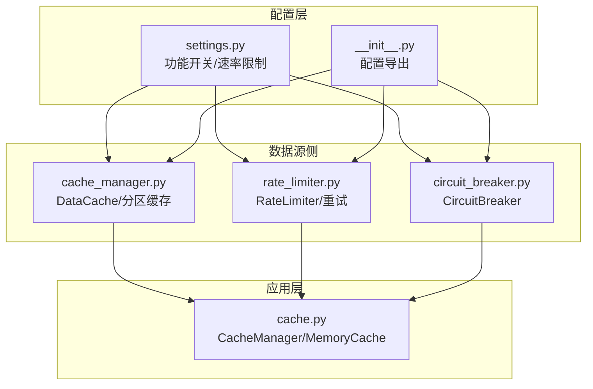
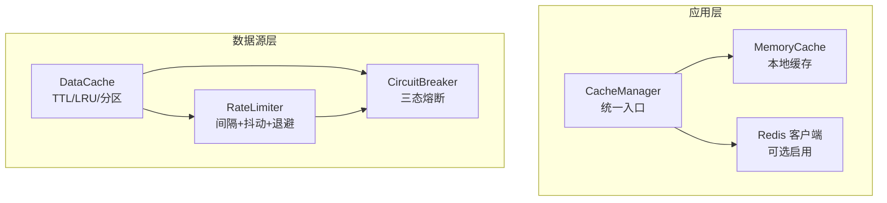
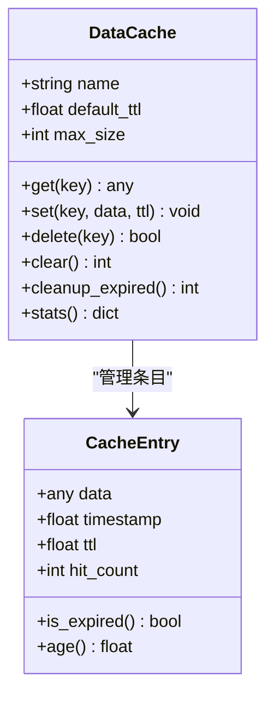
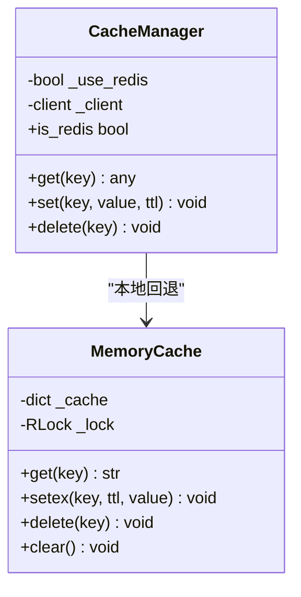
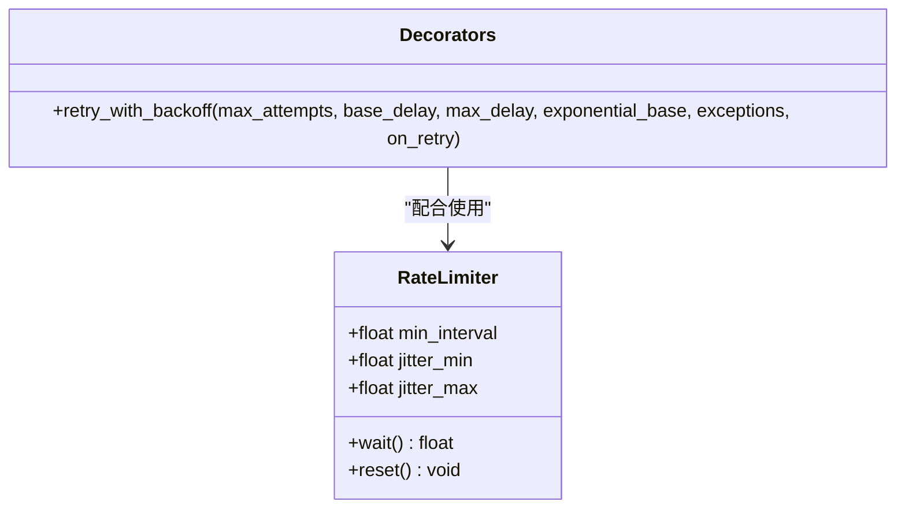
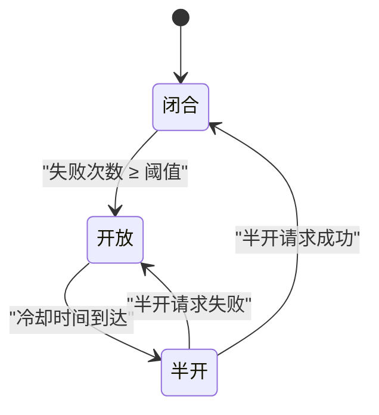
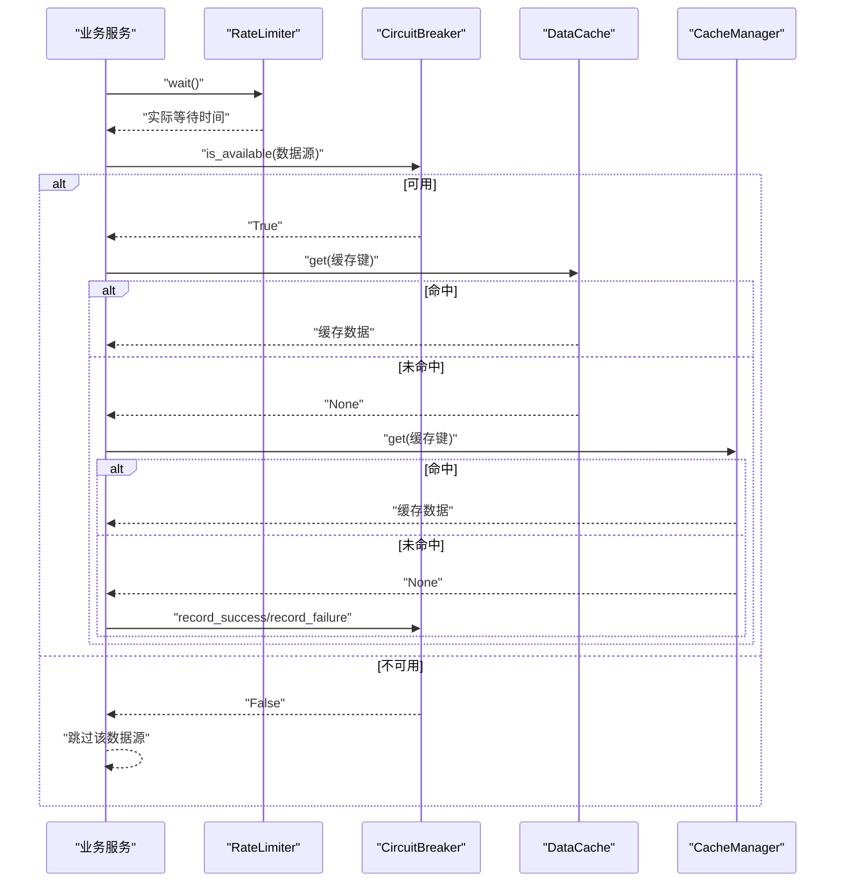
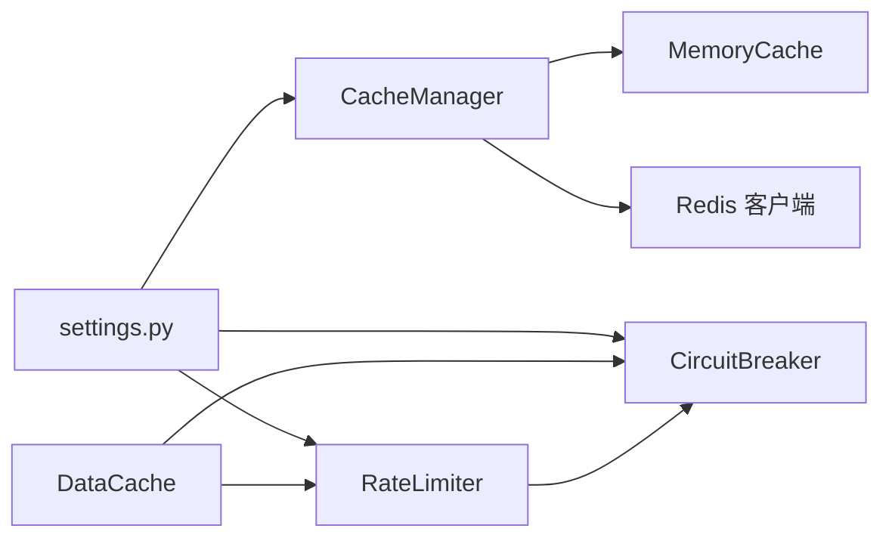

# 数据缓存和性能优化

<cite>
**本文引用的文件**
- [cache_manager.py](file://backend_api_python/app/data_sources/cache_manager.py)
- [rate_limiter.py](file://backend_api_python/app/data_sources/rate_limiter.py)
- [circuit_breaker.py](file://backend_api_python/app/data_sources/circuit_breaker.py)
- [cache.py](file://backend_api_python/app/utils/cache.py)
- [settings.py](file://backend_api_python/app/config/settings.py)
- [__init__.py](file://backend_api_python/app/config/__init__.py)
</cite>

## 目录
1. [简介](#简介)
2. [项目结构](#项目结构)
3. [核心组件](#核心组件)
4. [架构总览](#架构总览)
5. [详细组件分析](#详细组件分析)
6. [依赖分析](#依赖分析)
7. [性能考虑](#性能考虑)
8. [故障排查指南](#故障排查指南)
9. [结论](#结论)
10. [附录](#附录)

## 简介
本文件聚焦于数据缓存与性能优化主题，系统化梳理并解读以下能力：
- CacheManager 的缓存策略：内存缓存与可选 Redis 缓存的配置、失效与回退机制
- RateLimiter 的速率限制实现：请求频率控制、随机抖动与指数退避重试
- CircuitBreaker 熔断器模式：故障检测、冷却与半开试探恢复
- 缓存键设计原则、缓存穿透与缓存雪崩的防护思路
- 性能监控指标、缓存命中率优化与内存使用控制
- 配置参数与调优建议

## 项目结构
围绕缓存与性能优化的相关模块主要分布在以下位置：
- 数据源侧缓存与限流：backend_api_python/app/data_sources/cache_manager.py、rate_limiter.py、circuit_breaker.py
- 应用层通用缓存管理：backend_api_python/app/utils/cache.py
- 配置入口与功能开关：backend_api_python/app/config/settings.py、app/config/__init__.py

图表来源
- [settings.py:1-99](file://backend_api_python/app/config/settings.py#L1-L99)
- [__init__.py:1-36](file://backend_api_python/app/config/__init__.py#L1-L36)
- [cache_manager.py:1-233](file://backend_api_python/app/data_sources/cache_manager.py#L1-L233)
- [rate_limiter.py:1-273](file://backend_api_python/app/data_sources/rate_limiter.py#L1-L273)
- [circuit_breaker.py:1-175](file://backend_api_python/app/data_sources/circuit_breaker.py#L1-L175)
- [cache.py:1-129](file://backend_api_python/app/utils/cache.py#L1-L129)

章节来源
- [settings.py:1-99](file://backend_api_python/app/config/settings.py#L1-L99)
- [__init__.py:1-36](file://backend_api_python/app/config/__init__.py#L1-L36)
- [cache_manager.py:1-233](file://backend_api_python/app/data_sources/cache_manager.py#L1-L233)
- [rate_limiter.py:1-273](file://backend_api_python/app/data_sources/rate_limiter.py#L1-L273)
- [circuit_breaker.py:1-175](file://backend_api_python/app/data_sources/circuit_breaker.py#L1-L175)
- [cache.py:1-129](file://backend_api_python/app/utils/cache.py#L1-L129)

## 核心组件
- DataCache：基于有序字典的内存缓存，支持 TTL 过期、LRU 淘汰、线程安全与命中统计
- CacheManager：应用层统一缓存入口，本地优先（MemoryCache），可选启用 Redis，自动回退
- RateLimiter：请求间最小间隔控制、随机抖动、指数退避重试装饰器
- CircuitBreaker：三态熔断器（闭合/开放/半开），失败阈值触发熔断，冷却后半开试探

章节来源
- [cache_manager.py:44-175](file://backend_api_python/app/data_sources/cache_manager.py#L44-L175)
- [cache.py:49-129](file://backend_api_python/app/utils/cache.py#L49-L129)
- [rate_limiter.py:109-164](file://backend_api_python/app/data_sources/rate_limiter.py#L109-L164)
- [circuit_breaker.py:31-158](file://backend_api_python/app/data_sources/circuit_breaker.py#L31-L158)

## 架构总览
整体策略为“本地优先 + 可选分布式缓存 + 多层防护”。数据源侧通过 DataCache 提供内存级缓存；应用层通过 CacheManager 抽象统一读写；外部数据拉取时结合 RateLimiter 与 CircuitBreaker 控制频率与稳定性。

图表来源
- [cache.py:49-129](file://backend_api_python/app/utils/cache.py#L49-L129)
- [cache_manager.py:44-175](file://backend_api_python/app/data_sources/cache_manager.py#L44-L175)
- [rate_limiter.py:109-164](file://backend_api_python/app/data_sources/rate_limiter.py#L109-L164)
- [circuit_breaker.py:31-158](file://backend_api_python/app/data_sources/circuit_breaker.py#L31-L158)

## 详细组件分析

### DataCache（内存缓存与分区策略）
- 设计要点
  - TTL 过期检查与清理：每次访问检查过期并删除
  - LRU 淘汰：容量超限时淘汰最久未使用项
  - 线程安全：读写操作加锁
  - 统计指标：命中/未命中计数，计算命中率
- 分区缓存
  - 实时行情缓存：较长 TTL，较大容量
  - K线数据缓存：中等 TTL，较小容量
  - 股票信息缓存：较长 TTL，较大容量
- 缓存键设计
  - K线键格式包含交易对、周期、数量、可选时间前缀，确保唯一性与可检索性

图表来源
- [cache_manager.py:27-175](file://backend_api_python/app/data_sources/cache_manager.py#L27-L175)

章节来源
- [cache_manager.py:27-175](file://backend_api_python/app/data_sources/cache_manager.py#L27-L175)

### CacheManager（统一缓存入口与回退）
- 设计要点
  - 单例模式：全局唯一实例，避免重复初始化
  - 本地优先：默认使用 MemoryCache，仅在显式启用且可用时连接 Redis
  - 自动回退：Redis 不可用时静默降级为本地缓存
  - 异常隔离：读写异常记录日志但不中断流程
- 关键方法
  - get/set/delete：统一封装 JSON 序列化/反序列化
  - is_redis：标识当前使用的后端类型

图表来源
- [cache.py:17-129](file://backend_api_python/app/utils/cache.py#L17-L129)

章节来源
- [cache.py:49-129](file://backend_api_python/app/utils/cache.py#L49-L129)

### RateLimiter（请求频率控制与退避）
- 设计要点
  - 最小间隔：保证请求之间至少间隔指定秒数
  - 随机抖动：在间隔基础上叠加随机抖动，模拟人类行为，降低被封禁风险
  - 指数退避重试：装饰器支持最大重试次数、基础延迟、指数基数与最大延迟，并添加 ±20% 随机抖动
- 全局限流器
  - 针对不同数据源提供差异化限流策略（如东方财富、腾讯财经、Akshare）

图表来源
- [rate_limiter.py:109-231](file://backend_api_python/app/data_sources/rate_limiter.py#L109-L231)

章节来源
- [rate_limiter.py:109-231](file://backend_api_python/app/data_sources/rate_limiter.py#L109-L231)

### CircuitBreaker（熔断器模式）
- 设计要点
  - 三态状态机：闭合（正常）、开放（熔断）、半开（试探）
  - 失败阈值：达到阈值即进入开放状态
  - 冷却时间：开放结束后进入半开试探
  - 半开限制：半开状态下限制最大尝试次数
- 状态转换
  - 闭合 → 开放：连续失败达到阈值
  - 开放 → 半开：冷却时间到达
  - 半开 → 闭合：单次成功
  - 半开 → 开放：半开失败

图表来源
- [circuit_breaker.py:24-158](file://backend_api_python/app/data_sources/circuit_breaker.py#L24-L158)

章节来源
- [circuit_breaker.py:24-158](file://backend_api_python/app/data_sources/circuit_breaker.py#L24-L158)

### API/服务组件调用链（序列图）
展示外部数据拉取时，限流、熔断与缓存的协同工作流程。

图表来源
- [rate_limiter.py:135-159](file://backend_api_python/app/data_sources/rate_limiter.py#L135-L159)
- [circuit_breaker.py:67-100](file://backend_api_python/app/data_sources/circuit_breaker.py#L67-L100)
- [cache_manager.py:71-98](file://backend_api_python/app/data_sources/cache_manager.py#L71-L98)
- [cache.py:100-124](file://backend_api_python/app/utils/cache.py#L100-L124)

## 依赖分析
- 组件耦合
  - DataCache 与 CacheManager：前者提供内存级缓存，后者作为统一入口封装 Redis 回退
  - RateLimiter 与 CircuitBreaker：二者共同作用于外部数据拉取，前者控制频率，后者保障稳定性
- 外部依赖
  - Redis：在 CacheManager 中按需启用，失败时自动回退
- 配置依赖
  - 功能开关与速率限制参数来自配置层，影响缓存启用与限流策略

图表来源
- [settings.py:66-90](file://backend_api_python/app/config/settings.py#L66-L90)
- [cache.py:67-99](file://backend_api_python/app/utils/cache.py#L67-L99)
- [rate_limiter.py:238-272](file://backend_api_python/app/data_sources/rate_limiter.py#L238-L272)
- [circuit_breaker.py:164-174](file://backend_api_python/app/data_sources/circuit_breaker.py#L164-L174)

章节来源
- [settings.py:66-90](file://backend_api_python/app/config/settings.py#L66-L90)
- [cache.py:67-99](file://backend_api_python/app/utils/cache.py#L67-L99)
- [rate_limiter.py:238-272](file://backend_api_python/app/data_sources/rate_limiter.py#L238-L272)
- [circuit_breaker.py:164-174](file://backend_api_python/app/data_sources/circuit_breaker.py#L164-L174)

## 性能考虑
- 缓存命中率优化
  - 合理设置 TTL：热点数据采用较短 TTL 以降低陈旧风险，非热点数据采用较长 TTL 减少回源
  - LRU 淘汰：根据访问模式调整 max_size，避免频繁淘汰热数据
  - 分区缓存：按数据类型与生命周期分仓，提升命中率与回收效率
- 内存使用控制
  - DataCache：通过 max_size 与 LRU 限制内存占用
  - CacheManager：默认使用 MemoryCache，避免 Redis 连接开销；仅在明确启用时才建立 Redis 连接
- 限流与退避
  - RateLimiter：最小间隔 + 随机抖动，降低被限流/封禁概率
  - 指数退避：在失败时逐步延长等待，避免雪崩式重试
- 熔断与降级
  - CircuitBreaker：快速失败与冷却恢复，防止故障扩散
  - 缓存兜底：在熔断期间优先读取缓存，必要时返回历史数据

[本节为通用性能指导，无需特定文件引用]

## 故障排查指南
- 缓存相关
  - 命中率低：检查 TTL 是否过短或键设计是否合理；确认是否存在大量冷数据导致 LRU 频繁淘汰
  - 内存占用高：调整 max_size 或缩短 TTL；定期清理过期条目
  - Redis 不可用：确认启用标志与连接参数；查看日志中的回退提示
- 限流相关
  - 请求过于频繁：提高 min_interval 或增大抖动范围；检查是否误用装饰器
  - 重试风暴：合理设置最大重试次数与最大延迟，避免指数增长过大
- 熔断相关
  - 频繁熔断：检查失败阈值与冷却时间；定位具体错误原因
  - 半开无法恢复：适当降低失败阈值或增加冷却时间；检查半开最大尝试次数

章节来源
- [cache_manager.py:146-174](file://backend_api_python/app/data_sources/cache_manager.py#L146-L174)
- [cache.py:94-98](file://backend_api_python/app/utils/cache.py#L94-L98)
- [rate_limiter.py:194-231](file://backend_api_python/app/data_sources/rate_limiter.py#L194-L231)
- [circuit_breaker.py:116-137](file://backend_api_python/app/data_sources/circuit_breaker.py#L116-L137)

## 结论
本项目通过“本地优先 + 可选 Redis”的缓存架构、精细化的请求限流与熔断策略，实现了稳定高效的外部数据拉取与缓存体系。建议在生产环境中：
- 明确启用缓存与 Redis，结合业务场景调优 TTL 与容量
- 针对不同数据源制定差异化限流与熔断策略
- 建立缓存命中率与延迟等关键指标的监控告警
- 持续评估与迭代缓存键设计与淘汰策略

[本节为总结性内容，无需特定文件引用]

## 附录

### 缓存键设计原则
- 唯一性：包含足以区分不同查询维度的全部要素（如标的、周期、数量、时间窗口）
- 可读性：便于日志与调试识别
- 稳定性：避免使用易变字段参与键生成
- 命中率：尽量减少维度爆炸，合并相近查询

章节来源
- [cache_manager.py:218-232](file://backend_api_python/app/data_sources/cache_manager.py#L218-L232)

### 缓存穿透与缓存雪崩防护思路
- 缓存穿透
  - 对空结果也进行短 TTL 缓存，避免重复打穿
  - 使用布隆过滤器或白名单提前拦截无效查询
- 缓存雪崩
  - 为 TTL 加入随机抖动，避免同时过期
  - 采用分级缓存与本地/分布式双写，降低单一节点压力
  - 熔断与降级：在上游不稳定时快速失败并返回兜底数据

[本节为通用防护建议，无需特定文件引用]

### 配置参数与调优建议
- 功能开关与速率限制
  - ENABLE_CACHE：控制是否启用缓存（本地或 Redis）
  - RATE_LIMIT：全局速率限制相关参数（来源于附加配置与环境变量）
- DataCache 参数
  - default_ttl：默认过期时间（秒）
  - max_size：最大缓存条目数
- CacheManager 参数
  - Redis 连接参数：主机、端口、数据库、密码、超时
  - 启用标志：仅在显式启用时尝试连接 Redis
- RateLimiter 参数
  - min_interval：最小请求间隔（秒）
  - jitter_min/jitter_max：抖动范围（秒）
  - 退避装饰器：max_attempts、base_delay、max_delay、exponential_base
- CircuitBreaker 参数
  - failure_threshold：失败阈值
  - cooldown_seconds：冷却时间（秒）
  - half_open_max_calls：半开最大尝试次数

章节来源
- [settings.py:66-90](file://backend_api_python/app/config/settings.py#L66-L90)
- [cache_manager.py:55-63](file://backend_api_python/app/data_sources/cache_manager.py#L55-L63)
- [cache.py:82-90](file://backend_api_python/app/utils/cache.py#L82-L90)
- [rate_limiter.py:116-133](file://backend_api_python/app/data_sources/rate_limiter.py#L116-L133)
- [rate_limiter.py:170-177](file://backend_api_python/app/data_sources/rate_limiter.py#L170-L177)
- [circuit_breaker.py:42-50](file://backend_api_python/app/data_sources/circuit_breaker.py#L42-L50)